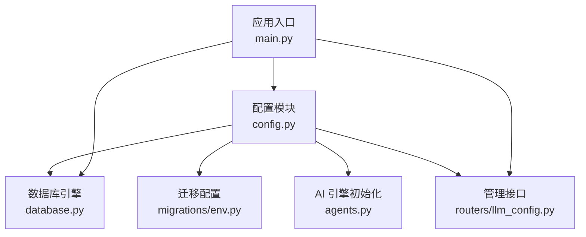
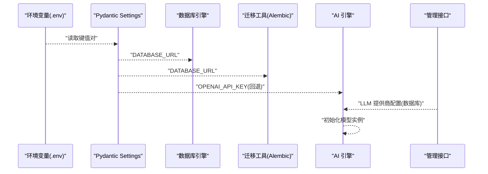
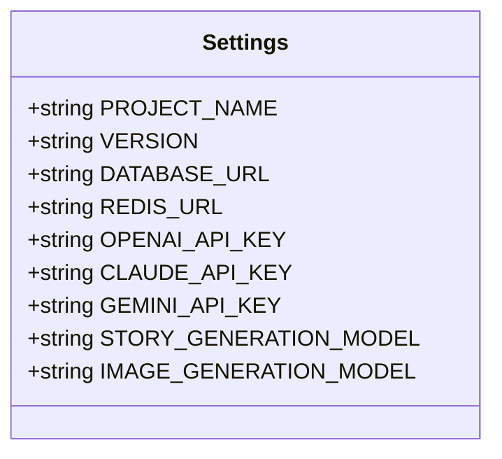
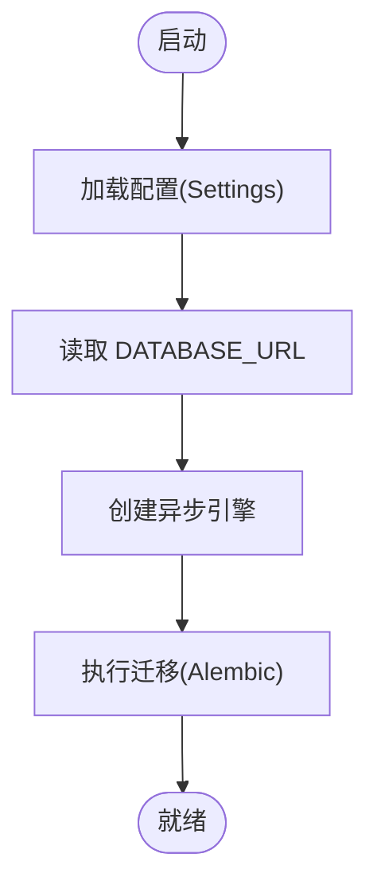
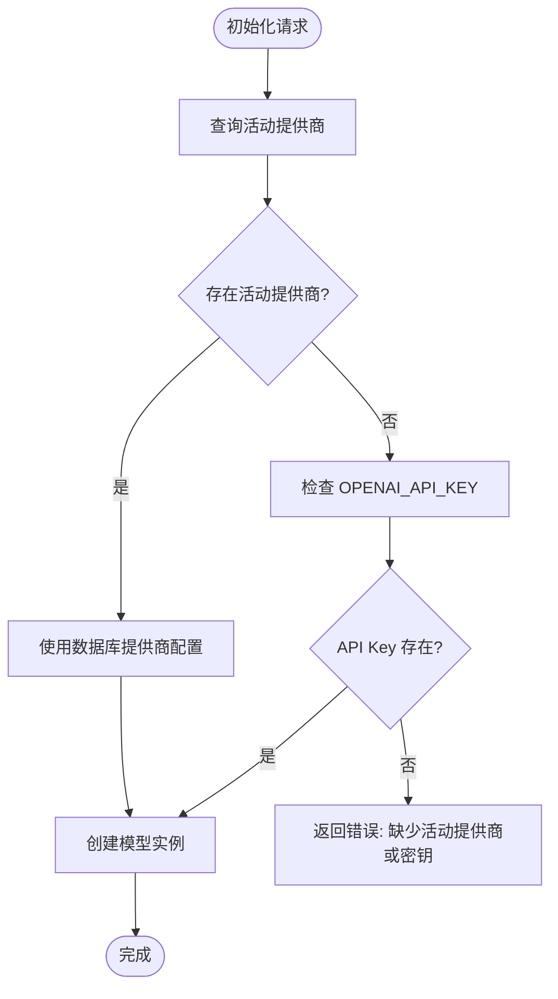
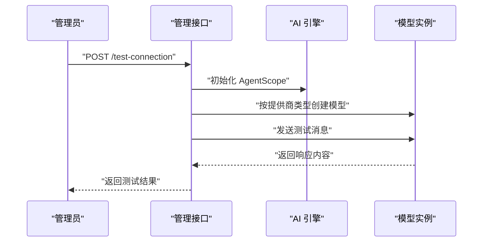
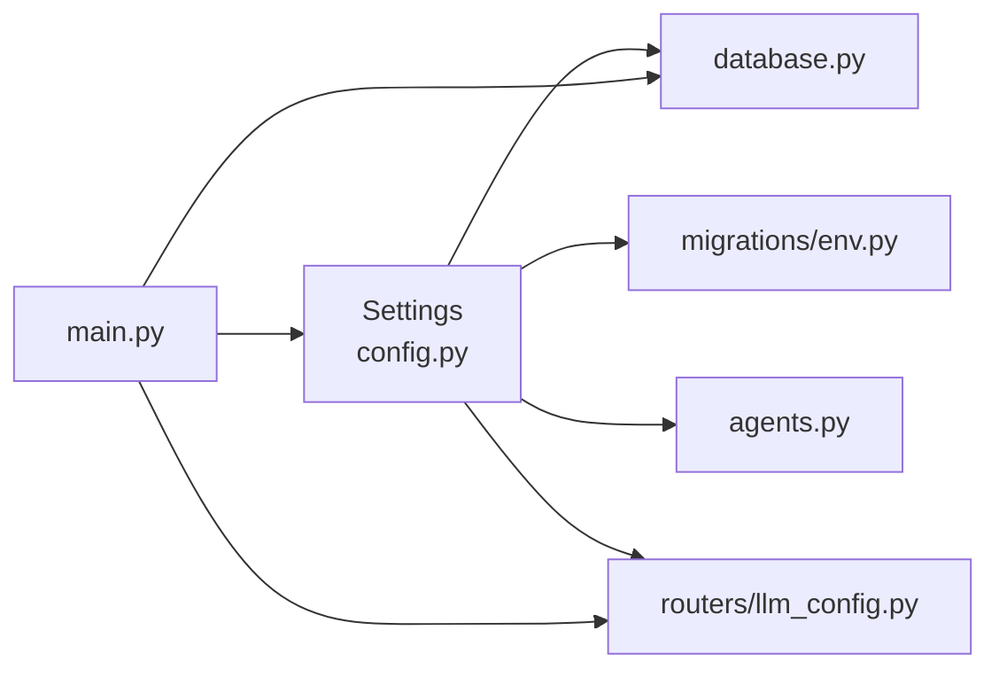

# 环境变量管理

<cite>
**本文档引用的文件**
- [backend/.env.example](file://backend/.env.example)
- [backend/config.py](file://backend/config.py)
- [backend/database.py](file://backend/database.py)
- [backend/main.py](file://backend/main.py)
- [backend/agents.py](file://backend/agents.py)
- [backend/migrations/env.py](file://backend/migrations/env.py)
- [backend/models.py](file://backend/models.py)
- [backend/routers/llm_config.py](file://backend/routers/llm_config.py)
- [backend/requirements.txt](file://backend/requirements.txt)
</cite>

## 目录
1. [简介](#简介)
2. [项目结构](#项目结构)
3. [核心组件](#核心组件)
4. [架构总览](#架构总览)
5. [详细组件分析](#详细组件分析)
6. [依赖关系分析](#依赖关系分析)
7. [性能考虑](#性能考虑)
8. [故障排除指南](#故障排除指南)
9. [结论](#结论)
10. [附录](#附录)

## 简介
本文件系统性梳理后端服务的环境变量管理，覆盖以下要点：
- 所有必需的环境变量名称、默认值与用途说明
- 开发、测试、生产环境的配置差异建议
- 敏感信息保护策略、变量加密存储与访问权限控制
- 环境变量验证机制、加载顺序与错误处理方法
- .env 文件模板与变量配置示例

## 项目结构
后端通过 Pydantic Settings 对环境变量进行集中管理，并在多个模块中按需读取：
- 配置层：集中定义默认值与 .env 加载路径
- 数据库层：从配置读取数据库连接串
- 迁移层：Alembic 通过配置获取数据库 URL
- 业务层：AI 引擎初始化时读取 API 密钥
- 管理接口：提供 LLM 提供商配置与连接测试

图表来源
- [backend/config.py](file://backend/config.py#L7-L33)
- [backend/database.py](file://backend/database.py#L8-L17)
- [backend/migrations/env.py](file://backend/migrations/env.py#L39-L40)
- [backend/agents.py](file://backend/agents.py#L68-L75)
- [backend/routers/llm_config.py](file://backend/routers/llm_config.py#L20-L110)
- [backend/main.py](file://backend/main.py#L83-L98)

章节来源
- [backend/config.py](file://backend/config.py#L1-L34)
- [backend/database.py](file://backend/database.py#L1-L31)
- [backend/migrations/env.py](file://backend/migrations/env.py#L1-L105)
- [backend/agents.py](file://backend/agents.py#L1-L196)
- [backend/routers/llm_config.py](file://backend/routers/llm_config.py#L1-L203)
- [backend/main.py](file://backend/main.py#L1-L173)

## 核心组件
- 配置类 Settings：集中定义所有环境变量键名、默认值与 .env 载入路径
- 数据库引擎：根据 DATABASE_URL 初始化异步连接
- 迁移工具：通过 Alembic 读取 DATABASE_URL 执行数据库迁移
- AI 引擎：优先从数据库加载活动提供商，回退到配置中的 API 密钥
- 管理接口：提供 LLM 提供商的增删改查与连接测试

章节来源
- [backend/config.py](file://backend/config.py#L7-L33)
- [backend/database.py](file://backend/database.py#L8-L17)
- [backend/migrations/env.py](file://backend/migrations/env.py#L39-L40)
- [backend/agents.py](file://backend/agents.py#L68-L75)
- [backend/routers/llm_config.py](file://backend/routers/llm_config.py#L20-L110)

## 架构总览
环境变量在应用生命周期中的加载与使用流程如下：

图表来源
- [backend/config.py](file://backend/config.py#L30-L31)
- [backend/database.py](file://backend/database.py#L8-L17)
- [backend/migrations/env.py](file://backend/migrations/env.py#L39-L40)
- [backend/agents.py](file://backend/agents.py#L68-L75)
- [backend/routers/llm_config.py](file://backend/routers/llm_config.py#L112-L138)

## 详细组件分析

### 配置类 Settings 与 .env 加载
- 加载源：通过设置 env_file 指向 .env 文件，实现键值对注入
- 默认值：为数据库、缓存、AI 密钥等提供本地开发可用的默认值
- 类型安全：基于 Pydantic Settings 的类型校验与转换

图表来源
- [backend/config.py](file://backend/config.py#L7-L28)

章节来源
- [backend/config.py](file://backend/config.py#L7-L33)

### 数据库引擎与迁移
- 数据库引擎：从配置读取 DATABASE_URL，按需设置 SQLite 或 PostgreSQL 连接参数
- 迁移工具：Alembic 通过 migrations/env.py 获取 DATABASE_URL 并执行迁移

图表来源
- [backend/database.py](file://backend/database.py#L8-L17)
- [backend/migrations/env.py](file://backend/migrations/env.py#L39-L40)

章节来源
- [backend/database.py](file://backend/database.py#L1-L31)
- [backend/migrations/env.py](file://backend/migrations/env.py#L1-L105)

### AI 引擎初始化与回退策略
- 优先级：从数据库加载活动 LLM 提供商；若无则回退到配置中的 OPENAI_API_KEY
- 初始化：根据提供商类型选择对应模型实例，并支持自定义 base_url 与额外配置

图表来源
- [backend/agents.py](file://backend/agents.py#L68-L75)
- [backend/agents.py](file://backend/agents.py#L101-L129)

章节来源
- [backend/agents.py](file://backend/agents.py#L49-L129)

### 管理接口与连接测试
- 提供商管理：支持创建、查询、更新、删除 LLM 提供商
- 连接测试：根据传入的提供商类型动态构造模型实例并发送测试消息

图表来源
- [backend/routers/llm_config.py](file://backend/routers/llm_config.py#L20-L110)

章节来源
- [backend/routers/llm_config.py](file://backend/routers/llm_config.py#L1-L203)

## 依赖关系分析
- 配置依赖：database.py、migrations/env.py、agents.py、routers/llm_config.py 均依赖 Settings
- 运行时依赖：main.py 在启动阶段加载配置并注册路由

图表来源
- [backend/config.py](file://backend/config.py#L30-L31)
- [backend/database.py](file://backend/database.py#L3)
- [backend/migrations/env.py](file://backend/migrations/env.py#L15)
- [backend/agents.py](file://backend/agents.py#L5)
- [backend/routers/llm_config.py](file://backend/routers/llm_config.py#L8)
- [backend/main.py](file://backend/main.py#L40)

章节来源
- [backend/config.py](file://backend/config.py#L1-L34)
- [backend/main.py](file://backend/main.py#L1-L173)

## 性能考虑
- 连接池参数：数据库引擎设置了连接池大小与溢出数量，有助于并发场景下的稳定性
- 迁移执行：在应用启动阶段执行迁移，避免运行期失败
- 模型初始化：仅在需要时初始化 AI 模型，减少不必要的资源占用

章节来源
- [backend/database.py](file://backend/database.py#L14-L17)
- [backend/main.py](file://backend/main.py#L45-L81)

## 故障排除指南
- 数据库连接失败
  - 检查 DATABASE_URL 是否正确
  - 确认数据库服务可达且凭据有效
  - 查看启动日志中的重试与错误信息
- 迁移失败
  - 确认 Alembic 配置与 DATABASE_URL 一致
  - 使用命令行手动执行迁移以定位问题
- AI 引擎未初始化
  - 确认数据库中存在活动的 LLM 提供商
  - 若无，确保 OPENAI_API_KEY 已在 .env 中配置
- 管理接口测试失败
  - 检查提供商类型与 API Key 是否匹配
  - 确认网络可访问对应的模型服务端点

章节来源
- [backend/main.py](file://backend/main.py#L45-L81)
- [backend/migrations/env.py](file://backend/migrations/env.py#L39-L40)
- [backend/agents.py](file://backend/agents.py#L68-L75)
- [backend/routers/llm_config.py](file://backend/routers/llm_config.py#L20-L110)

## 结论
本项目的环境变量管理采用集中式配置与分层加载策略，既满足本地开发的最小化配置需求，又为多环境部署预留了扩展空间。通过数据库驱动的 LLM 提供商管理，实现了更灵活的密钥与模型配置方案。

## 附录

### 环境变量清单与用途
- DATABASE_URL
  - 默认值：SQLite（绝对路径）
  - 用途：数据库连接串
  - 示例：PostgreSQL 或 SQLite
- REDIS_URL
  - 默认值：本地 Redis
  - 用途：缓存与会话存储
- OPENAI_API_KEY
  - 默认值：空字符串
  - 用途：AI 模型调用密钥（回退路径）
- CLAUDE_API_KEY
  - 默认值：空字符串
  - 用途：Claude 模型调用密钥（如启用）
- GEMINI_API_KEY
  - 默认值：空字符串
  - 用途：Gemini 模型调用密钥（如启用）
- STORY_GENERATION_MODEL
  - 默认值：特定模型名称
  - 用途：故事生成模型名称
- IMAGE_GENERATION_MODEL
  - 默认值：特定模型名称
  - 用途：图像生成模型名称

章节来源
- [backend/config.py](file://backend/config.py#L11-L28)
- [backend/.env.example](file://backend/.env.example#L1-L4)

### 开发/测试/生产环境配置差异建议
- 开发环境
  - 使用 SQLite 作为默认数据库，便于快速启动
  - 本地 Redis 用于缓存
  - 可临时使用 OPENAI_API_KEY 进行功能验证
- 测试环境
  - 使用独立的测试数据库与缓存实例
  - 限制并发与速率，避免影响生产
- 生产环境
  - 使用强密码与 SSL 的数据库连接
  - 使用专用密钥管理服务（见下节）与只读权限
  - 配置高可用与监控告警

### 敏感信息保护策略
- 密钥管理
  - 使用密钥管理服务（如云厂商 KMS、Vault）存储与轮换密钥
  - 应用仅持有最小权限的访问令牌
- 加密存储
  - 将数据库中的敏感字段（如 LLM 提供商的 API Key）加密存储
  - 传输过程使用 TLS
- 访问控制
  - 限制 .env 与配置文件的文件系统权限
  - 通过 IAM 角色与网络 ACL 控制访问
  - 定期审计密钥使用日志

### 环境变量验证机制与加载顺序
- 加载顺序
  - 应用启动时由 Pydantic Settings 从 .env 文件读取并注入
  - 数据库引擎与迁移工具随后读取配置
- 验证机制
  - 类型校验与默认值回退
  - 启动阶段的数据库连接与迁移尝试
  - 管理接口的连接测试

章节来源
- [backend/config.py](file://backend/config.py#L30-L31)
- [backend/main.py](file://backend/main.py#L45-L81)
- [backend/routers/llm_config.py](file://backend/routers/llm_config.py#L20-L110)

### .env 文件模板与配置示例
- .env 示例文件
  - 包含数据库与缓存的基本连接串
  - 为空的 AI 密钥字段，便于后续填写
- 配置示例
  - 开发：使用默认 SQLite 与本地 Redis
  - 测试：指向测试数据库与独立缓存
  - 生产：使用外部数据库与缓存，配置密钥管理服务

章节来源
- [backend/.env.example](file://backend/.env.example#L1-L4)