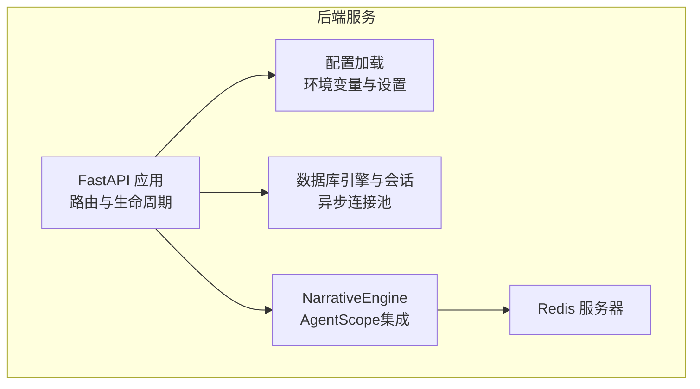
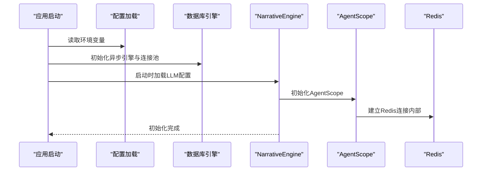
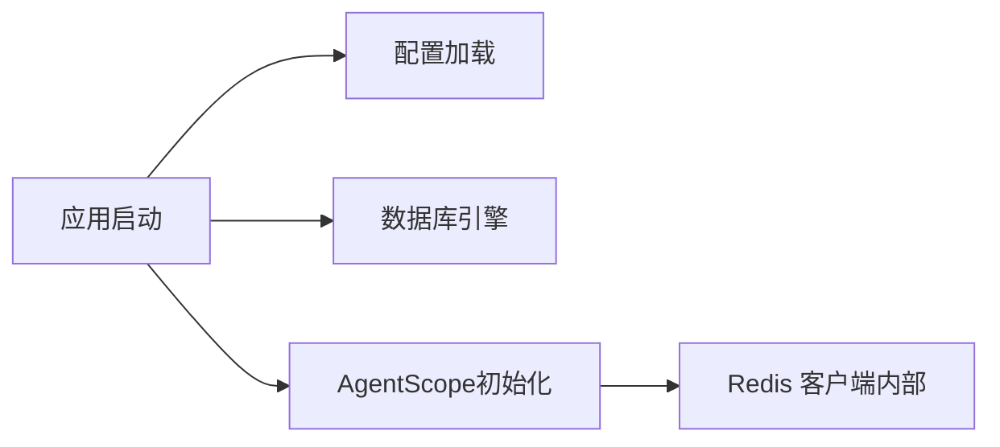

# 缓存配置

<cite>
**本文引用的文件**
- [config.py](file://backend/config.py)
- [.env.example](file://backend/.env.example)
- [requirements.txt](file://backend/requirements.txt)
- [database.py](file://backend/database.py)
- [main.py](file://backend/main.py)
- [models.py](file://backend/models.py)
- [agents.py](file://backend/agents.py)
- [services.py](file://backend/services.py)
</cite>

## 目录
1. [简介](#简介)
2. [项目结构](#项目结构)
3. [核心组件](#核心组件)
4. [架构总览](#架构总览)
5. [详细组件分析](#详细组件分析)
6. [依赖关系分析](#依赖关系分析)
7. [性能考虑](#性能考虑)
8. [故障排查指南](#故障排查指南)
9. [结论](#结论)
10. [附录](#附录)

## 简介
本文件聚焦于项目中的Redis缓存配置与使用现状，结合现有代码对Redis连接参数、连接池大小、缓存键命名、过期策略、内存淘汰、失效处理、缓存预热、穿透与雪崩防护、性能监控与调优建议进行系统化梳理，并给出不同场景的最佳实践建议。需要特别说明的是：当前仓库中未发现直接使用Redis客户端（如redis-py）进行键值缓存的实现；项目通过第三方库AgentScope在会话与工作记忆模块中间接使用了Redis，但并未暴露统一的键空间与过期策略配置。因此，本文在“可落地”的部分以AgentScope的Redis使用为依据，在“通用实践”部分提供面向键值缓存的建议。

## 项目结构
后端采用FastAPI + SQLAlchemy异步ORM + AgentScope的组合。Redis作为AgentScope内部会话与工作记忆的存储介质被间接使用，但未在本仓库中形成统一的键空间与过期策略。数据库连接池参数在数据库层已显式配置，可作为连接池优化的参考。

图表来源
- [main.py](file://backend/main.py#L45-L82)
- [config.py](file://backend/config.py#L7-L34)
- [database.py](file://backend/database.py#L8-L23)
- [agents.py](file://backend/agents.py#L101-L129)

章节来源
- [main.py](file://backend/main.py#L45-L82)
- [config.py](file://backend/config.py#L7-L34)
- [database.py](file://backend/database.py#L8-L23)

## 核心组件
- 配置与环境
  - Redis连接地址通过环境变量加载，位于配置类中，便于在不同环境切换。
  - 环境示例文件提供了默认的Redis连接字符串。
- 数据库连接池
  - 异步引擎已显式配置连接池大小与溢出连接数，体现对连接资源的控制意识。
- AgentScope与Redis
  - 项目引入AgentScope并在运行时初始化，其内部工作记忆与会话可能使用Redis作为持久化存储，但未在本仓库中定义统一的键前缀与过期策略。
- 模型与缓存字段
  - 数据模型中存在与缓存相关的字段（如最后访问时间），可用于后续扩展键值缓存的元数据管理。

章节来源
- [config.py](file://backend/config.py#L18-L19)
- [.env.example](file://backend/.env.example#L3-L3)
- [database.py](file://backend/database.py#L8-L23)
- [requirements.txt](file://backend/requirements.txt#L8-L8)
- [models.py](file://backend/models.py#L54-L56)
- [agents.py](file://backend/agents.py#L101-L129)

## 架构总览
下图展示了应用启动阶段与外部依赖的关系，以及AgentScope如何间接依赖Redis：

图表来源
- [main.py](file://backend/main.py#L45-L82)
- [config.py](file://backend/config.py#L7-L34)
- [database.py](file://backend/database.py#L8-L23)
- [agents.py](file://backend/agents.py#L101-L129)

## 详细组件分析

### Redis连接参数与环境配置
- 连接URL来源
  - 配置类中定义了Redis连接字符串，默认指向本地Redis实例。
  - 环境示例文件提供了默认的Redis连接字符串，便于开发与部署时覆盖。
- 使用现状
  - 当前仓库未直接在业务代码中显式创建Redis客户端实例或设置连接池参数；AgentScope内部使用redis.asyncio进行连接与操作，但未暴露统一的键空间与过期策略配置。

章节来源
- [config.py](file://backend/config.py#L18-L19)
- [.env.example](file://backend/.env.example#L3-L3)
- [requirements.txt](file://backend/requirements.txt#L8-L8)

### 连接池大小与资源管理
- 数据库连接池参数已在数据库层显式配置，包括连接池大小与最大溢出连接数，体现了对并发与资源占用的控制。
- 对比建议
  - 若未来引入独立的Redis客户端，可参考数据库连接池的思路，设置合理的连接池大小、空闲超时与重试策略，避免连接泄露与资源耗尽。

章节来源
- [database.py](file://backend/database.py#L8-L23)

### 缓存键命名规范（基于AgentScope现状）
- 当前未在本仓库中定义统一的键前缀与命名规则。
- 建议（通用实践）
  - 采用分层命名：业务域:子域:实体类型:标识:版本
  - 示例：session:user:chat:12345:v1
  - 为会话、工作记忆、用户偏好等不同对象域设置独立前缀，便于清理与迁移。

### 缓存过期策略（基于AgentScope现状）
- 当前未在本仓库中定义统一的过期策略。
- 建议（通用实践）
  - 会话类键：短期过期（如30分钟至2小时），结合后台刷新。
  - 工作记忆类键：按对话轮次或最近活跃时间设定过期。
  - 公共配置类键：较长过期（如数天），并配合版本号或ETag。
  - 使用随机抖动避免同时过期导致的雪崩。

### 内存淘汰机制（基于AgentScope现状）
- 当前未在本仓库中显式配置Redis内存淘汰策略。
- 建议（通用实践）
  - 生产环境建议开启LRU/LFU等策略，结合maxmemory设置，确保稳定可用内存。
  - 对高频键设置更长生存时间，低频键缩短过期时间。

### 缓存失效处理（基于AgentScope现状）
- 当前未在本仓库中定义统一的失效策略。
- 建议（通用实践）
  - 主动失效：配置变更或版本升级时主动删除旧键。
  - 被动失效：依赖TTL自动过期，结合后台任务定期清理。
  - 失效风暴防护：对批量失效加锁或分批执行。

### 缓存预热
- 建议（通用实践）
  - 启动时预热热点键（如常用提示词、模板、用户偏好）。
  - 使用后台任务在低峰期预生成内容键，降低首屏延迟。

### 缓存穿透防护
- 建议（通用实践）
  - 布隆过滤器：拦截不存在的Key请求。
  - 空值缓存：对查询结果为空也写入短寿命缓存键，防止持续穿透。

### 缓存雪崩预防
- 建议（通用实践）
  - 过期时间随机化：在基准过期时间基础上增加抖动。
  - 多级缓存：本地缓存+分布式缓存，降低单点压力。
  - 限流与熔断：对上游依赖进行限流与快速失败。

### 性能监控与调优
- 建议（通用实践）
  - 指标采集：命中率、响应时间、内存使用、连接数、过期键数量。
  - 分层观测：应用侧统计命中率，Redis侧关注内存与慢查询。
  - 调优方向：根据指标调整过期策略、连接池大小、批量操作粒度。

### 不同场景的最佳实践
- 高频读场景（如用户偏好）
  - 短过期+本地缓存+后台刷新；对冷数据设置更短TTL。
- 低频写场景（如配置中心）
  - 长过期+版本号；写入时更新版本并触发失效。
- 会话与工作记忆
  - 短过期+随机抖动；结合后台任务清理僵尸会话。
- 批量操作
  - 使用pipeline或mget/mset提升吞吐；注意内存峰值。

## 依赖关系分析
- 组件耦合
  - 应用启动阶段依赖配置加载与数据库连接池初始化。
  - AgentScope在运行时被初始化，内部使用Redis，但未在本仓库中暴露键空间与过期策略。
- 外部依赖
  - Redis客户端库已作为依赖引入，但未在业务代码中直接使用。
- 潜在风险
  - 缺少统一的键空间与过期策略，可能导致键冲突、内存膨胀与维护困难。

图表来源
- [main.py](file://backend/main.py#L45-L82)
- [config.py](file://backend/config.py#L7-L34)
- [database.py](file://backend/database.py#L8-L23)
- [agents.py](file://backend/agents.py#L101-L129)
- [requirements.txt](file://backend/requirements.txt#L8-L8)

章节来源
- [requirements.txt](file://backend/requirements.txt#L8-L8)
- [agents.py](file://backend/agents.py#L101-L129)

## 性能考虑
- 连接池与并发
  - 参考数据库连接池参数，合理设置Redis连接池大小与超时，避免阻塞与资源浪费。
- 过期策略与内存
  - 结合业务特征设计过期策略，避免大量键同时过期引发抖动。
- 读写分离与多级缓存
  - 在高并发场景下，优先使用本地缓存与热点数据驻留，降低Redis压力。
- 监控与告警
  - 建立命中率、内存使用、慢查询等关键指标的监控与阈值告警。

## 故障排查指南
- 连接失败
  - 检查Redis连接URL是否正确，网络连通性与认证信息。
  - 观察应用日志与AgentScope初始化过程中的异常信息。
- 命中率低
  - 排查过期策略是否过于保守或频繁失效；检查键命名是否一致。
- 内存增长
  - 检查是否存在未清理的临时键；评估淘汰策略是否合适。
- 雪崩现象
  - 检查过期时间是否集中；确认是否启用随机抖动与多级缓存。

## 结论
当前仓库中Redis主要用于AgentScope内部的会话与工作记忆存储，尚未形成统一的键空间与过期策略。建议在后续迭代中：
- 明确键命名规范与过期策略；
- 引入统一的Redis客户端封装与连接池配置；
- 建立缓存预热、穿透与雪崩防护机制；
- 完善监控与调优流程，确保在高并发场景下的稳定性与性能。

## 附录
- 相关文件路径
  - 配置与环境：[config.py](file://backend/config.py#L18-L19)，[.env.example](file://backend/.env.example#L3-L3)
  - 依赖声明：[requirements.txt](file://backend/requirements.txt#L8-L8)
  - 数据库连接池：[database.py](file://backend/database.py#L8-L23)
  - 应用启动与生命周期：[main.py](file://backend/main.py#L45-L82)
  - AgentScope初始化：[agents.py](file://backend/agents.py#L101-L129)
  - 模型与缓存字段：[models.py](file://backend/models.py#L54-L56)
  - 业务服务（可扩展缓存）：[services.py](file://backend/services.py#L1-L66)