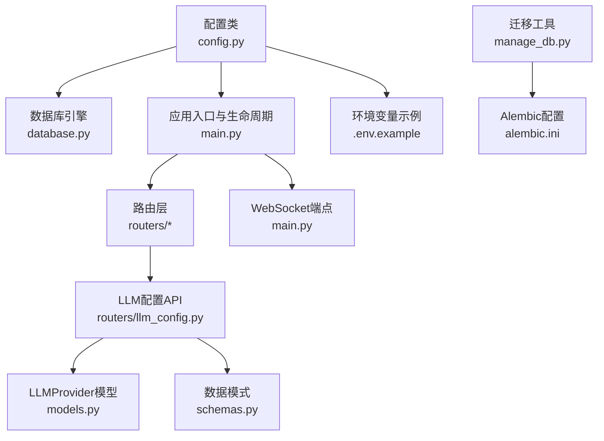
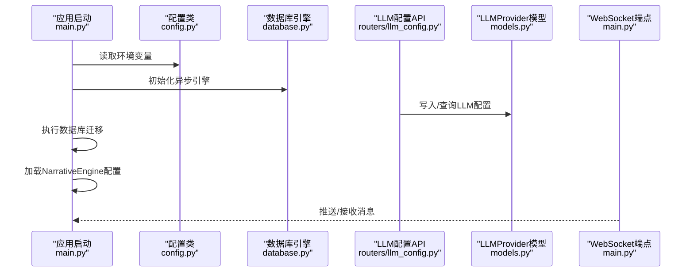
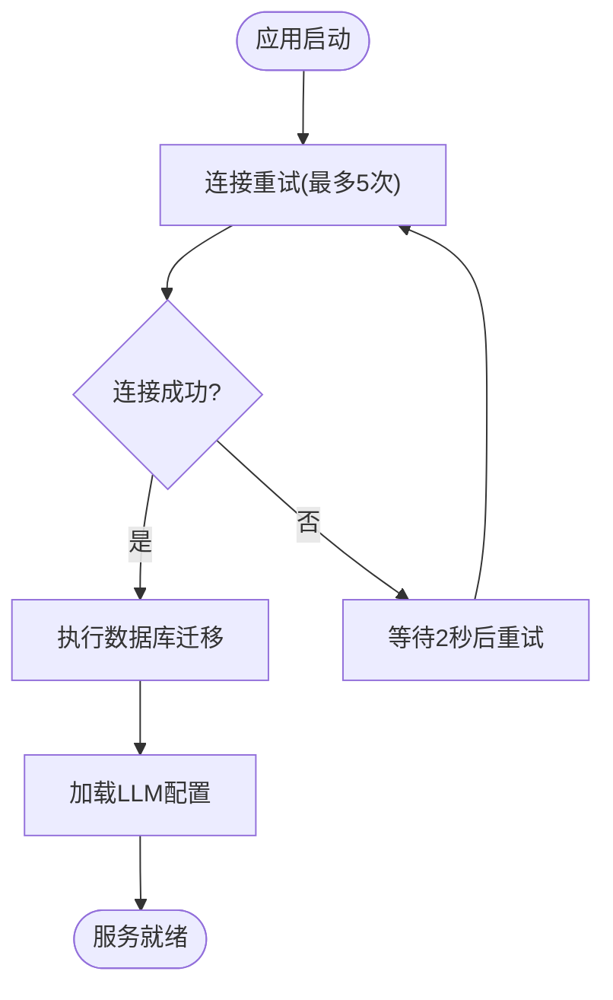
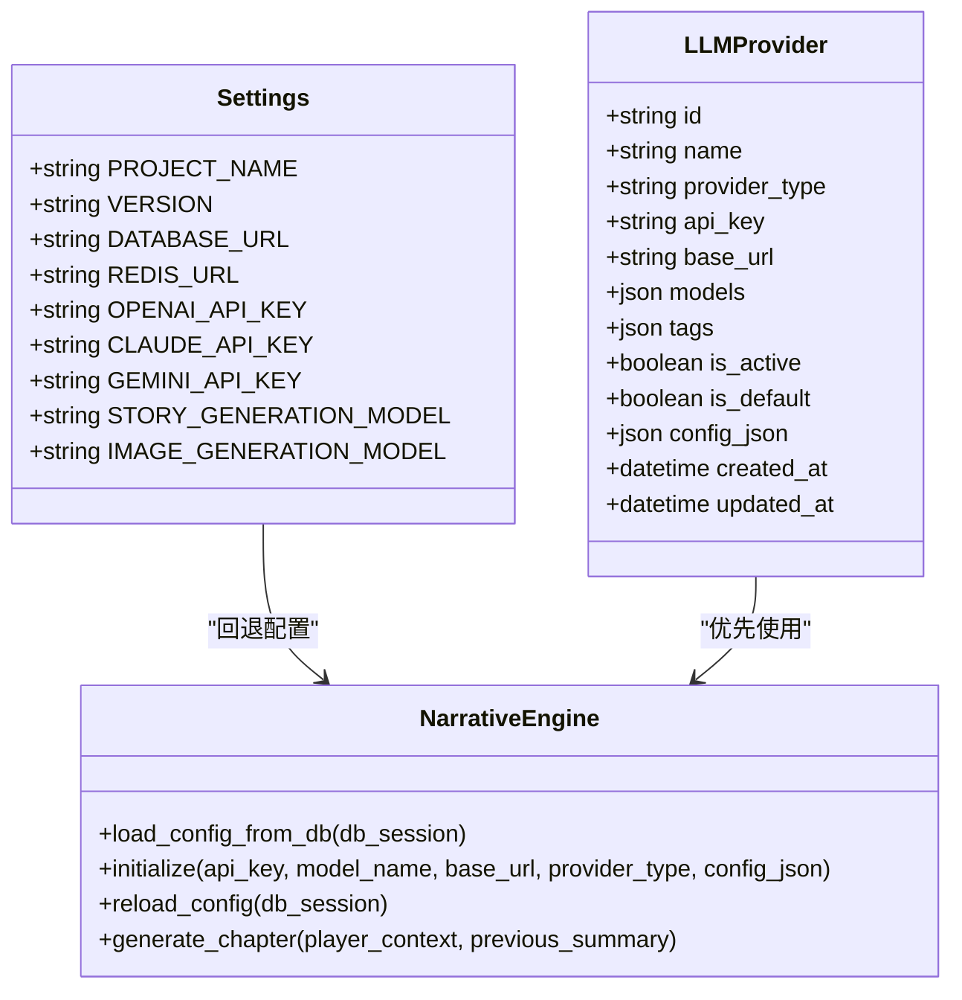
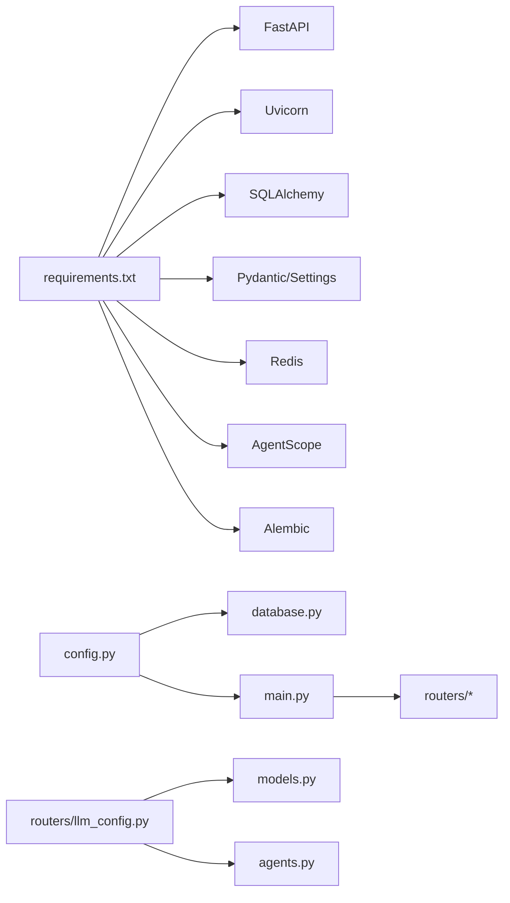

# 配置管理

<cite>
**本文引用的文件**
- [backend/.env.example](file://backend/.env.example)
- [backend/config.py](file://backend/config.py)
- [backend/main.py](file://backend/main.py)
- [backend/database.py](file://backend/database.py)
- [backend/agents.py](file://backend/agents.py)
- [backend/routers/llm_config.py](file://backend/routers/llm_config.py)
- [backend/models.py](file://backend/models.py)
- [backend/schemas.py](file://backend/schemas.py)
- [backend/requirements.txt](file://backend/requirements.txt)
- [backend/manage_db.py](file://backend/manage_db.py)
- [backend/alembic.ini](file://backend/alembic.ini)
- [docs/wiki/Backend-Guide.md](file://docs/wiki/Backend-Guide.md)
- [docs/wiki/Deployment.md](file://docs/wiki/Deployment.md)
</cite>

## 目录
1. [简介](#简介)
2. [项目结构](#项目结构)
3. [核心组件](#核心组件)
4. [架构总览](#架构总览)
5. [详细组件分析](#详细组件分析)
6. [依赖分析](#依赖分析)
7. [性能考虑](#性能考虑)
8. [故障排查指南](#故障排查指南)
9. [结论](#结论)
10. [附录](#附录)

## 简介
本指南聚焦于后端服务的配置管理，涵盖数据库连接、Redis缓存、LLM提供商API密钥管理以及WebSocket连接设置。文档提供不同环境（开发、测试、生产）的最佳实践，解释敏感信息保护、配置文件安全与环境变量管理策略，并给出配置验证机制与故障诊断方法，同时提供配置模板与示例路径。

## 项目结构
后端配置相关的关键文件分布如下：
- 配置类与环境变量：config.py
- 应用入口与生命周期：main.py
- 数据库引擎与会话：database.py
- LLM配置管理API：routers/llm_config.py
- LLM配置持久化模型：models.py
- 请求/响应数据模型：schemas.py
- 依赖与运行时组件：requirements.txt
- 数据库迁移工具：manage_db.py、alembic.ini
- 示例环境变量：.env.example
- 文档与部署说明：docs/wiki/Backend-Guide.md、docs/wiki/Deployment.md

图表来源
- [backend/config.py](file://backend/config.py#L1-L34)
- [backend/database.py](file://backend/database.py#L1-L31)
- [backend/main.py](file://backend/main.py#L1-L173)
- [backend/routers/llm_config.py](file://backend/routers/llm_config.py#L1-L203)
- [backend/models.py](file://backend/models.py#L58-L79)
- [backend/schemas.py](file://backend/schemas.py#L4-L42)
- [backend/manage_db.py](file://backend/manage_db.py#L1-L67)
- [backend/alembic.ini](file://backend/alembic.ini#L1-L115)
- [backend/.env.example](file://backend/.env.example#L1-L4)

章节来源
- [backend/config.py](file://backend/config.py#L1-L34)
- [backend/main.py](file://backend/main.py#L1-L173)
- [backend/database.py](file://backend/database.py#L1-L31)
- [backend/routers/llm_config.py](file://backend/routers/llm_config.py#L1-L203)
- [backend/models.py](file://backend/models.py#L58-L79)
- [backend/schemas.py](file://backend/schemas.py#L4-L42)
- [backend/manage_db.py](file://backend/manage_db.py#L1-L67)
- [backend/alembic.ini](file://backend/alembic.ini#L1-L115)
- [backend/.env.example](file://backend/.env.example#L1-L4)
- [docs/wiki/Backend-Guide.md](file://docs/wiki/Backend-Guide.md#L1-L108)
- [docs/wiki/Deployment.md](file://docs/wiki/Deployment.md#L1-L65)

## 核心组件
- 配置类 Settings：集中定义项目名称、版本、数据库URL、Redis URL、LLM提供商API密钥、默认生成模型等，并通过环境文件加载。
- 数据库引擎：基于SQLAlchemy异步引擎，支持SQLite与PostgreSQL，内置连接池与自动重连参数。
- LLM配置API：提供LLM提供商的增删改查与连接测试，支持多种提供商类型与自定义base_url。
- 应用入口与生命周期：FastAPI应用，包含CORS中间件、路由注册、数据库迁移与NarrativeEngine初始化。
- WebSocket端点：提供实时消息通道，用于推送剧情更新与接收玩家输入。
- 迁移与版本控制：Alembic配置与命令行迁移工具，确保数据库结构演进可控。

章节来源
- [backend/config.py](file://backend/config.py#L7-L34)
- [backend/database.py](file://backend/database.py#L8-L23)
- [backend/routers/llm_config.py](file://backend/routers/llm_config.py#L14-L18)
- [backend/main.py](file://backend/main.py#L83-L98)
- [backend/main.py](file://backend/main.py#L157-L169)
- [backend/manage_db.py](file://backend/manage_db.py#L20-L38)
- [backend/alembic.ini](file://backend/alembic.ini#L3-L50)

## 架构总览
下图展示配置在系统中的作用与流向：应用启动时读取环境变量，构建数据库引擎；LLM配置通过API写入数据库并在需要时加载到NarrativeEngine；WebSocket端点用于实时通信。

图表来源
- [backend/main.py](file://backend/main.py#L45-L81)
- [backend/config.py](file://backend/config.py#L7-L34)
- [backend/database.py](file://backend/database.py#L8-L23)
- [backend/routers/llm_config.py](file://backend/routers/llm_config.py#L112-L138)
- [backend/models.py](file://backend/models.py#L58-L79)
- [backend/main.py](file://backend/main.py#L157-L169)

## 详细组件分析

### 配置类与环境变量（Settings）
- 作用：集中管理项目名称、版本、数据库URL、Redis URL、LLM提供商API密钥、默认生成模型等。
- 设置方法：通过.env文件覆盖默认值；默认使用SQLite以简化本地开发。
- 关键字段：
  - DATABASE_URL：默认SQLite，可切换为PostgreSQL。
  - REDIS_URL：默认本地Redis。
  - OPENAI_API_KEY/CLAUDE_API_KEY/GEMINI_API_KEY：LLM提供商密钥。
  - STORY_GENERATION_MODEL/IMAGE_GENERATION_MODEL：默认模型名称。
- 验证机制：Pydantic Settings自动从.env文件加载并校验类型。

章节来源
- [backend/config.py](file://backend/config.py#L7-L34)
- [backend/.env.example](file://backend/.env.example#L1-L4)

### 数据库连接与连接池
- 引擎参数：echo关闭、pool_pre_ping启用、pool_size与max_overflow控制连接池容量；SQLite使用特殊connect_args。
- 会话管理：AsyncSessionLocal提供异步会话工厂，expire_on_commit避免过期对象访问。
- 生命周期：应用启动时进行数据库连接重试与迁移，确保服务可用。

图表来源
- [backend/main.py](file://backend/main.py#L45-L81)
- [backend/database.py](file://backend/database.py#L8-L23)

章节来源
- [backend/database.py](file://backend/database.py#L8-L23)
- [backend/main.py](file://backend/main.py#L45-L81)

### LLM提供商API密钥管理
- 存储：LLMProvider模型包含name、provider_type、api_key、base_url、models、tags、is_active、is_default、config_json等字段。
- 动态加载：NarrativeEngine根据数据库中is_active为True的记录优先加载，若为空则回退到配置类中的OPENAI_API_KEY。
- API能力：
  - 创建/查询/更新/删除LLM提供商。
  - 测试连接：支持OpenAI、Azure、DashScope、Anthropic、Gemini等类型，可传入base_url与额外配置。
- 安全建议：生产环境建议对api_key进行加密存储与访问控制，限制API密钥权限范围。

图表来源
- [backend/models.py](file://backend/models.py#L58-L79)
- [backend/config.py](file://backend/config.py#L21-L28)
- [backend/agents.py](file://backend/agents.py#L49-L130)

章节来源
- [backend/models.py](file://backend/models.py#L58-L79)
- [backend/schemas.py](file://backend/schemas.py#L4-L42)
- [backend/routers/llm_config.py](file://backend/routers/llm_config.py#L112-L203)
- [backend/agents.py](file://backend/agents.py#L49-L130)

### WebSocket连接设置
- 端点：/ws/{player_id}，接受WebSocket连接，循环接收文本消息并回显。
- 使用场景：向客户端推送剧情更新、接收玩家输入。
- 建议：在生产环境增加心跳、鉴权与错误恢复机制。

章节来源
- [backend/main.py](file://backend/main.py#L157-L169)

### Redis缓存配置
- 用途：用于缓存与会话管理（如聊天会话、临时状态）。
- 默认地址：redis://localhost:6379/0。
- 建议：生产环境使用独立Redis实例，开启认证与TLS，合理设置过期策略。

章节来源
- [backend/config.py](file://backend/config.py#L18-L19)
- [backend/.env.example](file://backend/.env.example#L3-L3)

### 数据库迁移与版本控制
- Alembic配置：script_location指向migrations目录，日志级别与处理器配置清晰。
- 命令行工具：支持创建迁移、升级、降级，便于在不同环境间同步数据库结构。

章节来源
- [backend/alembic.ini](file://backend/alembic.ini#L3-L50)
- [backend/manage_db.py](file://backend/manage_db.py#L20-L38)

## 依赖分析
- 运行时依赖：FastAPI、Uvicorn、SQLAlchemy、Pydantic、Pydantic Settings、asyncpg、aiosqlite、redis、websockets、python-dotenv、agentscope、openai、alembic、psycopg2-binary等。
- 组件耦合：
  - config.py与database.py强耦合（DATABASE_URL）。
  - routers/llm_config.py与models.py、agents.py紧密协作。
  - main.py贯穿生命周期、路由与WebSocket。

图表来源
- [backend/requirements.txt](file://backend/requirements.txt#L1-L20)
- [backend/config.py](file://backend/config.py#L1-L34)
- [backend/database.py](file://backend/database.py#L1-L31)
- [backend/main.py](file://backend/main.py#L1-L173)
- [backend/routers/llm_config.py](file://backend/routers/llm_config.py#L1-L203)
- [backend/models.py](file://backend/models.py#L1-L122)
- [backend/agents.py](file://backend/agents.py#L1-L196)

章节来源
- [backend/requirements.txt](file://backend/requirements.txt#L1-L20)
- [backend/config.py](file://backend/config.py#L1-L34)
- [backend/database.py](file://backend/database.py#L1-L31)
- [backend/main.py](file://backend/main.py#L1-L173)
- [backend/routers/llm_config.py](file://backend/routers/llm_config.py#L1-L203)
- [backend/models.py](file://backend/models.py#L1-L122)
- [backend/agents.py](file://backend/agents.py#L1-L196)

## 性能考虑
- 数据库连接池：合理设置pool_size与max_overflow，避免高并发下的连接争用。
- 连接预检：启用pool_pre_ping提升连接稳定性。
- 异步IO：使用异步引擎与会话，减少阻塞。
- LLM调用：在API层限制并发与超时，必要时引入队列与重试。
- WebSocket：控制消息频率与大小，实现心跳与断线重连。

## 故障排查指南
- 数据库连接失败
  - 检查DATABASE_URL格式与凭据。
  - 查看连接重试日志与迁移输出。
- LLM连接测试失败
  - 使用LLM配置API的测试接口，确认provider_type、api_key、base_url与模型名称。
  - 检查网络与代理设置。
- WebSocket断开
  - 确认端口未被占用，客户端与服务端版本兼容。
- 配置未生效
  - 确认.env文件存在且路径正确，重启服务以重新加载。
- 迁移异常
  - 使用manage_db.py执行upgrade/downgrade，查看Alembic日志。

章节来源
- [backend/main.py](file://backend/main.py#L45-L81)
- [backend/routers/llm_config.py](file://backend/routers/llm_config.py#L20-L111)
- [backend/manage_db.py](file://backend/manage_db.py#L30-L38)
- [backend/alembic.ini](file://backend/alembic.ini#L81-L115)

## 结论
本指南提供了后端服务配置管理的系统化方法，涵盖数据库、Redis、LLM提供商与WebSocket的配置要点与最佳实践。通过统一的配置类、严格的环境变量管理与完善的API验证流程，可在不同环境下稳定运行并易于扩展与维护。

## 附录

### 不同环境的最佳实践
- 开发环境
  - 使用SQLite与本地Redis，简化依赖。
  - 保持DEBUG日志，便于定位问题。
- 测试环境
  - 使用独立数据库与Redis实例，模拟生产网络。
  - 启用连接池与超时控制。
- 生产环境
  - 使用PostgreSQL与Redis集群，启用TLS与认证。
  - 严格限制API密钥权限，定期轮换。
  - 配置健康检查与告警。

章节来源
- [docs/wiki/Deployment.md](file://docs/wiki/Deployment.md#L14-L40)
- [docs/wiki/Backend-Guide.md](file://docs/wiki/Backend-Guide.md#L102-L108)

### 敏感信息保护与环境变量管理策略
- 将敏感信息（如API密钥、数据库密码）放入.env文件，加入.gitignore。
- 在CI/CD中使用受控的密文存储与注入。
- 对数据库连接串与Redis连接串进行最小权限授权。
- 定期审计配置变更与访问日志。

章节来源
- [backend/.env.example](file://backend/.env.example#L1-L4)
- [docs/wiki/Deployment.md](file://docs/wiki/Deployment.md#L26-L39)

### 配置验证机制与示例路径
- 配置类加载：通过Pydantic Settings自动从.env文件读取并校验类型。
- LLM连接测试：使用LLM配置API的测试接口，传入provider_type、api_key、base_url与模型名称。
- 数据库迁移：使用manage_db.py或直接调用python -m alembic命令。

章节来源
- [backend/config.py](file://backend/config.py#L30-L34)
- [backend/routers/llm_config.py](file://backend/routers/llm_config.py#L20-L111)
- [backend/manage_db.py](file://backend/manage_db.py#L20-L38)

### 配置模板与示例代码路径
- 环境变量模板：参考.backend/.env.example
- 配置类定义：参考.backend/config.py
- 数据库引擎配置：参考.backend/database.py
- LLM配置API：参考.backend/routers/llm_config.py
- LLMProvider模型：参考.backend/models.py
- 数据模型与Schema：参考.backend/models.py与.backend/schemas.py
- 应用入口与WebSocket：参考.backend/main.py
- 迁移工具与配置：参考.backend/manage_db.py与.backend/alembic.ini

章节来源
- [backend/.env.example](file://backend/.env.example#L1-L4)
- [backend/config.py](file://backend/config.py#L1-L34)
- [backend/database.py](file://backend/database.py#L1-L31)
- [backend/routers/llm_config.py](file://backend/routers/llm_config.py#L1-L203)
- [backend/models.py](file://backend/models.py#L58-L79)
- [backend/schemas.py](file://backend/schemas.py#L4-L42)
- [backend/main.py](file://backend/main.py#L1-L173)
- [backend/manage_db.py](file://backend/manage_db.py#L1-L67)
- [backend/alembic.ini](file://backend/alembic.ini#L1-L115)