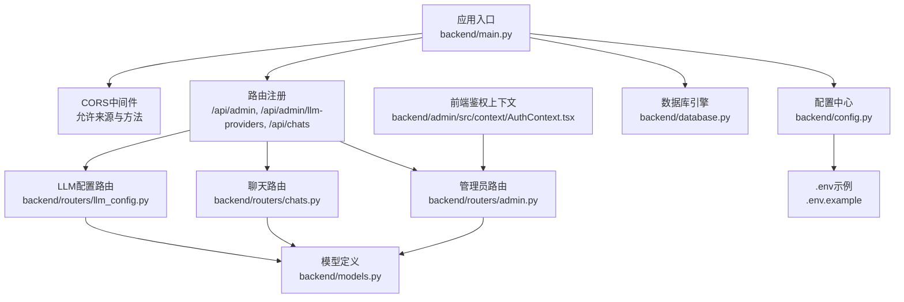
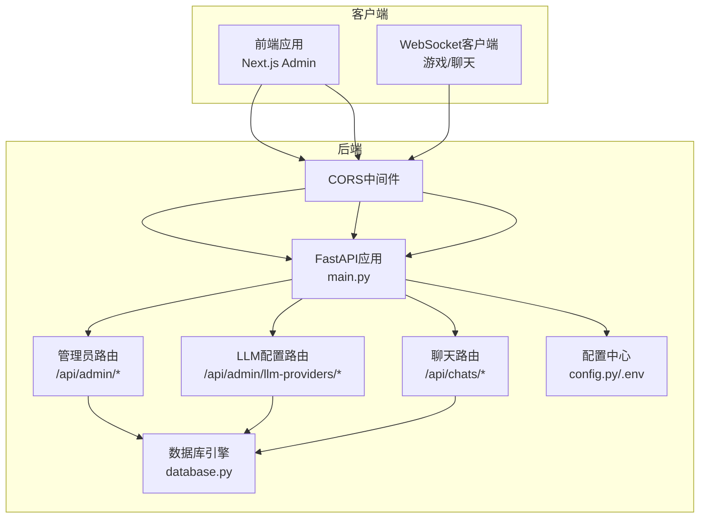
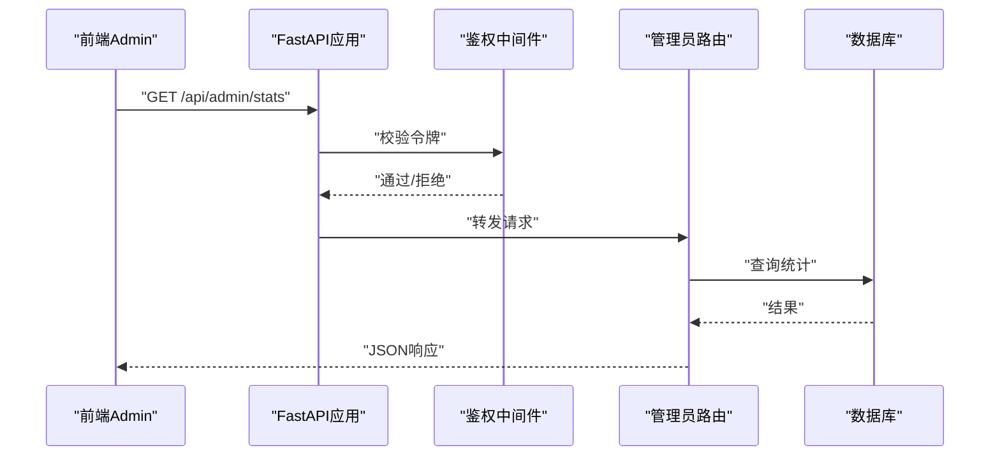
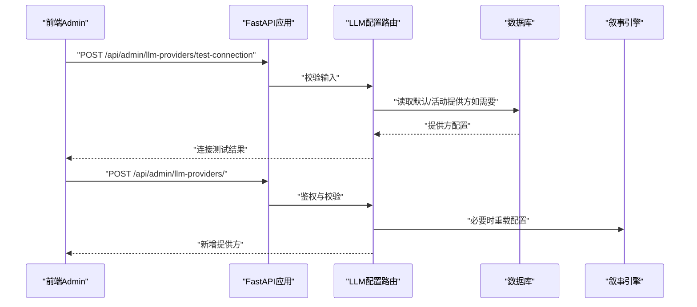
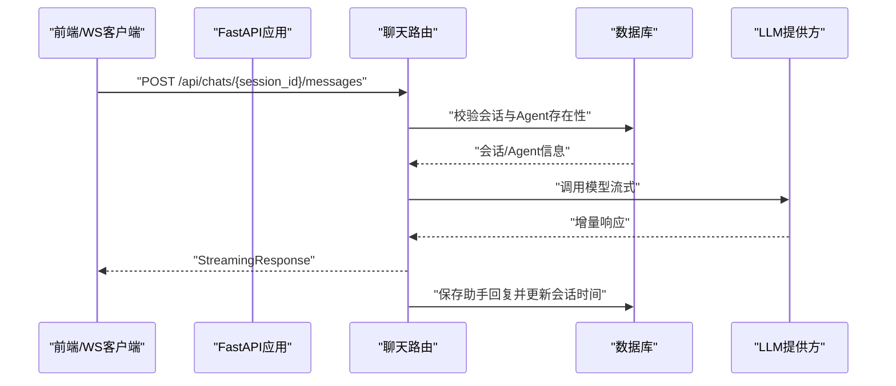
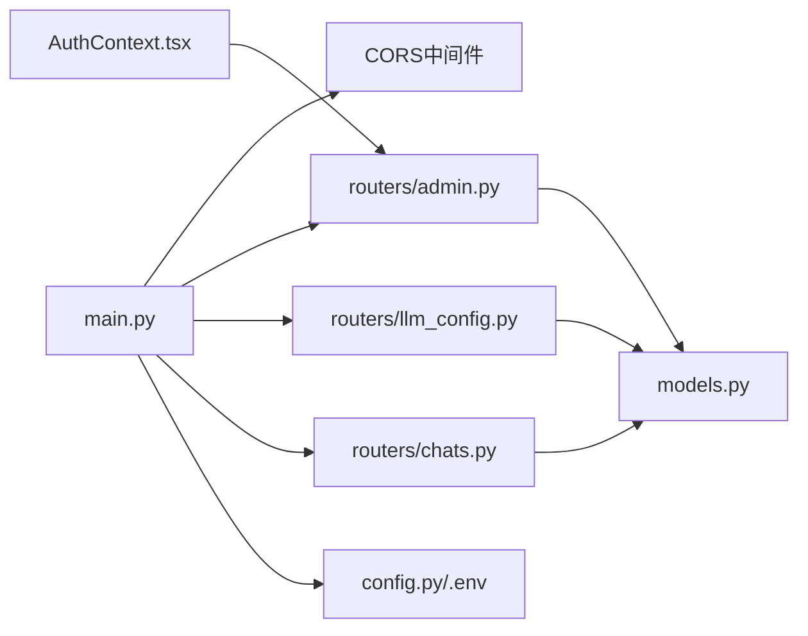

# API安全

<cite>
**本文引用的文件**
- [backend/main.py](file://backend/main.py)
- [backend/config.py](file://backend/config.py)
- [backend/.env.example](file://backend/.env.example)
- [backend/routers/admin.py](file://backend/routers/admin.py)
- [backend/routers/llm_config.py](file://backend/routers/llm_config.py)
- [backend/routers/chats.py](file://backend/routers/chats.py)
- [backend/models.py](file://backend/models.py)
- [backend/schemas.py](file://backend/schemas.py)
- [backend/database.py](file://backend/database.py)
- [backend/admin/src/context/AuthContext.tsx](file://backend/admin/src/context/AuthContext.tsx)
- [docs/wiki/Requirements-Traceability.md](file://docs/wiki/Requirements-Traceability.md)
</cite>

## 目录
1. [简介](#简介)
2. [项目结构](#项目结构)
3. [核心组件](#核心组件)
4. [架构总览](#架构总览)
5. [详细组件分析](#详细组件分析)
6. [依赖关系分析](#依赖关系分析)
7. [性能考量](#性能考量)
8. [故障排查指南](#故障排查指南)
9. [结论](#结论)
10. [附录](#附录)

## 简介
本文件聚焦于FastAPI后端的API安全配置与实践，覆盖以下方面：
- CORS跨域设置与安全头配置现状与改进建议
- 管理员路由的访问控制与鉴权机制
- LLM配置路由的安全限制与密钥处理
- 聊天路由的身份验证与会话安全
- API密钥管理最佳实践：生成、存储、轮换
- 请求验证与输入过滤：防范SQL注入与XSS
- 速率限制与防滥用机制的实现建议
- API安全测试与漏洞扫描建议

## 项目结构
后端采用FastAPI + SQLAlchemy异步ORM + Alembic迁移的典型分层架构：
- 应用入口与中间件：在应用启动时注册CORS中间件，并挂载各业务路由
- 配置中心：集中管理数据库、Redis、AI密钥等环境变量
- 路由层：按功能拆分，管理员、LLM配置、聊天等
- 模型与序列化：Pydantic模型用于请求/响应校验
- 数据库：异步引擎与依赖注入会话

图表来源
- [backend/main.py](file://backend/main.py#L83-L97)
- [backend/routers/admin.py](file://backend/routers/admin.py#L10-L14)
- [backend/routers/llm_config.py](file://backend/routers/llm_config.py#L14-L18)
- [backend/routers/chats.py](file://backend/routers/chats.py#L16-L20)
- [backend/config.py](file://backend/config.py#L7-L33)
- [backend/.env.example](file://backend/.env.example#L1-L4)
- [backend/database.py](file://backend/database.py#L8-L23)
- [backend/admin/src/context/AuthContext.tsx](file://backend/admin/src/context/AuthContext.tsx#L20-L35)

章节来源
- [backend/main.py](file://backend/main.py#L83-L97)
- [backend/config.py](file://backend/config.py#L7-L33)
- [backend/.env.example](file://backend/.env.example#L1-L4)
- [backend/database.py](file://backend/database.py#L8-L23)

## 核心组件
- CORS中间件：在应用启动时注册，允许本地开发环境的前端来源，支持凭据传递与通配方法/头
- 管理员路由：以/api/admin为前缀，提供统计、玩家列表、删除玩家、故事列表等接口
- LLM配置路由：以/api/admin/llm-providers为前缀，提供连接测试、增删改查LLM提供方
- 聊天路由：以/api/chats为前缀，提供会话创建、列表、消息查询、发送消息（流式）与删除会话
- 配置与密钥：通过Settings读取环境变量，包含OPENAI/CLAUDE/GEMINI等密钥字段
- 鉴权上下文：前端Admin侧通过localStorage保存令牌，未登录访问/admin路径将重定向到登录页

章节来源
- [backend/main.py](file://backend/main.py#L83-L97)
- [backend/routers/admin.py](file://backend/routers/admin.py#L10-L14)
- [backend/routers/llm_config.py](file://backend/routers/llm_config.py#L14-L18)
- [backend/routers/chats.py](file://backend/routers/chats.py#L16-L20)
- [backend/config.py](file://backend/config.py#L21-L28)
- [backend/admin/src/context/AuthContext.tsx](file://backend/admin/src/context/AuthContext.tsx#L20-L35)

## 架构总览
下图展示从客户端到后端路由与数据层的整体交互，以及当前已实现的安全要素（CORS、前端鉴权）与待强化点（后端鉴权、安全头、速率限制、输入过滤）。

图表来源
- [backend/main.py](file://backend/main.py#L83-L97)
- [backend/routers/admin.py](file://backend/routers/admin.py#L10-L14)
- [backend/routers/llm_config.py](file://backend/routers/llm_config.py#L14-L18)
- [backend/routers/chats.py](file://backend/routers/chats.py#L16-L20)
- [backend/database.py](file://backend/database.py#L8-L23)
- [backend/config.py](file://backend/config.py#L7-L33)

## 详细组件分析

### CORS设置与跨域请求控制
- 当前配置
  - 允许来源：本地开发端口（3000/3001），支持凭据传递
  - 允许方法与头：通配
- 安全建议
  - 生产环境应明确白名单来源，避免通配符
  - 严格控制暴露的自定义头与方法
  - 对敏感操作启用预检缓存并限制缓存时间
  - 结合安全头（如Content-Security-Policy、Strict-Transport-Security）提升整体安全性

章节来源
- [backend/main.py](file://backend/main.py#L85-L91)

### 管理员路由的权限验证与访问控制
- 现状
  - 路由位于/api/admin，未见后端鉴权装饰器或中间件
  - 前端通过AuthContext.tsx在本地存储令牌并进行路径拦截
- 安全建议
  - 在路由层引入统一的鉴权中间件或依赖项，校验JWT或API令牌
  - 对关键操作（删除玩家、更新LLM配置）实施最小权限原则
  - 引入审计日志记录管理员操作
  - 对列表接口增加分页与查询参数白名单，防止过度暴露

图表来源
- [backend/admin/src/context/AuthContext.tsx](file://backend/admin/src/context/AuthContext.tsx#L20-L35)
- [backend/routers/admin.py](file://backend/routers/admin.py#L16-L31)
- [backend/database.py](file://backend/database.py#L28-L30)

章节来源
- [backend/admin/src/context/AuthContext.tsx](file://backend/admin/src/context/AuthContext.tsx#L20-L35)
- [backend/routers/admin.py](file://backend/routers/admin.py#L16-L31)

### LLM配置路由的安全限制与密钥处理
- 现状
  - 提供/test-connection接口，可传入provider_type、api_key、model等进行连通性测试
  - 密钥字段在模型与Schema中可见，当前未加密存储
- 安全建议
  - 后端不应透传或记录明文密钥；仅在必要时临时使用
  - 引入密钥加密存储与安全轮换流程
  - 对外部模型调用增加超时与重试上限，防止资源耗尽
  - 对请求参数进行白名单校验与长度限制

图表来源
- [backend/routers/llm_config.py](file://backend/routers/llm_config.py#L20-L111)
- [backend/routers/llm_config.py](file://backend/routers/llm_config.py#L112-L138)
- [backend/models.py](file://backend/models.py#L58-L78)
- [backend/schemas.py](file://backend/schemas.py#L4-L42)

章节来源
- [backend/routers/llm_config.py](file://backend/routers/llm_config.py#L20-L111)
- [backend/routers/llm_config.py](file://backend/routers/llm_config.py#L112-L138)
- [backend/models.py](file://backend/models.py#L58-L78)
- [backend/schemas.py](file://backend/schemas.py#L4-L42)

### 聊天路由的身份验证与会话安全
- 现状
  - 路由位于/api/chats，未见后端鉴权装饰器
  - 支持创建会话、列出会话、获取消息、发送消息（流式）、删除会话
  - 发送消息时根据Agent关联的LLMProvider进行调用
- 安全建议
  - 引入用户身份认证（如基于Bearer Token或Cookie）
  - 会话与消息读写需绑定到具体用户，防止越权访问
  - 流式响应需确保异常时的错误信息不泄露内部细节
  - 对消息内容进行基本过滤与长度限制

图表来源
- [backend/routers/chats.py](file://backend/routers/chats.py#L72-L258)
- [backend/models.py](file://backend/models.py#L80-L99)
- [backend/models.py](file://backend/models.py#L58-L78)

章节来源
- [backend/routers/chats.py](file://backend/routers/chats.py#L72-L258)
- [backend/models.py](file://backend/models.py#L80-L99)
- [backend/models.py](file://backend/models.py#L58-L78)

### 请求验证与输入过滤（SQL注入与XSS）
- Pydantic模型与字段约束
  - 使用Pydantic对请求体进行类型与范围校验（如温度、上下文窗口）
  - 字段最大长度与必填约束有助于降低XSS风险
- 数据库访问
  - 使用SQLAlchemy ORM查询，避免原生SQL拼接，降低SQL注入风险
- 内容安全建议
  - 对用户输入进行HTML转义或使用安全渲染库
  - 对外部模型返回内容进行清洗与长度截断
  - 在生产环境启用CSP与X-Content-Type-Options等安全头

章节来源
- [backend/schemas.py](file://backend/schemas.py#L43-L73)
- [backend/routers/chats.py](file://backend/routers/chats.py#L118-L127)

### 速率限制与防滥用机制
- 现状：未发现内置速率限制中间件
- 建议
  - 使用限流中间件（如基于Redis的Key-Per-Second/Minute）
  - 区分不同路由与用户身份，对敏感接口（LLM测试、聊天）设置更严格阈值
  - 异常时返回标准化错误与退避提示

## 依赖关系分析
- 应用入口依赖CORS中间件与各路由模块
- 路由模块依赖数据库会话与模型
- 配置中心提供数据库URL、AI密钥等环境变量
- 前端鉴权上下文与管理员路由形成弱耦合（前端令牌）

图表来源
- [backend/main.py](file://backend/main.py#L83-L97)
- [backend/routers/admin.py](file://backend/routers/admin.py#L10-L14)
- [backend/routers/llm_config.py](file://backend/routers/llm_config.py#L14-L18)
- [backend/routers/chats.py](file://backend/routers/chats.py#L16-L20)
- [backend/models.py](file://backend/models.py#L58-L78)
- [backend/config.py](file://backend/config.py#L7-L33)
- [backend/admin/src/context/AuthContext.tsx](file://backend/admin/src/context/AuthContext.tsx#L20-L35)

章节来源
- [backend/main.py](file://backend/main.py#L83-L97)
- [backend/models.py](file://backend/models.py#L58-L78)
- [backend/config.py](file://backend/config.py#L7-L33)

## 性能考量
- 异步数据库连接与连接池配置，减少阻塞
- 流式响应降低首字延迟，改善用户体验
- 外部模型调用设置合理超时与重试上限，避免资源耗尽
- 前端鉴权避免重复请求，减少无效负载

章节来源
- [backend/database.py](file://backend/database.py#L8-L23)
- [backend/routers/chats.py](file://backend/routers/chats.py#L144-L209)

## 故障排查指南
- CORS相关问题
  - 确认允许来源是否包含当前前端地址
  - 检查是否携带凭据且允许来源非通配
- 数据库连接失败
  - 查看连接重试与Alembic迁移日志
  - 核对DATABASE_URL与数据库可达性
- LLM连接测试失败
  - 校验provider_type、api_key、base_url与模型名称
  - 检查网络与代理设置
- 聊天流式响应异常
  - 关注外部模型返回状态码与错误信息
  - 检查会话与Agent关联是否正确

章节来源
- [backend/main.py](file://backend/main.py#L45-L81)
- [backend/routers/llm_config.py](file://backend/routers/llm_config.py#L20-L111)
- [backend/routers/chats.py](file://backend/routers/chats.py#L144-L209)

## 结论
当前项目在CORS与前端鉴权方面具备基础能力，但后端缺少统一的鉴权与安全头配置、速率限制与输入过滤机制。建议优先补齐后端鉴权、密钥加密存储与轮换、CSP与HSTS等安全头、输入白名单与长度限制、以及速率限制与防滥用策略，以满足生产环境的安全要求。

## 附录

### API密钥管理最佳实践
- 生成
  - 使用强随机源生成密钥，避免可预测序列
- 存储
  - 使用加密存储（如KMS或本地密钥库），避免明文落盘
  - 分离开发与生产密钥，严格权限控制
- 轮换
  - 建立定期轮换策略与回滚预案
  - 采用双密钥并行期，逐步切换
- 传输
  - 仅在必要时临时加载，避免长期驻留内存
  - 使用HTTPS与最小暴露面

章节来源
- [backend/config.py](file://backend/config.py#L21-L28)
- [backend/.env.example](file://backend/.env.example#L1-L4)
- [backend/routers/llm_config.py](file://backend/routers/llm_config.py#L20-L111)

### 请求验证与输入过滤清单
- 使用Pydantic字段约束（长度、范围、必填）
- 数据库查询使用ORM，避免SQL拼接
- 对用户输入进行HTML转义或安全渲染
- 对外部模型返回内容进行清洗与长度截断

章节来源
- [backend/schemas.py](file://backend/schemas.py#L4-L42)
- [backend/routers/chats.py](file://backend/routers/chats.py#L118-L127)

### 速率限制与防滥用建议
- 基于Redis的Key-Per-Second/Minute限流
- 区分用户与匿名、不同路由的阈值
- 异常时返回标准化错误与退避提示

章节来源
- [docs/wiki/Requirements-Traceability.md](file://docs/wiki/Requirements-Traceability.md#L40-L47)