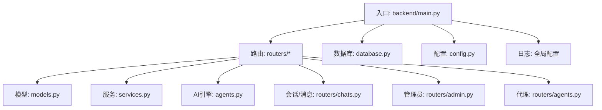
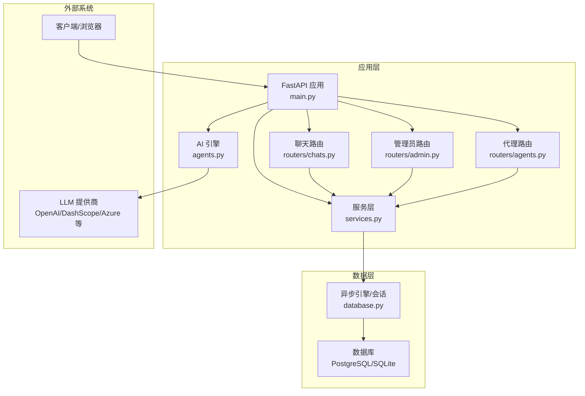
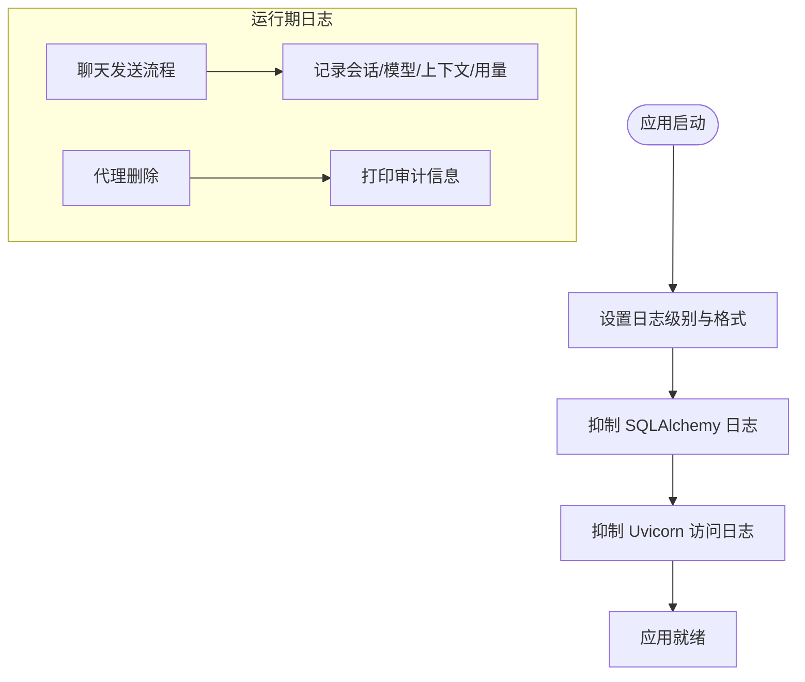
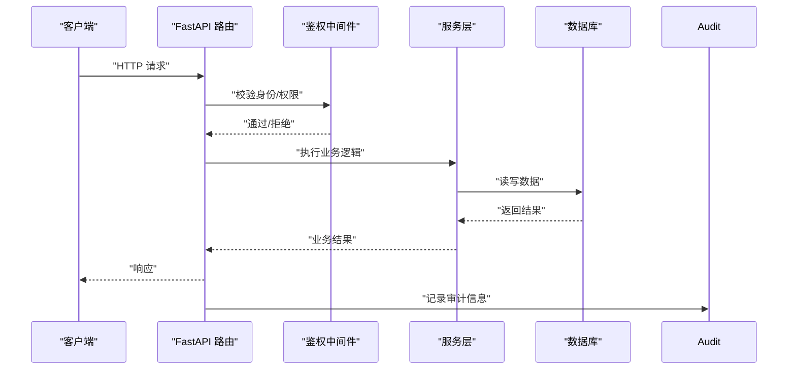
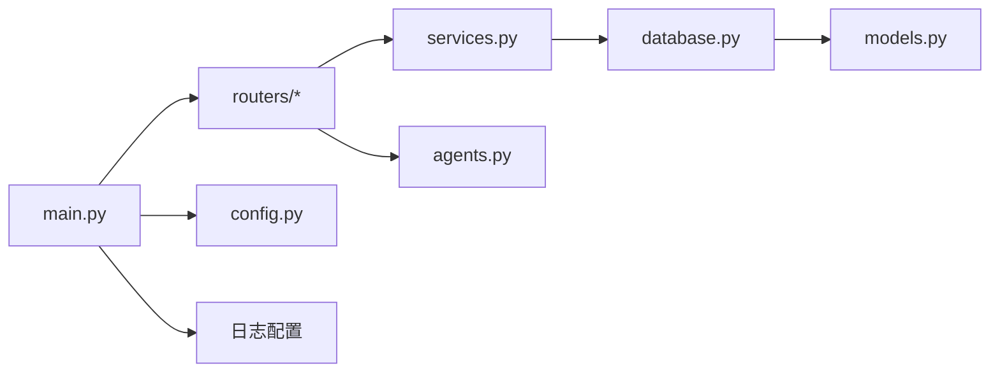

# 安全审计与合规

<cite>
**本文引用的文件**
- [backend/main.py](file://backend/main.py)
- [backend/config.py](file://backend/config.py)
- [backend/database.py](file://backend/database.py)
- [backend/models.py](file://backend/models.py)
- [backend/services.py](file://backend/services.py)
- [backend/routers/admin.py](file://backend/routers/admin.py)
- [backend/routers/agents.py](file://backend/routers/agents.py)
- [backend/routers/chats.py](file://backend/routers/chats.py)
- [backend/schemas.py](file://backend/schemas.py)
- [backend/agents.py](file://backend/agents.py)
- [backend/tasks.py](file://backend/tasks.py)
- [backend/requirements.txt](file://backend/requirements.txt)
- [backend/.env.example](file://backend/.env.example)
- [README.md](file://README.md)
</cite>

## 目录
1. [引言](#引言)
2. [项目结构](#项目结构)
3. [核心组件](#核心组件)
4. [架构总览](#架构总览)
5. [详细组件分析](#详细组件分析)
6. [依赖关系分析](#依赖关系分析)
7. [性能考虑](#性能考虑)
8. [故障排查指南](#故障排查指南)
9. [结论](#结论)
10. [附录](#附录)

## 引言
本指南面向“安全审计与合规”目标，结合代码库现状，系统梳理日志记录配置、权限追踪机制、安全漏洞扫描工具配置建议、数据保护合规性检查要点、安全基线配置、应急响应计划以及定期安全评估与渗透测试的组织方法。文档同时给出与实际源码映射的架构图与流程图，帮助不同技术背景的读者快速理解与落地。

## 项目结构
后端采用 FastAPI + SQLAlchemy 异步 ORM 架构，数据库默认使用 SQLite（便于本地开发），生产可切换为 PostgreSQL；AI 侧通过 AgentScope 与多家 LLM 提供商对接；聊天路由提供流式响应与令牌用量统计；管理员路由提供统计与删除玩家等能力；全局日志在入口处集中配置。

图表来源
- [backend/main.py](file://backend/main.py#L1-L173)
- [backend/database.py](file://backend/database.py#L1-L31)
- [backend/models.py](file://backend/models.py#L1-L122)
- [backend/services.py](file://backend/services.py#L1-L66)
- [backend/agents.py](file://backend/agents.py#L1-L196)
- [backend/routers/chats.py](file://backend/routers/chats.py#L1-L275)
- [backend/routers/admin.py](file://backend/routers/admin.py#L1-L112)
- [backend/routers/agents.py](file://backend/routers/agents.py#L1-L141)
- [backend/config.py](file://backend/config.py#L1-L34)

章节来源
- [backend/main.py](file://backend/main.py#L1-L173)
- [README.md](file://README.md#L1-L141)

## 核心组件
- 入口与生命周期：应用初始化、CORS、数据库迁移与连接重试、WebSocket 与根接口。
- 配置中心：统一读取 .env，支持数据库、Redis、AI 密钥与模型参数。
- 数据库与模型：异步引擎、连接池、模型定义与字段约束。
- 路由与业务：聊天会话与消息、管理员统计与删除、代理管理与校验。
- AI 引擎：从数据库加载活跃提供商，按类型初始化模型，生成章节内容。
- 日志：全局日志级别与格式控制，SQLAlchemy 与 Uvicorn 访问日志抑制。

章节来源
- [backend/main.py](file://backend/main.py#L1-L173)
- [backend/config.py](file://backend/config.py#L1-L34)
- [backend/database.py](file://backend/database.py#L1-L31)
- [backend/models.py](file://backend/models.py#L1-L122)
- [backend/routers/chats.py](file://backend/routers/chats.py#L1-L275)
- [backend/routers/admin.py](file://backend/routers/admin.py#L1-L112)
- [backend/routers/agents.py](file://backend/routers/agents.py#L1-L141)
- [backend/agents.py](file://backend/agents.py#L1-L196)

## 架构总览
下图展示后端与外部系统的交互：FastAPI 接收请求，经路由层进入业务层，访问数据库与 AI 引擎；日志在入口集中配置，SQLAlchemy 与 Uvicorn 访问日志被显式抑制以降低噪声。

图表来源
- [backend/main.py](file://backend/main.py#L30-L173)
- [backend/routers/chats.py](file://backend/routers/chats.py#L1-L275)
- [backend/routers/admin.py](file://backend/routers/admin.py#L1-L112)
- [backend/routers/agents.py](file://backend/routers/agents.py#L1-L141)
- [backend/services.py](file://backend/services.py#L1-L66)
- [backend/agents.py](file://backend/agents.py#L1-L196)
- [backend/database.py](file://backend/database.py#L1-L31)

## 详细组件分析

### 日志记录配置
- 全局日志：入口处设置日志级别与格式，并对 SQLAlchemy 与 Uvicorn 访问日志进行抑制，仅保留错误日志，避免控制台被大量日志刷屏。
- 聊天路由：在发送消息流程中，使用结构化日志记录会话、模型、上下文窗口、温度、输入/输出字符数及令牌用量统计，便于审计与性能分析。
- 审计日志：代理删除操作在路由层打印审计信息，建议迁移到专用审计表或外部审计系统。

图表来源
- [backend/main.py](file://backend/main.py#L13-L28)
- [backend/routers/chats.py](file://backend/routers/chats.py#L133-L234)
- [backend/routers/agents.py](file://backend/routers/agents.py#L135-L140)

章节来源
- [backend/main.py](file://backend/main.py#L13-L28)
- [backend/routers/chats.py](file://backend/routers/chats.py#L133-L234)
- [backend/routers/agents.py](file://backend/routers/agents.py#L135-L140)

### 权限追踪机制
- CORS：允许指定前端域名，限制跨域来源。
- 身份与鉴权：当前仓库未见显式认证/授权中间件或用户登录流程，建议在路由层增加统一鉴权中间件与会话/令牌校验。
- 操作审计：管理员删除玩家与代理删除操作存在简单打印审计，建议扩展到所有敏感操作并落库或上报审计系统。
- API 调用记录：聊天路由记录会话与消息交互，建议补充请求头摘要、用户标识、时间戳与结果状态，形成完整调用链。
- 数据访问跟踪：数据库层可通过审计表或触发器记录 DML 操作，或在服务层统一封装事务并写入审计流水。

图表来源
- [backend/main.py](file://backend/main.py#L85-L91)
- [backend/routers/admin.py](file://backend/routers/admin.py#L59-L81)
- [backend/routers/agents.py](file://backend/routers/agents.py#L128-L140)
- [backend/routers/chats.py](file://backend/routers/chats.py#L72-L258)

章节来源
- [backend/main.py](file://backend/main.py#L85-L91)
- [backend/routers/admin.py](file://backend/routers/admin.py#L59-L81)
- [backend/routers/agents.py](file://backend/routers/agents.py#L128-L140)
- [backend/routers/chats.py](file://backend/routers/chats.py#L72-L258)

### 安全漏洞扫描工具配置
- 静态代码分析：建议在 CI 中集成 Python 扫描（如 bandit/flake8/pylint/mypy）与前端 ESLint 规则，覆盖安全规则与类型检查。
- 依赖项安全检查：使用 pip-audit 或类似工具扫描 requirements.txt 中已知漏洞；建议在 CI 中加入依赖扫描步骤。
- 运行时漏洞检测：结合容器镜像扫描（如 Clair/Snyk/Docker Scout）与网络扫描（Nessus/Nmap），定期对部署环境进行扫描。
- 敏感信息防护：当前 .env.example 包含密钥字段，建议在生产环境使用只读权限的机密管理服务（如 HashiCorp Vault/KMS），并启用密钥轮换策略。

章节来源
- [backend/requirements.txt](file://backend/requirements.txt#L1-L20)
- [backend/.env.example](file://backend/.env.example#L1-L4)

### 数据保护合规性检查
- 数据最小化与目的限制：仅收集实现功能所必需的数据（如用户名、会话消息、章节内容摘要），避免采集无关个人数据。
- 数据主体权利：提供数据可携带、更正、删除与限制处理的接口（如管理员删除玩家与会话）；建议补充自动化数据清理与导出能力。
- 加密与传输安全：强制 HTTPS、TLS 1.2+；数据库连接使用加密通道；敏感字段（如 API Key）在存储前加密或使用密钥管理服务。
- 数据本地化与跨境传输：若涉及欧盟/加州用户，应遵守 GDPR/CCPA 的数据本地化与跨境传输要求，必要时进行数据影响评估（DPIA）。
- 透明度与记录：保留处理活动清单与数据流图，明确数据来源、用途、保留期限与共享方。

章节来源
- [backend/routers/admin.py](file://backend/routers/admin.py#L59-L81)
- [backend/routers/chats.py](file://backend/routers/chats.py#L72-L258)
- [backend/models.py](file://backend/models.py#L1-L122)

### 安全基线配置
- 系统加固：禁用不必要的服务与端口，最小化安装包，启用防火墙；容器/主机层面开启只读根文件系统与最小权限。
- 软件更新与补丁管理：建立依赖清单与版本锁定，CI 中集成漏洞扫描与自动补丁提醒；对关键依赖设定升级窗口与回归测试。
- 配置管理：统一环境变量与密钥管理，禁止硬编码敏感信息；对 .env/.env.local 等文件纳入版本控制白名单管理。
- 网络与访问控制：限制数据库与 Redis 的访问来源；对管理端口与调试接口进行访问控制与审计。

章节来源
- [backend/config.py](file://backend/config.py#L1-L34)
- [backend/database.py](file://backend/database.py#L8-L17)
- [backend/requirements.txt](file://backend/requirements.txt#L1-L20)

### 应急响应计划
- 事件分类：将安全事件分为“凭证泄露、数据泄露、API滥用、服务中断、供应链攻击”等类别，并设定严重等级。
- 报告流程：建立内部报告渠道（如安全邮箱/工单）、外部披露时限与范围；对聊天与管理操作建立异常告警阈值。
- 恢复程序：快速隔离受影响系统、回滚可疑变更、撤销泄露凭证、通知用户与监管机构；对聊天与会话数据进行备份与恢复演练。
- 事后评估：开展事件复盘，完善策略与流程，更新威胁模型与演练计划。

章节来源
- [backend/routers/admin.py](file://backend/routers/admin.py#L59-L81)
- [backend/routers/agents.py](file://backend/routers/agents.py#L128-L140)
- [backend/routers/chats.py](file://backend/routers/chats.py#L72-L258)

### 定期安全评估与渗透测试
- 组织方法：制定年度/季度评估计划，覆盖 API、数据库、AI 供应商接口与前端；对高风险路径（如会话流式响应、代理配置）重点测试。
- 工具与范围：使用 OWASP ZAP/ Burp Suite 进行 API 测试，结合自动化扫描与手工测试；对第三方 LLM SDK 与模型调用进行输入注入与越权测试。
- 结果与整改：形成评估报告与修复清单，设定责任人与完成时限；将修复纳入发布流程与回归测试。

章节来源
- [backend/routers/chats.py](file://backend/routers/chats.py#L145-L209)
- [backend/agents.py](file://backend/agents.py#L101-L125)

## 依赖关系分析
- 组件耦合：路由依赖服务层，服务层依赖数据库会话；AI 引擎依赖数据库加载提供商配置；入口集中配置日志与中间件。
- 外部依赖：FastAPI、SQLAlchemy、AgentScope、OpenAI/DashScope SDK、Uvicorn、Alembic、Redis 等。
- 潜在风险：日志抑制可能掩盖异常；AI 提供商密钥明文存储；缺少统一鉴权与审计表；数据库连接参数与池配置需结合负载调整。

图表来源
- [backend/main.py](file://backend/main.py#L30-L173)
- [backend/routers/chats.py](file://backend/routers/chats.py#L1-L275)
- [backend/routers/admin.py](file://backend/routers/admin.py#L1-L112)
- [backend/routers/agents.py](file://backend/routers/agents.py#L1-L141)
- [backend/services.py](file://backend/services.py#L1-L66)
- [backend/database.py](file://backend/database.py#L1-L31)
- [backend/models.py](file://backend/models.py#L1-L122)
- [backend/agents.py](file://backend/agents.py#L1-L196)
- [backend/config.py](file://backend/config.py#L1-L34)

章节来源
- [backend/main.py](file://backend/main.py#L30-L173)
- [backend/requirements.txt](file://backend/requirements.txt#L1-L20)

## 性能考虑
- 日志噪声控制：SQLAlchemy 与 Uvicorn 访问日志抑制有助于降低 I/O 干扰；建议在性能敏感场景开启采样或结构化日志落盘。
- 数据库连接池：根据并发与 QPS 调整 pool_size 与 max_overflow；SQLite 在高并发下可能成为瓶颈，建议生产使用 PostgreSQL。
- AI 调用：流式响应与令牌统计有助于优化成本与延迟；建议对模型调用增加超时与重试策略，并记录耗时指标。
- WebSocket：保持连接稳定性，避免长时间空闲导致断开；对异常进行捕获与恢复。

章节来源
- [backend/main.py](file://backend/main.py#L13-L28)
- [backend/database.py](file://backend/database.py#L8-L17)
- [backend/routers/chats.py](file://backend/routers/chats.py#L112-L258)

## 故障排查指南
- 启动失败与数据库迁移：入口包含数据库连接重试与 Alembic 升级 head 的子进程调用；若失败，检查 .env 中 DATABASE_URL 与数据库可达性。
- AI 初始化失败：当数据库无活跃提供商时回退至配置项；若仍失败，检查 OPENAI_API_KEY、provider_type 与 base_url。
- 聊天流式响应异常：关注日志中的错误信息与令牌统计；确认提供商类型与 SDK 版本兼容性。
- 审计缺失：代理删除等操作仅打印审计信息，建议补充审计表与告警。

章节来源
- [backend/main.py](file://backend/main.py#L45-L81)
- [backend/agents.py](file://backend/agents.py#L49-L75)
- [backend/routers/chats.py](file://backend/routers/chats.py#L211-L215)
- [backend/routers/agents.py](file://backend/routers/agents.py#L135-L140)

## 结论
本指南基于现有代码库现状，提出了日志与审计、权限与操作追踪、漏洞扫描、数据保护合规、安全基线、应急响应与评估测试的系统化建议。建议优先补齐鉴权与审计表、密钥管理与日志落库、API 与数据库安全加固，并将安全流程纳入 CI/CD 与发布流程，持续提升整体安全与合规水平。

## 附录
- 快速对照清单
  - 是否启用统一鉴权中间件与会话管理？
  - 是否将审计信息落库或上报审计系统？
  - 是否对敏感字段（API Key）进行加密存储与轮换？
  - 是否在 CI 中集成依赖扫描与漏洞扫描？
  - 是否对聊天与会话数据进行最小化采集与保留期限管理？