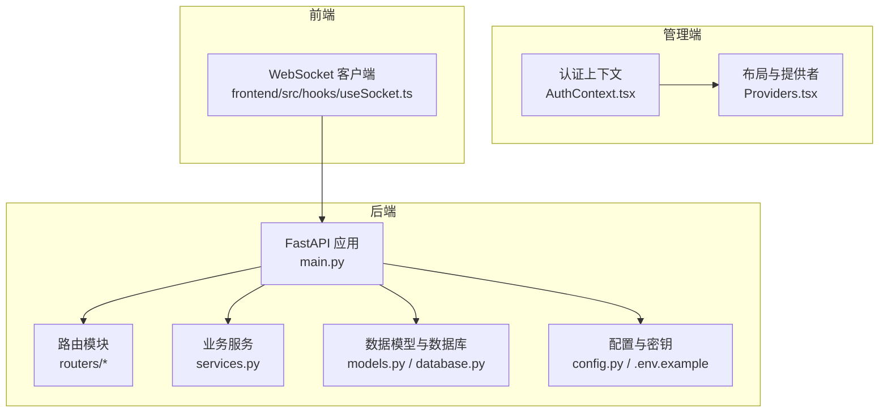
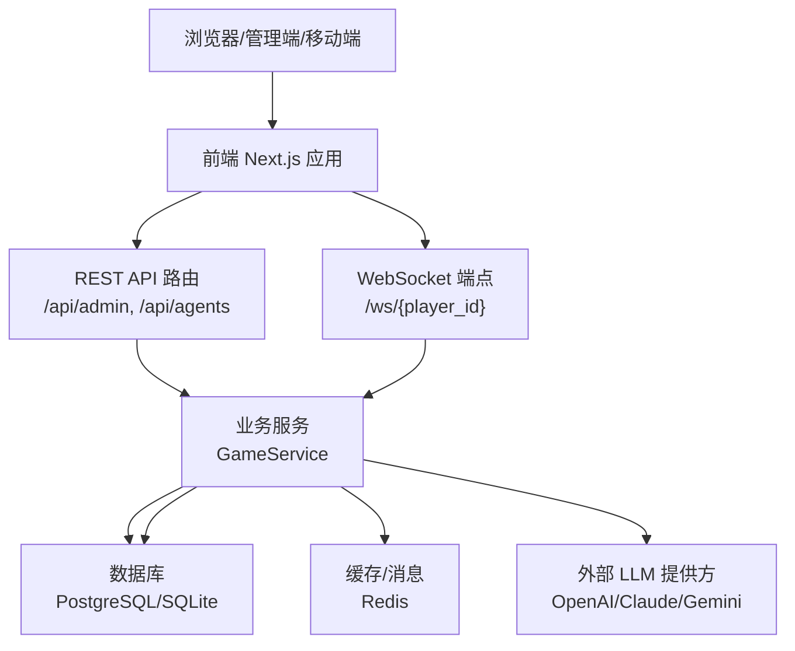
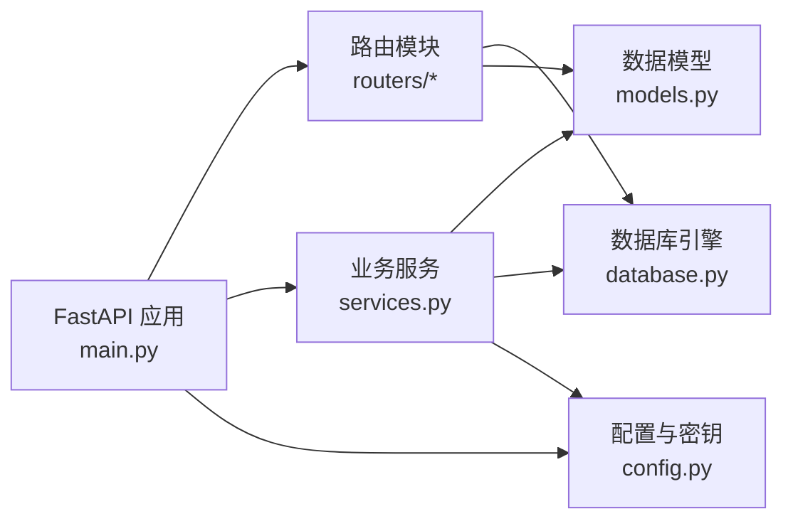
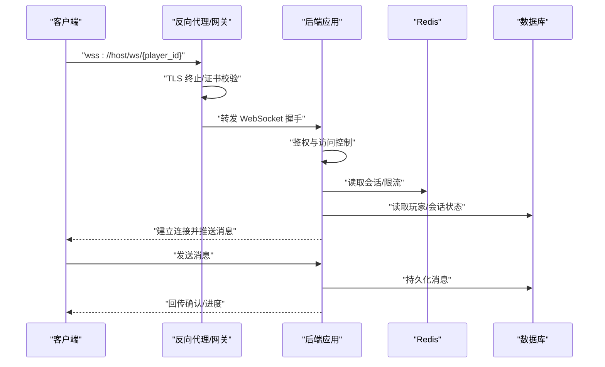

# 安全配置

<cite>
**本文引用的文件**
- [backend/main.py](file://backend/main.py)
- [backend/config.py](file://backend/config.py)
- [backend/.env.example](file://backend/.env.example)
- [backend/routers/admin.py](file://backend/routers/admin.py)
- [backend/routers/agents.py](file://backend/routers/agents.py)
- [backend/models.py](file://backend/models.py)
- [backend/schemas.py](file://backend/schemas.py)
- [backend/services.py](file://backend/services.py)
- [backend/database.py](file://backend/database.py)
- [backend/requirements.txt](file://backend/requirements.txt)
- [docs/wiki/Deployment.md](file://docs/wiki/Deployment.md)
- [README.md](file://README.md)
- [backend/admin/src/context/AuthContext.tsx](file://backend/admin/src/context/AuthContext.tsx)
- [backend/admin/src/components/Providers.tsx](file://backend/admin/src/components/Providers.tsx)
</cite>

## 目录
1. [简介](#简介)
2. [项目结构](#项目结构)
3. [核心组件](#核心组件)
4. [架构总览](#架构总览)
5. [详细组件分析](#详细组件分析)
6. [依赖关系分析](#依赖关系分析)
7. [性能考虑](#性能考虑)
8. [故障排查指南](#故障排查指南)
9. [结论](#结论)
10. [附录](#附录)

## 简介
本指南面向“无限剧情游戏系统”的后端与管理端，聚焦于安全配置与最佳实践，覆盖认证授权、API密钥管理、访问控制、数据传输安全（HTTPS/WebSocket）、防火墙与网络策略、安全审计与合规、漏洞扫描与修复、隐私保护与数据处理合规、以及应急响应与事件处置流程。文档以仓库现有代码与配置为依据，结合概念性建议，帮助团队建立可操作的安全基线。

## 项目结构
后端采用 FastAPI + SQLAlchemy 异步 ORM 构建，数据库默认使用 SQLite（开发环境），生产环境建议使用 PostgreSQL；管理端采用 Next.js，提供基于本地存储令牌的简单认证上下文；前端通过 WebSocket 与后端进行实时通信。

图表来源
- [backend/main.py](file://backend/main.py#L83-L98)
- [backend/routers/admin.py](file://backend/routers/admin.py#L10-L14)
- [backend/routers/agents.py](file://backend/routers/agents.py#L9-L13)
- [backend/services.py](file://backend/services.py#L8-L17)
- [backend/models.py](file://backend/models.py#L9-L23)
- [backend/database.py](file://backend/database.py#L6-L23)
- [backend/config.py](file://backend/config.py#L7-L33)
- [backend/admin/src/context/AuthContext.tsx](file://backend/admin/src/context/AuthContext.tsx#L20-L53)
- [backend/admin/src/components/Providers.tsx](file://backend/admin/src/components/Providers.tsx#L7-L14)

章节来源
- [backend/main.py](file://backend/main.py#L83-L98)
- [README.md](file://README.md#L34-L51)

## 核心组件
- 应用入口与中间件：CORS、生命周期、根路径、WebSocket 端点、日志配置。
- 路由与控制器：管理员统计、玩家与故事查询、删除；智能体的增删改查。
- 数据模型：玩家、故事章节、资产、LLM 提供方、聊天会话与消息、智能体。
- 配置与密钥：数据库连接、Redis、各 LLM 提供方 API Key。
- 业务服务：玩家创建、世界初始化、后续剧情推进。
- 数据库层：异步引擎、连接池、会话管理。
- 管理端认证：基于本地存储令牌的登录/登出与页面跳转。
- 前端 WebSocket：与后端进行实时通信。

章节来源
- [backend/main.py](file://backend/main.py#L83-L173)
- [backend/routers/admin.py](file://backend/routers/admin.py#L16-L112)
- [backend/routers/agents.py](file://backend/routers/agents.py#L15-L141)
- [backend/models.py](file://backend/models.py#L9-L122)
- [backend/config.py](file://backend/config.py#L7-L33)
- [backend/services.py](file://backend/services.py#L8-L66)
- [backend/database.py](file://backend/database.py#L6-L31)
- [backend/admin/src/context/AuthContext.tsx](file://backend/admin/src/context/AuthContext.tsx#L1-L54)

## 架构总览
下图展示从浏览器到后端、数据库与外部 LLM 提供方的整体交互路径，并标注安全关注点。

图表来源
- [backend/main.py](file://backend/main.py#L157-L169)
- [backend/services.py](file://backend/services.py#L19-L59)
- [backend/database.py](file://backend/database.py#L6-L23)
- [backend/config.py](file://backend/config.py#L18-L28)

## 详细组件分析

### 认证与授权
- 管理端认证：管理端使用本地存储令牌进行登录状态维护，未实现后端会话/CSRF 保护与权限分级。
- API 层：当前路由未实现鉴权装饰器或中间件，所有管理端接口均为开放访问。
- 建议：
  - 在路由层引入统一的鉴权中间件或依赖注入，校验 JWT 或会话令牌。
  - 对管理员接口按角色划分权限（只读/写/删除），并在数据库层对敏感操作增加审计日志。
  - 使用 HTTPS 强制传输加密，避免令牌在传输中泄露。

章节来源
- [backend/admin/src/context/AuthContext.tsx](file://backend/admin/src/context/AuthContext.tsx#L20-L53)
- [backend/routers/admin.py](file://backend/routers/admin.py#L16-L112)

### API 密钥管理
- 密钥来源：通过环境变量加载，支持 OpenAI、Claude、Gemini 等提供商密钥。
- 当前风险：密钥明文存储于 .env，未做加密或密钥轮换机制；生产环境未强制要求密钥注入。
- 建议：
  - 使用加密密钥存储（如 KMS/Vault），后端以只读方式拉取。
  - 实施密钥轮换策略与访问审计，限制密钥作用域与有效期。
  - 在数据库中仅保存密钥摘要或加密字段，不直接存储明文。

章节来源
- [backend/config.py](file://backend/config.py#L22-L24)
- [backend/.env.example](file://backend/.env.example#L1-L4)

### 访问控制与 CORS
- CORS 配置：允许本地开发域名访问，未限制生产域名，存在跨站风险。
- 建议：
  - 生产环境固定允许源列表，启用凭据时严格匹配 Origin。
  - 对管理端与游戏端分别设置独立的 CORS 规则与子路径访问控制。

章节来源
- [backend/main.py](file://backend/main.py#L85-L91)

### 数据传输安全（HTTPS 与 WebSocket）
- HTTPS：未在应用层强制 HTTPS，建议在反向代理层启用 TLS 终止与强密码套件。
- WebSocket：当前未启用 WSS，建议在反向代理层升级为 wss://，并校验客户端证书（可选）。
- 建议：
  - 使用 ACME 自动签发证书，开启 HSTS。
  - 对 WebSocket 进行速率限制与最大帧大小限制，防止内存耗尽攻击。

章节来源
- [backend/main.py](file://backend/main.py#L157-L169)
- [docs/wiki/Deployment.md](file://docs/wiki/Deployment.md#L30-L37)

### 数据库与缓存安全
- 数据库：默认 SQLite 开发，生产建议 PostgreSQL；连接池参数合理，但需配合连接复用与超时设置。
- 缓存：Redis 默认本地访问，建议启用密码认证、网络隔离与 TLS。
- 建议：
  - 对数据库连接启用 TLS；对敏感表（如 LLM 提供方）启用字段级加密。
  - 对 Redis 启用密码与网络 ACL，仅内网访问。

章节来源
- [backend/database.py](file://backend/database.py#L6-L23)
- [backend/config.py](file://backend/config.py#L18-L19)

### 安全审计与合规
- 审计日志：当前未实现统一审计日志表，仅在删除智能体处打印审计信息。
- 建议：
  - 建立统一审计日志表，记录关键操作（创建/更新/删除）、操作人、时间、IP、User-Agent。
  - 对敏感操作（删除玩家、修改提供方密钥）实施二次确认与审批流程。
  - 结合日志系统（如 ELK/Splunk）进行集中采集与告警。

章节来源
- [backend/routers/agents.py](file://backend/routers/agents.py#L135-L136)

### 隐私保护与数据处理合规
- 数据类型：包含玩家标识、聊天记录、资产元数据等个人数据。
- 建议：
  - 明确数据处理目的与合法性基础，提供数据主体权利（访问、更正、删除、限制处理）。
  - 对个人数据进行去标识化或匿名化处理；在数据库层面实施最小化收集与保留期限。
  - 制定数据泄露通知流程与影响评估机制。

章节来源
- [backend/models.py](file://backend/models.py#L9-L23)
- [backend/models.py](file://backend/models.py#L90-L99)

### 应急响应与事件处置
- 建议流程：
  - 事件分类与分级（凭证泄露、数据泄露、DDoS、服务中断）。
  - 通知链路（运营/安全部门/法务/监管），明确时限与内容模板。
  - 处置步骤（隔离、调查、修复、恢复、复盘）。
  - 事后复盘与制度修订。

（本节为通用指导，不直接分析具体文件）

## 依赖关系分析
后端依赖关系围绕 FastAPI 应用、路由、服务、数据库与配置展开，外部依赖包括 LLM SDK、Redis、数据库驱动等。

图表来源
- [backend/main.py](file://backend/main.py#L30-L42)
- [backend/routers/admin.py](file://backend/routers/admin.py#L1-L14)
- [backend/routers/agents.py](file://backend/routers/agents.py#L1-L8)
- [backend/services.py](file://backend/services.py#L1-L7)
- [backend/database.py](file://backend/database.py#L1-L4)
- [backend/config.py](file://backend/config.py#L1-L6)

章节来源
- [backend/requirements.txt](file://backend/requirements.txt#L1-L20)
- [backend/main.py](file://backend/main.py#L30-L42)

## 性能考虑
- 连接池与超时：数据库连接池参数合理，建议根据并发与 QPS 调优；对慢查询与阻塞操作进行监控。
- WebSocket：限制单连接消息大小与频率，避免内存膨胀；对异常断开进行重连与退避策略。
- 缓存：合理设置 TTL 与失效策略，避免缓存雪崩；对热点键进行分片与降级。

（本节为通用指导，不直接分析具体文件）

## 故障排查指南
- 数据库连接失败：检查 DATABASE_URL、凭据与网络可达性；确认 Alembic 迁移成功。
- WebSocket 断开：检查后端日志与反向代理配置；确认 wss 协议与证书有效。
- 管理端无法访问：确认本地令牌存在且未过期；检查路由与静态资源挂载。
- LLM 调用错误：核对 OPENAI_API_KEY/Claude/Gemini 等密钥是否正确、配额是否充足。

章节来源
- [docs/wiki/Deployment.md](file://docs/wiki/Deployment.md#L60-L65)
- [backend/admin/src/context/AuthContext.tsx](file://backend/admin/src/context/AuthContext.tsx#L25-L35)

## 结论
当前项目在开发阶段具备基本的 API 与 WebSocket 能力，但在认证授权、密钥管理、传输加密、访问控制与审计等方面尚属空白。建议立即引入统一鉴权、HTTPS/WSS、严格的 CORS 与访问控制、密钥加密存储与轮换、集中审计与合规流程，并完善应急响应机制，以满足生产环境的安全基线要求。

## 附录

### API 安全要点清单
- [ ] 引入统一鉴权中间件/依赖，校验令牌与权限
- [ ] 限制 CORS 源，启用凭据时严格匹配
- [ ] 强制 HTTPS 与 HSTS，WSS 升级
- [ ] 密钥加密存储与轮换，最小权限原则
- [ ] 审计日志表与关键操作审计
- [ ] 速率限制与输入校验
- [ ] DDoS 防护与 WAF 部署
- [ ] 数据最小化与去标识化
- [ ] 应急响应流程与演练

### 关键流程图：WebSocket 安全接入

图表来源
- [backend/main.py](file://backend/main.py#L157-L169)
- [backend/database.py](file://backend/database.py#L6-L23)
- [backend/config.py](file://backend/config.py#L18-L19)