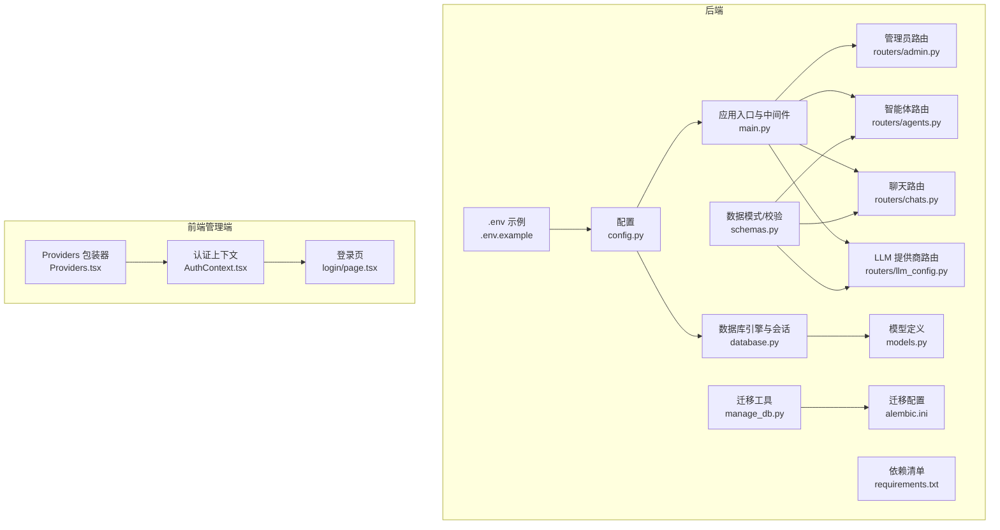
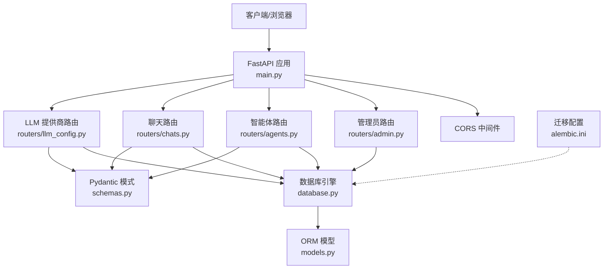
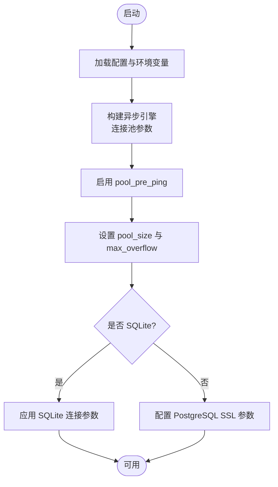
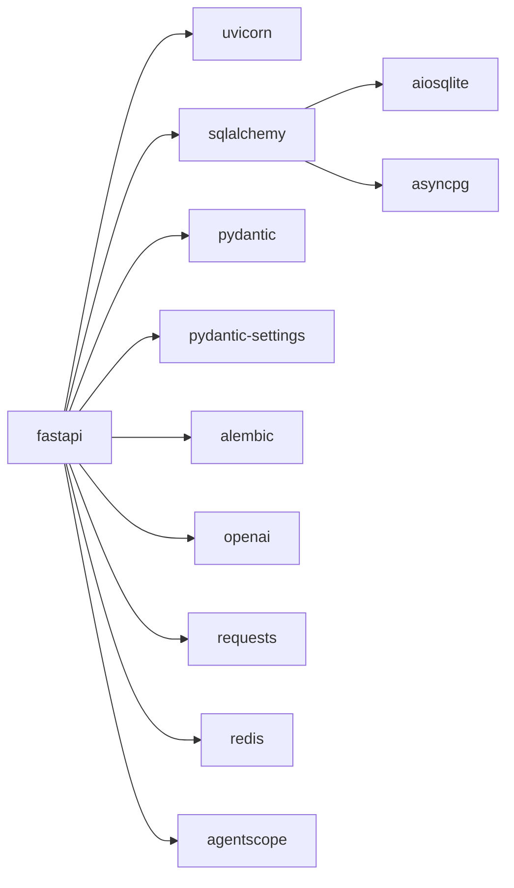

# 数据安全

<cite>
**本文引用的文件**
- [backend/.env.example](file://backend/.env.example)
- [backend/config.py](file://backend/config.py)
- [backend/database.py](file://backend/database.py)
- [backend/main.py](file://backend/main.py)
- [backend/models.py](file://backend/models.py)
- [backend/schemas.py](file://backend/schemas.py)
- [backend/routers/admin.py](file://backend/routers/admin.py)
- [backend/routers/agents.py](file://backend/routers/agents.py)
- [backend/routers/chats.py](file://backend/routers/chats.py)
- [backend/routers/llm_config.py](file://backend/routers/llm_config.py)
- [backend/manage_db.py](file://backend/manage_db.py)
- [backend/alembic.ini](file://backend/alembic.ini)
- [backend/requirements.txt](file://backend/requirements.txt)
- [backend/admin/src/context/AuthContext.tsx](file://backend/admin/src/context/AuthContext.tsx)
- [backend/admin/src/components/Providers.tsx](file://backend/admin/src/components/Providers.tsx)
- [backend/admin/src/app/admin/login/page.tsx](file://backend/admin/src/app/admin/login/page.tsx)
</cite>

## 目录
1. 引言
2. 项目结构
3. 核心组件
4. 架构总览
5. 详细组件分析
6. 依赖关系分析
7. 性能与安全考量
8. 故障排查指南
9. 结论
10. 附录

## 引言
本指南面向“无限叙事游戏”后端系统，围绕数据安全进行系统化梳理与加固建议，覆盖数据库连接安全、凭据管理、连接池配置、敏感数据存储、传输加密、访问控制、备份与恢复、以及数据生命周期管理与删除策略。文档以仓库现有实现为依据，结合可落地的安全实践，帮助开发与运维团队建立可执行的安全基线。

## 项目结构
后端采用 FastAPI + SQLAlchemy Async + Alembic 的架构，数据库默认使用 SQLite（便于本地开发），生产环境可通过环境变量切换至 PostgreSQL，并通过连接池参数提升稳定性与安全性。前端管理端采用 Next.js，内置简易管理员认证上下文，用于演示访问控制与会话管理。

图表来源
- [backend/config.py](file://backend/config.py#L1-L34)
- [backend/.env.example](file://backend/.env.example#L1-L4)
- [backend/database.py](file://backend/database.py#L1-L31)
- [backend/main.py](file://backend/main.py#L30-L103)
- [backend/routers/admin.py](file://backend/routers/admin.py#L1-L112)
- [backend/routers/agents.py](file://backend/routers/agents.py#L1-L141)
- [backend/routers/chats.py](file://backend/routers/chats.py#L1-L275)
- [backend/routers/llm_config.py](file://backend/routers/llm_config.py#L1-L203)
- [backend/models.py](file://backend/models.py#L1-L122)
- [backend/schemas.py](file://backend/schemas.py#L1-L102)
- [backend/manage_db.py](file://backend/manage_db.py#L1-L67)
- [backend/alembic.ini](file://backend/alembic.ini#L1-L115)
- [backend/requirements.txt](file://backend/requirements.txt#L1-L20)
- [backend/admin/src/context/AuthContext.tsx](file://backend/admin/src/context/AuthContext.tsx#L1-L54)
- [backend/admin/src/components/Providers.tsx](file://backend/admin/src/components/Providers.tsx#L1-L15)
- [backend/admin/src/app/admin/login/page.tsx](file://backend/admin/src/app/admin/login/page.tsx#L1-L58)

章节来源
- [backend/config.py](file://backend/config.py#L1-L34)
- [backend/.env.example](file://backend/.env.example#L1-L4)
- [backend/database.py](file://backend/database.py#L1-L31)
- [backend/main.py](file://backend/main.py#L30-L103)
- [backend/requirements.txt](file://backend/requirements.txt#L1-L20)

## 核心组件
- 配置与环境：通过 Pydantic Settings 读取 .env，支持本地 SQLite 与远程 PostgreSQL 切换；默认 SQLite 路径绝对化，避免工作目录差异导致路径漂移。
- 数据库引擎与会话：异步引擎启用连接池参数与 pre_ping，SQLite 场景下关闭多线程限制；提供异步会话工厂与依赖注入。
- 路由与业务：管理员统计、玩家与故事查询、删除；智能体与提供商管理；聊天会话与消息流式生成。
- 模型与模式：定义玩家、章节、资产、提供商、聊天会话与消息等实体；提供 Pydantic 模式用于请求/响应校验。
- 迁移与版本：Alembic 配置与命令行迁移工具，确保数据库演进可追踪。
- 前端认证：管理端使用本地存储令牌进行会话保持，配合路由守卫跳转登录页。

章节来源
- [backend/config.py](file://backend/config.py#L7-L34)
- [backend/database.py](file://backend/database.py#L6-L23)
- [backend/routers/admin.py](file://backend/routers/admin.py#L16-L81)
- [backend/routers/agents.py](file://backend/routers/agents.py#L15-L55)
- [backend/routers/chats.py](file://backend/routers/chats.py#L22-L70)
- [backend/routers/llm_config.py](file://backend/routers/llm_config.py#L112-L138)
- [backend/models.py](file://backend/models.py#L9-L78)
- [backend/schemas.py](file://backend/schemas.py#L4-L42)
- [backend/manage_db.py](file://backend/manage_db.py#L20-L63)
- [backend/alembic.ini](file://backend/alembic.ini#L61-L115)
- [backend/admin/src/context/AuthContext.tsx](file://backend/admin/src/context/AuthContext.tsx#L20-L53)

## 架构总览
后端通过 FastAPI 提供 REST/WebSocket 接口，数据库层采用 SQLAlchemy Async，迁移由 Alembic 管理。管理员端前端通过本地令牌进行会话管理，路由守卫限制未登录访问。

图表来源
- [backend/main.py](file://backend/main.py#L83-L97)
- [backend/routers/admin.py](file://backend/routers/admin.py#L1-L14)
- [backend/routers/agents.py](file://backend/routers/agents.py#L1-L13)
- [backend/routers/chats.py](file://backend/routers/chats.py#L1-L20)
- [backend/routers/llm_config.py](file://backend/routers/llm_config.py#L1-L18)
- [backend/database.py](file://backend/database.py#L1-L3)
- [backend/models.py](file://backend/models.py#L1-L4)
- [backend/schemas.py](file://backend/schemas.py#L1-L2)
- [backend/alembic.ini](file://backend/alembic.ini#L1-L10)

## 详细组件分析

### 数据库连接安全配置
- 连接字符串与驱动
  - 默认使用 SQLite（便于本地开发），生产环境建议通过环境变量切换至 PostgreSQL，并使用 asyncpg 驱动。
  - SQLite 在非多线程场景下需禁用多线程检查，已在连接参数中体现。
- 连接池安全设置
  - 启用 pool_pre_ping 实现自动健康检查与断线重连。
  - 设置 pool_size 与 max_overflow 控制并发与溢出连接数量，避免资源耗尽。
  - 对 SQLite 使用额外连接参数以规避线程限制。
- 安全建议
  - 生产环境必须使用 SSL/TLS 连接 PostgreSQL，确保主机名验证与证书校验。
  - 将数据库凭据放入只读环境变量或密钥管理服务，不在代码或版本库中明文存储。
  - 限制数据库用户权限，仅授予最小必要权限（如仅 CRUD 权限）。
  - 定期轮换数据库密码与连接参数，审计连接日志。

图表来源
- [backend/config.py](file://backend/config.py#L15-L16)
- [backend/database.py](file://backend/database.py#L8-L17)

章节来源
- [backend/config.py](file://backend/config.py#L11-L16)
- [backend/database.py](file://backend/database.py#L8-L17)

### 凭据加密与密钥管理
- 当前实现
  - LLM 提供商表包含明文 api_key 字段，存在泄露风险。
  - 环境变量中包含 OPENAI_API_KEY 与 DATABASE_URL，应避免在日志中打印。
- 加固建议
  - 对 api_key 等敏感字段进行对称加密存储，使用 KMS 或本地密钥管理服务。
  - 在写入数据库前加密，读取时解密，仅在内存中短暂暴露明文。
  - 为每个环境维护独立密钥，定期轮换。
  - 限制密钥访问范围，使用最小权限原则。

章节来源
- [backend/models.py](file://backend/models.py#L65-L66)
- [backend/.env.example](file://backend/.env.example#L1-L3)

### 连接池安全设置
- 已有措施
  - pool_pre_ping：自动检测与重连，降低连接失效导致的异常。
  - pool_size/max_overflow：限制并发连接，防止资源耗尽。
- 建议增强
  - 设置连接超时与空闲回收策略，避免僵尸连接占用资源。
  - 在高并发场景下启用连接池监控指标，结合告警阈值进行扩容或限流。

章节来源
- [backend/database.py](file://backend/database.py#L11-L13)

### 敏感数据存储保护
- 用户密码
  - 当前未见用户密码存储逻辑，建议引入强哈希算法（如 bcrypt、argon2）与盐值，禁止明文存储。
- API 密钥
  - LLMProvider 表中的 api_key 明文存储，应改为加密字段并在运行时解密。
- 会话令牌
  - 管理端使用 localStorage 存储令牌，建议采用 HttpOnly、Secure、SameSite Cookie，并设置合理过期时间。
  - 前端路由守卫仅能阻止未登录访问，无法替代服务端会话安全。

章节来源
- [backend/models.py](file://backend/models.py#L65-L66)
- [backend/admin/src/context/AuthContext.tsx](file://backend/admin/src/context/AuthContext.tsx#L25-L47)

### 数据传输加密方案
- HTTPS 配置
  - 生产部署建议使用反向代理（Nginx/Caddy）开启 TLS，强制 HTTPS 重定向与 HSTS。
  - 证书由可信 CA 签发，启用现代 TLS 版本与加密套件。
- WebSocket 安全连接
  - 使用 wss:// 协议，确保握手与数据传输全程加密。
  - 在网关层启用证书校验与来源限制。
- 数据库通信加密
  - PostgreSQL 必须启用 SSL/TLS，要求服务器证书有效且客户端校验证书链。
  - 避免在连接字符串中明文传递密码，使用环境变量或外部密钥管理。

章节来源
- [backend/main.py](file://backend/main.py#L85-L91)
- [backend/.env.example](file://backend/.env.example#L2-L3)

### 数据访问控制机制
- 基于角色的权限管理
  - 管理端当前为简单令牌校验，建议引入 RBAC：定义角色（如管理员）、权限（读/写/删除），并对路由进行装饰器级鉴权。
- 数据隔离策略
  - 在路由层对资源 ID 进行归属校验，避免越权访问他人数据。
  - 对删除操作增加二次确认与审计日志，确保可追溯性。

章节来源
- [backend/routers/admin.py](file://backend/routers/admin.py#L59-L81)
- [backend/routers/agents.py](file://backend/routers/agents.py#L128-L140)

### 数据备份与恢复的安全考虑
- 加密备份
  - 备份文件使用强加密算法（如 AES-256）加密，密钥与备份分离存放。
  - 定期进行备份恢复演练，验证备份完整性与可恢复性。
- 灾难恢复计划
  - 定义 RPO/RTO 指标，明确恢复步骤与责任人。
  - 使用增量备份与快照技术，缩短恢复时间窗口。

章节来源
- [backend/manage_db.py](file://backend/manage_db.py#L20-L38)
- [backend/alembic.ini](file://backend/alembic.ini#L61-L115)

### 数据生命周期管理与删除策略
- 生命周期阶段
  - 创建：记录创建时间与创建者。
  - 使用：按需访问，避免冗余数据留存。
  - 归档：长期不活跃数据迁移至归档存储。
  - 删除：支持彻底删除与匿名化处理，保留审计轨迹。
- 删除实现
  - 管理端提供删除接口，建议在删除前清理关联数据并记录审计日志。
  - 对重要数据采用软删除标记，保留恢复窗口。

章节来源
- [backend/routers/admin.py](file://backend/routers/admin.py#L59-L81)
- [backend/routers/chats.py](file://backend/routers/chats.py#L260-L274)

## 依赖关系分析
后端依赖包括 Web 框架、数据库 ORM、异步数据库驱动、迁移工具、第三方模型 SDK 等。这些依赖直接影响数据安全边界与攻击面。

图表来源
- [backend/requirements.txt](file://backend/requirements.txt#L1-L20)

章节来源
- [backend/requirements.txt](file://backend/requirements.txt#L1-L20)

## 性能与安全考量
- 连接池与并发
  - 合理设置 pool_size 与 max_overflow，避免高并发下的连接争用。
  - 使用 pre_ping 降低连接失效带来的重试成本。
- 日志与敏感信息
  - 关闭 SQLAlchemy 与 Uvicorn 的冗余日志，避免敏感数据泄露。
  - 不在日志中输出数据库凭据、API Key 等。
- 传输安全
  - 强制 HTTPS 与 WSS，启用 HSTS 与安全头。
  - 反向代理层做速率限制与 IP 黑名单。

章节来源
- [backend/main.py](file://backend/main.py#L14-L28)
- [backend/database.py](file://backend/database.py#L11-L13)

## 故障排查指南
- 数据库连接失败
  - 检查 DATABASE_URL 是否正确，生产环境务必启用 SSL。
  - 查看连接池参数是否合理，必要时增大 pool_size 或调整超时。
- 迁移失败
  - 使用 manage_db 工具检查迁移状态，必要时回滚或重新生成迁移脚本。
- WebSocket 错误
  - 确认使用 wss://，检查反向代理与证书配置。
- 管理端登录无效
  - 检查本地存储令牌是否存在，确认路由守卫逻辑与登录页交互。

章节来源
- [backend/main.py](file://backend/main.py#L45-L81)
- [backend/manage_db.py](file://backend/manage_db.py#L20-L63)
- [backend/admin/src/context/AuthContext.tsx](file://backend/admin/src/context/AuthContext.tsx#L25-L47)

## 结论
本项目已具备基础的异步数据库连接与路由能力，但在生产环境中仍需补齐以下关键安全项：数据库 SSL/TLS、凭据加密存储、连接池与传输加密强化、RBAC 访问控制、备份加密与灾难恢复演练、以及数据生命周期与删除策略的规范化。建议分阶段实施，优先解决高风险点，持续完善安全基线。

## 附录
- 环境变量示例与配置要点
  - DATABASE_URL：生产环境建议使用 PostgreSQL 并启用 SSL。
  - OPENAI_API_KEY：从环境变量读取，避免硬编码。
- 迁移与版本管理
  - 使用 Alembic 管理数据库演进，命令行工具支持创建、升级与降级。

章节来源
- [backend/.env.example](file://backend/.env.example#L1-L4)
- [backend/alembic.ini](file://backend/alembic.ini#L61-L115)
- [backend/manage_db.py](file://backend/manage_db.py#L20-L63)