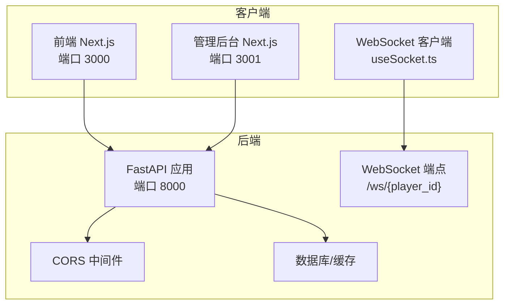
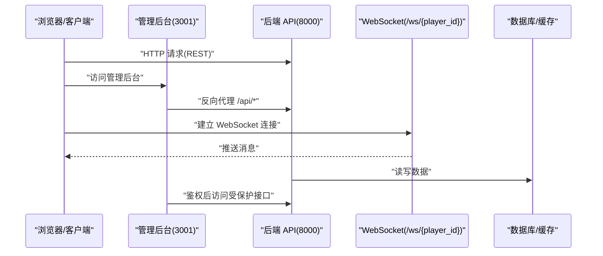
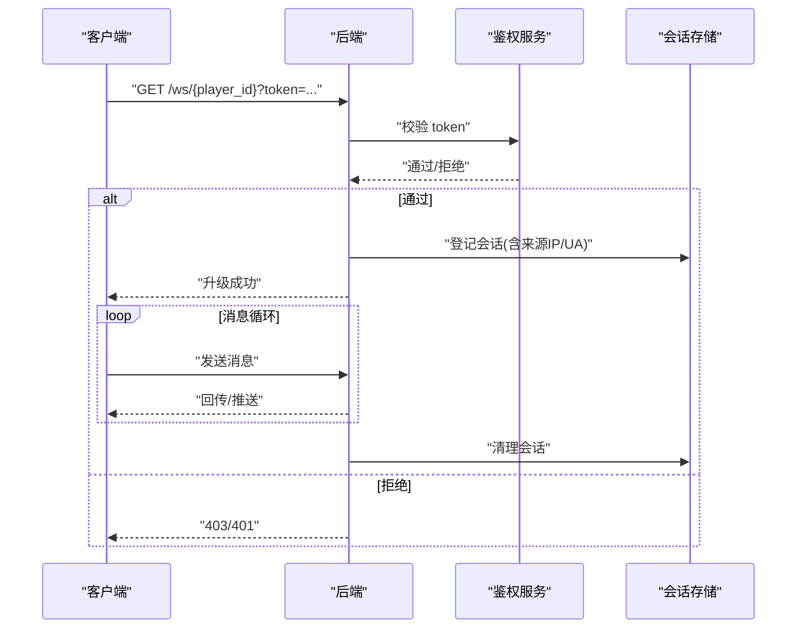
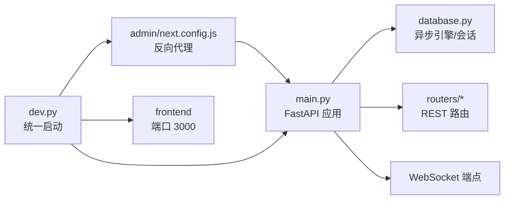

# 网络安全

<cite>
**本文引用的文件**
- [backend/main.py](file://backend/main.py)
- [frontend/src/hooks/useSocket.ts](file://frontend/src/hooks/useSocket.ts)
- [backend/config.py](file://backend/config.py)
- [backend/.env.example](file://backend/.env.example)
- [docs/wiki/Deployment.md](file://docs/wiki/Deployment.md)
- [backend/routers/chats.py](file://backend/routers/chats.py)
- [backend/database.py](file://backend/database.py)
- [backend/services.py](file://backend/services.py)
- [backend/admin/next.config.js](file://backend/admin/next.config.js)
- [backend/admin/src/context/AuthContext.tsx](file://backend/admin/src/context/AuthContext.tsx)
- [dev.py](file://dev.py)
</cite>

## 目录
1. [简介](#简介)
2. [项目结构](#项目结构)
3. [核心组件](#核心组件)
4. [架构总览](#架构总览)
5. [详细组件分析](#详细组件分析)
6. [依赖关系分析](#依赖关系分析)
7. [性能考量](#性能考量)
8. [故障排查指南](#故障排查指南)
9. [结论](#结论)
10. [附录](#附录)

## 简介
本指南面向“无限剧情剧场系统”的网络安全与防护实践，聚焦于以下方面：
- WebSocket 连接的安全配置：连接验证、消息处理与会话生命周期管理
- 防火墙与端口管理：端口暴露策略、入站流量控制与白名单建议
- DDoS 防护策略：速率限制、并发连接控制与异常流量检测思路
- 网络监控与入侵检测：实时流量分析与异常行为识别建议
- 负载均衡与 SSL 终止：健康检查与故障转移建议
- 容器与云环境安全：安全组、网络 ACL 与 VPC 配置建议

说明：当前仓库中的后端服务以本地开发为主，默认监听在 0.0.0.0 的 8000 端口，WebSocket 在 /ws/{player_id} 提供实时通信能力。本文在不改变现有实现的前提下，给出可落地的安全加固建议与最佳实践。

## 项目结构
从网络与安全视角，系统主要由三部分组成：
- 后端 API 与 WebSocket（FastAPI + Uvicorn）
- 前端客户端（Next.js，本地开发）
- 管理后台（Next.js，反向代理到后端）

图表来源
- [backend/main.py](file://backend/main.py#L83-L91)
- [backend/main.py](file://backend/main.py#L157-L169)
- [frontend/src/hooks/useSocket.ts](file://frontend/src/hooks/useSocket.ts#L11-L39)
- [backend/admin/next.config.js](file://backend/admin/next.config.js#L4-L11)

章节来源
- [backend/main.py](file://backend/main.py#L83-L91)
- [backend/main.py](file://backend/main.py#L157-L169)
- [frontend/src/hooks/useSocket.ts](file://frontend/src/hooks/useSocket.ts#L11-L39)
- [backend/admin/next.config.js](file://backend/admin/next.config.js#L4-L11)

## 核心组件
- WebSocket 端点与消息循环：后端提供 /ws/{player_id}，客户端通过 useSocket.ts 连接并收发消息。
- CORS 配置：允许本地开发源访问，便于调试。
- 管理后台反向代理：将 /api/* 代理到后端 8000 端口。
- 开发启动脚本：统一启动后端、前端与管理后台，便于本地联调。

章节来源
- [backend/main.py](file://backend/main.py#L157-L169)
- [frontend/src/hooks/useSocket.ts](file://frontend/src/hooks/useSocket.ts#L11-L39)
- [backend/admin/next.config.js](file://backend/admin/next.config.js#L4-L11)
- [dev.py](file://dev.py#L111-L131)

## 架构总览
下图展示从客户端到后端的典型请求路径与安全边界：

图表来源
- [backend/main.py](file://backend/main.py#L128-L156)
- [backend/main.py](file://backend/main.py#L157-L169)
- [backend/admin/next.config.js](file://backend/admin/next.config.js#L4-L11)

## 详细组件分析

### WebSocket 连接安全配置
- 连接验证
  - 当前实现：后端接受所有 /ws/{player_id} 连接，未进行身份认证或令牌校验。
  - 建议：在握手阶段引入鉴权机制（如查询参数携带令牌或头部携带令牌），并在接入层校验有效性；对非法连接直接拒绝。
- 消息加密
  - 当前实现：未启用 TLS/WS-Secure；消息明文传输。
  - 建议：生产环境必须启用 WSS（WebSocket Secure），在反向代理或网关层完成 TLS 终止，并强制客户端使用 wss://。
- 会话管理
  - 当前实现：WebSocket 循环接收消息，未设置超时、心跳与闲置断开策略。
  - 建议：实现 ping/pong 心跳，空闲超时断开；记录连接元信息（来源 IP、User-Agent、player_id）用于审计与风控。

图表来源
- [backend/main.py](file://backend/main.py#L157-L169)
- [frontend/src/hooks/useSocket.ts](file://frontend/src/hooks/useSocket.ts#L11-L39)

章节来源
- [backend/main.py](file://backend/main.py#L157-L169)
- [frontend/src/hooks/useSocket.ts](file://frontend/src/hooks/useSocket.ts#L11-L39)

### 防火墙与端口管理
- 端口暴露
  - 后端默认监听 0.0.0.0:8000；管理后台 3001；前端 3000。
  - 建议：仅在内网或受控环境中暴露 8000；生产环境通过反向代理（Nginx/Traefik/Caddy）对外提供服务。
- 入站流量控制
  - 建议：仅开放 80/443（WSS）给公网；其他端口仅允许来自反向代理与内网地址段的访问。
- IP 白名单
  - 建议：对管理后台与敏感 API 接口实施来源 IP 白名单；对 WebSocket 可按来源 IP 限速。

章节来源
- [backend/main.py](file://backend/main.py#L171-L173)
- [docs/wiki/Deployment.md](file://docs/wiki/Deployment.md#L35-L39)
- [dev.py](file://dev.py#L111-L111)

### DDoS 防护策略
- 速率限制
  - 对 REST 接口与 /ws/{player_id} 建议实施每 IP/每会话的速率限制（例如：每分钟请求数、消息频率）。
- 连接数控制
  - 限制单个 IP 或单个 player_id 的并发连接数；超过阈值则排队或拒绝。
- 异常流量检测
  - 基于请求/消息大小、频率分布、异常模式（如短时间大量小包）进行检测；必要时触发临时封禁或熔断。

章节来源
- [backend/main.py](file://backend/main.py#L157-L169)
- [backend/routers/chats.py](file://backend/routers/chats.py#L72-L258)

### 网络监控与入侵检测
- 实时流量分析
  - 建议：在反向代理层开启访问日志与错误日志，采集字段包括来源 IP、User-Agent、响应码、耗时、请求体大小。
- 异常行为识别
  - 建议：基于规则与统计模型识别异常（如 4xx/5xx 突增、慢查询、异常 UA、暴力试探）；联动告警系统。
- 审计与追踪
  - 建议：对关键操作（如删除会话、更新 LLM 配置）记录审计日志，保留至少 90 天。

章节来源
- [backend/routers/chats.py](file://backend/routers/chats.py#L260-L274)
- [backend/admin/src/context/AuthContext.tsx](file://backend/admin/src/context/AuthContext.tsx#L136-L136)

### 负载均衡与 SSL 终止
- SSL 终止
  - 建议：在负载均衡器或反向代理上完成 TLS 终止，后端保持 HTTP；统一证书管理与过期提醒。
- 健康检查
  - 建议：对后端实例配置健康检查端点（如 GET /health），检查响应时间与状态码。
- 故障转移
  - 建议：多实例部署，结合权重轮询或最小连接策略；异常实例自动摘除，恢复后自动加入。

章节来源
- [backend/main.py](file://backend/main.py#L171-L173)
- [docs/wiki/Deployment.md](file://docs/wiki/Deployment.md#L35-L39)

### 容器与云环境安全
- 安全组与网络 ACL
  - 建议：仅放行必要的入站端口（如 80/443），出站放行必要的上游服务（数据库、缓存、第三方 LLM API）。
- VPC 隔离
  - 建议：将后端置于私有子网，数据库与缓存置于专用子网；通过 NAT 网关访问互联网。
- 环境变量与密钥
  - 建议：将数据库、缓存、第三方 API 密钥放入机密管理服务（如 AWS Secrets Manager、Azure Key Vault），避免硬编码。

章节来源
- [backend/config.py](file://backend/config.py#L14-L16)
- [backend/.env.example](file://backend/.env.example#L1-L4)

## 依赖关系分析
后端服务的关键依赖与耦合：
- FastAPI 应用依赖数据库连接池与会话管理
- WebSocket 端点依赖消息循环与异常处理
- 管理后台通过反向代理访问后端 API
- 开发脚本统一启动三个服务

图表来源
- [backend/main.py](file://backend/main.py#L37-L42)
- [backend/database.py](file://backend/database.py#L8-L23)
- [backend/admin/next.config.js](file://backend/admin/next.config.js#L4-L11)
- [dev.py](file://dev.py#L111-L131)

章节来源
- [backend/main.py](file://backend/main.py#L37-L42)
- [backend/database.py](file://backend/database.py#L8-L23)
- [backend/admin/next.config.js](file://backend/admin/next.config.js#L4-L11)
- [dev.py](file://dev.py#L111-L131)

## 性能考量
- 连接池与并发
  - 数据库连接池已配置，建议根据 QPS 调整 pool_size 与 max_overflow。
- WebSocket 并发
  - 建议限制每个会话的消息速率与消息体大小，防止内存膨胀。
- 反向代理缓冲
  - 建议开启合理的缓冲区与超时设置，避免上游不稳定导致的级联故障。

章节来源
- [backend/database.py](file://backend/database.py#L11-L16)
- [backend/main.py](file://backend/main.py#L157-L169)

## 故障排查指南
- WebSocket 连接断开
  - 检查后端是否抛出异常并记录日志；确认客户端 readyState 与重连逻辑。
- CORS 问题
  - 确认 allow_origins 是否包含前端域名；生产环境建议精确指定来源。
- 管理后台无法访问后端
  - 检查反向代理 rewrite 规则与后端端口；确认跨域与鉴权流程。
- 数据库连接失败
  - 检查 DATABASE_URL、凭据与网络可达性；确认连接池参数合理。

章节来源
- [backend/main.py](file://backend/main.py#L85-L91)
- [backend/admin/next.config.js](file://backend/admin/next.config.js#L4-L11)
- [docs/wiki/Deployment.md](file://docs/wiki/Deployment.md#L62-L64)

## 结论
本指南在不破坏现有开发体验的前提下，提出了针对 WebSocket、防火墙、DDoS、监控、负载均衡与云环境的安全加固建议。建议优先落地：
- 启用 WSS 与鉴权
- 限制速率与连接数
- 部署反向代理与健康检查
- 配置安全组与 VPC
- 建立监控与审计体系

## 附录
- 开发环境启动命令与端口
  - 后端：uvicorn 运行在 8000 端口
  - 前端：Next.js 运行在 3000 端口
  - 管理后台：Next.js 运行在 3001 端口

章节来源
- [docs/wiki/Deployment.md](file://docs/wiki/Deployment.md#L35-L39)
- [dev.py](file://dev.py#L111-L131)