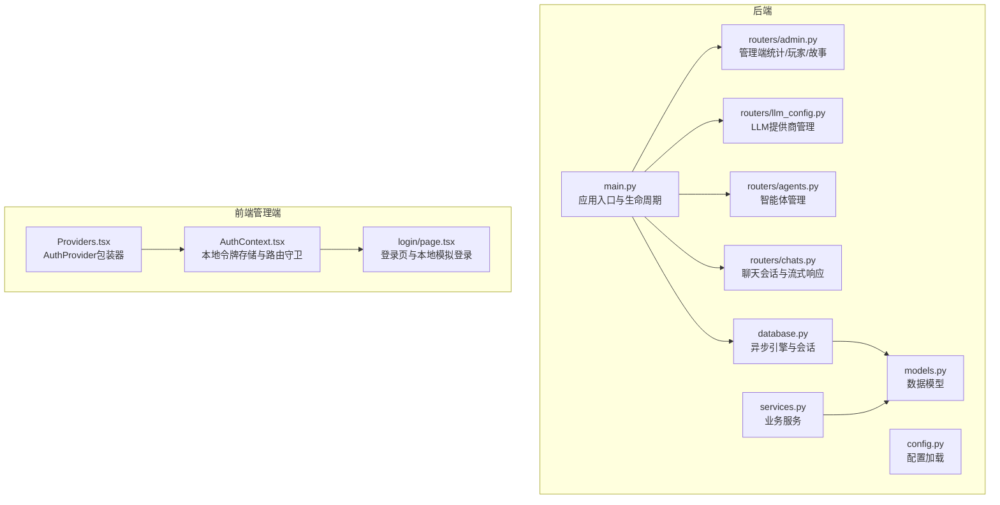
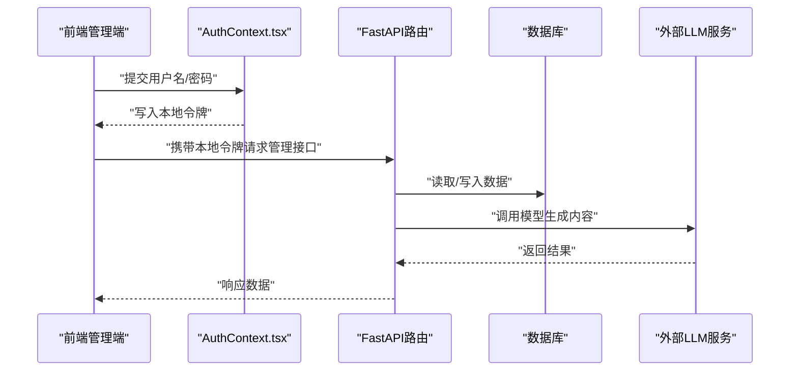
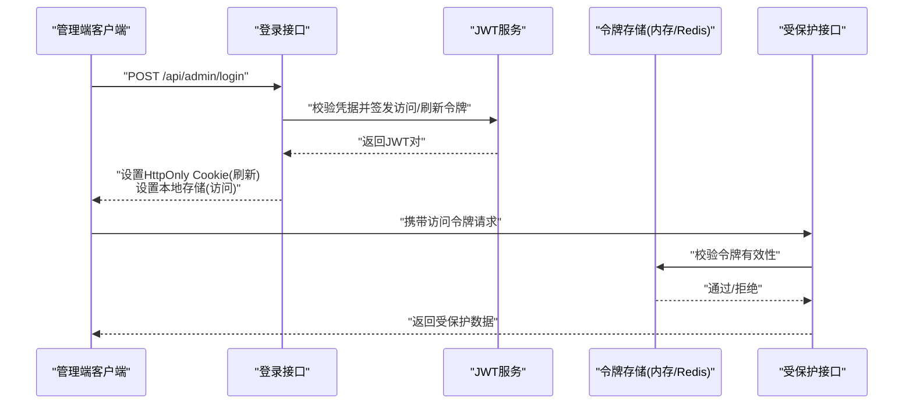
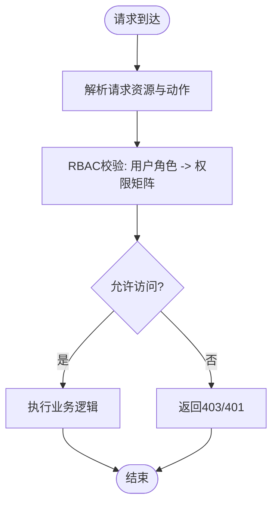
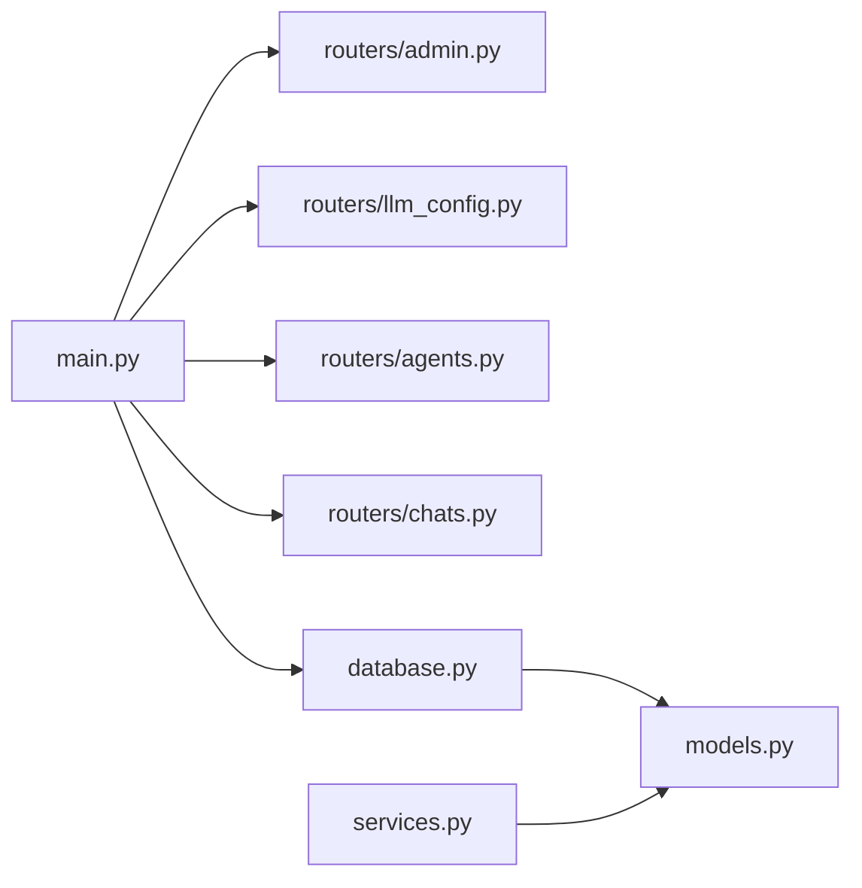

# 身份认证与授权

<cite>
**本文引用的文件**
- [backend/main.py](file://backend/main.py)
- [backend/config.py](file://backend/config.py)
- [backend/database.py](file://backend/database.py)
- [backend/models.py](file://backend/models.py)
- [backend/services.py](file://backend/services.py)
- [backend/routers/admin.py](file://backend/routers/admin.py)
- [backend/routers/llm_config.py](file://backend/routers/llm_config.py)
- [backend/routers/agents.py](file://backend/routers/agents.py)
- [backend/routers/chats.py](file://backend/routers/chats.py)
- [backend/admin/src/context/AuthContext.tsx](file://backend/admin/src/context/AuthContext.tsx)
- [backend/admin/src/app/admin/login/page.tsx](file://backend/admin/src/app/admin/login/page.tsx)
- [backend/admin/src/components/Providers.tsx](file://backend/admin/src/components/Providers.tsx)
</cite>

## 目录
1. [简介](#简介)
2. [项目结构](#项目结构)
3. [核心组件](#核心组件)
4. [架构总览](#架构总览)
5. [详细组件分析](#详细组件分析)
6. [依赖关系分析](#依赖关系分析)
7. [性能考虑](#性能考虑)
8. [故障排查指南](#故障排查指南)
9. [结论](#结论)
10. [附录](#附录)

## 简介
本文件面向“身份认证与授权”主题，结合当前代码库现状，系统化梳理后端服务、前端管理端、数据库模型与路由模块之间的协作关系，并基于现有实现提出可落地的配置与扩展建议，覆盖以下目标：
- 管理员身份认证机制：当前采用本地前端模拟登录与本地存储令牌；建议补充后端JWT签发、校验与刷新流程。
- 用户权限管理：当前未见细粒度RBAC模型；建议引入角色与权限矩阵，配合资源访问控制中间件。
- 会话管理：当前未见服务端会话持久化；建议引入Redis会话存储、超时与并发控制策略。
- 第三方认证：建议接入OAuth/SAML等企业级认证方案，统一SSO入口。
- API访问令牌：区分短期令牌与长期令牌，建议引入短期访问令牌与长期刷新令牌的双令牌模型。
- 权限审计与日志：建议完善操作审计表与统一日志采集。
- 多因素认证（MFA）：建议在登录流程中增加MFA步骤。

## 项目结构
后端采用FastAPI + SQLAlchemy异步ORM + Alembic迁移；前端管理端为Next.js应用，使用React Context进行本地会话状态管理。整体以路由模块划分功能域，数据库模型定义基础实体。

**图表来源**
- [backend/main.py](file://backend/main.py#L83-L98)
- [backend/config.py](file://backend/config.py#L1-L34)
- [backend/database.py](file://backend/database.py#L1-L31)
- [backend/models.py](file://backend/models.py#L1-L122)
- [backend/services.py](file://backend/services.py#L1-L66)
- [backend/routers/admin.py](file://backend/routers/admin.py#L1-L112)
- [backend/routers/llm_config.py](file://backend/routers/llm_config.py#L1-L203)
- [backend/routers/agents.py](file://backend/routers/agents.py#L1-L141)
- [backend/routers/chats.py](file://backend/routers/chats.py#L1-L275)
- [backend/admin/src/context/AuthContext.tsx](file://backend/admin/src/context/AuthContext.tsx#L1-L54)
- [backend/admin/src/app/admin/login/page.tsx](file://backend/admin/src/app/admin/login/page.tsx#L1-L93)
- [backend/admin/src/components/Providers.tsx](file://backend/admin/src/components/Providers.tsx#L1-L15)

**章节来源**
- [backend/main.py](file://backend/main.py#L83-L98)
- [backend/config.py](file://backend/config.py#L1-L34)
- [backend/database.py](file://backend/database.py#L1-L31)
- [backend/models.py](file://backend/models.py#L1-L122)
- [backend/admin/src/context/AuthContext.tsx](file://backend/admin/src/context/AuthContext.tsx#L1-L54)

## 核心组件
- 应用入口与生命周期：注册路由、CORS中间件、启动时执行数据库迁移与配置加载。
- 配置系统：集中管理数据库URL、Redis、AI密钥与模型参数。
- 数据库层：异步引擎、会话工厂与模型定义。
- 业务服务：玩家创建、世界初始化、叙事引擎交互。
- 管理端路由：统计、玩家列表、删除玩家、故事查询。
- LLM提供商路由：测试连接、增删改查。
- 智能体路由：智能体创建、查询、更新、删除。
- 聊天路由：会话创建、消息查询、消息发送（流式）、会话删除。
- 前端管理端：本地令牌存储、登录页、路由守卫。

**章节来源**
- [backend/main.py](file://backend/main.py#L1-L173)
- [backend/config.py](file://backend/config.py#L1-L34)
- [backend/database.py](file://backend/database.py#L1-L31)
- [backend/services.py](file://backend/services.py#L1-L66)
- [backend/routers/admin.py](file://backend/routers/admin.py#L1-L112)
- [backend/routers/llm_config.py](file://backend/routers/llm_config.py#L1-L203)
- [backend/routers/agents.py](file://backend/routers/agents.py#L1-L141)
- [backend/routers/chats.py](file://backend/routers/chats.py#L1-L275)
- [backend/admin/src/context/AuthContext.tsx](file://backend/admin/src/context/AuthContext.tsx#L1-L54)

## 架构总览
下图展示从客户端到后端路由、数据库与外部AI服务的整体调用链路，以及当前存在的安全薄弱点（本地令牌、无鉴权中间件）。

**图表来源**
- [backend/admin/src/context/AuthContext.tsx](file://backend/admin/src/context/AuthContext.tsx#L37-L47)
- [backend/admin/src/app/admin/login/page.tsx](file://backend/admin/src/app/admin/login/page.tsx#L43-L57)
- [backend/routers/admin.py](file://backend/routers/admin.py#L16-L31)
- [backend/routers/llm_config.py](file://backend/routers/llm_config.py#L20-L110)
- [backend/routers/chats.py](file://backend/routers/chats.py#L72-L258)

## 详细组件分析

### 管理员身份认证机制（当前与建议）
- 当前实现
  - 前端登录页通过本地表单校验，成功后向本地存储写入令牌并跳转。
  - 路由守卫在进入/admin路径时检查本地令牌，未登录则重定向至登录页。
  - 后端路由未做任何鉴权处理，存在安全风险。
- 建议方案
  - 后端引入JWT：签发短期访问令牌与长期刷新令牌，支持刷新与吊销。
  - 登录接口：校验凭据后签发JWT，返回双令牌。
  - 中间件：全局拦截器校验访问令牌有效性与过期时间。
  - 刷新：使用刷新令牌换取新的访问令牌，同时使旧令牌失效。
  - 安全增强：IP绑定、设备指纹、滑动过期、并发会话上限。

**图表来源**
- [backend/admin/src/app/admin/login/page.tsx](file://backend/admin/src/app/admin/login/page.tsx#L43-L57)
- [backend/admin/src/context/AuthContext.tsx](file://backend/admin/src/context/AuthContext.tsx#L37-L47)
- [backend/routers/admin.py](file://backend/routers/admin.py#L16-L31)

**章节来源**
- [backend/admin/src/context/AuthContext.tsx](file://backend/admin/src/context/AuthContext.tsx#L1-L54)
- [backend/admin/src/app/admin/login/page.tsx](file://backend/admin/src/app/admin/login/page.tsx#L1-L93)
- [backend/routers/admin.py](file://backend/routers/admin.py#L1-L112)

### 用户权限管理系统（角色、权限与资源控制）
- 当前实现
  - 未发现显式的角色与权限模型；管理端路由未做权限校验。
- 建议方案
  - 引入角色与权限枚举，建立用户-角色-权限映射表。
  - 在路由层或装饰器中实现RBAC校验：按资源与动作（CRUD）判断。
  - 对敏感操作（删除玩家、修改LLM提供商）强制要求更高权限。
  - 结合审计日志记录每次授权决策与操作结果。

**图表来源**
- [backend/routers/admin.py](file://backend/routers/admin.py#L59-L81)
- [backend/routers/llm_config.py](file://backend/routers/llm_config.py#L112-L138)
- [backend/routers/agents.py](file://backend/routers/agents.py#L15-L55)

**章节来源**
- [backend/routers/admin.py](file://backend/routers/admin.py#L59-L81)
- [backend/routers/llm_config.py](file://backend/routers/llm_config.py#L112-L138)
- [backend/routers/agents.py](file://backend/routers/agents.py#L15-L55)

### 会话管理配置（超时、并发与劫持防护）
- 当前实现
  - 仅使用本地存储令牌，未见服务端会话持久化与并发控制。
- 建议方案
  - 使用Redis存储会话与令牌，设置TTL与刷新窗口。
  - 并发控制：同一账户同时只允许N个活跃会话，新登录顶掉最旧会话。
  - 劫持防护：IP绑定、User-Agent校验、滑动过期、强制刷新。
  - 退出与吊销：登出即刻失效访问令牌，刷新令牌可撤销。

**章节来源**
- [backend/config.py](file://backend/config.py#L18-L19)
- [backend/database.py](file://backend/database.py#L19-L23)

### 第三方认证集成（OAuth/SAML/企业级）
- 建议方案
  - 使用统一认证网关（如Keycloak、Auth0、Okta）实现SSO。
  - 后端通过OIDC适配器对接，获取标准化用户声明与角色信息。
  - 将第三方用户映射到内部角色，保持RBAC一致。

[本节为概念性建议，不直接分析具体文件]

### API访问令牌（短期与长期）
- 建议方案
  - 短期令牌：15-60分钟，用于常规API调用。
  - 长期令牌：7-30天，用于需要持久登录的场景（谨慎使用）。
  - 刷新令牌：独立存储于HttpOnly Cookie，定期轮换。
  - 令牌吊销：黑名单机制或JTI（JWT ID）索引。

**章节来源**
- [backend/admin/src/context/AuthContext.tsx](file://backend/admin/src/context/AuthContext.tsx#L37-L47)

### 权限审计与日志记录
- 建议方案
  - 新建审计日志表：记录操作者、资源、动作、时间、结果、IP、User-Agent。
  - 对敏感操作（删除、修改配置）强制审计。
  - 统一日志格式与采集（如ELK），支持实时告警。

**章节来源**
- [backend/routers/agents.py](file://backend/routers/agents.py#L135-L136)

### 多因素认证（MFA）
- 建议方案
  - 登录流程：用户名/密码 + OTP（短信/邮件/硬件令牌）。
  - 受保护接口：二次校验或提升权限级别。
  - 设备信任：允许可信设备免MFA。

[本节为概念性建议，不直接分析具体文件]

## 依赖关系分析
后端应用通过路由模块组织功能，数据库层提供统一的异步会话注入，模型定义贯穿各模块的数据契约。

**图表来源**
- [backend/main.py](file://backend/main.py#L94-L97)
- [backend/routers/admin.py](file://backend/routers/admin.py#L1-L14)
- [backend/routers/llm_config.py](file://backend/routers/llm_config.py#L14-L18)
- [backend/routers/agents.py](file://backend/routers/agents.py#L9-L13)
- [backend/routers/chats.py](file://backend/routers/chats.py#L16-L20)
- [backend/database.py](file://backend/database.py#L1-L31)
- [backend/models.py](file://backend/models.py#L1-L122)
- [backend/services.py](file://backend/services.py#L1-L11)

**章节来源**
- [backend/main.py](file://backend/main.py#L94-L97)
- [backend/database.py](file://backend/database.py#L1-L31)
- [backend/models.py](file://backend/models.py#L1-L122)
- [backend/services.py](file://backend/services.py#L1-L11)

## 性能考虑
- 数据库连接池：合理设置连接数与溢出，避免高并发阻塞。
- 流式响应：聊天接口已采用流式输出，注意下游客户端缓冲与网络抖动处理。
- 缓存：Redis可用于会话与热点数据缓存，降低数据库压力。
- 日志：生产环境建议降级SQLAlchemy与Uvicorn访问日志级别，避免I/O瓶颈。

[本节提供通用指导，不直接分析具体文件]

## 故障排查指南
- 登录后无法访问管理端
  - 检查前端是否正确写入令牌与路由守卫逻辑。
  - 确认/admin路由未被CORS限制影响。
- 数据库连接失败
  - 查看启动阶段迁移与连接重试逻辑。
  - 检查DATABASE_URL与SQLite/PostgreSQL配置。
- LLM提供商测试失败
  - 核对API密钥、模型名与基础URL。
  - 检查代理网络与超时设置。
- 聊天流式响应中断
  - 检查外部LLM服务可用性与速率限制。
  - 关注日志中的异常与Token统计。

**章节来源**
- [backend/admin/src/context/AuthContext.tsx](file://backend/admin/src/context/AuthContext.tsx#L25-L35)
- [backend/main.py](file://backend/main.py#L45-L81)
- [backend/routers/llm_config.py](file://backend/routers/llm_config.py#L20-L110)
- [backend/routers/chats.py](file://backend/routers/chats.py#L144-L215)

## 结论
当前系统在管理端实现了简易的本地令牌登录，但缺乏后端鉴权、会话管理与权限控制。建议尽快引入JWT、RBAC、Redis会话存储与审计日志体系，并逐步接入企业级认证与MFA，以满足生产环境的安全与合规要求。

[本节为总结性内容，不直接分析具体文件]

## 附录
- 配置项清单（来自配置模块）
  - 数据库URL、Redis地址、AI密钥、默认模型名称
- 建议新增配置项
  - JWT密钥与算法、令牌有效期、会话存储类型与参数、审计日志开关

**章节来源**
- [backend/config.py](file://backend/config.py#L11-L29)