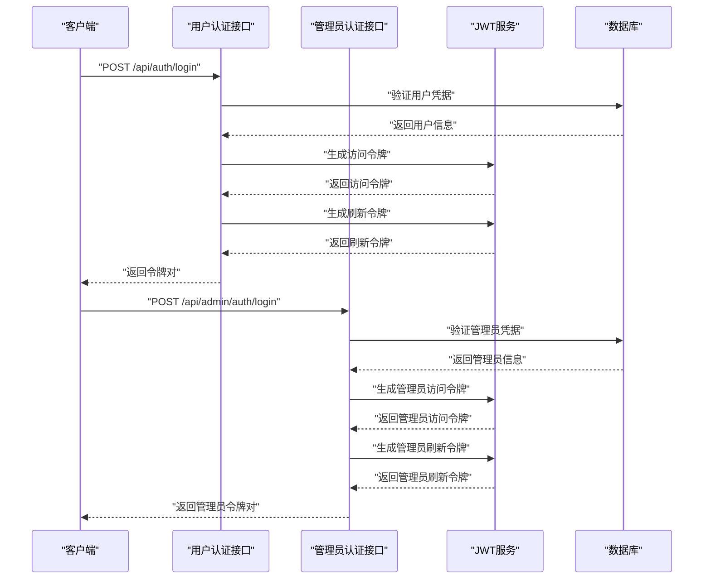
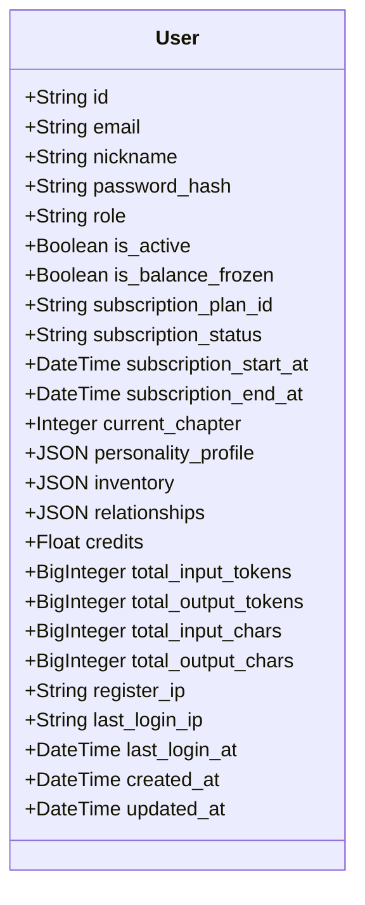
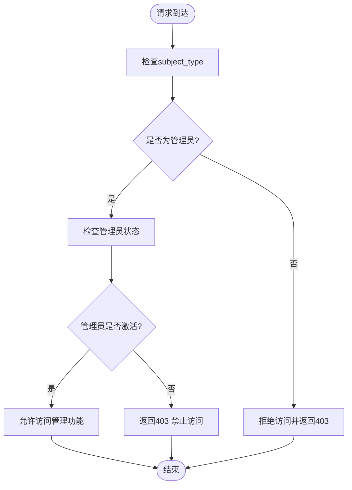
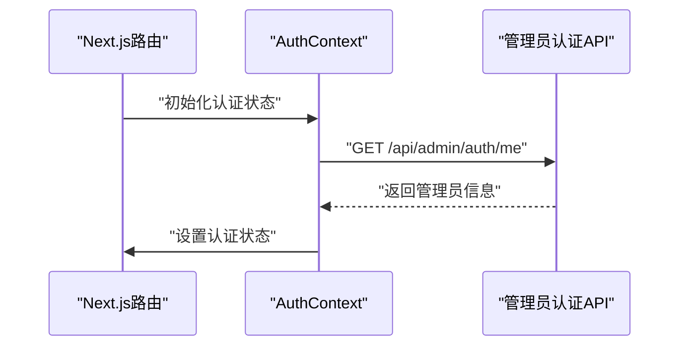

# 身份认证与授权

<cite>
**本文引用的文件**
- [backend/models.py](file://backend/models.py)
- [backend/auth.py](file://backend/auth.py)
- [backend/config.py](file://backend/config.py)
- [backend/routers/auth.py](file://backend/routers/auth.py)
- [backend/routers/admin_auth.py](file://backend/routers/admin_auth.py)
- [backend/schemas.py](file://backend/schemas.py)
- [backend/admin/src/context/AuthContext.tsx](file://backend/admin/src/context/AuthContext.tsx)
- [backend/admin/src/app/admin/login/page.tsx](file://backend/admin/src/app/admin/login/page.tsx)
- [backend/main.py](file://backend/main.py)
- [backend/migrations/versions/i5j6k7l8m9n0_split_user_admin_tables.py](file://backend/migrations/versions/i5j6k7l8m9n0_split_user_admin_tables.py)
</cite>

## 更新摘要
**变更内容**
- 完全重构用户认证系统，从Player表迁移到User/Admin双表架构
- 实现JWT认证系统，支持访问令牌和刷新令牌机制
- 新增独立的管理员认证路由和权限控制
- 集成bcrypt密码哈希和验证功能
- 建立用户模型和管理员模型分离的权限管理框架
- 更新前端管理端认证上下文以支持新的JWT系统

## 目录
1. [简介](#简介)
2. [JWT认证系统](#jwt认证系统)
3. [用户管理与权限控制](#用户管理与权限控制)
4. [管理员身份认证机制](#管理员身份认证机制)
5. [会话管理配置](#会话管理配置)
6. [前端集成与令牌管理](#前端集成与令牌管理)
7. [权限审计与日志记录](#权限审计与日志记录)
8. [多因素认证(MFA)实施建议](#多因素认证mfa实施建议)
9. [配置与部署指南](#配置与部署指南)
10. [故障排查指南](#故障排查指南)

## 简介
本文件详细介绍Infinite Game项目重构后的身份认证与授权系统。该系统基于JWT标准实现了完整的认证流程，包括用户注册、登录、令牌刷新、权限控制等功能。系统采用bcrypt进行密码哈希，支持管理员角色和用户权限分离，实现了从Player表到User/Admin双表架构的完全重构，为后续的企业级认证集成奠定了基础。

## JWT认证系统

### 令牌生成与验证
系统实现了完整的JWT令牌管理体系，包括访问令牌和刷新令牌的生成、验证和刷新机制。



**图表来源**
- [backend/routers/auth.py](file://backend/routers/auth.py#L63-L99)
- [backend/routers/admin_auth.py](file://backend/routers/admin_auth.py#L33-L73)
- [backend/auth.py](file://backend/auth.py#L30-L62)

### 密码哈希与验证
系统使用bcrypt进行密码安全存储，提供高效的密码验证机制。

**章节来源**
- [backend/auth.py](file://backend/auth.py#L19-L24)
- [backend/routers/auth.py](file://backend/routers/auth.py#L78-L83)
- [backend/routers/admin_auth.py](file://backend/routers/admin_auth.py#L43-L56)

## 用户管理与权限控制

### 用户模型设计
系统建立了完整的用户模型，支持基本用户信息、角色管理和状态控制，并集成了订阅系统。



**图表来源**
- [backend/models.py](file://backend/models.py#L35-L78)

### 角色与权限管理
系统实现了基于角色的访问控制(RBAC)，支持普通用户和管理员两种角色分离管理。

**章节来源**
- [backend/models.py](file://backend/models.py#L50-L51)
- [backend/auth.py](file://backend/auth.py#L83-L113)

### 用户认证流程
系统提供了完整的用户认证流程，包括注册、登录、令牌刷新和用户信息获取。

**章节来源**
- [backend/routers/auth.py](file://backend/routers/auth.py#L36-L136)

## 管理员身份认证机制

### 管理员权限控制
系统提供了专门的管理员权限控制装饰器，确保只有具备管理员角色的用户才能访问管理功能。



**图表来源**
- [backend/auth.py](file://backend/auth.py#L119-L156)
- [backend/routers/admin_auth.py](file://backend/routers/admin_auth.py#L33-L73)

### 管理员功能范围
管理员可以执行以下操作：
- 查看系统统计数据
- 管理用户账户
- 删除用户及其关联数据
- 查看和管理故事内容
- 管理LLM提供商配置
- 管理代理配置
- 管理订阅计划
- 查看信用交易记录

**章节来源**
- [backend/routers/admin_auth.py](file://backend/routers/admin_auth.py#L113-L118)

### 独立管理员认证路由
系统为管理员提供了独立的认证路由，与用户认证完全分离。

**章节来源**
- [backend/routers/admin_auth.py](file://backend/routers/admin_auth.py#L26-L30)

## 会话管理配置

### 令牌生命周期管理
系统配置了合理的令牌有效期，平衡安全性与用户体验。

**配置参数**
- 访问令牌有效期：30分钟
- 刷新令牌有效期：7天
- JWT算法：HS256
- JWT密钥：生产环境需使用随机生成的密钥

**章节来源**
- [backend/config.py](file://backend/config.py#L26-L30)

### 会话状态维护
系统通过数据库维护用户和管理员登录状态，包括最后登录时间和IP地址。

**章节来源**
- [backend/routers/auth.py](file://backend/routers/auth.py#L85-L89)
- [backend/routers/admin_auth.py](file://backend/routers/admin_auth.py#L58-L62)

## 前端集成与令牌管理

### 认证上下文设计
前端管理端使用React Context管理认证状态，实现了自动令牌验证和路由保护。



**图表来源**
- [backend/admin/src/context/AuthContext.tsx](file://backend/admin/src/context/AuthContext.tsx#L47-L75)

### 令牌存储策略
前端采用localStorage存储令牌，支持自动验证和错误处理。

**章节来源**
- [backend/admin/src/context/AuthContext.tsx](file://backend/admin/src/context/AuthContext.tsx#L85-L104)

### 登录界面集成
管理员登录界面集成了完整的认证流程，包括表单验证和错误处理。

**章节来源**
- [backend/admin/src/app/admin/login/page.tsx](file://backend/admin/src/app/admin/login/page.tsx#L58-L74)

## 权限审计与日志记录

### 审计日志设计
系统应记录以下关键操作：
- 用户登录/登出事件
- 管理员登录/登出事件
- 权限变更历史
- 错误访问尝试
- 令牌刷新记录

### 日志记录建议
- 记录操作者、资源、动作、时间、结果
- 包含IP地址和User-Agent信息
- 对敏感操作强制审计
- 支持实时告警和日志轮转

## 多因素认证(MFA)实施建议

### MFA集成方案
建议在现有JWT基础上增加MFA：
- 登录流程：用户名/密码 + OTP验证码
- 受保护接口：二次校验或提升权限级别
- 设备信任：允许可信设备免MFA

### 安全增强措施
- IP绑定和User-Agent校验
- 滑动过期机制
- 并发会话控制
- 强制定期重新认证

## 配置与部署指南

### 生产环境配置
1. **JWT密钥管理**
   - 使用随机生成的32字节密钥
   - 部署到环境变量中
   - 定期轮换密钥

2. **数据库配置**
   - 使用PostgreSQL替代SQLite
   - 配置连接池参数
   - 启用SSL连接

3. **Redis会话存储**
   - 配置Redis集群
   - 设置TTL和过期策略
   - 启用持久化

### 环境变量配置
- `JWT_SECRET_KEY`: JWT加密密钥
- `ACCESS_TOKEN_EXPIRE_MINUTES`: 访问令牌有效期
- `REFRESH_TOKEN_EXPIRE_DAYS`: 刷新令牌有效期
- `DATABASE_URL`: 数据库连接字符串
- `REDIS_URL`: Redis连接地址

**章节来源**
- [backend/config.py](file://backend/config.py#L26-L30)

## 故障排查指南

### 常见问题诊断

#### 1. 登录失败
**症状**: 用户无法登录，返回401错误
**可能原因**:
- 密码错误
- 账户被禁用
- JWT密钥配置错误
- 数据库连接问题

**解决方法**:
- 验证用户凭据
- 检查用户状态
- 确认JWT密钥配置
- 测试数据库连接

#### 2. 令牌过期
**症状**: 访问受保护资源时401错误
**可能原因**:
- 访问令牌过期
- 服务器时间不同步
- 令牌被意外清除

**解决方法**:
- 使用刷新令牌获取新访问令牌
- 同步服务器时间
- 检查浏览器存储状态

#### 3. 权限不足
**症状**: 访问管理功能时403错误
**可能原因**:
- 用户非管理员角色
- 权限配置错误
- 会话状态异常

**解决方法**:
- 验证用户角色
- 检查权限配置
- 重新登录获取正确权限

### 开发调试技巧

#### 1. API测试
使用curl测试认证接口：
```bash
# 注册用户
curl -X POST http://localhost:8000/api/auth/register \
  -H "Content-Type: application/json" \
  -d '{"email":"test@example.com","nickname":"Test","password":"password"}'

# 用户登录获取令牌
curl -X POST http://localhost:8000/api/auth/login \
  -H "Content-Type: application/json" \
  -d '{"email":"test@example.com","password":"password"}'

# 管理员登录获取令牌
curl -X POST http://localhost:8000/api/admin/auth/login \
  -H "Content-Type: application/json" \
  -d '{"email":"admin@example.com","password":"adminpassword"}'
```

#### 2. 调试工具
- 使用Postman测试API接口
- 启用详细日志输出
- 检查浏览器开发者工具Network面板
- 验证JWT令牌结构

**章节来源**
- [backend/routers/auth.py](file://backend/routers/auth.py#L63-L136)
- [backend/admin/src/context/AuthContext.tsx](file://backend/admin/src/context/AuthContext.tsx#L85-L116)