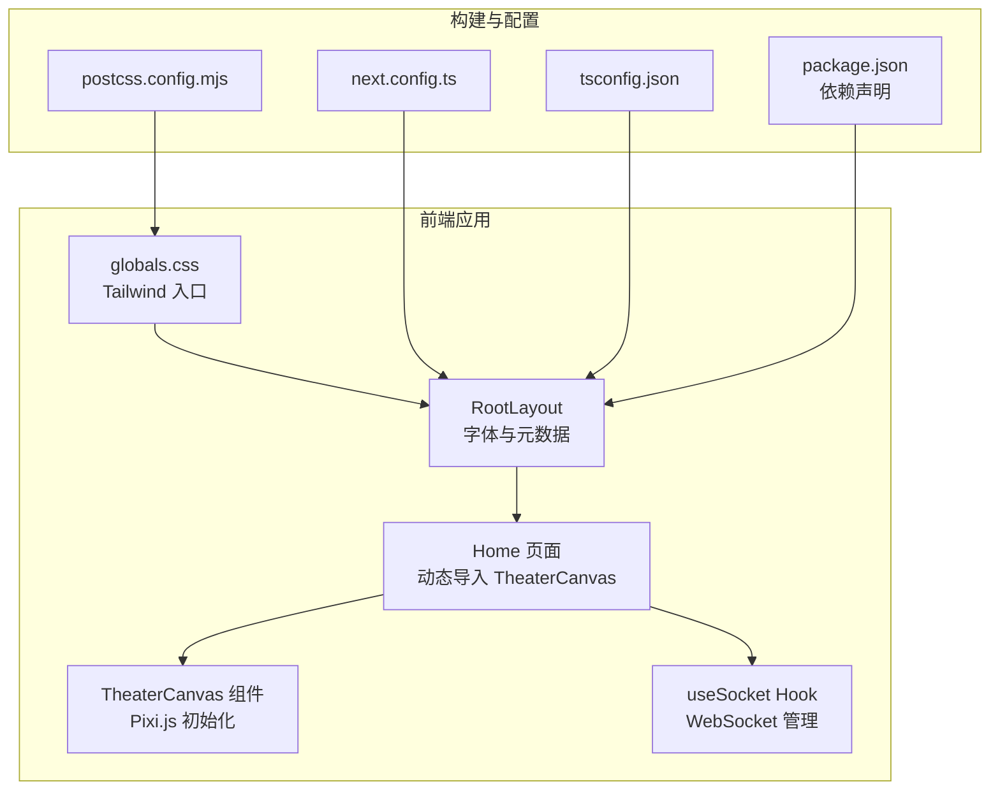
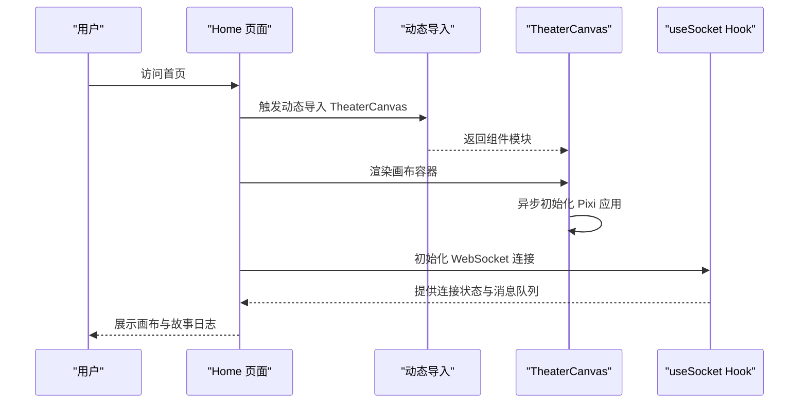
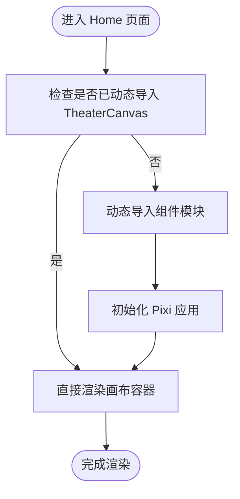
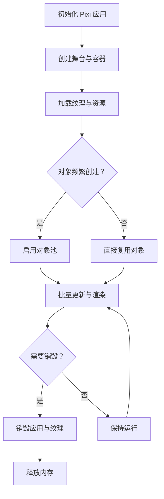
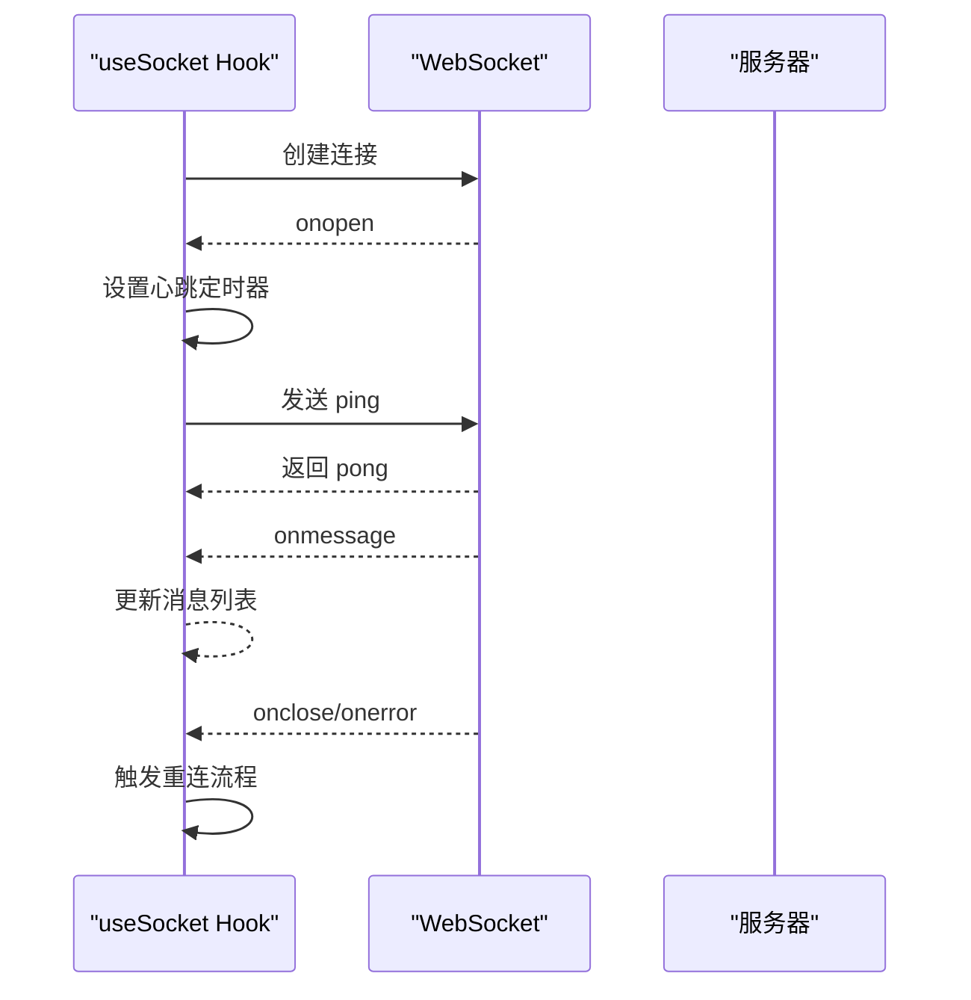
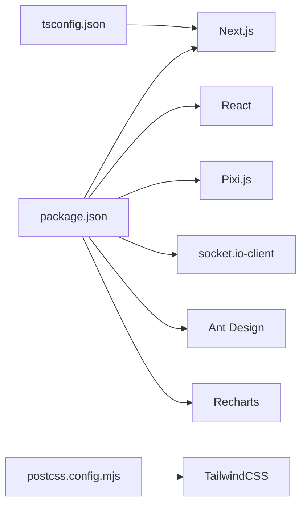

# 前端性能优化

<cite>
**本文引用的文件**
- [frontend/src/app/layout.tsx](file://frontend/src/app/layout.tsx)
- [frontend/src/app/page.tsx](file://frontend/src/app/page.tsx)
- [frontend/src/components/TheaterCanvas.tsx](file://frontend/src/components/TheaterCanvas.tsx)
- [frontend/src/hooks/useSocket.ts](file://frontend/src/hooks/useSocket.ts)
- [frontend/next.config.ts](file://frontend/next.config.ts)
- [frontend/package.json](file://frontend/package.json)
- [frontend/src/app/globals.css](file://frontend/src/app/globals.css)
- [frontend/tsconfig.json](file://frontend/tsconfig.json)
- [frontend/postcss.config.mjs](file://frontend/postcss.config.mjs)
- [backend/admin/src/lib/utils.ts](file://backend/admin/src/lib/utils.ts)
- [backend/admin/src/components/ui/button.tsx](file://backend/admin/src/components/ui/button.tsx)
</cite>

## 目录
1. [引言](#引言)
2. [项目结构](#项目结构)
3. [核心组件](#核心组件)
4. [架构总览](#架构总览)
5. [详细组件分析](#详细组件分析)
6. [依赖分析](#依赖分析)
7. [性能考量](#性能考量)
8. [故障排查指南](#故障排查指南)
9. [结论](#结论)
10. [附录](#附录)

## 引言
本指南面向Next.js前端应用与Pixi.js剧场画布的性能优化实践，结合当前仓库中的实际实现，系统阐述以下主题：代码分割与懒加载、预取机制；Pixi.js渲染优化（对象池、纹理管理、帧率控制）；WebSocket连接优化（连接复用、消息压缩、心跳检测）；静态资源优化（图片压缩与缓存策略）；内存泄漏防护与DOM操作优化；以及性能监控与测试方法。文档在每个技术点后均给出与仓库文件对应的“章节来源”或“图表来源”，便于读者定位到具体实现。

## 项目结构
前端采用Next.js 16.1.6，使用TypeScript与TailwindCSS，核心页面与组件位于frontend目录；剧场画布通过动态导入实现客户端侧初始化；WebSocket逻辑封装在自定义Hook中；全局样式通过TailwindCSS按需引入。

**图表来源**
- [frontend/src/app/layout.tsx](file://frontend/src/app/layout.tsx#L1-L35)
- [frontend/src/app/page.tsx](file://frontend/src/app/page.tsx#L1-L85)
- [frontend/src/components/TheaterCanvas.tsx](file://frontend/src/components/TheaterCanvas.tsx#L1-L50)
- [frontend/src/hooks/useSocket.ts](file://frontend/src/hooks/useSocket.ts#L1-L43)
- [frontend/src/app/globals.css](file://frontend/src/app/globals.css#L1-L27)
- [frontend/next.config.ts](file://frontend/next.config.ts#L1-L8)
- [frontend/tsconfig.json](file://frontend/tsconfig.json#L1-L35)
- [frontend/postcss.config.mjs](file://frontend/postcss.config.mjs#L1-L8)
- [frontend/package.json](file://frontend/package.json#L1-L35)

**章节来源**
- [frontend/src/app/layout.tsx](file://frontend/src/app/layout.tsx#L1-L35)
- [frontend/src/app/page.tsx](file://frontend/src/app/page.tsx#L1-L85)
- [frontend/src/app/globals.css](file://frontend/src/app/globals.css#L1-L27)
- [frontend/next.config.ts](file://frontend/next.config.ts#L1-L8)
- [frontend/tsconfig.json](file://frontend/tsconfig.json#L1-L35)
- [frontend/postcss.config.mjs](file://frontend/postcss.config.mjs#L1-L8)
- [frontend/package.json](file://frontend/package.json#L1-L35)

## 核心组件
- 动态导入与懒加载：首页对剧场画布组件进行服务端禁用的动态导入，确保仅在客户端执行，降低首屏包体与初次渲染压力。
- Pixi.js画布：组件在挂载时异步加载库并在卸载时销毁应用实例，避免常驻内存占用。
- WebSocket管理：自定义Hook负责建立连接、接收消息、关闭清理，并暴露发送函数，便于上层组件调用。
- 字体与样式：根布局引入Geist字体变量，全局样式通过TailwindCSS按需编译，减少无关样式体积。

**章节来源**
- [frontend/src/app/page.tsx](file://frontend/src/app/page.tsx#L3-L7)
- [frontend/src/components/TheaterCanvas.tsx](file://frontend/src/components/TheaterCanvas.tsx#L14-L44)
- [frontend/src/hooks/useSocket.ts](file://frontend/src/hooks/useSocket.ts#L3-L33)
- [frontend/src/app/layout.tsx](file://frontend/src/app/layout.tsx#L5-L13)
- [frontend/src/app/globals.css](file://frontend/src/app/globals.css#L1-L27)

## 架构总览
下图展示从页面到画布与WebSocket的交互路径，体现懒加载与客户端初始化的关键节点。

**图表来源**
- [frontend/src/app/page.tsx](file://frontend/src/app/page.tsx#L7-L12)
- [frontend/src/components/TheaterCanvas.tsx](file://frontend/src/components/TheaterCanvas.tsx#L16-L35)
- [frontend/src/hooks/useSocket.ts](file://frontend/src/hooks/useSocket.ts#L8-L33)

## 详细组件分析

### Next.js 代码分割与懒加载
- 实现方式：页面中对剧场画布组件使用动态导入并禁用SSR，确保仅在浏览器端加载。
- 性能收益：减少首屏JavaScript体积，提升TTFB与FCP；画布相关代码按需下载。
- 优化建议：对其他重型第三方库（如图表、编辑器）同样采用动态导入；为关键路径组件设置预取（见下一节）。

**图表来源**
- [frontend/src/app/page.tsx](file://frontend/src/app/page.tsx#L7-L7)
- [frontend/src/components/TheaterCanvas.tsx](file://frontend/src/components/TheaterCanvas.tsx#L16-L35)

**章节来源**
- [frontend/src/app/page.tsx](file://frontend/src/app/page.tsx#L3-L7)
- [frontend/src/components/TheaterCanvas.tsx](file://frontend/src/components/TheaterCanvas.tsx#L14-L44)

### 预取机制（Prefetch）
- 当前实现：页面中对剧场画布采用动态导入，未显式使用Next.js的预取API。
- 优化建议：在用户即将进入剧场场景前，使用Next.js的预取能力提前加载画布模块；对后续可能访问的页面或组件也启用预取，缩短交互延迟。

[本节为通用优化建议，不直接分析具体文件，故无“章节来源”]

### Pixi.js 渲染优化
- 对象池：建议对频繁创建/销毁的剧场对象（精灵、粒子、文本）建立对象池，减少GC压力。
- 纹理管理：合并纹理图集、按需加载、及时释放不再使用的纹理；利用PIXI的纹理缓存与自动管理。
- 帧率控制：限制最大帧率、使用requestAnimationFrame节流、剔除不可见对象、批量更新属性。
- 内存清理：组件卸载时彻底销毁应用实例与子项，避免悬挂引用。

**图表来源**
- [frontend/src/components/TheaterCanvas.tsx](file://frontend/src/components/TheaterCanvas.tsx#L16-L42)

**章节来源**
- [frontend/src/components/TheaterCanvas.tsx](file://frontend/src/components/TheaterCanvas.tsx#L14-L44)

### WebSocket 连接优化
- 连接复用：在Hook内维护单一WebSocket实例，避免重复创建导致的资源浪费与连接抖动。
- 消息压缩：在应用层对消息进行压缩（如JSON序列化前的字段裁剪），或在服务端启用传输层压缩。
- 心跳检测：定期发送ping/pong，监听close/error事件以触发重连与降级处理。
- 错误与重连：记录错误码与时间戳，指数退避重连，避免风暴效应。

**图表来源**
- [frontend/src/hooks/useSocket.ts](file://frontend/src/hooks/useSocket.ts#L8-L33)

**章节来源**
- [frontend/src/hooks/useSocket.ts](file://frontend/src/hooks/useSocket.ts#L3-L42)

### 静态资源优化与缓存策略
- 图片压缩：优先使用现代格式（WebP/AVIF），按设备像素比选择合适尺寸；对背景与图标启用懒加载。
- 缓存策略：利用HTTP缓存头与版本化资源名；对第三方字体与静态媒体设置长缓存；对动态内容设置合理max-age与stale策略。
- TailwindCSS：按需生成样式，避免全量引入；生产环境开启摇树优化。

**章节来源**
- [frontend/src/app/globals.css](file://frontend/src/app/globals.css#L1-L27)
- [frontend/postcss.config.mjs](file://frontend/postcss.config.mjs#L1-L8)

### 内存泄漏防护与DOM操作优化
- 泄漏防护：在组件卸载时销毁Pixi应用、取消定时器、移除事件监听；避免闭包持有DOM引用。
- DOM优化：减少不必要的重排与重绘；使用React.memo与useMemo稳定子组件；批量更新状态，避免频繁setState。
- 资源释放：及时释放Canvas上下文、纹理与离屏渲染资源；对动画循环使用cancelAnimationFrame。

**章节来源**
- [frontend/src/components/TheaterCanvas.tsx](file://frontend/src/components/TheaterCanvas.tsx#L39-L43)
- [frontend/src/hooks/useSocket.ts](file://frontend/src/hooks/useSocket.ts#L30-L33)

### 性能监控与测试方法
- 监控指标：FP/FCP/LCP/FID/CLS/TTFB；FPS（可基于requestAnimationFrame统计）；WebSocket延迟与丢包率。
- 工具推荐：浏览器开发者工具性能面板、Lighthouse、WebPageTest；在生产环境集成遥测SDK（如埋点上报）。
- 测试方法：基准测试（Benchmark）、A/B测试（不同优化策略对比）、压力测试（高并发消息与渲染负载）。

[本节为通用指导，不直接分析具体文件，故无“章节来源”]

## 依赖分析
- 运行时依赖：Next.js、React、Pixi.js、socket.io-client、Ant Design、Recharts等。
- 构建与样式：TailwindCSS v4、PostCSS、TypeScript。
- 优化关联：动态导入依赖Next.js的模块打包；Tailwind按需编译影响CSS体积；TS严格模式有助于早期发现潜在性能问题。

**图表来源**
- [frontend/package.json](file://frontend/package.json#L11-L22)
- [frontend/postcss.config.mjs](file://frontend/postcss.config.mjs#L1-L8)
- [frontend/tsconfig.json](file://frontend/tsconfig.json#L2-L23)

**章节来源**
- [frontend/package.json](file://frontend/package.json#L1-L35)
- [frontend/tsconfig.json](file://frontend/tsconfig.json#L1-L35)
- [frontend/postcss.config.mjs](file://frontend/postcss.config.mjs#L1-L8)

## 性能考量
- 代码分割与懒加载：已通过动态导入实现，建议进一步对非关键路径模块启用预取。
- 渲染性能：Pixi.js适合高频渲染场景，应结合对象池与纹理管理；限制帧率与剔除不可见对象。
- 网络性能：WebSocket连接应具备心跳与重连策略；消息体尽量精简；必要时启用压缩。
- 资源体积：Tailwind按需引入；图片采用现代格式与响应式尺寸；字体与静态资源设置长缓存。
- 内存与GC：组件卸载时彻底清理；避免闭包与DOM泄漏；批量更新状态。

[本节为通用指导，不直接分析具体文件，故无“章节来源”]

## 故障排查指南
- WebSocket无法连接：检查端口号与路由；确认跨域与证书配置；观察onerror回调输出。
- 画布不显示：确认动态导入成功且仅在客户端执行；检查容器尺寸与初始化参数。
- FPS下降：排查是否有大量新建对象、未释放纹理、未限制帧率；使用性能面板定位瓶颈。
- 样式异常：检查Tailwind按需编译与CSS入口；确认字体变量已在根布局注入。

**章节来源**
- [frontend/src/hooks/useSocket.ts](file://frontend/src/hooks/useSocket.ts#L8-L33)
- [frontend/src/components/TheaterCanvas.tsx](file://frontend/src/components/TheaterCanvas.tsx#L16-L35)
- [frontend/src/app/layout.tsx](file://frontend/src/app/layout.tsx#L5-L13)
- [frontend/src/app/globals.css](file://frontend/src/app/globals.css#L1-L27)

## 结论
本项目在Next.js动态导入与Tailwind按需编译方面已有良好基础，建议在此基础上进一步完善：对关键模块启用预取、加强Pixi.js对象池与纹理管理、为WebSocket增加心跳与重连、优化图片与缓存策略、强化内存与DOM优化，并建立完善的性能监控与测试体系。这些措施将显著提升用户体验与系统稳定性。

[本节为总结性内容，不直接分析具体文件，故无“章节来源”]

## 附录
- 与UI组件相关的样式工具与按钮组件展示了Tailwind类名合并与变体系统，有助于在保证样式一致性的同时减少冗余类名。

**章节来源**
- [backend/admin/src/lib/utils.ts](file://backend/admin/src/lib/utils.ts#L1-L7)
- [backend/admin/src/components/ui/button.tsx](file://backend/admin/src/components/ui/button.tsx#L1-L57)