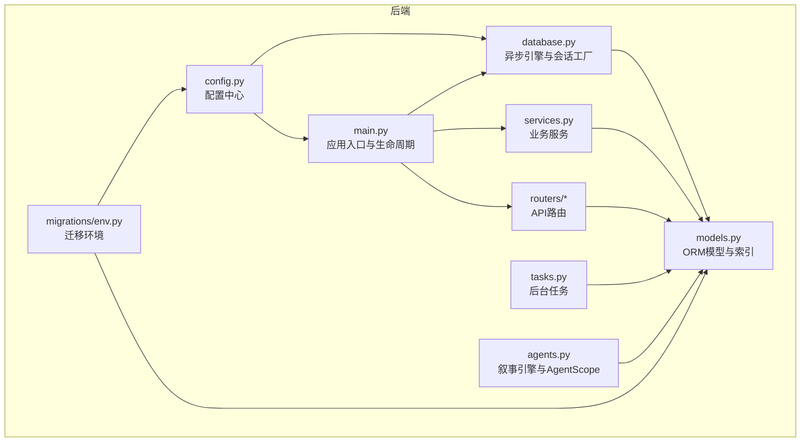
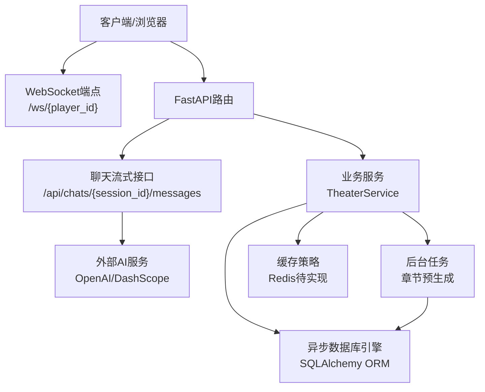
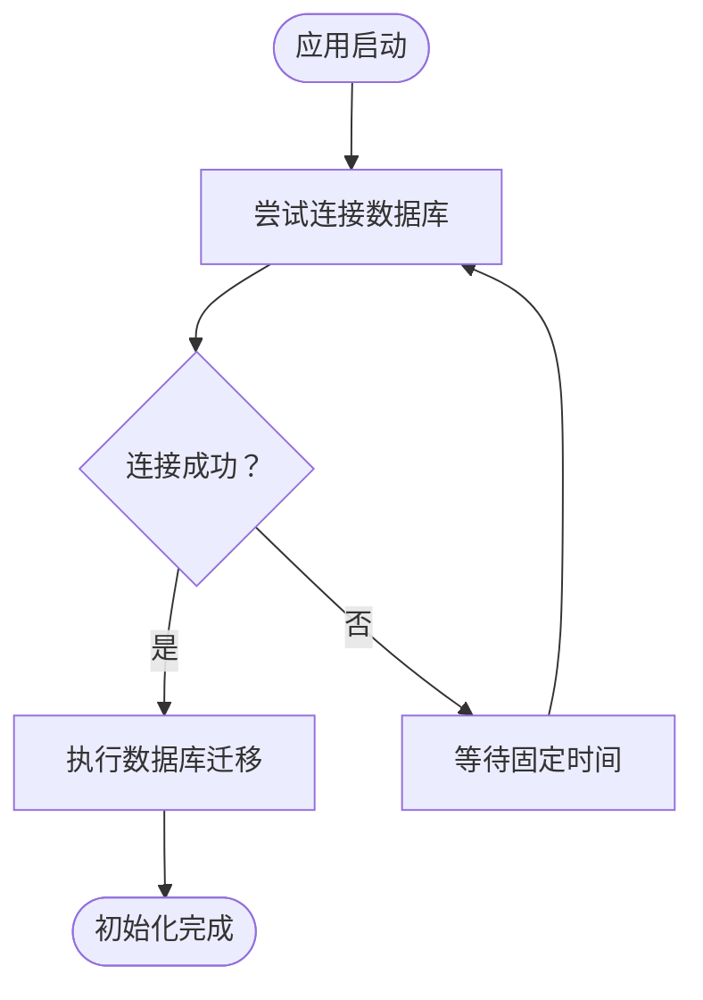
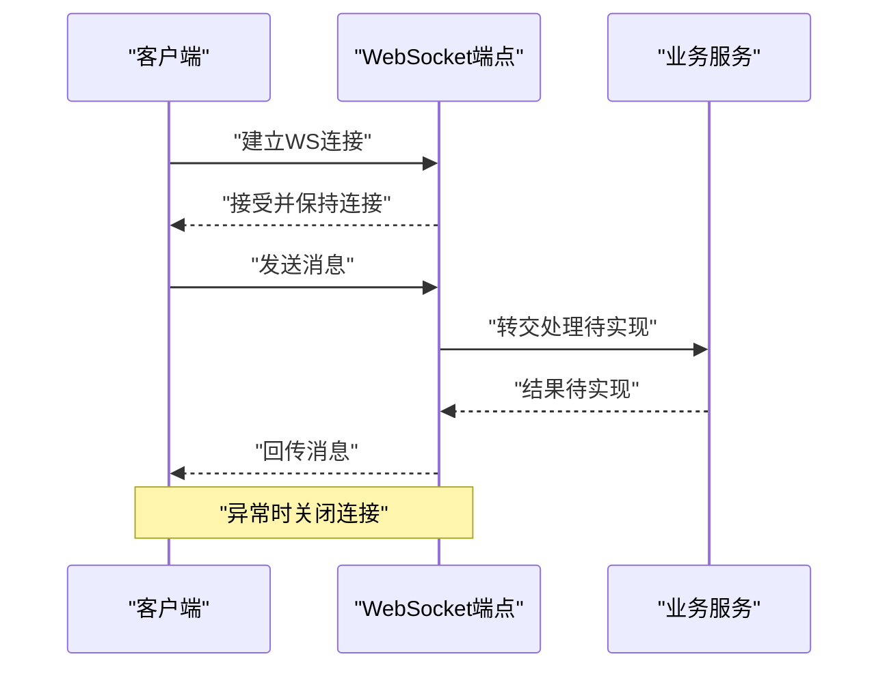
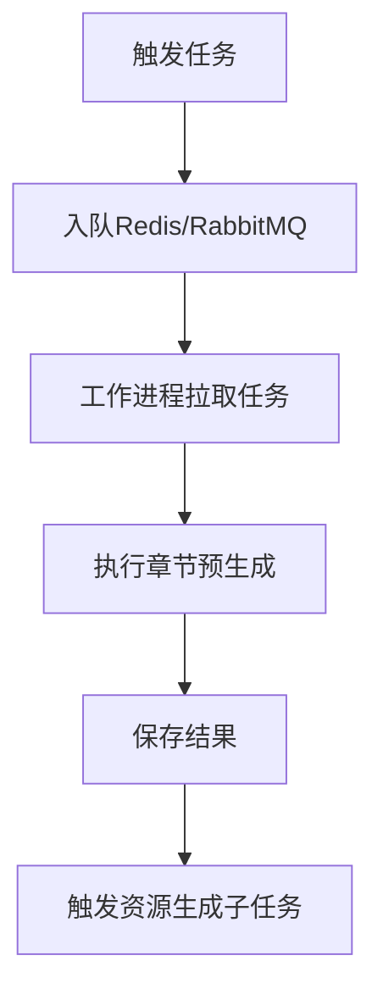
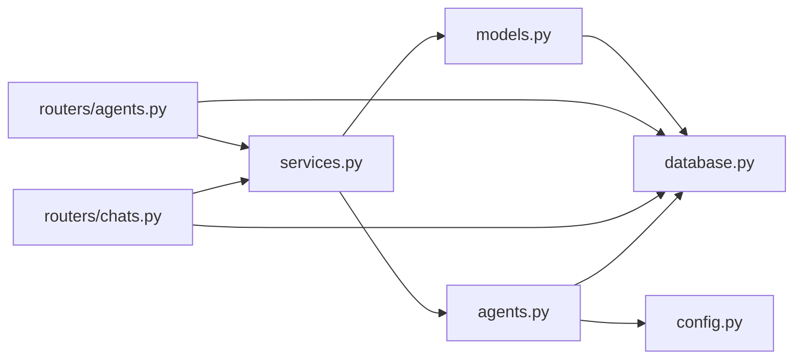

# 后端性能优化

<cite>
**本文引用的文件**
- [backend/main.py](file://backend/main.py)
- [backend/database.py](file://backend/database.py)
- [backend/models.py](file://backend/models.py)
- [backend/config.py](file://backend/config.py)
- [backend/tasks.py](file://backend/tasks.py)
- [backend/services.py](file://backend/services.py)
- [backend/routers/agents.py](file://backend/routers/agents.py)
- [backend/routers/chats.py](file://backend/routers/chats.py)
- [backend/agents.py](file://backend/agents.py)
- [backend/migrations/env.py](file://backend/migrations/env.py)
- [backend/requirements.txt](file://backend/requirements.txt)
- [frontend/src/hooks/useSocket.ts](file://frontend/src/hooks/useSocket.ts)
- [dev.py](file://dev.py)
</cite>

## 目录
1. [简介](#简介)
2. [项目结构](#项目结构)
3. [核心组件](#核心组件)
4. [架构总览](#架构总览)
5. [详细组件分析](#详细组件分析)
6. [依赖关系分析](#依赖关系分析)
7. [性能考量](#性能考量)
8. [故障排查指南](#故障排查指南)
9. [结论](#结论)
10. [附录](#附录)

## 简介
本指南聚焦于FastAPI后端在本项目中的性能优化策略与最佳实践，覆盖异步数据库连接池配置、SQLAlchemy ORM优化、连接重试机制、WebSocket连接管理与消息处理、并发控制、后台任务调度、缓存策略与内存管理、数据库查询与索引、事务管理、日志优化与错误处理、性能监控以及生产环境部署调优建议。内容基于仓库中实际代码进行分析，并提供可操作的改进建议。

## 项目结构
后端采用FastAPI + SQLAlchemy异步ORM + Alembic迁移的典型架构，路由层按功能模块拆分，服务层封装业务逻辑，模型定义数据结构与索引，配置集中管理数据库与外部服务地址，迁移脚本负责数据库版本演进。



图表来源
- [backend/main.py](file://backend/main.py#L1-L173)
- [backend/database.py](file://backend/database.py#L1-L31)
- [backend/models.py](file://backend/models.py#L1-L122)
- [backend/config.py](file://backend/config.py#L1-L34)
- [backend/services.py](file://backend/services.py#L1-L66)
- [backend/tasks.py](file://backend/tasks.py#L1-L62)
- [backend/agents.py](file://backend/agents.py#L1-L196)
- [backend/migrations/env.py](file://backend/migrations/env.py#L1-L105)

章节来源
- [backend/main.py](file://backend/main.py#L1-L173)
- [backend/database.py](file://backend/database.py#L1-L31)
- [backend/models.py](file://backend/models.py#L1-L122)
- [backend/config.py](file://backend/config.py#L1-L34)
- [backend/migrations/env.py](file://backend/migrations/env.py#L1-L105)

## 核心组件
- 异步数据库引擎与连接池：通过异步引擎与会话工厂统一管理连接生命周期，启用预检与溢出连接，适配SQLite与PostgreSQL。
- 路由与服务：按领域拆分路由，服务层封装业务流程，避免在路由中直接执行复杂逻辑。
- 叙事引擎：基于AgentScope的多Agent协作生成故事内容，支持流式响应与Token统计。
- WebSocket：提供基础的双向通信通道，便于后续扩展为实时状态推送。
- 后台任务：章节预生成与资源生成等耗时任务，建议结合队列系统异步化。
- 配置中心：集中管理数据库URL、Redis、AI密钥与模型参数，支持环境变量覆盖。

章节来源
- [backend/database.py](file://backend/database.py#L1-L31)
- [backend/services.py](file://backend/services.py#L1-L66)
- [backend/routers/chats.py](file://backend/routers/chats.py#L1-L275)
- [backend/routers/agents.py](file://backend/routers/agents.py#L1-L141)
- [backend/agents.py](file://backend/agents.py#L1-L196)
- [backend/main.py](file://backend/main.py#L157-L169)
- [backend/tasks.py](file://backend/tasks.py#L1-L62)
- [backend/config.py](file://backend/config.py#L1-L34)

## 架构总览
下图展示从客户端到数据库与外部AI服务的请求链路，以及后台任务与缓存的交互位置。



图表来源
- [backend/main.py](file://backend/main.py#L157-L169)
- [backend/routers/chats.py](file://backend/routers/chats.py#L72-L258)
- [backend/services.py](file://backend/services.py#L1-L66)
- [backend/agents.py](file://backend/agents.py#L154-L191)
- [backend/config.py](file://backend/config.py#L18-L19)

## 详细组件分析

### 异步数据库连接池与连接重试
- 连接池配置要点
  - 预检与自动重连：启用连接前校验，提升连接可用性。
  - 池大小与溢出：根据并发峰值设置池大小与溢出数量，避免排队等待。
  - SQLite特例：禁用多线程限制以适配异步事件循环。
- 生命周期重试
  - 应用启动时对数据库连接与迁移进行重试，失败后短暂等待再重试，提升部署稳定性。
- 建议
  - 生产环境使用PostgreSQL并开启连接池参数调优；为高并发场景增加池大小与超时阈值。
  - 对外服务（如AI）失败时引入指数退避与熔断策略，避免级联故障。



图表来源
- [backend/main.py](file://backend/main.py#L45-L81)
- [backend/database.py](file://backend/database.py#L8-L17)

章节来源
- [backend/database.py](file://backend/database.py#L1-L31)
- [backend/main.py](file://backend/main.py#L45-L81)

### SQLAlchemy ORM优化与事务管理
- 模型设计
  - 为高频查询字段建立索引（如字符串主键与唯一字段），减少全表扫描。
  - JSON字段用于动态配置，注意查询时避免全量读取，必要时拆分或缓存。
- 查询优化
  - 使用select语句显式过滤与排序，配合offset/limit分页。
  - 批量写入与提交，减少往返次数。
- 事务与一致性
  - 在长事务中保持最小作用域，避免长时间锁表。
  - 对并发写入场景使用乐观锁或唯一约束，降低冲突概率。

```mermaid
erDiagram
PLAYER {
string id PK
string username UK
datetime created_at
}
STORYCHAPTER {
integer id PK
string player_id FK
integer chapter_number
string status
datetime created_at
}
ASSET {
integer id PK
string type
string content_hash IK
datetime last_accessed
}
AGENT {
string id PK
string name UK
string provider_id FK
float temperature
integer context_window
}
CHATSESSION {
integer id PK
integer agent_id FK
datetime updated_at
}
CHATMESSAGE {
integer id PK
integer session_id FK
string role
datetime created_at
}
LLM_PROVIDER {
string id PK
string name UK
boolean is_active
boolean is_default
}
PLAYER ||--o{ STORYCHAPTER : "拥有"
PLAYER ||--o{ CHATMESSAGE : "参与"
AGENT }o--|| LLM_PROVIDER : "关联"
CHATSESSION }o--|| AGENT : "使用"
CHATSESSION ||--o{ CHATMESSAGE : "包含"
```

图表来源
- [backend/models.py](file://backend/models.py#L9-L122)

章节来源
- [backend/models.py](file://backend/models.py#L1-L122)
- [backend/routers/agents.py](file://backend/routers/agents.py#L15-L55)
- [backend/routers/chats.py](file://backend/routers/chats.py#L39-L70)

### WebSocket连接管理与消息处理
- 当前实现
  - 接受连接后进入循环读取消息，收到文本后回显，异常时关闭连接。
- 性能与并发
  - 单连接内串行处理消息，建议引入消息队列或并发池，避免阻塞。
  - 为每个player_id维护连接映射，防止重复连接导致资源浪费。
  - 对心跳与超时进行管理，及时清理僵尸连接。
- 扩展建议
  - 将玩家输入交由业务服务处理，WebSocket仅负责传输。
  - 结合Redis发布订阅，向特定玩家推送状态更新。



图表来源
- [backend/main.py](file://backend/main.py#L157-L169)
- [frontend/src/hooks/useSocket.ts](file://frontend/src/hooks/useSocket.ts#L1-L42)

章节来源
- [backend/main.py](file://backend/main.py#L157-L169)
- [frontend/src/hooks/useSocket.ts](file://frontend/src/hooks/useSocket.ts#L1-L42)

### 后台任务调度与并发控制
- 现状
  - 使用BackgroundTasks触发世界初始化，但未实现异步后台任务队列。
- 优化建议
  - 引入任务队列（如Celery/RQ）与工作进程，将长耗时任务异步化。
  - 对章节预生成与资源生成任务进行幂等与去重，避免重复计算。
  - 为任务添加重试与失败告警，保障可靠性。



图表来源
- [backend/main.py](file://backend/main.py#L147-L155)
- [backend/tasks.py](file://backend/tasks.py#L7-L56)

章节来源
- [backend/main.py](file://backend/main.py#L147-L155)
- [backend/tasks.py](file://backend/tasks.py#L1-L62)

### 缓存策略与内存管理
- 缓存建议
  - 对热点查询结果（如Agent列表、LLM Provider配置）使用Redis缓存，设置合理TTL。
  - 对生成内容（章节摘要、图片URL）进行缓存，避免重复调用AI服务。
- 内存管理
  - 流式响应时避免一次性拼接过长文本，分块处理并及时释放中间变量。
  - 控制历史消息长度，定期截断或归档。

章节来源
- [backend/config.py](file://backend/config.py#L18-L19)
- [backend/routers/chats.py](file://backend/routers/chats.py#L112-L258)

### 数据库查询优化、索引策略与事务
- 索引策略
  - 字段：字符串主键与唯一字段（如用户名、Agent名称）建立索引。
  - JSON字段：若需按键查询，考虑拆分或使用GIN索引（PostgreSQL）。
- 查询优化
  - 分页查询使用offset/limit，避免一次性加载大量数据。
  - 复合条件查询尽量使用复合索引或覆盖索引。
- 事务
  - 将相关写操作放入同一事务，减少锁竞争。
  - 对只读查询使用只读事务，降低锁持有时间。

章节来源
- [backend/models.py](file://backend/models.py#L12-L13, L27-L28, L48-L50, L61-L62, L83-L84, L93-L94, L103-L104)
- [backend/routers/agents.py](file://backend/routers/agents.py#L57-L71)
- [backend/routers/chats.py](file://backend/routers/chats.py#L63-L70)

### 日志优化、错误处理与性能监控
- 日志优化
  - 关闭SQLAlchemy与Uvicorn访问日志噪声，保留应用日志。
  - 对聊天流式接口记录输入字符数、上下文窗口、Token统计与耗时。
- 错误处理
  - 对AI服务异常进行捕获与降级，返回稳定提示。
  - 对数据库异常进行重试与回滚，避免脏状态。
- 监控
  - 建议接入指标系统（如Prometheus）与分布式追踪（如OpenTelemetry），采集请求延迟、错误率、数据库连接池使用率与AI调用耗时。

章节来源
- [backend/main.py](file://backend/main.py#L13-L28)
- [backend/routers/chats.py](file://backend/routers/chats.py#L133-L234)

### 生产环境部署性能调优
- 服务器与容器
  - 使用高性能Web服务器（如Uvicorn多进程/多核）与反向代理（Nginx）。
  - 容器化部署时固定资源限制与健康检查。
- 数据库
  - 使用PostgreSQL并启用连接池参数优化；开启慢查询日志与统计信息收集。
- 并发与限流
  - 对AI服务调用进行速率限制与并发上限，避免被限流或触发熔断。
  - 对WebSocket连接数与消息频率进行限流，防止资源耗尽。
- 部署脚本
  - 开发脚本已支持并行启动后端、前端与管理面板，生产环境建议使用编排工具（如Docker Compose/Kubernetes）统一管理。

章节来源
- [dev.py](file://dev.py#L108-L131)
- [backend/requirements.txt](file://backend/requirements.txt#L1-L20)

## 依赖关系分析
- 组件耦合
  - 路由依赖服务层与数据库会话；服务层依赖模型与叙事引擎；叙事引擎依赖配置与外部AI服务。
- 外部依赖
  - FastAPI、SQLAlchemy异步、Uvicorn、Alembic、AgentScope、OpenAI/DashScope等。
- 循环依赖
  - 代码中未发现明显循环导入；模型、配置与路由之间通过依赖注入解耦。



图表来源
- [backend/routers/agents.py](file://backend/routers/agents.py#L1-L141)
- [backend/routers/chats.py](file://backend/routers/chats.py#L1-L275)
- [backend/services.py](file://backend/services.py#L1-L66)
- [backend/agents.py](file://backend/agents.py#L1-L196)
- [backend/models.py](file://backend/models.py#L1-L122)
- [backend/config.py](file://backend/config.py#L1-L34)
- [backend/database.py](file://backend/database.py#L1-L31)

章节来源
- [backend/routers/agents.py](file://backend/routers/agents.py#L1-L141)
- [backend/routers/chats.py](file://backend/routers/chats.py#L1-L275)
- [backend/services.py](file://backend/services.py#L1-L66)
- [backend/agents.py](file://backend/agents.py#L1-L196)
- [backend/models.py](file://backend/models.py#L1-L122)
- [backend/config.py](file://backend/config.py#L1-L34)
- [backend/database.py](file://backend/database.py#L1-L31)

## 性能考量
- I/O密集型优化
  - 异步I/O与连接池是关键；避免在路由中执行同步阻塞操作。
- CPU密集型优化
  - 将AI生成与图像处理移至专用Worker或队列，避免占用主请求线程。
- 存储与网络
  - 对静态资源使用CDN；对数据库与AI服务使用就近部署与专线。
- 资源限制
  - 设置合理的超时与并发上限，防止雪崩效应。

## 故障排查指南
- 数据库连接失败
  - 检查数据库URL与凭据；确认连接池参数；观察启动阶段重试日志。
- 迁移失败
  - 查看迁移脚本输出；确认目标数据库版本与权限。
- WebSocket异常
  - 检查客户端连接状态与服务端异常日志；验证心跳与超时配置。
- 聊天流式响应异常
  - 关注AI服务返回状态与Token统计；记录输入/输出字符数以便定位问题。
- 后台任务堆积
  - 检查队列与工作进程状态；确认任务幂等与去重策略。

章节来源
- [backend/main.py](file://backend/main.py#L45-L81)
- [backend/migrations/env.py](file://backend/migrations/env.py#L42-L104)
- [backend/routers/chats.py](file://backend/routers/chats.py#L211-L215)
- [backend/main.py](file://backend/main.py#L157-L169)

## 结论
本项目已具备良好的异步基础与清晰的模块划分。后续可在以下方面进一步提升性能与稳定性：完善连接池与重试策略、引入后台任务队列、实施缓存与索引优化、强化日志与监控体系，并在生产环境中进行系统性的容量与压力测试。

## 附录
- 快速检查清单
  - 数据库：连接池参数、索引覆盖率、慢查询分析。
  - 服务：异步I/O、并发限制、错误重试。
  - 缓存：热点数据缓存、TTL与失效策略。
  - 监控：指标采集、告警规则、日志聚合。
  - 部署：容器资源限制、健康检查、滚动升级。