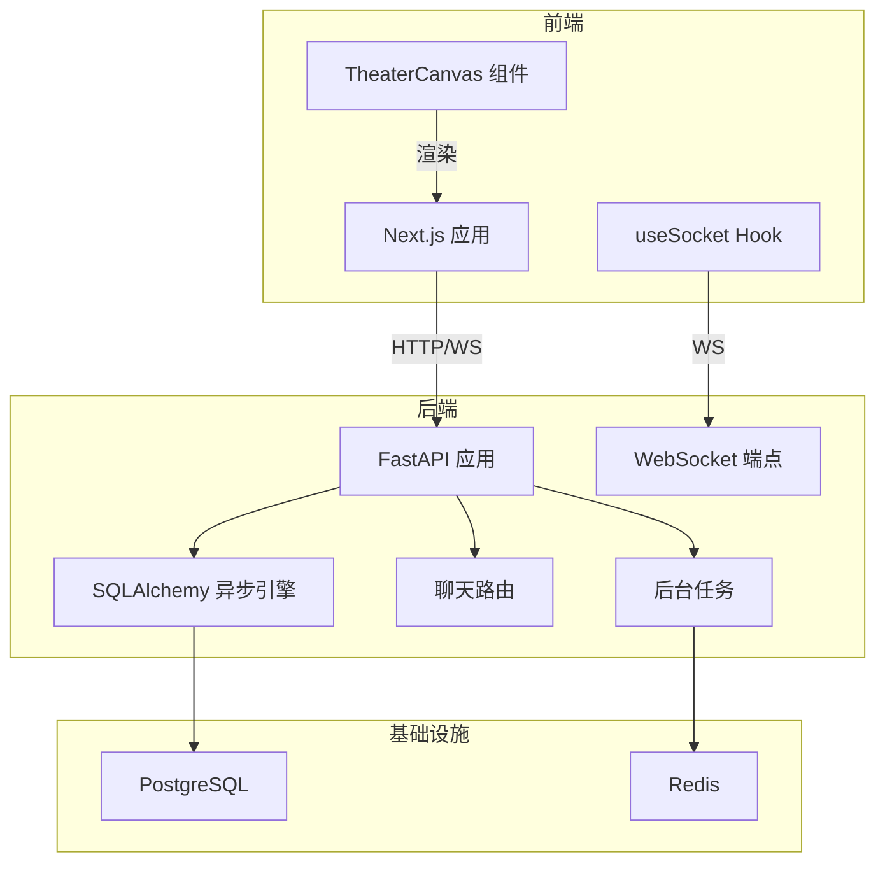
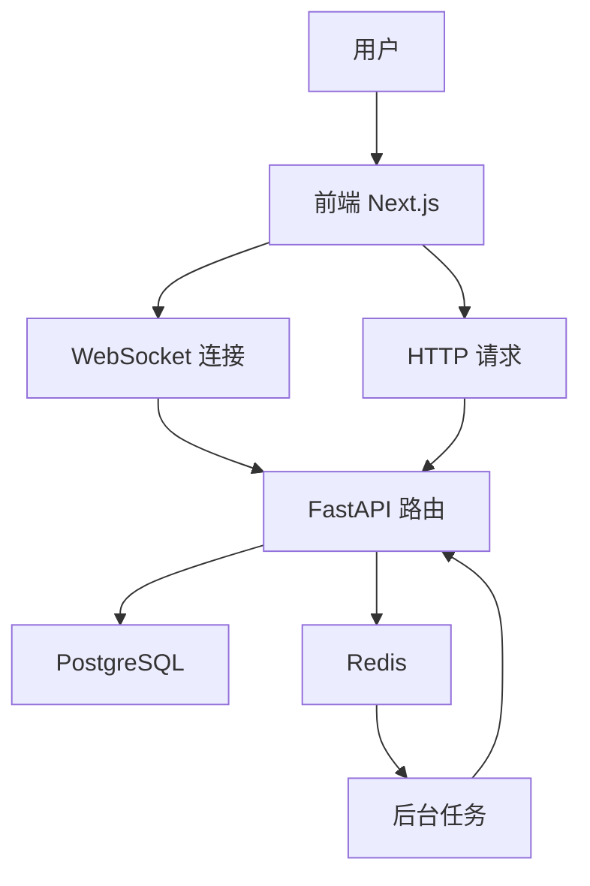
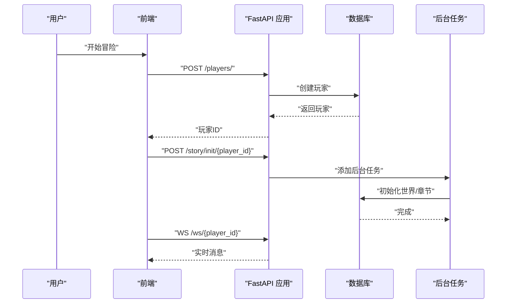
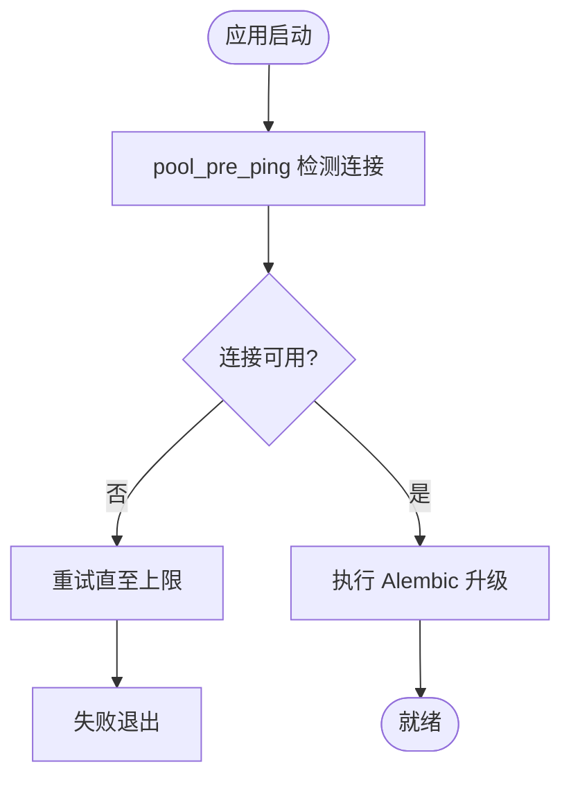
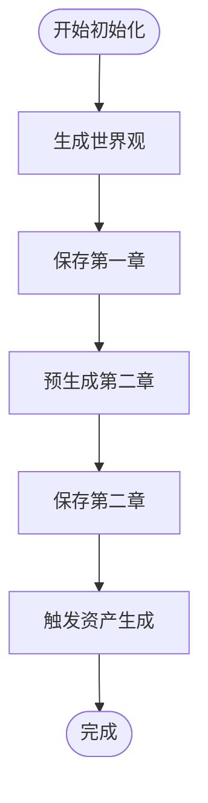
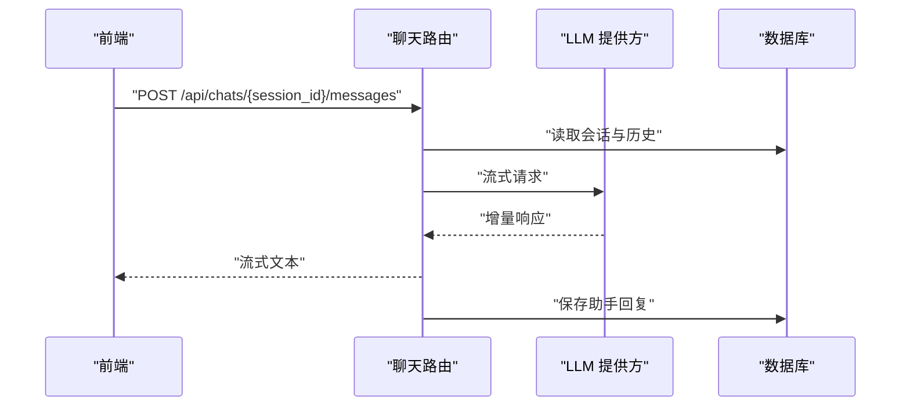
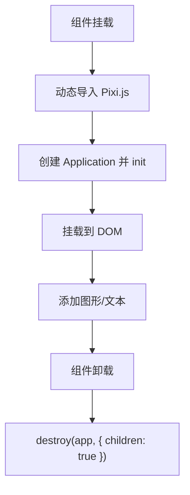
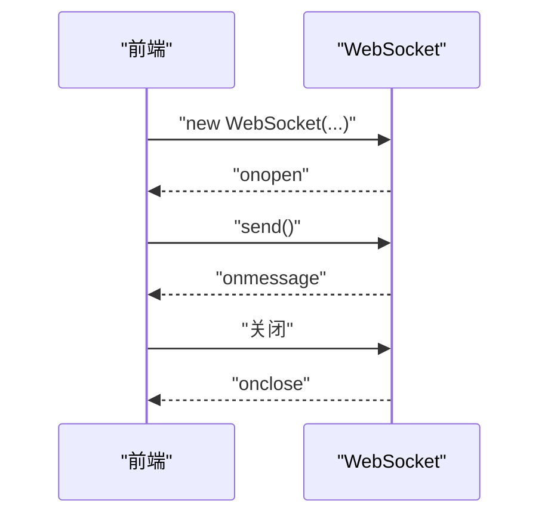
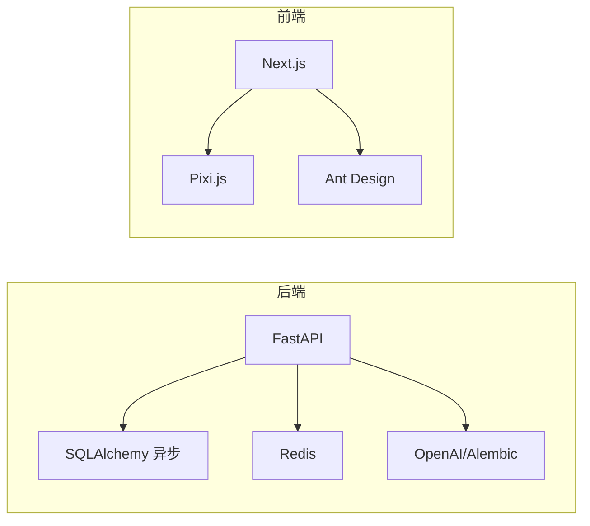

# 性能优化

<cite>
**本文引用的文件**
- [backend/main.py](file://backend/main.py)
- [backend/database.py](file://backend/database.py)
- [backend/config.py](file://backend/config.py)
- [backend/services.py](file://backend/services.py)
- [backend/models.py](file://backend/models.py)
- [backend/routers/chats.py](file://backend/routers/chats.py)
- [backend/tasks.py](file://backend/tasks.py)
- [frontend/src/components/TheaterCanvas.tsx](file://frontend/src/components/TheaterCanvas.tsx)
- [frontend/src/hooks/useSocket.ts](file://frontend/src/hooks/useSocket.ts)
- [frontend/next.config.ts](file://frontend/next.config.ts)
- [frontend/package.json](file://frontend/package.json)
- [docs/wiki/Architecture.md](file://docs/wiki/Architecture.md)
- [docs/wiki/Deployment.md](file://docs/wiki/Deployment.md)
- [backend/requirements.txt](file://backend/requirements.txt)
- [backend/.env.example](file://backend/.env.example)
</cite>

## 目录
1. [简介](#简介)
2. [项目结构](#项目结构)
3. [核心组件](#核心组件)
4. [架构总览](#架构总览)
5. [详细组件分析](#详细组件分析)
6. [依赖关系分析](#依赖关系分析)
7. [性能考虑](#性能考虑)
8. [故障排查指南](#故障排查指南)
9. [结论](#结论)
10. [附录](#附录)

## 简介
本指南面向“无限叙事剧场”项目的后端与前端性能优化，覆盖数据库查询优化、缓存策略、连接池配置、异步处理；前端画布渲染优化、资源加载与内存管理；WebSocket 连接优化（消息压缩、心跳、连接复用）；负载均衡与水平扩展；CDN 与静态资源缓存、图片压缩；性能测试与基准测试方法；以及性能瓶颈识别与解决方案。

## 项目结构
- 后端采用 FastAPI + SQLAlchemy 异步 ORM，结合 Alembic 迁移与异步事件生命周期管理。
- 前端采用 Next.js 16 客户端组件与 Pixi.js 画布渲染，WebSocket 客户端通过自定义 Hook 管理连接。
- 架构文档指出后端使用 PostgreSQL 与 Redis，具备后台任务与多模态资产管线的扩展能力。

**图表来源**
- [docs/wiki/Architecture.md](file://docs/wiki/Architecture.md#L1-L62)
- [backend/main.py](file://backend/main.py#L127-L173)
- [backend/routers/chats.py](file://backend/routers/chats.py#L1-L275)
- [backend/database.py](file://backend/database.py#L1-L31)
- [frontend/src/components/TheaterCanvas.tsx](file://frontend/src/components/TheaterCanvas.tsx#L1-L50)
- [frontend/src/hooks/useSocket.ts](file://frontend/src/hooks/useSocket.ts#L1-L43)

**章节来源**
- [docs/wiki/Architecture.md](file://docs/wiki/Architecture.md#L1-L62)
- [docs/wiki/Deployment.md](file://docs/wiki/Deployment.md#L1-L65)

## 核心组件
- 后端入口与生命周期：应用初始化、CORS、路由注册、数据库迁移与启动项加载。
- 数据库与会话：异步引擎、连接池参数、会话工厂与依赖注入。
- 业务服务：玩家创建、世界初始化、叙事生成与章节保存。
- 路由与流式响应：聊天会话创建、消息列表、发送消息（流式输出）。
- 前端画布与 WebSocket：客户端 Pixi.js 初始化、消息收发与清理。
- 任务与后台生成：章节预生成、资产生成触发。

**章节来源**
- [backend/main.py](file://backend/main.py#L1-L173)
- [backend/database.py](file://backend/database.py#L1-L31)
- [backend/services.py](file://backend/services.py#L1-L66)
- [backend/routers/chats.py](file://backend/routers/chats.py#L1-L275)
- [frontend/src/components/TheaterCanvas.tsx](file://frontend/src/components/TheaterCanvas.tsx#L1-L50)
- [frontend/src/hooks/useSocket.ts](file://frontend/src/hooks/useSocket.ts#L1-L43)
- [backend/tasks.py](file://backend/tasks.py#L1-L62)

## 架构总览
系统采用前后端分离，后端以 FastAPI 提供 REST 与 WebSocket 接口，数据库为 PostgreSQL，缓存与任务队列使用 Redis。前端 Next.js 负责页面与画布渲染，WebSocket 用于实时交互。

**图表来源**
- [docs/wiki/Architecture.md](file://docs/wiki/Architecture.md#L1-L62)
- [backend/main.py](file://backend/main.py#L127-L173)
- [backend/routers/chats.py](file://backend/routers/chats.py#L1-L275)
- [backend/database.py](file://backend/database.py#L1-L31)

## 详细组件分析

### 后端入口与生命周期（性能相关）
- 事件循环与日志：Windows 下设置事件循环策略与 UTF-8 输出，降低日志噪声。
- 生命周期：启动阶段执行数据库连接与迁移，失败重试，避免冷启动阻塞。
- CORS：允许本地开发源，减少跨域错误导致的额外请求往返。
- 路由注册：按模块化注册，便于拆分与独立优化。
- WebSocket：基础端点占位，后续可扩展心跳、压缩与鉴权。
- 异步任务：后台任务通过独立会话写入数据库，避免阻塞主请求。

**图表来源**
- [backend/main.py](file://backend/main.py#L127-L173)
- [backend/services.py](file://backend/services.py#L12-L59)
- [backend/tasks.py](file://backend/tasks.py#L7-L56)

**章节来源**
- [backend/main.py](file://backend/main.py#L1-L173)

### 数据库与连接池（性能相关）
- 引擎配置：关闭 SQL 日志、启用 pool_pre_ping、设置 pool_size 与 max_overflow，适配高并发与瞬时峰值。
- 会话工厂：expire_on_commit=False，减少事务结束后的对象失效开销。
- 依赖注入：get_db 提供异步上下文，避免全局状态引发的锁竞争。
- 迁移与启动：启动阶段执行 Alembic 升级，确保模式一致性，避免运行期模式变更带来的抖动。

**图表来源**
- [backend/database.py](file://backend/database.py#L8-L23)
- [backend/main.py](file://backend/main.py#L45-L81)

**章节来源**
- [backend/database.py](file://backend/database.py#L1-L31)
- [backend/main.py](file://backend/main.py#L45-L81)

### 业务服务与异步处理（性能相关）
- 玩家创建：单条插入 + 提交 + 刷新，最小化事务时间。
- 世界初始化：分阶段生成章节，先写入已完成章节，再准备下一章节，降低首屏等待。
- 异步任务：后台生成章节与资产，避免阻塞主线程，提升吞吐。

**图表来源**
- [backend/services.py](file://backend/services.py#L19-L59)
- [backend/tasks.py](file://backend/tasks.py#L7-L56)

**章节来源**
- [backend/services.py](file://backend/services.py#L1-L66)
- [backend/tasks.py](file://backend/tasks.py#L1-L62)

### 路由与流式响应（性能相关）
- 聊天会话：创建、列表、详情、消息列表。
- 发送消息：构建历史消息、选择 LLM 提供方、流式返回响应，边生成边输出，降低首字延迟。
- 流式统计：记录输入/输出字符数与令牌用量，便于成本与性能监控。
- 保存助手回复：使用新会话写入，避免与当前请求会话冲突。

**图表来源**
- [backend/routers/chats.py](file://backend/routers/chats.py#L72-L258)

**章节来源**
- [backend/routers/chats.py](file://backend/routers/chats.py#L1-L275)

### 前端画布与渲染（性能相关）
- 动态导入：仅在客户端侧加载 Pixi.js，避免 SSR 带来的包体积与初始化开销。
- 应用初始化：指定宽高与背景色，一次性创建应用实例并挂载到容器。
- 清理销毁：组件卸载时销毁应用及其子元素、纹理，防止内存泄漏。
- 画布容器：圆角与阴影样式不影响渲染性能，主要关注渲染帧率与对象数量。

**图表来源**
- [frontend/src/components/TheaterCanvas.tsx](file://frontend/src/components/TheaterCanvas.tsx#L14-L44)

**章节来源**
- [frontend/src/components/TheaterCanvas.tsx](file://frontend/src/components/TheaterCanvas.tsx#L1-L50)

### WebSocket 连接与消息处理（性能相关）
- 连接建立：本地 WebSocket 地址，onopen/onmessage/onclose 简化状态管理。
- 发送消息：仅在 OPEN 状态发送，避免异常。
- 断开清理：组件卸载时主动关闭，释放资源。
- 优化建议：心跳保活、消息压缩、连接复用、鉴权与限流。

**图表来源**
- [frontend/src/hooks/useSocket.ts](file://frontend/src/hooks/useSocket.ts#L8-L33)

**章节来源**
- [frontend/src/hooks/useSocket.ts](file://frontend/src/hooks/useSocket.ts#L1-L43)
- [backend/main.py](file://backend/main.py#L157-L169)

### 缓存策略（Redis 与数据库）
- Redis 用途：任务队列、会话状态缓存、资产缓存（LRU）。
- 数据库缓存：利用索引与查询优化，减少重复计算与 IO。
- 建议：对热点查询结果增加应用层缓存，结合 TTL 与失效策略。

**章节来源**
- [docs/wiki/Architecture.md](file://docs/wiki/Architecture.md#L46-L53)
- [backend/config.py](file://backend/config.py#L18-L19)

### 负载均衡与水平扩展
- 后端：多实例部署，共享数据库与 Redis，使用反向代理（Nginx/Traefik）做负载均衡。
- 前端：静态资源由 CDN 分发，Next.js 构建产物可部署至边缘网络。
- 扩展策略：根据聊天与生成流量峰值，按需扩容后端实例与 Redis 集群。

**章节来源**
- [docs/wiki/Architecture.md](file://docs/wiki/Architecture.md#L1-L62)
- [docs/wiki/Deployment.md](file://docs/wiki/Deployment.md#L23-L49)

## 依赖关系分析
- 后端依赖：FastAPI、Uvicorn、SQLAlchemy 异步、Redis、OpenAI、Alembic、asyncpg/aiosqlite。
- 前端依赖：Next.js、Pixi.js、Ant Design、SWR、Socket.IO 客户端。
- 配置：.env 示例包含数据库与 Redis 连接串，便于本地与生产环境切换。

**图表来源**
- [backend/requirements.txt](file://backend/requirements.txt#L1-L20)
- [frontend/package.json](file://frontend/package.json#L11-L33)
- [backend/.env.example](file://backend/.env.example#L1-L4)

**章节来源**
- [backend/requirements.txt](file://backend/requirements.txt#L1-L20)
- [frontend/package.json](file://frontend/package.json#L1-L35)
- [backend/.env.example](file://backend/.env.example#L1-L4)

## 性能考虑

### 后端性能优化策略
- 数据库查询优化
  - 使用索引字段进行过滤与排序，避免全表扫描。
  - 分页查询（skip/limit）限制结果集大小，必要时使用游标分页。
  - 批量写入与合并事务，减少提交次数。
  - 避免 N+1 查询，使用联结或预先加载策略。
- 连接池配置
  - pool_pre_ping：自动重连，提升稳定性。
  - pool_size 与 max_overflow：根据并发与数据库承载能力调优。
  - 会话 expire_on_commit=False：减少对象失效开销。
- 异步处理
  - 流式响应：聊天接口已采用流式输出，进一步减少首字延迟。
  - 后台任务：章节与资产生成放入 Redis 队列，异步执行。
- 日志与监控
  - 减少 SQL 与访问日志噪声，聚焦关键指标。
  - 记录令牌用量与字符统计，评估成本与性能。

**章节来源**
- [backend/database.py](file://backend/database.py#L8-L23)
- [backend/routers/chats.py](file://backend/routers/chats.py#L112-L258)
- [backend/tasks.py](file://backend/tasks.py#L7-L56)

### 前端性能优化方案
- 画布渲染优化
  - 动态导入 Pixi.js，避免 SSR 初始化。
  - 控制舞台对象数量与层级，合理使用缓存与批处理。
  - 使用合适的分辨率与视窗缩放，避免过度渲染。
- 资源加载策略
  - Next.js 构建产物由 CDN 加速，开启静态资源缓存。
  - 图片懒加载与尺寸声明，避免布局偏移。
- 内存管理
  - 组件卸载时销毁 Pixi 应用与纹理，防止泄漏。
  - 避免在组件外持有长生命周期引用。

**章节来源**
- [frontend/src/components/TheaterCanvas.tsx](file://frontend/src/components/TheaterCanvas.tsx#L14-L44)
- [frontend/next.config.ts](file://frontend/next.config.ts#L1-L8)

### WebSocket 连接优化
- 心跳机制：定期发送 ping/pong，检测空闲连接并回收。
- 消息压缩：启用 permessage-deflate，降低带宽占用。
- 连接复用：同一用户复用连接，避免频繁握手。
- 鉴权与限流：接入鉴权与速率限制，防止滥用。

**章节来源**
- [frontend/src/hooks/useSocket.ts](file://frontend/src/hooks/useSocket.ts#L8-L33)
- [backend/main.py](file://backend/main.py#L157-L169)

### 负载均衡与水平扩展
- 后端：多实例 + 共享数据库/Redis，反向代理分发请求。
- 前端：静态资源 CDN，边缘缓存。
- 扩展：根据流量峰值弹性扩容，结合监控告警。

**章节来源**
- [docs/wiki/Architecture.md](file://docs/wiki/Architecture.md#L1-L62)
- [docs/wiki/Deployment.md](file://docs/wiki/Deployment.md#L23-L49)

### CDN 优化与静态资源缓存
- Next.js 构建产物部署至 CDN，开启长期缓存与压缩。
- 图片优化：使用现代格式（WebP/AVIF），按需裁剪与缩放。
- 缓存策略：静态资源强缓存，动态内容合理缓存与失效。

**章节来源**
- [frontend/next.config.ts](file://frontend/next.config.ts#L1-L8)
- [frontend/package.json](file://frontend/package.json#L11-L33)

### 性能测试与基准测试
- 工具建议：JMeter、k6、Artillery（HTTP/WS 压力测试）。
- 指标关注：P50/P95 延迟、吞吐、错误率、CPU/内存/GC。
- 基准场景：并发用户数、消息长度分布、画布对象数量。
- 回归测试：将关键路径加入 CI，持续监控性能回归。

[本节为通用指导，不直接分析具体文件]

### 性能瓶颈识别与解决方案
- 瓶颈定位：数据库慢查询、连接池耗尽、LLM 调用延迟、前端渲染卡顿。
- 解决方案：索引优化、连接池扩容、流式输出、对象池与批处理、CDN 与缓存。

[本节为通用指导，不直接分析具体文件]

## 故障排查指南
- 数据库连接失败
  - 检查 DATABASE_URL 与数据库服务状态。
  - 观察启动阶段重试日志，确认迁移成功。
- WebSocket 连接断开
  - 确认后端服务运行与端口占用情况。
  - 检查前端连接地址与网络策略。
- LLM 调用错误
  - 核对 API Key 与提供商配置。
  - 查看流式响应日志中的错误段落。
- 前端画布异常
  - 确认动态导入成功与组件卸载清理。
  - 检查容器尺寸与分辨率设置。

**章节来源**
- [docs/wiki/Deployment.md](file://docs/wiki/Deployment.md#L60-L65)
- [backend/main.py](file://backend/main.py#L45-L81)
- [frontend/src/hooks/useSocket.ts](file://frontend/src/hooks/useSocket.ts#L8-L33)
- [backend/routers/chats.py](file://backend/routers/chats.py#L211-L215)
- [frontend/src/components/TheaterCanvas.tsx](file://frontend/src/components/TheaterCanvas.tsx#L39-L44)

## 结论
通过合理的数据库连接池与查询优化、异步流式响应、Redis 缓存与后台任务、前端画布与资源优化、WebSocket 心跳与压缩，以及 CDN 与水平扩展策略，可显著提升系统的整体性能与用户体验。建议在 CI 中引入性能回归测试，持续监控关键指标，及时发现并解决瓶颈。

## 附录
- 配置参考：数据库与 Redis 连接串位于 .env 示例文件。
- 依赖清单：后端与前端依赖分别在 requirements.txt 与 package.json 中列出。

**章节来源**
- [backend/.env.example](file://backend/.env.example#L1-L4)
- [backend/requirements.txt](file://backend/requirements.txt#L1-L20)
- [frontend/package.json](file://frontend/package.json#L1-L35)