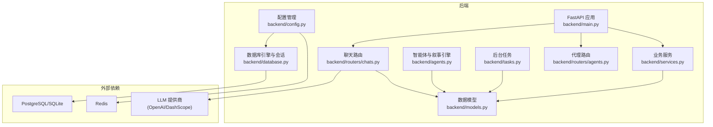
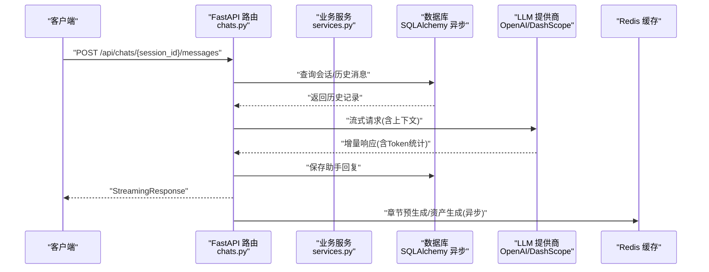
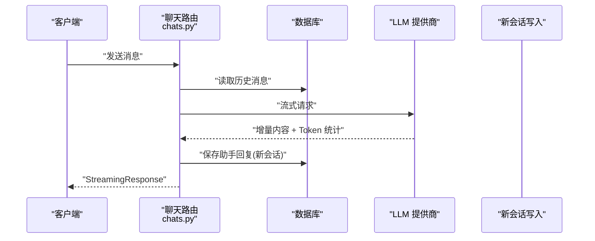
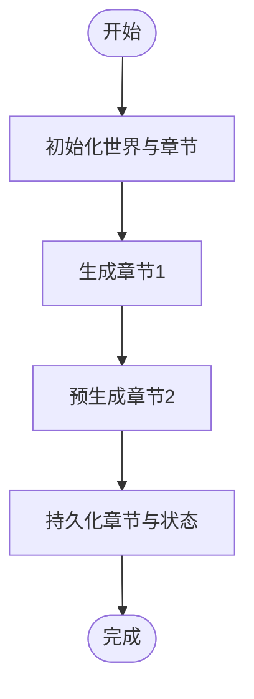
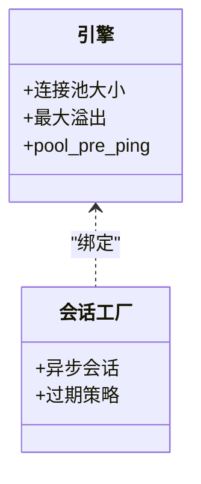
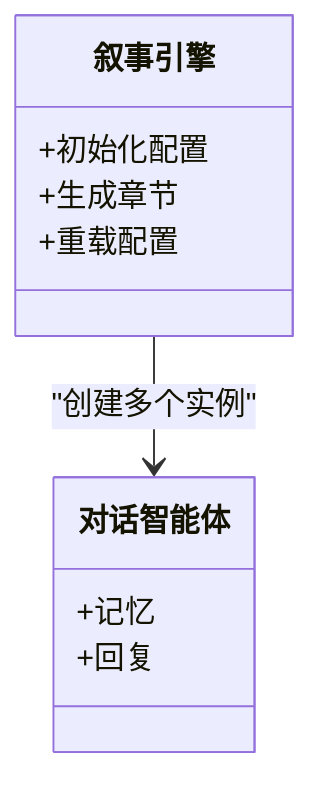
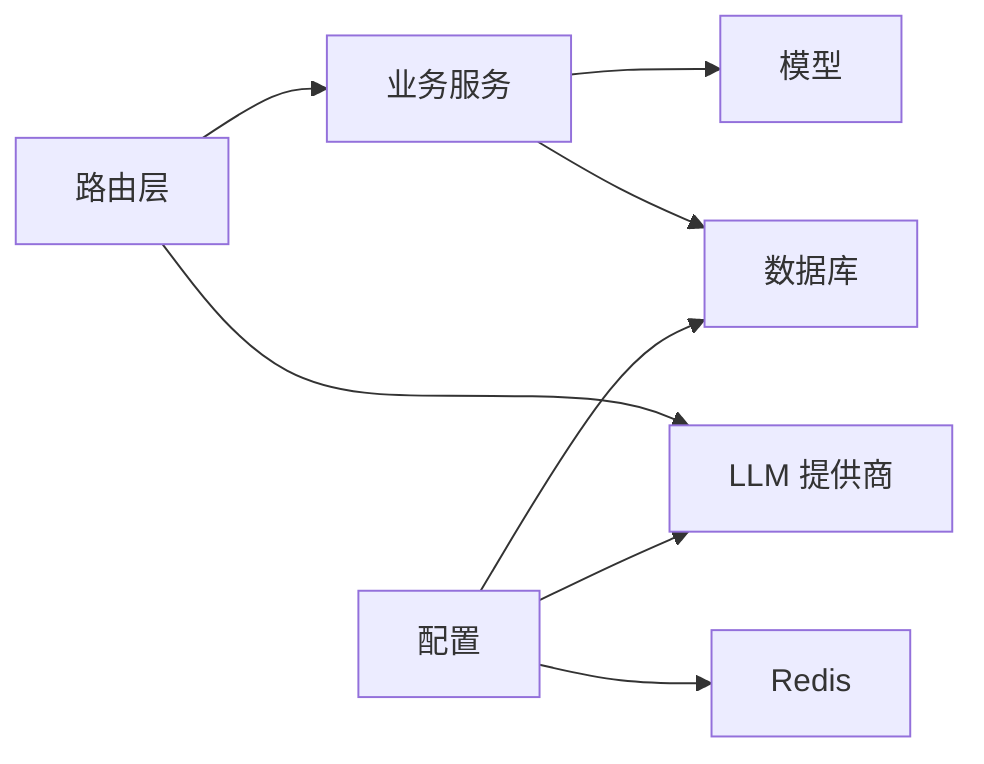

# 性能监控与分析

<cite>
**本文引用的文件**
- [backend/main.py](file://backend/main.py)
- [backend/config.py](file://backend/config.py)
- [backend/database.py](file://backend/database.py)
- [backend/models.py](file://backend/models.py)
- [backend/services.py](file://backend/services.py)
- [backend/tasks.py](file://backend/tasks.py)
- [backend/agents.py](file://backend/agents.py)
- [backend/routers/chats.py](file://backend/routers/chats.py)
- [backend/routers/agents.py](file://backend/routers/agents.py)
- [backend/requirements.txt](file://backend/requirements.txt)
- [docs/wiki/Deployment.md](file://docs/wiki/Deployment.md)
- [docs/wiki/Backend-Guide.md](file://docs/wiki/Backend-Guide.md)
- [dev.py](file://dev.py)
</cite>

## 目录
1. [简介](#简介)
2. [项目结构](#项目结构)
3. [核心组件](#核心组件)
4. [架构总览](#架构总览)
5. [详细组件分析](#详细组件分析)
6. [依赖分析](#依赖分析)
7. [性能考虑](#性能考虑)
8. [故障排查指南](#故障排查指南)
9. [结论](#结论)
10. [附录](#附录)

## 简介
本指南围绕“无限叙事游戏”后端系统，构建一套完整的性能监控与分析方案。内容覆盖指标采集、日志分析、告警配置、性能基准与压力测试、内存与CPU监控、数据库性能追踪、用户行为分析、实时性能监控与异常检测、性能数据分析与瓶颈识别、优化效果评估，以及监控仪表板与自动化运维最佳实践。文档以现有代码为依据，结合部署与开发指南，给出可落地的实施建议。

## 项目结构
后端基于 FastAPI + 异步 SQLAlchemy + AgentScope + LLM 提供商集成，具备聊天流式响应、章节生成与预生成、玩家与剧情数据模型等能力。开发与部署脚本支持多组件并行启动与环境准备。

图表来源
- [backend/main.py](file://backend/main.py#L83-L98)
- [backend/config.py](file://backend/config.py#L14-L19)
- [backend/database.py](file://backend/database.py#L8-L23)
- [backend/models.py](file://backend/models.py#L9-L122)
- [backend/services.py](file://backend/services.py#L8-L66)
- [backend/tasks.py](file://backend/tasks.py#L7-L62)
- [backend/agents.py](file://backend/agents.py#L43-L196)
- [backend/routers/chats.py](file://backend/routers/chats.py#L16-L275)
- [backend/routers/agents.py](file://backend/routers/agents.py#L9-L141)

章节来源
- [docs/wiki/Backend-Guide.md](file://docs/wiki/Backend-Guide.md#L3-L21)
- [docs/wiki/Deployment.md](file://docs/wiki/Deployment.md#L1-L65)

## 核心组件
- 应用入口与生命周期：FastAPI 应用、CORS 中间件、数据库迁移与 LLM 配置加载、根路由、WebSocket。
- 配置中心：统一读取 .env，支持数据库、Redis、LLM 密钥与模型配置。
- 数据库层：异步引擎、连接池、会话工厂；模型定义涵盖玩家、章节、资产、LLM 提供商、聊天会话与消息。
- 业务服务：玩家创建、世界初始化、章节生成与预生成、章节资产生成。
- 智能体与叙事引擎：基于 AgentScope 的多角色智能体编排，动态加载 LLM 提供商配置。
- 路由层：聊天流式响应、会话与消息管理、代理管理与校验。
- 开发与部署：多组件并行启动脚本、环境准备与依赖安装。

章节来源
- [backend/main.py](file://backend/main.py#L45-L82)
- [backend/config.py](file://backend/config.py#L7-L34)
- [backend/database.py](file://backend/database.py#L1-L31)
- [backend/models.py](file://backend/models.py#L1-L122)
- [backend/services.py](file://backend/services.py#L1-L66)
- [backend/tasks.py](file://backend/tasks.py#L1-L62)
- [backend/agents.py](file://backend/agents.py#L1-L196)
- [backend/routers/chats.py](file://backend/routers/chats.py#L1-L275)
- [backend/routers/agents.py](file://backend/routers/agents.py#L1-L141)
- [dev.py](file://dev.py#L91-L150)

## 架构总览
下图展示从客户端到数据库与 LLM 提供商的关键调用链路，以及关键性能关注点（IO、Token 统计、缓存命中、连接池）。

图表来源
- [backend/routers/chats.py](file://backend/routers/chats.py#L72-L258)
- [backend/services.py](file://backend/services.py#L19-L59)
- [backend/database.py](file://backend/database.py#L28-L31)
- [backend/config.py](file://backend/config.py#L18-L29)

## 详细组件分析

### 组件一：聊天流式响应与 Token 统计
- 功能要点
  - 支持 OpenAI/Azure OpenAI 与 DashScope 的流式响应。
  - 记录输入/输出字符数、API 返回的 Token 使用量、上下文窗口占比。
  - 将助手回复写回数据库，并刷新会话更新时间。
- 性能关注
  - 流式传输降低首字延迟，适合长对话。
  - Token 统计可用于成本控制与上下文长度优化。
  - 异常捕获与错误日志便于定位 LLM 调用失败原因。

图表来源
- [backend/routers/chats.py](file://backend/routers/chats.py#L112-L258)

章节来源
- [backend/routers/chats.py](file://backend/routers/chats.py#L72-L258)

### 组件二：世界初始化与章节生成
- 功能要点
  - 通过叙事引擎生成世界观与初始章节。
  - 预生成后续章节，提升用户体验。
- 性能关注
  - LLM 调用成本高，应结合 Token 预估与缓存策略。
  - 预生成采用后台任务，避免阻塞主流程。

图表来源
- [backend/services.py](file://backend/services.py#L19-L59)
- [backend/tasks.py](file://backend/tasks.py#L7-L56)

章节来源
- [backend/services.py](file://backend/services.py#L19-L59)
- [backend/tasks.py](file://backend/tasks.py#L7-L56)

### 组件三：数据库连接与会话管理
- 功能要点
  - 异步引擎、连接池配置、会话工厂。
  - 针对 SQLite 的特殊连接参数。
- 性能关注
  - 连接池大小与溢出限制影响并发吞吐。
  - pool_pre_ping 提升连接稳定性。
  - 事务与会话作用域明确，避免泄漏。

图表来源
- [backend/database.py](file://backend/database.py#L8-L23)

章节来源
- [backend/database.py](file://backend/database.py#L1-L31)

### 组件四：智能体与叙事引擎
- 功能要点
  - 动态加载 LLM 提供商配置，初始化 AgentScope 模型。
  - 多智能体协作：导演、旁白、NPC 管理员。
- 性能关注
  - 配置懒加载，避免冷启动时的无效初始化。
  - 不同提供商的模型选择与基座 URL 影响延迟与稳定性。

图表来源
- [backend/agents.py](file://backend/agents.py#L43-L196)

章节来源
- [backend/agents.py](file://backend/agents.py#L1-L196)

### 组件五：代理与 LLM 提供商管理
- 功能要点
  - 代理创建/更新时校验提供商与模型可用性。
  - 支持多种提供商类型与模型列表。
- 性能关注
  - 提供商与模型的可用性检查可缓存，减少重复查询。
  - 模型列表支持 JSON 或字符串解析，需保证格式一致性。

章节来源
- [backend/routers/agents.py](file://backend/routers/agents.py#L15-L126)
- [backend/models.py](file://backend/models.py#L58-L122)

## 依赖分析
- 外部依赖
  - Web 服务器：Uvicorn
  - ORM：SQLAlchemy 异步
  - LLM SDK：OpenAI、DashScope
  - 缓存：Redis
  - 配置：python-dotenv、pydantic-settings
  - 其他：AgentScope、Alembic、psycopg2、Pillow 等
- 组件耦合
  - 路由层依赖数据库与 LLM 提供商。
  - 业务服务封装数据库操作，降低路由复杂度。
  - 智能体与配置解耦，通过数据库动态注入。

图表来源
- [backend/requirements.txt](file://backend/requirements.txt#L1-L20)
- [backend/config.py](file://backend/config.py#L14-L29)

章节来源
- [backend/requirements.txt](file://backend/requirements.txt#L1-L20)
- [backend/config.py](file://backend/config.py#L1-L34)

## 性能考虑
- 指标采集
  - 请求级：QPS、P95/P99 延迟、错误率、流式首字延迟。
  - 资源级：CPU 使用率、内存占用、连接池利用率、Redis 命中率。
  - LLM 级：平均/峰值 Token 速率、上下文窗口使用率、失败率与重试次数。
- 日志分析
  - 路由层记录输入/输出字符数、Token 统计、异常堆栈。
  - 应用层精细化日志级别，避免 SQLAlchemy/uvicorn 访问日志噪声。
- 告警配置
  - 基于阈值与趋势的多维告警（延迟、错误、Token 成本、连接池耗尽）。
- 基准与压力测试
  - 基准：固定上下文长度与并发下的稳定延迟与吞吐。
  - 压力：逐步增加并发与上下文长度，观察 P99 延迟与错误率拐点。
- 内存与 CPU
  - 异步 I/O 与事件循环策略；Windows 上的事件循环策略适配。
  - 连接池大小与超时设置；避免会话泄漏。
- 数据库性能
  - 连接池参数、索引设计（UUID 主键、JSON 字段）、批量写入。
  - 预生成与异步任务队列，避免主线程阻塞。
- 用户行为分析
  - 基于聊天历史与章节进度的用户偏好建模（可扩展）。
- 实时监控与异常检测
  - 流式响应的异常回退与降级策略。
- 数据分析与瓶颈识别
  - 分布式追踪（如 OpenTelemetry）标注关键 span，定位慢调用。
- 优化效果评估
  - A/B 对比不同模型/提供商、上下文长度、连接池参数。
- 仪表板与自动化
  - Grafana + Prometheus；自动化巡检与扩缩容联动。

章节来源
- [backend/main.py](file://backend/main.py#L13-L28)
- [backend/routers/chats.py](file://backend/routers/chats.py#L133-L234)
- [backend/database.py](file://backend/database.py#L8-L23)
- [dev.py](file://dev.py#L111-L117)

## 故障排查指南
- 启动阶段
  - 数据库连接失败：检查 DATABASE_URL 与数据库服务状态。
  - Alembic 迁移失败：确认迁移脚本与权限，必要时手动执行。
  - LLM 配置加载失败：检查 LLM 提供商是否激活与模型可用。
- 运行阶段
  - 聊天流式响应中断：检查 LLM 提供商密钥、网络与限流。
  - Token 统计缺失：确认提供商 SDK 支持 usage 返回。
  - WebSocket 断开：检查后端日志与端口占用。
- 日志与调试
  - 应用日志级别：INFO，SQLAlchemy/uvicorn 访问日志降级至 WARNING。
  - 异常捕获：路由层统一异常处理与错误日志输出。

章节来源
- [backend/main.py](file://backend/main.py#L45-L82)
- [backend/routers/chats.py](file://backend/routers/chats.py#L211-L216)
- [docs/wiki/Deployment.md](file://docs/wiki/Deployment.md#L60-L65)

## 结论
本指南基于现有代码与部署文档，给出了从指标采集、日志分析到告警与优化的全链路方案。建议优先实现请求级与资源级指标采集、LLM Token 统计与连接池健康监控，并结合压力测试与分布式追踪进行持续优化。通过仪表板与自动化运维，实现性能治理闭环。

## 附录
- 快速对照表
  - 指标采集：请求延迟、QPS、错误率、Token 速率、连接池利用率、Redis 命中率。
  - 日志级别：应用 INFO，SQLAlchemy/uvicorn 访问日志 WARNING。
  - 告警阈值：P99 延迟、错误率、Token 成本、连接池耗尽、LLM 失败率。
  - 基准测试：固定上下文长度与并发，记录延迟与吞吐。
  - 压力测试：逐步提升并发与上下文长度，观察拐点。
  - 优化方向：连接池参数、上下文长度、模型/提供商切换、预生成策略。
  - 仪表板：Grafana + Prometheus；关键面板：延迟分布、错误率、Token 成本、连接池、Redis、LLM 使用率。
  - 自动化：巡检脚本、扩缩容联动、变更回滚。