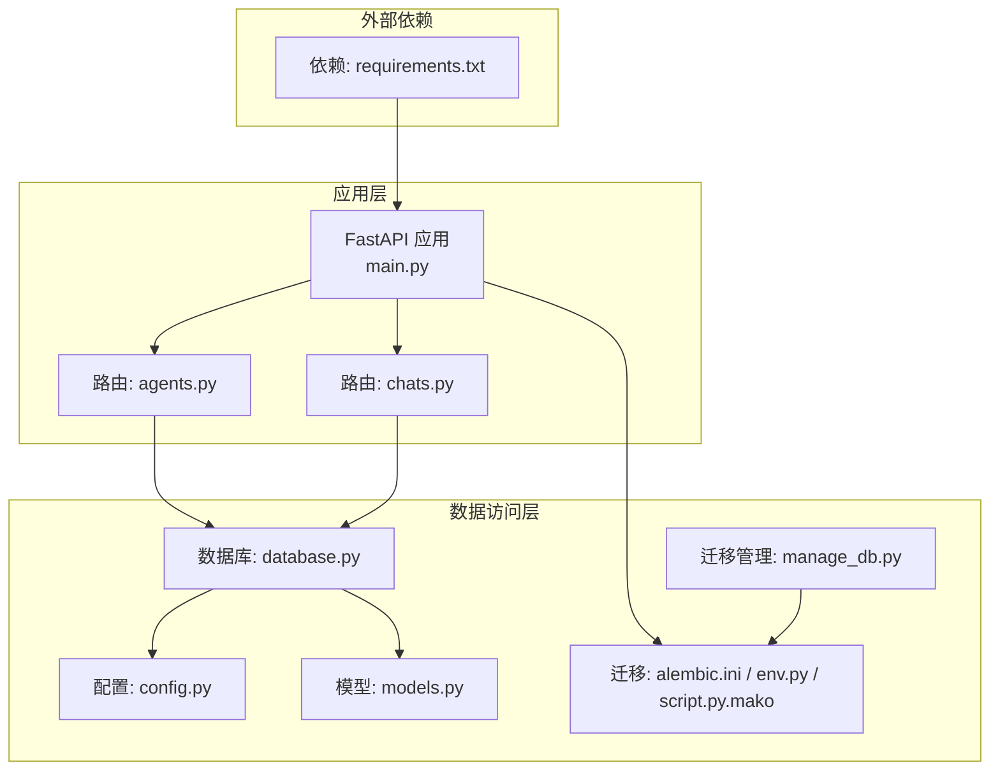
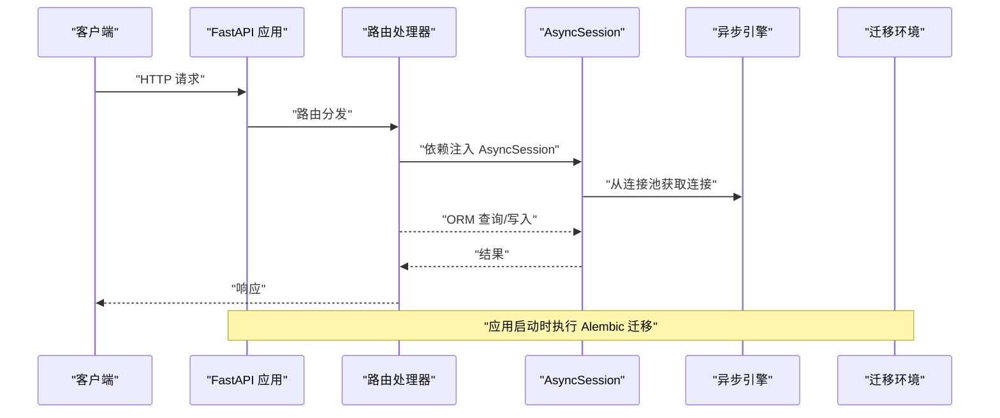
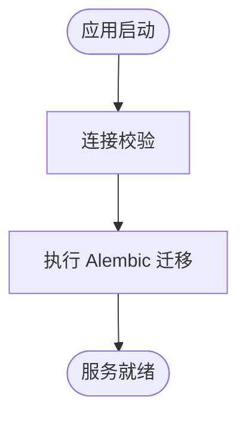
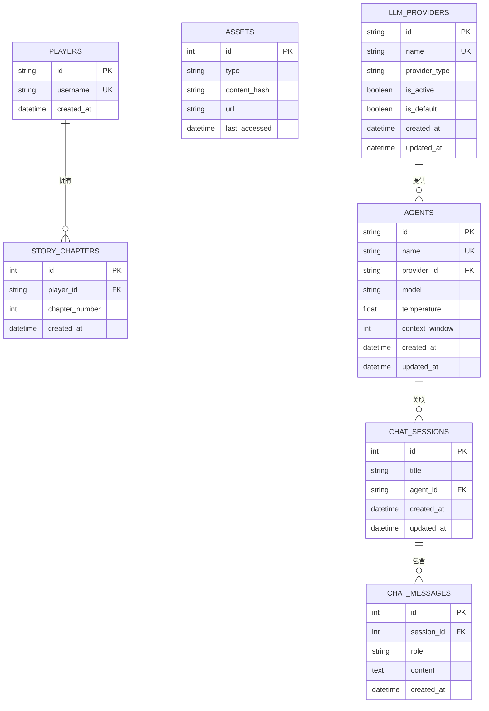
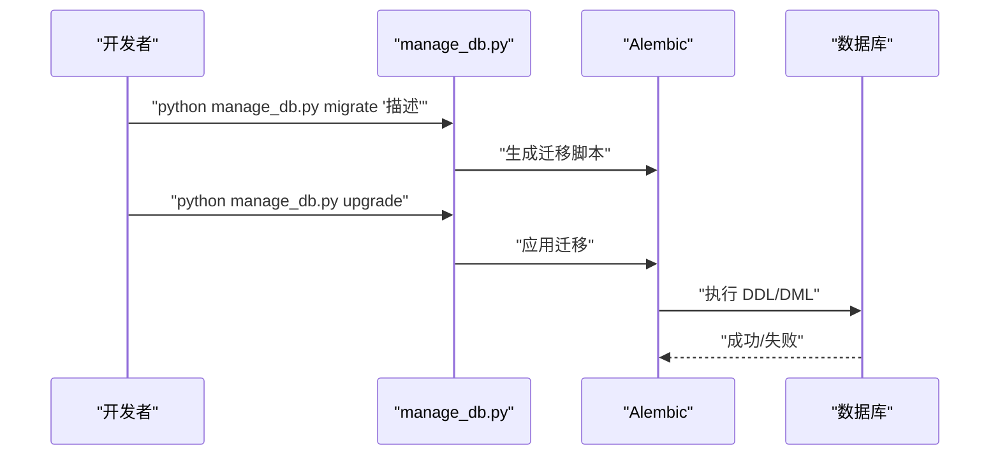
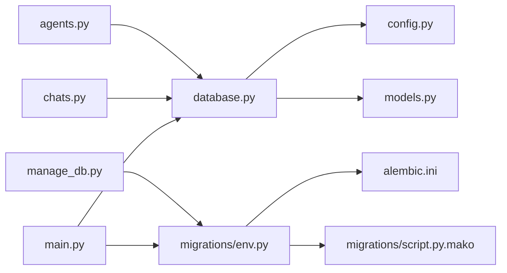

# 数据库性能优化

<cite>
**本文引用的文件**
- [backend/database.py](file://backend/database.py)
- [backend/config.py](file://backend/config.py)
- [backend/models.py](file://backend/models.py)
- [backend/main.py](file://backend/main.py)
- [backend/manage_db.py](file://backend/manage_db.py)
- [backend/migrations/env.py](file://backend/migrations/env.py)
- [backend/migrations/script.py.mako](file://backend/migrations/script.py.mako)
- [backend/alembic.ini](file://backend/alembic.ini)
- [backend/requirements.txt](file://backend/requirements.txt)
- [backend/routers/agents.py](file://backend/routers/agents.py)
- [backend/routers/chats.py](file://backend/routers/chats.py)
- [docs/wiki/Database-Migration.md](file://docs/wiki/Database-Migration.md)
</cite>

## 目录
1. [简介](#简介)
2. [项目结构](#项目结构)
3. [核心组件](#核心组件)
4. [架构总览](#架构总览)
5. [详细组件分析](#详细组件分析)
6. [依赖分析](#依赖分析)
7. [性能考量](#性能考量)
8. [故障排查指南](#故障排查指南)
9. [结论](#结论)
10. [附录](#附录)

## 简介
本指南面向数据库性能优化与运维实践，结合当前代码库现状，系统阐述 PostgreSQL/SQLite 的连接池配置、查询优化与索引设计；覆盖数据库迁移管理、版本控制与性能监控；提供 SQLAlchemy ORM 优化技巧（查询批处理、延迟加载、关系优化）；解释连接池配置、事务管理与锁机制优化；给出数据备份策略、性能分析与瓶颈识别方法，并提供数据库集群与高可用部署思路。

## 项目结构
后端采用 FastAPI + SQLAlchemy Async（异步）+ Alembic 迁移的典型架构。数据库层通过异步引擎与会话工厂提供连接池与生命周期管理；模型定义集中在 models.py；迁移由 Alembic 管理并通过封装脚本统一入口；运行时通过 lifespan 在启动阶段完成迁移与连接校验。

图表来源
- [backend/main.py](file://backend/main.py#L83-L103)
- [backend/database.py](file://backend/database.py#L1-L31)
- [backend/config.py](file://backend/config.py#L1-L34)
- [backend/models.py](file://backend/models.py#L1-L122)
- [backend/migrations/env.py](file://backend/migrations/env.py#L1-L105)
- [backend/alembic.ini](file://backend/alembic.ini#L1-L115)
- [backend/migrations/script.py.mako](file://backend/migrations/script.py.mako#L1-L27)
- [backend/manage_db.py](file://backend/manage_db.py#L1-L67)
- [backend/requirements.txt](file://backend/requirements.txt#L1-L20)

章节来源
- [backend/main.py](file://backend/main.py#L1-L173)
- [backend/database.py](file://backend/database.py#L1-L31)
- [backend/config.py](file://backend/config.py#L1-L34)
- [backend/models.py](file://backend/models.py#L1-L122)
- [backend/migrations/env.py](file://backend/migrations/env.py#L1-L105)
- [backend/alembic.ini](file://backend/alembic.ini#L1-L115)
- [backend/migrations/script.py.mako](file://backend/migrations/script.py.mako#L1-L27)
- [backend/manage_db.py](file://backend/manage_db.py#L1-L67)
- [backend/requirements.txt](file://backend/requirements.txt#L1-L20)

## 核心组件
- 异步数据库引擎与会话工厂：负责连接池参数、预检与生命周期管理。
- 配置中心：集中管理数据库连接串、Redis、AI 密钥等。
- ORM 模型：定义表结构、索引与字段类型，支撑查询与迁移。
- 迁移体系：Alembic + 封装脚本，提供自动化迁移流程。
- 启动生命周期：在应用启动时执行数据库连接校验与迁移。

章节来源
- [backend/database.py](file://backend/database.py#L1-L31)
- [backend/config.py](file://backend/config.py#L1-L34)
- [backend/models.py](file://backend/models.py#L1-L122)
- [backend/migrations/env.py](file://backend/migrations/env.py#L1-L105)
- [backend/alembic.ini](file://backend/alembic.ini#L1-L115)
- [backend/manage_db.py](file://backend/manage_db.py#L1-L67)
- [backend/main.py](file://backend/main.py#L45-L81)

## 架构总览
异步请求经 FastAPI 路由进入业务层，通过依赖注入获取 AsyncSession，执行 ORM 查询与写入；迁移在启动阶段通过 Alembic 完成；配置从 Settings 读取，支持 .env 覆盖。

图表来源
- [backend/main.py](file://backend/main.py#L45-L81)
- [backend/database.py](file://backend/database.py#L28-L31)
- [backend/migrations/env.py](file://backend/migrations/env.py#L95-L104)

## 详细组件分析

### 连接池与会话管理
- 连接池参数
  - 预检与自动重连：启用 pool_pre_ping，降低连接失效导致的异常。
  - 连接池大小与溢出：pool_size 与 max_overflow 控制并发与峰值承载能力。
  - SQLite 特殊参数：根据数据库类型动态设置 connect_args。
- 会话工厂
  - AsyncSessionLocal 绑定 engine，expire_on_commit=False 减少后续查询的刷新成本。
- 生命周期
  - get_db 提供依赖注入，确保每个请求拥有独立会话。
  - 应用启动时进行连接校验与迁移，提升健壮性。

图表来源
- [backend/main.py](file://backend/main.py#L45-L81)
- [backend/database.py](file://backend/database.py#L8-L23)

章节来源
- [backend/database.py](file://backend/database.py#L1-L31)
- [backend/main.py](file://backend/main.py#L45-L81)

### 查询优化与索引设计
- 索引策略
  - 主键与唯一索引：如玩家用户名唯一索引、UUID 主键索引，加速查找与去重。
  - 外键索引：聊天消息按会话 ID 查询频繁，已在模型中建立索引。
  - 内容哈希索引：资产表 content_hash 用于重复内容快速定位。
- 查询模式
  - 路由层使用 select + filter + order_by + offset/limit，具备良好扩展性。
  - 建议在高频过滤字段（如 agent_id、created_at）增加复合索引以进一步优化排序与过滤。
- 批量写入
  - 使用批量插入/更新可显著降低往返次数；当前路由层逐条提交，建议在批量导入场景采用批量接口。

章节来源
- [backend/models.py](file://backend/models.py#L9-L122)
- [backend/routers/agents.py](file://backend/routers/agents.py#L57-L71)
- [backend/routers/chats.py](file://backend/routers/chats.py#L63-L70)

### 索引设计与查询路径

图表来源
- [backend/models.py](file://backend/models.py#L9-L122)

### 迁移管理与版本控制
- 迁移入口
  - manage_db.py 封装 migrate/upgrade/downgrade 子命令，便于团队协作与 CI/CD。
- Alembic 配置
  - script_location、prepend_sys_path、render_as_batch 等配置确保跨平台与复杂变更兼容。
  - 日志级别控制，降低迁移过程噪音。
- 启动集成
  - main.py 在 lifespan 中调用 Alembic 升级，保证数据库结构一致性。

图表来源
- [backend/manage_db.py](file://backend/manage_db.py#L20-L38)
- [backend/migrations/env.py](file://backend/migrations/env.py#L42-L104)
- [backend/alembic.ini](file://backend/alembic.ini#L1-L115)
- [docs/wiki/Database-Migration.md](file://docs/wiki/Database-Migration.md#L1-L85)

章节来源
- [backend/manage_db.py](file://backend/manage_db.py#L1-L67)
- [backend/migrations/env.py](file://backend/migrations/env.py#L1-L105)
- [backend/alembic.ini](file://backend/alembic.ini#L1-L115)
- [docs/wiki/Database-Migration.md](file://docs/wiki/Database-Migration.md#L1-L85)

### 性能监控与日志
- 日志级别
  - main.py 中对 SQLAlchemy 引擎与池的日志进行降噪，避免影响可观测性。
- 建议
  - 结合数据库慢查询日志、连接池指标与应用埋点，形成端到端监控闭环。

章节来源
- [backend/main.py](file://backend/main.py#L14-L28)

### 锁机制与事务管理
- 事务边界
  - 路由层与服务层明确事务边界，先写后读，必要时拆分为多个短事务。
- 锁与并发
  - 唯一约束冲突（如创建同名代理）通过数据库约束保护，避免竞态。
  - 高并发写入建议引入幂等设计与重试策略。

章节来源
- [backend/routers/agents.py](file://backend/routers/agents.py#L15-L55)
- [backend/routers/chats.py](file://backend/routers/chats.py#L236-L257)

### 备份策略
- SQLite
  - 采用文件级备份（复制 .db 文件），适合开发/小规模场景。
- PostgreSQL
  - 使用逻辑备份（如 pg_dump）与物理备份（如基础备份+WAL 归档）相结合。
- 建议
  - 定期全备+增量备份，结合恢复演练验证备份有效性。

（本节为通用实践说明，无需特定文件引用）

### 集群与高可用
- PostgreSQL
  - 主从复制、流复制与仲裁节点；结合负载均衡与健康检查。
- 连接池与故障转移
  - 在应用侧配置连接池超时与重试；在数据库侧配置主从切换与自动故障转移。
- 建议
  - 生产环境采用只读副本分流查询，缩短主库压力。

（本节为通用实践说明，无需特定文件引用）

## 依赖分析
- 组件耦合
  - 路由依赖 database.get_db 提供的 AsyncSession，保持良好的关注点分离。
  - Alembic 通过 env.py 注册模型元数据，确保迁移与模型同步。
- 外部依赖
  - SQLAlchemy 2.x、asyncpg/aiosqlite、alembic、psycopg2-binary 等，满足异步与迁移需求。

图表来源
- [backend/routers/agents.py](file://backend/routers/agents.py#L1-L141)
- [backend/routers/chats.py](file://backend/routers/chats.py#L1-L275)
- [backend/database.py](file://backend/database.py#L1-L31)
- [backend/config.py](file://backend/config.py#L1-L34)
- [backend/models.py](file://backend/models.py#L1-L122)
- [backend/manage_db.py](file://backend/manage_db.py#L1-L67)
- [backend/migrations/env.py](file://backend/migrations/env.py#L1-L105)
- [backend/alembic.ini](file://backend/alembic.ini#L1-L115)
- [backend/migrations/script.py.mako](file://backend/migrations/script.py.mako#L1-L27)
- [backend/main.py](file://backend/main.py#L1-L173)

章节来源
- [backend/requirements.txt](file://backend/requirements.txt#L1-L20)
- [backend/routers/agents.py](file://backend/routers/agents.py#L1-L141)
- [backend/routers/chats.py](file://backend/routers/chats.py#L1-L275)
- [backend/database.py](file://backend/database.py#L1-L31)
- [backend/migrations/env.py](file://backend/migrations/env.py#L1-L105)

## 性能考量
- 连接池参数调优
  - 根据 QPS 与并发度调整 pool_size 与 max_overflow；结合数据库最大连接数上限。
  - 合理设置 pool_recycle 与 pool_pre_ping，避免连接老化与长事务占用。
- 查询优化
  - 使用 EXPLAIN/EXPLAIN ANALYZE 分析慢查询；为高频过滤与排序字段建立合适索引。
  - 避免 N+1 查询，优先使用 join 或批量加载。
- ORM 优化
  - 批量插入/更新；延迟加载与选择性加载；合理使用 select_related/joinedload。
- 缓存与降载
  - 对热点读取结果引入缓存层（如 Redis），减少数据库压力。
- 监控与告警
  - 数据库慢查询日志、连接池使用率、事务等待时间、锁等待与死锁事件。

（本节为通用实践说明，无需特定文件引用）

## 故障排查指南
- 迁移相关
  - “目标数据库未更新”：执行 upgrade；若存在多头，按文档指引合并迁移。
  - SQLite 限制：复杂 ALTER 变更需谨慎，必要时手动修正迁移脚本。
- 连接与会话
  - 连接池耗尽：检查 pool_size 与 max_overflow，确认是否存在长时间事务。
  - 连接失效：启用 pool_pre_ping 并缩短事务生命周期。
- 查询与锁
  - 死锁/锁等待：减少事务范围，避免跨表长事务；对并发写入加幂等与重试。
- 日志与诊断
  - 降低 SQLAlchemy 引擎日志级别，聚焦业务日志；结合数据库慢查询日志定位瓶颈。

章节来源
- [docs/wiki/Database-Migration.md](file://docs/wiki/Database-Migration.md#L71-L85)
- [backend/main.py](file://backend/main.py#L14-L28)

## 结论
本项目已具备完善的异步数据库访问与迁移体系。建议在现有基础上完善连接池参数、查询与索引优化、缓存与监控，并在生产环境引入集群与高可用方案，持续迭代以满足更高性能与可靠性要求。

## 附录
- 快速命令参考
  - 生成迁移：在 backend 目录执行封装脚本的 migrate 子命令。
  - 应用迁移：执行 upgrade；或重启应用让启动阶段自动执行。
  - 回滚迁移：执行 downgrade。
- 配置要点
  - DATABASE_URL 支持 SQLite 与 PostgreSQL；生产环境建议使用 PostgreSQL 并配置连接池参数。
  - .env 文件用于覆盖默认配置，确保密钥与连接串安全。

章节来源
- [docs/wiki/Database-Migration.md](file://docs/wiki/Database-Migration.md#L63-L70)
- [backend/config.py](file://backend/config.py#L15-L16)
- [backend/requirements.txt](file://backend/requirements.txt#L1-L20)