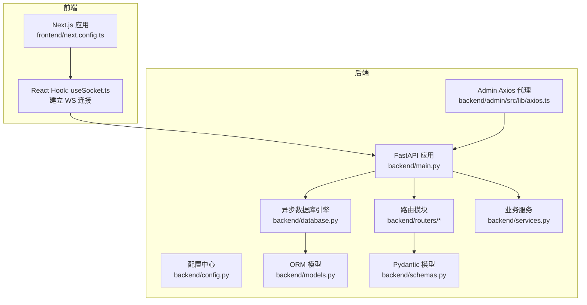
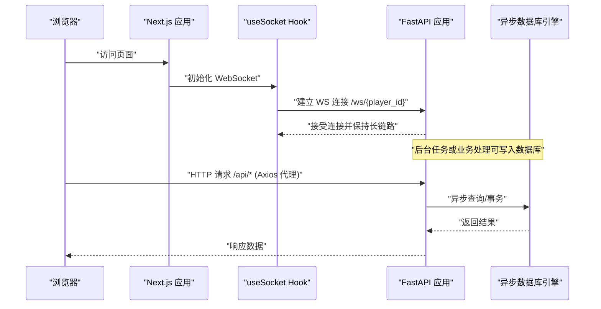
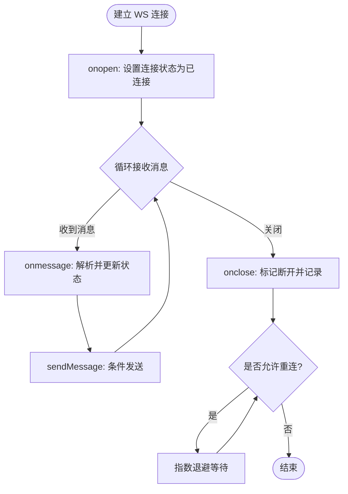
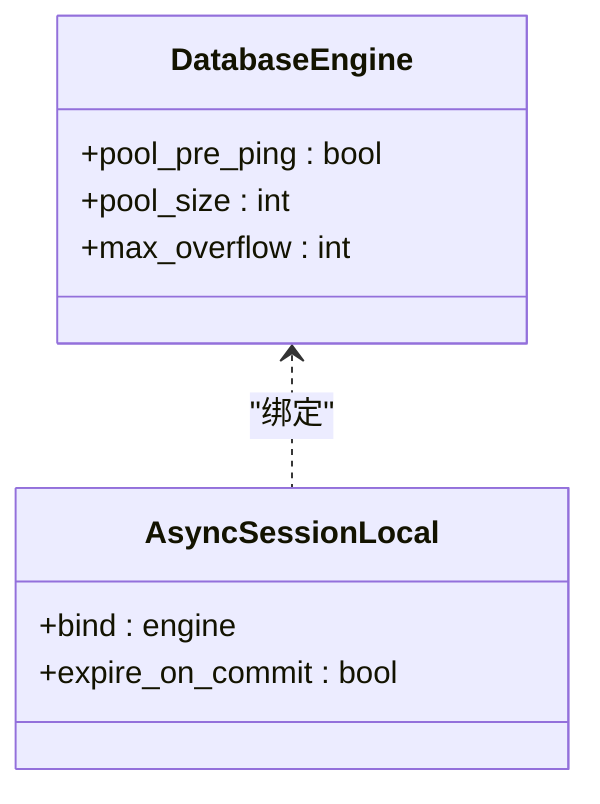
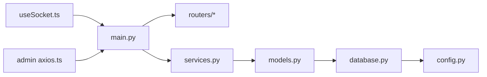

# 网络性能优化

<cite>
**本文引用的文件**
- [backend/main.py](file://backend/main.py)
- [frontend/src/hooks/useSocket.ts](file://frontend/src/hooks/useSocket.ts)
- [backend/database.py](file://backend/database.py)
- [backend/config.py](file://backend/config.py)
- [backend/routers/agents.py](file://backend/routers/agents.py)
- [backend/services.py](file://backend/services.py)
- [backend/models.py](file://backend/models.py)
- [backend/schemas.py](file://backend/schemas.py)
- [backend/admin/src/lib/axios.ts](file://backend/admin/src/lib/axios.ts)
- [frontend/next.config.ts](file://frontend/next.config.ts)
- [docs/wiki/Backend-Guide.md](file://docs/wiki/Backend-Guide.md)
</cite>

## 目录
1. [简介](#简介)
2. [项目结构](#项目结构)
3. [核心组件](#核心组件)
4. [架构总览](#架构总览)
5. [详细组件分析](#详细组件分析)
6. [依赖关系分析](#依赖关系分析)
7. [性能考量](#性能考量)
8. [故障排查指南](#故障排查指南)
9. [结论](#结论)
10. [附录](#附录)

## 简介
本指南围绕网络性能优化展开，结合当前代码库中已实现的 WebSocket、CORS、数据库连接池、静态资源与代理等能力，给出可落地的优化策略与最佳实践。重点覆盖：
- WebSocket 连接优化：连接池管理、消息压缩与心跳机制
- CORS 配置与跨域优化、安全策略
- HTTP 请求优化、缓存策略与负载均衡配置
- CDN 使用、静态资源优化与带宽管理
- 网络监控、延迟分析与连接质量检测
- 网络故障排查、性能测试与容量规划方法

## 项目结构
后端基于 FastAPI，提供 REST API 与 WebSocket；前端基于 Next.js，通过 React Hooks 管理 WebSocket 连接；数据库采用 SQLAlchemy 异步引擎并配置连接池；管理员前端通过 Axios 访问后端 API。

图表来源
- [backend/main.py](file://backend/main.py#L83-L173)
- [frontend/src/hooks/useSocket.ts](file://frontend/src/hooks/useSocket.ts#L1-L43)
- [backend/database.py](file://backend/database.py#L1-L31)
- [backend/config.py](file://backend/config.py#L1-L34)
- [backend/routers/agents.py](file://backend/routers/agents.py#L1-L141)
- [backend/services.py](file://backend/services.py#L1-L66)
- [backend/models.py](file://backend/models.py#L1-L122)
- [backend/schemas.py](file://backend/schemas.py#L1-L102)
- [backend/admin/src/lib/axios.ts](file://backend/admin/src/lib/axios.ts#L1-L20)
- [frontend/next.config.ts](file://frontend/next.config.ts#L1-L8)

章节来源
- [docs/wiki/Backend-Guide.md](file://docs/wiki/Backend-Guide.md#L1-L108)

## 核心组件
- WebSocket 终端：提供实时通信，用于向客户端推送剧情更新与接收玩家输入
- CORS 中间件：允许指定来源访问后端 API
- 异步数据库连接池：提升并发与稳定性
- 管理员前端 Axios 代理：统一后端 API 前缀，便于后续扩展中间件与拦截器
- Next.js 配置：为静态资源与构建优化预留空间

章节来源
- [backend/main.py](file://backend/main.py#L83-L173)
- [frontend/src/hooks/useSocket.ts](file://frontend/src/hooks/useSocket.ts#L1-L43)
- [backend/database.py](file://backend/database.py#L1-L31)
- [backend/admin/src/lib/axios.ts](file://backend/admin/src/lib/axios.ts#L1-L20)
- [frontend/next.config.ts](file://frontend/next.config.ts#L1-L8)

## 架构总览
下图展示从浏览器到后端的典型网络路径，以及关键优化点的落位。

图表来源
- [frontend/src/hooks/useSocket.ts](file://frontend/src/hooks/useSocket.ts#L8-L33)
- [backend/main.py](file://backend/main.py#L157-L170)
- [backend/admin/src/lib/axios.ts](file://backend/admin/src/lib/axios.ts#L3-L8)

## 详细组件分析

### WebSocket 连接优化
- 连接生命周期管理
  - 建立连接：在 Hook 中根据 playerId 动态构造 WS URL 并监听 open/message/close 事件
  - 发送消息：仅在 readyState 为 OPEN 时发送
  - 清理资源：组件卸载时主动关闭连接
- 连接池与并发
  - 当前实现为每个客户端单连接；若需要高并发场景，可在后端维护连接池（例如基于会话 ID 的分片与复用），并在前端进行重连与退避策略
- 心跳机制
  - 建议在客户端与服务端分别实现 ping/pong 心跳，超时自动重连
- 消息压缩
  - 对大文本或二进制消息启用压缩传输（如 gzip/snappy），降低带宽占用
- 错误处理
  - 记录异常并上报，区分网络错误与业务错误，避免无界重试

图表来源
- [frontend/src/hooks/useSocket.ts](file://frontend/src/hooks/useSocket.ts#L8-L33)
- [backend/main.py](file://backend/main.py#L157-L170)

章节来源
- [frontend/src/hooks/useSocket.ts](file://frontend/src/hooks/useSocket.ts#L1-L43)
- [backend/main.py](file://backend/main.py#L157-L170)

### CORS 配置与跨域优化
- 当前配置允许本地开发来源，并开放所有方法与头
- 生产建议
  - 明确 allow_origins 列表，避免通配符
  - 限制 allow_methods 与 allow_headers，最小化暴露面
  - 合理设置 credentials 与 max_age
  - 结合安全策略（如 HSTS、CSP）与 HTTPS 强制

章节来源
- [backend/main.py](file://backend/main.py#L85-L91)

### HTTP 请求优化与缓存策略
- Axios 代理
  - 使用 baseURL 统一前缀，便于后续接入鉴权、限流与可观测性中间件
  - 可在拦截器中加入重试、幂等与缓存控制
- 缓存策略
  - 针对只读数据（如 LLM 供应商列表）采用强缓存或协商缓存
  - 对于实时数据（如玩家进度）避免缓存或使用短 TTL
- 负载均衡
  - 前端通过域名或反向代理接入多实例后端，实现水平扩展
  - 后端可利用连接池与异步 I/O 提升吞吐

章节来源
- [backend/admin/src/lib/axios.ts](file://backend/admin/src/lib/axios.ts#L1-L20)
- [backend/main.py](file://backend/main.py#L85-L91)

### 数据库连接池与后台任务
- 连接池参数
  - pool_pre_ping：自动重连
  - pool_size 与 max_overflow：控制并发与溢出连接
- 后台任务
  - 使用 BackgroundTasks 或队列异步生成内容，避免阻塞主请求线程
  - 与 WebSocket 结合，将生成进度推送给客户端

图表来源
- [backend/database.py](file://backend/database.py#L8-L23)

章节来源
- [backend/database.py](file://backend/database.py#L1-L31)
- [backend/main.py](file://backend/main.py#L147-L156)

### 静态资源优化与 CDN
- Next.js 默认静态资源托管与构建优化
- 建议
  - 将图片、字体等静态资源交由 CDN 加速
  - 启用压缩与缓存头，合理设置 ETag/Last-Modified
  - 对多语言与多区域部署，使用就近节点与边缘缓存

章节来源
- [frontend/next.config.ts](file://frontend/next.config.ts#L1-L8)

### 安全策略
- CORS 与 HTTPS
  - 仅在受信来源间放行，强制 HTTPS
- API 限流与鉴权
  - 在网关或中间件层实施速率限制与身份认证
- 输入校验与输出净化
  - 使用 Pydantic 模型进行输入校验，避免注入与过大数据包

章节来源
- [backend/main.py](file://backend/main.py#L85-L91)
- [backend/schemas.py](file://backend/schemas.py#L1-L102)

## 依赖关系分析
- 组件耦合
  - WebSocket 与业务服务解耦，通过后台任务与数据库交互
  - 管理员前端通过 Axios 代理访问后端 API，便于集中治理
- 外部依赖
  - FastAPI、SQLAlchemy Async、Redis（配置项）、AgentScope（叙事引擎）

图表来源
- [frontend/src/hooks/useSocket.ts](file://frontend/src/hooks/useSocket.ts#L1-L43)
- [backend/main.py](file://backend/main.py#L30-L42)
- [backend/routers/agents.py](file://backend/routers/agents.py#L1-L141)
- [backend/services.py](file://backend/services.py#L1-L66)
- [backend/models.py](file://backend/models.py#L1-L122)
- [backend/database.py](file://backend/database.py#L1-L31)
- [backend/config.py](file://backend/config.py#L1-L34)
- [backend/admin/src/lib/axios.ts](file://backend/admin/src/lib/axios.ts#L1-L20)

章节来源
- [docs/wiki/Backend-Guide.md](file://docs/wiki/Backend-Guide.md#L1-L108)

## 性能考量
- WebSocket
  - 控制消息粒度与频率，合并小消息；启用压缩；实现心跳保活
- HTTP
  - 合理缓存、开启 Gzip/Brotli；分页与懒加载；并发请求合并
- 数据库
  - 连接池参数与查询优化；索引设计；读写分离与只读副本
- 静态资源
  - CDN 分发、资源压缩、按需加载、骨架屏与占位符
- 监控与告警
  - 延迟分布、错误率、连接数、吞吐量、带宽使用率

## 故障排查指南
- WebSocket 无法连接
  - 检查 CORS 配置与反向代理设置
  - 查看浏览器网络面板与后端日志
- 连接频繁断开
  - 核查心跳间隔与超时阈值；确认客户端退避策略
- HTTP 请求失败
  - 检查 Axios 拦截器与后端路由映射；查看 4xx/5xx 错误码
- 数据库连接耗尽
  - 调整 pool_size 与 max_overflow；检查慢查询与锁竞争
- 缓存命中率低
  - 评估缓存键设计与失效策略；区分只读与实时数据

章节来源
- [backend/main.py](file://backend/main.py#L157-L170)
- [frontend/src/hooks/useSocket.ts](file://frontend/src/hooks/useSocket.ts#L1-L43)
- [backend/admin/src/lib/axios.ts](file://backend/admin/src/lib/axios.ts#L1-L20)
- [backend/database.py](file://backend/database.py#L8-L23)

## 结论
本项目已具备 WebSocket、CORS、异步数据库与管理员前端代理的基础能力。建议在此基础上完善连接池与心跳、启用消息压缩、细化 CORS 与安全策略、引入缓存与 CDN、加强监控与告警，并通过性能测试与容量规划持续迭代，以获得稳定、低延迟、高可用的网络体验。

## 附录
- 相关文档与指南
  - 后端开发指南与 API 概览

章节来源
- [docs/wiki/Backend-Guide.md](file://docs/wiki/Backend-Guide.md#L83-L108)