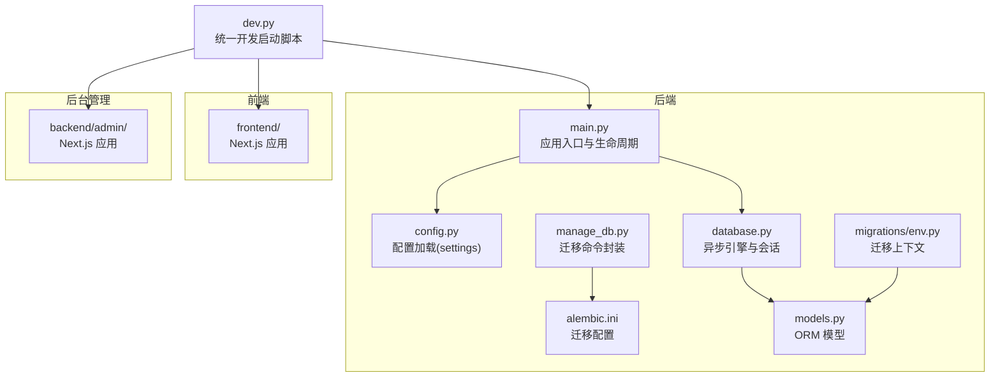
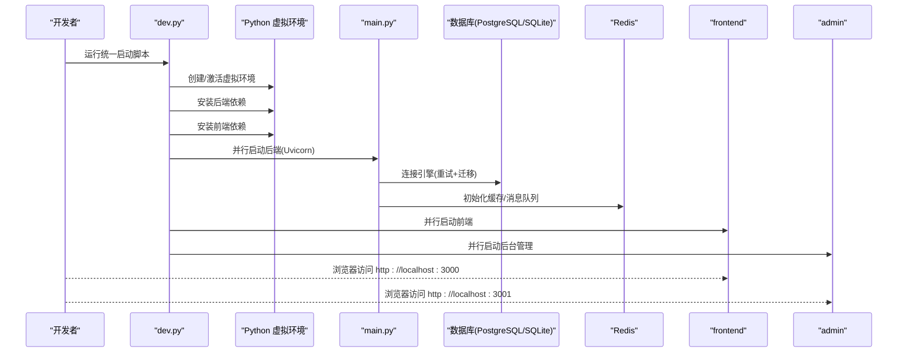
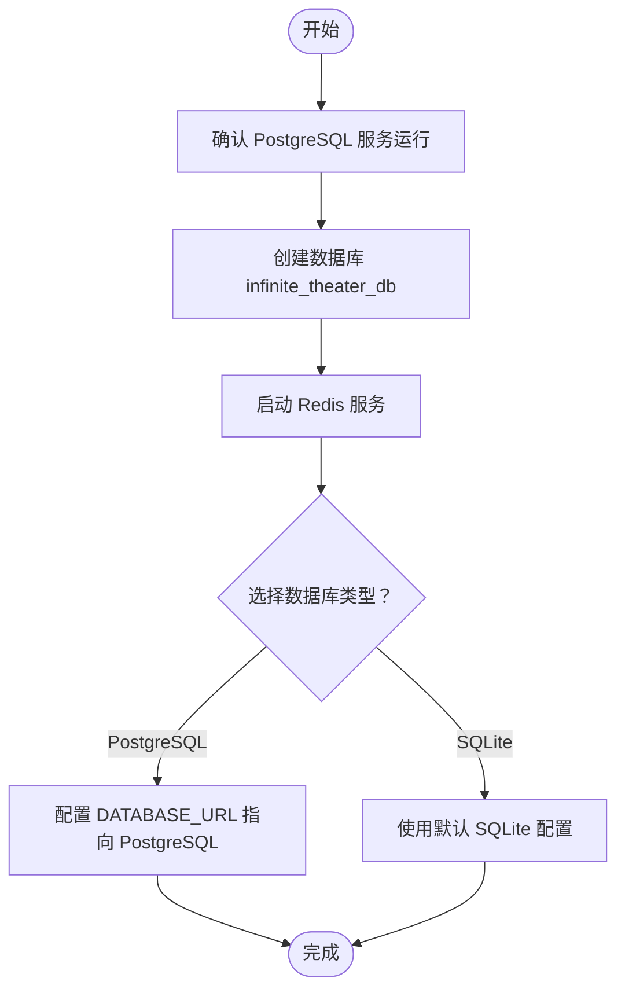
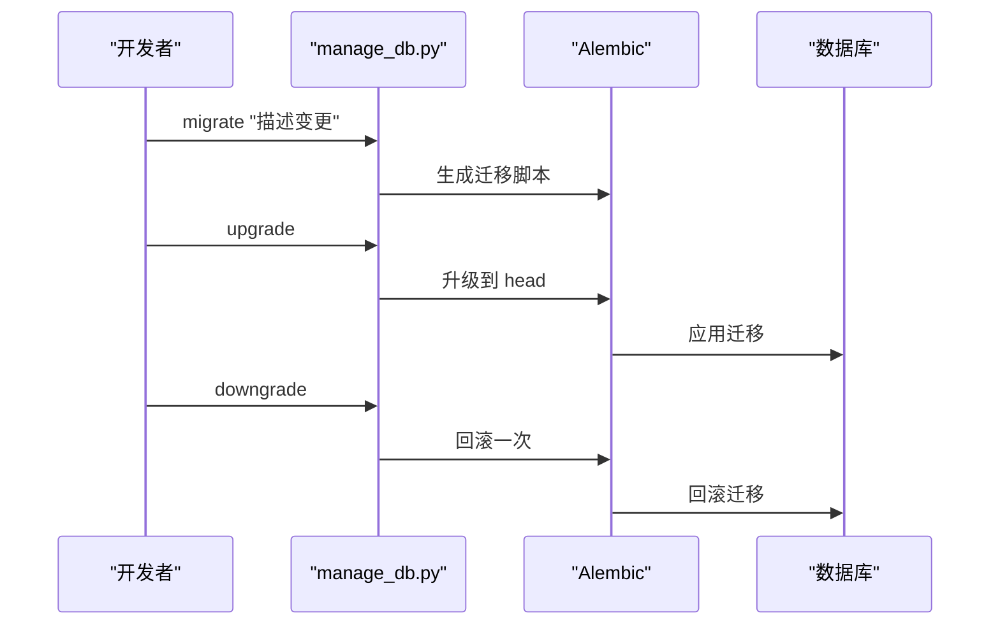
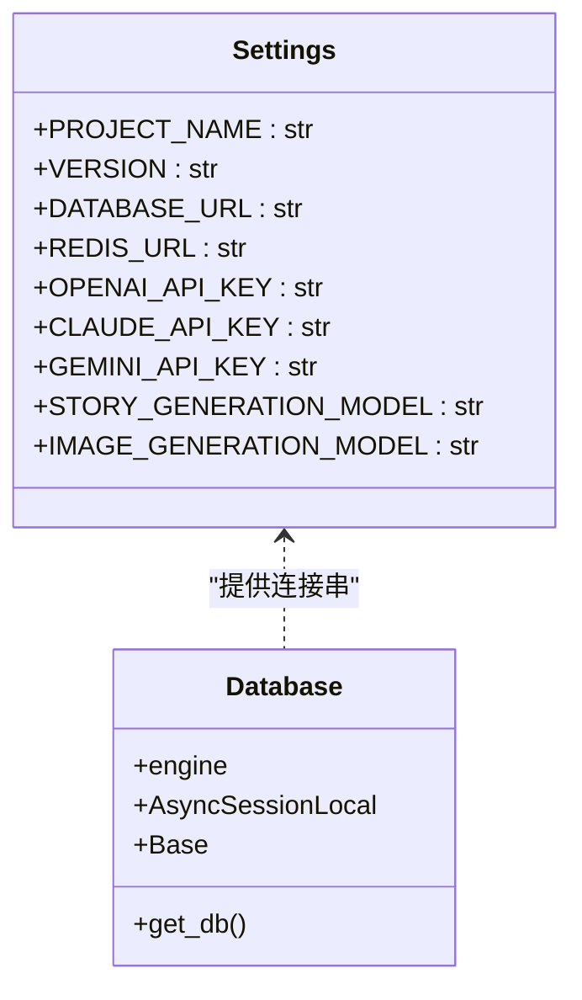
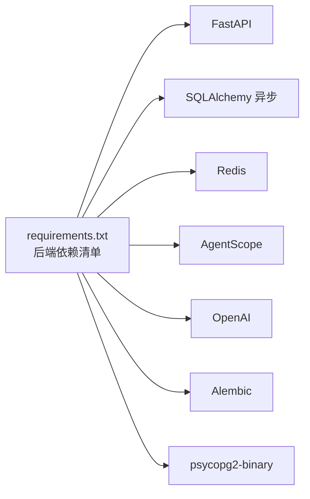

# 环境配置

<cite>
**本文引用的文件**
- [README.md](file://README.md)
- [.env.example](file://backend/.env.example)
- [requirements.txt](file://backend/requirements.txt)
- [Deployment.md](file://docs/wiki/Deployment.md)
- [main.py](file://backend/main.py)
- [config.py](file://backend/config.py)
- [database.py](file://backend/database.py)
- [manage_db.py](file://backend/manage_db.py)
- [alembic.ini](file://backend/alembic.ini)
- [env.py](file://backend/migrations/env.py)
- [14746eaf1c81_initial.py](file://backend/migrations/versions/14746eaf1c81_initial.py)
- [models.py](file://backend/models.py)
- [dev.py](file://dev.py)
</cite>

## 目录
1. [简介](#简介)
2. [项目结构](#项目结构)
3. [核心组件](#核心组件)
4. [架构总览](#架构总览)
5. [详细组件分析](#详细组件分析)
6. [依赖关系分析](#依赖关系分析)
7. [性能考虑](#性能考虑)
8. [故障排查指南](#故障排查指南)
9. [结论](#结论)
10. [附录](#附录)

## 简介
本指南面向开发与生产环境，提供从零到一的环境准备、数据库初始化、环境变量配置、Windows 特殊注意事项与 WSL 推荐实践，以及环境验证与常见错误排查方法。目标是帮助你在本地或服务器上快速、稳定地搭建无限剧情剧场系统的后端服务。

## 项目结构
后端采用 Python + FastAPI + PostgreSQL/SQLite + Redis 架构；数据库版本管理使用 Alembic；前端与后台管理分别独立运行。整体目录要点如下：
- 后端：FastAPI 应用入口、数据库配置与模型、迁移脚本与 Alembic 配置
- 前端与后台管理：Next.js 应用，分别在各自目录下开发与运行
- 开发辅助：统一启动脚本 dev.py，负责虚拟环境、依赖安装与并行启动

图表来源
- [main.py](file://backend/main.py#L1-L173)
- [config.py](file://backend/config.py#L1-L34)
- [database.py](file://backend/database.py#L1-L31)
- [alembic.ini](file://backend/alembic.ini#L1-L115)
- [env.py](file://backend/migrations/env.py#L1-L105)
- [models.py](file://backend/models.py#L1-L122)
- [manage_db.py](file://backend/manage_db.py#L1-L67)
- [dev.py](file://dev.py#L1-L150)

章节来源
- [README.md](file://README.md#L34-L51)
- [dev.py](file://dev.py#L1-L150)

## 核心组件
- 应用入口与生命周期：负责启动时数据库连接重试、自动执行 Alembic 升级、CORS 配置与路由注册，并在 Windows 上设置事件循环策略与 UTF-8 输出修复。
- 配置系统：通过 pydantic-settings 从 .env 加载环境变量，支持 SQLite 与 PostgreSQL 切换，默认使用 SQLite 以简化本地开发。
- 数据库层：异步 SQLAlchemy 引擎，连接池配置，SQLite 与 PostgreSQL 的差异化参数。
- 迁移系统：Alembic 离线/在线迁移，通过 env.py 注入 settings.DATABASE_URL，确保迁移与实际配置一致。
- 统一开发脚本：自动创建/激活虚拟环境、安装依赖、并行启动后端、前端与后台管理。

章节来源
- [main.py](file://backend/main.py#L45-L82)
- [config.py](file://backend/config.py#L7-L33)
- [database.py](file://backend/database.py#L8-L23)
- [env.py](file://backend/migrations/env.py#L39-L41)
- [dev.py](file://dev.py#L25-L106)

## 架构总览
下图展示开发环境启动流程与关键组件交互：

图表来源
- [dev.py](file://dev.py#L91-L147)
- [main.py](file://backend/main.py#L171-L173)
- [config.py](file://backend/config.py#L14-L16)
- [database.py](file://backend/database.py#L8-L17)

## 详细组件分析

### 前置条件与安装
- Python 3.10+：用于后端开发与运行
- Node.js 18+：用于前端与后台管理开发
- PostgreSQL：生产与测试推荐；本地开发可回退至 SQLite
- Redis：缓存与消息队列
- Git：版本控制与仓库克隆

章节来源
- [README.md](file://README.md#L55-L60)
- [Deployment.md](file://docs/wiki/Deployment.md#L5-L12)
- [requirements.txt](file://backend/requirements.txt#L1-L20)

### 数据库初始化流程
- 启动 PostgreSQL 服务
- 创建数据库：名称为 infinite_theater_db
- 如需使用 SQLite（本地开发），配置 DATABASE_URL 指向 SQLite 文件路径
- 启动 Redis 服务（默认端口 6379）

图表来源
- [Deployment.md](file://docs/wiki/Deployment.md#L14-L22)
- [config.py](file://backend/config.py#L14-L16)
- [database.py](file://backend/database.py#L8-L17)

章节来源
- [Deployment.md](file://docs/wiki/Deployment.md#L14-L22)
- [config.py](file://backend/config.py#L14-L16)

### 环境变量配置
关键变量与用途：
- OPENAI_API_KEY：用于 OpenAI 相关能力（可在后台动态配置）
- DATABASE_URL：数据库连接串（默认指向 SQLite；生产建议 PostgreSQL）
- REDIS_URL：Redis 连接串（默认本地 6379/0）

章节来源
- [.env.example](file://backend/.env.example#L1-L4)
- [config.py](file://backend/config.py#L11-L24)

### 数据库迁移与版本管理
- 迁移生成：基于模型变更自动生成迁移脚本
- 应用迁移：升级到最新版本
- 回滚迁移：逐次回退

图表来源
- [manage_db.py](file://backend/manage_db.py#L20-L38)
- [env.py](file://backend/migrations/env.py#L39-L41)
- [alembic.ini](file://backend/alembic.ini#L61-L61)

章节来源
- [README.md](file://README.md#L86-L101)
- [manage_db.py](file://backend/manage_db.py#L1-L67)
- [env.py](file://backend/migrations/env.py#L39-L41)
- [alembic.ini](file://backend/alembic.ini#L61-L61)

### 配置加载与数据库引擎
- 配置来源：.env 文件，通过 pydantic-settings 加载
- 数据库引擎：根据 DATABASE_URL 类型选择 SQLite 或 PostgreSQL 参数
- 连接池：预连接与溢出配置，SQLite 特定参数

图表来源
- [config.py](file://backend/config.py#L7-L33)
- [database.py](file://backend/database.py#L1-L31)

章节来源
- [config.py](file://backend/config.py#L7-L33)
- [database.py](file://backend/database.py#L8-L23)

### Windows 环境特殊注意事项与 WSL 建议
- Windows 事件循环策略：在 Windows 上设置事件循环策略以兼容 asyncpg
- UTF-8 输出修复：对 stdout/stderr 进行 UTF-8 编码包装
- 建议使用 WSL：在 WSL 中运行 PostgreSQL 与 Redis，避免 Windows 环境差异导致的兼容性问题

章节来源
- [main.py](file://backend/main.py#L6-L11)
- [Deployment.md](file://docs/wiki/Deployment.md#L3-L3)

### 环境验证方法
- 启动后端：进入 backend 目录，复制 .env.example 为 .env，填写必要变量，运行后端服务
- 启动前端：进入 frontend 目录，安装依赖并启动开发服务器
- 启动后台管理：进入 backend/admin 目录，安装依赖并启动开发服务器
- 验证步骤：打开浏览器访问前端与后台管理地址，确认连接成功与故事流式输出

章节来源
- [README.md](file://README.md#L61-L127)
- [Deployment.md](file://docs/wiki/Deployment.md#L23-L59)

## 依赖关系分析
- 后端依赖：FastAPI、SQLAlchemy 异步、Redis、AgentScope、OpenAI、Alembic、psycopg2-binary 等
- 迁移依赖：Alembic 与 SQLAlchemy 异步引擎
- 开发工具：Uvicorn、dotenv、pydantic-settings

图表来源
- [requirements.txt](file://backend/requirements.txt#L1-L20)

章节来源
- [requirements.txt](file://backend/requirements.txt#L1-L20)

## 性能考虑
- 连接池参数：根据并发请求量调整 pool_size 与 max_overflow
- 异步 I/O：使用异步 SQLAlchemy 与异步 Redis 客户端
- 日志级别：降低 SQLAlchemy 与 Uvicorn 访问日志级别，减少控制台噪声
- 数据库选择：生产环境优先 PostgreSQL，本地开发可使用 SQLite 以简化

章节来源
- [database.py](file://backend/database.py#L11-L16)
- [main.py](file://backend/main.py#L14-L28)
- [config.py](file://backend/config.py#L14-L16)

## 故障排查指南
- 数据库连接失败：检查 DATABASE_URL 中的主机、端口、用户名与密码是否与本地 Postgres 配置一致
- OpenAI API 错误：确认 .env 中 API Key 正确且账户有可用额度
- WebSocket 连接断开：检查后端服务是否运行且端口未被占用
- Alembic 迁移失败：确认 DATABASE_URL 与 Alembic 配置一致，尝试手动执行 upgrade/downgrade
- Windows 兼容性：若遇到 asyncpg 或编码问题，确认已在 Windows 上设置事件循环策略与 UTF-8 输出修复

章节来源
- [Deployment.md](file://docs/wiki/Deployment.md#L60-L65)
- [env.py](file://backend/migrations/env.py#L39-L41)
- [main.py](file://backend/main.py#L6-L11)

## 结论
通过本指南，你可以在本地或服务器环境中完成开发与生产所需的全部前置条件与配置工作。建议优先使用 WSL 运行数据库与缓存服务，配合 Alembic 管理数据库版本，使用统一启动脚本并行启动各组件，最后按验证步骤确认系统可用性。

## 附录
- 数据库模型概览：包含玩家、章节、资产、LLM 提供商、聊天会话与消息、智能体等表结构，支持 UUID 主键与 JSON 字段存储复杂数据
- 初始迁移：包含对 llm_providers 表 tags 字段的 JSON 类型变更

章节来源
- [models.py](file://backend/models.py#L9-L122)
- [14746eaf1c81_initial.py](file://backend/migrations/versions/14746eaf1c81_initial.py#L21-L42)