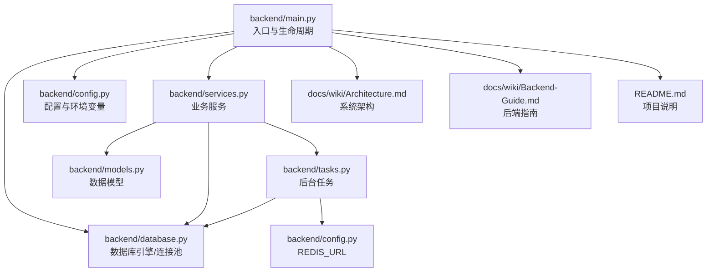
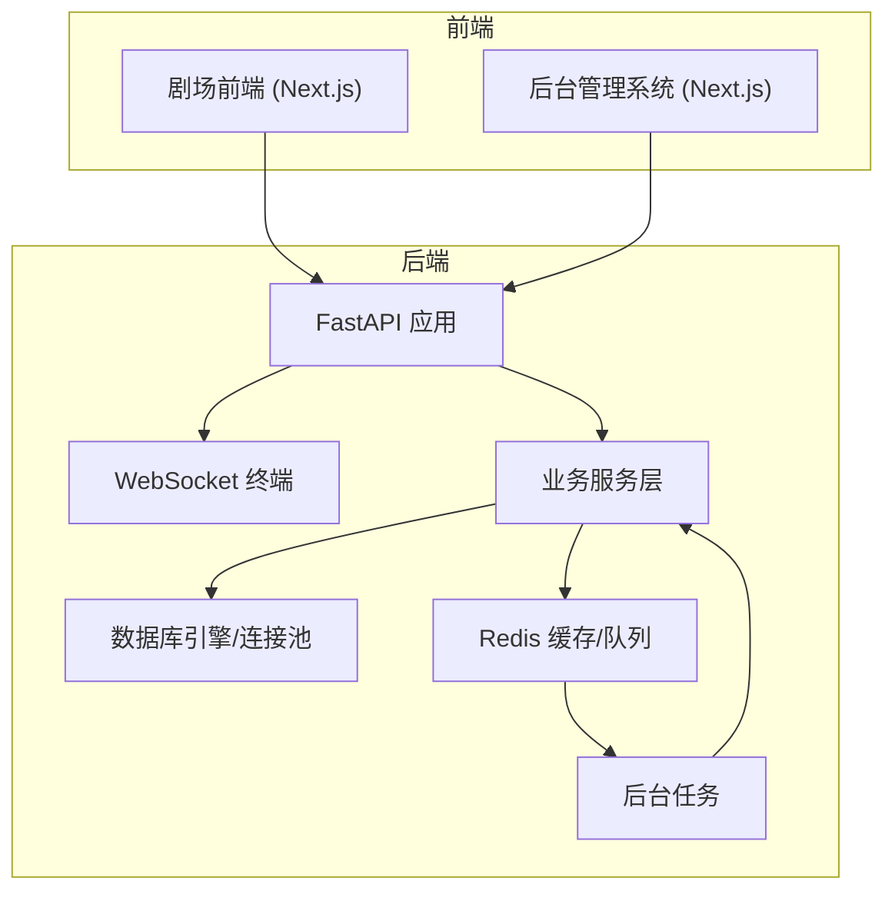
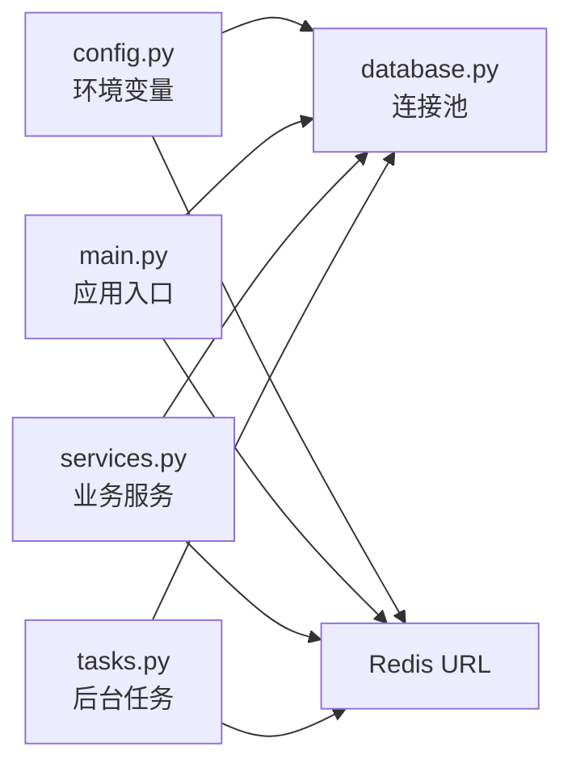

# 告警规则配置

<cite>
**本文引用的文件**
- [backend/main.py](file://backend/main.py)
- [backend/database.py](file://backend/database.py)
- [backend/config.py](file://backend/config.py)
- [backend/models.py](file://backend/models.py)
- [backend/services.py](file://backend/services.py)
- [backend/tasks.py](file://backend/tasks.py)
- [backend/.env.example](file://backend/.env.example)
- [backend/requirements.txt](file://backend/requirements.txt)
- [docs/wiki/Architecture.md](file://docs/wiki/Architecture.md)
- [docs/wiki/Backend-Guide.md](file://docs/wiki/Backend-Guide.md)
- [README.md](file://README.md)
</cite>

## 目录
1. [简介](#简介)
2. [项目结构](#项目结构)
3. [核心组件](#核心组件)
4. [架构总览](#架构总览)
5. [详细组件分析](#详细组件分析)
6. [依赖分析](#依赖分析)
7. [性能考虑](#性能考虑)
8. [故障排查指南](#故障排查指南)
9. [结论](#结论)
10. [附录](#附录)

## 简介
本指南围绕“告警规则配置”目标，结合代码库现状，给出一套可落地的告警策略与实施路径。当前代码库已具备：
- 异步后端服务（FastAPI + Uvicorn）
- 数据库连接池（SQLAlchemy Async + pool_pre_ping）
- Redis 连接（用于缓存与任务队列）
- WebSocket 通道（实时推送）
- 管理后台（Admin）与 LLM 动态配置能力

基于上述能力，可将告警维度聚焦于：服务可用性、API 响应时间、WebSocket 连接失败率、数据库连接池使用率、以及后台任务生成质量等关键业务指标。

## 项目结构
后端采用模块化组织，关键模块如下：
- 入口与生命周期：backend/main.py
- 配置与环境：backend/config.py、backend/.env.example
- 数据库与连接池：backend/database.py
- 数据模型：backend/models.py
- 业务服务：backend/services.py
- 后台任务：backend/tasks.py
- 文档与架构：docs/wiki/*.md
- 依赖清单：backend/requirements.txt

图表来源
- [backend/main.py](file://backend/main.py#L1-L173)
- [backend/database.py](file://backend/database.py#L1-L31)
- [backend/config.py](file://backend/config.py#L1-L34)
- [backend/models.py](file://backend/models.py#L1-L122)
- [backend/services.py](file://backend/services.py#L1-L66)
- [backend/tasks.py](file://backend/tasks.py#L1-L62)
- [docs/wiki/Architecture.md](file://docs/wiki/Architecture.md#L1-L62)
- [docs/wiki/Backend-Guide.md](file://docs/wiki/Backend-Guide.md#L1-L108)
- [README.md](file://README.md#L1-L141)

章节来源
- [backend/main.py](file://backend/main.py#L1-L173)
- [backend/database.py](file://backend/database.py#L1-L31)
- [backend/config.py](file://backend/config.py#L1-L34)
- [backend/models.py](file://backend/models.py#L1-L122)
- [backend/services.py](file://backend/services.py#L1-L66)
- [backend/tasks.py](file://backend/tasks.py#L1-L62)
- [docs/wiki/Architecture.md](file://docs/wiki/Architecture.md#L1-L62)
- [docs/wiki/Backend-Guide.md](file://docs/wiki/Backend-Guide.md#L1-L108)
- [README.md](file://README.md#L1-L141)

## 核心组件
- 服务可用性：基于 Uvicorn 运行的 FastAPI 应用，可通过健康检查端点与日志级别控制进行可用性观测。
- API 响应时间：通过中间件或装饰器记录请求耗时；当前代码未内置计时器，可在路由层扩展。
- WebSocket 连接失败率：通过 WebSocket 终端错误捕获与关闭处理，可统计异常断开次数。
- 数据库连接池使用率：通过 SQLAlchemy Async 连接池参数（pool_size、max_overflow、pool_pre_ping）与池状态监控。
- 后台任务生成质量：通过章节预生成任务与资产生成任务的状态与异常处理，评估生成稳定性。

章节来源
- [backend/main.py](file://backend/main.py#L1-L173)
- [backend/database.py](file://backend/database.py#L1-L31)
- [backend/tasks.py](file://backend/tasks.py#L1-L62)

## 架构总览
下图展示与告警相关的关键组件与数据流：

图表来源
- [docs/wiki/Architecture.md](file://docs/wiki/Architecture.md#L1-L62)
- [backend/main.py](file://backend/main.py#L1-L173)
- [backend/database.py](file://backend/database.py#L1-L31)
- [backend/tasks.py](file://backend/tasks.py#L1-L62)

## 详细组件分析

### 服务可用性告警
- 触发条件
  - 应用无法启动或迁移失败
  - Uvicorn 访问日志出现大量错误
  - 数据库连接池持续超时或拒绝连接
- 建议阈值
  - 启动失败重试次数超过阈值
  - 连接池空闲/活跃连接比例低于阈值
- 告警级别
  - 严重：服务不可用
  - 轻微：连接池紧张
- 建议动作
  - 自动重启容器/进程
  - 发送运维值班通知

章节来源
- [backend/main.py](file://backend/main.py#L45-L81)
- [backend/database.py](file://backend/database.py#L8-L17)

### API 响应时间告警
- 触发条件
  - 单个请求耗时超过阈值
  - P95/P99 响应时间异常升高
- 建议阈值
  - 一般接口：P95 > 500ms，P99 > 1000ms
  - 媒体生成类接口：P95 > 2000ms
- 告警级别
  - 轻微：P95 超过阈值
  - 严重：P99 明显升高或持续超阈
- 建议动作
  - 限流与熔断
  - 上报慢查询与堆栈

章节来源
- [backend/main.py](file://backend/main.py#L128-L173)

### WebSocket 连接失败率告警
- 触发条件
  - WebSocket 连接异常断开
  - 接收/发送文本异常
- 建议阈值
  - 连接失败率 > 1%
  - 单节点每分钟异常断开次数 > 10
- 告警级别
  - 轻微：偶发断开
  - 严重：批量断开
- 建议动作
  - 检查网络与防火墙
  - 降级推送策略

章节来源
- [backend/main.py](file://backend/main.py#L157-L169)

### 数据库连接池使用率告警
- 触发条件
  - 连接池空闲连接过少
  - 连接等待时间过长
  - 连接池溢出连接数过高
- 建议阈值
  - 空闲连接 < 2 或占比 < 10%
  - 等待时间 P95 > 100ms
  - 溢出连接数占比 > 5%
- 告警级别
  - 轻微：空闲不足
  - 严重：等待超时
- 建议动作
  - 调整 pool_size/max_overflow
  - 优化查询与事务时长

章节来源
- [backend/database.py](file://backend/database.py#L8-L17)

### 后台任务生成质量告警
- 触发条件
  - 章节预生成失败
  - 资产生成失败
- 建议阈值
  - 任务失败率 > 1%
  - 预生成队列堆积 > 100
- 告警级别
  - 轻微：单次失败
  - 严重：批量失败
- 廊告级别
  - 轻微：自动重试
  - 严重：人工介入

章节来源
- [backend/tasks.py](file://backend/tasks.py#L1-L62)

### 告警渠道配置（概念性）
- 邮件：用于正式通知与值班交接
- 短信：紧急事件快速触达
- 即时通讯：群组通知与工单联动
- 建议：统一接入告警平台（如 Prometheus Alertmanager、企业微信/钉钉机器人等）

[本节为概念性说明，不直接分析具体文件]

### 告警去重与抑制策略（概念性）
- 去重：基于标签（服务名、实例、指标类型）聚合相同告警
- 抑制：当“服务不可用”告警触发时，抑制其下的“接口超时”告警
- 建议：在告警平台中配置抑制规则与静默窗口

[本节为概念性说明，不直接分析具体文件]

### 告警升级机制与值班轮换（概念性）
- 升级链路：轻微 → 严重（含升级时间窗与升级接收人）
- 值班轮换：基于人员日程与告警等级自动转交
- 廊告级别
  - 轻微：仅记录
  - 严重：通知值班与团队

[本节为概念性说明，不直接分析具体文件]

### 告警规则的动态调整与测试验证（概念性）
- 动态调整：通过配置中心或管理后台热更新阈值
- 测试验证：压测工具模拟峰值流量，验证阈值与升级链路
- 建议：灰度发布阈值变更，观察 24 小时内告警收敛情况

[本节为概念性说明，不直接分析具体文件]

## 依赖分析
- 外部依赖
  - Redis：用于缓存与任务队列
  - PostgreSQL：数据持久化
  - AgentScope/OpenAI 等：内容生成
- 内部耦合
  - 业务服务依赖数据库与 Redis
  - 后台任务依赖 Redis 与数据库
  - WebSocket 与业务服务解耦，但共享数据库连接池

图表来源
- [backend/config.py](file://backend/config.py#L1-L34)
- [backend/database.py](file://backend/database.py#L1-L31)
- [backend/main.py](file://backend/main.py#L1-L173)
- [backend/services.py](file://backend/services.py#L1-L66)
- [backend/tasks.py](file://backend/tasks.py#L1-L62)

章节来源
- [backend/config.py](file://backend/config.py#L1-L34)
- [backend/database.py](file://backend/database.py#L1-L31)
- [backend/main.py](file://backend/main.py#L1-L173)
- [backend/services.py](file://backend/services.py#L1-L66)
- [backend/tasks.py](file://backend/tasks.py#L1-L62)

## 性能考虑
- 连接池参数
  - pool_size：并发连接上限
  - max_overflow：溢出连接数
  - pool_pre_ping：自动重连与健康检查
- WebSocket
  - 控制消息大小与频率，避免内存压力
- 后台任务
  - 分批处理与速率限制，避免阻塞主业务

章节来源
- [backend/database.py](file://backend/database.py#L8-L17)
- [backend/main.py](file://backend/main.py#L157-L169)
- [backend/tasks.py](file://backend/tasks.py#L1-L62)

## 故障排查指南
- 启动阶段
  - 数据库迁移失败：查看启动日志与 Alembic 输出
  - LLM 配置加载失败：检查配置表与密钥
- 运行阶段
  - WebSocket 异常：捕获异常并记录断开原因
  - 数据库连接池紧张：调整池参数并优化查询
  - 后台任务堆积：检查 Redis 队列与任务执行耗时

章节来源
- [backend/main.py](file://backend/main.py#L45-L81)
- [backend/main.py](file://backend/main.py#L157-L169)
- [backend/database.py](file://backend/database.py#L8-L17)
- [backend/tasks.py](file://backend/tasks.py#L1-L62)

## 结论
本指南基于现有代码库能力，提出了覆盖服务可用性、API 响应时间、WebSocket 连接失败率与数据库连接池使用率的告警策略，并给出了渠道、去重抑制、升级与值班轮换的实施建议。建议在告警平台中落地这些规则，并结合压测与灰度验证持续优化阈值与升级链路。

[本节为总结性内容，不直接分析具体文件]

## 附录

### A. 关键业务指标与阈值建议
- 服务可用性
  - 启动失败重试次数 > 3 次
  - 连接池空闲连接占比 < 10%
- API 响应时间
  - P95 > 500ms，P99 > 1000ms
- WebSocket 连接失败率
  - 失败率 > 1%，单节点每分钟断开 > 10
- 数据库连接池使用率
  - 空闲连接 < 2，等待时间 P95 > 100ms，溢出占比 > 5%

章节来源
- [backend/main.py](file://backend/main.py#L45-L81)
- [backend/database.py](file://backend/database.py#L8-L17)
- [backend/tasks.py](file://backend/tasks.py#L1-L62)

### B. 告警渠道与集成（概念性）
- 邮件：用于正式通知与值班交接
- 短信：紧急事件快速触达
- 即时通讯：群组通知与工单联动
- 建议：统一接入告警平台（如 Prometheus Alertmanager、企业微信/钉钉机器人等）

[本节为概念性说明，不直接分析具体文件]

### C. 告警规则动态调整与测试验证（概念性）
- 动态调整：通过配置中心或管理后台热更新阈值
- 测试验证：压测工具模拟峰值流量，验证阈值与升级链路
- 建议：灰度发布阈值变更，观察 24 小时内告警收敛情况

[本节为概念性说明，不直接分析具体文件]