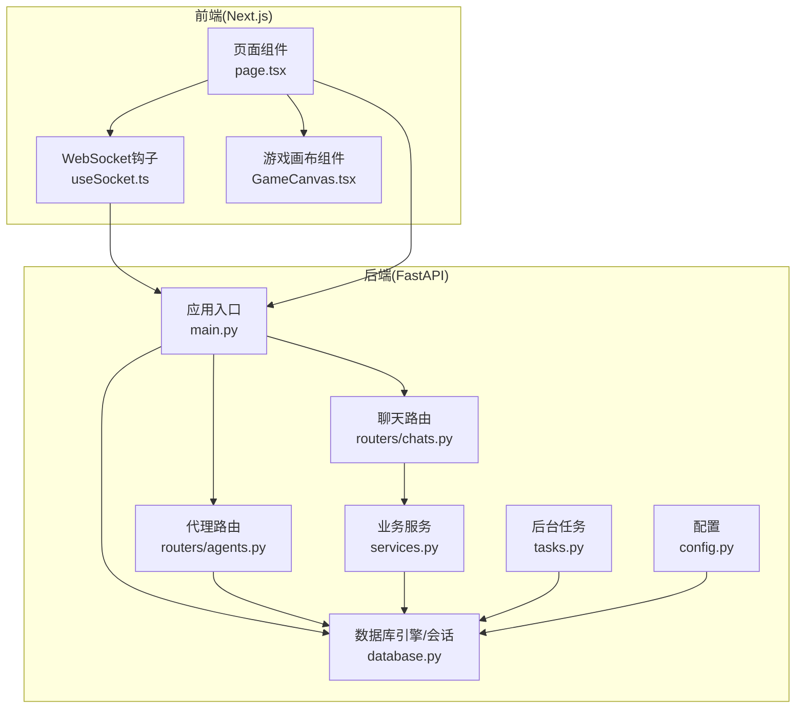
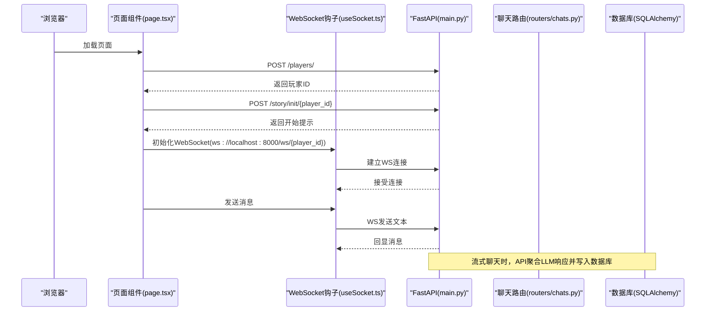
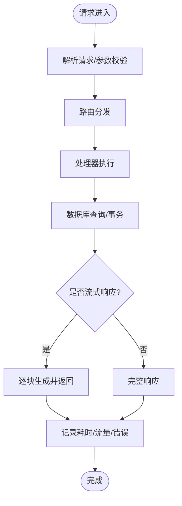
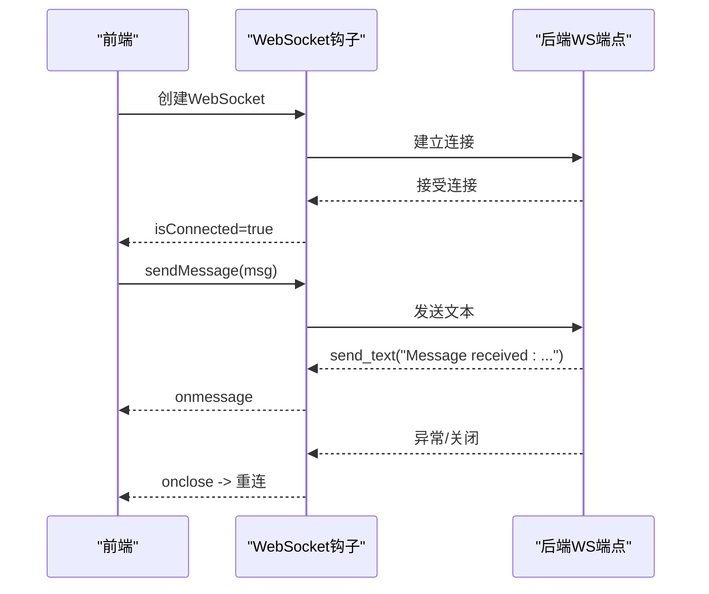
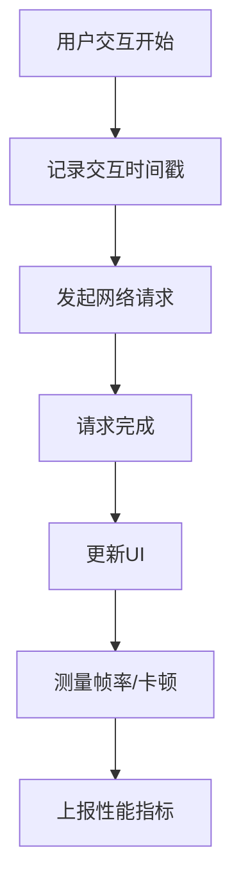
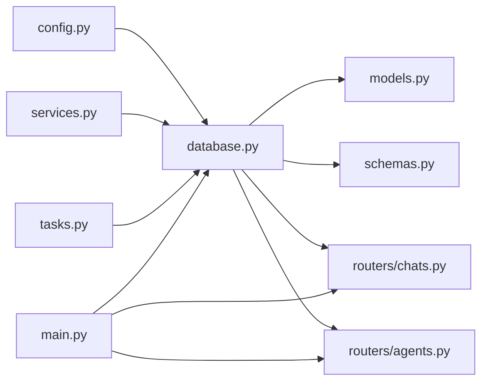

# 应用性能监控

<cite>
**本文档引用的文件**
- [backend/main.py](file://backend/main.py)
- [backend/config.py](file://backend/config.py)
- [backend/database.py](file://backend/database.py)
- [backend/services.py](file://backend/services.py)
- [backend/routers/chats.py](file://backend/routers/chats.py)
- [backend/routers/agents.py](file://backend/routers/agents.py)
- [backend/models.py](file://backend/models.py)
- [backend/schemas.py](file://backend/schemas.py)
- [backend/tasks.py](file://backend/tasks.py)
- [backend/requirements.txt](file://backend/requirements.txt)
- [frontend/src/hooks/useSocket.ts](file://frontend/src/hooks/useSocket.ts)
- [frontend/src/components/GameCanvas.tsx](file://frontend/src/components/GameCanvas.tsx)
- [frontend/src/app/page.tsx](file://frontend/src/app/page.tsx)
</cite>

## 目录
1. [简介](#简介)
2. [项目结构](#项目结构)
3. [核心组件](#核心组件)
4. [架构总览](#架构总览)
5. [详细组件分析](#详细组件分析)
6. [依赖关系分析](#依赖关系分析)
7. [性能考虑](#性能考虑)
8. [故障排查指南](#故障排查指南)
9. [结论](#结论)
10. [附录](#附录)

## 简介
本指南面向“无限叙事游戏”项目的性能监控与优化，覆盖后端FastAPI服务的关键指标（请求响应时间、并发连接数、数据库查询性能、内存使用）、WebSocket连接状态监控（连接建立、消息传输延迟、断线重连）、前端性能监控（游戏画布渲染帧率、网络请求性能、用户交互响应时间），以及监控数据采集、存储与可视化方案，并提供性能瓶颈识别方法与优化建议。

## 项目结构
该项目采用前后端分离架构：前端基于Next.js（React）构建，后端基于FastAPI提供REST与WebSocket接口；数据库为SQLite/PostgreSQL（通过配置切换），使用SQLAlchemy异步ORM与Alembic迁移管理；聊天流式响应由后端聚合不同大模型提供商的流式输出。

图表来源
- [backend/main.py](file://backend/main.py#L83-L173)
- [backend/database.py](file://backend/database.py#L1-L31)
- [backend/routers/chats.py](file://backend/routers/chats.py#L1-L275)
- [backend/routers/agents.py](file://backend/routers/agents.py#L1-L141)
- [backend/services.py](file://backend/services.py#L1-L66)
- [backend/tasks.py](file://backend/tasks.py#L1-L62)
- [backend/config.py](file://backend/config.py#L1-L34)
- [frontend/src/hooks/useSocket.ts](file://frontend/src/hooks/useSocket.ts#L1-L43)
- [frontend/src/components/GameCanvas.tsx](file://frontend/src/components/GameCanvas.tsx#L1-L50)
- [frontend/src/app/page.tsx](file://frontend/src/app/page.tsx#L1-L85)

章节来源
- [backend/main.py](file://backend/main.py#L1-L173)
- [backend/database.py](file://backend/database.py#L1-L31)
- [backend/config.py](file://backend/config.py#L1-L34)
- [frontend/src/hooks/useSocket.ts](file://frontend/src/hooks/useSocket.ts#L1-L43)
- [frontend/src/components/GameCanvas.tsx](file://frontend/src/components/GameCanvas.tsx#L1-L50)
- [frontend/src/app/page.tsx](file://frontend/src/app/page.tsx#L1-L85)

## 核心组件
- 后端应用与生命周期：FastAPI应用实例、CORS中间件、路由注册、启动时数据库迁移与配置加载。
- 数据层：异步SQLAlchemy引擎、连接池参数、会话工厂、模型定义。
- 路由层：聊天流式响应（StreamingResponse）、代理管理等。
- 业务层：玩家与故事生成、章节预生成等。
- 前端：WebSocket钩子、游戏画布组件、页面编排。

章节来源
- [backend/main.py](file://backend/main.py#L30-L173)
- [backend/database.py](file://backend/database.py#L1-L31)
- [backend/routers/chats.py](file://backend/routers/chats.py#L1-L275)
- [backend/routers/agents.py](file://backend/routers/agents.py#L1-L141)
- [backend/services.py](file://backend/services.py#L1-L66)
- [frontend/src/hooks/useSocket.ts](file://frontend/src/hooks/useSocket.ts#L1-L43)
- [frontend/src/components/GameCanvas.tsx](file://frontend/src/components/GameCanvas.tsx#L1-L50)

## 架构总览
下图展示从浏览器到后端数据库的典型调用链路，以及WebSocket实时通信路径。

图表来源
- [backend/main.py](file://backend/main.py#L128-L173)
- [backend/routers/chats.py](file://backend/routers/chats.py#L72-L258)
- [frontend/src/app/page.tsx](file://frontend/src/app/page.tsx#L14-L35)
- [frontend/src/hooks/useSocket.ts](file://frontend/src/hooks/useSocket.ts#L8-L33)

## 详细组件分析

### 后端性能监控要点
- 请求响应时间
  - 使用中间件或装饰器记录每个路由的处理耗时，结合日志级别控制输出量。
  - 对于流式响应（聊天），可按块统计首字节时间与吞吐量。
- 并发连接数
  - 通过连接池参数（pool_size、max_overflow）限制并发，结合系统监控观察连接占用率。
- 数据库查询性能
  - 异步查询与事务边界清晰，避免长事务；对热点查询建立索引（如按id、外键、时间戳）。
  - 使用SQLAlchemy事件或慢查询日志定位慢查询。
- 内存使用情况
  - 监控进程RSS与GC统计；避免在请求中累积大对象；及时释放临时资源。

图表来源
- [backend/routers/chats.py](file://backend/routers/chats.py#L113-L258)
- [backend/database.py](file://backend/database.py#L19-L31)

章节来源
- [backend/main.py](file://backend/main.py#L14-L28)
- [backend/database.py](file://backend/database.py#L8-L23)
- [backend/routers/chats.py](file://backend/routers/chats.py#L113-L258)

### WebSocket连接状态监控
- 连接建立
  - 前端初始化WebSocket并监听onopen/onerror/onclose；后端接受连接后维持循环接收消息。
- 消息传输延迟
  - 在后端记录收到消息的时间戳与回传时间戳，计算RTT；前端记录发送时间与收到回显时间。
- 断线重连机制
  - 前端检测onclose后指数退避重连；后端在异常时清理资源并允许重新握手。

图表来源
- [frontend/src/hooks/useSocket.ts](file://frontend/src/hooks/useSocket.ts#L8-L33)
- [backend/main.py](file://backend/main.py#L157-L170)

章节来源
- [frontend/src/hooks/useSocket.ts](file://frontend/src/hooks/useSocket.ts#L1-L43)
- [backend/main.py](file://backend/main.py#L157-L170)

### 前端性能监控策略
- 游戏画布渲染帧率
  - 使用requestAnimationFrame测量实际FPS；对渲染密集场景进行分帧与剔除。
- 网络请求性能
  - 使用Performance API记录XHR/Fetch的startTime、responseEnd等；结合浏览器网络面板。
- 用户交互响应时间
  - 记录用户操作到界面反馈的时间差，定位主线程阻塞。

图表来源
- [frontend/src/components/GameCanvas.tsx](file://frontend/src/components/GameCanvas.tsx#L14-L44)
- [frontend/src/app/page.tsx](file://frontend/src/app/page.tsx#L14-L35)

章节来源
- [frontend/src/components/GameCanvas.tsx](file://frontend/src/components/GameCanvas.tsx#L1-L50)
- [frontend/src/app/page.tsx](file://frontend/src/app/page.tsx#L1-L85)

### 监控数据采集、存储与可视化
- 采集
  - 后端：中间件/装饰器埋点（请求耗时、错误码、并发、数据库慢查询）；WebSocket事件（连接、断开、消息延迟）。
  - 前端：FPS、网络指标、交互延迟、错误日志。
- 存储
  - 后端：时序数据库（如InfluxDB）或日志系统（ELK）；关键指标写入Redis或本地文件归档。
  - 前端：Web Vitals与自定义指标上传至后端或直接写入时序库。
- 可视化
  - Grafana/自建仪表盘展示：TPM、P95/P99响应时间、并发连接、数据库连接占用、WebSocket断线率、前端FPS、网络延迟。

章节来源
- [backend/main.py](file://backend/main.py#L14-L28)
- [backend/routers/chats.py](file://backend/routers/chats.py#L133-L234)

### 性能瓶颈识别与优化建议
- 后端
  - 瓶颈识别：慢查询（数据库）、LLM流式聚合阻塞、连接池耗尽、CORS/中间件开销。
  - 优化建议：缓存热点数据、限流与熔断、拆分长事务、连接池参数调优、异步I/O优先。
- WebSocket
  - 瓶颈识别：消息堆积、心跳缺失、断线频繁。
  - 优化建议：心跳保活、背压控制、批量压缩消息、断线重连指数退避。
- 前端
  - 瓶颈识别：主线程阻塞、渲染抖动、网络拥塞。
  - 优化建议：虚拟滚动、Web Workers、CDN与缓存、关键路径优化。

章节来源
- [backend/database.py](file://backend/database.py#L8-L23)
- [backend/routers/chats.py](file://backend/routers/chats.py#L144-L209)
- [frontend/src/hooks/useSocket.ts](file://frontend/src/hooks/useSocket.ts#L35-L39)

## 依赖关系分析
后端模块间依赖清晰：路由依赖数据库会话工厂，业务服务依赖数据库，聊天路由负责流式响应与统计，任务模块负责后台生成与资产处理。

图表来源
- [backend/config.py](file://backend/config.py#L1-L34)
- [backend/database.py](file://backend/database.py#L1-L31)
- [backend/models.py](file://backend/models.py#L1-L122)
- [backend/schemas.py](file://backend/schemas.py#L1-L102)
- [backend/routers/chats.py](file://backend/routers/chats.py#L1-L275)
- [backend/routers/agents.py](file://backend/routers/agents.py#L1-L141)
- [backend/services.py](file://backend/services.py#L1-L66)
- [backend/tasks.py](file://backend/tasks.py#L1-L62)
- [backend/main.py](file://backend/main.py#L30-L173)

章节来源
- [backend/requirements.txt](file://backend/requirements.txt#L1-L20)
- [backend/main.py](file://backend/main.py#L30-L173)
- [backend/database.py](file://backend/database.py#L1-L31)
- [backend/routers/chats.py](file://backend/routers/chats.py#L1-L275)
- [backend/routers/agents.py](file://backend/routers/agents.py#L1-L141)
- [backend/services.py](file://backend/services.py#L1-L66)
- [backend/tasks.py](file://backend/tasks.py#L1-L62)
- [backend/models.py](file://backend/models.py#L1-L122)
- [backend/schemas.py](file://backend/schemas.py#L1-L102)
- [backend/config.py](file://backend/config.py#L1-L34)

## 性能考虑
- 数据库连接池
  - 当前连接池参数已设置，建议根据并发峰值与慢查询比例动态调整。
- 流式响应
  - 聊天路由已实现流式返回，注意上游LLM的流式稳定性与错误恢复。
- WebSocket
  - 建议增加心跳与超时检测，避免长时间空闲连接占用资源。
- 前端渲染
  - 画布组件按需初始化与销毁，避免重复创建实例导致内存泄漏。

章节来源
- [backend/database.py](file://backend/database.py#L8-L23)
- [backend/routers/chats.py](file://backend/routers/chats.py#L144-L209)
- [frontend/src/components/GameCanvas.tsx](file://frontend/src/components/GameCanvas.tsx#L39-L43)

## 故障排查指南
- 后端日志
  - 精细化日志级别，SQLAlchemy与Uvicorn访问日志已做降噪处理，便于定位异常。
- WebSocket异常
  - 捕获异常并打印，确保连接最终关闭；前端监听onclose触发重连。
- 数据库连接失败
  - 启动阶段具备重试与迁移执行逻辑，若仍失败检查环境变量与数据库可达性。

章节来源
- [backend/main.py](file://backend/main.py#L14-L28)
- [backend/main.py](file://backend/main.py#L45-L81)
- [backend/main.py](file://backend/main.py#L160-L169)

## 结论
通过在后端引入中间件埋点、在WebSocket端完善心跳与断线重连、在前端采集FPS与网络指标，并结合数据库连接池与流式响应优化，可有效提升整体应用性能与用户体验。建议尽快落地指标采集与可视化看板，持续迭代优化。

## 附录
- 快速清单
  - 后端：接入中间件埋点、慢查询告警、连接池监控、WebSocket心跳。
  - 前端：FPS采集、网络指标上报、交互延迟统计。
  - 数据库：索引优化、长事务拆分、连接池参数调优。
  - 可视化：Grafana仪表盘、告警规则、趋势分析。