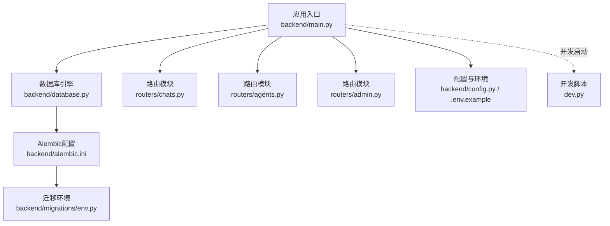
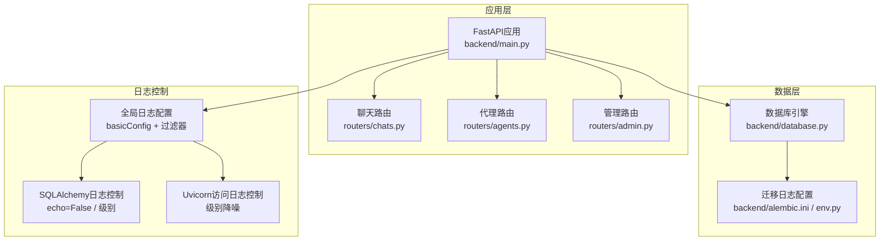
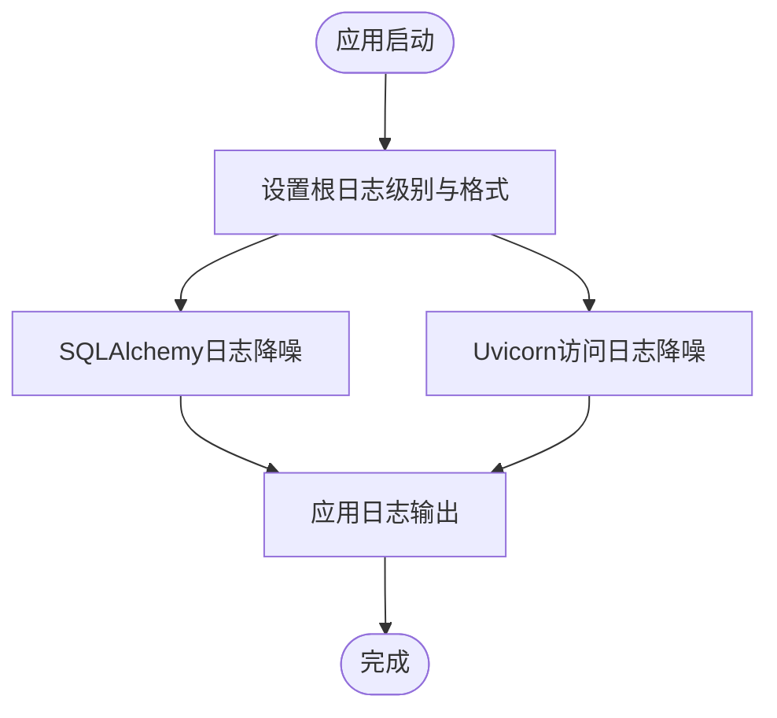
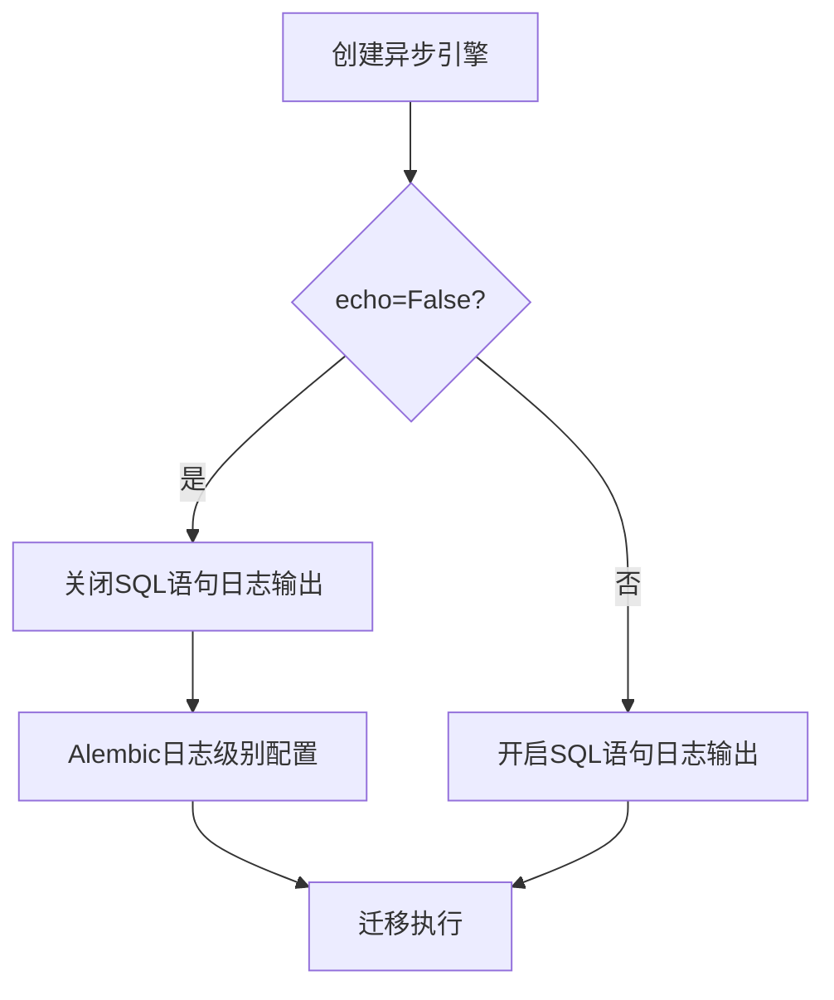
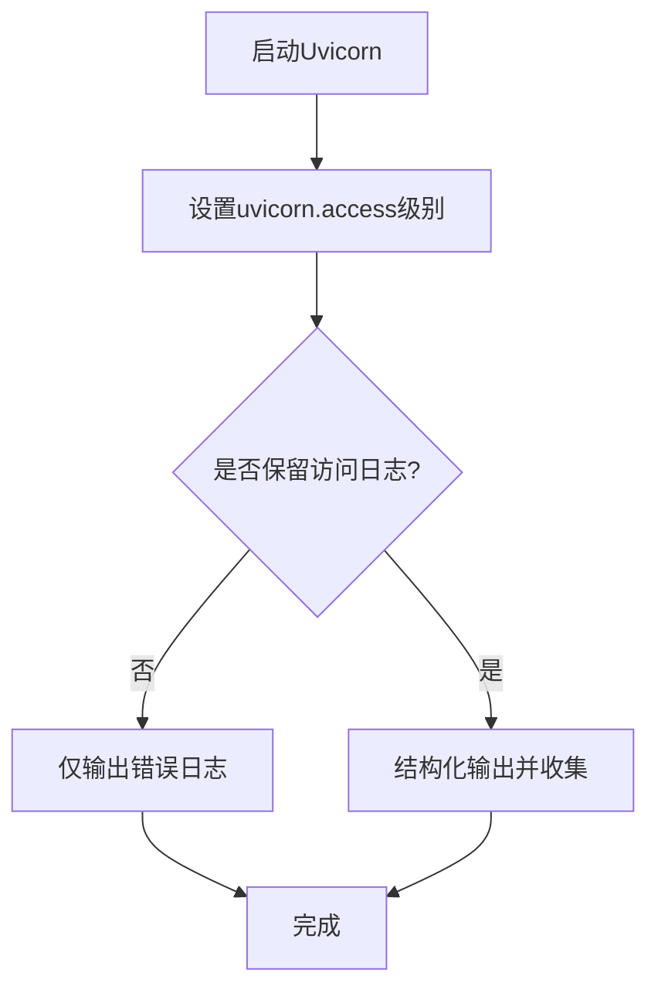
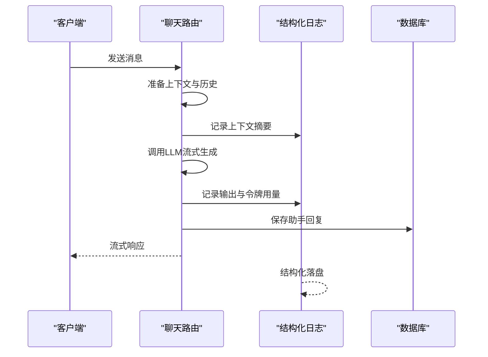
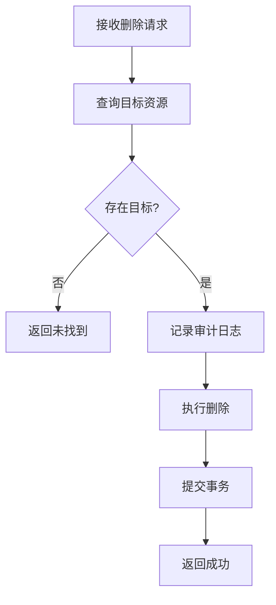
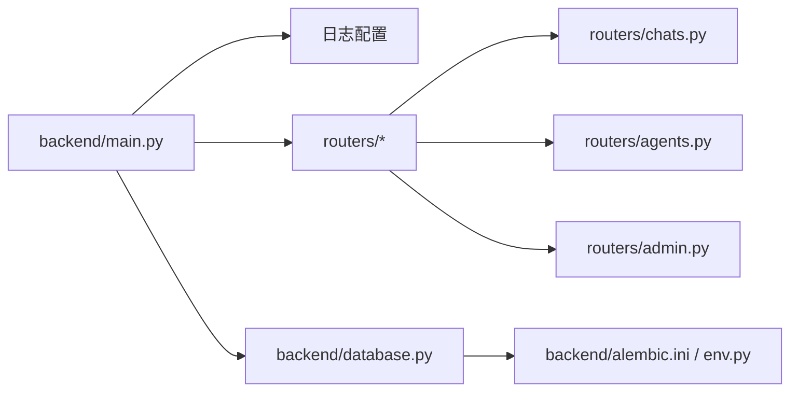

# 日志管理

<cite>
**本文引用的文件**
- [backend/main.py](file://backend/main.py)
- [backend/database.py](file://backend/database.py)
- [backend/alembic.ini](file://backend/alembic.ini)
- [backend/migrations/env.py](file://backend/migrations/env.py)
- [backend/routers/chats.py](file://backend/routers/chats.py)
- [backend/routers/agents.py](file://backend/routers/agents.py)
- [backend/routers/admin.py](file://backend/routers/admin.py)
- [backend/config.py](file://backend/config.py)
- [backend/.env.example](file://backend/.env.example)
- [dev.py](file://dev.py)
</cite>

## 目录
1. [简介](#简介)
2. [项目结构](#项目结构)
3. [核心组件](#核心组件)
4. [架构总览](#架构总览)
5. [详细组件分析](#详细组件分析)
6. [依赖关系分析](#依赖关系分析)
7. [性能考量](#性能考量)
8. [故障排查指南](#故障排查指南)
9. [结论](#结论)
10. [附录](#附录)

## 简介
本指南围绕“无限叙事游戏”后端的日志管理进行系统化梳理与优化建议，覆盖以下方面：
- 日志级别配置与分类策略：应用日志、SQLAlchemy日志、Uvicorn访问日志的精细化控制
- 日志格式标准化与结构化记录方法
- 日志轮转与归档策略，保障生产环境可持续性
- 日志搜索与分析工具集成方案（如ELK Stack）
- 关键业务事件的日志记录规范：玩家行为追踪、系统异常记录、审计日志
- 日志监控与告警配置示例

当前仓库中已具备基础的日志配置与使用点，后续可在此基础上扩展为生产级日志体系。

## 项目结构
后端采用FastAPI + SQLAlchemy异步ORM + Alembic迁移的典型Python服务架构。日志相关的关键位置如下：
- 应用入口与全局日志配置：backend/main.py
- 数据库引擎与SQLAlchemy日志控制：backend/database.py
- Alembic迁移日志配置：backend/alembic.ini、backend/migrations/env.py
- 路由层业务日志：backend/routers/chats.py、backend/routers/agents.py、backend/routers/admin.py
- 配置与环境变量：backend/config.py、backend/.env.example
- 开发环境启动脚本：dev.py

图表来源
- [backend/main.py](file://backend/main.py#L1-L173)
- [backend/database.py](file://backend/database.py#L1-L31)
- [backend/alembic.ini](file://backend/alembic.ini#L81-L114)
- [backend/migrations/env.py](file://backend/migrations/env.py#L1-L104)
- [backend/routers/chats.py](file://backend/routers/chats.py#L1-L275)
- [backend/routers/agents.py](file://backend/routers/agents.py#L1-L141)
- [backend/routers/admin.py](file://backend/routers/admin.py#L1-L112)
- [backend/config.py](file://backend/config.py#L1-L34)
- [backend/.env.example](file://backend/.env.example#L1-L4)
- [dev.py](file://dev.py#L1-L149)

章节来源
- [backend/main.py](file://backend/main.py#L1-L173)
- [backend/database.py](file://backend/database.py#L1-L31)
- [backend/alembic.ini](file://backend/alembic.ini#L81-L114)
- [backend/migrations/env.py](file://backend/migrations/env.py#L1-L104)
- [backend/routers/chats.py](file://backend/routers/chats.py#L1-L275)
- [backend/routers/agents.py](file://backend/routers/agents.py#L1-L141)
- [backend/routers/admin.py](file://backend/routers/admin.py#L1-L112)
- [backend/config.py](file://backend/config.py#L1-L34)
- [backend/.env.example](file://backend/.env.example#L1-L4)
- [dev.py](file://dev.py#L1-L149)

## 核心组件
- 全局日志配置与过滤
  - 在应用入口处设置根日志级别、格式与处理器，并对SQLAlchemy与Uvicorn访问日志进行降噪处理，仅保留应用日志输出。
- 数据库引擎与SQLAlchemy日志
  - 通过引擎参数关闭SQL语句日志输出，避免控制台被大量SQL刷屏；同时在Alembic配置中对sqlalchemy与alembic日志进行分级控制。
- 路由层业务日志
  - 在聊天路由中使用结构化日志记录对话上下文、令牌用量等关键指标；在代理管理路由中对删除操作进行审计日志提示。
- 配置与环境
  - 通过Pydantic Settings集中管理数据库URL、Redis、AI模型密钥等，便于在不同环境切换时统一调整日志策略。

章节来源
- [backend/main.py](file://backend/main.py#L13-L28)
- [backend/database.py](file://backend/database.py#L7-L17)
- [backend/alembic.ini](file://backend/alembic.ini#L96-L104)
- [backend/routers/chats.py](file://backend/routers/chats.py#L133-L234)
- [backend/routers/agents.py](file://backend/routers/agents.py#L135-L136)
- [backend/config.py](file://backend/config.py#L7-L31)

## 架构总览
下图展示日志在系统中的流向与控制点：

图表来源
- [backend/main.py](file://backend/main.py#L13-L28)
- [backend/database.py](file://backend/database.py#L7-L17)
- [backend/alembic.ini](file://backend/alembic.ini#L96-L104)
- [backend/migrations/env.py](file://backend/migrations/env.py#L23-L26)
- [backend/routers/chats.py](file://backend/routers/chats.py#L133-L234)
- [backend/routers/agents.py](file://backend/routers/agents.py#L135-L136)

## 详细组件分析

### 应用日志配置与分类策略
- 全局日志
  - 设置根日志级别与格式，统一输出到标准输出；保留应用自定义日志，屏蔽第三方噪声。
- 第三方日志降噪
  - 对sqlalchemy.engine与sqlalchemy.pool设置较高级别，避免SQL语句与连接池调试信息刷屏。
  - 对uvicorn.access设置较高级别，仅保留错误类访问日志，降低正常请求日志量。
- 建议
  - 生产环境建议将应用日志输出到文件并启用轮转；同时为不同模块设置独立Logger，便于按模块分级。

图表来源
- [backend/main.py](file://backend/main.py#L13-L28)

章节来源
- [backend/main.py](file://backend/main.py#L13-L28)

### SQLAlchemy日志控制
- 引擎参数
  - 通过引擎参数关闭SQL语句输出，减少控制台噪声。
- Alembic日志
  - 在Alembic配置中对sqlalchemy与alembic日志分别设置级别，保证迁移过程日志清晰可控。
- 建议
  - 生产环境可将SQL慢查询与错误日志单独输出到专用文件，结合查询分析工具定位性能瓶颈。

图表来源
- [backend/database.py](file://backend/database.py#L7-L17)
- [backend/alembic.ini](file://backend/alembic.ini#L96-L104)
- [backend/migrations/env.py](file://backend/migrations/env.py#L23-L26)

章节来源
- [backend/database.py](file://backend/database.py#L7-L17)
- [backend/alembic.ini](file://backend/alembic.ini#L96-L104)
- [backend/migrations/env.py](file://backend/migrations/env.py#L23-L26)

### Uvicorn访问日志控制
- 控制点
  - 在应用入口对uvicorn.access设置较高级别，仅保留错误类访问日志，降低正常请求日志量。
- 建议
  - 如需保留访问日志，建议改为结构化输出并接入日志收集系统，避免直接打印到控制台造成I/O压力。

图表来源
- [backend/main.py](file://backend/main.py#L24-L25)

章节来源
- [backend/main.py](file://backend/main.py#L24-L25)

### 结构化日志记录（聊天路由）
- 记录内容
  - 对话上下文摘要、历史消息数量、输入/输出字符数、令牌用量、上下文占用比例等。
- 输出方式
  - 使用结构化日志输出，便于后续解析与分析。
- 建议
  - 将关键指标封装为结构化字段，统一字段命名与单位，便于聚合分析。

图表来源
- [backend/routers/chats.py](file://backend/routers/chats.py#L133-L234)

章节来源
- [backend/routers/chats.py](file://backend/routers/chats.py#L133-L234)

### 审计日志（代理管理路由）
- 记录内容
  - 对关键管理操作（如删除）进行审计日志提示，便于追踪变更。
- 建议
  - 将审计日志写入专用表或文件，包含操作者、对象、时间、前后状态等字段，支持合规审计。

图表来源
- [backend/routers/agents.py](file://backend/routers/agents.py#L128-L140)

章节来源
- [backend/routers/agents.py](file://backend/routers/agents.py#L128-L140)

### 日志格式标准化与结构化
- 当前格式
  - 根日志格式包含模块名、级别与消息体，简洁明了。
- 建议
  - 引入结构化字段（如timestamp、service、trace_id、span_id、level、module、msg），便于与ELK等系统对接。
  - 为不同模块设置独立格式，区分业务日志与系统日志。

章节来源
- [backend/main.py](file://backend/main.py#L14-L18)

### 日志轮转与归档策略
- 文件轮转
  - 建议使用RotatingFileHandler或TimedRotatingFileHandler，按大小或时间进行轮转。
- 归档与清理
  - 按天/周轮转，保留N份副本；超过期限自动清理。
- 生产部署
  - 将日志输出到标准输出并通过容器日志驱动采集，避免直接写磁盘带来的IO瓶颈。

章节来源
- [backend/main.py](file://backend/main.py#L14-L18)

### 日志搜索与分析工具集成（ELK Stack）
- 数据采集
  - 使用Filebeat或Fluent Bit从日志文件采集，或直接读取标准输出。
- 存储与索引
  - 将结构化日志导入Elasticsearch，建立索引模板与字段映射。
- 可视化与检索
  - 使用Kibana构建仪表板，支持按模块、级别、时间范围检索与聚合分析。
- 告警
  - 基于异常级别阈值、错误率、延迟等指标设置告警规则。

章节来源
- [backend/routers/chats.py](file://backend/routers/chats.py#L133-L234)

### 关键业务事件日志记录规范
- 玩家行为追踪
  - 记录玩家ID、行为类型、触发条件、时间戳、上下文摘要等字段。
- 系统异常记录
  - 记录异常类型、堆栈、影响范围、恢复措施等，确保可追溯。
- 审计日志
  - 记录管理员操作、权限变更、敏感配置修改等，满足合规要求。

章节来源
- [backend/routers/agents.py](file://backend/routers/agents.py#L135-L136)
- [backend/routers/chats.py](file://backend/routers/chats.py#L211-L215)

### 日志监控与告警配置示例
- 指标建议
  - 错误率、P95/P99延迟、令牌用量、慢查询比例、连接池利用率。
- 告警策略
  - 错误率超阈值、延迟异常、令牌用量异常、连接池耗尽等触发告警。
- 工具链
  - Prometheus + Alertmanager（PromQL）、Grafana（可视化）。

章节来源
- [backend/routers/chats.py](file://backend/routers/chats.py#L225-L232)

## 依赖关系分析
- 模块耦合
  - 应用入口集中控制日志策略，路由模块按需使用结构化日志，数据库引擎与Alembic共同决定SQL日志输出。
- 外部依赖
  - Uvicorn、SQLAlchemy、Alembic、FastAPI等均会影响日志输出与级别。

图表来源
- [backend/main.py](file://backend/main.py#L1-L173)
- [backend/database.py](file://backend/database.py#L1-L31)
- [backend/alembic.ini](file://backend/alembic.ini#L1-L114)
- [backend/migrations/env.py](file://backend/migrations/env.py#L1-L104)
- [backend/routers/chats.py](file://backend/routers/chats.py#L1-L275)
- [backend/routers/agents.py](file://backend/routers/agents.py#L1-L141)
- [backend/routers/admin.py](file://backend/routers/admin.py#L1-L112)

章节来源
- [backend/main.py](file://backend/main.py#L1-L173)
- [backend/database.py](file://backend/database.py#L1-L31)
- [backend/alembic.ini](file://backend/alembic.ini#L1-L114)
- [backend/migrations/env.py](file://backend/migrations/env.py#L1-L104)
- [backend/routers/chats.py](file://backend/routers/chats.py#L1-L275)
- [backend/routers/agents.py](file://backend/routers/agents.py#L1-L141)
- [backend/routers/admin.py](file://backend/routers/admin.py#L1-L112)

## 性能考量
- I/O开销
  - 避免在高频路径中进行大量同步I/O；优先使用异步日志库或批量刷盘。
- 日志级别
  - 生产环境建议使用INFO及以上级别，避免DEBUG/TRACE产生海量日志。
- 结构化与采样
  - 对高吞吐接口进行采样记录，降低存储与查询成本。
- 轮转策略
  - 合理设置轮转大小与时间窗口，避免频繁轮转造成额外开销。

## 故障排查指南
- 数据库连接失败
  - 检查数据库URL与凭据；查看SQLAlchemy与Alembic日志级别是否过低导致无法发现错误。
- 迁移失败
  - 查看Alembic日志输出，确认版本冲突或权限问题。
- 聊天接口异常
  - 检查LLM提供商配置与密钥；关注结构化日志中的令牌用量与上下文长度。
- 审计缺失
  - 确认管理路由的审计日志是否正确输出；必要时写入专用表。

章节来源
- [backend/alembic.ini](file://backend/alembic.ini#L96-L104)
- [backend/migrations/env.py](file://backend/migrations/env.py#L23-L26)
- [backend/routers/chats.py](file://backend/routers/chats.py#L211-L215)
- [backend/routers/agents.py](file://backend/routers/agents.py#L135-L136)

## 结论
当前项目已具备基础的日志配置与使用点，建议在现有基础上进一步完善：
- 引入结构化日志与统一字段规范
- 实施文件轮转与归档策略
- 集成ELK等日志分析与告警体系
- 明确关键业务事件的审计与追踪规范

## 附录
- 开发环境启动
  - 通过开发脚本并行启动后端、前端与管理面板，便于联调与观察日志。
- 配置与环境
  - 使用Pydantic Settings集中管理配置，支持不同环境切换。

章节来源
- [dev.py](file://dev.py#L91-L131)
- [backend/config.py](file://backend/config.py#L7-L31)
- [backend/.env.example](file://backend/.env.example#L1-L4)