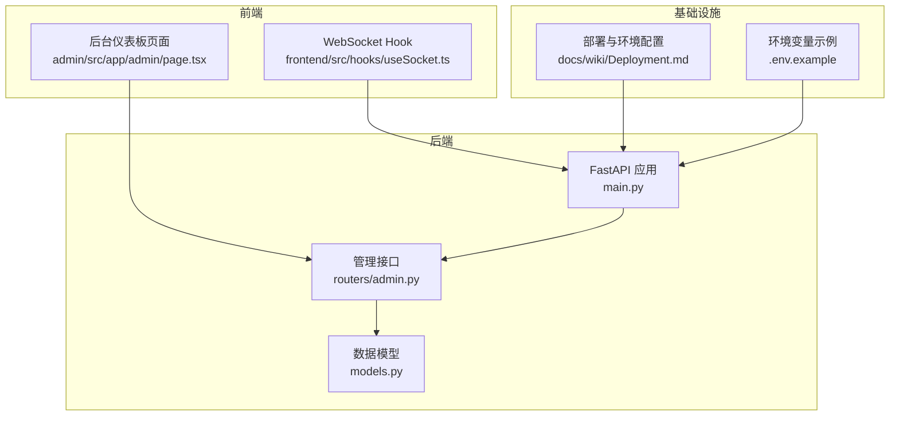
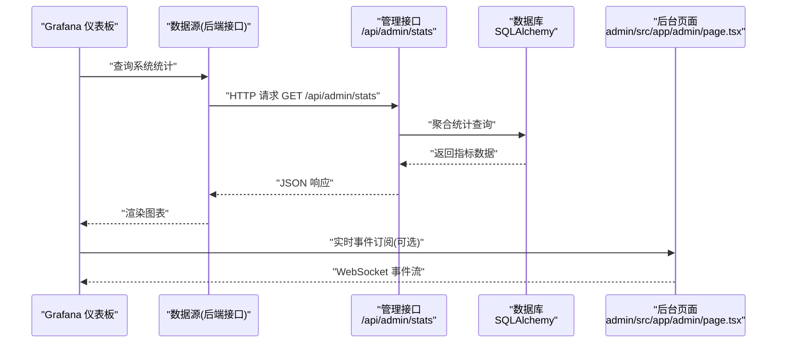
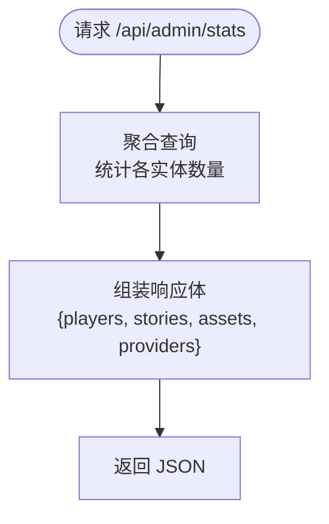
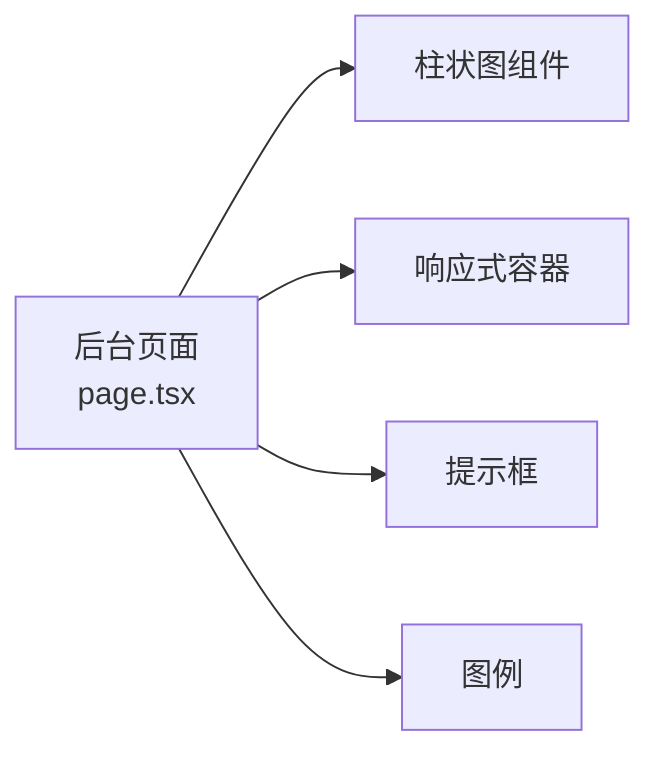
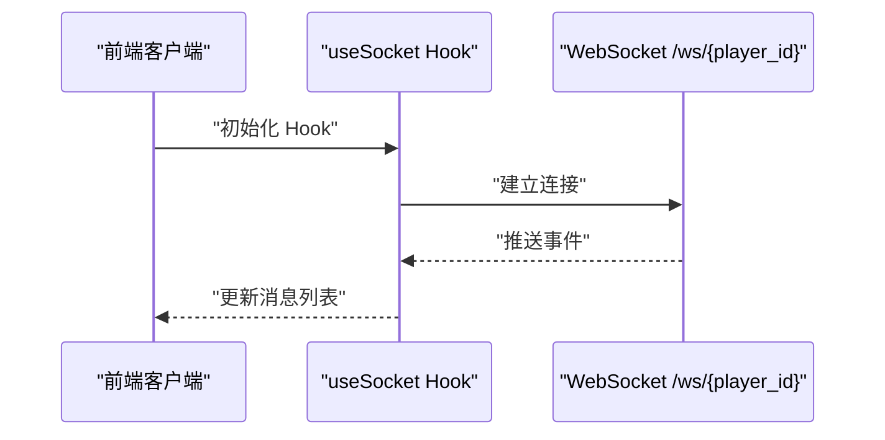
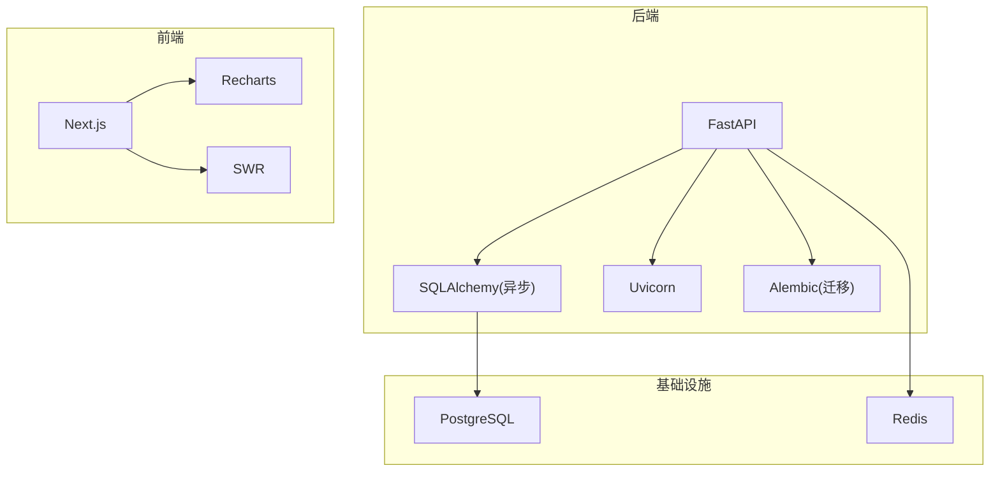

# 监控仪表板

<cite>
**本文引用的文件**
- [README.md](file://README.md)
- [main.py](file://backend/main.py)
- [admin.py](file://backend/routers/admin.py)
- [models.py](file://backend/models.py)
- [page.tsx](file://backend/admin/src/app/admin/page.tsx)
- [useSocket.ts](file://frontend/src/hooks/useSocket.ts)
- [Deployment.md](file://docs/wiki/Deployment.md)
- [Backend-Guide.md](file://docs/wiki/Backend-Guide.md)
- [.env.example](file://backend/.env.example)
</cite>

## 目录
1. [简介](#简介)
2. [项目结构](#项目结构)
3. [核心组件](#核心组件)
4. [架构总览](#架构总览)
5. [详细组件分析](#详细组件分析)
6. [依赖分析](#依赖分析)
7. [性能考量](#性能考量)
8. [故障排查指南](#故障排查指南)
9. [结论](#结论)
10. [附录](#附录)

## 简介
本指南围绕“监控仪表板”的主题，结合当前代码库的实际能力，给出一套可落地的仪表板搭建与配置方案。项目后端提供系统统计接口与实时 WebSocket 通道，前端后台管理页面已具备基础的可视化图表能力；同时，项目文档明确了部署与环境配置。基于这些现有能力，本指南将：
- 解释如何基于现有接口搭建监控仪表板（数据源连接、面板布局、图表类型选择）
- 展示关键指标的可视化（系统健康状态、业务指标趋势、实时数据）
- 给出 Prometheus 指标采集与第三方监控集成的思路（概念性说明）
- 说明仪表板权限与共享设置（概念性说明）
- 讨论移动端适配与响应式设计（基于现有前端组件）
- 总结仪表板模板与预设视图的最佳实践

## 项目结构
从监控仪表板的角度，关注以下与“数据采集—数据接口—前端展示—部署”相关的关键点：
- 后端提供统计接口与 WebSocket，作为仪表板的数据来源
- 前端后台管理页面已内置可视化图表组件，可直接复用
- 部署文档明确了后端、前端、数据库、缓存等运行环境
- 环境变量文件提供了数据库与缓存连接信息

**图表来源**
- [main.py](file://backend/main.py#L83-L98)
- [admin.py](file://backend/routers/admin.py#L10-L31)
- [models.py](file://backend/models.py#L9-L122)
- [page.tsx](file://backend/admin/src/app/admin/page.tsx#L1-L108)
- [useSocket.ts](file://frontend/src/hooks/useSocket.ts#L1-L42)
- [Deployment.md](file://docs/wiki/Deployment.md#L1-L65)
- [.env.example](file://backend/.env.example#L1-L4)

**章节来源**
- [README.md](file://README.md#L1-L141)
- [Deployment.md](file://docs/wiki/Deployment.md#L1-L65)
- [Backend-Guide.md](file://docs/wiki/Backend-Guide.md#L1-L108)

## 核心组件
- 后端统计接口：提供系统关键指标（玩家数、故事数、资产数、LLM 供应商数），作为仪表板的基础数据源
- 前端可视化：后台页面已集成图表组件，支持响应式容器与交互式提示
- 实时通道：WebSocket 提供事件流，可用于实时监控面板
- 数据模型：支撑统计查询与业务指标的存储与计算

**章节来源**
- [admin.py](file://backend/routers/admin.py#L16-L31)
- [page.tsx](file://backend/admin/src/app/admin/page.tsx#L12-L108)
- [useSocket.ts](file://frontend/src/hooks/useSocket.ts#L1-L42)
- [models.py](file://backend/models.py#L9-L122)

## 架构总览
下图展示了从数据采集到前端展示的整体流程，以及与现有代码的对应关系。

**图表来源**
- [admin.py](file://backend/routers/admin.py#L16-L31)
- [models.py](file://backend/models.py#L9-L122)
- [page.tsx](file://backend/admin/src/app/admin/page.tsx#L12-L108)
- [useSocket.ts](file://frontend/src/hooks/useSocket.ts#L1-L42)

## 详细组件分析

### 后端统计接口与数据模型
- 接口职责：提供系统关键指标，便于仪表板进行概览展示
- 数据来源：基于数据模型的聚合查询，返回玩家数、故事数、资产数、LLM 供应商数
- 可扩展性：可在现有接口基础上增加更多维度的统计（如活跃用户、生成耗时、错误率等）

**图表来源**
- [admin.py](file://backend/routers/admin.py#L16-L31)
- [models.py](file://backend/models.py#L9-L122)

**章节来源**
- [admin.py](file://backend/routers/admin.py#L16-L31)
- [models.py](file://backend/models.py#L9-L122)

### 前端可视化组件与布局
- 已有组件：后台页面已集成柱状图、响应式容器、提示框与图例
- 布局方式：卡片式网格布局，支持响应式列数
- 交互能力：提示框样式与图例配合，提升可读性

**图表来源**
- [page.tsx](file://backend/admin/src/app/admin/page.tsx#L12-L108)

**章节来源**
- [page.tsx](file://backend/admin/src/app/admin/page.tsx#L1-L108)

### 实时数据通道（WebSocket）
- 用途：用于推送实时事件（如剧情更新、系统事件），可接入仪表板实现“实时监控”
- 连接方式：前端 Hook 建立 WebSocket 连接，接收后端推送的消息
- 应用场景：将 WebSocket 事件映射为仪表板的实时折线图或事件流

**图表来源**
- [useSocket.ts](file://frontend/src/hooks/useSocket.ts#L1-L42)
- [main.py](file://backend/main.py#L157-L169)

**章节来源**
- [useSocket.ts](file://frontend/src/hooks/useSocket.ts#L1-L42)
- [main.py](file://backend/main.py#L157-L169)

### Prometheus 指标采集与第三方监控集成（概念性说明）
- 指标暴露：在后端服务中添加指标暴露端点（例如 /metrics），记录请求量、错误率、响应时间、数据库连接数、缓存命中率等
- 指标类型：Counter、Gauge、Histogram/HistogramQuantile
- 采集配置：Prometheus 抓取后端服务的 /metrics 端点
- 面板配置：在 Grafana 中以 Prometheus 为数据源，编写查询语句，选择合适的图表类型（如折线图、热力图、状态面板）
- 第三方集成：可将告警发送至企业微信、钉钉、Slack 等，结合 Grafana 的告警通知机制

[本节为概念性说明，不直接分析具体文件，故不附加章节来源]

### 仪表板权限管理与共享设置（概念性说明）
- 权限控制：在 Grafana 中为不同角色分配只读/编辑权限，限制对敏感面板的访问
- 共享视图：通过链接分享只读视图，或导出 PNG 截图用于汇报
- 只读模式：对生产环境启用只读，避免误操作

[本节为概念性说明，不直接分析具体文件，故不附加章节来源]

### 移动端适配与响应式设计
- 响应式图表：现有页面使用响应式容器，图表随容器尺寸变化而缩放
- 布局策略：卡片网格在小屏设备上自动调整列数，保证内容可读
- 建议：在仪表板层面，优先使用折线图、柱状图、状态面板等适合移动端阅读的图表类型

**章节来源**
- [page.tsx](file://backend/admin/src/app/admin/page.tsx#L81-L101)

### 仪表板模板与预设视图最佳实践
- 模板化：将常用视图（系统概览、业务趋势、实时事件）封装为模板，统一命名与分组
- 分层视图：首页为概览（大屏模式），子页为细节（移动端模式）
- 主题一致：统一颜色、字体、间距，确保跨设备一致体验
- 自动刷新：为静态统计面板设置合理的刷新间隔，避免过度拉取

[本节为通用实践总结，不直接分析具体文件，故不附加章节来源]

## 依赖分析
- 后端依赖：FastAPI、SQLAlchemy（异步）、Uvicorn、Alembic（迁移）
- 前端依赖：Next.js、Recharts（图表）、SWR（数据获取）
- 基础设施：PostgreSQL（数据持久化）、Redis（缓存与消息队列）

**图表来源**
- [main.py](file://backend/main.py#L30-L43)
- [page.tsx](file://backend/admin/src/app/admin/page.tsx#L1-L10)
- [Deployment.md](file://docs/wiki/Deployment.md#L14-L21)

**章节来源**
- [main.py](file://backend/main.py#L30-L43)
- [Deployment.md](file://docs/wiki/Deployment.md#L14-L21)

## 性能考量
- 接口优化：统计接口应使用聚合查询，避免一次性加载大量明细数据
- 图表渲染：前端图表组件应限制数据点数量，必要时做采样或分页
- 实时通道：WebSocket 事件应去重与限流，避免面板频繁刷新导致性能下降
- 缓存策略：对静态统计结果进行短期缓存，降低数据库压力

[本节为通用性能建议，不直接分析具体文件，故不附加章节来源]

## 故障排查指南
- 接口不可用：确认后端服务已启动，端口未被占用，CORS 配置允许前端域名
- 数据为空：检查数据库连接字符串与凭据，确认 Alembic 迁移已成功执行
- WebSocket 断连：检查后端 WebSocket 路由是否正确，网络是否存在代理阻断
- 图表不显示：确认前端已正确引入 Recharts 与响应式容器，且容器尺寸有效

**章节来源**
- [main.py](file://backend/main.py#L83-L98)
- [main.py](file://backend/main.py#L171-L173)
- [useSocket.ts](file://frontend/src/hooks/useSocket.ts#L1-L42)
- [Deployment.md](file://docs/wiki/Deployment.md#L60-L65)

## 结论
本项目已具备搭建监控仪表板的良好基础：后端提供统计接口与实时 WebSocket，前端具备可视化图表能力，部署文档明确了运行环境。在此基础上，可进一步完善指标暴露与第三方监控集成，并结合响应式设计与权限管理，形成完整的监控体系。

[本节为总结性内容，不直接分析具体文件，故不附加章节来源]

## 附录
- 快速验证路径
  - 后端统计接口：访问 /api/admin/stats，确认返回 players、stories、assets、providers 字段
  - WebSocket 连接：在前端页面打开控制台，观察 WebSocket 连接与消息推送
  - 部署验证：参考部署文档，确保数据库、Redis、后端、前端均正常运行

**章节来源**
- [admin.py](file://backend/routers/admin.py#L16-L31)
- [useSocket.ts](file://frontend/src/hooks/useSocket.ts#L1-L42)
- [Deployment.md](file://docs/wiki/Deployment.md#L51-L58)