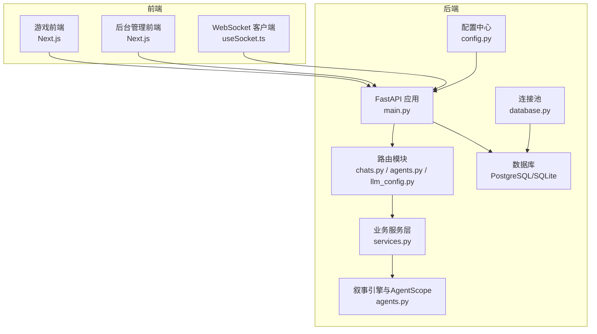
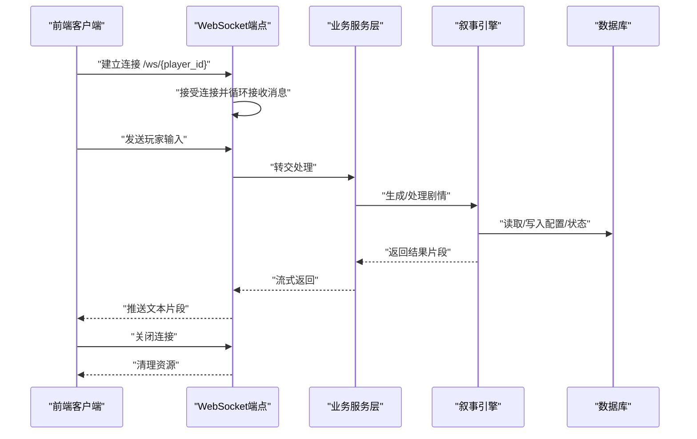
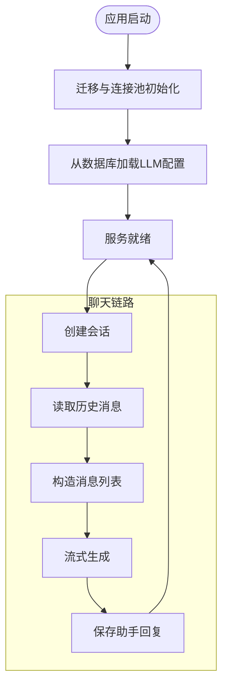
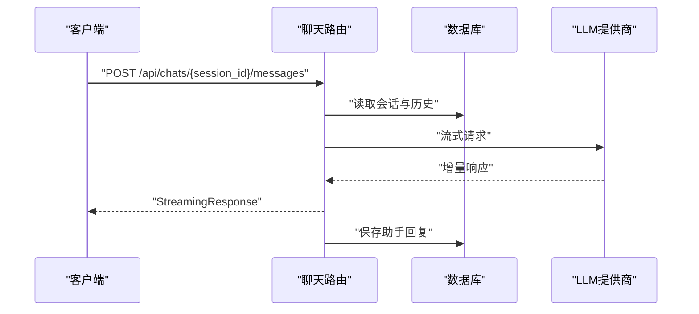
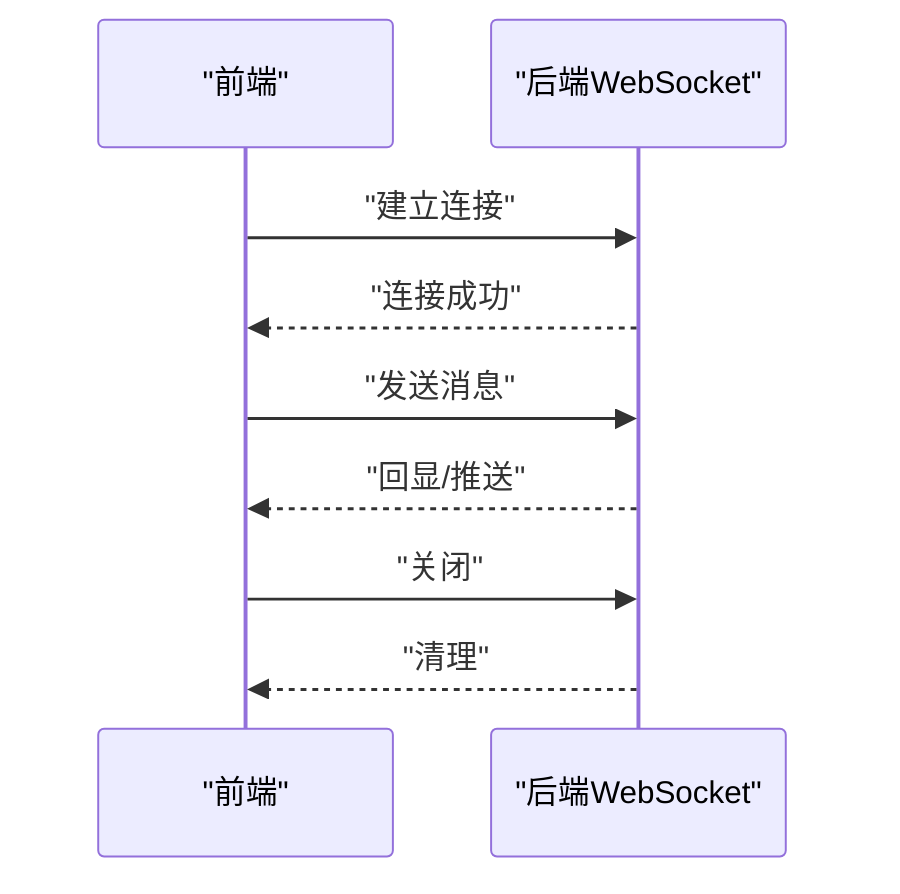
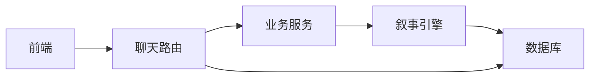

# 监控告警

<cite>
**本文引用的文件**
- [backend/main.py](file://backend/main.py)
- [backend/config.py](file://backend/config.py)
- [backend/database.py](file://backend/database.py)
- [backend/models.py](file://backend/models.py)
- [backend/services.py](file://backend/services.py)
- [backend/routers/chats.py](file://backend/routers/chats.py)
- [backend/routers/agents.py](file://backend/routers/agents.py)
- [backend/routers/llm_config.py](file://backend/routers/llm_config.py)
- [backend/agents.py](file://backend/agents.py)
- [backend/manage_db.py](file://backend/manage_db.py)
- [frontend/src/hooks/useSocket.ts](file://frontend/src/hooks/useSocket.ts)
- [README.md](file://README.md)
</cite>

## 目录
1. [简介](#简介)
2. [项目结构](#项目结构)
3. [核心组件](#核心组件)
4. [架构总览](#架构总览)
5. [详细组件分析](#详细组件分析)
6. [依赖关系分析](#依赖关系分析)
7. [性能考量](#性能考量)
8. [故障排查指南](#故障排查指南)
9. [结论](#结论)
10. [附录](#附录)

## 简介
本指南面向“无限剧情游戏系统”的运维与开发团队，提供一套系统化的监控与告警实践方案。内容覆盖应用性能监控指标（响应时间、吞吐量、错误率、资源使用）、日志采集与分析策略（后端服务日志、前端错误日志、WebSocket 连接状态）、实时监控仪表板配置建议、告警规则设计（可用性、性能阈值、错误频率）、以及与 Prometheus、Grafana、ELK Stack 的集成思路。同时给出故障排查流程与性能优化策略，帮助在高并发与多模态生成场景下保持系统稳定与可观测。

## 项目结构
该项目采用前后端分离架构：后端基于 FastAPI + SQLAlchemy 异步 ORM，前端基于 Next.js，后台管理同样基于 Next.js。系统通过 WebSocket 实现实时交互，通过 LLM 提供商接口进行多模态内容生成，并使用 PostgreSQL 存储结构化数据，Redis 用于缓存与消息队列。



图表来源
- [backend/main.py](file://backend/main.py#L128-L173)
- [backend/routers/chats.py](file://backend/routers/chats.py#L1-L275)
- [backend/routers/agents.py](file://backend/routers/agents.py#L1-L141)
- [backend/routers/llm_config.py](file://backend/routers/llm_config.py#L1-L147)
- [backend/services.py](file://backend/services.py#L1-L66)
- [backend/agents.py](file://backend/agents.py#L1-L196)
- [backend/config.py](file://backend/config.py#L1-L34)
- [backend/database.py](file://backend/database.py#L1-L31)
- [frontend/src/hooks/useSocket.ts](file://frontend/src/hooks/useSocket.ts#L1-L43)

章节来源
- [README.md](file://README.md#L1-L141)
- [backend/main.py](file://backend/main.py#L1-L173)
- [frontend/src/hooks/useSocket.ts](file://frontend/src/hooks/useSocket.ts#L1-L43)

## 核心组件
- 后端入口与生命周期：负责应用启动、数据库迁移、CORS 配置、路由注册与 WebSocket 端点。
- 路由与业务：聊天流式响应、代理与提供商管理、LLM 提供商配置。
- 数据层：异步连接池、模型定义与会话管理。
- 叙事引擎：基于 AgentScope 的多智能体编排，负责故事生成与 NPC 状态管理。
- 前端交互：WebSocket 客户端钩子，负责连接、收发消息与断线提示。

章节来源
- [backend/main.py](file://backend/main.py#L1-L173)
- [backend/routers/chats.py](file://backend/routers/chats.py#L1-L275)
- [backend/routers/agents.py](file://backend/routers/agents.py#L1-L141)
- [backend/routers/llm_config.py](file://backend/routers/llm_config.py#L1-L147)
- [backend/database.py](file://backend/database.py#L1-L31)
- [backend/models.py](file://backend/models.py#L1-L122)
- [backend/agents.py](file://backend/agents.py#L1-L196)
- [frontend/src/hooks/useSocket.ts](file://frontend/src/hooks/useSocket.ts#L1-L43)

## 架构总览
系统通过 FastAPI 提供 REST 与 WebSocket 接口，聊天模块支持流式响应；LLM 提供商通过后台管理动态配置，叙事引擎按需初始化并复用模型实例。数据库采用异步连接池，前端通过 WebSocket 与后端进行低延迟通信。



图表来源
- [backend/main.py](file://backend/main.py#L157-L170)
- [backend/services.py](file://backend/services.py#L1-L66)
- [backend/agents.py](file://backend/agents.py#L154-L191)
- [backend/routers/chats.py](file://backend/routers/chats.py#L72-L258)

## 详细组件分析

### 性能监控指标体系
- 响应时间
  - REST 接口：以路由层为粒度统计请求耗时，结合 Uvicorn 访问日志与业务耗时埋点。
  - 流式聊天：记录首次响应延迟与整体流式完成时间。
- 吞吐量
  - QPS：按路由维度统计每秒请求数。
  - 流式速率：按字节/字符统计单位时间内输出量。
- 错误率
  - HTTP 5xx、422、404 等错误占比；LLM 调用异常与保存消息失败次数。
- 资源使用
  - CPU/内存/连接池占用；数据库连接池活动/空闲；Redis 使用情况；LLM API 调用配额与限流。

章节来源
- [backend/routers/chats.py](file://backend/routers/chats.py#L112-L258)
- [backend/main.py](file://backend/main.py#L128-L173)
- [backend/database.py](file://backend/database.py#L8-L23)

### 日志收集与分析策略
- 后端服务日志
  - 精细化日志级别：SQLAlchemy 与 Uvicorn 访问日志降噪，保留应用关键日志。
  - 聊天链路日志：记录会话、历史条数、输入字符数、上下文窗口、温度、Token 统计与最终输出摘要。
  - WebSocket 错误日志：捕获异常并记录，便于定位连接中断原因。
- 前端错误日志
  - WebSocket 连接状态与消息队列长度；断线重连策略与错误提示。
- LLM 提供商日志
  - 动态配置加载与初始化成功/失败；模型类型与基础 URL；测试连通性结果。



图表来源
- [backend/main.py](file://backend/main.py#L45-L81)
- [backend/agents.py](file://backend/agents.py#L49-L99)
- [backend/routers/chats.py](file://backend/routers/chats.py#L72-L258)

章节来源
- [backend/main.py](file://backend/main.py#L13-L28)
- [backend/routers/chats.py](file://backend/routers/chats.py#L133-L234)
- [backend/main.py](file://backend/main.py#L166-L168)

### 实时监控仪表板配置
- 关键指标可视化
  - 后端：请求速率、P95/P99 延迟、错误率、连接池活动数、数据库慢查询。
  - 前端：WebSocket 连接数、消息接收速率、断线次数、重连耗时。
  - LLM：平均 Token 使用、调用成功率、首字节延迟、超时比例。
- 异常检测
  - 基于滑动窗口的错误率突增、延迟偏离基线、连接池耗尽预警。

章节来源
- [backend/routers/chats.py](file://backend/routers/chats.py#L112-L258)
- [backend/database.py](file://backend/database.py#L8-L23)
- [frontend/src/hooks/useSocket.ts](file://frontend/src/hooks/useSocket.ts#L1-L43)

### 告警规则设计
- 服务可用性
  - / 与 /ws/{player_id} 接口不可用或 5xx 比例超过阈值。
- 性能阈值
  - REST 接口 P95 延迟超过阈值；流式响应首字节延迟异常。
- 错误频率
  - LLM 调用失败、保存消息失败、WebSocket 异常断开。
- 资源告警
  - 数据库连接池空闲/活动异常；Redis 内存/连接数告警。

章节来源
- [backend/routers/chats.py](file://backend/routers/chats.py#L112-L258)
- [backend/main.py](file://backend/main.py#L166-L168)
- [backend/database.py](file://backend/database.py#L8-L23)

### 监控工具集成方案
- Prometheus
  - 导出指标：自定义指标（请求计数/耗时/错误）、数据库连接池指标、LLM 调用统计。
- Grafana
  - 仪表板：后端性能、前端 WebSocket、LLM 使用趋势、异常检测。
- ELK Stack
  - 收集后端访问日志、应用日志、WebSocket 错误日志，进行全文检索与聚合分析。

章节来源
- [backend/routers/chats.py](file://backend/routers/chats.py#L112-L258)
- [backend/main.py](file://backend/main.py#L13-L28)

### 组件级监控要点

#### 路由与业务层
- 聊天流式响应：记录输入字符数、Token 使用、上下文占比、首字节延迟、整体耗时与错误。
- 会话与消息：保存助手回复失败的错误日志与回滚策略。



图表来源
- [backend/routers/chats.py](file://backend/routers/chats.py#L72-L258)

章节来源
- [backend/routers/chats.py](file://backend/routers/chats.py#L112-L258)

#### 数据层与连接池
- 异步连接池参数：预检、大小与溢出，适配高并发与长事务。
- 模型定义：会话与消息表支撑聊天链路与审计。

```mermaid
classDiagram
class Player {
+id
+username
+created_at
}
class ChatSession {
+id
+agent_id
+title
+created_at
+updated_at
}
class ChatMessage {
+id
+session_id
+role
+content
+created_at
}
class LLMProvider {
+id
+name
+provider_type
+models
+is_active
+is_default
}
class Agent {
+id
+name
+provider_id
+model
+temperature
+context_window
}
Player ||--o{ ChatSession : "拥有"
ChatSession ||--o{ ChatMessage : "包含"
LLMProvider ||--o{ Agent : "提供"
```

图表来源
- [backend/models.py](file://backend/models.py#L9-L122)

章节来源
- [backend/database.py](file://backend/database.py#L8-L23)
- [backend/models.py](file://backend/models.py#L9-L122)

#### WebSocket 连接监控
- 前端连接状态：连接/断开事件与消息队列长度。
- 后端异常：捕获并记录 WebSocket 错误，便于定位网络波动与服务端异常。



图表来源
- [frontend/src/hooks/useSocket.ts](file://frontend/src/hooks/useSocket.ts#L8-L33)
- [backend/main.py](file://backend/main.py#L157-L170)

章节来源
- [frontend/src/hooks/useSocket.ts](file://frontend/src/hooks/useSocket.ts#L1-L43)
- [backend/main.py](file://backend/main.py#L157-L170)

## 依赖关系分析
- 组件耦合
  - 路由依赖数据库会话与业务服务；业务服务依赖叙事引擎；叙事引擎依赖 LLM 提供商配置。
- 外部依赖
  - 数据库：PostgreSQL/SQLite；连接池；迁移工具。
  - LLM：OpenAI/DashScope 等；流式接口与 Token 统计。
  - 前端：Next.js；WebSocket 客户端钩子。



图表来源
- [backend/routers/chats.py](file://backend/routers/chats.py#L1-L275)
- [backend/services.py](file://backend/services.py#L1-L66)
- [backend/agents.py](file://backend/agents.py#L1-L196)
- [backend/database.py](file://backend/database.py#L1-L31)

章节来源
- [backend/routers/chats.py](file://backend/routers/chats.py#L1-L275)
- [backend/services.py](file://backend/services.py#L1-L66)
- [backend/agents.py](file://backend/agents.py#L1-L196)
- [backend/database.py](file://backend/database.py#L1-L31)

## 性能考量
- 数据库连接池
  - 合理设置 pool_size 与 max_overflow，避免高并发下的连接争用。
- 流式响应
  - 控制消息分片大小与缓冲区，降低首字节延迟。
- LLM 调用
  - 使用连接复用与超时控制；对不同提供商设置独立限流与熔断。
- WebSocket
  - 限制消息队列长度与心跳间隔，避免内存膨胀。

章节来源
- [backend/database.py](file://backend/database.py#L8-L23)
- [backend/routers/chats.py](file://backend/routers/chats.py#L112-L258)
- [frontend/src/hooks/useSocket.ts](file://frontend/src/hooks/useSocket.ts#L1-L43)

## 故障排查指南
- 启动阶段
  - 数据库连接失败：检查连接字符串与权限；查看迁移是否成功。
  - LLM 配置未加载：确认默认/活跃提供商是否存在；检查 API Key 与模型列表。
- 运行阶段
  - 聊天无响应：检查流式接口是否正常；查看 Token 统计与错误日志。
  - WebSocket 断开：检查前端连接状态与后端异常日志；关注网络波动。
- 数据一致性
  - 会话与消息保存失败：检查事务提交与回滚路径；必要时启用重试。

章节来源
- [backend/main.py](file://backend/main.py#L45-L81)
- [backend/agents.py](file://backend/agents.py#L49-L99)
- [backend/routers/chats.py](file://backend/routers/chats.py#L236-L257)
- [backend/main.py](file://backend/main.py#L166-L168)

## 结论
通过在路由层埋点、数据库连接池治理、LLM 调用链路可观测与前端 WebSocket 状态监控，结合 Prometheus/Grafana/ELK 的统一采集与展示，可以有效保障系统的稳定性与可维护性。建议优先落地关键指标与告警阈值，逐步完善异常检测与自动化恢复机制。

## 附录
- 数据库迁移管理：提供迁移脚本生成、升级与回滚命令行工具。
- 环境变量与配置：数据库、Redis、LLM Key 与模型名称等集中配置。

章节来源
- [backend/manage_db.py](file://backend/manage_db.py#L1-L67)
- [backend/config.py](file://backend/config.py#L1-L34)