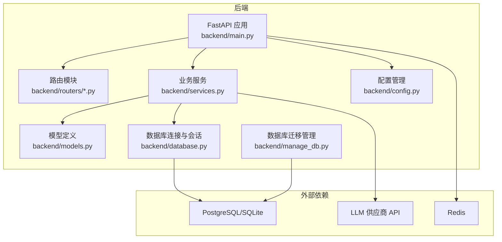
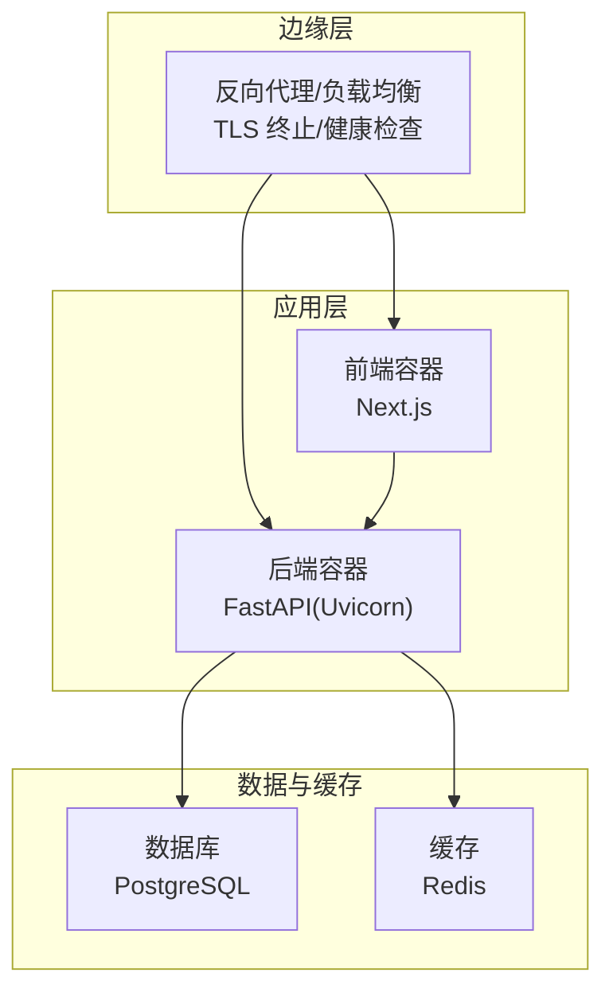
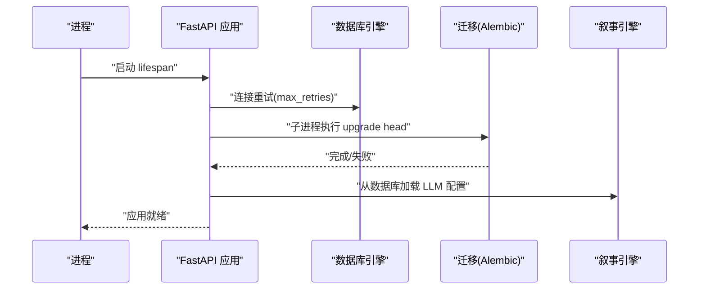
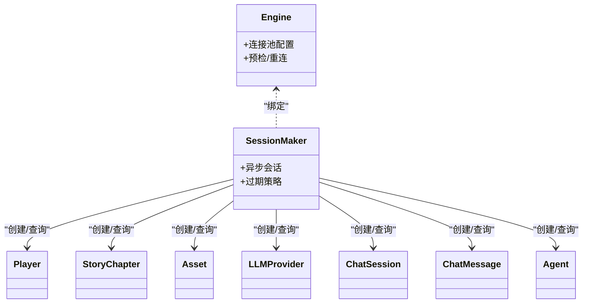
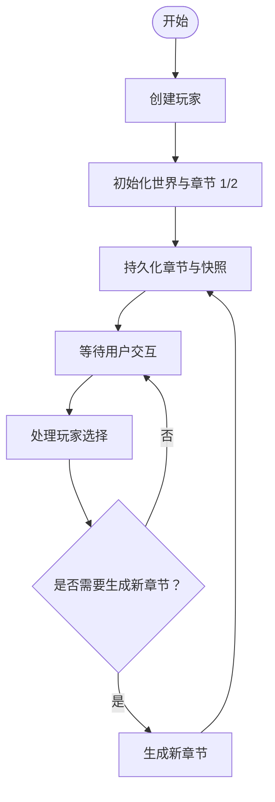
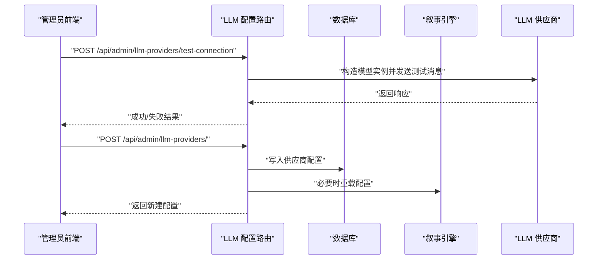
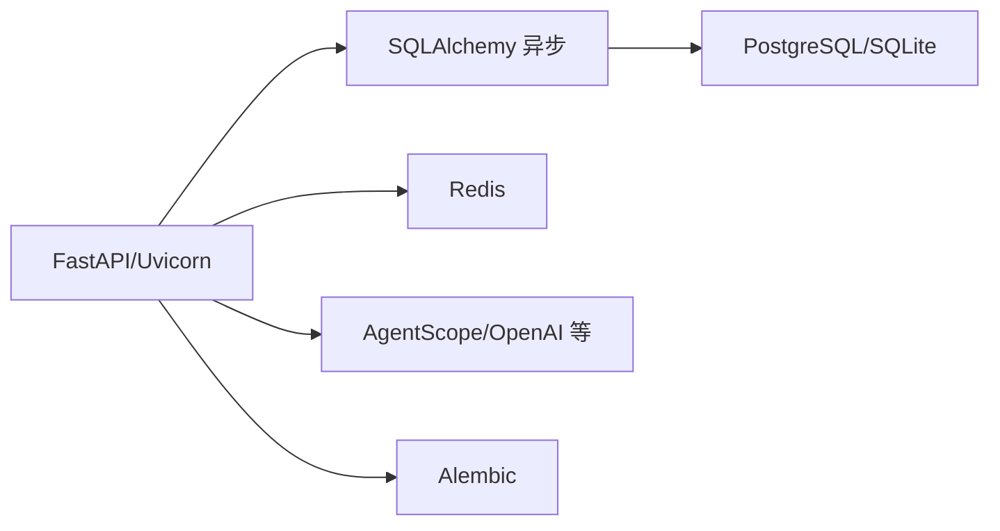

# 部署指南

<cite>
**本文引用的文件**
- [backend/main.py](file://backend/main.py)
- [backend/requirements.txt](file://backend/requirements.txt)
- [backend/config.py](file://backend/config.py)
- [backend/database.py](file://backend/database.py)
- [backend/.env.example](file://backend/.env.example)
- [backend/models.py](file://backend/models.py)
- [backend/services.py](file://backend/services.py)
- [backend/routers/llm_config.py](file://backend/routers/llm_config.py)
- [backend/routers/admin.py](file://backend/routers/admin.py)
- [backend/manage_db.py](file://backend/manage_db.py)
- [docs/wiki/Deployment.md](file://docs/wiki/Deployment.md)
- [docs/wiki/Backend-Guide.md](file://docs/wiki/Backend-Guide.md)
- [docs/wiki/Database-Migration.md](file://docs/wiki/Database-Migration.md)
</cite>

## 目录
1. [简介](#简介)
2. [项目结构](#项目结构)
3. [核心组件](#核心组件)
4. [架构总览](#架构总览)
5. [详细组件分析](#详细组件分析)
6. [依赖分析](#依赖分析)
7. [性能考虑](#性能考虑)
8. [故障排查指南](#故障排查指南)
9. [结论](#结论)
10. [附录](#附录)

## 简介
本指南面向生产环境部署，围绕后端服务（FastAPI + SQLAlchemy 异步 + AgentScope 智能体编排）给出从配置、容器化到 Kubernetes 编排的完整方案；涵盖性能优化、负载均衡、高可用、监控告警、日志管理、数据库备份恢复、数据迁移与版本升级、安全加固与访问控制、自动化部署与 CI/CD 流水线以及常见问题排查。

## 项目结构
后端采用 FastAPI + SQLAlchemy 异步 ORM + Alembic 迁移，结合 AgentScope 进行多智能体叙事编排。前端为 Next.js 应用，通过 WebSocket 与后端交互，提供故事流式渲染与交互体验。

图表来源
- [backend/main.py](file://backend/main.py#L1-L173)
- [backend/config.py](file://backend/config.py#L1-L34)
- [backend/database.py](file://backend/database.py#L1-L31)
- [backend/models.py](file://backend/models.py#L1-L122)
- [backend/services.py](file://backend/services.py#L1-L66)
- [backend/routers/llm_config.py](file://backend/routers/llm_config.py#L1-L203)
- [backend/routers/admin.py](file://backend/routers/admin.py#L1-L112)
- [backend/manage_db.py](file://backend/manage_db.py#L1-L67)

章节来源
- [docs/wiki/Backend-Guide.md](file://docs/wiki/Backend-Guide.md#L1-L108)

## 核心组件
- 应用入口与生命周期：负责启动时数据库连接重试、迁移执行、叙事引擎配置加载，并注册路由与中间件。
- 配置管理：集中管理数据库、缓存、AI 供应商密钥与模型参数。
- 数据库层：异步引擎、连接池、会话工厂与模型定义。
- 业务服务：玩家创建、世界初始化、章节生成与一致性校验。
- 路由层：管理员统计、玩家/剧情管理、LLM 供应商配置与连通性测试。
- 迁移管理：封装 Alembic 命令，支持生成、升级、回滚。

章节来源
- [backend/main.py](file://backend/main.py#L1-L173)
- [backend/config.py](file://backend/config.py#L1-L34)
- [backend/database.py](file://backend/database.py#L1-L31)
- [backend/models.py](file://backend/models.py#L1-L122)
- [backend/services.py](file://backend/services.py#L1-L66)
- [backend/routers/admin.py](file://backend/routers/admin.py#L1-L112)
- [backend/routers/llm_config.py](file://backend/routers/llm_config.py#L1-L203)
- [backend/manage_db.py](file://backend/manage_db.py#L1-L67)

## 架构总览
生产环境推荐“前端容器 + 后端容器 + 数据库 + 缓存 + LLM 供应商 API”四层架构，后端通过异步 I/O 与缓存提升并发能力，数据库采用 PostgreSQL 并启用连接池与预检；通过反向代理实现 TLS 终止与健康检查，Kubernetes 实现副本扩展与滚动升级。

图表来源
- [backend/main.py](file://backend/main.py#L83-L98)
- [backend/config.py](file://backend/config.py#L11-L29)
- [backend/database.py](file://backend/database.py#L8-L23)

## 详细组件分析

### 应用入口与生命周期（生产配置要点）
- 启动阶段：数据库连接重试、迁移执行（子进程调用 Alembic）、叙事引擎配置加载。
- CORS：生产环境建议限定允许源，避免通配。
- 日志：关闭 SQLAlchemy 与 Uvicorn 访问日志噪声，保留应用日志。
- WebSocket：生产环境需配合反向代理与长连接超时配置。

图表来源
- [backend/main.py](file://backend/main.py#L45-L81)

章节来源
- [backend/main.py](file://backend/main.py#L1-L173)

### 配置管理（生产环境）
- 数据库：优先 PostgreSQL（异步驱动），回退 SQLite 仅限开发。
- 缓存：Redis 用于会话、限流与消息队列。
- AI 供应商：OpenAI、DashScope、Anthropic、Gemini 等，支持自定义 base_url。
- 生成参数：模型选择、温度、上下文窗口等。

章节来源
- [backend/config.py](file://backend/config.py#L1-L34)
- [backend/.env.example](file://backend/.env.example#L1-L4)

### 数据库层（连接池与模型）
- 异步引擎：pool_pre_ping、连接池大小与溢出连接数。
- 会话工厂：expire_on_commit、异步会话。
- 模型：玩家、章节、资产、LLM 供应商、聊天会话与消息、智能体。

图表来源
- [backend/database.py](file://backend/database.py#L1-L31)
- [backend/models.py](file://backend/models.py#L1-L122)

章节来源
- [backend/database.py](file://backend/database.py#L1-L31)
- [backend/models.py](file://backend/models.py#L1-L122)

### 业务服务（世界初始化与章节生成）
- 创建玩家、初始化世界（章节 1 与预生成章节 2）、一致性校验与后续章节生成占位。

图表来源
- [backend/services.py](file://backend/services.py#L12-L59)

章节来源
- [backend/services.py](file://backend/services.py#L1-L66)

### 路由层（管理员与 LLM 配置）
- 管理员接口：统计、玩家与剧情列表、删除玩家。
- LLM 配置：CRUD、连通性测试、动态切换默认/激活供应商。

图表来源
- [backend/routers/llm_config.py](file://backend/routers/llm_config.py#L20-L111)
- [backend/routers/llm_config.py](file://backend/routers/llm_config.py#L112-L138)

章节来源
- [backend/routers/admin.py](file://backend/routers/admin.py#L1-L112)
- [backend/routers/llm_config.py](file://backend/routers/llm_config.py#L1-L203)

### 数据库迁移（生产策略）
- 使用 Alembic 管理版本，提供封装脚本统一命令入口。
- 生产环境建议在部署前显式执行 upgrade，避免“目标数据库未同步”。

章节来源
- [backend/manage_db.py](file://backend/manage_db.py#L1-L67)
- [docs/wiki/Database-Migration.md](file://docs/wiki/Database-Migration.md#L1-L85)

## 依赖分析
- 运行时依赖：FastAPI、Uvicorn、SQLAlchemy 异步、asyncpg/aiosqlite、Redis、websockets、AgentScope/OpenAI、Alembic、psycopg2-binary 等。
- 生产建议：将依赖锁定至具体版本，使用只读根文件系统与非 root 用户运行容器。

图表来源
- [backend/requirements.txt](file://backend/requirements.txt#L1-L20)

章节来源
- [backend/requirements.txt](file://backend/requirements.txt#L1-L20)

## 性能考虑
- 连接池与并发
  - 数据库：调整 pool_size 与 max_overflow，启用 pool_pre_ping；生产环境建议根据 QPS 与慢查询分析迭代。
  - 缓存：合理设置过期策略与淘汰算法，热点数据预热。
- 异步 I/O 与背压
  - WebSocket 与长轮询需配合反向代理超时与心跳；对突发流量启用限流与排队。
- 生成性能
  - LLM 调用批量化与并发上限控制；对长文本分片处理；缓存常用提示词与模板。
- 存储与索引
  - 为高频查询字段建立索引；定期分析与重建统计信息；冷热数据分离。
- 反向代理与网络
  - 启用 gzip/HTTP/2；合理设置 keep-alive 与超时；CDN 加速静态资源。

## 故障排查指南
- 启动失败
  - 数据库连接重试与迁移失败：检查 DATABASE_URL、网络连通性与权限；查看迁移日志。
  - CORS 配置错误：核对允许源列表，生产环境避免通配。
- WebSocket 断开
  - 检查反向代理超时、防火墙策略与后端日志；确认会话与心跳机制。
- LLM 连接异常
  - 使用连通性测试接口验证密钥、base_url 与网络；关注速率限制与模型可用性。
- 数据库迁移问题
  - “目标数据库未同步”：执行 upgrade；复杂变更检查 batch 渲染与手工修正。
- 性能瓶颈
  - 使用慢查询分析、连接池利用率与 Redis 命中率定位；逐步扩容与缓存优化。

章节来源
- [backend/main.py](file://backend/main.py#L45-L81)
- [backend/routers/llm_config.py](file://backend/routers/llm_config.py#L20-L111)
- [docs/wiki/Database-Migration.md](file://docs/wiki/Database-Migration.md#L71-L85)

## 结论
本指南提供了从配置、容器化到 Kubernetes 编排的生产级落地路径，强调异步 I/O、连接池、缓存与 LLM 供应商集成的性能优化，以及迁移、备份恢复、监控告警与安全加固的运维闭环。建议以渐进方式实施，先在预生产验证，再逐步推广至生产。

## 附录

### 生产环境配置清单
- 数据库
  - PostgreSQL（推荐）或 SQLite（开发回退）
  - 连接池参数：pool_size、max_overflow、pool_pre_ping
- 缓存
  - Redis（哨兵/集群视规模而定）
- AI 供应商
  - OpenAI、DashScope、Anthropic、Gemini；支持自定义 base_url
- 应用
  - FastAPI + Uvicorn；CORS 限定源；日志级别与格式
- 安全
  - TLS 终止、WAF、最小权限、密钥管理、审计日志

章节来源
- [backend/config.py](file://backend/config.py#L11-L29)
- [backend/database.py](file://backend/database.py#L8-L23)
- [backend/main.py](file://backend/main.py#L83-L98)

### Docker 容器化（建议）
- 基础镜像：官方 Python slim
- 工作目录：/app
- 依赖安装：pip 安装 requirements.txt
- 命令：uvicorn 运行 main:app
- 端口：8000
- 环境变量：DATABASE_URL、REDIS_URL、OPENAI_API_KEY 等
- 健康检查：GET /，反向代理探活

章节来源
- [backend/requirements.txt](file://backend/requirements.txt#L1-L20)
- [backend/main.py](file://backend/main.py#L171-L173)
- [backend/.env.example](file://backend/.env.example#L1-L4)

### Kubernetes 编排（建议）
- Deployment：副本数、滚动更新策略、资源请求/限制
- Service：ClusterIP/LoadBalancer
- ConfigMap：应用配置
- Secret：数据库、缓存、AI 供应商密钥
- HPA：CPU/自定义指标扩缩容
- Ingress：TLS 终止、路径路由、健康检查

### 监控告警与日志
- 指标：QPS、P95/P99 延迟、连接池利用率、Redis 命中率、LLM 调用耗时与错误率
- 日志：结构化输出、按级别分流、脱敏敏感字段
- 告警：阈值与趋势告警、SLI/SLO 对齐

### 数据库备份恢复与版本升级
- 备份：逻辑导出（pg_dump/备份工具）+ 定时快照
- 恢复：灰度验证、回滚策略（downgrade）
- 升级：部署前 upgrade，灰度发布，回滚预案

章节来源
- [docs/wiki/Database-Migration.md](file://docs/wiki/Database-Migration.md#L43-L61)

### 安全加固与访问控制
- 网络：防火墙规则、仅开放必要端口；内网隔离
- 访问控制：最小权限账号、只读数据库账号、只写缓存账号
- 密钥：Secret 管理、轮换策略、审计
- API：速率限制、输入校验、CORS 白名单

### 自动化部署与 CI/CD
- 流水线：代码提交 → 单元测试 → 构建镜像 → 安全扫描 → 发布制品 → 部署到预生产 → 自动化验收 → 发布到生产
- 发布：蓝绿/金丝雀，带回滚；变更评审与发布窗口

### 常见部署问题与解决方案
- 数据库迁移失败：检查 Alembic 版本与生成脚本，必要时手工修正
- WebSocket 不稳定：检查反向代理超时、心跳与后端日志
- LLM 调用超时：限流、重试与降级策略
- 配置泄露：使用 Secret 管理，避免硬编码

章节来源
- [docs/wiki/Deployment.md](file://docs/wiki/Deployment.md#L60-L65)
- [docs/wiki/Database-Migration.md](file://docs/wiki/Database-Migration.md#L71-L85)