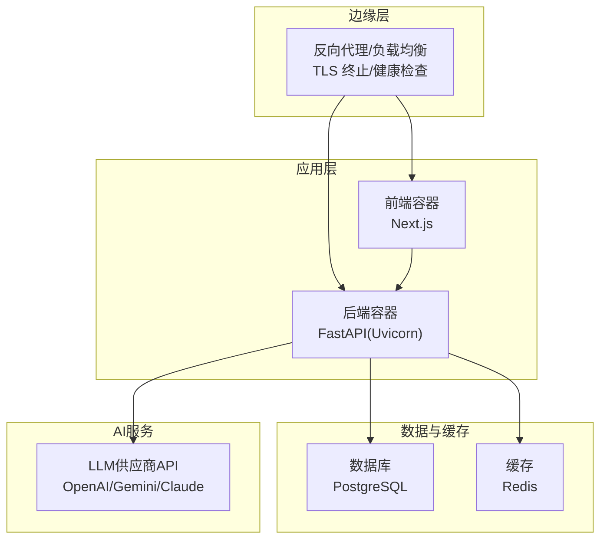
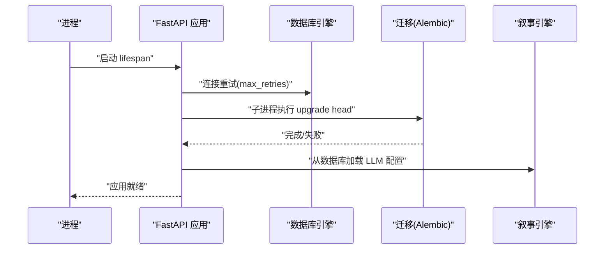
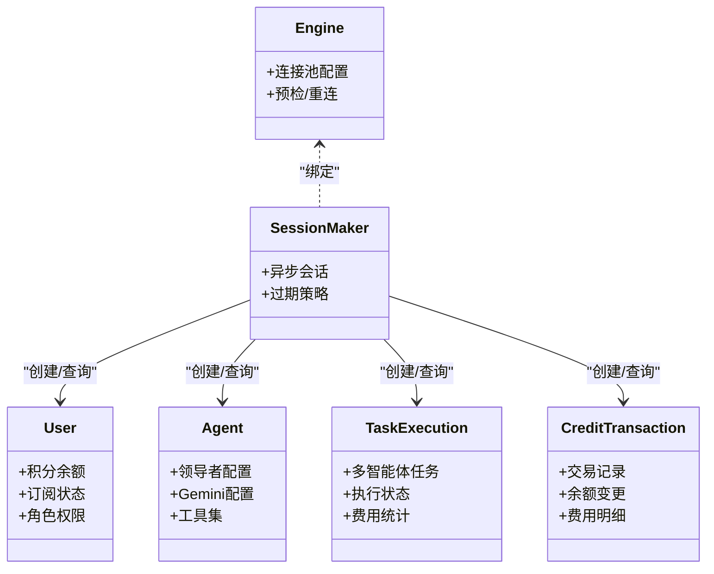
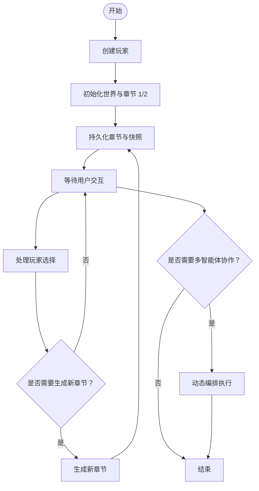
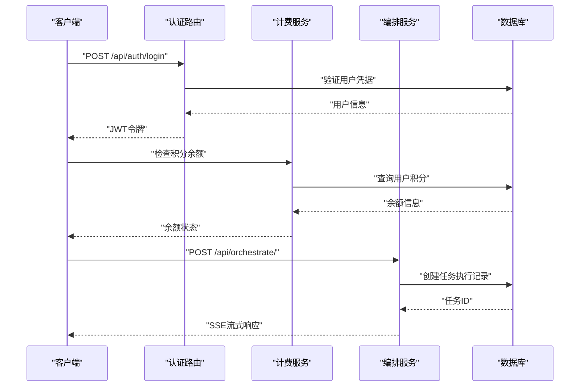
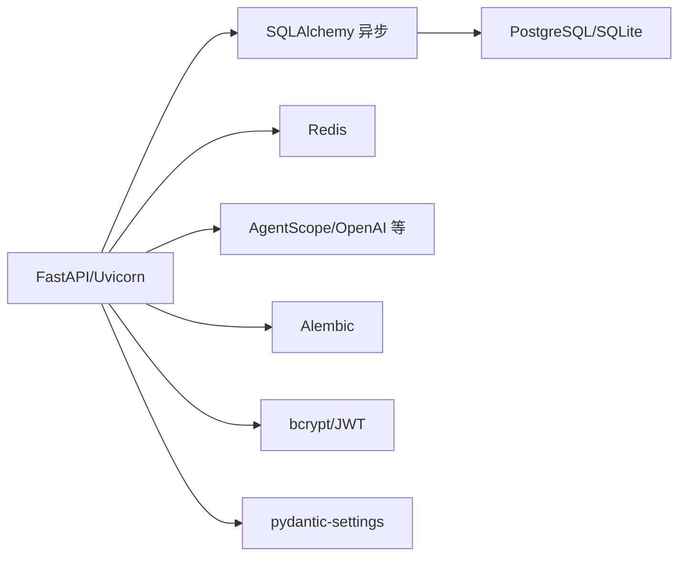

# 部署指南

<cite>
**本文档引用的文件**
- [backend/main.py](file://backend/main.py)
- [backend/requirements.txt](file://backend/requirements.txt)
- [backend/config.py](file://backend/config.py)
- [backend/database.py](file://backend/database.py)
- [backend/.env.example](file://backend/.env.example)
- [backend/models.py](file://backend/models.py)
- [backend/auth.py](file://backend/auth.py)
- [backend/services/billing.py](file://backend/services/billing.py)
- [backend/services/orchestrator.py](file://backend/services/orchestrator.py)
- [backend/routers/auth.py](file://backend/routers/auth.py)
- [backend/routers/admin_auth.py](file://backend/routers/admin_auth.py)
- [backend/routers/orchestrate.py](file://backend/routers/orchestrate.py)
- [backend/routers/subscriptions.py](file://backend/routers/subscriptions.py)
- [backend/migrations/versions/c74e516c6d87_add_credit_billing_system.py](file://backend/migrations/versions/c74e516c6d87_add_credit_billing_system.py)
- [backend/migrations/versions/d8e9f0a1b2c3_add_multi_agent_collaboration.py](file://backend/migrations/versions/d8e9f0a1b2c3_add_multi_agent_collaboration.py)
- [backend/migrations/versions/e1f2a3b4c5d6_add_gemini_config.py](file://backend/migrations/versions/e1f2a3b4c5d6_add_gemini_config.py)
</cite>

## 更新摘要
**所做更改**
- 新增认证系统部署章节，包含用户认证和管理员认证的完整配置
- 新增计费系统部署章节，涵盖积分余额、交易记录和费率配置
- 新增多智能体协作部署章节，包含领导者配置和任务编排
- 新增Gemini集成部署章节，包含3.1配置和媒体生成功能
- 更新数据库迁移策略，新增三个关键迁移版本
- 扩展Kubernetes编排建议，包含新的Pod配置和资源限制
- 增强监控告警系统，新增计费和协作相关的指标

## 目录
1. [简介](#简介)
2. [项目结构](#项目结构)
3. [核心组件](#核心组件)
4. [架构总览](#架构总览)
5. [详细组件分析](#详细组件分析)
6. [认证系统部署](#认证系统部署)
7. [计费系统部署](#计费系统部署)
8. [多智能体协作部署](#多智能体协作部署)
9. [Gemini集成部署](#gemini集成部署)
10. [数据库迁移策略](#数据库迁移策略)
11. [依赖分析](#依赖分析)
12. [性能考虑](#性能考虑)
13. [故障排查指南](#故障排查指南)
14. [结论](#结论)
15. [附录](#附录)

## 简介
本指南面向生产环境部署，围绕后端服务（FastAPI + SQLAlchemy 异步 + AgentScope 智能体编排）给出从配置、容器化到 Kubernetes 编排的完整方案。本次更新重点涵盖新的认证系统、计费系统、多智能体协作和Gemini集成等核心功能的部署要求和配置。

## 项目结构
后端采用 FastAPI + SQLAlchemy 异步 ORM + Alembic 迁移，结合 AgentScope 进行多智能体叙事编排。前端为 Next.js 应用，通过 WebSocket 与后端交互，提供故事流式渲染与交互体验。新增的认证、计费、协作和Gemini功能通过专门的路由和服务模块实现。

```mermaid
graph TB
subgraph "认证系统"
A1["用户认证<br/>/api/auth/*"]
A2["管理员认证<br/>/api/admin/auth/*"]
A3["JWT令牌管理"]
A4["密码哈希与验证"]
end
subgraph "计费系统"
B1["积分余额管理<br/>users.credits"]
B2["交易记录<br/>credit_transactions"]
B3["费率计算<br/>calculate_credit_cost"]
B4["余额检查<br/>check_balance_sufficient"]
end
subgraph "多智能体协作"
C1["领导者配置<br/>agents.is_leader"]
C2["任务编排<br/>DynamicOrchestrator"]
C3["策略执行<br/>Pipeline/Plan/Discussion"]
C4["子任务管理<br/>task_executions/subtasks"]
end
subgraph "Gemini集成"
D1["3.1配置<br/>gemini_config"]
D2["媒体生成<br/>image_config"]
D3["搜索功能<br/>google_search_enabled"]
D4["思维级别<br/>thinking_level"]
end
subgraph "核心服务"
E1["FastAPI应用<br/>backend/main.py"]
E2["配置管理<br/>backend/config.py"]
E3["数据库连接<br/>backend/database.py"]
E4["业务服务<br/>backend/services/*.py"]
end
A1 --> E4
A2 --> E4
B1 --> E4
B2 --> E4
C1 --> E4
C2 --> E4
D1 --> E4
D2 --> E4
E1 --> E4
```

**图表来源**
- [backend/auth.py](file://backend/auth.py#L1-L229)
- [backend/services/billing.py](file://backend/services/billing.py#L1-L270)
- [backend/services/orchestrator.py](file://backend/services/orchestrator.py#L1-L889)
- [backend/models.py](file://backend/models.py#L167-L304)

## 核心组件
- **应用入口与生命周期**：负责启动时数据库连接重试、迁移执行、叙事引擎配置加载，并注册路由与中间件。
- **认证管理**：支持用户和管理员双认证体系，JWT令牌管理，密码哈希验证。
- **计费管理**：积分余额管理，交易记录追踪，多维度费率计算。
- **多智能体协作**：领导者配置，任务分解，多种协作策略。
- **Gemini集成**：3.1配置支持，媒体生成，搜索功能集成。
- **配置管理**：集中管理数据库、缓存、AI供应商密钥与模型参数。
- **数据库层**：异步引擎、连接池、会话工厂与模型定义。
- **业务服务**：玩家创建、世界初始化、章节生成与一致性校验。
- **路由层**：管理员统计、玩家/剧情管理、LLM供应商配置与连通性测试。
- **迁移管理**：封装 Alembic 命令，支持生成、升级、回滚。

**章节来源**
- [backend/main.py](file://backend/main.py#L1-L173)
- [backend/config.py](file://backend/config.py#L1-L40)
- [backend/database.py](file://backend/database.py#L1-L31)
- [backend/models.py](file://backend/models.py#L1-L304)
- [backend/auth.py](file://backend/auth.py#L1-L229)
- [backend/services/billing.py](file://backend/services/billing.py#L1-L270)
- [backend/services/orchestrator.py](file://backend/services/orchestrator.py#L1-L889)

## 架构总览
生产环境推荐"前端容器 + 后端容器 + 数据库 + 缓存 + LLM 供应商 API"四层架构，后端通过异步 I/O 与缓存提升并发能力，数据库采用 PostgreSQL 并启用连接池与预检；通过反向代理实现 TLS 终止与健康检查，Kubernetes 实现副本扩展与滚动升级。

**图表来源**
- [backend/main.py](file://backend/main.py#L83-L98)
- [backend/config.py](file://backend/config.py#L11-L35)
- [backend/database.py](file://backend/database.py#L8-L23)

## 详细组件分析

### 应用入口与生命周期（生产配置要点）
- 启动阶段：数据库连接重试、迁移执行（子进程调用 Alembic）、叙事引擎配置加载。
- CORS：生产环境建议限定允许源，避免通配。
- 日志：关闭 SQLAlchemy 与 Uvicorn 访问日志噪声，保留应用日志。
- WebSocket：生产环境需配合反向代理与长连接超时配置。

**图表来源**
- [backend/main.py](file://backend/main.py#L45-L81)

**章节来源**
- [backend/main.py](file://backend/main.py#L1-L173)

### 配置管理（生产环境）
- 数据库：优先 PostgreSQL（异步驱动），回退 SQLite 仅限开发。
- 缓存：Redis 用于会话、限流与消息队列。
- AI 供应商：OpenAI、DashScope、Anthropic、Gemini 等，支持自定义 base_url。
- 生成参数：模型选择、温度、上下文窗口等。
- **新增**：JWT密钥、API密钥管理、认证配置。

**章节来源**
- [backend/config.py](file://backend/config.py#L1-L40)
- [backend/.env.example](file://backend/.env.example#L1-L4)

### 数据库层（连接池与模型）
- 异步引擎：pool_pre_ping、连接池大小与溢出连接数。
- 会话工厂：expire_on_commit、异步会话。
- 模型：玩家、章节、资产、LLM供应商、聊天会话与消息、智能体、任务执行、子任务、订阅计划、管理员等。

**图表来源**
- [backend/database.py](file://backend/database.py#L1-L31)
- [backend/models.py](file://backend/models.py#L1-L304)

**章节来源**
- [backend/database.py](file://backend/database.py#L1-L31)
- [backend/models.py](file://backend/models.py#L1-L304)

### 业务服务（世界初始化与章节生成）
- 创建玩家、初始化世界（章节 1 与预生成章节 2）、一致性校验与后续章节生成占位。
- **新增**：多智能体任务执行，领导者自动审查，子任务分解与执行。

**图表来源**
- [backend/services/orchestrator.py](file://backend/services/orchestrator.py#L560-L671)

**章节来源**
- [backend/services/orchestrator.py](file://backend/services/orchestrator.py#L1-L889)

### 路由层（管理员与 LLM 配置）
- 管理员接口：统计、玩家与剧情列表、删除玩家。
- LLM 配置：CRUD、连通性测试、动态切换默认/激活供应商。
- **新增**：认证路由（用户注册、登录、刷新）、管理员认证路由、多智能体编排路由、订阅管理路由。

**图表来源**
- [backend/routers/auth.py](file://backend/routers/auth.py#L63-L99)
- [backend/routers/orchestrate.py](file://backend/routers/orchestrate.py#L26-L70)

**章节来源**
- [backend/routers/auth.py](file://backend/routers/auth.py#L1-L136)
- [backend/routers/admin_auth.py](file://backend/routers/admin_auth.py#L1-L119)
- [backend/routers/orchestrate.py](file://backend/routers/orchestrate.py#L1-L183)
- [backend/routers/subscriptions.py](file://backend/routers/subscriptions.py#L1-L119)

## 认证系统部署

### 用户认证系统
用户认证系统基于JWT实现，支持密码哈希验证和会话管理。

**核心功能**：
- 用户注册：邮箱唯一性检查，密码哈希存储
- 用户登录：凭据验证，JWT令牌发放
- 令牌刷新：刷新令牌机制
- 会话管理：活动状态检查

**部署配置要点**：
- JWT密钥管理：使用强随机密钥，定期轮换
- 密码策略：bcrypt哈希，配置合适的轮数
- 令牌有效期：访问令牌短有效期，刷新令牌长有效期
- 安全头：HTTPS强制，SameSite策略

**章节来源**
- [backend/auth.py](file://backend/auth.py#L19-L75)
- [backend/routers/auth.py](file://backend/routers/auth.py#L36-L99)

### 管理员认证系统
管理员认证系统独立于用户认证，提供完整的后台管理功能。

**核心功能**：
- 管理员登录：独立的管理员表，权限分级
- 权限控制：超级管理员与普通管理员
- 操作审计：登录时间与IP记录
- 安全验证：活动状态检查

**部署配置要点**：
- 独立管理员表：与用户表分离
- 权限层级：super_admin与admin级别
- 登录审计：详细的登录日志
- API保护：管理员路由的严格权限控制

**章节来源**
- [backend/auth.py](file://backend/auth.py#L119-L156)
- [backend/routers/admin_auth.py](file://backend/routers/admin_auth.py#L33-L73)

## 计费系统部署

### 积分余额管理
计费系统基于积分模型，支持多种维度的费用计算。

**核心功能**：
- 积分余额：用户账户积分管理
- 多维度计费：输入token、文本输出、图像输出、搜索查询
- 交易记录：详细的费用明细追踪
- 余额检查：并发安全的余额验证

**计费维度**：
- 输入token：按1M计算费用
- 文本输出：按1M计算费用  
- 图像输出：按1M计算费用
- 搜索查询：每次查询固定费用

**部署配置要点**：
- 费率配置：每个智能体独立的费率设置
- 余额冻结：资金冻结状态管理
- 交易审计：完整的交易记录保存
- 并发控制：原子性的余额扣减操作

**章节来源**
- [backend/services/billing.py](file://backend/services/billing.py#L13-L64)
- [backend/models.py](file://backend/models.py#L187-L232)

### 交易记录系统
详细的交易记录系统追踪所有积分变动。

**核心功能**：
- 交易类型：扣费、充值、管理员调整
- 余额追踪：扣费前后余额记录
- 费用明细：token使用量统计
- 元数据保存：费率快照等扩展信息

**部署配置要点**：
- 交易索引：按用户ID和时间排序
- 元数据结构：JSON格式存储扩展信息
- 审计日志：完整的操作记录
- 数据完整性：外键约束保证数据一致性

**章节来源**
- [backend/models.py](file://backend/models.py#L213-L232)
- [backend/services/billing.py](file://backend/services/billing.py#L129-L228)

## 多智能体协作部署

### 领导者配置
多智能体协作系统的核心是领导者配置。

**核心功能**：
- 领导者角色：标记智能体为领导者
- 成员管理：配置可协调的成员智能体
- 协作模式：管道、计划、讨论三种模式
- 自动审查：可选的自动审查功能

**部署配置要点**：
- 成员ID验证：确保成员智能体存在且有效
- 模式配置：支持多种协作策略
- 任务限制：最大子任务数量控制
- 权限分离：领导者不能包含在成员列表中

**章节来源**
- [backend/models.py](file://backend/models.py#L193-L198)
- [backend/services/orchestrator.py](file://backend/services/orchestrator.py#L672-L694)

### 任务编排系统
动态任务编排系统支持复杂的多智能体协作。

**核心功能**：
- 动态分解：领导者分析任务并分解
- 策略执行：管道、计划、讨论三种策略
- 流式执行：实时进度反馈
- 自动审查：最终结果审查

**策略类型**：
- 管道策略：顺序或并行执行
- 计划策略：依赖关系的任务执行
- 讨论策略：多轮讨论达成共识

**部署配置要点**：
- 策略注册：动态策略注册机制
- 事件流：Server-Sent Events实时通信
- 错误处理：子任务失败重试机制
- 资源控制：最大迭代次数限制

**章节来源**
- [backend/services/orchestrator.py](file://backend/services/orchestrator.py#L25-L76)
- [backend/services/orchestrator.py](file://backend/services/orchestrator.py#L560-L671)

### 任务执行记录
完整的任务执行记录系统追踪所有协作过程。

**核心功能**：
- 任务执行：主任务执行记录
- 子任务管理：详细的子任务追踪
- 费用统计：累计token使用和费用
- 状态管理：执行状态跟踪

**数据结构**：
- 任务执行表：主任务信息和统计
- 子任务表：详细执行过程
- 关系约束：外键保证数据完整性

**部署配置要点**：
- 索引优化：按用户ID和状态索引
- 时间戳：创建和完成时间记录
- 元数据：执行过程中的扩展信息
- 状态机：严格的执行状态转换

**章节来源**
- [backend/models.py](file://backend/models.py#L235-L282)
- [backend/services/orchestrator.py](file://backend/services/orchestrator.py#L110-L127)

## Gemini集成部署

### Gemini 3.1配置
Gemini 3.1集成提供高级AI功能支持。

**核心功能**：
- 思维级别：high、medium、low、minimal四个级别
- 媒体分辨率：超高清、高清、中等、低清
- 图像生成：可选的图像生成功能
- 搜索集成：Google搜索和图片搜索

**配置选项**：
- 思维级别：影响推理深度和准确性
- 媒体分辨率：控制输出质量
- 图像配置：批量生成、参考图片数量
- 搜索功能：开启网络搜索能力

**部署配置要点**：
- API密钥管理：Gemini专用API密钥
- 配置迁移：从旧的thinking_mode迁移
- 功能开关：按需启用特定功能
- 资源限制：防止过度使用

**章节来源**
- [backend/models.py](file://backend/models.py#L200-L210)
- [backend/admin/src/types/index.ts](file://backend/admin/src/types/index.ts#L1-L21)
- [backend/admin/src/components/admin/agents/AgentForm/schema.ts](file://backend/admin/src/components/admin/agents/AgentForm/schema.ts#L1-L20)

### 媒体生成配置
详细的媒体生成配置支持高质量内容创作。

**核心配置**：
- 宽高比：16:9、4:3、1:1、3:4、9:16
- 图像尺寸：4K、2K、1024、512、auto
- 输出格式：PNG、JPEG、WebP
- 批量数量：1-8张图像批量生成

**限制设置**：
- 角色参考：最多4张人物参考图
- 高保真对象：最多10张对象参考图
- 费用控制：批量生成的额外费用

**部署配置要点**：
- 存储空间：足够的图像存储空间
- 处理能力：GPU加速的图像处理
- 费用计算：精确的图像生成计费
- 质量控制：输出格式和分辨率优化

**章节来源**
- [backend/admin/src/components/admin/agents/AgentForm/schema.ts](file://backend/admin/src/components/admin/agents/AgentForm/schema.ts#L4-L11)
- [backend/admin/src/components/admin/agents/AgentForm/Parameters.tsx](file://backend/admin/src/components/admin/agents/AgentForm/Parameters.tsx#L171-L199)

## 数据库迁移策略

### 迁移版本概览
系统包含三个关键的数据库迁移版本，支持新功能的部署。

**迁移版本**：
- `c74e516c6d87_add_credit_billing_system.py`：计费系统基础
- `d8e9f0a1b2c3_add_multi_agent_collaboration.py`：多智能体协作
- `e1f2a3b4c5d6_add_gemini_config.py`：Gemini集成

**章节来源**
- [backend/migrations/versions/c74e516c6d87_add_credit_billing_system.py](file://backend/migrations/versions/c74e516c6d87_add_credit_billing_system.py#L1-L67)
- [backend/migrations/versions/d8e9f0a1b2c3_add_multi_agent_collaboration.py](file://backend/migrations/versions/d8e9f0a1b2c3_add_multi_agent_collaboration.py#L1-L104)
- [backend/migrations/versions/e1f2a3b4c5d6_add_gemini_config.py](file://backend/migrations/versions/e1f2a3b4c5d6_add_gemini_config.py#L1-L41)

### 计费系统迁移
计费系统迁移创建了完整的积分和交易基础设施。

**迁移内容**：
- 创建credit_transactions表
- 添加agents表的费率字段
- 添加users表的积分余额字段
- 建立外键约束关系

**数据迁移**：
- 初始化用户积分余额为0
- 设置默认费率配置
- 建立必要的索引优化

**章节来源**
- [backend/migrations/versions/c74e516c6d87_add_credit_billing_system.py](file://backend/migrations/versions/c74e516c6d87_add_credit_billing_system.py#L21-L53)

### 多智能体协作迁移
多智能体协作迁移建立了完整的任务编排基础设施。

**迁移内容**：
- 添加agents表的领导者配置字段
- 创建task_executions表
- 创建subtasks表
- 建立完整的外键关系

**功能支持**：
- 领导者智能体配置
- 任务执行记录
- 子任务管理
- 执行状态追踪

**章节来源**
- [backend/migrations/versions/d8e9f0a1b2c3_add_multi_agent_collaboration.py](file://backend/migrations/versions/d8e9f0a1b2c3_add_multi_agent_collaboration.py#L21-L82)

### Gemini集成迁移
Gemini集成迁移添加了3.1配置支持。

**迁移内容**：
- 添加agents表的gemini_config字段
- 数据迁移：从thinking_mode迁移到thinking_level
- JSON配置存储支持

**数据迁移**：
- 将thinking_mode=True的记录迁移到thinking_level="high"
- 保持向后兼容性
- 渐进式配置更新

**章节来源**
- [backend/migrations/versions/e1f2a3b4c5d6_add_gemini_config.py](file://backend/migrations/versions/e1f2a3b4c5d6_add_gemini_config.py#L21-L35)

## 依赖分析
- 运行时依赖：FastAPI、Uvicorn、SQLAlchemy 异步、asyncpg/aiosqlite、Redis、websockets、AgentScope/OpenAI、Alembic、psycopg2-binary 等。
- **新增**：bcrypt密码哈希、python-jose JWT处理、pydantic-settings配置管理。
- 生产建议：将依赖锁定至具体版本，使用只读根文件系统与非root用户运行容器。

**图表来源**
- [backend/requirements.txt](file://backend/requirements.txt#L1-L20)
- [backend/auth.py](file://backend/auth.py#L4-L7)

**章节来源**
- [backend/requirements.txt](file://backend/requirements.txt#L1-L20)

## 性能考虑
- **连接池与并发**
  - 数据库：调整 pool_size 与 max_overflow，启用 pool_pre_ping；生产环境建议根据 QPS 与慢查询分析迭代。
  - 缓存：合理设置过期策略与淘汰算法，热点数据预热。
- **异步 I/O 与背压**
  - WebSocket 与长轮询需配合反向代理超时与心跳；对突发流量启用限流与排队。
  - **新增**：多智能体协作的流式处理需要优化SSE传输。
- **生成性能**
  - LLM 调用批量化与并发上限控制；对长文本分片处理；缓存常用提示词与模板。
  - **新增**：Gemini 3.1的媒体生成需要GPU加速和存储优化。
- **存储与索引**
  - 为高频查询字段建立索引；定期分析与重建统计信息；冷热数据分离。
  - **新增**：计费交易记录的索引优化。
- **反向代理与网络**
  - 启用 gzip/HTTP/2；合理设置 keep-alive 与超时；CDN 加速静态资源。
  - **新增**：SSE流式传输的特殊配置。

## 故障排查指南
- **启动失败**
  - 数据库连接重试与迁移失败：检查 DATABASE_URL、网络连通性与权限；查看迁移日志。
  - CORS 配置错误：核对允许源列表，生产环境避免通配。
  - **新增**：JWT密钥配置错误，认证路由无法正常工作。
- **WebSocket 断开**
  - 检查反向代理超时、防火墙策略与后端日志；确认会话与心跳机制。
  - **新增**：SSE流式传输问题，检查缓冲区配置。
- **LLM 连接异常**
  - 使用连通性测试接口验证密钥、base_url 与网络；关注速率限制与模型可用性。
  - **新增**：Gemini API密钥验证，媒体生成功能测试。
- **数据库迁移问题**
  - "目标数据库未同步"：执行 upgrade；复杂变更检查 batch 渲染与手工修正。
  - **新增**：计费系统迁移失败，检查费率字段和交易记录表。
- **性能瓶颈**
  - 使用慢查询分析、连接池利用率与 Redis 命中率定位；逐步扩容与缓存优化。
  - **新增**：多智能体协作的内存使用监控，Gemini集成的GPU资源监控。
- **认证问题**
  - JWT令牌验证失败：检查密钥配置和算法设置。
  - 用户登录失败：验证密码哈希和账户状态。
  - **新增**：管理员权限验证，会话管理问题。
- **计费问题**
  - 余额不足：检查用户积分和冻结状态。
  - 交易记录异常：验证外键约束和数据完整性。
  - **新增**：多维度计费计算错误，费率配置问题。
- **协作问题**
  - 领导者配置错误：检查成员ID和协作模式。
  - 任务执行失败：验证子任务状态和错误信息。
  - **新增**：SSE事件流异常，流式传输中断。

**章节来源**
- [backend/main.py](file://backend/main.py#L45-L81)
- [backend/auth.py](file://backend/auth.py#L65-L75)
- [backend/services/billing.py](file://backend/services/billing.py#L164-L200)
- [backend/services/orchestrator.py](file://backend/services/orchestrator.py#L658-L671)

## 结论
本指南提供了从配置、容器化到 Kubernetes 编排的生产级落地路径，强调异步 I/O、连接池、缓存与 LLM 供应商集成的性能优化，以及迁移、备份恢复、监控告警与安全加固的运维闭环。新增的认证系统、计费系统、多智能体协作和Gemini集成功能通过专门的模块和路由实现，需要特别关注其部署配置和监控策略。建议以渐进方式实施，先在预生产验证，再逐步推广至生产。

## 附录

### 生产环境配置清单
- **数据库**
  - PostgreSQL（推荐）或 SQLite（开发回退）
  - 连接池参数：pool_size、max_overflow、pool_pre_ping
- **缓存**
  - Redis（哨兵/集群视规模而定）
- **AI 供应商**
  - OpenAI、DashScope、Anthropic、Gemini；支持自定义 base_url
  - **新增**：Gemini API密钥管理
- **认证系统**
  - JWT密钥配置，bcrypt轮数设置
  - **新增**：管理员独立认证系统
- **计费系统**
  - 积分余额配置，费率设置
  - **新增**：交易记录审计
- **多智能体协作**
  - 领导者配置，协作策略
  - **新增**：任务执行监控
- **应用**
  - FastAPI + Uvicorn；CORS 限定源；日志级别与格式
- **安全**
  - TLS 终止、WAF、最小权限、密钥管理、审计日志

**章节来源**
- [backend/config.py](file://backend/config.py#L11-L35)
- [backend/database.py](file://backend/database.py#L8-L23)
- [backend/auth.py](file://backend/auth.py#L26-L30)

### Docker 容器化（建议）
- **基础镜像**：官方 Python slim
- **工作目录**：/app
- **依赖安装**：pip 安装 requirements.txt
- **命令**：uvicorn 运行 main:app
- **端口**：8000
- **环境变量**：DATABASE_URL、REDIS_URL、OPENAI_API_KEY、GEMINI_API_KEY 等
- **健康检查**：GET /，反向代理探活
- **新增**：JWT密钥环境变量，Gemini API密钥

**章节来源**
- [backend/requirements.txt](file://backend/requirements.txt#L1-L20)
- [backend/main.py](file://backend/main.py#L171-L173)
- [backend/.env.example](file://backend/.env.example#L1-L4)

### Kubernetes 编排（建议）
- **Deployment**：副本数、滚动更新策略、资源请求/限制
- **Service**：ClusterIP/LoadBalancer
- **ConfigMap**：应用配置，JWT密钥，Gemini配置
- **Secret**：数据库、缓存、AI 供应商密钥
- **HPA**：CPU/自定义指标扩缩容
- **Ingress**：TLS 终止、路径路由、健康检查
- **新增**：多智能体协作的资源限制，Gemini集成的GPU调度

### 监控告警与日志
- **指标**：QPS、P95/P99 延迟、连接池利用率、Redis 命中率、LLM 调用耗时与错误率
- **新增**：计费系统指标（余额变化、交易量、费率使用）
- **新增**：多智能体协作指标（任务执行时间、子任务成功率、领导者效率）
- **新增**：Gemini集成指标（API调用次数、媒体生成数量、思维级别分布）
- **日志**：结构化输出、按级别分流、脱敏敏感字段
- **告警**：阈值与趋势告警、SLI/SLO 对齐

### 数据库备份恢复与版本升级
- **备份**：逻辑导出（pg_dump/备份工具）+ 定时快照
- **恢复**：灰度验证、回滚策略（downgrade）
- **升级**：部署前 upgrade，灰度发布，回滚预案
- **新增**：计费系统数据备份，多智能体协作历史数据迁移

**章节来源**
- [backend/migrations/versions/c74e516c6d87_add_credit_billing_system.py](file://backend/migrations/versions/c74e516c6d87_add_credit_billing_system.py#L55-L67)
- [backend/migrations/versions/d8e9f0a1b2c3_add_multi_agent_collaboration.py](file://backend/migrations/versions/d8e9f0a1b2c3_add_multi_agent_collaboration.py#L84-L104)

### 安全加固与访问控制
- **网络**：防火墙规则、仅开放必要端口；内网隔离
- **访问控制**：最小权限账号、只读数据库账号、只写缓存账号
- **密钥**：Secret 管理、轮换策略、审计
- **API**：速率限制、输入校验、CORS 白名单
- **新增**：JWT密钥安全存储，管理员权限分离，计费数据加密

### 自动化部署与 CI/CD
- **流水线**：代码提交 → 单元测试 → 构建镜像 → 安全扫描 → 发布制品 → 部署到预生产 → 自动化验收 → 发布到生产
- **发布**：蓝绿/金丝雀，带回滚；变更评审与发布窗口
- **新增**：数据库迁移自动化，配置文件验证，API文档生成

### 常见部署问题与解决方案
- **数据库迁移失败**：检查 Alembic 版本与生成脚本，必要时手工修正
- **WebSocket 不稳定**：检查反向代理超时、心跳与后端日志
- **LLM 调用超时**：限流、重试与降级策略
- **配置泄露**：使用 Secret 管理，避免硬编码
- **新增**：认证系统部署问题，计费系统配置错误，多智能体协作失败，Gemini集成API错误

**章节来源**
- [backend/auth.py](file://backend/auth.py#L65-L75)
- [backend/services/billing.py](file://backend/services/billing.py#L164-L200)
- [backend/services/orchestrator.py](file://backend/services/orchestrator.py#L658-L671)
- [backend/migrations/versions/e1f2a3b4c5d6_add_gemini_config.py](file://backend/migrations/versions/e1f2a3b4c5d6_add_gemini_config.py#L28-L35)