# 项目概述

<cite>
**本文档引用的文件**
- [README.md](file://README.md)
- [backend/main.py](file://backend/main.py)
- [backend/config.py](file://backend/config.py)
- [backend/models.py](file://backend/models.py)
- [backend/routers/theaters.py](file://backend/routers/theaters.py)
- [backend/services/orchestrator.py](file://backend/services/orchestrator.py)
- [backend/agents.py](file://backend/agents.py)
- [backend/services/video_generation.py](file://backend/services/video_generation.py)
- [backend/services/image_gen_tools.py](file://backend/services/image_gen_tools.py)
- [backend/schemas.py](file://backend/schemas.py)
- [frontend/src/app/layout.tsx](file://frontend/src/app/layout.tsx)
- [frontend/package.json](file://frontend/package.json)
- [backend/requirements.txt](file://backend/requirements.txt)
- [frontend/src/components/TheaterCanvas.tsx](file://frontend/src/components/TheaterCanvas.tsx)
</cite>

## 目录
1. [引言](#引言)
2. [项目结构](#项目结构)
3. [核心组件](#核心组件)
4. [架构总览](#架构总览)
5. [详细组件分析](#详细组件分析)
6. [依赖关系分析](#依赖关系分析)
7. [性能考虑](#性能考虑)
8. [故障排除指南](#故障排除指南)
9. [结论](#结论)
10. [附录](#附录)

## 引言

Infinite Game（无限游戏）是一个AI驱动的创意协作平台，专注于多智能体叙事创作、可视化故事板编辑和实时媒体生成。该项目基于AgentScope多智能体框架构建，结合FastAPI后端与Next.js前端，为创作者、开发者和企业提供强大的AI辅助创作工具。

### 核心目标

- **AI驱动的创意协作**：通过多智能体系统实现智能化的内容创作和协作
- **可视化故事板编辑**：提供直观的画布编辑体验，支持多种节点类型
- **实时媒体生成**：集成多种AI服务提供商，支持文本、图像、视频的实时生成
- **开放扩展架构**：模块化设计，支持技能插件、自定义代理和第三方服务集成

### 主要功能特性

- **智能代理编排**：基于AgentScope的多智能体协作系统
- **插件化技能体系**：可扩展的技能插件架构
- **多模态内容生成**：集成多种AI服务商的生成能力
- **实时交互引擎**：基于WebSocket和Server-Sent Events的低延迟通信
- **动态配置管理**：支持运行时切换LLM提供商和服务配置
- **智能计费系统**：基于积分的精细化消费模式

### 核心价值主张

- **一体化创作体验**：从故事构思到媒体产出的完整工作流
- **AI增强创意**：通过多智能体协作提升创意效率和质量
- **技术开放透明**：开源架构，支持定制化开发和集成
- **成本效益优化**：精细化计费系统，降低AI使用成本

## 项目结构

项目采用前后端分离的架构设计，包含独立的后端服务、前端客户端和管理后台：

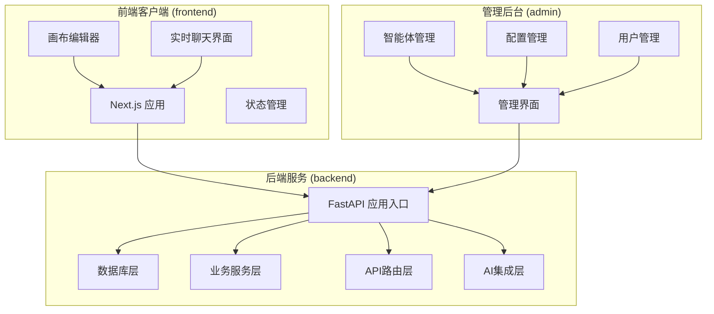

**图表来源**
- [backend/main.py:110-174](file://backend/main.py#L110-L174)
- [frontend/src/app/layout.tsx:23-42](file://frontend/src/app/layout.tsx#L23-L42)

### 技术栈概览

**后端技术栈**
- **核心框架**：Python 3.10+ / FastAPI（异步高性能）
- **数据库**：SQLite（开发）/ PostgreSQL（生产）+ SQLAlchemy 异步ORM
- **AI编排**：AgentScope 多智能体框架
- **实时通信**：WebSocket + Server-Sent Events
- **状态管理**：Zustand + React Context

**前端技术栈**
- **核心框架**：Next.js 16 + TypeScript + Tailwind CSS
- **图形渲染**：PIXI.js 用于画布渲染
- **UI组件**：Ant Design + 自定义组件库
- **实时通信**：Socket.IO 客户端

**关键选择原因**
- **FastAPI**：提供高性能异步API，自动生成API文档
- **AgentScope**：成熟的多智能体框架，支持复杂的协作模式
- **Next.js**：全栈React框架，支持SSR和静态生成
- **PIXI.js**：高性能2D渲染引擎，适合复杂的画布操作

**章节来源**
- [README.md:25-43](file://README.md#L25-L43)
- [backend/requirements.txt:1-28](file://backend/requirements.txt#L1-L28)
- [frontend/package.json:13-92](file://frontend/package.json#L13-L92)

## 核心组件

### 智能代理引擎

智能代理引擎是系统的核心，基于AgentScope构建的分布式智能体架构：

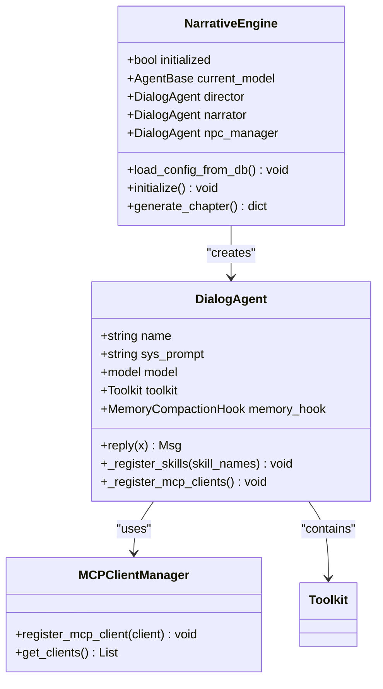

**图表来源**
- [backend/agents.py:40-175](file://backend/agents.py#L40-L175)
- [backend/agents.py:176-388](file://backend/agents.py#L176-L388)

### 多智能体编排系统

系统实现了动态多智能体编排，支持管道、计划和讨论三种协作策略：

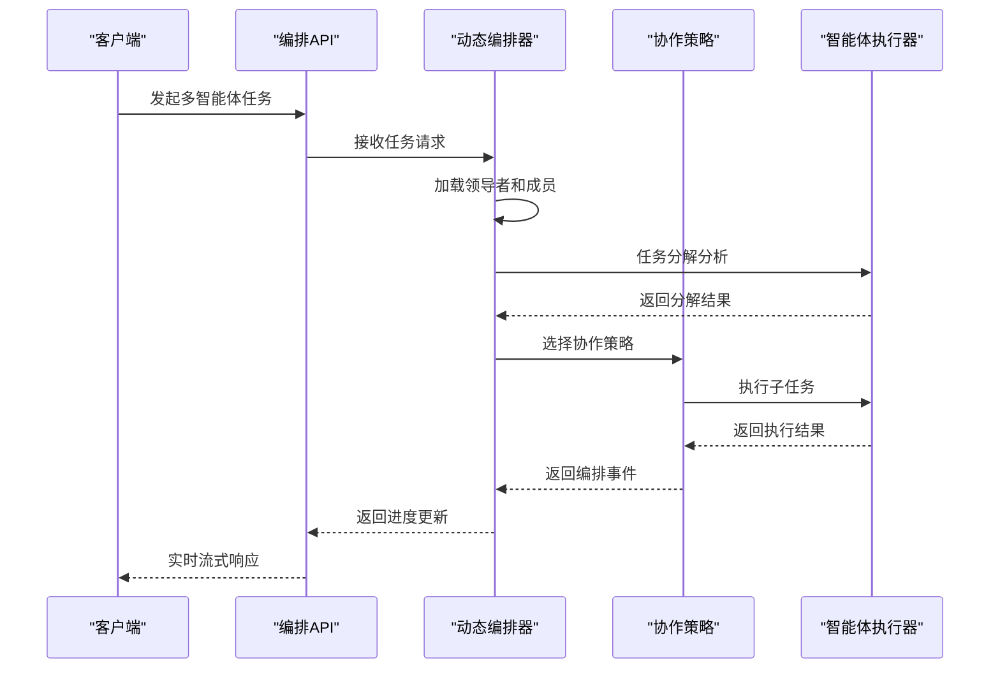

**图表来源**
- [backend/services/orchestrator.py:560-673](file://backend/services/orchestrator.py#L560-L673)

### 剧场系统

剧场系统提供了可视化的创作工作空间，支持多种节点类型：

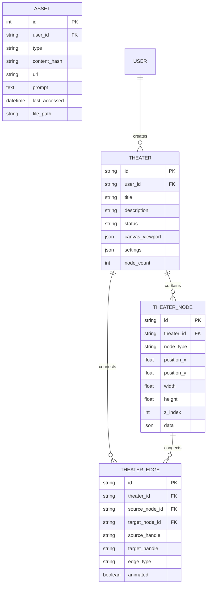

**图表来源**
- [backend/models.py:75-130](file://backend/models.py#L75-L130)
- [backend/models.py:93-130](file://backend/models.py#L93-L130)

**章节来源**
- [backend/agents.py:176-388](file://backend/agents.py#L176-L388)
- [backend/services/orchestrator.py:1-800](file://backend/services/orchestrator.py#L1-L800)
- [backend/models.py:75-447](file://backend/models.py#L75-L447)

## 架构总览

系统采用分层架构设计，确保各组件间的松耦合和高内聚：

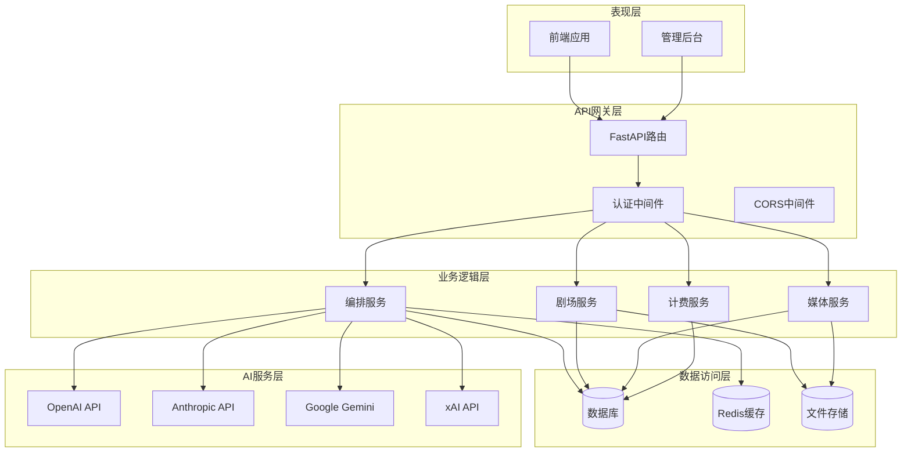

**图表来源**
- [backend/main.py:138-152](file://backend/main.py#L138-L152)
- [backend/config.py:7-43](file://backend/config.py#L7-L43)

### 数据流分析

系统的核心数据流包括用户交互、AI处理和媒体生成三个主要环节：

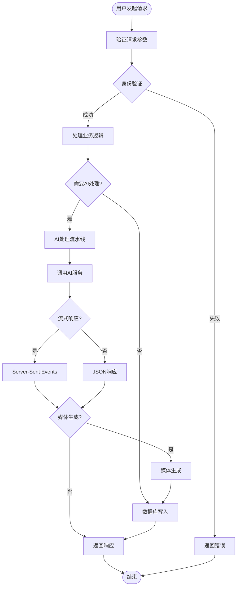

**图表来源**
- [backend/services/orchestrator.py:580-673](file://backend/services/orchestrator.py#L580-L673)

**章节来源**
- [backend/main.py:1-174](file://backend/main.py#L1-L174)
- [backend/config.py:1-43](file://backend/config.py#L1-L43)

## 详细组件分析

### 后端服务架构

后端采用FastAPI框架，提供了高性能的异步API服务：

#### 应用入口与生命周期管理

应用入口文件负责初始化数据库连接、加载AI配置和启动WebSocket服务：

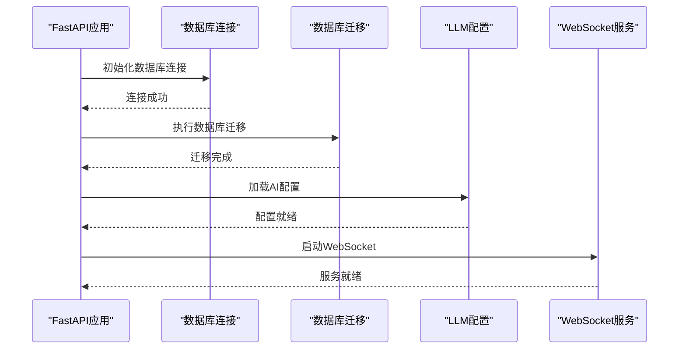

**图表来源**
- [backend/main.py:49-108](file://backend/main.py#L49-L108)

#### API路由组织

系统采用模块化的路由设计，每个功能模块都有独立的路由文件：

| 路由模块 | 功能描述 | 主要接口 |
|---------|----------|----------|
| `/api/theaters` | 剧场管理 | CRUD操作、画布保存 |
| `/api/agents` | 智能体管理 | 创建、更新、删除 |
| `/api/chats` | 聊天交互 | 流式响应、会话管理 |
| `/api/orchestrate` | 多智能体编排 | 任务执行、进度跟踪 |
| `/api/videos` | 视频生成 | 任务提交、状态查询 |

**章节来源**
- [backend/main.py:138-152](file://backend/main.py#L138-L152)
- [backend/routers/theaters.py:1-110](file://backend/routers/theaters.py#L1-L110)

### 前端架构设计

前端采用Next.js框架，提供了现代化的用户体验：

#### 应用布局与主题系统

应用布局文件定义了全局样式和主题配置：

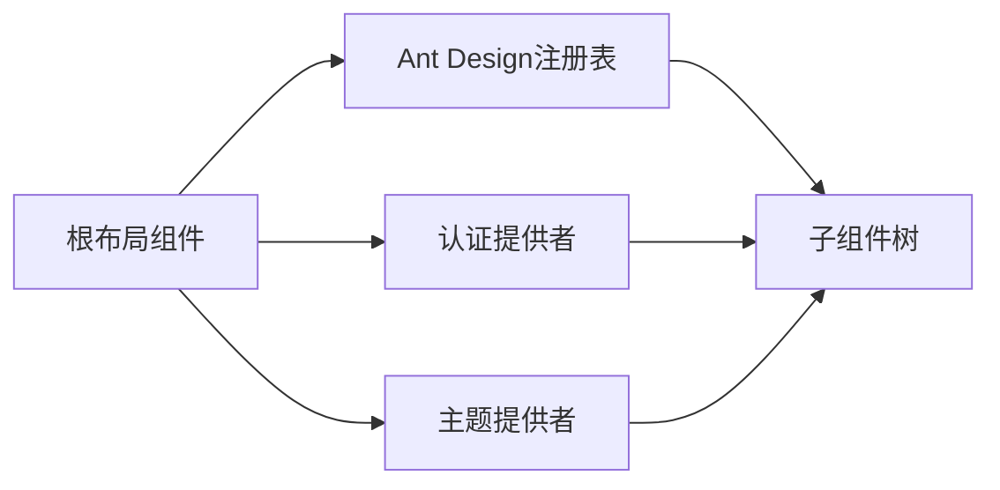

**图表来源**
- [frontend/src/app/layout.tsx:23-42](file://frontend/src/app/layout.tsx#L23-L42)

#### 画布编辑器实现

画布编辑器使用PIXI.js实现高性能的图形渲染：

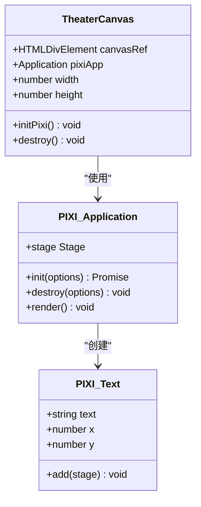

**图表来源**
- [frontend/src/components/TheaterCanvas.tsx:10-50](file://frontend/src/components/TheaterCanvas.tsx#L10-L50)

**章节来源**
- [frontend/src/app/layout.tsx:1-42](file://frontend/src/app/layout.tsx#L1-L42)
- [frontend/src/components/TheaterCanvas.tsx:1-50](file://frontend/src/components/TheaterCanvas.tsx#L1-L50)

### AI服务集成

系统集成了多家AI服务提供商，提供了统一的接口：

#### 多供应商适配器模式

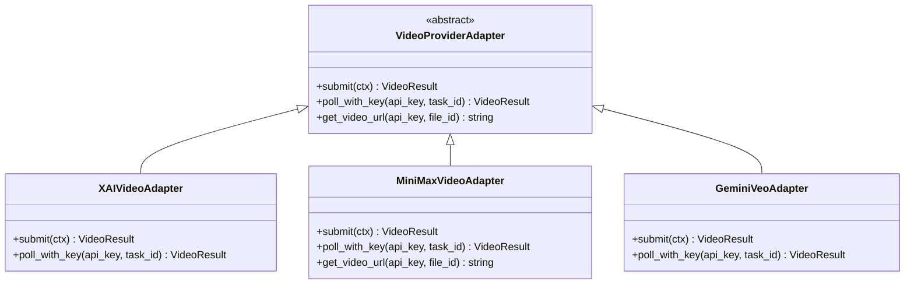

**图表来源**
- [backend/services/video_generation.py:44-76](file://backend/services/video_generation.py#L44-L76)

#### 图像生成工具链

系统提供了统一的图像生成工具接口：

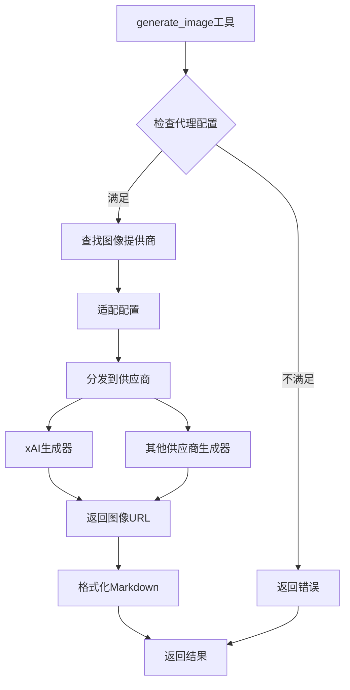

**图表来源**
- [backend/services/image_gen_tools.py:138-195](file://backend/services/image_gen_tools.py#L138-L195)

**章节来源**
- [backend/services/video_generation.py:1-160](file://backend/services/video_generation.py#L1-L160)
- [backend/services/image_gen_tools.py:1-195](file://backend/services/image_gen_tools.py#L1-L195)

## 依赖关系分析

### 后端依赖关系

后端服务依赖关系体现了清晰的分层架构：

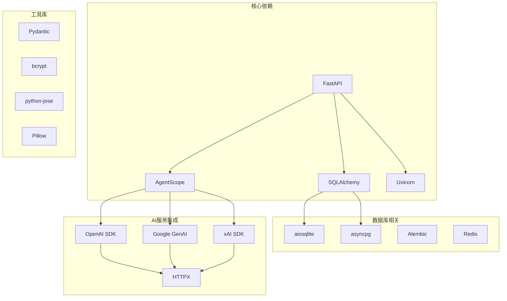

**图表来源**
- [backend/requirements.txt:1-28](file://backend/requirements.txt#L1-L28)

### 前端依赖关系

前端依赖关系反映了现代化的前端技术栈：

```mermaid
graph TB
subgraph "核心框架"
NEXTJS[Next.js]
REACT[React 19]
TYPESCRIPT[TypeScript]
end
subgraph "UI组件库"
ANTD[Ant Design]
RADIX[Radix UI]
LUCIDE[Lucide React]
end
subgraph "图形渲染"
PIXI[PIXI.js]
XYFLOW[@xyflow/react]
DAGRE[dagre]
end
subgraph "状态管理"
ZUSTAND[Zustand]
SWR[SWR]
end
subgraph "工具库"
TAILWIND[Tailwind CSS]
AXIOS[Axios]
SOCKETIO[Socket.IO Client]
UUID[UUID]
end
NEXTJS --> REACT
NEXTJS --> TYPESCRIPT
REACT --> ANTD
REACT --> RADIX
REACT --> ZUSTAND
REACT --> SWR
REACT --> PIXI
REACT --> XYFLOW
REACT --> SOCKETIO
```

**图表来源**
- [frontend/package.json:13-92](file://frontend/package.json#L13-L92)

**章节来源**
- [backend/requirements.txt:1-28](file://backend/requirements.txt#L1-L28)
- [frontend/package.json:13-92](file://frontend/package.json#L13-L92)

## 性能考虑

### 后端性能优化

系统采用了多项性能优化措施：

- **异步I/O**：使用FastAPI的异步特性处理高并发请求
- **数据库连接池**：配置连接池减少连接开销
- **缓存策略**：使用Redis缓存频繁访问的数据
- **流式响应**：支持Server-Sent Events实现实时数据推送
- **内存管理**：智能代理的内存压缩钩子防止内存泄漏

### 前端性能优化

前端应用采用了现代化的性能优化技术：

- **代码分割**：Next.js自动进行代码分割
- **懒加载**：PIXI.js等大型库按需加载
- **状态优化**：Zustand提供高效的局部状态管理
- **图形优化**：PIXI.js优化2D渲染性能
- **网络优化**：SWR提供智能缓存和重新验证

## 故障排除指南

### 常见问题诊断

#### 数据库连接问题

当遇到数据库连接失败时，可以检查以下配置：

1. **数据库URL配置**：确认DATABASE_URL设置正确
2. **权限设置**：检查数据库用户权限
3. **连接池配置**：调整连接池大小
4. **迁移状态**：检查数据库迁移是否完成

#### AI服务集成问题

AI服务集成常见问题及解决方案：

1. **API密钥验证**：确认API密钥有效且有足够配额
2. **网络连接**：检查防火墙和代理设置
3. **模型可用性**：确认目标模型在对应服务商处可用
4. **速率限制**：处理API速率限制和重试逻辑

#### WebSocket连接问题

WebSocket连接异常的排查步骤：

1. **CORS配置**：确认CORS允许WebSocket升级
2. **防火墙设置**：检查防火墙是否阻止WebSocket端口
3. **负载均衡**：配置正确的WebSocket支持
4. **客户端重连**：实现自动重连机制

**章节来源**
- [backend/main.py:51-96](file://backend/main.py#L51-L96)
- [backend/config.py:11-37](file://backend/config.py#L11-L37)

## 结论

Infinite Game项目展现了现代AI驱动创意协作平台的完整架构。通过AgentScope多智能体框架、FastAPI高性能后端和Next.js现代化前端的有机结合，系统实现了从故事创作到媒体产出的一体化解决方案。

### 项目优势

- **技术先进性**：采用最新的AI和Web技术栈
- **架构合理性**：清晰的分层设计和模块化组织
- **扩展性强**：插件化架构支持功能扩展
- **用户体验**：直观的可视化界面和实时交互
- **成本效益**：精细化计费系统优化使用成本

### 发展前景

项目具有广阔的发展空间，可以在以下方面进一步完善：

- **AI能力增强**：集成更多先进的AI服务提供商
- **协作功能扩展**：支持更复杂的多用户协作场景
- **性能优化**：持续优化系统性能和响应速度
- **生态建设**：构建技能插件和第三方集成生态
- **国际化支持**：扩展多语言和多地区支持

## 附录

### 快速开始指南

#### 系统要求
- Python 3.10+
- Node.js 18+
- PostgreSQL（生产环境可选）

#### 后端部署步骤
1. 创建Python虚拟环境
2. 安装依赖包
3. 配置环境变量
4. 初始化数据库
5. 启动FastAPI服务

#### 前端部署步骤
1. 安装Node.js依赖
2. 配置环境变量
3. 启动Next.js开发服务器

### API参考

系统提供完整的RESTful API，支持多智能体编排、剧场管理和媒体生成等功能。详细的API文档可在后端服务启动后通过Swagger UI查看。