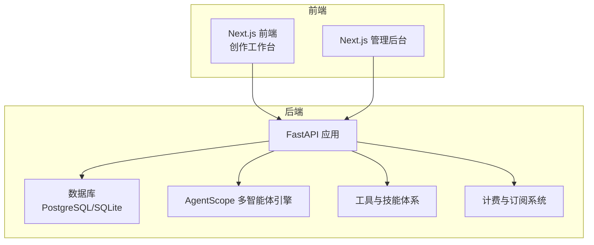
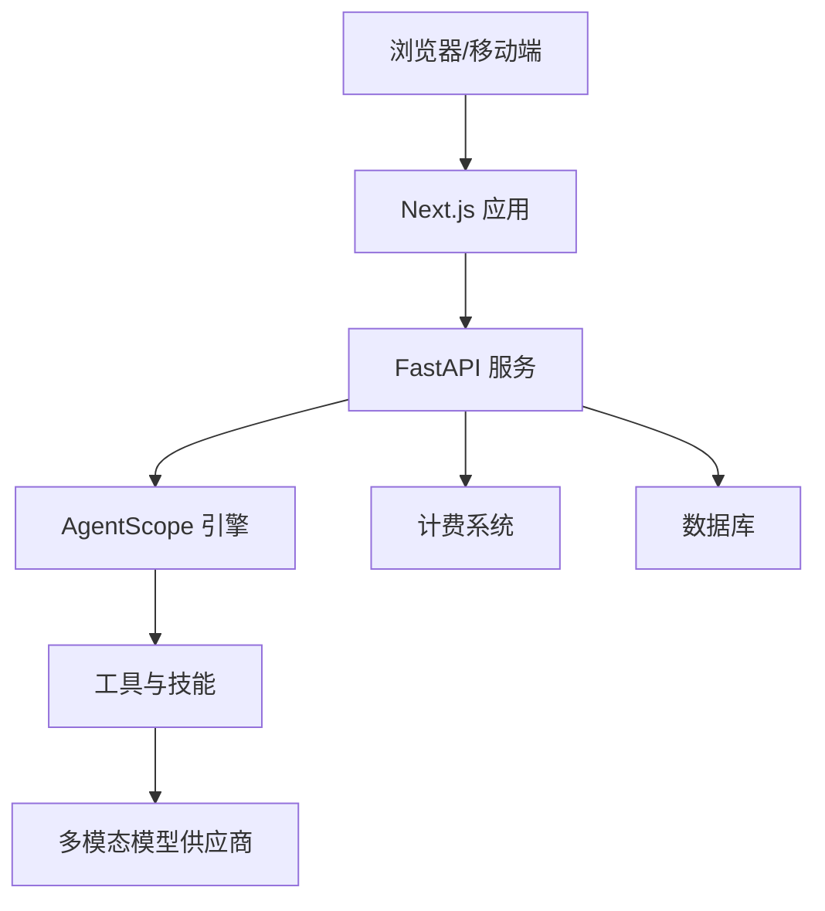
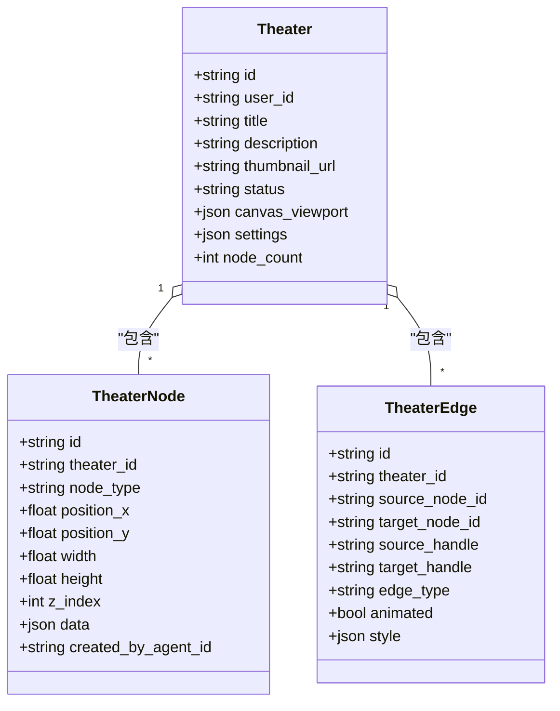
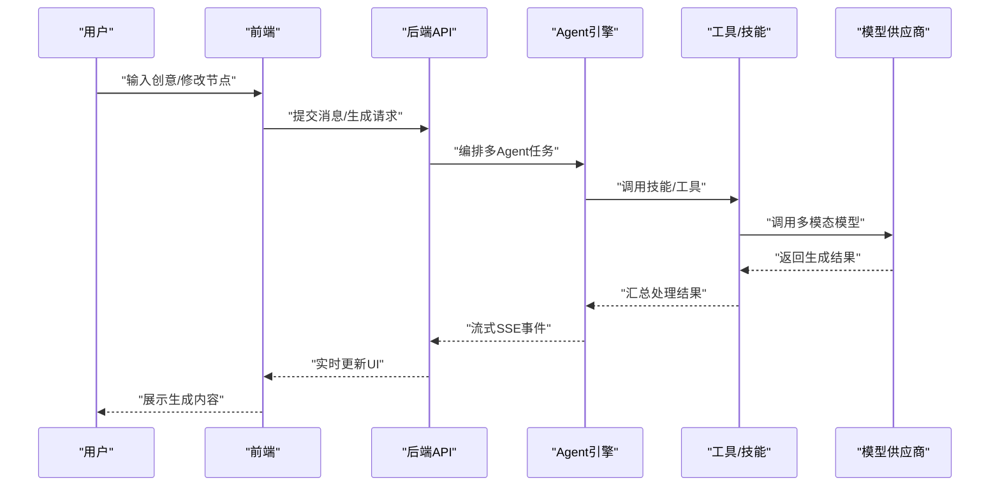
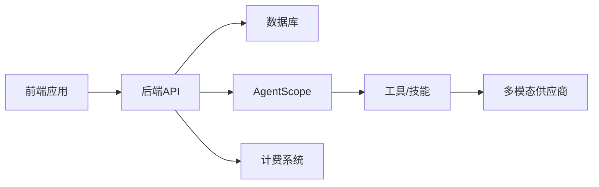

# 平台定位与愿景

<cite>
**本文引用的文件**
- [README.md](file://README.md)
- [main.py](file://backend/main.py)
- [models.py](file://backend/models.py)
- [schemas.py](file://backend/schemas.py)
- [theater.py](file://backend/services/theater.py)
- [AIAssistantPanel.tsx](file://frontend/src/components/canvas/AIAssistantPanel.tsx)
- [requirements.txt](file://backend/requirements.txt)
- [SKILL.md](file://backend/skills/builtin_skills/image_tools/SKILL.md)
- [Grok视频生成模型文档.md](file://Grok视频生成模型文档.md)
- [GeminiVeo3.1视频生成模型文档.md](file://GeminiVeo3.1视频生成模型文档.md)
- [BILLING_REVIEW.md](file://backend/docs/BILLING_REVIEW.md)
</cite>

## 目录
1. [引言](#引言)
2. [项目结构](#项目结构)
3. [核心组件](#核心组件)
4. [架构总览](#架构总览)
5. [详细组件分析](#详细组件分析)
6. [依赖关系分析](#依赖关系分析)
7. [性能考量](#性能考量)
8. [故障排查指南](#故障排查指南)
9. [结论](#结论)
10. [附录](#附录)

## 引言
本文件面向KunFlix平台，系统阐述其作为“AI驱动的影视广告创作工厂”的平台定位与愿景，明确平台使命、愿景、价值主张与市场定位，并深入分析平台在AI内容创作领域的独特优势与差异化特色。同时，结合现有代码库中的技术架构、功能模块与计费体系，给出面向不同用户群体（影视创作者、广告公司、品牌方）的价值认知与使用指引，帮助理解平台如何改变传统影视广告创作模式。

## 项目结构
KunFlix采用前后端分离架构，后端基于FastAPI提供API服务，前端采用Next.js构建创作工作台，管理后台基于Next.js实现可视化运营与治理能力。平台围绕“剧场（Theater）”概念组织创作流程，支持从剧本、角色、分镜到视频、配音、剪辑的全链路生成与管理。

图表来源
- [main.py:110-175](file://backend/main.py#L110-L175)
- [requirements.txt:1-29](file://backend/requirements.txt#L1-L29)

章节来源
- [README.md:63-79](file://README.md#L63-L79)
- [main.py:110-175](file://backend/main.py#L110-L175)
- [requirements.txt:1-29](file://backend/requirements.txt#L1-L29)

## 核心组件
- 剧场（Theater）：承载创作项目的画布，支持节点（脚本、角色、分镜、视频）与连接关系的可视化管理。
- 多智能体（AgentScope）：基于多Agent协作的编排引擎，自动拆解“剧本→角色→视频→剪辑”任务链。
- 技能（Skills）：内置影视专用技能模块，如一致性角色生成、视频风格迁移、智能剪辑、多语言配音等。
- 多模态处理：统一处理文本、图像、视频、音频，贯通从创意到成品的全流程。
- 实时交互：支持随时打断、多版本并行创作、协作式迭代优化。
- 计费与订阅：基于积分的精细化消费模式，支持订阅套餐与按时长/分辨率灵活定价。

章节来源
- [README.md:18-26](file://README.md#L18-L26)
- [README.md:136-164](file://README.md#L136-L164)
- [theater.py:13-285](file://backend/services/theater.py#L13-L285)
- [models.py:75-150](file://backend/models.py#L75-L150)

## 架构总览
平台采用模块化设计，后端通过FastAPI提供REST接口，数据库采用SQLAlchemy异步ORM，前端通过Server-Sent Events与WebSocket实现实时交互。管理后台提供用户管理、Agent监控、资源配置与数据分析界面。

图表来源
- [main.py:32-175](file://backend/main.py#L32-L175)
- [requirements.txt:11-25](file://backend/requirements.txt#L11-L25)

章节来源
- [README.md:28-46](file://README.md#L28-L46)
- [main.py:32-175](file://backend/main.py#L32-L175)

## 详细组件分析

### 平台定位与愿景
- 定位：AI驱动的影视广告创作工厂，专注影视广告与短剧创作，提供从剧本到成片的全链路AI内容生成与管理。
- 愿景：成为创作者、广告公司与品牌方的“私人好莱坞团队”，以AI降低创作门槛，提升效率与质量。
- 使命：通过多模态AI与多智能体协作，将创意从0到1高效转化为专业级短剧、广告、MV、品牌影片。
- 价值主张：
  - 一站式全链路：剧本→角色→视音频→成片无缝衔接。
  - 无限画布：人机协作或由智能体创作，无需人工干预。
  - 多Agent协作：复杂任务自动化分解与协同。
  - 开放扩展：模块化设计，支持技能插件、自定义代理与第三方服务集成。
  - 智能计费：精细化消费模式，支持订阅与按量付费。

章节来源
- [README.md:3-6](file://README.md#L3-L6)
- [README.md:8-26](file://README.md#L8-L26)

### 目标用户与价值认知
- 影视创作者：短剧/微短剧全流程创作、品牌广告片、产品宣传视频、TVC快速生成、MV/动画短片/漫画风短视频制作。
- 广告与营销团队：30秒/15秒竖屏广告一键生成、社交媒体短视频批量生产、品牌IP形象视频、电商直播素材创作。
- 企业与个人创作者：个人创意短视频/Vlog升级为专业影片，生成内容永久保留为私人影视资产，支持二次复用与导出。

章节来源
- [README.md:47-61](file://README.md#L47-L61)

### 平台独特优势与差异化特色
- 多模态统一处理：文本、图像、视频、音频一体化处理，贯通创作全流程。
- 多Agent编排：基于AgentScope的多智能体协作，自动拆解复杂任务。
- 技能体系：内置影视专用技能，支持扩展与自定义。
- 实时交互：支持随时打断、多版本并行创作与协作式迭代。
- 计费与订阅：基于积分的精细化消费模式，支持订阅套餐与灵活计价。
- 开放扩展：模块化设计，支持技能插件、自定义代理与第三方服务集成。

章节来源
- [README.md:18-26](file://README.md#L18-L26)
- [README.md:136-164](file://README.md#L136-L164)

### 技术架构与核心能力
- 后端技术栈：Python 3.10+、FastAPI、SQLAlchemy异步ORM、Alembic迁移、AgentScope多智能体框架。
- 前端技术栈：Next.js 16、TypeScript、Tailwind CSS、Zustand状态管理、实时通信（WebSocket + SSE）。
- 多模态模型集成：OpenAI、Google、xAI、火山引擎等顶级模型，支持文本、图像、视频、音频生成。
- 剧场系统：基于节点与边的可视化创作画布，支持节点类型（脚本、角色、分镜、视频）与连接关系管理。
- 计费系统：基于积分的精细化消费模式，支持订阅套餐与按时长/分辨率灵活定价。

章节来源
- [README.md:28-46](file://README.md#L28-L46)
- [requirements.txt:1-29](file://backend/requirements.txt#L1-L29)
- [theater.py:13-285](file://backend/services/theater.py#L13-L285)

### 剧场系统与创作流程
- 剧场（Theater）：用户创建的创意项目，包含标题、描述、缩略图、状态、画布视口与设置。
- 节点（TheaterNode）：画布上的节点，支持脚本、角色、分镜、视频等类型，包含位置、尺寸、层级与业务数据。
- 边（TheaterEdge）：节点之间的连接，支持样式与动画配置。
- 画布同步：支持节点与边的全量同步，使用集合运算进行创建、更新、删除操作，保证数据一致性。

图表来源
- [models.py:75-130](file://backend/models.py#L75-L130)

章节来源
- [models.py:75-130](file://backend/models.py#L75-L130)
- [theater.py:13-285](file://backend/services/theater.py#L13-L285)

### 多模态生成与实时交互
- 多模态生成：支持文本→剧本/分镜/角色描述，图像→角色设计/场景图/海报，视频→片段生成/特效合成，音频→配音/背景音乐/音效。
- 实时交互：创作过程中支持随时打断与修改创意方向、多版本并行创作对比、协作式迭代优化。
- AI助手面板：前端提供AI助手面板，支持拖拽附件、节点预览、Agent切换、SSE流式响应与性能监控。

图表来源
- [AIAssistantPanel.tsx:182-293](file://frontend/src/components/canvas/AIAssistantPanel.tsx#L182-L293)
- [requirements.txt:11-25](file://backend/requirements.txt#L11-L25)

章节来源
- [README.md:152-157](file://README.md#L152-L157)
- [README.md:159-163](file://README.md#L159-L163)
- [AIAssistantPanel.tsx:182-293](file://frontend/src/components/canvas/AIAssistantPanel.tsx#L182-L293)

### 计费系统与订阅
- 积分模型：维持1积分=0.01美元的锚定汇率，支持按输入/输出tokens与多模态生成成本折算。
- 订阅套餐：支持月度/年度/终身套餐，包含不同积分数与特性列表。
- 成本优化：基于供应商成本数据重构积分模型，确保定价合理与利润空间。

章节来源
- [BILLING_REVIEW.md:88-97](file://backend/docs/BILLING_REVIEW.md#L88-L97)
- [models.py:389-409](file://backend/models.py#L389-L409)

### 技能体系与工具集成
- 内置技能：图像生成与编辑、视频风格迁移、智能剪辑、多语言配音等。
- 工具参数：技能参数受系统配置约束，确保与供应商能力一致。
- 扩展机制：支持自定义技能与第三方工具集成。

章节来源
- [SKILL.md:15-81](file://backend/skills/builtin_skills/image_tools/SKILL.md#L15-L81)

### 多模态模型能力
- 视频生成：支持文本到视频、图像到视频、视频编辑与扩展，可配置时长、宽高比与分辨率。
- 图像生成：支持多种宽高比、质量与批量生成，提供风格化与编辑能力。
- 模型集成：集成xAI、Google Gemini、火山引擎等多家供应商，提供多样化选择。

章节来源
- [Grok视频生成模型文档.md:1-105](file://Grok视频生成模型文档.md#L1-L105)
- [GeminiVeo3.1视频生成模型文档.md:1034-1084](file://GeminiVeo3.1视频生成模型文档.md#L1034-L1084)

## 依赖关系分析
平台依赖关系主要体现在后端服务、数据库、多模态供应商与前端应用之间。后端通过FastAPI提供统一接口，数据库负责持久化，多模态供应商提供生成能力，前端通过SSE与WebSocket实现实时交互。

图表来源
- [main.py:32-175](file://backend/main.py#L32-L175)
- [requirements.txt:11-25](file://backend/requirements.txt#L11-L25)

章节来源
- [main.py:32-175](file://backend/main.py#L32-L175)
- [requirements.txt:11-25](file://backend/requirements.txt#L11-L25)

## 性能考量
- 异步与并发：后端采用异步ORM与异步依赖，提升I/O密集型任务的吞吐。
- 实时通信：WebSocket与SSE结合，降低延迟，提升交互体验。
- 虚拟滚动与性能监控：前端使用虚拟滚动与性能监控，减少大消息列表的渲染开销。
- 计费与成本控制：通过积分模型与订阅策略，平衡用户体验与成本控制。

章节来源
- [README.md:34-36](file://README.md#L34-L36)
- [AIAssistantPanel.tsx:154-161](file://frontend/src/components/canvas/AIAssistantPanel.tsx#L154-L161)

## 故障排查指南
- 数据库连接与迁移：后端启动时具备数据库连接重试与迁移逻辑，若失败会尝试清理残留临时表后重试。
- 认证与权限：提供调试中间件记录认证头与来源，便于排查跨域与鉴权问题。
- 计费异常：前端在401/402/429等状态码下提供明确错误提示，便于用户自助处理。

章节来源
- [main.py:49-108](file://backend/main.py#L49-L108)
- [main.py:119-128](file://backend/main.py#L119-L128)
- [AIAssistantPanel.tsx:240-252](file://frontend/src/components/canvas/AIAssistantPanel.tsx#L240-L252)

## 结论
KunFlix以“AI驱动的影视广告创作工厂”为核心定位，通过多模态AI与多智能体协作，构建从创意到成品的一站式创作平台。平台面向影视创作者、广告公司与品牌方，提供全链路生成、无限画布、多Agent协作、开放扩展与智能计费等差异化优势。依托模块化架构与实时交互能力，平台正在改变传统影视广告创作模式，降低门槛、提升效率与质量，助力创作者与企业实现创意的高效落地。

## 附录
- 快速开始与部署：后端与前端分别提供安装与启动说明，支持开发与生产环境配置。
- 社区与支持：提供邮件支持、GitHub Discussions与文档中心，欢迎参与贡献与反馈。

章节来源
- [README.md:81-135](file://README.md#L81-L135)
- [README.md:200-225](file://README.md#L200-L225)