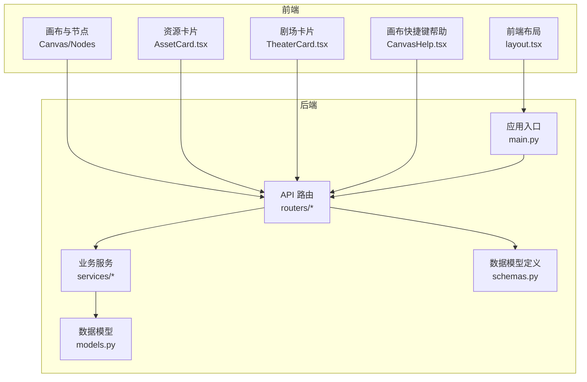
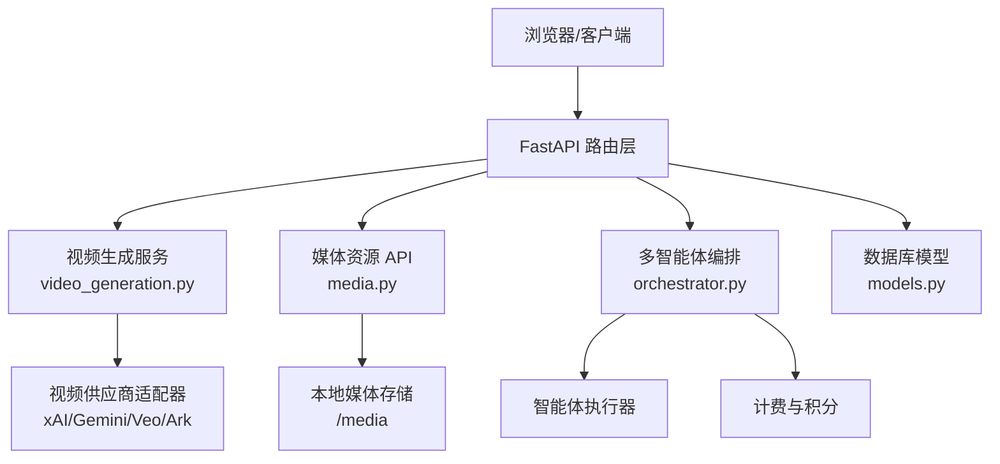
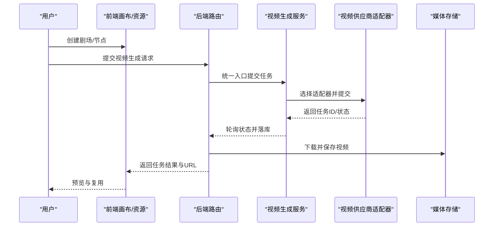
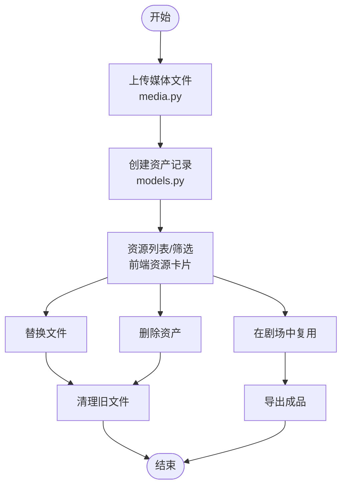
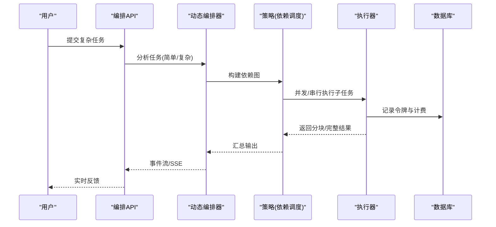
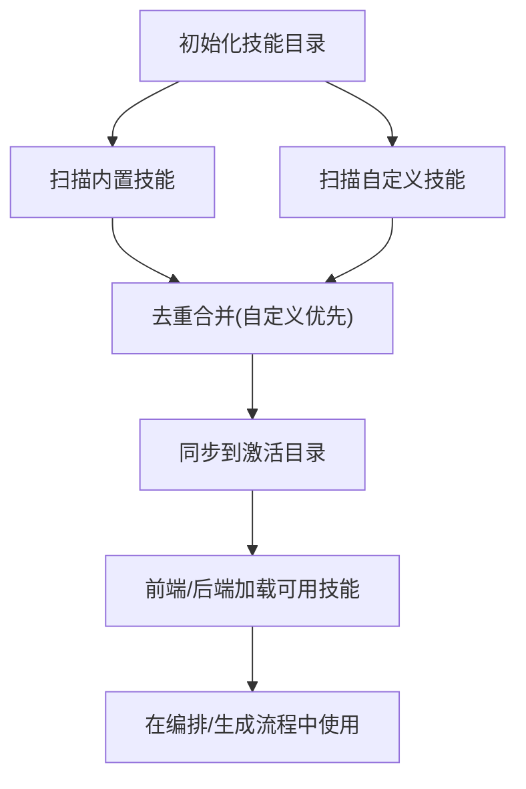
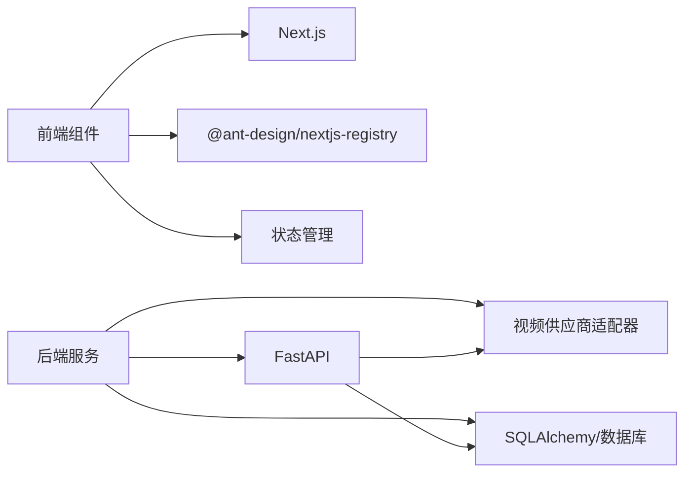

# 个人与企业创作者场景

<cite>
**本文引用的文件**
- [README.md](file://README.md)
- [main.py](file://backend/main.py)
- [models.py](file://backend/models.py)
- [schemas.py](file://backend/schemas.py)
- [videos.py](file://backend/routers/videos.py)
- [media.py](file://backend/routers/media.py)
- [video_generation.py](file://backend/services/video_generation.py)
- [orchestrator.py](file://backend/services/orchestrator.py)
- [skills_manager.py](file://backend/skills_manager.py)
- [layout.tsx](file://frontend/src/app/layout.tsx)
- [AssetCard.tsx](file://frontend/src/components/resources/AssetCard.tsx)
- [CanvasHelp.tsx](file://frontend/src/components/canvas/CanvasHelp.tsx)
- [TheaterCard.tsx](file://frontend/src/components/home/TheaterCard.tsx)
- [GeminiVeo3.1视频生成模型文档.md](file://GeminiVeo3.1视频生成模型文档.md)
- [Grok视频生成模型文档.md](file://Grok视频生成模型文档.md)
</cite>

## 目录
1. [引言](#引言)
2. [项目结构](#项目结构)
3. [核心组件](#核心组件)
4. [架构总览](#架构总览)
5. [详细组件分析](#详细组件分析)
6. [依赖关系分析](#依赖关系分析)
7. [性能考量](#性能考量)
8. [故障排查指南](#故障排查指南)
9. [结论](#结论)
10. [附录](#附录)

## 引言
本文件面向个人创作者与企业用户，系统阐述平台如何通过“智能代理 + 多模态生成 + 资产管理 + 开放扩展”的整体能力，帮助个人将创意短视频、Vlog升级为专业级影片；同时协助企业建立自有创意资产库，实现规模化生产与品牌资产沉淀。平台覆盖从“创作—生成—复用—导出”的全链路，降低创作门槛，提升内容质量与效率。

## 项目结构
平台采用前后端分离架构：后端基于 FastAPI 提供统一 API，包含视频生成、资产管理、计费与多智能体编排；前端基于 Next.js 提供剧场画布、资源管理与可视化交互界面；管理后台基于 Next.js 提供管理员功能。

**图表来源**
- [layout.tsx:1-42](file://frontend/src/app/layout.tsx#L1-L42)
- [main.py:110-175](file://backend/main.py#L110-L175)
- [models.py:1-503](file://backend/models.py#L1-L503)
- [schemas.py:1-931](file://backend/schemas.py#L1-L931)

**章节来源**
- [README.md:22-334](file://README.md#L22-L334)
- [main.py:110-175](file://backend/main.py#L110-L175)
- [layout.tsx:1-42](file://frontend/src/app/layout.tsx#L1-L42)

## 核心组件
- 智能代理与多智能体编排：通过动态编排引擎对复杂任务进行分解与执行，支持统一事件流与计费统计。
- 多模态生成服务：统一接入 xAI、MiniMax、Gemini Veo、Ark 等视频生成能力，支持文本/图像/参考图等多种模式。
- 资产管理与复用：提供账号级资源上传、列表、替换与删除，支持跨剧场复用，保障内容资产的永久保存与二次利用。
- 开放扩展架构：技能系统支持内置/自定义/激活技能的同步与管理，便于个性化定制与工作流扩展。
- 可视化创作管理：前端提供剧场卡片、资源卡片、画布快捷键帮助等，提升创作与管理体验。

**章节来源**
- [orchestrator.py:1-914](file://backend/services/orchestrator.py#L1-L914)
- [video_generation.py:1-180](file://backend/services/video_generation.py#L1-L180)
- [media.py:1-444](file://backend/routers/media.py#L1-L444)
- [skills_manager.py:1-408](file://backend/skills_manager.py#L1-L408)
- [AssetCard.tsx:1-132](file://frontend/src/components/resources/AssetCard.tsx#L1-L132)
- [TheaterCard.tsx:1-173](file://frontend/src/components/home/TheaterCard.tsx#L1-L173)
- [CanvasHelp.tsx:1-200](file://frontend/src/components/canvas/CanvasHelp.tsx#L1-L200)

## 架构总览
平台采用“统一入口 + 多适配器 + 事件流 + 资产中心”的架构设计，后端通过 FastAPI 路由聚合视频生成、媒体资源、计费与编排等能力；前端通过画布与资源面板实现所见即所得的创作与管理。

**图表来源**
- [main.py:138-154](file://backend/main.py#L138-L154)
- [video_generation.py:50-82](file://backend/services/video_generation.py#L50-L82)
- [media.py:30-31](file://backend/routers/media.py#L30-L31)
- [orchestrator.py:418-534](file://backend/services/orchestrator.py#L418-L534)
- [models.py:131-150](file://backend/models.py#L131-L150)

## 详细组件分析

### 个人创作者路径：从创意到专业影片
- 创作阶段：使用剧场画布进行脚本、角色、分镜与视频节点的可视化组织，支持快捷键与拖拽操作，降低上手成本。
- 生成阶段：通过统一视频生成接口提交任务，平台自动路由至对应供应商（如 xAI/Gemini Veo），支持文本/图像/参考图等多种模式。
- 复用阶段：生成的视频与图片自动入库为资产，可在不同剧场复用，实现内容资产的永久保存与二次创作。
- 导出阶段：前端资源卡片支持预览、替换与删除，便于成品导出与发布。

**图表来源**
- [videos.py:75-148](file://backend/routers/videos.py#L75-L148)
- [video_generation.py:90-126](file://backend/services/video_generation.py#L90-L126)
- [media.py:272-299](file://backend/routers/media.py#L272-L299)

**章节来源**
- [CanvasHelp.tsx:63-198](file://frontend/src/components/canvas/CanvasHelp.tsx#L63-L198)
- [TheaterCard.tsx:39-173](file://frontend/src/components/home/TheaterCard.tsx#L39-L173)
- [AssetCard.tsx:83-132](file://frontend/src/components/resources/AssetCard.tsx#L83-L132)
- [videos.py:75-234](file://backend/routers/videos.py#L75-L234)
- [video_generation.py:90-180](file://backend/services/video_generation.py#L90-L180)
- [media.py:95-149](file://backend/routers/media.py#L95-L149)

### 企业规模化生产：建立创意资产库
- 资产中心：统一的账号级资源管理，支持分页、类型筛选、重命名与替换，确保资产可检索、可维护。
- 复用与导出：资产卡片支持一键预览与替换，便于在不同项目中复用；删除时可联动清理本地文件，避免垃圾堆积。
- 计费与审计：视频生成与图片批量生成均支持计费与交易记录，便于企业成本核算与审计。

**图表来源**
- [media.py:95-265](file://backend/routers/media.py#L95-L265)
- [models.py:131-150](file://backend/models.py#L131-L150)
- [AssetCard.tsx:83-132](file://frontend/src/components/resources/AssetCard.tsx#L83-L132)

**章节来源**
- [media.py:155-265](file://backend/routers/media.py#L155-L265)
- [models.py:131-150](file://backend/models.py#L131-L150)
- [AssetCard.tsx:1-132](file://frontend/src/components/resources/AssetCard.tsx#L1-L132)

### 智能代理与多智能体编排
- 动态编排：领导智能体对任务进行一次性分析，区分简单/复杂任务；复杂任务分解为子任务，按依赖关系并发或串行执行。
- 事件流：通过 SSE 事件流实时反馈子任务进度、分块输出与最终结果，便于前端渲染与用户交互。
- 计费与审核：支持自动计费与可选的领导审核环节，确保输出质量与成本可控。

**图表来源**
- [orchestrator.py:418-534](file://backend/services/orchestrator.py#L418-L534)
- [orchestrator.py:558-596](file://backend/services/orchestrator.py#L558-L596)
- [orchestrator.py:661-754](file://backend/services/orchestrator.py#L661-L754)

**章节来源**
- [orchestrator.py:1-914](file://backend/services/orchestrator.py#L1-L914)

### 开放扩展架构与技能系统
- 技能目录：内置/自定义/激活三层结构，支持按名称同步与差异更新，便于企业定制专属工作流。
- 文件加载：提供受控的文件加载接口，防止路径穿越，保障运行安全。
- 与编排结合：技能可作为智能体工具的一部分参与任务执行，形成“提示词模板 + 技能 + 多模态生成”的组合拳。

**图表来源**
- [skills_manager.py:180-225](file://backend/skills_manager.py#L180-L225)
- [skills_manager.py:263-408](file://backend/skills_manager.py#L263-L408)

**章节来源**
- [skills_manager.py:1-408](file://backend/skills_manager.py#L1-L408)

### 可视化管理后台与创作体验
- 剧场卡片：支持状态标记、节点数量与更新时间展示，提供重命名、复制与删除操作，便于项目管理。
- 资源卡片：支持图标与尺寸显示、预览与操作菜单，提升资源检索与管理效率。
- 画布帮助：提供快捷键面板，涵盖基础/多选/视图/编辑/AI 操作，降低学习成本。

**章节来源**
- [TheaterCard.tsx:1-173](file://frontend/src/components/home/TheaterCard.tsx#L1-L173)
- [AssetCard.tsx:1-132](file://frontend/src/components/resources/AssetCard.tsx#L1-L132)
- [CanvasHelp.tsx:63-198](file://frontend/src/components/canvas/CanvasHelp.tsx#L63-L198)

## 依赖关系分析
- 后端依赖：FastAPI 路由聚合视频生成、媒体资源与编排服务；数据库模型支撑资产、任务与计费；服务层封装供应商适配与计费逻辑。
- 前端依赖：Next.js 提供页面与组件；Ant Design 注册器提供 UI 组件；Zustand/Context 管理状态；WebSocket/SSE 支持实时事件。
- 第三方集成：视频生成对接 xAI、MiniMax、Gemini Veo、Ark 等多家供应商，统一适配器屏蔽差异。

**图表来源**
- [layout.tsx:1-42](file://frontend/src/app/layout.tsx#L1-L42)
- [main.py:110-175](file://backend/main.py#L110-L175)
- [video_generation.py:50-82](file://backend/services/video_generation.py#L50-L82)

**章节来源**
- [main.py:110-175](file://backend/main.py#L110-L175)
- [layout.tsx:1-42](file://frontend/src/app/layout.tsx#L1-L42)

## 性能考量
- 异步与轮询：视频生成采用异步任务与轮询机制，避免阻塞；平台内置超时保护与失败判定，减少无效等待。
- 并发与依赖：编排层按依赖关系调度子任务，相同层级并发执行，串行任务实时流式输出，兼顾吞吐与交互体验。
- 存储与缓存：媒体文件提供缓存头与本地存储，支持预览与替换，降低重复下载开销。
- 计费与限额：通过积分与费率快照控制成本，支持余额冻结与异常处理，保障企业预算可控。

[本节为通用指导，不涉及具体文件分析]

## 故障排查指南
- 视频生成失败：检查供应商适配器是否正确、任务状态轮询是否超时、错误信息是否包含在任务记录中；必要时删除终态任务并重新发起。
- 媒体文件访问异常：确认文件名格式、扩展名回退查找与路径安全；检查媒体目录权限与文件是否存在。
- 编排事件中断：关注 SSE 事件流中的错误事件与重试策略；核对子任务依赖与令牌用量。
- 技能加载失败：检查 SKILL.md 前言元数据、路径遍历防护与激活目录同步状态。

**章节来源**
- [videos.py:150-234](file://backend/routers/videos.py#L150-L234)
- [media.py:272-299](file://backend/routers/media.py#L272-L299)
- [orchestrator.py:535-596](file://backend/services/orchestrator.py#L535-L596)
- [skills_manager.py:370-408](file://backend/skills_manager.py#L370-L408)

## 结论
平台通过“智能代理 + 多模态生成 + 资产管理 + 开放扩展”的一体化能力，为个人与企业用户提供从创意到专业的完整路径。个人用户可快速将短视频、Vlog升级为专业影片；企业用户可沉淀与复用创意资产，实现规模化生产与品牌资产建设。可视化管理与事件流机制进一步降低了创作门槛，提升了管理效率与长期价值。

[本节为总结性内容，不涉及具体文件分析]

## 附录

### 供应商与模型能力参考
- Gemini Veo 3.1：支持文本/图像/参考图生成，支持横/竖屏、分辨率与扩展视频等能力。
- Grok 视频：支持文本/图像/参考图/编辑/扩展等模式，提供可配置时长、宽高比与分辨率。

**章节来源**
- [GeminiVeo3.1视频生成模型文档.md:1-800](file://GeminiVeo3.1视频生成模型文档.md#L1-L800)
- [Grok视频生成模型文档.md:1-800](file://Grok视频生成模型文档.md#L1-L800)