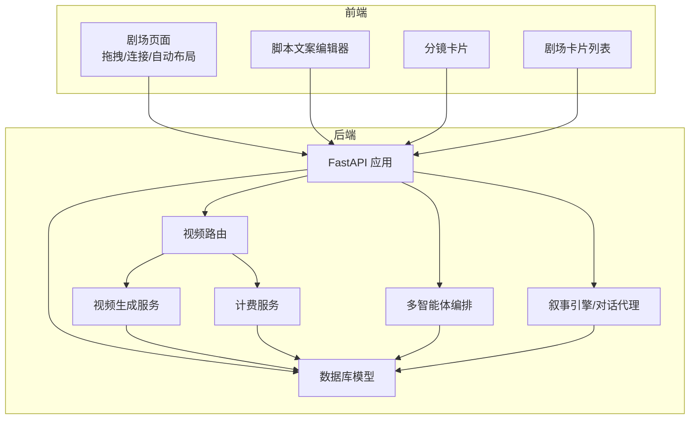
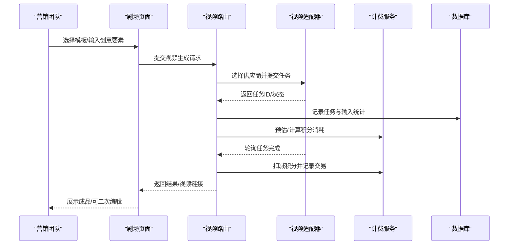
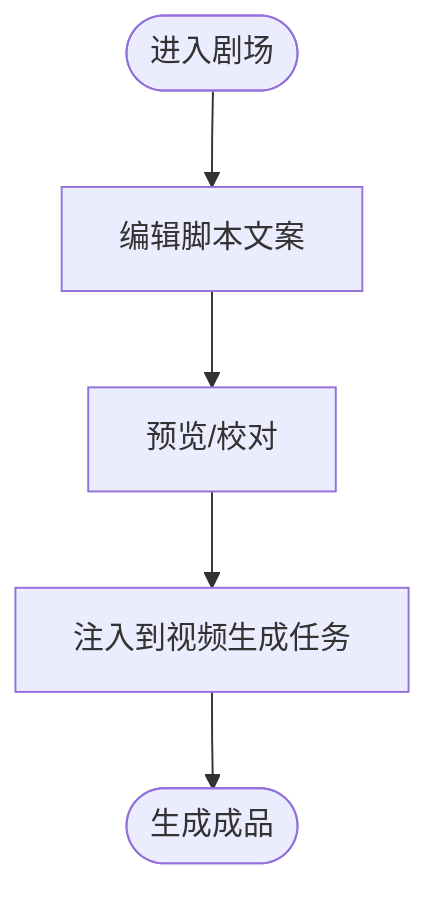
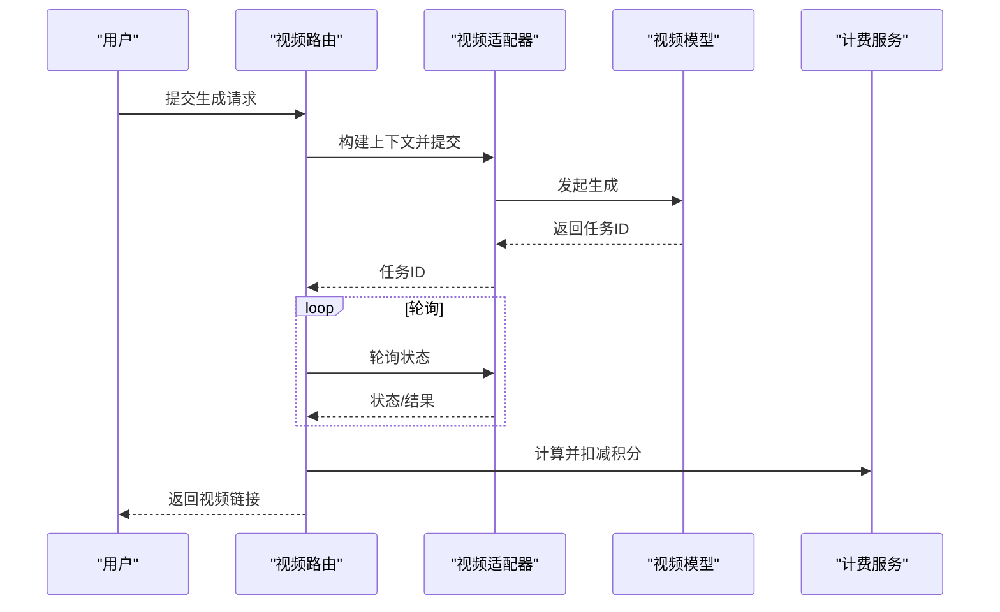
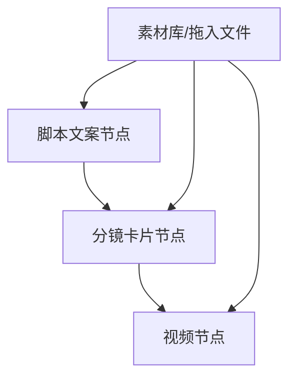
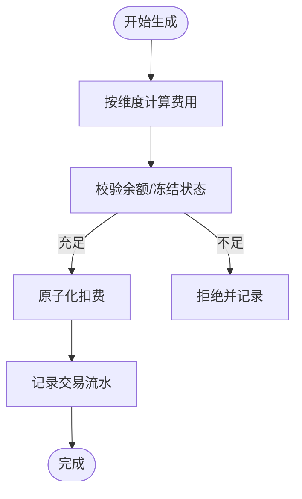
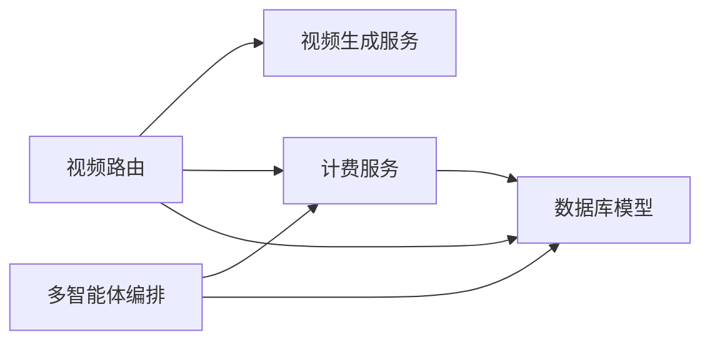

# 广告营销团队场景

<cite>
**本文引用的文件**   
- [backend/main.py](file://backend/main.py)
- [backend/models.py](file://backend/models.py)
- [backend/schemas.py](file://backend/schemas.py)
- [backend/services/billing.py](file://backend/services/billing.py)
- [backend/services/video_generation.py](file://backend/services/video_generation.py)
- [backend/routers/videos.py](file://backend/routers/videos.py)
- [backend/services/orchestrator.py](file://backend/services/orchestrator.py)
- [backend/agents.py](file://backend/agents.py)
- [frontend/src/app/theater/[id]/page.tsx](file://frontend/src/app/theater/[id]/page.tsx)
- [frontend/src/components/canvas/ScriptEditor.tsx](file://frontend/src/components/canvas/ScriptEditor.tsx)
- [frontend/src/components/canvas/StoryboardNode.tsx](file://frontend/src/components/canvas/StoryboardNode.tsx)
- [frontend/src/components/home/TheaterCard.tsx](file://frontend/src/components/home/TheaterCard.tsx)
</cite>

## 目录
1. [简介](#简介)
2. [项目结构](#项目结构)
3. [核心组件](#核心组件)
4. [架构总览](#架构总览)
5. [详细组件分析](#详细组件分析)
6. [依赖关系分析](#依赖关系分析)
7. [性能考虑](#性能考虑)
8. [故障排查指南](#故障排查指南)
9. [结论](#结论)
10. [附录](#附录)

## 简介
本文件面向广告营销团队，围绕“30秒/15秒竖屏广告、社交媒体短视频、品牌IP形象视频”等典型营销场景，系统化阐述平台如何通过“一键生成广告剧本、批量生产短视频、电商直播素材创作”等能力，结合“智能计费系统、多模态处理能力、实时交互引擎”，帮助团队高效产出、精准控本、快速迭代，从而提升营销效率与传播效果。

## 项目结构
平台采用前后端分离架构：
- 后端基于 FastAPI，提供视频生成、计费、多智能体编排、剧场画布等能力。
- 前端基于 Next.js + React，提供可视化剧场画布、脚本文案编辑、分镜卡片、节点拖拽与连接等交互体验。
- 数据模型统一管理用户、剧场、节点、视频任务、计费流水等核心实体。

图示来源
- [backend/main.py:110-175](file://backend/main.py#L110-L175)
- [backend/routers/videos.py:24-344](file://backend/routers/videos.py#L24-L344)
- [backend/services/video_generation.py:1-180](file://backend/services/video_generation.py#L1-L180)
- [backend/services/billing.py:1-388](file://backend/services/billing.py#L1-L388)
- [backend/services/orchestrator.py:1-914](file://backend/services/orchestrator.py#L1-L914)
- [backend/agents.py:1-388](file://backend/agents.py#L1-L388)
- [backend/models.py:1-503](file://backend/models.py#L1-L503)

章节来源
- [backend/main.py:110-175](file://backend/main.py#L110-L175)
- [backend/models.py:1-503](file://backend/models.py#L1-L503)

## 核心组件
- 视频生成与多供应商适配：统一入口对接 xAI、MiniMax、Gemini、Ark 等视频模型，支持文本/图像/编辑模式，自动推断供应商类型，完成轮询与本地落盘。
- 智能计费系统：按文本/图像/搜索/视频等维度进行原子化扣费，支持余额冻结校验、退款与交易记录，保障成本可控。
- 多智能体编排：领导智能体分析任务，简单任务直出，复杂任务分解为子任务并行/串行执行，支持实时事件流与最终审核。
- 剧场画布与内容创作：提供脚本文案、角色/图片、分镜、视频节点，支持拖拽连接、自动布局、吸附对齐、文件拖入生成节点。
- 实时交互引擎：WebSocket 通道、SSE 事件流、前端 Store 同步，支持快速迭代与可视化反馈。

章节来源
- [backend/routers/videos.py:75-234](file://backend/routers/videos.py#L75-L234)
- [backend/services/billing.py:178-308](file://backend/services/billing.py#L178-L308)
- [backend/services/orchestrator.py:418-534](file://backend/services/orchestrator.py#L418-L534)
- [frontend/src/app/theater/[id]/page.tsx:58-800](file://frontend/src/app/theater/[id]/page.tsx#L58-L800)

## 架构总览
平台围绕“内容创作—多模态生成—成本控制—快速迭代”的闭环展开。后端通过统一视频路由与适配器，将营销需求转化为标准化任务；计费服务贯穿生成全流程，确保预算透明；多智能体编排负责复杂任务的分解与执行；前端剧场画布提供直观的创作与协作体验。

图示来源
- [backend/routers/videos.py:75-234](file://backend/routers/videos.py#L75-L234)
- [backend/services/video_generation.py:90-126](file://backend/services/video_generation.py#L90-L126)
- [backend/services/billing.py:310-387](file://backend/services/billing.py#L310-L387)

## 详细组件分析

### 1) 一键生成广告剧本（脚本文案）
- 功能要点
  - 剧场画布中的“脚本文案”节点，支持富文本编辑、字数统计、标题/标签管理。
  - 通过模板变量与提示词模板，配合多模态智能体，一键生成符合品牌风格的广告脚本。
  - 支持将脚本内容直接注入后续视频生成流程，形成“文案—画面”的一体化创作链路。

- 技术实现
  - 脚本文案编辑器基于 Tiptap，提供标题、段落、列表、高亮、对齐等常用编辑能力。
  - 剧场节点数据结构统一，便于跨节点传递与复用。

图示来源
- [frontend/src/components/canvas/ScriptEditor.tsx:117-280](file://frontend/src/components/canvas/ScriptEditor.tsx#L117-L280)
- [backend/schemas.py:622-636](file://backend/schemas.py#L622-L636)

章节来源
- [frontend/src/components/canvas/ScriptEditor.tsx:117-280](file://frontend/src/components/canvas/ScriptEditor.tsx#L117-L280)
- [backend/schemas.py:622-636](file://backend/schemas.py#L622-L636)

### 2) 批量生产短视频（多模态视频生成）
- 功能要点
  - 支持文本到视频、图像到视频、视频编辑/扩展等多种模式。
  - 自动推断供应商类型，统一轮询与状态管理，完成后自动落盘并记录计费。
  - 支持分页查询、状态轮询、错误处理与超时保护。

- 技术实现
  - 视频路由聚合请求参数，构建统一上下文并提交至对应适配器。
  - 适配器层屏蔽供应商差异，统一返回任务状态与结果。
  - 计费服务按维度计算积分消耗，支持原子化扣费与退款。

图示来源
- [backend/routers/videos.py:75-234](file://backend/routers/videos.py#L75-L234)
- [backend/services/video_generation.py:90-126](file://backend/services/video_generation.py#L90-L126)
- [backend/services/billing.py:353-387](file://backend/services/billing.py#L353-L387)

章节来源
- [backend/routers/videos.py:75-234](file://backend/routers/videos.py#L75-L234)
- [backend/services/video_generation.py:1-180](file://backend/services/video_generation.py#L1-L180)
- [backend/services/billing.py:353-387](file://backend/services/billing.py#L353-L387)

### 3) 电商直播素材创作（分镜与节点联动）
- 功能要点
  - “分镜卡片”支持拍摄顺序、镜头时长、描述等信息，便于直播脚本与素材规划。
  - 剧场节点间可通过连接线表达逻辑关系，实现从脚本到分镜再到视频的串联。
  - 支持文件拖入生成节点，快速导入图片/视频/音频素材。

- 技术实现
  - 分镜节点提供全屏编辑器，支持透视式数据呈现与二次编辑。
  - 剧场页面提供拖拽、吸附、自动布局、撤销/重做等交互能力。

图示来源
- [frontend/src/components/canvas/StoryboardNode.tsx:12-229](file://frontend/src/components/canvas/StoryboardNode.tsx#L12-L229)
- [frontend/src/app/theater/[id]/page.tsx:58-800](file://frontend/src/app/theater/[id]/page.tsx#L58-L800)

章节来源
- [frontend/src/components/canvas/StoryboardNode.tsx:12-229](file://frontend/src/components/canvas/StoryboardNode.tsx#L12-L229)
- [frontend/src/app/theater/[id]/page.tsx:58-800](file://frontend/src/app/theater/[id]/page.tsx#L58-L800)

### 4) 智能计费系统（精确控本）
- 功能要点
  - 文本/图像/搜索/视频等多维度计费，按“每百万 tokens”或“每单位”计价。
  - 原子化扣费与余额冻结校验，防止并发超支。
  - 交易记录可追溯，支持退款与对账。

- 技术实现
  - 计费映射表驱动，避免分支判断，便于扩展新维度。
  - 视频计费按输入图片/输入时长/输出时长/质量维度累加计算。

图示来源
- [backend/services/billing.py:12-30](file://backend/services/billing.py#L12-L30)
- [backend/services/billing.py:45-84](file://backend/services/billing.py#L45-L84)
- [backend/services/billing.py:178-308](file://backend/services/billing.py#L178-L308)
- [backend/services/billing.py:353-387](file://backend/services/billing.py#L353-L387)

章节来源
- [backend/services/billing.py:12-30](file://backend/services/billing.py#L12-L30)
- [backend/services/billing.py:45-84](file://backend/services/billing.py#L45-L84)
- [backend/services/billing.py:178-308](file://backend/services/billing.py#L178-L308)
- [backend/services/billing.py:353-387](file://backend/services/billing.py#L353-L387)

### 5) 多模态处理能力（文本/图像/视频）
- 文本：脚本文案编辑、角色设定、分镜描述等，支持多智能体协同生成与审核。
- 图像：统一图像配置（供应商无关），支持多尺寸、多比例、批量生成。
- 视频：多供应商适配，统一接口与计费，支持多种模式与质量规格。

章节来源
- [backend/schemas.py:175-234](file://backend/schemas.py#L175-L234)
- [backend/schemas.py:640-687](file://backend/schemas.py#L640-L687)
- [backend/services/video_generation.py:50-82](file://backend/services/video_generation.py#L50-L82)

### 6) 实时交互引擎（快速迭代优化）
- SSE 事件流：多智能体编排过程中的子任务启动/块/完成事件，前端可实时渲染。
- WebSocket：后端提供 WebSocket 端点，便于双向通信与调试。
- 剧场画布：拖拽、连接、自动布局、吸附对齐、撤销/重做，提升创作效率。

章节来源
- [backend/services/orchestrator.py:50-58](file://backend/services/orchestrator.py#L50-L58)
- [backend/main.py:161-171](file://backend/main.py#L161-L171)
- [frontend/src/app/theater/[id]/page.tsx:58-800](file://frontend/src/app/theater/[id]/page.tsx#L58-L800)

## 依赖关系分析
- 后端模块耦合
  - 视频路由依赖视频生成服务与计费服务，保证生成—计费—落盘的闭环。
  - 多智能体编排依赖计费服务与模型使用统计，实现“先估算、再执行、后扣费”的流程。
  - 剧场画布与节点数据结构统一，便于跨模块共享与复用。

图示来源
- [backend/routers/videos.py:16-21](file://backend/routers/videos.py#L16-L21)
- [backend/services/orchestrator.py:17-21](file://backend/services/orchestrator.py#L17-L21)
- [backend/models.py:1-503](file://backend/models.py#L1-L503)

章节来源
- [backend/routers/videos.py:16-21](file://backend/routers/videos.py#L16-L21)
- [backend/services/orchestrator.py:17-21](file://backend/services/orchestrator.py#L17-L21)
- [backend/models.py:1-503](file://backend/models.py#L1-L503)

## 性能考虑
- 并发与原子化
  - 计费采用原子更新，避免并发扣费导致的竞态问题。
  - 多智能体编排支持同层级并行执行，降低整体时延。
- 轮询与超时
  - 视频任务轮询设置超时保护，避免长时间挂起。
- 存储与落盘
  - 成功生成后统一落盘并记录时长/质量，便于计费与回溯。
- 前端渲染
  - 剧场画布采用虚拟滚动与增量更新策略，减少大场景下的重绘开销。

## 故障排查指南
- 视频生成失败
  - 检查供应商返回状态与错误信息，确认轮询是否超时。
  - 核对模型能力与输入参数（时长、质量、模式）。
- 余额不足/冻结
  - 查看计费服务抛出的异常类型，确认用户余额与冻结状态。
  - 核对交易记录与退款流水，定位异常原因。
- 多智能体编排中断
  - 查看 SSE 事件流中的失败事件，定位具体子任务与错误信息。
  - 检查领导智能体的任务分析 JSON 结构与成员代理配置。

章节来源
- [backend/routers/videos.py:180-229](file://backend/routers/videos.py#L180-L229)
- [backend/services/billing.py:258-287](file://backend/services/billing.py#L258-L287)
- [backend/services/orchestrator.py:136-142](file://backend/services/orchestrator.py#L136-L142)

## 结论
平台通过“统一视频生成—原子化计费—多智能体编排—可视化剧场”的技术组合，为广告营销团队提供了从“创意—生成—落地—优化”的全链路支撑。在30秒/15秒竖屏广告、短视频与品牌IP视频等场景中，能够显著缩短制作周期、降低试错成本，并通过实时交互引擎实现快速迭代与规模化生产。

## 附录

### A. 使用流程速览（营销团队实操）
- 一键生成广告剧本
  - 在剧场中添加“脚本文案”节点，编辑标题与内容；通过模板变量与智能体生成初稿；校对后注入视频生成任务。
- 批量生产短视频
  - 选择“视频生成”模式（文本/图像/编辑），设置时长与质量；提交任务并轮询状态；完成后核对计费与成品。
- 电商直播素材创作
  - 使用“分镜卡片”规划拍摄顺序与时长；将脚本与素材节点连接；通过文件拖入快速补充图片/视频/音频。

章节来源
- [frontend/src/components/canvas/ScriptEditor.tsx:117-280](file://frontend/src/components/canvas/ScriptEditor.tsx#L117-L280)
- [frontend/src/components/canvas/StoryboardNode.tsx:12-229](file://frontend/src/components/canvas/StoryboardNode.tsx#L12-L229)
- [backend/routers/videos.py:75-234](file://backend/routers/videos.py#L75-L234)