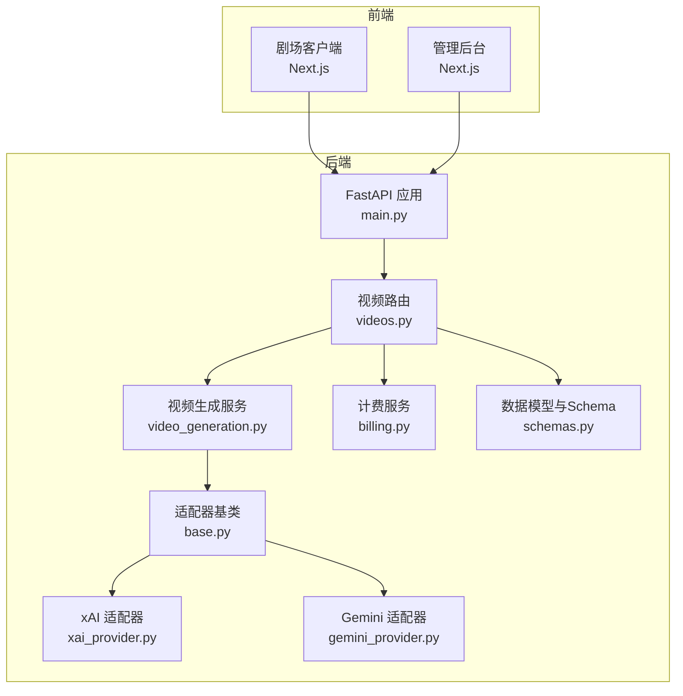
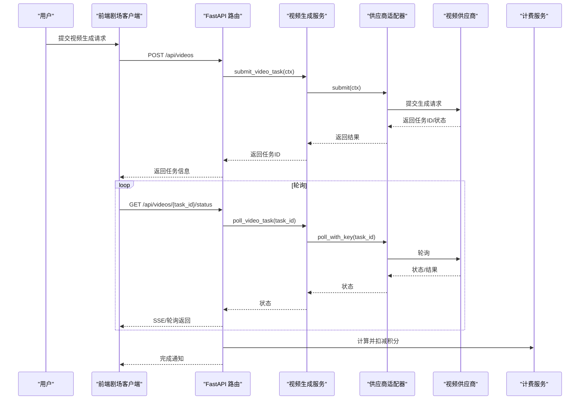
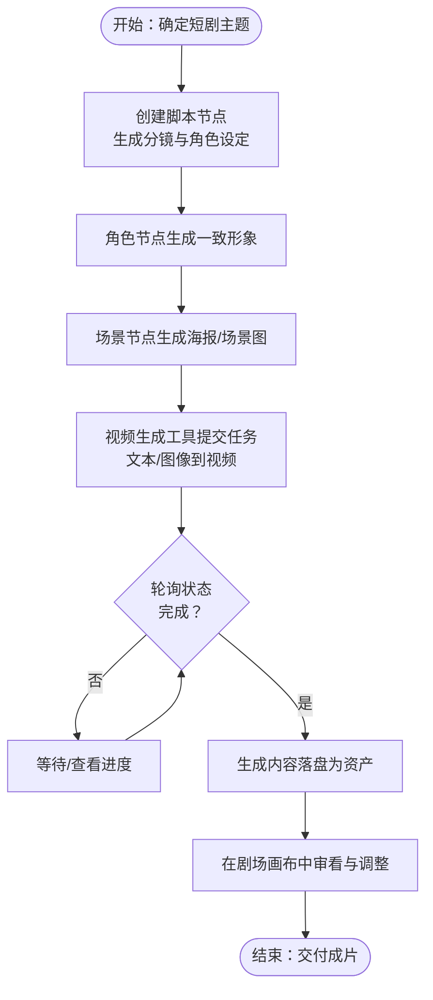
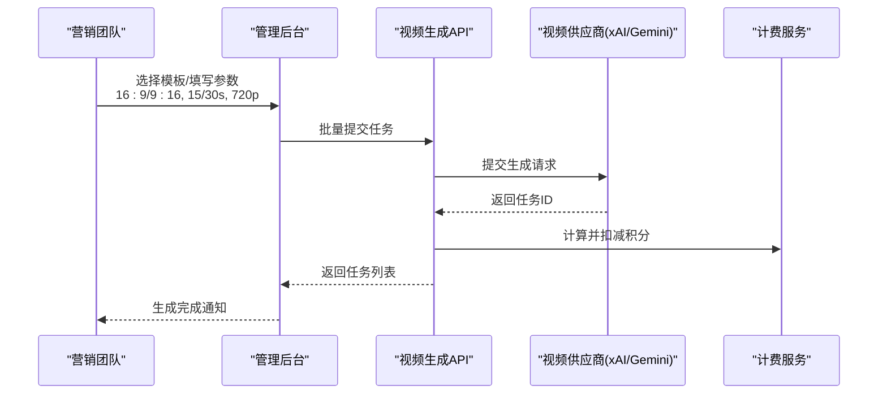
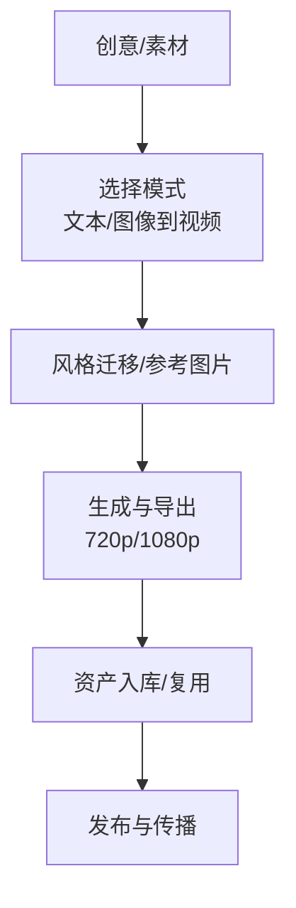
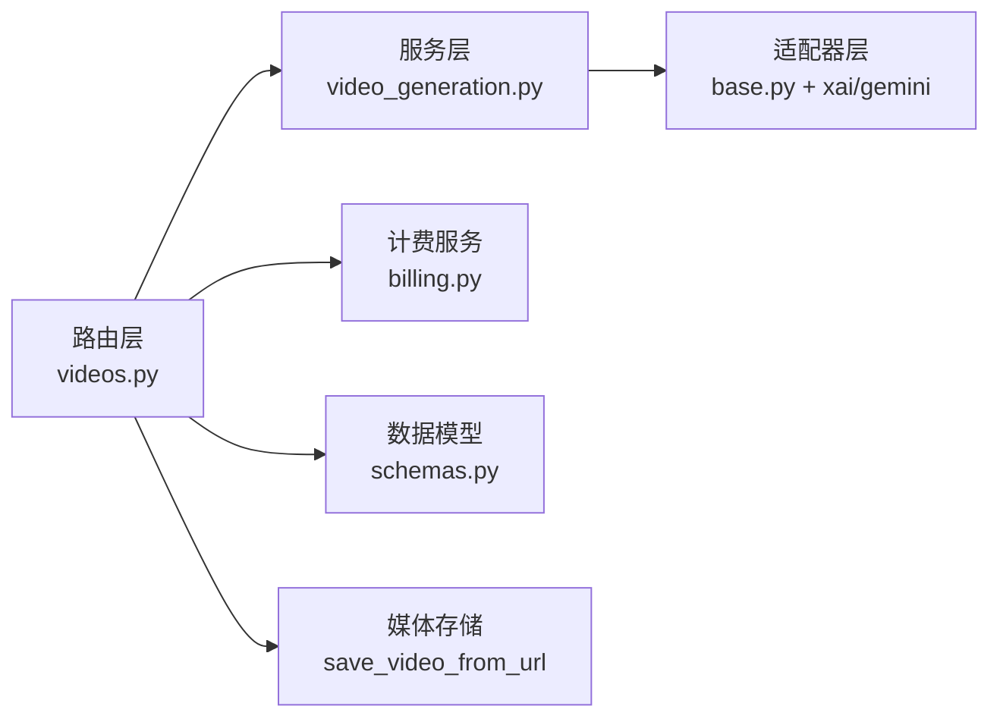

# 应用场景分析

<cite>
**本文引用的文件**
- [README.md](file://README.md)
- [main.py](file://backend/main.py)
- [layout.tsx](file://frontend/src/app/layout.tsx)
- [videos.py](file://backend/routers/videos.py)
- [video_generation.py](file://backend/services/video_generation.py)
- [video_gen.py](file://backend/services/tool_manager/providers/video_gen.py)
- [base.py](file://backend/services/video_providers/base.py)
- [xai_provider.py](file://backend/services/video_providers/xai_provider.py)
- [gemini_provider.py](file://backend/services/video_providers/gemini_provider.py)
- [schemas.py](file://backend/schemas.py)
- [billing.py](file://backend/services/billing.py)
- [VideoTaskCard.tsx](file://frontend/src/components/ai-assistant/VideoTaskCard.tsx)
- [page.tsx](file://backend/admin/src/app/admin/videos/new/page.tsx)
- [index.ts](file://backend/admin/src/types/index.ts)
- [GeminiVeo3.1视频生成模型文档.md](file://GeminiVeo3.1视频生成模型文档.md)
- [Grok视频生成模型文档.md](file://Grok视频生成模型文档.md)
</cite>

## 目录
1. [引言](#引言)
2. [项目结构](#项目结构)
3. [核心组件](#核心组件)
4. [架构总览](#架构总览)
5. [详细组件分析](#详细组件分析)
6. [依赖关系分析](#依赖关系分析)
7. [性能考量](#性能考量)
8. [故障排查指南](#故障排查指南)
9. [结论](#结论)
10. [附录](#附录)

## 引言
本文件面向KunFlix平台的三大用户群体，提供深入的应用场景分析与实操指导。围绕“影视创作者、广告与营销团队、企业与个人创作者”三类用户，结合平台的多模态生成、多供应商适配、技能工具与计费体系，系统阐述短剧/微短剧全流程创作、30秒/15秒竖屏广告一键生成、个人创意短视频升级等典型场景的使用流程、痛点解决与价值创造，并给出案例研究与效果对比，帮助潜在用户建立清晰的价值预期。

## 项目结构
KunFlix采用前后端分离架构：前端为Next.js剧场客户端，后端为FastAPI服务，提供统一的视频生成API与管理后台。平台通过多智能体与技能工具体系，将剧本、角色、视频生成、资产管理与计费闭环打通，形成“从创意到成片”的全链路能力。

图表来源
- [main.py:110-175](file://backend/main.py#L110-L175)
- [videos.py:24-344](file://backend/routers/videos.py#L24-L344)
- [video_generation.py:1-180](file://backend/services/video_generation.py#L1-L180)
- [base.py:15-121](file://backend/services/video_providers/base.py#L15-L121)
- [xai_provider.py:43-199](file://backend/services/video_providers/xai_provider.py#L43-L199)
- [gemini_provider.py:42-357](file://backend/services/video_providers/gemini_provider.py#L42-L357)
- [billing.py:353-387](file://backend/services/billing.py#L353-L387)
- [schemas.py:1-200](file://backend/schemas.py#L1-L200)

章节来源
- [README.md:22-334](file://README.md#L22-L334)
- [main.py:110-175](file://backend/main.py#L110-L175)
- [layout.tsx:23-42](file://frontend/src/app/layout.tsx#L23-L42)

## 核心组件
- 多供应商视频生成：统一入口对接xAI/Gemini/MiniMax/Ark等，屏蔽差异，支持文本/图像到视频、参考图片、视频编辑与扩展等模式。
- 技能工具与Agent协作：通过技能工具体系与多智能体编排，自动拆解创作任务，降低人工干预。
- 计费与资产：基于积分的精细化消费模型，自动计算视频生成成本，生成内容可作为资产复用。
- 剧场画布与节点：支持脚本、角色、分镜、视频节点的可视化创作与管理。

章节来源
- [README.md:203-234](file://README.md#L203-L234)
- [video_generation.py:14-22](file://backend/services/video_generation.py#L14-L22)
- [billing.py:24-36](file://backend/services/billing.py#L24-L36)
- [schemas.py:6-8](file://backend/schemas.py#L6-L8)

## 架构总览
KunFlix的视频生成链路从前端发起，经由FastAPI路由进入视频生成服务，再由适配器层对接具体供应商API，完成后端计费与资产落盘。前端通过WebSocket与SSE接收任务状态更新，最终在剧场画布中呈现。

图表来源
- [videos.py:75-234](file://backend/routers/videos.py#L75-L234)
- [video_generation.py:90-126](file://backend/services/video_generation.py#L90-L126)
- [xai_provider.py:62-149](file://backend/services/video_providers/xai_provider.py#L62-L149)
- [gemini_provider.py:100-321](file://backend/services/video_providers/gemini_provider.py#L100-L321)
- [billing.py:353-387](file://backend/services/billing.py#L353-L387)

## 详细组件分析

### 影视创作者场景：短剧/微短剧全流程创作
- 典型流程
  - 剧本创作：在剧场画布中创建脚本节点，AI辅助生成分镜与角色设定。
  - 角色与场景：角色节点生成一致形象，场景节点生成海报/场景图。
  - 视频生成：通过视频生成工具提交任务，支持文本到视频、图生视频、参考图片与视频扩展。
  - 成片与资产：完成后自动落盘为资产，便于复用与二次创作。
- 痛点解决
  - 降低制作门槛：无需专业设备与后期，一键生成高质量视频片段。
  - 提升协作效率：多智能体自动拆解任务，减少人工协调成本。
  - 保证一致性：角色与场景资产复用，确保风格统一。
- 价值创造
  - 显著缩短制作周期，提高内容产出频率。
  - 降低外包与设备成本，提升ROI。
  - 通过资产沉淀，形成可持续的内容资产池。

图表来源
- [video_gen.py:174-278](file://backend/services/tool_manager/providers/video_gen.py#L174-L278)
- [videos.py:150-234](file://backend/routers/videos.py#L150-L234)
- [VideoTaskCard.tsx:240-272](file://frontend/src/components/ai-assistant/VideoTaskCard.tsx#L240-L272)

章节来源
- [README.md:207-217](file://README.md#L207-L217)
- [video_gen.py:284-342](file://backend/services/tool_manager/providers/video_gen.py#L284-L342)
- [videos.py:75-148](file://backend/routers/videos.py#L75-L148)

### 广告与营销团队场景：30秒/15秒竖屏广告一键生成
- 典型流程
  - 短视频规格：选择16:9/9:16等竖屏比例，设定时长（如15/30秒）与分辨率。
  - 快速生成：输入品牌关键词/产品卖点，选择图生视频或文本到视频模式。
  - 批量生产：通过管理后台批量创建任务，统一模板与风格。
  - 效果追踪：通过计费与任务列表，追踪消耗与产出。
- 痛点解决
  - 快速响应：从创意到成片仅需几分钟，满足热点营销时效。
  - 规格统一：预设模板与参数，确保各平台竖屏适配。
  - 成本可控：积分计费与额度管理，避免超支风险。
- 价值创造
  - 提升营销内容的产出速度与覆盖面。
  - 降低对专业拍摄与剪辑的人力依赖。
  - 通过资产复用与模板化，提升品牌传播一致性。

图表来源
- [page.tsx:22-53](file://backend/admin/src/app/admin/videos/new/page.tsx#L22-L53)
- [index.ts:225-270](file://backend/admin/src/types/index.ts#L225-L270)
- [videos.py:75-148](file://backend/routers/videos.py#L75-L148)
- [billing.py:353-387](file://backend/services/billing.py#L353-L387)

章节来源
- [README.md:219-225](file://README.md#L219-L225)
- [GeminiVeo3.1视频生成模型文档.md:1614-1626](file://GeminiVeo3.1视频生成模型文档.md#L1614-L1626)
- [Grok视频生成模型文档.md:1-26](file://Grok视频生成模型文档.md#L1-26)

### 企业与个人创作者场景：个人创意短视频升级
- 典型流程
  - 创意升级：将现有Vlog/短视频素材通过图生视频或参考图片增强表现力。
  - 风格迁移：利用供应商能力进行风格迁移，打造独特视觉语言。
  - 专业级输出：通过更高的分辨率与时长，提升观看体验与传播效果。
- 痛点解决
  - 降本增效：无需昂贵设备，即可获得专业级视频效果。
  - 个性化表达：风格迁移与多模态输入，满足多样化创意需求。
  - 资产沉淀：生成内容可长期保存与复用，形成个人/企业内容资产。
- 价值创造
  - 提升内容质量与观众粘性。
  - 降低创作门槛，扩大创作者规模。
  - 通过资产复用，形成可持续的内容生产能力。

图表来源
- [video_gen.py:77-154](file://backend/services/tool_manager/providers/video_gen.py#L77-L154)
- [base.py:15-54](file://backend/services/video_providers/base.py#L15-L54)

章节来源
- [README.md:226-232](file://README.md#L226-L232)
- [video_gen.py:174-278](file://backend/services/tool_manager/providers/video_gen.py#L174-L278)

## 依赖关系分析
- 组件耦合
  - 路由层与服务层：路由负责鉴权与参数校验，服务层负责任务提交与轮询。
  - 服务层与适配器层：通过统一上下文与结果对象屏蔽供应商差异。
  - 计费服务：独立于生成流程，按维度映射表驱动计费，避免分支膨胀。
- 外部依赖
  - xAI/Gemini等第三方视频生成API，状态轮询与下载策略因供应商而异。
  - 媒体存储：生成完成后统一保存至本地媒体目录，便于播放与复用。

图表来源
- [videos.py:24-344](file://backend/routers/videos.py#L24-L344)
- [video_generation.py:14-22](file://backend/services/video_generation.py#L14-L22)
- [base.py:56-121](file://backend/services/video_providers/base.py#L56-L121)
- [billing.py:24-36](file://backend/services/billing.py#L24-L36)

章节来源
- [videos.py:27-73](file://backend/routers/videos.py#L27-L73)
- [video_generation.py:50-82](file://backend/services/video_generation.py#L50-L82)

## 性能考量
- 异步与轮询：视频生成为异步任务，采用轮询与SSE推送相结合的方式，避免阻塞主线程。
- 超时与重试：轮询失败与超时保护，防止长时间挂起；迁移失败后清理临时表并重试。
- 成本控制：按维度映射表计算积分，避免硬编码分支；支持快速预处理与提示词优化等加速选项。
- 前端体验：任务卡片展示生成进度与预计耗时，提升用户感知与满意度。

章节来源
- [main.py:49-108](file://backend/main.py#L49-L108)
- [videos.py:170-234](file://backend/routers/videos.py#L170-L234)
- [billing.py:24-36](file://backend/services/billing.py#L24-L36)

## 故障排查指南
- 常见问题
  - 任务长时间pending：检查供应商API状态与配额；确认轮询Key正确。
  - 生成失败：查看内容审核拒绝或供应商错误信息；核对输入参数与模型能力。
  - 积分不足：确认账户余额与模型费率；检查计费维度与额度。
- 排查步骤
  - 后端日志：关注DebugAuth中间件与供应商适配器日志。
  - 任务状态：通过/status接口轮询，观察状态变化与错误信息。
  - 计费明细：核对任务元数据与计费映射表，定位异常项。

章节来源
- [main.py:119-128](file://backend/main.py#L119-L128)
- [xai_provider.py:174-199](file://backend/services/video_providers/xai_provider.py#L174-L199)
- [gemini_provider.py:295-321](file://backend/services/video_providers/gemini_provider.py#L295-L321)
- [billing.py:353-387](file://backend/services/billing.py#L353-L387)

## 结论
KunFlix通过多供应商视频生成、技能工具与多智能体编排、精细化计费与资产管理体系，为影视创作者、广告与营销团队、企业与个人创作者提供了“从创意到成片”的全链路解决方案。平台在效率、成本与质量方面均具备显著优势，适合快速迭代与规模化生产的各类内容场景。

## 附录
- 快速开始与访问地址
  - 剧场客户端：http://localhost:3000
  - 管理后台：http://localhost:3001
  - API文档：http://localhost:8000/docs
- 场景对照表
  - 影视创作者：短剧/微短剧全流程创作
  - 广告与营销团队：30秒/15秒竖屏广告一键生成
  - 企业与个人创作者：个人创意短视频升级

章节来源
- [README.md:195-202](file://README.md#L195-L202)