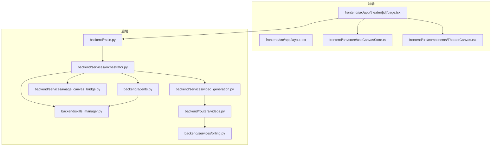
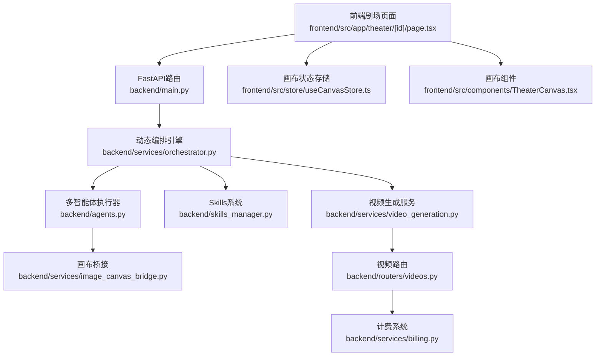
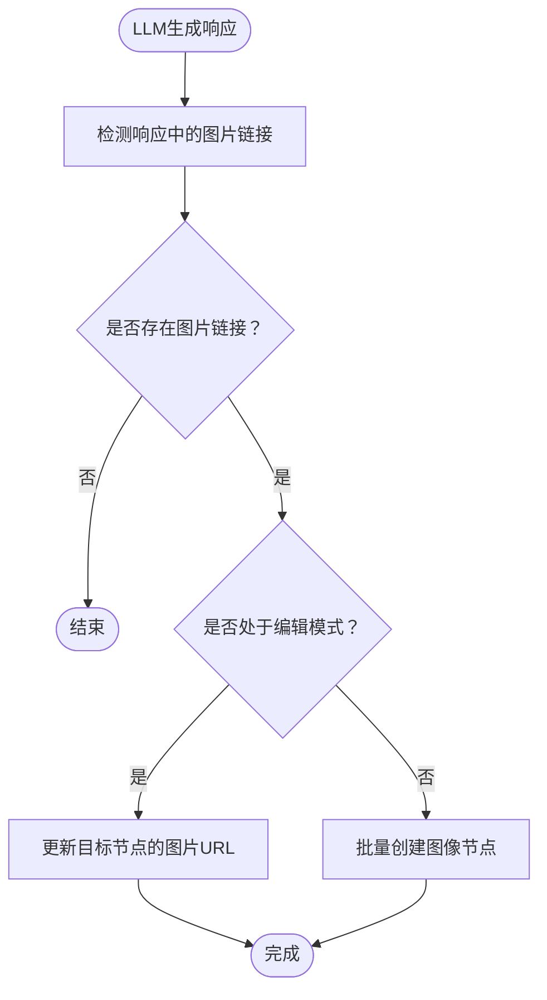
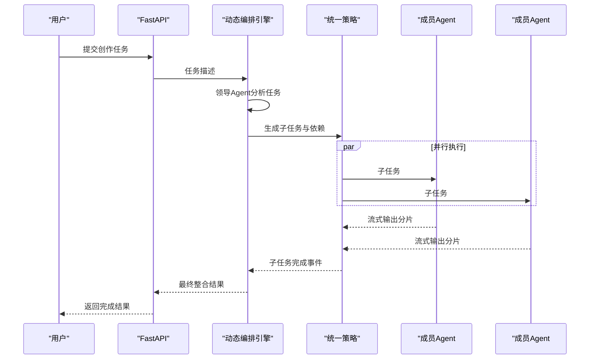
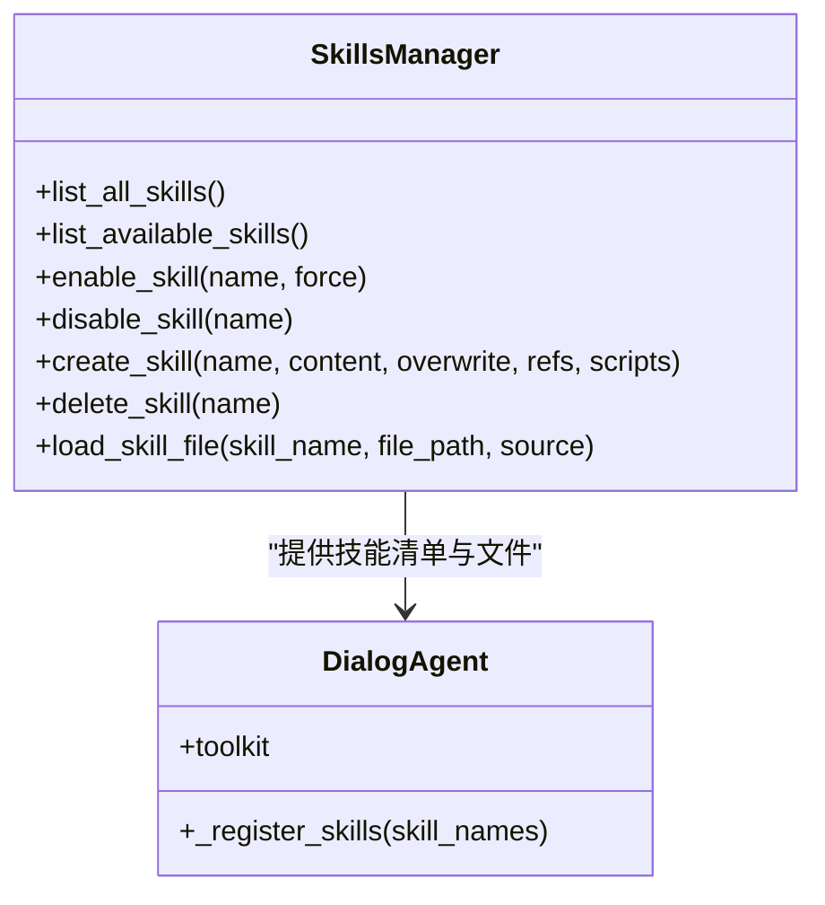
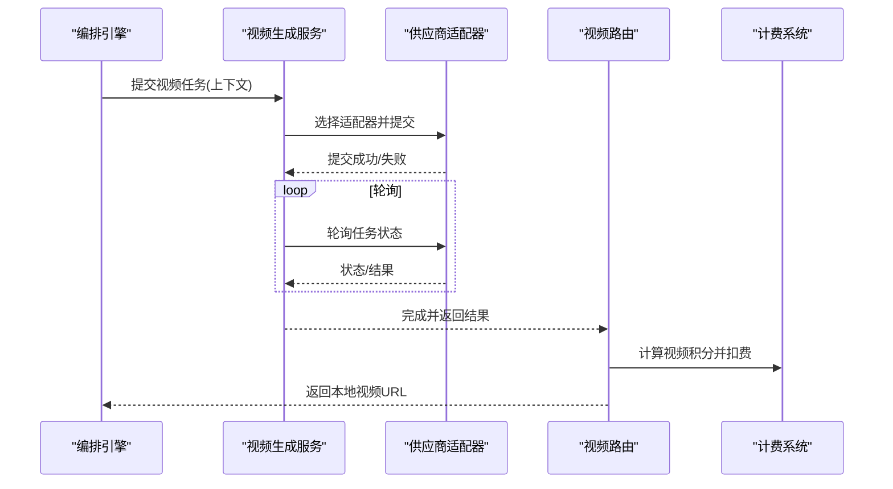
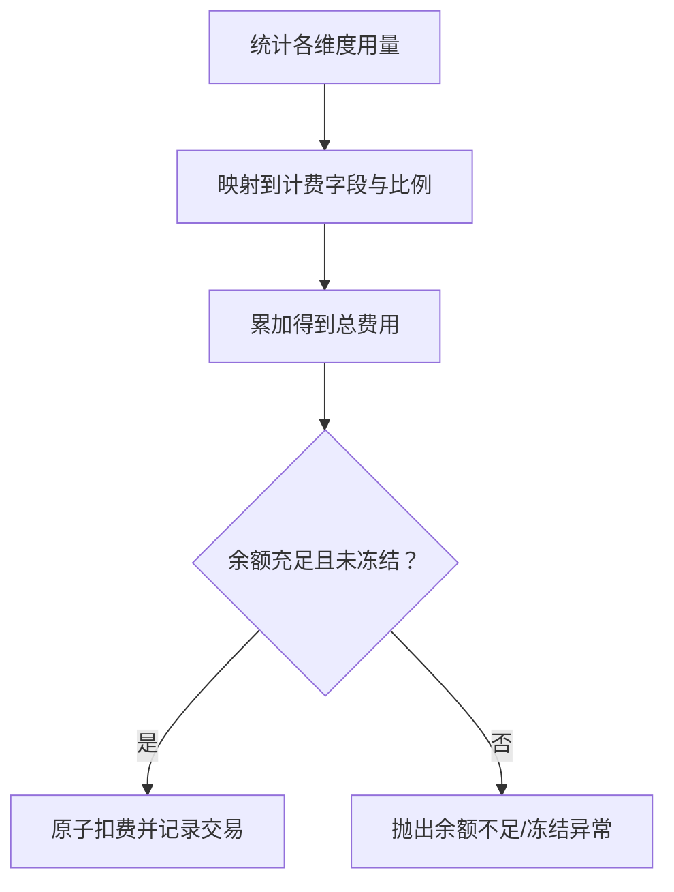
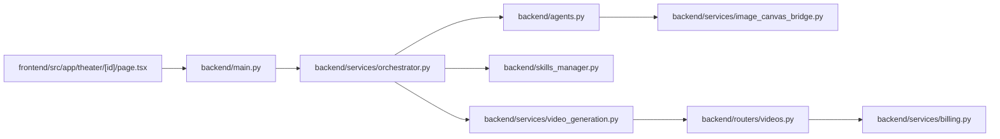

# 影视创作者场景

<cite>
**本文引用的文件**
- [README.md](file://README.md)
- [backend/main.py](file://backend/main.py)
- [frontend/src/app/layout.tsx](file://frontend/src/app/layout.tsx)
- [backend/services/orchestrator.py](file://backend/services/orchestrator.py)
- [backend/agents.py](file://backend/agents.py)
- [backend/skills_manager.py](file://backend/skills_manager.py)
- [backend/skills/builtin_skills/canvas_tools/SKILL.md](file://backend/skills/builtin_skills/canvas_tools/SKILL.md)
- [backend/skills/active_skills/canvas_tools/SKILL.md](file://backend/skills/active_skills/canvas_tools/SKILL.md)
- [backend/services/image_canvas_bridge.py](file://backend/services/image_canvas_bridge.py)
- [backend/services/video_generation.py](file://backend/services/video_generation.py)
- [backend/routers/videos.py](file://backend/routers/videos.py)
- [backend/services/billing.py](file://backend/services/billing.py)
- [frontend/src/app/theater/[id]/page.tsx](file://frontend/src/app/theater/[id]/page.tsx)
- [frontend/src/store/useCanvasStore.ts](file://frontend/src/store/useCanvasStore.ts)
- [frontend/src/components/TheaterCanvas.tsx](file://frontend/src/components/TheaterCanvas.tsx)
- [backend/admin/src/app/admin/skills/page.tsx](file://backend/admin/src/app/admin/skills/page.tsx)
- [backend/admin/src/app/admin/skills/SkillDialog.tsx](file://backend/admin/src/app/admin/skills/SkillDialog.tsx)
</cite>

## 目录
1. [简介](#简介)
2. [项目结构](#项目结构)
3. [核心组件](#核心组件)
4. [架构总览](#架构总览)
5. [详细组件分析](#详细组件分析)
6. [依赖关系分析](#依赖关系分析)
7. [性能考量](#性能考量)
8. [故障排查指南](#故障排查指南)
9. [结论](#结论)
10. [附录](#附录)

## 简介
本文件面向影视创作者场景，围绕短剧/微短剧、广告片、MV与动画短片的创作需求，系统解析平台如何通过“无限画布”“多Agent协作”“Skills可扩展系统”三大支柱，实现从剧本到成片的全链路自动化与可视化协同。平台提供：
- 无限画布：以节点化方式组织剧本、角色、分镜与视频片段，支持拖拽、连线与实时编辑
- 多Agent协作：由“领导Agent”对复杂任务进行一次性分析与子任务分解，成员Agent并行执行，最终由领导Agent整合与审核
- Skills系统：内置与可定制的技能包，覆盖角色一致性、视频风格迁移、多语言配音等，支持热插拔与版本化管理

平台同时提供统一的视频生成服务与计费系统，保障创作效率、成本控制与质量稳定。

## 项目结构
后端采用FastAPI + AgentScope多智能体框架，前端基于Next.js，管理后台使用Next.js，数据库迁移与模型定义位于后端，资源与媒体文件统一存放于后端media目录。

图表来源
- [backend/main.py:110-175](file://backend/main.py#L110-L175)
- [backend/services/orchestrator.py:418-534](file://backend/services/orchestrator.py#L418-L534)
- [backend/agents.py:40-114](file://backend/agents.py#L40-L114)
- [backend/skills_manager.py:228-231](file://backend/skills_manager.py#L228-L231)
- [backend/services/image_canvas_bridge.py:29-63](file://backend/services/image_canvas_bridge.py#L29-L63)
- [backend/services/video_generation.py:90-126](file://backend/services/video_generation.py#L90-L126)
- [backend/routers/videos.py:187-216](file://backend/routers/videos.py#L187-L216)
- [backend/services/billing.py:310-350](file://backend/services/billing.py#L310-L350)
- [frontend/src/app/layout.tsx:18-42](file://frontend/src/app/layout.tsx#L18-L42)
- [frontend/src/app/theater/[id]/page.tsx:22-72](file://frontend/src/app/theater/[id]/page.tsx#L22-L72)
- [frontend/src/store/useCanvasStore.ts:26-155](file://frontend/src/store/useCanvasStore.ts#L26-L155)
- [frontend/src/components/TheaterCanvas.tsx:10-47](file://frontend/src/components/TheaterCanvas.tsx#L10-L47)

章节来源
- [README.md:22-119](file://README.md#L22-L119)
- [backend/main.py:110-175](file://backend/main.py#L110-L175)
- [frontend/src/app/layout.tsx:18-42](file://frontend/src/app/layout.tsx#L18-L42)

## 核心组件
- 动态编排引擎：负责任务分析、子任务分解、并行/串行调度与最终整合，支持实时事件流输出
- 多智能体执行器：封装Agent调用、上下文记忆压缩、工具注册与MCP客户端接入
- Skills系统：内置/定制化技能的加载、启用/禁用与文件读取，支持路径校验与版本化
- 画布桥接：将LLM生成的图片链接自动转换为画布节点，支持编辑模式更新与批量创建
- 视频生成服务：统一适配多家视频模型，提供提交、轮询与结果处理
- 计费系统：多维度计费映射表，支持文本、图像、搜索与视频等维度的原子扣费与退款

章节来源
- [backend/services/orchestrator.py:418-534](file://backend/services/orchestrator.py#L418-L534)
- [backend/agents.py:40-114](file://backend/agents.py#L40-L114)
- [backend/skills_manager.py:228-368](file://backend/skills_manager.py#L228-L368)
- [backend/services/image_canvas_bridge.py:29-119](file://backend/services/image_canvas_bridge.py#L29-L119)
- [backend/services/video_generation.py:90-180](file://backend/services/video_generation.py#L90-L180)
- [backend/services/billing.py:310-388](file://backend/services/billing.py#L310-L388)

## 架构总览
平台采用“前端可视化画布 + 后端多Agent编排 + Skills工具 + 统一视频生成与计费”的分层架构。前端通过Next.js渲染剧场画布，后端通过FastAPI提供API与WebSocket，动态编排引擎根据任务复杂度决定简单直返或复杂子任务并行执行，Skills系统贯穿Agent工具注册与画布操作，视频生成服务与计费系统贯穿创作链路的最终交付阶段。

图表来源
- [backend/main.py:138-154](file://backend/main.py#L138-L154)
- [backend/services/orchestrator.py:418-534](file://backend/services/orchestrator.py#L418-L534)
- [backend/agents.py:40-114](file://backend/agents.py#L40-L114)
- [backend/skills_manager.py:228-368](file://backend/skills_manager.py#L228-L368)
- [backend/services/image_canvas_bridge.py:29-119](file://backend/services/image_canvas_bridge.py#L29-L119)
- [backend/services/video_generation.py:90-180](file://backend/services/video_generation.py#L90-L180)
- [backend/routers/videos.py:187-216](file://backend/routers/videos.py#L187-L216)
- [backend/services/billing.py:310-388](file://backend/services/billing.py#L310-L388)
- [frontend/src/app/theater/[id]/page.tsx:22-72](file://frontend/src/app/theater/[id]/page.tsx#L22-L72)
- [frontend/src/store/useCanvasStore.ts:26-155](file://frontend/src/store/useCanvasStore.ts#L26-L155)
- [frontend/src/components/TheaterCanvas.tsx:10-47](file://frontend/src/components/TheaterCanvas.tsx#L10-L47)

## 详细组件分析

### 无限画布与节点化工作流
- 节点类型与数据模型：支持文本、图像、分镜与视频节点，前端Store与后端模型双向映射，确保节点创建、更新与连线持久化
- 画布桥接：当LLM响应中出现生成图片链接时，自动创建或更新画布图像节点，实现“所见即所得”的素材落盘
- 剧场页面与组件：剧场页面聚合脚本、角色、分镜与视频节点，配合缩放、自动布局与快捷菜单，形成完整的创作工作台

图表来源
- [backend/services/image_canvas_bridge.py:29-119](file://backend/services/image_canvas_bridge.py#L29-L119)
- [frontend/src/store/useCanvasStore.ts:120-155](file://frontend/src/store/useCanvasStore.ts#L120-L155)
- [frontend/src/app/theater/[id]/page.tsx:22-72](file://frontend/src/app/theater/[id]/page.tsx#L22-L72)

章节来源
- [frontend/src/store/useCanvasStore.ts:26-155](file://frontend/src/store/useCanvasStore.ts#L26-L155)
- [backend/services/image_canvas_bridge.py:29-119](file://backend/services/image_canvas_bridge.py#L29-L119)
- [frontend/src/app/theater/[id]/page.tsx:22-72](file://frontend/src/app/theater/[id]/page.tsx#L22-L72)

### 多Agent协作与任务编排
- 任务分析：领导Agent一次性分析任务，判定为简单任务则直接返回高质量回复；复杂任务则分解为若干子任务并标注依赖关系
- 统一策略：根据依赖关系构建有向无环图，同一层级的子任务并行执行，单个子任务采用流式输出；完成后由领导Agent进行整合与可选审核
- 事件流：通过Server-Sent Events向前端推送子任务开始、分片、完成与失败事件，便于前端实时反馈

图表来源
- [backend/services/orchestrator.py:418-534](file://backend/services/orchestrator.py#L418-L534)
- [backend/services/orchestrator.py:231-366](file://backend/services/orchestrator.py#L231-L366)

章节来源
- [backend/services/orchestrator.py:418-534](file://backend/services/orchestrator.py#L418-L534)
- [backend/agents.py:40-114](file://backend/agents.py#L40-L114)

### Skills系统与可扩展工具
- 技能加载：启动时同步内置与定制化技能至活跃目录，Agent在初始化时按需注册技能工具
- 技能管理：支持启用/禁用、创建/删除、文件读取与路径校验，防止路径穿越，确保安全性
- 画布工具：内置/活跃画布技能提供列表、获取、创建、更新、删除节点等工具，支撑画布节点的全生命周期管理

图表来源
- [backend/skills_manager.py:228-368](file://backend/skills_manager.py#L228-L368)
- [backend/agents.py:85-114](file://backend/agents.py#L85-L114)

章节来源
- [backend/skills_manager.py:228-368](file://backend/skills_manager.py#L228-L368)
- [backend/agents.py:85-114](file://backend/agents.py#L85-L114)
- [backend/skills/builtin_skills/canvas_tools/SKILL.md:44-97](file://backend/skills/builtin_skills/canvas_tools/SKILL.md#L44-L97)
- [backend/skills/active_skills/canvas_tools/SKILL.md:48-108](file://backend/skills/active_skills/canvas_tools/SKILL.md#L48-L108)

### 视频生成与多模态处理
- 供应商适配：统一入口根据供应商类型选择适配器，支持xAI、MiniMax、Gemini、Ark等
- 提交与轮询：提交任务后异步轮询，部分供应商需要额外获取视频URL；完成后进行本地保存与计费
- 多模态落地：视频生成结果与图片生成结果一致地通过画布桥接进入画布，形成“文本→角色→视频→成片”的闭环

图表来源
- [backend/services/video_generation.py:90-180](file://backend/services/video_generation.py#L90-L180)
- [backend/routers/videos.py:187-216](file://backend/routers/videos.py#L187-L216)
- [backend/services/billing.py:353-387](file://backend/services/billing.py#L353-L387)

章节来源
- [backend/services/video_generation.py:90-180](file://backend/services/video_generation.py#L90-L180)
- [backend/routers/videos.py:187-216](file://backend/routers/videos.py#L187-L216)
- [backend/services/billing.py:353-387](file://backend/services/billing.py#L353-L387)

### 计费系统与成本控制
- 多维度计费：文本输入/输出、图像输出、搜索次数、图像生成等维度，映射表驱动，避免分支判断
- 视频计费：按输入图片/秒与输出分辨率（480p/720p）维度计费，结合供应商模型费率计算
- 原子扣费：使用UPDATE ... WHERE确保并发安全，支持余额冻结检查与退款

图表来源
- [backend/services/billing.py:14-35](file://backend/services/billing.py#L14-L35)
- [backend/services/billing.py:310-350](file://backend/services/billing.py#L310-L350)
- [backend/services/billing.py:353-387](file://backend/services/billing.py#L353-L387)
- [backend/services/billing.py:178-288](file://backend/services/billing.py#L178-L288)

章节来源
- [backend/services/billing.py:14-35](file://backend/services/billing.py#L14-L35)
- [backend/services/billing.py:310-350](file://backend/services/billing.py#L310-L350)
- [backend/services/billing.py:353-387](file://backend/services/billing.py#L353-L387)
- [backend/services/billing.py:178-288](file://backend/services/billing.py#L178-L288)

## 依赖关系分析
- 前端依赖后端API与WebSocket，剧场页面通过状态存储与画布组件实现交互
- 后端路由注册与中间件配置确保跨域与认证调试可见性
- 编排引擎依赖Agent执行器与Skills系统，画布桥接与视频生成服务贯穿创作链路
- 计费系统与视频路由强耦合，确保视频任务完成后准确计费

图表来源
- [backend/main.py:138-154](file://backend/main.py#L138-L154)
- [backend/services/orchestrator.py:418-534](file://backend/services/orchestrator.py#L418-L534)
- [backend/agents.py:40-114](file://backend/agents.py#L40-L114)
- [backend/skills_manager.py:228-368](file://backend/skills_manager.py#L228-L368)
- [backend/services/image_canvas_bridge.py:29-119](file://backend/services/image_canvas_bridge.py#L29-L119)
- [backend/services/video_generation.py:90-180](file://backend/services/video_generation.py#L90-L180)
- [backend/routers/videos.py:187-216](file://backend/routers/videos.py#L187-L216)
- [backend/services/billing.py:310-388](file://backend/services/billing.py#L310-L388)

章节来源
- [backend/main.py:138-154](file://backend/main.py#L138-L154)
- [frontend/src/app/theater/[id]/page.tsx:22-72](file://frontend/src/app/theater/[id]/page.tsx#L22-L72)

## 性能考量
- 并行执行：统一策略对同一层级的子任务采用并行执行，显著缩短复杂任务的总耗时
- 流式输出：子任务采用流式输出，前端可即时看到中间结果，提升交互体验
- 内存压缩：Agent在回复前触发记忆压缩钩子，减少上下文长度，提高推理效率
- 计费映射表：通过映射表驱动计费，避免条件分支，降低CPU开销

## 故障排查指南
- 任务失败：查看编排引擎事件流中的失败事件，定位具体子任务与错误信息
- 余额不足/冻结：检查计费系统抛出的异常，确认用户余额与冻结状态
- 视频生成超时：确认供应商适配器轮询参数与供应商可用性，必要时更换供应商
- 画布节点异常：检查画布桥接是否正确识别图片链接，确认编辑模式下的目标节点存在

章节来源
- [backend/services/orchestrator.py:521-534](file://backend/services/orchestrator.py#L521-L534)
- [backend/services/billing.py:258-288](file://backend/services/billing.py#L258-L288)
- [backend/services/image_canvas_bridge.py:66-87](file://backend/services/image_canvas_bridge.py#L66-L87)

## 结论
平台通过“无限画布+多Agent协作+Skills系统”的组合拳，将复杂的影视创作流程标准化、自动化与可视化。动态编排引擎将创作任务拆解为可并行执行的子任务，Skills系统提供可扩展的工具集，画布桥接与视频生成服务确保素材与产出的无缝衔接，计费系统则保障成本可控。对于短剧/微短剧、广告片、MV与动画短片等场景，平台能够显著提升创作效率、降低制作成本并保证作品质量。

## 附录
- 技能管理后台：支持技能的创建、启用/禁用与刷新，便于运营与开发者维护
- 技能文件规范：SKILL.md作为技能元数据入口，支持描述、版本与脚本/引用文件树

章节来源
- [backend/admin/src/app/admin/skills/page.tsx:37-111](file://backend/admin/src/app/admin/skills/page.tsx#L37-L111)
- [backend/admin/src/app/admin/skills/SkillDialog.tsx:44-92](file://backend/admin/src/app/admin/skills/SkillDialog.tsx#L44-L92)
- [backend/skills_manager.py:304-368](file://backend/skills_manager.py#L304-L368)