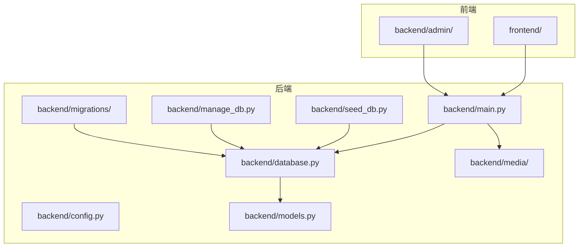
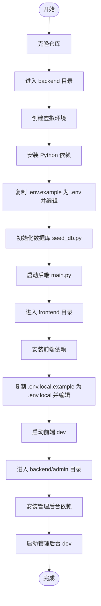
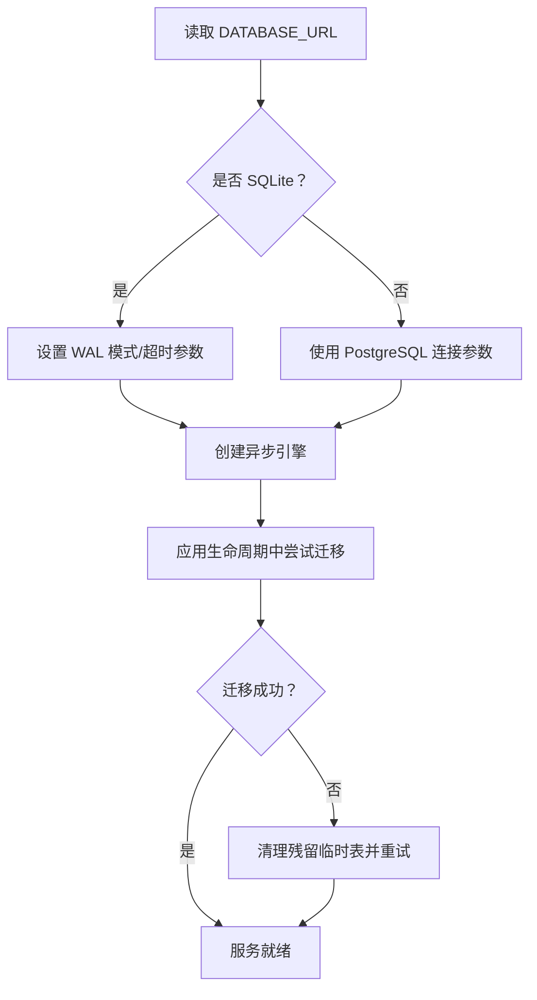
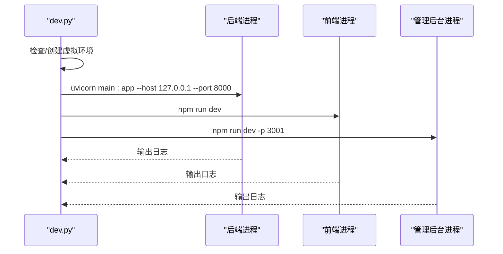
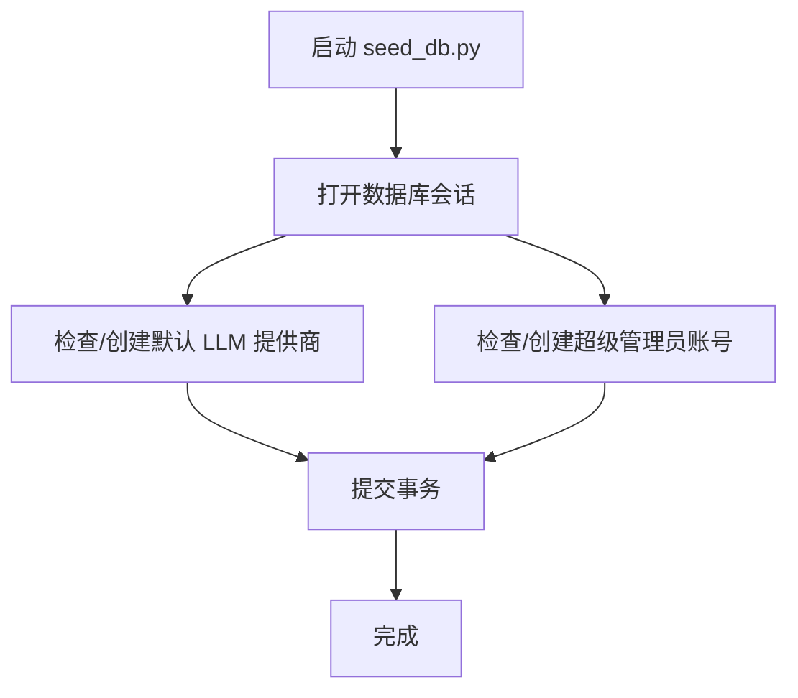
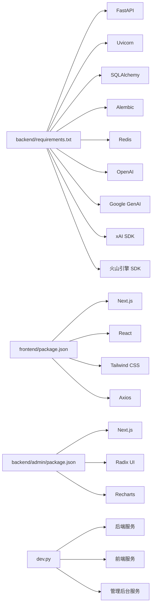

# 快速开始指南

<cite>
**本文引用的文件**
- [README.md](file://README.md)
- [dev.py](file://dev.py)
- [backend/main.py](file://backend/main.py)
- [backend/config.py](file://backend/config.py)
- [backend/database.py](file://backend/database.py)
- [backend/models.py](file://backend/models.py)
- [backend/requirements.txt](file://backend/requirements.txt)
- [backend/seed_db.py](file://backend/seed_db.py)
- [backend/manage_db.py](file://backend/manage_db.py)
- [backend/.env.example](file://backend/.env.example)
- [frontend/package.json](file://frontend/package.json)
- [frontend/next.config.ts](file://frontend/next.config.ts)
- [backend/admin/package.json](file://backend/admin/package.json)
</cite>

## 目录
1. [简介](#简介)
2. [项目结构](#项目结构)
3. [核心组件](#核心组件)
4. [架构总览](#架构总览)
5. [详细组件分析](#详细组件分析)
6. [依赖关系分析](#依赖关系分析)
7. [性能考虑](#性能考虑)
8. [故障排除指南](#故障排除指南)
9. [结论](#结论)
10. [附录](#附录)

## 简介
本指南面向首次接触 KunFlix 平台的新用户，提供从零开始的完整安装与部署流程，涵盖环境准备、依赖安装、数据库配置与服务器启动。文档同时给出系统要求（Python 3.10+、Node.js 20+、SQLite/PostgreSQL）、跨平台（Windows/macOS/Linux）安装步骤、常见问题排查、首次运行验证与基础功能演示，帮助你在最短时间内成功运行平台并体验核心功能。

## 项目结构
KunFlix 采用前后端分离架构，包含后端 FastAPI 服务、前端剧场客户端、管理后台以及数据库迁移与初始化工具。核心目录与职责如下：
- backend：后端服务（FastAPI + SQLAlchemy 异步 ORM + Alembic 迁移）
- frontend：剧场客户端前端（Next.js）
- backend/admin：管理后台前端（Next.js）
- backend/migrations：数据库迁移脚本
- backend/media：媒体资源存储目录
- backend/seed_db.py：初始数据种子脚本
- backend/manage_db.py：数据库迁移管理命令行工具



**图表来源**
- [backend/main.py:110-175](file://backend/main.py#L110-L175)
- [backend/config.py:7-43](file://backend/config.py#L7-L43)
- [backend/database.py:1-45](file://backend/database.py#L1-L45)
- [backend/models.py:1-503](file://backend/models.py#L1-L503)
- [backend/seed_db.py:21-64](file://backend/seed_db.py#L21-L64)
- [backend/manage_db.py:20-80](file://backend/manage_db.py#L20-L80)

**章节来源**
- [README.md:266-278](file://README.md#L266-L278)

## 核心组件
- 后端服务入口与生命周期管理：负责数据库连接重试、迁移执行、媒体目录初始化、路由注册与中间件配置。
- 配置系统：统一管理数据库连接、Redis、AI 服务密钥、JWT 密钥、运行模式等。
- 数据库与模型：支持 SQLite（开发）与 PostgreSQL（生产），通过 SQLAlchemy 异步引擎与 Alembic 迁移。
- 开发一键启动：dev.py 提供后端虚拟环境、依赖安装与三个服务并行启动。
- 前端与管理后台：前端通过反向代理转发 /api 请求到后端；管理后台独立运行于 3001 端口。

**章节来源**
- [backend/main.py:49-108](file://backend/main.py#L49-L108)
- [backend/config.py:7-43](file://backend/config.py#L7-L43)
- [backend/database.py:9-37](file://backend/database.py#L9-L37)
- [dev.py:94-169](file://dev.py#L94-L169)
- [frontend/next.config.ts:10-17](file://frontend/next.config.ts#L10-L17)
- [backend/admin/package.json:5-10](file://backend/admin/package.json#L5-L10)

## 架构总览
KunFlix 的系统组件围绕“智能代理引擎 + Skills 插件 + 多模态处理 + 实时通信层 + 计费与可视化 + 资产管理 + 第三方集成”展开。后端提供 REST/WebSocket 接口，前端通过 Next.js 提供交互界面，管理后台独立开发与运行。

```mermaid
graph TB
subgraph "客户端"
THEATER["剧场客户端<br/>frontend/"]
ADMINUI["管理后台<br/>backend/admin/"]
end
subgraph "后端服务"
API["FastAPI 应用<br/>backend/main.py"]
ROUTERS["路由模块<br/>routers/*"]
SERVICES["业务服务<br/>services/*"]
AGENTS["代理引擎<br/>agents.py"]
WS["WebSocket 通道"]
end
subgraph "基础设施"
DB["数据库<br/>SQLite/PostgreSQL"]
REDIS["缓存/队列<br/>Redis"]
MEDIA["媒体存储<br/>backend/media/"]
end
THEATER --> API
ADMINUI --> API
API --> ROUTERS
ROUTERS --> SERVICES
SERVICES --> AGENTS
API <- --> WS
API --> DB
API --> REDIS
SERVICES --> MEDIA
```

**图表来源**
- [backend/main.py:138-153](file://backend/main.py#L138-L153)
- [backend/main.py:161-171](file://backend/main.py#L161-L171)
- [backend/database.py:9-19](file://backend/database.py#L9-L19)

## 详细组件分析

### 系统要求与兼容性
- Python：3.10+
- Node.js：20+（前端与管理后台）
- 数据库：SQLite（开发默认）/ PostgreSQL（生产推荐）
- 操作系统：Windows、macOS、Linux 均可运行

**章节来源**
- [README.md:135-139](file://README.md#L135-L139)
- [backend/requirements.txt:1-29](file://backend/requirements.txt#L1-L29)
- [frontend/package.json:13-94](file://frontend/package.json#L13-L94)

### 环境准备与依赖安装
- 克隆仓库并进入根目录
- 后端：创建虚拟环境、安装依赖、复制并编辑 .env
- 前端：安装依赖、复制并编辑 .env.local
- 管理后台：安装依赖并运行



**图表来源**
- [README.md:143-187](file://README.md#L143-L187)
- [backend/seed_db.py:21-64](file://backend/seed_db.py#L21-L64)
- [backend/main.py:173-175](file://backend/main.py#L173-L175)

**章节来源**
- [README.md:141-187](file://README.md#L141-L187)

### 数据库配置与迁移
- 默认使用 SQLite（绝对路径），可在 .env 中切换 PostgreSQL
- 首次启动时可选择是否自动执行迁移（settings.RUN_MIGRATIONS）
- 提供 manage_db.py 作为迁移管理工具，支持 migrate/upgrade/downgrade/seed



**图表来源**
- [backend/config.py:15-16](file://backend/config.py#L15-L16)
- [backend/database.py:24-31](file://backend/database.py#L24-L31)
- [backend/main.py:49-108](file://backend/main.py#L49-L108)
- [backend/manage_db.py:20-38](file://backend/manage_db.py#L20-L38)

**章节来源**
- [backend/config.py:15-16](file://backend/config.py#L15-L16)
- [backend/database.py:9-37](file://backend/database.py#L9-L37)
- [backend/main.py:49-108](file://backend/main.py#L49-L108)
- [backend/manage_db.py:20-38](file://backend/manage_db.py#L20-L38)

### 一键启动与并行服务
dev.py 提供一键安装与启动能力：自动创建后端虚拟环境、安装依赖，随后并行启动后端、前端与管理后台三类服务，并实时输出日志。



**图表来源**
- [dev.py:94-169](file://dev.py#L94-L169)
- [backend/main.py:173-175](file://backend/main.py#L173-L175)
- [frontend/package.json:5-12](file://frontend/package.json#L5-L12)
- [backend/admin/package.json:5-10](file://backend/admin/package.json#L5-L10)

**章节来源**
- [dev.py:94-169](file://dev.py#L94-L169)

### 初始数据与默认账号
seed_db.py 在数据库中创建默认 LLM 提供商与超级管理员账号，便于首次登录与功能验证。



**图表来源**
- [backend/seed_db.py:21-64](file://backend/seed_db.py#L21-L64)

**章节来源**
- [backend/seed_db.py:21-64](file://backend/seed_db.py#L21-L64)

### 首次运行验证与基础功能演示
- 访问地址
  - 剧场客户端：http://localhost:3000
  - 管理后台：http://localhost:3001
  - API 文档：http://localhost:8000/docs
- 登录管理后台后，可进行以下验证：
  - 查看默认管理员账号是否存在并可登录
  - 创建/查看智能体与提示词模板
  - 生成测试内容（图片/视频）并检查媒体目录
  - 通过 WebSocket 通道进行消息收发测试

**章节来源**
- [README.md:195-202](file://README.md#L195-L202)
- [backend/seed_db.py:41-56](file://backend/seed_db.py#L41-L56)
- [backend/main.py:156-171](file://backend/main.py#L156-L171)

## 依赖关系分析
后端依赖主要围绕 Web 框架、数据库访问、AI 服务集成与异步任务处理；前端与管理后台依赖 Next.js 生态与 UI 组件库；dev.py 协调三端服务的启动顺序与并发。



**图表来源**
- [backend/requirements.txt:1-29](file://backend/requirements.txt#L1-L29)
- [frontend/package.json:13-94](file://frontend/package.json#L13-L94)
- [backend/admin/package.json:11-73](file://backend/admin/package.json#L11-L73)
- [dev.py:94-169](file://dev.py#L94-L169)

**章节来源**
- [backend/requirements.txt:1-29](file://backend/requirements.txt#L1-L29)
- [frontend/package.json:13-94](file://frontend/package.json#L13-L94)
- [backend/admin/package.json:11-73](file://backend/admin/package.json#L11-L73)
- [dev.py:94-169](file://dev.py#L94-L169)

## 性能考虑
- 数据库连接池与超时：异步引擎配置了连接池大小与超时，SQLite 使用 WAL 模式降低锁冲突风险。
- 迁移与重试：启动阶段对数据库连接与迁移失败进行重试与清理，提升稳定性。
- 媒体存储：自动创建 media 目录，避免运行时权限与路径问题。
- 前端代理：Next.js 将 /api 请求转发至后端，减少跨域与代理配置复杂度。

**章节来源**
- [backend/database.py:9-37](file://backend/database.py#L9-L37)
- [backend/main.py:49-108](file://backend/main.py#L49-L108)
- [frontend/next.config.ts:10-17](file://frontend/next.config.ts#L10-L17)

## 故障排除指南
- Python 版本不匹配
  - 症状：安装依赖时报错或运行时异常
  - 处理：确认 Python 版本满足 3.10+ 要求，重新创建虚拟环境并安装依赖
  - 参考：[README.md:137-139](file://README.md#L137-L139)
- Node.js 版本不匹配
  - 症状：前端或管理后台安装失败
  - 处理：升级 Node.js 至 20+，重新安装依赖
  - 参考：[README.md:137-139](file://README.md#L137-L139)
- 数据库连接失败
  - 症状：启动后端报数据库连接错误
  - 处理：检查 .env 中 DATABASE_URL 设置；若使用 PostgreSQL，确认服务可用；若使用 SQLite，确认路径与权限
  - 参考：[backend/config.py:15-16](file://backend/config.py#L15-L16)，[backend/database.py:9-19](file://backend/database.py#L9-L19)
- 迁移失败或残留临时表
  - 症状：启动时报迁移错误
  - 处理：启用 settings.RUN_MIGRATIONS 或使用 manage_db.py 执行 upgrade；若失败，按启动日志提示清理残留临时表后重试
  - 参考：[backend/main.py:49-108](file://backend/main.py#L49-L108)，[backend/manage_db.py:20-38](file://backend/manage_db.py#L20-L38)
- WebSocket 连接异常
  - 症状：前端无法接收实时消息
  - 处理：确认后端 WebSocket 路由正常，浏览器控制台无跨域错误
  - 参考：[backend/main.py:161-171](file://backend/main.py#L161-L171)
- 媒体资源无法生成或保存
  - 症状：生成内容后找不到文件
  - 处理：确认 media 目录存在且具备写权限；检查生成服务日志
  - 参考：[backend/main.py:104-106](file://backend/main.py#L104-L106)
- 端口占用
  - 症状：前端/管理后台/后端启动失败
  - 处理：释放 3000、3001、8000 端口或修改对应服务端口
  - 参考：[frontend/package.json:5-12](file://frontend/package.json#L5-L12)，[backend/admin/package.json:5-10](file://backend/admin/package.json#L5-L10)，[backend/main.py:173-175](file://backend/main.py#L173-L175)

## 结论
通过本指南，你可以在 Windows/macOS/Linux 上完成 KunFlix 的环境准备、依赖安装、数据库配置与服务启动，并在最短时间内验证平台核心功能。建议在生产环境中使用 PostgreSQL、配置 Redis 与 AI 服务密钥，并开启自动迁移与完善的日志监控。

## 附录
- 访问地址
  - 剧场客户端：http://localhost:3000
  - 管理后台：http://localhost:3001
  - API 文档：http://localhost:8000/docs
- 关键文件路径
  - 后端入口：backend/main.py
  - 配置文件：backend/.env（参考 backend/.env.example）
  - 数据库迁移：backend/migrations/
  - 数据库管理：backend/manage_db.py
  - 前端配置：frontend/next.config.ts
  - 管理后台配置：backend/admin/package.json
  - 一键启动：dev.py