# 技术架构概览

<cite>
**本文档引用的文件**
- [backend/main.py](file://backend/main.py)
- [backend/config.py](file://backend/config.py)
- [backend/database.py](file://backend/database.py)
- [backend/requirements.txt](file://backend/requirements.txt)
- [backend/models.py](file://backend/models.py)
- [backend/schemas.py](file://backend/schemas.py)
- [backend/agents.py](file://backend/agents.py)
- [backend/routers/agents.py](file://backend/routers/agents.py)
- [backend/routers/admin.py](file://backend/routers/admin.py)
- [backend/routers/auth.py](file://backend/routers/auth.py)
- [backend/routers/chats.py](file://backend/routers/chats.py)
- [backend/routers/orchestrate.py](file://backend/routers/orchestrate.py)
- [backend/services/orchestrator.py](file://backend/services/orchestrator.py)
- [frontend/package.json](file://frontend/package.json)
- [frontend/src/app/layout.tsx](file://frontend/src/app/layout.tsx)
- [frontend/src/lib/api.ts](file://frontend/src/lib/api.ts)
</cite>

## 目录
1. [简介](#简介)
2. [项目结构](#项目结构)
3. [核心组件](#核心组件)
4. [架构总览](#架构总览)
5. [详细组件分析](#详细组件分析)
6. [依赖关系分析](#依赖关系分析)
7. [性能考虑](#性能考虑)
8. [故障排除指南](#故障排除指南)
9. [结论](#结论)

## 简介
本文件为 KunFlix 平台的技术架构概览，面向技术团队与决策者，系统性阐述平台的整体技术架构设计、分层结构、组件交互与数据流，并对技术选型进行合理性说明。平台采用前后端分离架构，后端基于 Python 3.10+ 与 FastAPI 构建异步高性能 API 层，前端采用 Next.js 16 现代化框架，后端通过 AgentScope 多智能体框架实现多智能体编排与对话能力，结合数据库、缓存与外部 AI 服务，形成可扩展、可观测、可演进的现代化技术体系。

## 项目结构
KunFlix 仓库采用“前后端分离 + 微服务化思想”的模块化组织方式：
- 后端（Python/FastAPI）：负责认证授权、业务路由、多智能体编排、数据库访问、计费与资源管理。
- 前端（Next.js 16）：负责用户界面、状态管理、实时通信与资源上传。
- 共享组件：数据库模型与序列化模型（Pydantic）在后端统一维护，前端通过 API 交互。

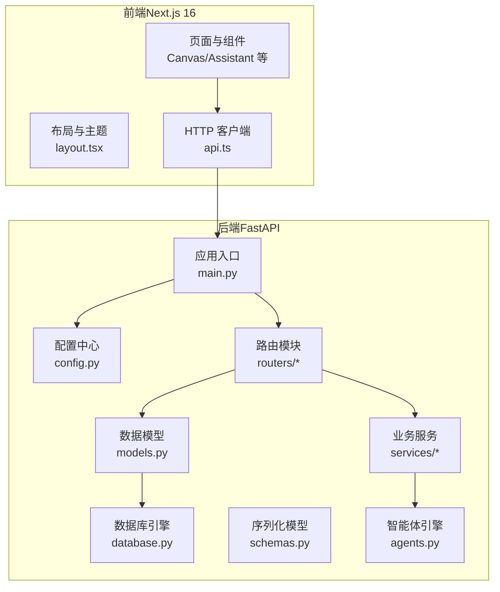

图表来源
- [backend/main.py:110-175](file://backend/main.py#L110-L175)
- [backend/config.py:1-43](file://backend/config.py#L1-L43)
- [backend/database.py:1-45](file://backend/database.py#L1-L45)
- [frontend/src/app/layout.tsx:23-41](file://frontend/src/app/layout.tsx#L23-L41)
- [frontend/src/lib/api.ts:1-84](file://frontend/src/lib/api.ts#L1-L84)

章节来源
- [backend/main.py:110-175](file://backend/main.py#L110-L175)
- [frontend/package.json:1-94](file://frontend/package.json#L1-L94)

## 核心组件
- 应用入口与生命周期：FastAPI 应用初始化、CORS 中间件、数据库连接与迁移、WebSocket 端点、路由注册。
- 配置中心：集中管理数据库、Redis、AI 密钥、JWT、生成策略与系统开关。
- 数据层：SQLAlchemy 异步 ORM、SQLite/WAL 优化、连接池与自动重连。
- 路由与控制器：按功能域划分的 API 路由（认证、管理员、智能体、聊天、编排、视频等）。
- 业务服务：多智能体编排（DynamicOrchestrator）、计费与配额、聊天生成、工具执行、视频生成等。
- 智能体引擎：基于 AgentScope 的多智能体对话与技能扩展，支持 MCP 客户端与上下文压缩钩子。
- 前端客户端：Axios 封装、鉴权拦截、刷新队列、主题与上下文包装。

章节来源
- [backend/main.py:110-175](file://backend/main.py#L110-L175)
- [backend/config.py:1-43](file://backend/config.py#L1-L43)
- [backend/database.py:1-45](file://backend/database.py#L1-L45)
- [backend/agents.py:176-388](file://backend/agents.py#L176-L388)
- [backend/services/orchestrator.py:1-914](file://backend/services/orchestrator.py#L1-L914)
- [frontend/src/lib/api.ts:1-84](file://frontend/src/lib/api.ts#L1-L84)

## 架构总览
KunFlix 采用“前后端分离 + 微服务化思想”的分层架构：
- 表现层：Next.js 16 页面与组件，提供剧场画布、AI 助手、资源管理与管理员后台。
- API 层：FastAPI 路由与服务，提供认证、智能体管理、聊天、编排、视频与资源接口。
- 业务层：多智能体编排、计费与配额、工具执行、上下文压缩、视频生成等。
- 数据层：SQLAlchemy 异步 ORM，SQLite/WAL 优化，Alembic 迁移，Redis 缓存（配置中声明）。
- 外部集成：AgentScope 多智能体框架、各类 LLM 提供商 SDK、视频生成服务 SDK。

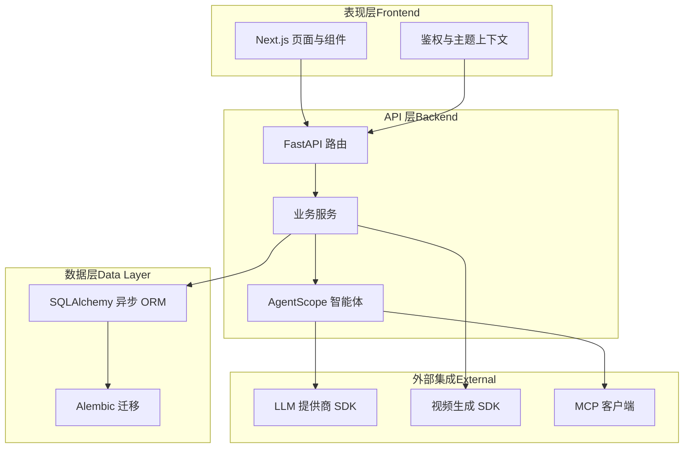

图表来源
- [backend/main.py:138-154](file://backend/main.py#L138-L154)
- [backend/agents.py:176-388](file://backend/agents.py#L176-L388)
- [backend/requirements.txt:1-29](file://backend/requirements.txt#L1-L29)

## 详细组件分析

### 后端应用入口与生命周期
- 初始化：设置事件循环策略与 UTF-8 编码，精细化日志配置，关闭 SQLAlchemy/uvicorn 的冗余日志。
- 生命周期：启动时进行数据库连接重试、可选运行 Alembic 迁移、加载叙事引擎配置、确保媒体目录存在。
- 中间件：CORS 允许开发环境跨域；调试中间件记录授权头与来源。
- 路由注册：集中注册认证、管理员、智能体、聊天、编排、视频、剧场等路由。
- WebSocket：基础回显端点，便于后续扩展实时交互。

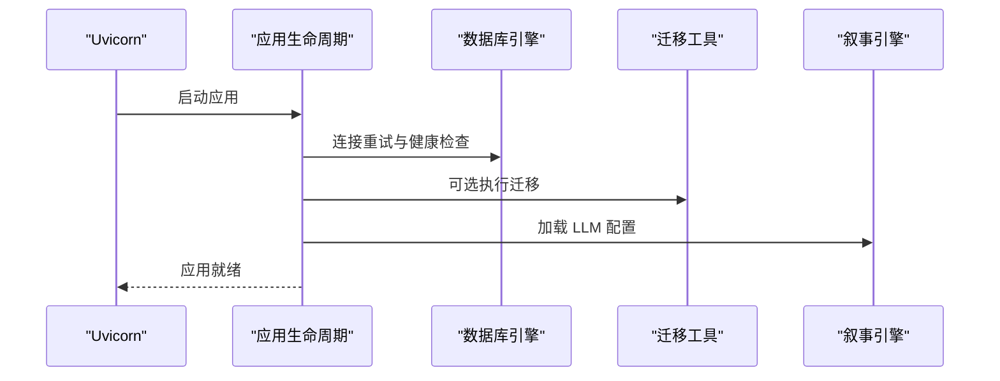

图表来源
- [backend/main.py:49-108](file://backend/main.py#L49-L108)

章节来源
- [backend/main.py:16-175](file://backend/main.py#L16-L175)

### 配置中心与数据库
- 配置中心：集中管理项目名称、版本、数据库 URL（SQLite/PostgreSQL 可选）、Redis、AI 密钥、JWT 参数、生成策略与系统开关。
- 数据库：异步引擎、连接池、SQLite WAL 优化（journal_mode=WAL、busy_timeout、synchronous）、自动重连与超时控制。

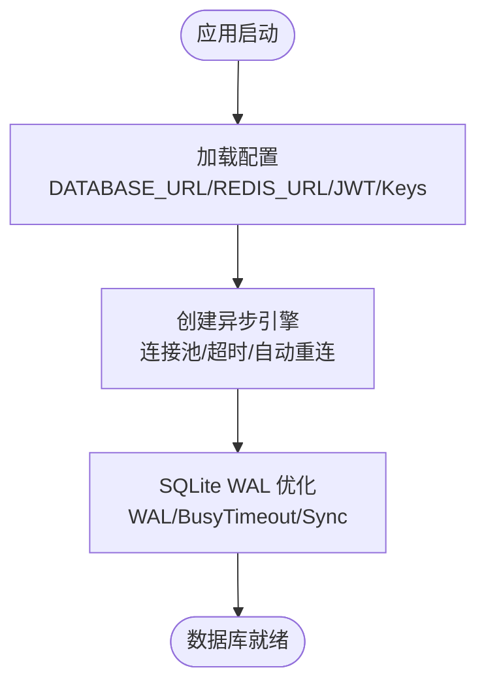

图表来源
- [backend/config.py:7-43](file://backend/config.py#L7-L43)
- [backend/database.py:9-31](file://backend/database.py#L9-L31)

章节来源
- [backend/config.py:1-43](file://backend/config.py#L1-L43)
- [backend/database.py:1-45](file://backend/database.py#L1-L45)

### 数据模型与序列化
- 数据模型：用户、管理员、剧场、节点、边、资产、LLM 提供商、聊天会话与消息、智能体、任务执行、子任务、订阅计划、视频任务、工具配置与执行日志等。
- 序列化模型：Pydantic 模型定义请求/响应结构，含字段校验、默认值与兼容字段（如角色字段废弃）。

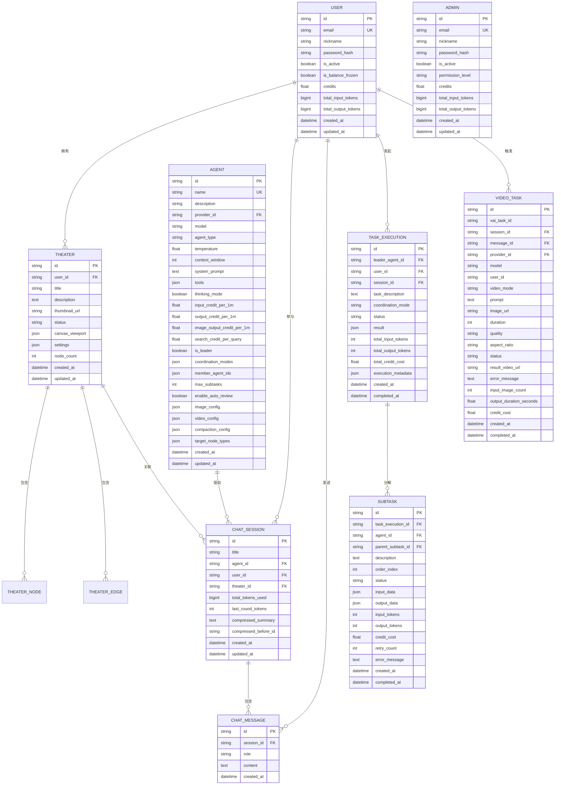

图表来源
- [backend/models.py:10-503](file://backend/models.py#L10-L503)

章节来源
- [backend/models.py:1-503](file://backend/models.py#L1-L503)
- [backend/schemas.py:1-931](file://backend/schemas.py#L1-L931)

### 多智能体编排与对话
- 编排引擎：DynamicOrchestrator 统一分析任务（简单/复杂），复杂任务按依赖图并行/串行执行，支持实时流式输出与最终审核。
- 智能体：DialogAgent 基于 AgentScope，支持多种 LLM 提供商、工具注册、MCP 客户端、上下文压缩钩子。
- 计费：原子化扣费与审计日志，支持文本/图像/搜索等多维计费。

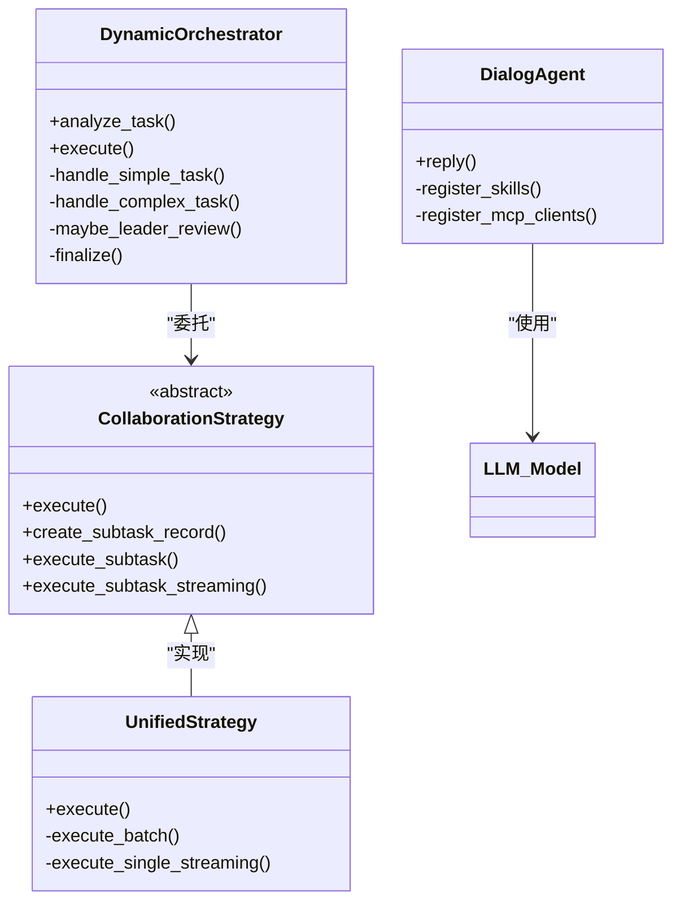

图表来源
- [backend/services/orchestrator.py:418-914](file://backend/services/orchestrator.py#L418-L914)
- [backend/agents.py:40-175](file://backend/agents.py#L40-L175)

章节来源
- [backend/services/orchestrator.py:1-914](file://backend/services/orchestrator.py#L1-L914)
- [backend/agents.py:176-388](file://backend/agents.py#L176-L388)

### 前端架构与交互
- 布局与主题：根布局注入 Ant Design 注册表、鉴权与主题上下文，字体与样式统一。
- API 客户端：Axios 实例封装，自动附加 Authorization 头，401 时排队重试并刷新令牌。
- 页面与组件：剧场画布、AI 助手面板、资源管理、管理员后台等模块化组织。

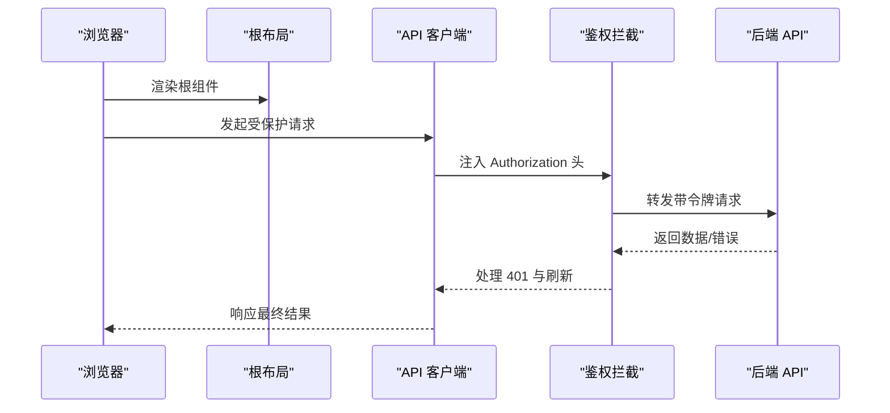

图表来源
- [frontend/src/app/layout.tsx:23-41](file://frontend/src/app/layout.tsx#L23-L41)
- [frontend/src/lib/api.ts:1-84](file://frontend/src/lib/api.ts#L1-L84)

章节来源
- [frontend/src/app/layout.tsx:1-42](file://frontend/src/app/layout.tsx#L1-L42)
- [frontend/src/lib/api.ts:1-84](file://frontend/src/lib/api.ts#L1-L84)

### 关键路由与数据流

#### 认证与会话
- 注册/登录：邮箱密码验证、JWT 签发、登录元数据更新。
- 刷新令牌：401 时排队刷新，失败则清空本地并跳转登录。

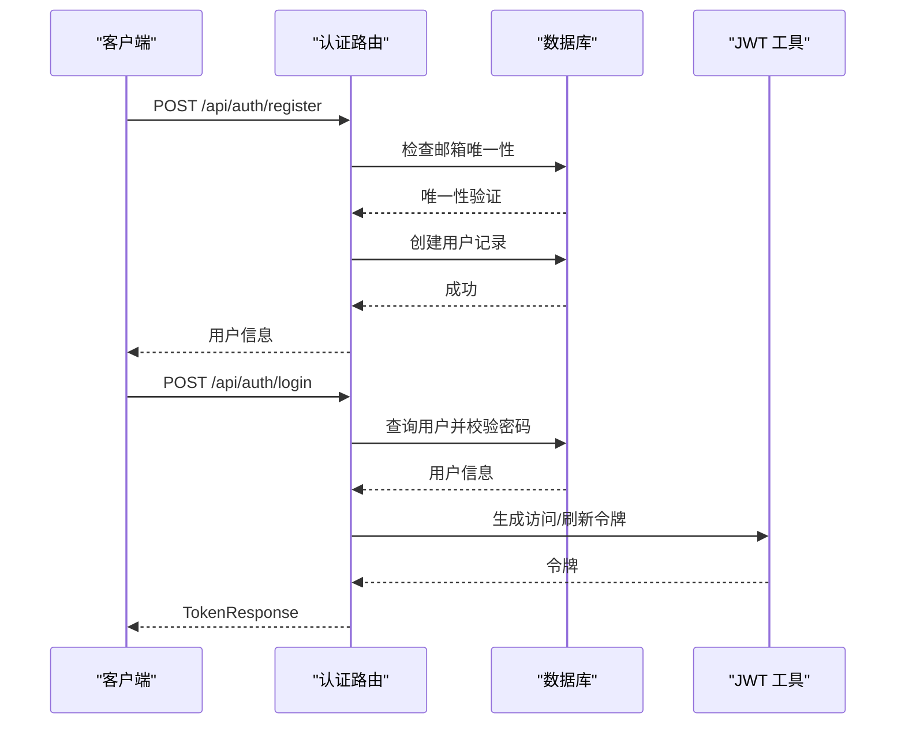

图表来源
- [backend/routers/auth.py:36-93](file://backend/routers/auth.py#L36-L93)

章节来源
- [backend/routers/auth.py:1-93](file://backend/routers/auth.py#L1-L93)

#### 多智能体编排（SSE 流）
- 请求：OrchestrationRequest（任务描述、领导者智能体、会话/剧场上下文、选项）。
- 执行：DynamicOrchestrator 分析任务，简单任务直接流式返回，复杂任务按依赖图执行并流式汇报进度。
- 计费：前置检查用户积分，执行过程原子化扣费与审计。

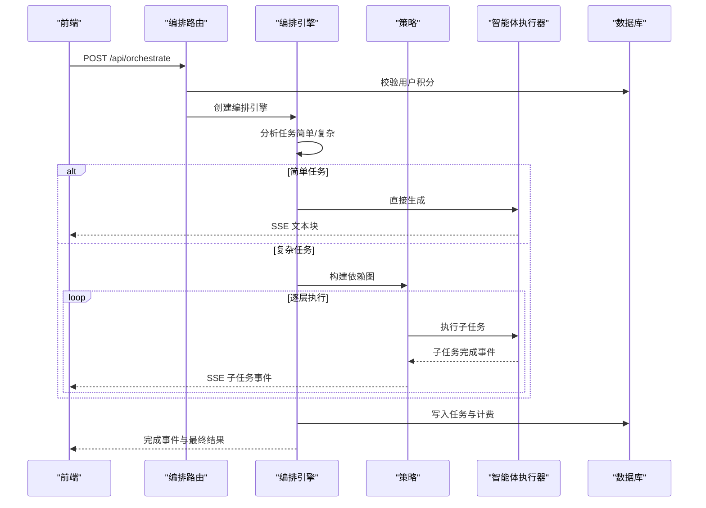

图表来源
- [backend/routers/orchestrate.py:26-120](file://backend/routers/orchestrate.py#L26-L120)
- [backend/services/orchestrator.py:437-534](file://backend/services/orchestrator.py#L437-L534)

章节来源
- [backend/routers/orchestrate.py:1-120](file://backend/routers/orchestrate.py#L1-L120)
- [backend/services/orchestrator.py:1-914](file://backend/services/orchestrator.py#L1-L914)

#### 智能体管理
- 创建/查询/更新/删除：名称唯一性校验、提供商与模型可用性校验、管理员权限控制。
- 前端交互：管理员后台页面与表单组件。

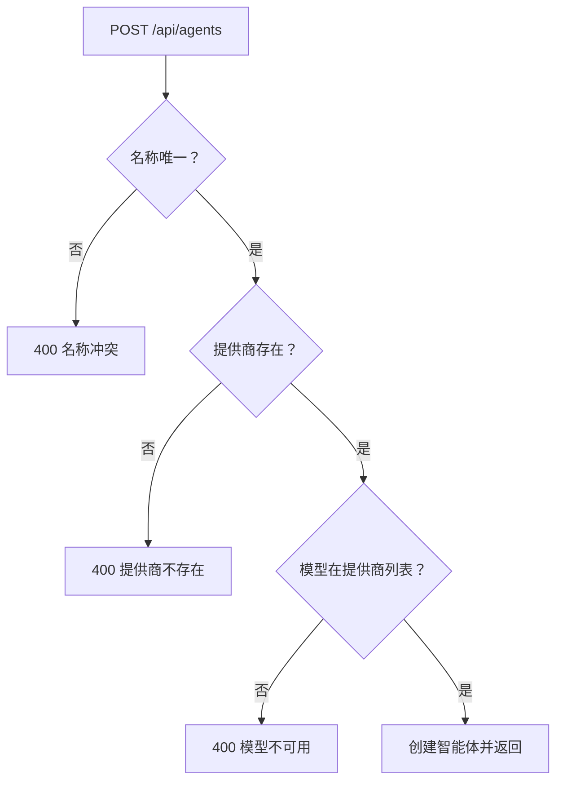

图表来源
- [backend/routers/agents.py:16-64](file://backend/routers/agents.py#L16-L64)

章节来源
- [backend/routers/agents.py:1-151](file://backend/routers/agents.py#L1-L151)

## 依赖关系分析
- 技术栈依赖：Python 3.10+、FastAPI、SQLAlchemy 2、asyncpg/aiosqlite、Redis、WebSockets、Alembic、AgentScope、OpenAI/DashScope/Gemini/Ollama 等。
- 前端依赖：Next.js 16、Ant Design、Axios、SWR、Socket.IO、UUID、Zustand 等。
- 组件耦合：路由层依赖服务层，服务层依赖模型与工具，智能体引擎与外部 LLM 提供商解耦，数据库通过 ORM 统一抽象。

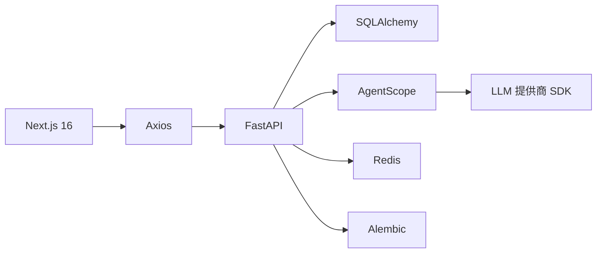

图表来源
- [backend/requirements.txt:1-29](file://backend/requirements.txt#L1-L29)
- [frontend/package.json:13-69](file://frontend/package.json#L13-L69)

章节来源
- [backend/requirements.txt:1-29](file://backend/requirements.txt#L1-L29)
- [frontend/package.json:1-94](file://frontend/package.json#L1-L94)

## 性能考虑
- 异步与并发：FastAPI 异步路由、SQLAlchemy 异步引擎、asyncio 事件循环，提升 I/O 密集型场景吞吐。
- 数据库优化：SQLite WAL 模式降低锁竞争，连接池与自动重连减少抖动，预热连接与超时控制保障稳定性。
- 编排优化：复杂任务按依赖图并行执行，单任务流式输出，减少等待时间与内存占用。
- 前端体验：Axios 拦截器与令牌刷新队列避免重复请求，SWR 缓存与懒加载优化首屏与交互延迟。
- 多智能体：上下文压缩钩子与工具注册延迟加载，降低推理前开销。

## 故障排除指南
- 数据库连接失败：检查 DATABASE_URL、SQLite 文件权限与 WAL 参数；查看启动日志中的重试与迁移失败信息。
- 迁移失败：关注 Alembic 升级异常与残留临时表清理流程；必要时手动清理后重试。
- 认证 401：确认本地存储的刷新令牌是否存在与有效；检查拦截器是否正确注入 Authorization 头。
- 编排计费不足：确认用户积分余额；检查任务执行记录与计费统计。
- 智能体初始化：确认 LLM 提供商配置与 API Key；检查 AgentScope 初始化日志与模型类型映射。

章节来源
- [backend/main.py:49-108](file://backend/main.py#L49-L108)
- [backend/routers/orchestrate.py:37-42](file://backend/routers/orchestrate.py#L37-L42)
- [frontend/src/lib/api.ts:31-81](file://frontend/src/lib/api.ts#L31-L81)

## 结论
KunFlix 平台以 FastAPI 为核心构建高性能异步 API 层，结合 AgentScope 多智能体框架实现强大的编排与对话能力，前端采用 Next.js 16 提供现代化交互体验。通过模块化组织、清晰的分层架构与完善的依赖管理，平台具备良好的可扩展性与可维护性。建议在生产环境中启用数据库迁移、完善监控与日志、加强安全防护与速率限制，并持续评估外部服务的可用性与成本。