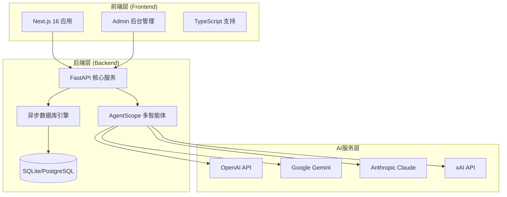
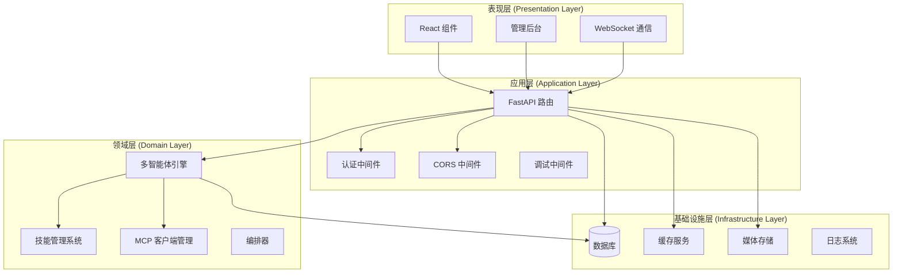
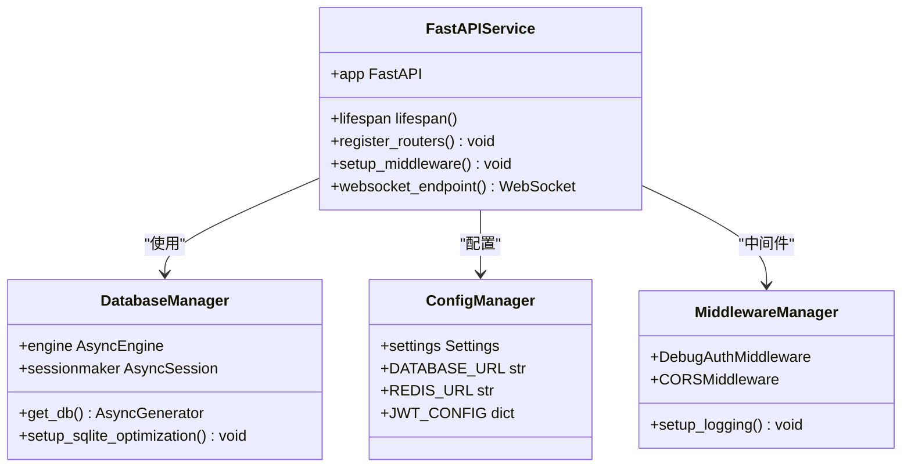
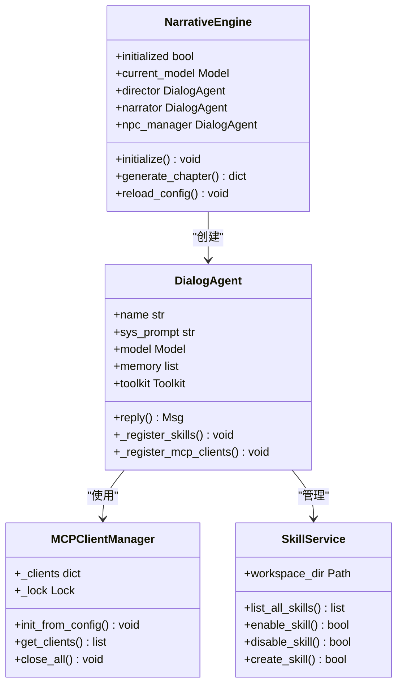
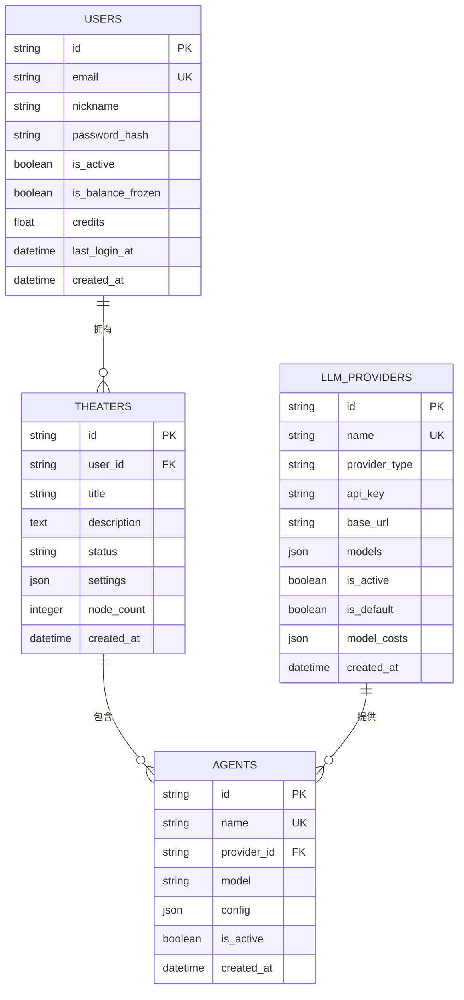
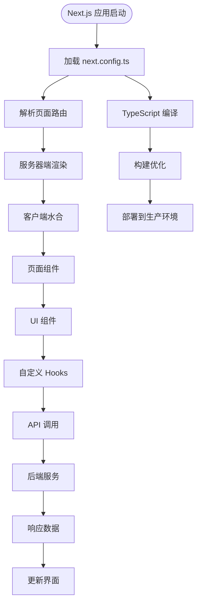
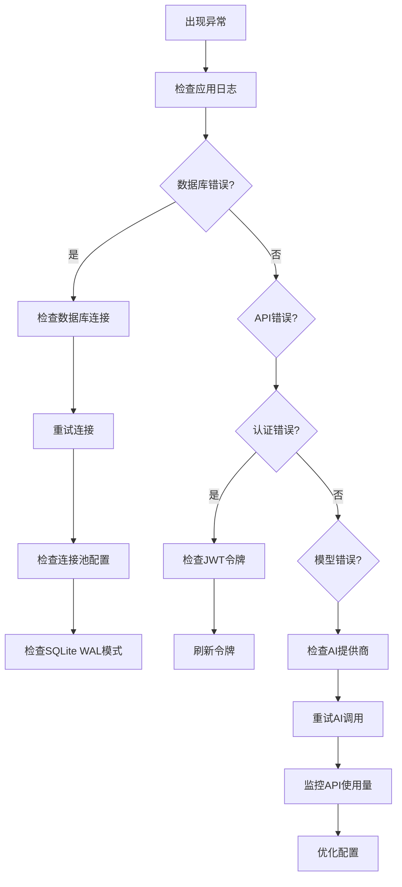

# 技术栈介绍

<cite>
**本文档引用的文件**
- [backend/main.py](file://backend/main.py)
- [backend/requirements.txt](file://backend/requirements.txt)
- [backend/config.py](file://backend/config.py)
- [backend/database.py](file://backend/database.py)
- [backend/models.py](file://backend/models.py)
- [backend/agents.py](file://backend/agents.py)
- [backend/skills_manager.py](file://backend/skills_manager.py)
- [backend/mcp_manager/manager.py](file://backend/mcp_manager/manager.py)
- [backend/routers/agents.py](file://backend/routers/agents.py)
- [frontend/package.json](file://frontend/package.json)
- [frontend/next.config.ts](file://frontend/next.config.ts)
- [frontend/tsconfig.json](file://frontend/tsconfig.json)
</cite>

## 目录
1. [引言](#引言)
2. [项目结构](#项目结构)
3. [核心组件](#核心组件)
4. [架构概览](#架构概览)
5. [详细组件分析](#详细组件分析)
6. [依赖分析](#依赖分析)
7. [性能考虑](#性能考虑)
8. [故障排除指南](#故障排除指南)
9. [结论](#结论)

## 引言

Infinite Game平台是一个基于Python 3.10+与FastAPI构建的异步高性能后端服务，配合Next.js 16现代化前端框架，以及AgentScope多智能体框架的综合技术解决方案。该平台专注于交互式叙事体验，通过异步编程模型实现高并发处理能力，通过多智能体协作提供丰富的AI应用场景。

本技术栈的选择体现了对性能、可维护性和扩展性的综合考量：Python 3.10+提供现代语言特性和优秀的异步支持；FastAPI确保API的高性能和自动生成文档；Next.js 16带来现代化的开发体验和生产级优化；AgentScope多智能体框架支撑复杂的AI协作场景。

## 项目结构

平台采用前后端分离的架构设计，后端负责业务逻辑和数据处理，前端提供用户交互界面，两者通过RESTful API进行通信。



**图表来源**
- [backend/main.py:110-175](file://backend/main.py#L110-L175)
- [frontend/package.json:55-69](file://frontend/package.json#L55-L69)

**章节来源**
- [backend/main.py:1-175](file://backend/main.py#L1-L175)
- [frontend/package.json:1-94](file://frontend/package.json#L1-L94)

## 核心组件

### Python 3.10+ 与异步编程

平台采用Python 3.10+作为主要开发语言，充分利用其异步编程特性和类型注解功能。核心优势包括：

- **异步I/O支持**：通过async/await语法实现非阻塞I/O操作
- **类型安全**：利用类型注解提高代码质量和IDE支持
- **性能优化**：CPython 3.10的字节码优化提升执行效率
- **现代语法特性**：模式匹配、类型别名等新特性

### FastAPI 异步高性能Web框架

FastAPI作为后端API框架，提供了以下关键特性：

- **自动API文档**：基于Pydantic模型自动生成Swagger UI和ReDoc
- **依赖注入系统**：强大的依赖管理和生命周期管理
- **异步路由支持**：原生支持async函数和异步中间件
- **数据验证**：运行时数据验证和序列化
- **CORS支持**：内置跨域资源共享配置

### Next.js 16 现代化前端框架

前端采用Next.js 16，具备以下现代化特性：

- **App Router**：基于文件系统的路由系统
- **Server Actions**：服务端动作支持
- **TypeScript集成**：完整的TypeScript开发体验
- **静态生成**：支持静态站点生成和服务器端渲染
- **性能优化**：自动代码分割、图片优化、字体优化

### AgentScope 多智能体框架

AgentScope是平台的核心AI协作框架，提供：

- **多模型支持**：统一接口支持OpenAI、Gemini、Claude等多种AI模型
- **技能系统**：模块化的技能注册和管理机制
- **MCP协议**：支持Model Context Protocol客户端动态连接
- **内存管理**：智能的上下文压缩和记忆管理
- **工具调用**：丰富的工具集和外部服务集成

**章节来源**
- [backend/requirements.txt:1-29](file://backend/requirements.txt#L1-L29)
- [backend/config.py:1-43](file://backend/config.py#L1-L43)
- [backend/database.py:1-44](file://backend/database.py#L1-L44)

## 架构概览

平台采用分层架构设计，确保各层职责清晰、耦合度低。



**图表来源**
- [backend/main.py:32-175](file://backend/main.py#L32-L175)
- [backend/agents.py:1-388](file://backend/agents.py#L1-L388)
- [backend/skills_manager.py:1-408](file://backend/skills_manager.py#L1-L408)

## 详细组件分析

### 后端核心服务 (FastAPI)

后端服务通过FastAPI提供RESTful API，支持异步操作和WebSocket通信。



**图表来源**
- [backend/main.py:49-175](file://backend/main.py#L49-L175)
- [backend/database.py:1-44](file://backend/database.py#L1-L44)
- [backend/config.py:1-43](file://backend/config.py#L1-L43)

**章节来源**
- [backend/main.py:1-175](file://backend/main.py#L1-L175)
- [backend/database.py:1-44](file://backend/database.py#L1-L44)
- [backend/config.py:1-43](file://backend/config.py#L1-L43)

### 多智能体引擎 (AgentScope)

AgentScope提供完整的多智能体解决方案，支持复杂的AI协作场景。



**图表来源**
- [backend/agents.py:176-388](file://backend/agents.py#L176-L388)
- [backend/mcp_manager/manager.py:28-108](file://backend/mcp_manager/manager.py#L28-L108)
- [backend/skills_manager.py:263-408](file://backend/skills_manager.py#L263-L408)

**章节来源**
- [backend/agents.py:1-388](file://backend/agents.py#L1-L388)
- [backend/mcp_manager/manager.py:1-108](file://backend/mcp_manager/manager.py#L1-L108)
- [backend/skills_manager.py:1-408](file://backend/skills_manager.py#L1-L408)

### 数据模型与数据库

平台采用SQLAlchemy ORM进行数据持久化，支持SQLite和PostgreSQL两种数据库。



**图表来源**
- [backend/models.py:10-200](file://backend/models.py#L10-L200)

**章节来源**
- [backend/models.py:1-200](file://backend/models.py#L1-L200)

### 前端架构 (Next.js 16)

前端采用现代化的Next.js 16架构，提供完整的开发和部署体验。



**图表来源**
- [frontend/next.config.ts:1-21](file://frontend/next.config.ts#L1-L21)
- [frontend/tsconfig.json:1-35](file://frontend/tsconfig.json#L1-L35)

**章节来源**
- [frontend/next.config.ts:1-21](file://frontend/next.config.ts#L1-L21)
- [frontend/tsconfig.json:1-35](file://frontend/tsconfig.json#L1-L35)

## 依赖分析

平台的技术依赖关系体现了清晰的分层架构和模块化设计。

```mermaid
graph TB
subgraph "后端依赖"
FastAPI[fastapi>=0.129.0]
Uvicorn[uvicorn[standard]>=0.41.0]
SQLAlchemy[sqlalchemy>=2.0.46]
Pydantic[pydantic>=2.12.5]
AsyncPG[asyncpg>=0.31.0]
Redis[redis>=5.0.0]
AgentScope[agentscope>=1.0.18]
OpenAI[openai>=2.21.0]
Alembic[alembic>=1.18.4]
end
subgraph "前端依赖"
NextJS[next@16.1.6]
React[react@19.2.3]
ReactDOM[react-dom@19.2.3]
AntD[antd^6.3.0]
SWR[swr^2.4.0]
SocketIO[socket.io-client^4.8.3]
end
subgraph "开发工具"
TypeScript[typescript^5]
ESLint[eslint^9]
Jest[jest^30]
TailwindCSS[tailwindcss^4]
end
FastAPI --> SQLAlchemy
FastAPI --> AgentScope
AgentScope --> OpenAI
NextJS --> React
NextJS --> AntD
```

**图表来源**
- [backend/requirements.txt:1-29](file://backend/requirements.txt#L1-L29)
- [frontend/package.json:13-92](file://frontend/package.json#L13-L92)

**章节来源**
- [backend/requirements.txt:1-29](file://backend/requirements.txt#L1-L29)
- [frontend/package.json:1-94](file://frontend/package.json#L1-L94)

## 性能考虑

### 异步性能优化

平台通过异步编程模型实现高性能处理：

- **数据库连接池**：配置最大连接数和溢出连接，支持并发访问
- **SQLite优化**：启用WAL模式、调整busy_timeout和同步策略
- **异步I/O**：避免阻塞操作，提高吞吐量
- **内存管理**：智能的上下文压缩和垃圾回收

### 缓存策略

- **Redis缓存**：用户会话、API响应缓存
- **浏览器缓存**：静态资源和API响应缓存
- **CDN加速**：媒体资源分发

### 扩展性设计

- **微服务架构**：支持水平扩展
- **负载均衡**：支持多实例部署
- **数据库分片**：支持大数据量场景

## 故障排除指南

### 常见问题诊断



### 性能监控

- **日志级别**：精细的日志控制，区分不同级别的信息
- **数据库监控**：连接池状态、查询性能
- **AI模型监控**：API调用次数、响应时间、错误率
- **前端性能**：页面加载时间、资源大小

**章节来源**
- [backend/main.py:15-30](file://backend/main.py#L15-L30)
- [backend/database.py:21-31](file://backend/database.py#L21-L31)

## 结论

Infinite Game平台的技术栈选择体现了现代Web应用的最佳实践：

**技术选型的优势**：
- **性能卓越**：异步编程模型和优化的数据库配置
- **开发效率**：TypeScript和现代化框架提供良好的开发体验
- **可扩展性**：模块化设计支持未来的功能扩展
- **维护性**：清晰的架构层次和完善的测试覆盖

**未来发展方向**：
- **AI能力增强**：持续集成新的AI模型和工具
- **性能优化**：根据实际使用情况进行针对性优化
- **安全性加强**：完善的身份认证和授权机制
- **监控体系**：建立更完善的性能监控和告警系统

该技术栈为Infinite Game平台提供了坚实的技术基础，能够支持复杂的交互式叙事应用，并为未来的功能扩展和技术演进预留了充足的空间。