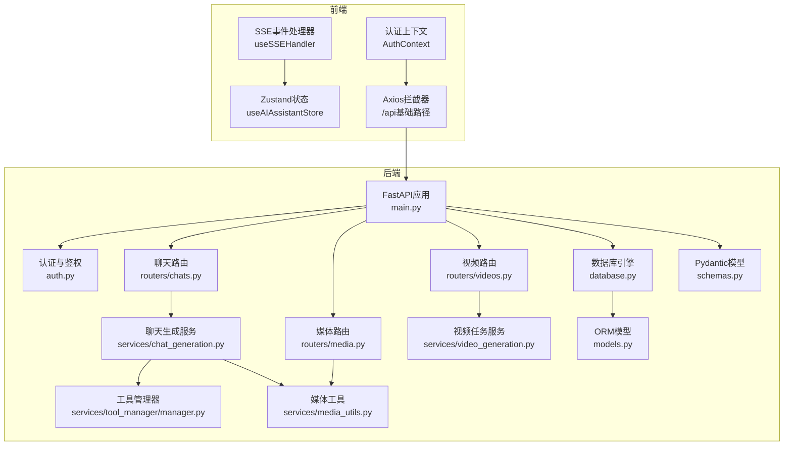
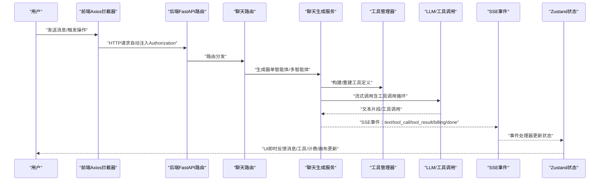
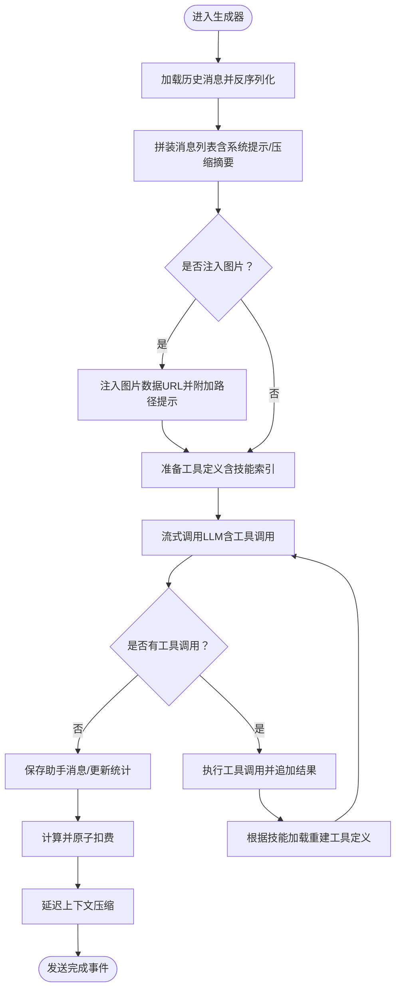
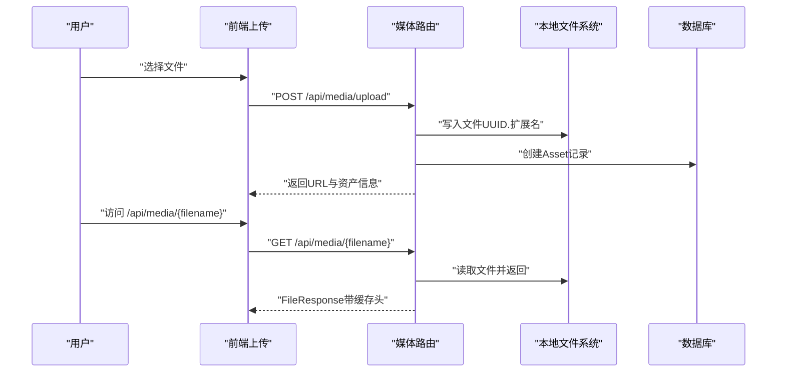
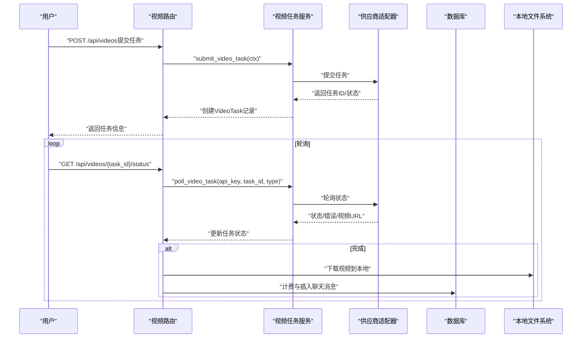
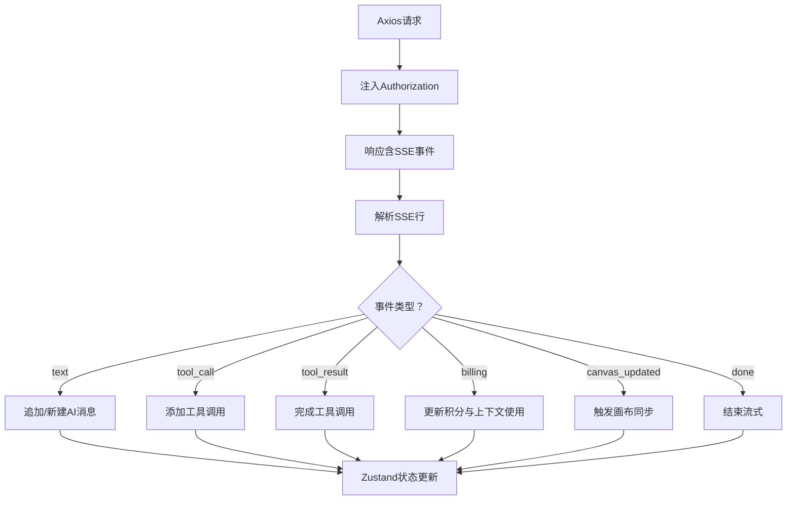
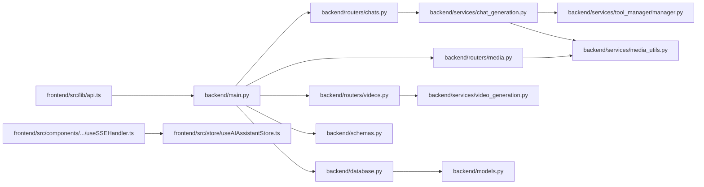

# 数据流设计

<cite>
**本文档引用的文件**
- [backend/main.py](file://backend/main.py)
- [backend/database.py](file://backend/database.py)
- [backend/models.py](file://backend/models.py)
- [backend/schemas.py](file://backend/schemas.py)
- [backend/routers/chats.py](file://backend/routers/chats.py)
- [backend/services/chat_generation.py](file://backend/services/chat_generation.py)
- [backend/routers/media.py](file://backend/routers/media.py)
- [backend/services/media_utils.py](file://backend/services/media_utils.py)
- [backend/routers/videos.py](file://backend/routers/videos.py)
- [backend/services/video_generation.py](file://backend/services/video_generation.py)
- [backend/services/tool_manager/manager.py](file://backend/services/tool_manager/manager.py)
- [backend/auth.py](file://backend/auth.py)
- [backend/config.py](file://backend/config.py)
- [frontend/src/lib/api.ts](file://frontend/src/lib/api.ts)
- [frontend/src/components/ai-assistant/hooks/useSSEHandler.ts](file://frontend/src/components/ai-assistant/hooks/useSSEHandler.ts)
- [frontend/src/store/useAIAssistantStore.ts](file://frontend/src/store/useAIAssistantStore.ts)
- [frontend/src/context/AuthContext.tsx](file://frontend/src/context/AuthContext.tsx)
</cite>

## 目录
1. [简介](#简介)
2. [项目结构](#项目结构)
3. [核心组件](#核心组件)
4. [架构总览](#架构总览)
5. [详细组件分析](#详细组件分析)
6. [依赖关系分析](#依赖关系分析)
7. [性能考量](#性能考量)
8. [故障排查指南](#故障排查指南)
9. [结论](#结论)
10. [附录](#附录)

## 简介
本文件面向KunFlix平台，系统化梳理“从用户输入到AI生成”的完整数据流与处理流程，覆盖以下关键主题：
- 用户输入到AI生成的端到端数据路径
- 媒体文件的上传、存储与传输机制
- 实时数据的同步策略（SSE/Store）
- 前后端状态管理与数据库持久化协调
- 数据验证、缓存策略与一致性保障
- 数据安全、隐私保护与合规性建议

## 项目结构
系统采用前后端分离架构：
- 后端：FastAPI + SQLAlchemy Async + 异步数据库连接池，提供REST与SSE接口
- 前端：Next.js + Zustand状态管理 + Axios拦截器与SSE事件处理器
- 数据层：SQLite/PostgreSQL，配合Alembic迁移与ORM模型

图表来源
- [backend/main.py:110-175](file://backend/main.py#L110-L175)
- [backend/database.py:1-45](file://backend/database.py#L1-L45)
- [backend/models.py:1-503](file://backend/models.py#L1-L503)
- [backend/schemas.py:1-931](file://backend/schemas.py#L1-L931)
- [backend/routers/chats.py:1-232](file://backend/routers/chats.py#L1-L232)
- [backend/services/chat_generation.py:1-449](file://backend/services/chat_generation.py#L1-L449)
- [backend/routers/media.py:1-444](file://backend/routers/media.py#L1-L444)
- [backend/services/media_utils.py:1-79](file://backend/services/media_utils.py#L1-L79)
- [backend/routers/videos.py:1-344](file://backend/routers/videos.py#L1-L344)
- [backend/services/video_generation.py:1-180](file://backend/services/video_generation.py#L1-L180)
- [backend/services/tool_manager/manager.py:1-108](file://backend/services/tool_manager/manager.py#L1-L108)
- [backend/auth.py:1-229](file://backend/auth.py#L1-L229)
- [backend/config.py:1-43](file://backend/config.py#L1-L43)
- [frontend/src/lib/api.ts:1-84](file://frontend/src/lib/api.ts#L1-L84)
- [frontend/src/components/ai-assistant/hooks/useSSEHandler.ts:1-391](file://frontend/src/components/ai-assistant/hooks/useSSEHandler.ts#L1-L391)
- [frontend/src/store/useAIAssistantStore.ts:1-381](file://frontend/src/store/useAIAssistantStore.ts#L1-L381)
- [frontend/src/context/AuthContext.tsx:1-207](file://frontend/src/context/AuthContext.tsx#L1-L207)

章节来源
- [backend/main.py:110-175](file://backend/main.py#L110-L175)
- [backend/database.py:1-45](file://backend/database.py#L1-L45)
- [backend/models.py:1-503](file://backend/models.py#L1-L503)
- [backend/schemas.py:1-931](file://backend/schemas.py#L1-L931)
- [backend/routers/chats.py:1-232](file://backend/routers/chats.py#L1-L232)
- [backend/services/chat_generation.py:1-449](file://backend/services/chat_generation.py#L1-L449)
- [backend/routers/media.py:1-444](file://backend/routers/media.py#L1-L444)
- [backend/services/media_utils.py:1-79](file://backend/services/media_utils.py#L1-L79)
- [backend/routers/videos.py:1-344](file://backend/routers/videos.py#L1-L344)
- [backend/services/video_generation.py:1-180](file://backend/services/video_generation.py#L1-L180)
- [backend/services/tool_manager/manager.py:1-108](file://backend/services/tool_manager/manager.py#L1-L108)
- [backend/auth.py:1-229](file://backend/auth.py#L1-L229)
- [backend/config.py:1-43](file://backend/config.py#L1-L43)
- [frontend/src/lib/api.ts:1-84](file://frontend/src/lib/api.ts#L1-L84)
- [frontend/src/components/ai-assistant/hooks/useSSEHandler.ts:1-391](file://frontend/src/components/ai-assistant/hooks/useSSEHandler.ts#L1-L391)
- [frontend/src/store/useAIAssistantStore.ts:1-381](file://frontend/src/store/useAIAssistantStore.ts#L1-L381)
- [frontend/src/context/AuthContext.tsx:1-207](file://frontend/src/context/AuthContext.tsx#L1-L207)

## 核心组件
- 前端Axios拦截器：统一注入Authorization头、401自动刷新与请求排队
- SSE事件处理器：解析后端SSE事件，驱动Zustand状态更新与UI渲染
- Zustand状态：管理消息、会话、上下文使用、画布更新、多智能体协作等
- 后端FastAPI路由：提供聊天、媒体、视频等REST接口
- 服务层：聊天生成、媒体工具、视频任务、工具管理器
- 数据库：异步引擎、连接池、SQLite WAL优化、模型定义与迁移

章节来源
- [frontend/src/lib/api.ts:1-84](file://frontend/src/lib/api.ts#L1-L84)
- [frontend/src/components/ai-assistant/hooks/useSSEHandler.ts:1-391](file://frontend/src/components/ai-assistant/hooks/useSSEHandler.ts#L1-L391)
- [frontend/src/store/useAIAssistantStore.ts:1-381](file://frontend/src/store/useAIAssistantStore.ts#L1-L381)
- [backend/routers/chats.py:1-232](file://backend/routers/chats.py#L1-L232)
- [backend/services/chat_generation.py:1-449](file://backend/services/chat_generation.py#L1-L449)
- [backend/routers/media.py:1-444](file://backend/routers/media.py#L1-L444)
- [backend/services/media_utils.py:1-79](file://backend/services/media_utils.py#L1-L79)
- [backend/routers/videos.py:1-344](file://backend/routers/videos.py#L1-L344)
- [backend/services/video_generation.py:1-180](file://backend/services/video_generation.py#L1-L180)
- [backend/services/tool_manager/manager.py:1-108](file://backend/services/tool_manager/manager.py#L1-L108)
- [backend/database.py:1-45](file://backend/database.py#L1-L45)
- [backend/models.py:1-503](file://backend/models.py#L1-L503)

## 架构总览
下图展示了用户输入到AI生成与媒体处理的端到端数据流，以及实时事件的推送与前端状态更新。

图表来源
- [frontend/src/lib/api.ts:1-84](file://frontend/src/lib/api.ts#L1-L84)
- [backend/routers/chats.py:127-183](file://backend/routers/chats.py#L127-L183)
- [backend/services/chat_generation.py:29-449](file://backend/services/chat_generation.py#L29-L449)
- [backend/services/tool_manager/manager.py:42-91](file://backend/services/tool_manager/manager.py#L42-L91)
- [frontend/src/components/ai-assistant/hooks/useSSEHandler.ts:67-391](file://frontend/src/components/ai-assistant/hooks/useSSEHandler.ts#L67-L391)
- [frontend/src/store/useAIAssistantStore.ts:104-200](file://frontend/src/store/useAIAssistantStore.ts#L104-L200)

## 详细组件分析

### 组件A：聊天生成与工具调用循环
- 单智能体与多智能体模式分流
- 历史消息序列化/反序列化、上下文压缩、工具定义动态构建
- 流式SSE事件：text、tool_call、tool_result、billing、done、canvas_updated、context_compacted
- 成功后保存助手消息、更新会话统计、原子扣费、延迟上下文压缩

图表来源
- [backend/services/chat_generation.py:29-449](file://backend/services/chat_generation.py#L29-L449)
- [backend/services/tool_manager/manager.py:42-91](file://backend/services/tool_manager/manager.py#L42-L91)

章节来源
- [backend/services/chat_generation.py:29-449](file://backend/services/chat_generation.py#L29-L449)
- [backend/routers/chats.py:127-183](file://backend/routers/chats.py#L127-L183)

### 组件B：媒体文件上传与分发
- 上传：校验扩展名与大小，写入本地media目录，创建Asset记录
- 提供：安全文件名匹配与UUID回退查找，支持缓存头
- 批量图片生成：按供应商适配配置，统一响应格式
- 工具：内联图片保存、远端URL下载（图片/视频）

图表来源
- [backend/routers/media.py:95-149](file://backend/routers/media.py#L95-L149)
- [backend/routers/media.py:272-299](file://backend/routers/media.py#L272-L299)
- [backend/services/media_utils.py:20-79](file://backend/services/media_utils.py#L20-L79)

章节来源
- [backend/routers/media.py:95-149](file://backend/routers/media.py#L95-L149)
- [backend/routers/media.py:272-299](file://backend/routers/media.py#L272-L299)
- [backend/services/media_utils.py:20-79](file://backend/services/media_utils.py#L20-L79)

### 组件C：视频生成与任务轮询
- 提交：根据供应商类型选择适配器，创建VideoTask记录
- 轮询：统一入口根据供应商类型轮询状态，完成时下载视频并计费
- 插入：在聊天会话中插入视频消息，支持删除任务与清理本地文件

图表来源
- [backend/routers/videos.py:75-234](file://backend/routers/videos.py#L75-L234)
- [backend/services/video_generation.py:90-180](file://backend/services/video_generation.py#L90-L180)

章节来源
- [backend/routers/videos.py:75-234](file://backend/routers/videos.py#L75-L234)
- [backend/services/video_generation.py:90-180](file://backend/services/video_generation.py#L90-L180)

### 组件D：前端状态管理与实时同步
- Axios拦截器：自动注入Authorization，401时刷新令牌并重试
- SSE事件处理器：解析SSE事件，更新消息、工具/技能状态、计费、画布更新、上下文使用
- Zustand状态：消息列表、会话、面板尺寸、节点附件、上下文使用统计等

图表来源
- [frontend/src/lib/api.ts:1-84](file://frontend/src/lib/api.ts#L1-L84)
- [frontend/src/components/ai-assistant/hooks/useSSEHandler.ts:56-391](file://frontend/src/components/ai-assistant/hooks/useSSEHandler.ts#L56-L391)
- [frontend/src/store/useAIAssistantStore.ts:104-200](file://frontend/src/store/useAIAssistantStore.ts#L104-L200)

章节来源
- [frontend/src/lib/api.ts:1-84](file://frontend/src/lib/api.ts#L1-L84)
- [frontend/src/components/ai-assistant/hooks/useSSEHandler.ts:56-391](file://frontend/src/components/ai-assistant/hooks/useSSEHandler.ts#L56-L391)
- [frontend/src/store/useAIAssistantStore.ts:104-200](file://frontend/src/store/useAIAssistantStore.ts#L104-L200)

### 组件E：认证与鉴权
- JWT：Access/Refresh Token，支持用户与管理员双角色
- 行级隔离：scoped_query按主体类型过滤数据
- 自动刷新：401时排队重试，失败则跳转登录

章节来源
- [backend/auth.py:30-229](file://backend/auth.py#L30-L229)
- [frontend/src/context/AuthContext.tsx:172-207](file://frontend/src/context/AuthContext.tsx#L172-L207)
- [frontend/src/lib/api.ts:19-81](file://frontend/src/lib/api.ts#L19-L81)

## 依赖关系分析
- 后端依赖链：FastAPI应用 → 路由 → 服务层 → 工具管理器/媒体工具/视频任务 → 数据库
- 前端依赖链：Axios拦截器 → SSE事件处理器 → Zustand状态 → UI组件
- 数据模型：ORM模型与Pydantic模式共同约束数据结构与验证

图表来源
- [frontend/src/lib/api.ts:1-84](file://frontend/src/lib/api.ts#L1-L84)
- [backend/main.py:138-154](file://backend/main.py#L138-L154)
- [backend/routers/chats.py:1-232](file://backend/routers/chats.py#L1-L232)
- [backend/services/chat_generation.py:1-449](file://backend/services/chat_generation.py#L1-L449)
- [backend/services/tool_manager/manager.py:1-108](file://backend/services/tool_manager/manager.py#L1-L108)
- [backend/services/media_utils.py:1-79](file://backend/services/media_utils.py#L1-L79)
- [backend/routers/media.py:1-444](file://backend/routers/media.py#L1-L444)
- [backend/routers/videos.py:1-344](file://backend/routers/videos.py#L1-L344)
- [backend/services/video_generation.py:1-180](file://backend/services/video_generation.py#L1-L180)
- [backend/database.py:1-45](file://backend/database.py#L1-L45)
- [backend/models.py:1-503](file://backend/models.py#L1-L503)
- [backend/schemas.py:1-931](file://backend/schemas.py#L1-L931)
- [frontend/src/components/ai-assistant/hooks/useSSEHandler.ts:1-391](file://frontend/src/components/ai-assistant/hooks/useSSEHandler.ts#L1-L391)
- [frontend/src/store/useAIAssistantStore.ts:1-381](file://frontend/src/store/useAIAssistantStore.ts#L1-L381)

章节来源
- [backend/main.py:138-154](file://backend/main.py#L138-L154)
- [backend/database.py:1-45](file://backend/database.py#L1-L45)
- [backend/models.py:1-503](file://backend/models.py#L1-L503)
- [backend/schemas.py:1-931](file://backend/schemas.py#L1-L931)
- [frontend/src/lib/api.ts:1-84](file://frontend/src/lib/api.ts#L1-L84)
- [frontend/src/components/ai-assistant/hooks/useSSEHandler.ts:1-391](file://frontend/src/components/ai-assistant/hooks/useSSEHandler.ts#L1-L391)
- [frontend/src/store/useAIAssistantStore.ts:1-381](file://frontend/src/store/useAIAssistantStore.ts#L1-L381)

## 性能考量
- 数据库连接池与SQLite WAL：提升并发与减少锁冲突
- 异步I/O与流式SSE：降低前端等待时间，提升交互体验
- 工具定义缓存与增量重建：减少重复构建开销
- 媒体文件缓存头：减少重复下载
- 前端虚拟滚动与状态持久化：优化长列表渲染与会话恢复

## 故障排查指南
- 401自动刷新失败：检查刷新令牌、网络与后端认证配置
- SSE事件缺失：确认后端SSE事件类型与前端解析逻辑一致
- 媒体文件无法访问：核对文件名安全规则与UUID回退逻辑
- 视频任务长时间pending：检查供应商轮询与超时策略
- 积分不足/冻结：关注后端计费事件与前端提示

章节来源
- [frontend/src/lib/api.ts:19-81](file://frontend/src/lib/api.ts#L19-L81)
- [frontend/src/components/ai-assistant/hooks/useSSEHandler.ts:374-391](file://frontend/src/components/ai-assistant/hooks/useSSEHandler.ts#L374-L391)
- [backend/routers/media.py:272-299](file://backend/routers/media.py#L272-L299)
- [backend/routers/videos.py:150-234](file://backend/routers/videos.py#L150-L234)
- [backend/services/chat_generation.py:377-423](file://backend/services/chat_generation.py#L377-L423)

## 结论
本设计以FastAPI与Zustand为核心，结合SSE与异步数据库，实现了从用户输入到AI生成与媒体处理的高效闭环。通过严格的认证与行级隔离、完善的事件驱动状态更新、以及媒体与视频任务的统一服务层，系统在易用性、可维护性与可扩展性方面具备良好基础。

## 附录
- 数据验证：Pydantic模型与路由层参数校验
- 缓存策略：SSE无缓存头、媒体文件强缓存头
- 一致性保障：原子扣费、延迟上下文压缩、行级隔离查询
- 安全与合规：JWT令牌、CORS配置、文件类型与大小限制、敏感字段加密存储（建议）