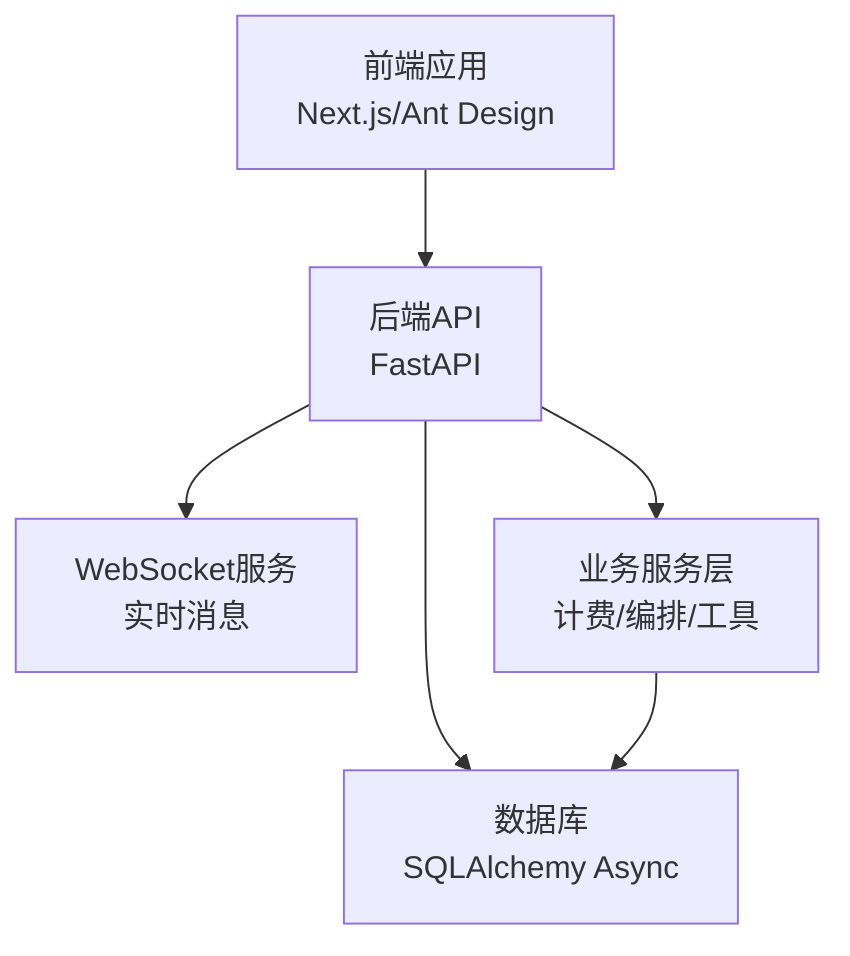
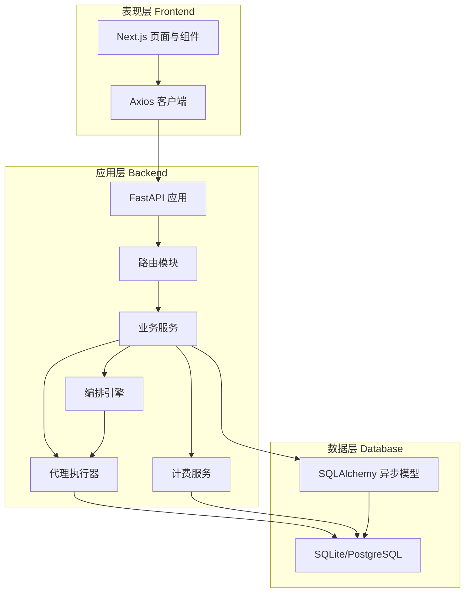
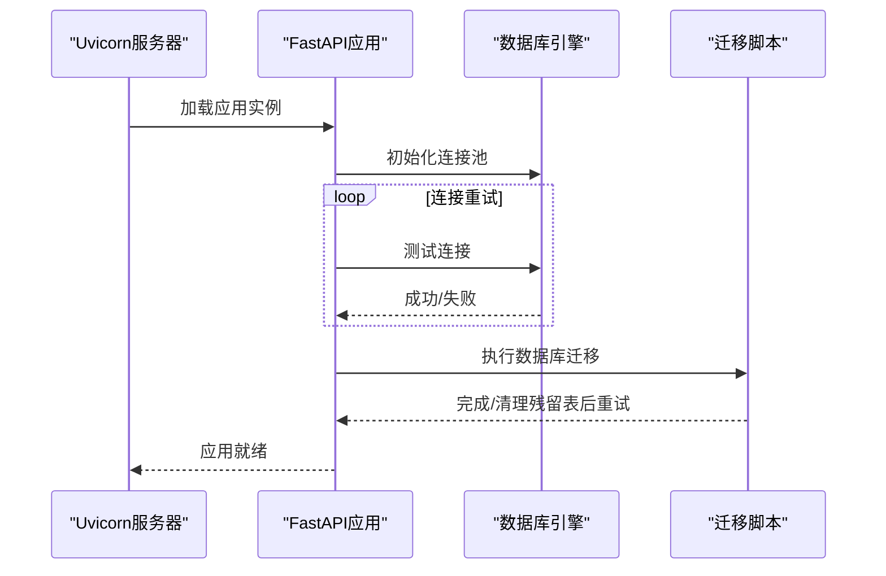
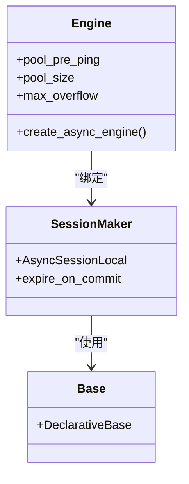
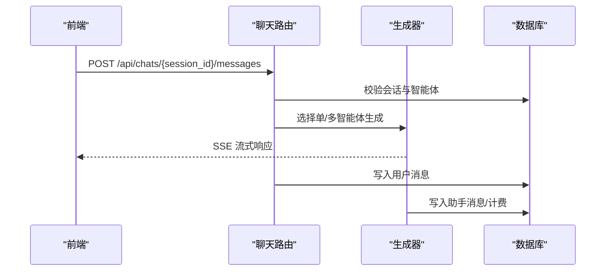
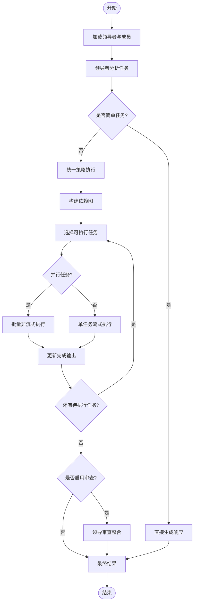
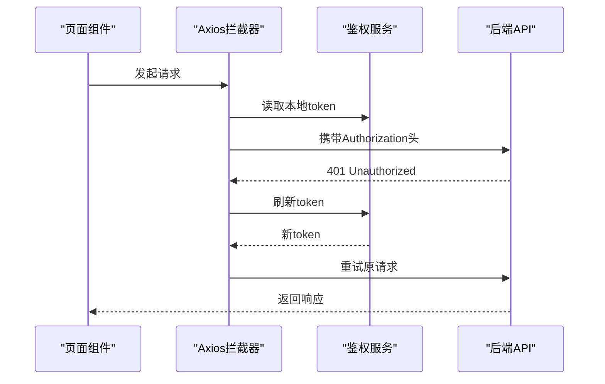
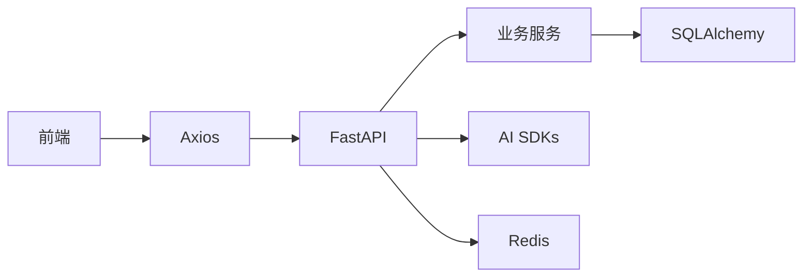

# 整体架构设计

<cite>
**本文档引用的文件**
- [backend/main.py](file://backend/main.py)
- [backend/config.py](file://backend/config.py)
- [backend/database.py](file://backend/database.py)
- [backend/models.py](file://backend/models.py)
- [backend/schemas.py](file://backend/schemas.py)
- [backend/routers/admin.py](file://backend/routers/admin.py)
- [backend/routers/agents.py](file://backend/routers/agents.py)
- [backend/routers/chats.py](file://backend/routers/chats.py)
- [backend/services/orchestrator.py](file://backend/services/orchestrator.py)
- [backend/services/agent_executor.py](file://backend/services/agent_executor.py)
- [backend/services/billing.py](file://backend/services/billing.py)
- [frontend/src/app/layout.tsx](file://frontend/src/app/layout.tsx)
- [frontend/src/lib/api.ts](file://frontend/src/lib/api.ts)
- [frontend/package.json](file://frontend/package.json)
- [backend/requirements.txt](file://backend/requirements.txt)
</cite>

## 目录
1. [简介](#简介)
2. [项目结构](#项目结构)
3. [核心组件](#核心组件)
4. [架构总览](#架构总览)
5. [详细组件分析](#详细组件分析)
6. [依赖关系分析](#依赖关系分析)
7. [性能考虑](#性能考虑)
8. [故障排除指南](#故障排除指南)
9. [结论](#结论)

## 简介
本文件面向技术团队，系统化阐述 Infinite Game 平台的整体架构设计。平台采用前后端分离架构，后端基于 Python FastAPI 构建，前端基于 Next.js 开发，通过 REST API 与 WebSocket 实现实时通信。系统采用分层架构设计，明确划分表现层（Frontend）、应用层（Backend）、数据层（Database）的职责与交互关系，强调模块化组织与组件解耦，提供清晰的系统视图与协作模式。

## 项目结构
平台采用典型的三层架构与模块化组织方式：
- 表现层（Frontend，Next.js）：负责用户界面渲染、状态管理、路由与交互；通过 Axios 客户端访问后端 API。
- 应用层（Backend，FastAPI）：负责业务逻辑编排、路由分发、认证授权、计费与账务、多智能体编排与流式输出。
- 数据层（Database，SQLAlchemy Async + SQLite/PostgreSQL）：负责持久化存储、事务与连接池管理。

图表来源
- [backend/main.py:110-175](file://backend/main.py#L110-L175)
- [frontend/src/app/layout.tsx:23-41](file://frontend/src/app/layout.tsx#L23-L41)

章节来源
- [backend/main.py:110-175](file://backend/main.py#L110-L175)
- [frontend/src/app/layout.tsx:23-41](file://frontend/src/app/layout.tsx#L23-L41)

## 核心组件
- 后端入口与生命周期管理：FastAPI 应用初始化、CORS 配置、数据库连接与迁移、WebSocket 端点、中间件注册。
- 配置中心：集中管理数据库连接、Redis、AI 模型密钥、JWT 参数与系统开关。
- 数据库层：异步引擎、连接池、SQLite WAL 优化、模型定义与依赖注入。
- 路由与控制器：用户/管理员认证、聊天会话与消息、智能体管理、视频与剧场资源、计费与订阅。
- 业务服务：多智能体编排（动态编排器）、代理执行器（统一对话代理封装）、计费计算与原子扣费。
- 前端客户端：Axios 封装、鉴权拦截器、刷新令牌队列与重试、主题与权限上下文。

章节来源
- [backend/main.py:110-175](file://backend/main.py#L110-L175)
- [backend/config.py:7-43](file://backend/config.py#L7-L43)
- [backend/database.py:9-45](file://backend/database.py#L9-L45)
- [backend/models.py:10-503](file://backend/models.py#L10-L503)
- [backend/schemas.py:13-800](file://backend/schemas.py#L13-L800)
- [backend/routers/admin.py:19-501](file://backend/routers/admin.py#L19-L501)
- [backend/routers/agents.py:10-151](file://backend/routers/agents.py#L10-L151)
- [backend/routers/chats.py:18-232](file://backend/routers/chats.py#L18-L232)
- [backend/services/orchestrator.py:418-914](file://backend/services/orchestrator.py#L418-L914)
- [backend/services/agent_executor.py:63-287](file://backend/services/agent_executor.py#L63-L287)
- [backend/services/billing.py:12-388](file://backend/services/billing.py#L12-L388)
- [frontend/src/lib/api.ts:3-84](file://frontend/src/lib/api.ts#L3-L84)

## 架构总览
系统边界与交互：
- 边界：前端通过 /api 前缀访问后端 REST API；WebSocket 端点 /ws/{user_id} 提供实时消息通道。
- 服务间通信：后端内部通过模块化服务（计费、编排、工具）协作；数据库通过 SQLAlchemy 异步会话进行读写。
- 数据流向：前端发起请求 → 后端路由解析 → 业务服务处理 → 数据库持久化 → 返回响应（含 SSE/流式响应）。

图表来源
- [backend/main.py:138-154](file://backend/main.py#L138-L154)
- [backend/services/orchestrator.py:418-520](file://backend/services/orchestrator.py#L418-L520)
- [backend/services/agent_executor.py:63-126](file://backend/services/agent_executor.py#L63-L126)
- [backend/services/billing.py:178-308](file://backend/services/billing.py#L178-L308)
- [backend/database.py:42-45](file://backend/database.py#L42-L45)

章节来源
- [backend/main.py:138-154](file://backend/main.py#L138-L154)
- [backend/services/orchestrator.py:418-520](file://backend/services/orchestrator.py#L418-L520)
- [backend/services/agent_executor.py:63-126](file://backend/services/agent_executor.py#L63-L126)
- [backend/services/billing.py:178-308](file://backend/services/billing.py#L178-L308)
- [backend/database.py:42-45](file://backend/database.py#L42-L45)

## 详细组件分析

### 后端入口与生命周期（FastAPI）
- 职责：应用启动与关闭生命周期管理、数据库连接与迁移、CORS 与中间件、路由注册、WebSocket 端点。
- 关键点：Windows 平台事件循环与 UTF-8 编码修复、日志精细化控制、数据库连接重试与迁移失败清理、媒体目录初始化、Narrative 引擎配置加载。

图表来源
- [backend/main.py:49-108](file://backend/main.py#L49-L108)

章节来源
- [backend/main.py:49-108](file://backend/main.py#L49-L108)

### 配置中心（Settings）
- 职责：集中管理数据库连接、Redis、AI 模型密钥、JWT 参数、生成设置与系统开关。
- 设计要点：环境变量优先、SQLite 默认回退、生产环境建议使用 PostgreSQL。

章节来源
- [backend/config.py:7-43](file://backend/config.py#L7-L43)

### 数据库层（SQLAlchemy Async）
- 职责：异步引擎创建、连接池配置、SQLite WAL 优化、会话工厂与依赖注入。
- 性能优化：WAL 模式、busy_timeout、同步级别平衡、连接池大小与溢出配置。

图表来源
- [backend/database.py:9-45](file://backend/database.py#L9-L45)

章节来源
- [backend/database.py:9-45](file://backend/database.py#L9-L45)

### 模型与数据结构（ORM）
- 职责：定义用户、管理员、剧场、节点、资产、智能体、聊天会话与消息、计费交易、视频任务等实体。
- 设计要点：UUID 主键、外键约束、JSON 字段存储动态配置、时间戳自动维护、订阅与积分体系。

章节来源
- [backend/models.py:10-503](file://backend/models.py#L10-L503)

### 路由与控制器（REST API）
- 职责：用户/管理员认证、聊天会话与消息、智能体管理、视频与剧场资源、计费与订阅。
- 关键流程：聊天消息发送触发单智能体或多智能体生成器，返回 Server-Sent Events 流。

图表来源
- [backend/routers/chats.py:127-183](file://backend/routers/chats.py#L127-L183)

章节来源
- [backend/routers/chats.py:18-232](file://backend/routers/chats.py#L18-L232)

### 业务服务（编排、执行、计费）
- 动态多智能体编排：统一分析任务、分解子任务、依赖调度、并行/串行执行、可选领导审查。
- 代理执行器：封装 DialogAgent，统一模型创建与调用，支持流式输出与非流式执行。
- 计费服务：映射表驱动的多维度计费、原子扣费与退款、视频任务计费。

图表来源
- [backend/services/orchestrator.py:418-520](file://backend/services/orchestrator.py#L418-L520)
- [backend/services/orchestrator.py:558-596](file://backend/services/orchestrator.py#L558-L596)
- [backend/services/agent_executor.py:74-126](file://backend/services/agent_executor.py#L74-L126)

章节来源
- [backend/services/orchestrator.py:418-914](file://backend/services/orchestrator.py#L418-L914)
- [backend/services/agent_executor.py:63-287](file://backend/services/agent_executor.py#L63-L287)
- [backend/services/billing.py:12-388](file://backend/services/billing.py#L12-L388)

### 前端客户端（Next.js/Axios）
- 职责：Axios 实例封装、鉴权头注入、401 自动刷新令牌、请求队列与重试、主题与权限上下文。
- 优势：统一错误处理、自动重试、无感知刷新、开发体验友好。

图表来源
- [frontend/src/lib/api.ts:3-84](file://frontend/src/lib/api.ts#L3-L84)

章节来源
- [frontend/src/lib/api.ts:3-84](file://frontend/src/lib/api.ts#L3-L84)
- [frontend/src/app/layout.tsx:23-41](file://frontend/src/app/layout.tsx#L23-L41)

## 依赖关系分析
- 技术栈选择：后端使用 FastAPI + SQLAlchemy Async + Alembic；前端使用 Next.js + Ant Design + Axios + SWR/Zustand。
- 模块化与解耦：路由层只做参数校验与转发，业务逻辑下沉到服务层；服务层通过接口抽象与依赖注入降低耦合。
- 外部依赖：AI 模型 SDK（OpenAI/Anthropic/Gemini/X.AI/Volc）、Redis（缓存/会话）、SQLite/PostgreSQL（持久化）。

图表来源
- [frontend/package.json:13-94](file://frontend/package.json#L13-L94)
- [backend/requirements.txt:1-29](file://backend/requirements.txt#L1-L29)

章节来源
- [frontend/package.json:13-94](file://frontend/package.json#L13-L94)
- [backend/requirements.txt:1-29](file://backend/requirements.txt#L1-L29)

## 性能考虑
- 异步与并发：后端使用 SQLAlchemy Async 与 asyncio，减少阻塞；WebSocket 与 SSE 提升实时交互性能。
- 数据库优化：SQLite WAL 模式、连接池与超时配置、预热连接与重连策略。
- 缓存与限流：Redis 缓存热点数据与会话状态；前端 SWR 缓存与去抖策略。
- 计费与预算：预估费用与余额检查，避免无效调用；视频与图像生成按维度精确计费。
- 前端性能：组件懒加载、虚拟滚动、图片与视频懒加载、Tailwind CSS 与现代打包工具链。

## 故障排除指南
- 数据库连接失败：检查 DATABASE_URL、SQLite 文件路径与权限、WAL 参数设置；查看迁移失败日志并清理残留临时表后重试。
- 认证与鉴权：确认 Authorization 头、JWT 密钥与算法、刷新令牌流程；检查 401 自动刷新队列与本地存储。
- 计费异常：核对智能体费率字段、视频任务计费维度、原子扣费条件与冻结状态；查看交易记录与余额变化。
- 编排失败：检查领导者配置、成员智能体可用性、依赖图构建与执行顺序；关注流式事件与错误传播。

章节来源
- [backend/main.py:49-108](file://backend/main.py#L49-L108)
- [backend/services/billing.py:178-308](file://backend/services/billing.py#L178-L308)
- [frontend/src/lib/api.ts:31-81](file://frontend/src/lib/api.ts#L31-L81)

## 结论
Infinite Game 平台通过前后端分离与分层架构实现了高内聚、低耦合的系统设计。后端以 FastAPI 为核心，结合 SQLAlchemy Async 与模块化服务，支撑多智能体编排与实时交互；前端以 Next.js 为基础，提供现代化 UI 与良好的开发体验。通过严格的配置管理、数据库优化与计费体系，平台具备良好的可扩展性与可维护性，能够支撑未来功能演进与业务增长。