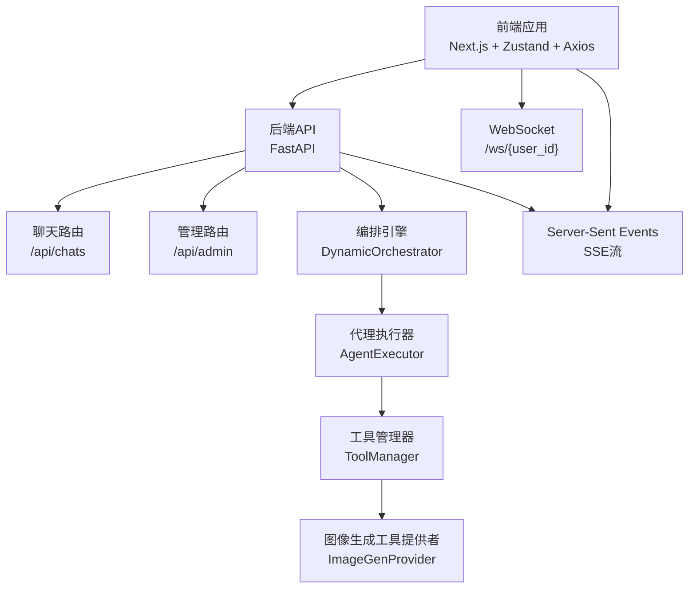
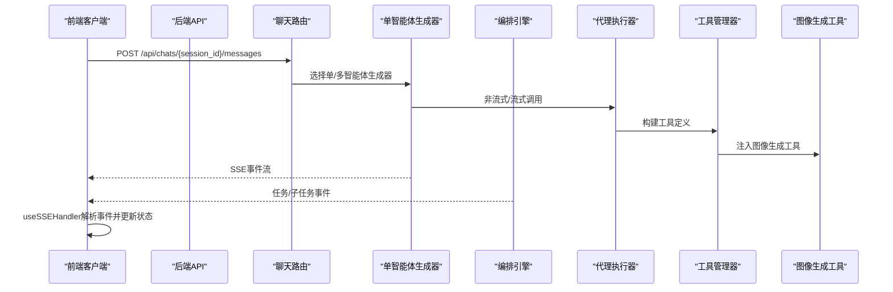
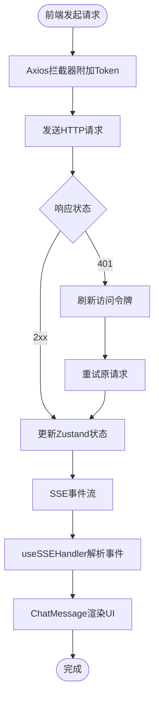
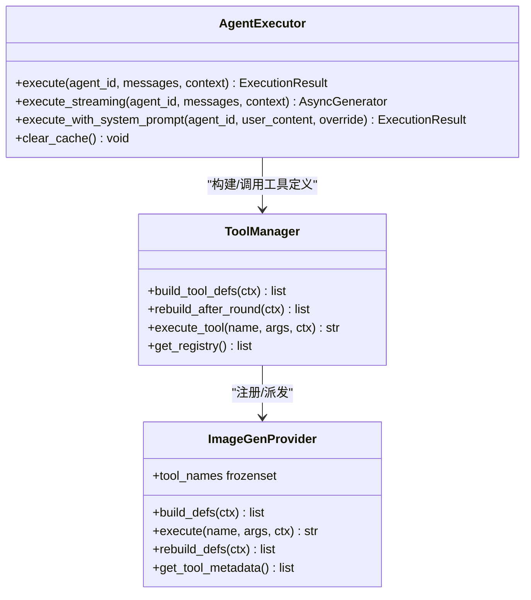
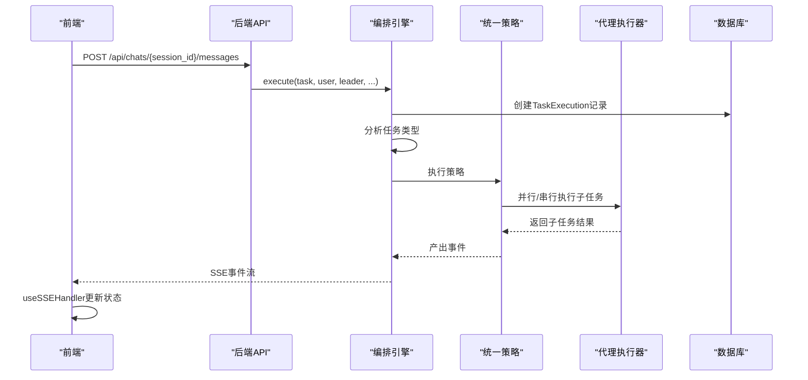
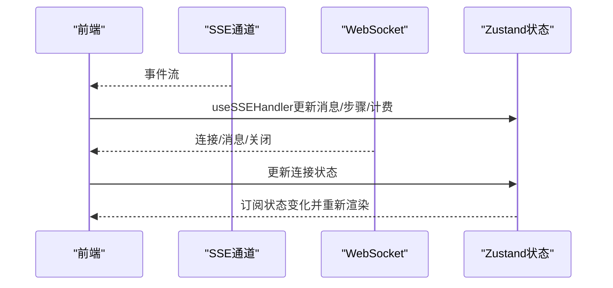
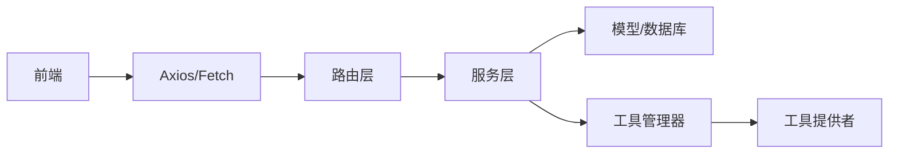

# 组件交互关系

<cite>
**本文档引用的文件**
- [backend/main.py](file://backend/main.py)
- [backend/routers/admin.py](file://backend/routers/admin.py)
- [backend/routers/chats.py](file://backend/routers/chats.py)
- [backend/services/orchestrator.py](file://backend/services/orchestrator.py)
- [backend/services/agent_executor.py](file://backend/services/agent_executor.py)
- [backend/services/chat_generation.py](file://backend/services/chat_generation.py)
- [backend/services/tool_manager/manager.py](file://backend/services/tool_manager/manager.py)
- [backend/services/tool_manager/providers/image_gen.py](file://backend/services/tool_manager/providers/image_gen.py)
- [backend/config.py](file://backend/config.py)
- [frontend/src/lib/api.ts](file://frontend/src/lib/api.ts)
- [frontend/src/components/ai-assistant/hooks/useSSEHandler.ts](file://frontend/src/components/ai-assistant/hooks/useSSEHandler.ts)
- [frontend/src/store/useAIAssistantStore.ts](file://frontend/src/store/useAIAssistantStore.ts)
- [frontend/src/components/ai-assistant/ChatMessage.tsx](file://frontend/src/components/ai-assistant/ChatMessage.tsx)
- [frontend/src/hooks/useSocket.ts](file://frontend/src/hooks/useSocket.ts)
</cite>

## 目录
1. [简介](#简介)
2. [项目结构](#项目结构)
3. [核心组件](#核心组件)
4. [架构总览](#架构总览)
5. [详细组件分析](#详细组件分析)
6. [依赖分析](#依赖分析)
7. [性能考虑](#性能考虑)
8. [故障排查指南](#故障排查指南)
9. [结论](#结论)
10. [附录](#附录)

## 简介
本文件聚焦于KunFlix平台的组件交互关系，系统性梳理前端与后端API的交互、AI代理与工具系统的协作、实时通信组件的事件传递机制，并解释组件间的依赖关系、数据传递流程与状态同步机制。同时，结合现有代码实现，给出微服务化背景下的服务发现、负载均衡与故障处理策略建议，以及组件生命周期管理、错误传播机制与性能监控集成的实践要点。

## 项目结构
- 后端采用FastAPI框架，通过路由模块化组织业务域，服务层封装AI推理、工具调度、计费与媒体处理等能力。
- 前端基于Next.js，使用Zustand进行状态管理，Axios封装API请求，Socket用于WebSocket长连接，SSE用于流式响应。
- 工具系统通过统一的ToolManager集中注册与派发，支持多供应商图像生成等工具。

图表来源
- [backend/main.py:110-175](file://backend/main.py#L110-L175)
- [backend/routers/chats.py:127-183](file://backend/routers/chats.py#L127-L183)
- [backend/services/orchestrator.py:418-534](file://backend/services/orchestrator.py#L418-L534)
- [backend/services/agent_executor.py:63-277](file://backend/services/agent_executor.py#L63-L277)
- [backend/services/tool_manager/manager.py:23-108](file://backend/services/tool_manager/manager.py#L23-L108)
- [backend/services/tool_manager/providers/image_gen.py:276-328](file://backend/services/tool_manager/providers/image_gen.py#L276-L328)

章节来源
- [backend/main.py:110-175](file://backend/main.py#L110-L175)
- [backend/routers/chats.py:18-232](file://backend/routers/chats.py#L18-L232)

## 核心组件
- 后端入口与中间件
  - 应用启动与数据库迁移、CORS与调试中间件、路由注册、WebSocket端点。
- 路由层
  - 聊天路由负责会话与消息的创建、查询与流式生成；管理路由提供后台统计、用户与订阅管理等。
- 服务层
  - 编排引擎：统一的多智能体协作与任务分解、事件流式输出。
  - 代理执行器：封装不同LLM提供商的模型实例与调用，支持非流式与流式两种执行路径。
  - 工具管理器：集中注册与派发工具，按上下文动态构建工具定义。
  - 图像生成工具提供者：按全局配置与供应商能力动态生成工具定义并执行。
- 前端
  - API封装：统一拦截器、401刷新与队列处理。
  - SSE处理器：解析事件类型与数据，更新AI助手状态与UI。
  - 状态存储：Zustand管理消息、会话、画布会话缓存、上下文用量等。
  - WebSocket钩子：建立与后端的长连接，接收通用消息。

章节来源
- [backend/main.py:110-175](file://backend/main.py#L110-L175)
- [backend/routers/chats.py:18-232](file://backend/routers/chats.py#L18-L232)
- [backend/routers/admin.py:1-501](file://backend/routers/admin.py#L1-L501)
- [backend/services/orchestrator.py:418-800](file://backend/services/orchestrator.py#L418-L800)
- [backend/services/agent_executor.py:63-287](file://backend/services/agent_executor.py#L63-L287)
- [backend/services/tool_manager/manager.py:23-108](file://backend/services/tool_manager/manager.py#L23-L108)
- [backend/services/tool_manager/providers/image_gen.py:276-328](file://backend/services/tool_manager/providers/image_gen.py#L276-L328)
- [frontend/src/lib/api.ts:1-84](file://frontend/src/lib/api.ts#L1-L84)
- [frontend/src/components/ai-assistant/hooks/useSSEHandler.ts:25-391](file://frontend/src/components/ai-assistant/hooks/useSSEHandler.ts#L25-L391)
- [frontend/src/store/useAIAssistantStore.ts:104-381](file://frontend/src/store/useAIAssistantStore.ts#L104-L381)
- [frontend/src/hooks/useSocket.ts:1-43](file://frontend/src/hooks/useSocket.ts#L1-L43)

## 架构总览
后端通过FastAPI提供REST与SSE接口，前端通过Axios发起请求，SSE用于流式返回多智能体协作与单智能体推理过程，WebSocket用于通用消息推送。编排引擎根据任务类型选择简单直返或复杂子任务并行/串行执行，代理执行器对接不同LLM提供商，工具管理器按上下文动态注入工具定义，图像生成工具提供者依据全局配置与供应商能力生成工具定义并执行。

图表来源
- [backend/routers/chats.py:127-183](file://backend/routers/chats.py#L127-L183)
- [backend/services/chat_generation.py:29-200](file://backend/services/chat_generation.py#L29-L200)
- [backend/services/orchestrator.py:418-534](file://backend/services/orchestrator.py#L418-L534)
- [backend/services/agent_executor.py:74-208](file://backend/services/agent_executor.py#L74-L208)
- [backend/services/tool_manager/manager.py:42-91](file://backend/services/tool_manager/manager.py#L42-L91)
- [backend/services/tool_manager/providers/image_gen.py:287-313](file://backend/services/tool_manager/providers/image_gen.py#L287-L313)

## 详细组件分析

### 前端与后端API交互
- 请求拦截与认证
  - Axios在请求头注入Bearer Token；401时自动刷新令牌并重试，避免重复请求。
- SSE事件处理
  - useSSEHandler解析事件类型，更新消息、技能/工具调用、多智能体步骤、上下文用量与视频任务等状态。
- 状态管理
  - useAIAssistantStore维护消息、会话、画布会话缓存、面板尺寸位置、上下文用量与虚拟滚动参数。
- WebSocket
  - useSocket建立/ws/{user_id}连接，接收通用消息并维护连接状态。

图表来源
- [frontend/src/lib/api.ts:9-81](file://frontend/src/lib/api.ts#L9-L81)
- [frontend/src/components/ai-assistant/hooks/useSSEHandler.ts:56-391](file://frontend/src/components/ai-assistant/hooks/useSSEHandler.ts#L56-L391)
- [frontend/src/store/useAIAssistantStore.ts:104-381](file://frontend/src/store/useAIAssistantStore.ts#L104-L381)
- [frontend/src/components/ai-assistant/ChatMessage.tsx:253-421](file://frontend/src/components/ai-assistant/ChatMessage.tsx#L253-L421)

章节来源
- [frontend/src/lib/api.ts:1-84](file://frontend/src/lib/api.ts#L1-L84)
- [frontend/src/components/ai-assistant/hooks/useSSEHandler.ts:25-391](file://frontend/src/components/ai-assistant/hooks/useSSEHandler.ts#L25-L391)
- [frontend/src/store/useAIAssistantStore.ts:104-381](file://frontend/src/store/useAIAssistantStore.ts#L104-L381)
- [frontend/src/components/ai-assistant/ChatMessage.tsx:1-421](file://frontend/src/components/ai-assistant/ChatMessage.tsx#L1-L421)
- [frontend/src/hooks/useSocket.ts:1-43](file://frontend/src/hooks/useSocket.ts#L1-L43)

### AI代理与工具系统协作
- 工具定义构建
  - ToolManager按上下文聚合各提供者的工具定义，支持按轮次重建与拼接。
- 图像生成工具
  - ImageGenProvider根据全局配置与供应商能力动态生成工具定义，执行时按供应商类型分派生成器。
- 代理执行
  - AgentExecutor封装不同LLM提供商模型实例，支持非流式与流式两种执行路径，统一返回内容与token统计。

图表来源
- [backend/services/tool_manager/manager.py:23-108](file://backend/services/tool_manager/manager.py#L23-L108)
- [backend/services/tool_manager/providers/image_gen.py:276-328](file://backend/services/tool_manager/providers/image_gen.py#L276-L328)
- [backend/services/agent_executor.py:63-287](file://backend/services/agent_executor.py#L63-L287)

章节来源
- [backend/services/tool_manager/manager.py:23-108](file://backend/services/tool_manager/manager.py#L23-L108)
- [backend/services/tool_manager/providers/image_gen.py:107-328](file://backend/services/tool_manager/providers/image_gen.py#L107-L328)
- [backend/services/agent_executor.py:63-287](file://backend/services/agent_executor.py#L63-L287)

### 多智能体编排与事件流
- 任务分析与路由
  - DynamicOrchestrator加载领导者与成员，分析任务类型，简单任务直返，复杂任务分解为子任务。
- 统一策略
  - UnifiedStrategy按依赖关系并发/串行执行子任务，支持流式与非流式混合模式，产出事件供前端渲染。
- 事件类型
  - 包括任务开始、分析完成、子任务创建/开始/完成/失败、任务完成、计费信息、上下文压缩等。

图表来源
- [backend/services/orchestrator.py:418-800](file://backend/services/orchestrator.py#L418-L800)
- [backend/services/agent_executor.py:74-208](file://backend/services/agent_executor.py#L74-L208)
- [frontend/src/components/ai-assistant/hooks/useSSEHandler.ts:67-391](file://frontend/src/components/ai-assistant/hooks/useSSEHandler.ts#L67-L391)

章节来源
- [backend/services/orchestrator.py:418-800](file://backend/services/orchestrator.py#L418-L800)
- [backend/services/agent_executor.py:63-287](file://backend/services/agent_executor.py#L63-L287)
- [frontend/src/components/ai-assistant/hooks/useSSEHandler.ts:25-391](file://frontend/src/components/ai-assistant/hooks/useSSEHandler.ts#L25-L391)

### 实时通信与状态同步
- SSE事件
  - 后端通过SSE向前端推送任务与子任务状态、文本片段、工具/技能调用、计费信息与上下文压缩通知。
- WebSocket
  - 前端通过WebSocket与后端建立长连接，用于通用消息推送与状态同步。
- 前端状态同步
  - useSSEHandler解析事件并更新Zustand状态，ChatMessage根据状态渲染UI，实现前后端状态一致。

图表来源
- [frontend/src/components/ai-assistant/hooks/useSSEHandler.ts:25-391](file://frontend/src/components/ai-assistant/hooks/useSSEHandler.ts#L25-L391)
- [frontend/src/store/useAIAssistantStore.ts:104-381](file://frontend/src/store/useAIAssistantStore.ts#L104-L381)
- [frontend/src/hooks/useSocket.ts:1-43](file://frontend/src/hooks/useSocket.ts#L1-L43)

章节来源
- [frontend/src/components/ai-assistant/hooks/useSSEHandler.ts:25-391](file://frontend/src/components/ai-assistant/hooks/useSSEHandler.ts#L25-L391)
- [frontend/src/store/useAIAssistantStore.ts:104-381](file://frontend/src/store/useAIAssistantStore.ts#L104-L381)
- [frontend/src/hooks/useSocket.ts:1-43](file://frontend/src/hooks/useSocket.ts#L1-L43)

## 依赖分析
- 组件耦合
  - 路由层依赖服务层；服务层依赖模型与数据库；工具系统与LLM提供商解耦。
- 外部依赖
  - FastAPI、SQLAlchemy异步、Uvicorn、Axios、Zustand、React等。
- 循环依赖
  - 当前实现未见明显循环导入；工具提供者通过ToolManager集中注册，避免分散派发导致的耦合。

图表来源
- [backend/routers/chats.py:18-232](file://backend/routers/chats.py#L18-L232)
- [backend/services/chat_generation.py:1-200](file://backend/services/chat_generation.py#L1-L200)
- [backend/services/tool_manager/manager.py:23-108](file://backend/services/tool_manager/manager.py#L23-L108)

章节来源
- [backend/routers/chats.py:18-232](file://backend/routers/chats.py#L18-L232)
- [backend/services/chat_generation.py:1-200](file://backend/services/chat_generation.py#L1-L200)
- [backend/services/tool_manager/manager.py:23-108](file://backend/services/tool_manager/manager.py#L23-L108)

## 性能考虑
- 流式传输
  - SSE与流式代理执行器减少首字节延迟，提升交互体验。
- 并发与批处理
  - 多智能体统一策略在同层级依赖满足时并发执行子任务，降低总耗时。
- 缓存与重建
  - 代理与模型实例缓存减少重复初始化开销；工具定义按轮次重建避免无效刷新。
- 上下文压缩
  - 历史消息压缩与摘要注入，控制上下文窗口，避免超限与性能退化。

## 故障排查指南
- 认证与授权
  - 401自动刷新失败：检查本地存储的刷新令牌是否存在与有效；确认后端刷新接口可用。
- SSE事件异常
  - 事件类型缺失或数据格式错误：检查后端事件构造与前端解析逻辑；关注done/error事件的收尾处理。
- 工具执行失败
  - 未知工具名：确认ToolManager派发映射；检查工具提供者是否正确注册。
  - 供应商不可用：检查全局配置与供应商激活状态。
- 数据库与迁移
  - 启动阶段数据库连接失败：查看重试与迁移日志；必要时清理残留临时表后重试。
- WebSocket连接
  - 连接失败或断开：确认后端WebSocket端点与前端连接地址；检查网络与防火墙。

章节来源
- [frontend/src/lib/api.ts:19-81](file://frontend/src/lib/api.ts#L19-L81)
- [frontend/src/components/ai-assistant/hooks/useSSEHandler.ts:374-391](file://frontend/src/components/ai-assistant/hooks/useSSEHandler.ts#L374-L391)
- [backend/services/tool_manager/manager.py:87-91](file://backend/services/tool_manager/manager.py#L87-L91)
- [backend/main.py:49-108](file://backend/main.py#L49-L108)
- [frontend/src/hooks/useSocket.ts:8-33](file://frontend/src/hooks/useSocket.ts#L8-L33)

## 结论
KunFlix平台通过清晰的前后端职责划分与服务层抽象，实现了多智能体编排、工具系统动态注入与实时事件流的协同。前端通过Axios、SSE与WebSocket实现高效、稳定的交互体验；后端通过编排引擎与代理执行器保障推理与工具调用的一致性与可观测性。建议在微服务化演进中引入服务发现与负载均衡机制，强化容错与弹性恢复策略，并持续完善性能监控与告警体系。

## 附录
- 配置项参考
  - 数据库与Redis连接、JWT密钥、默认模型与生成设置等。
- 调试方法
  - 启用后端调试中间件查看鉴权头与请求路径；前端开启SSE事件日志与WebSocket连接日志；结合Zustand DevTools观察状态变化。

章节来源
- [backend/config.py:7-43](file://backend/config.py#L7-L43)
- [backend/main.py:119-128](file://backend/main.py#L119-L128)
- [frontend/src/components/ai-assistant/hooks/useSSEHandler.ts:25-391](file://frontend/src/components/ai-assistant/hooks/useSSEHandler.ts#L25-L391)
- [frontend/src/hooks/useSocket.ts:1-43](file://frontend/src/hooks/useSocket.ts#L1-L43)