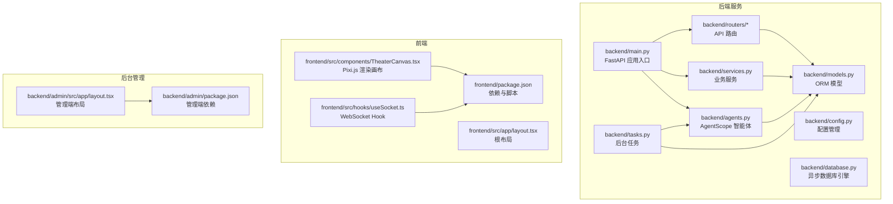
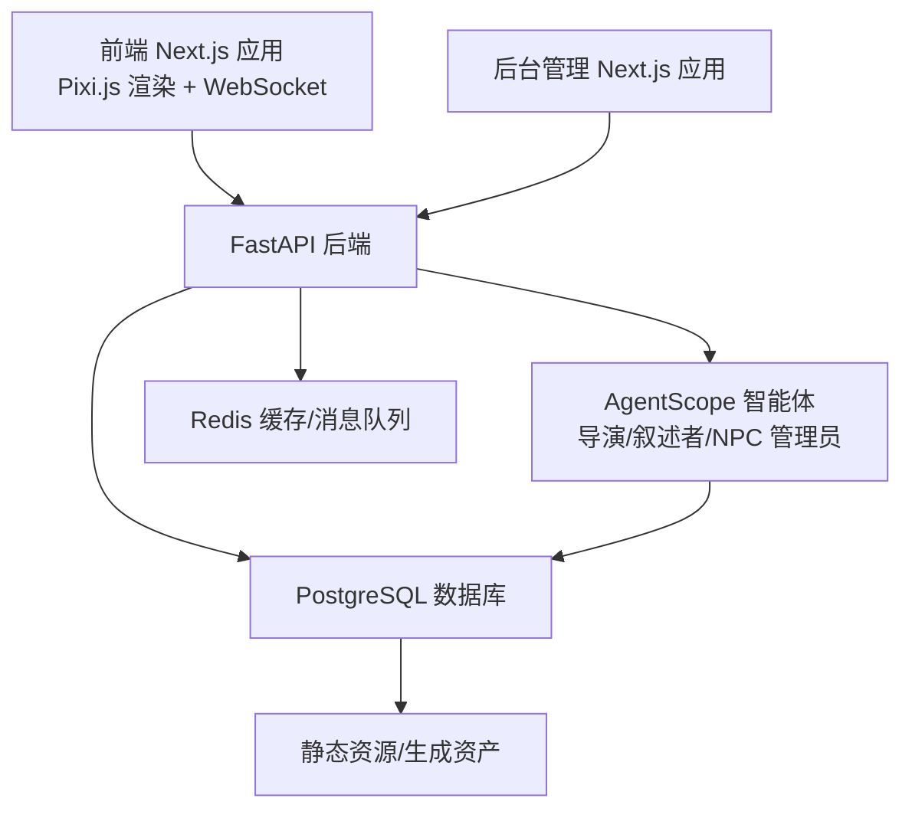
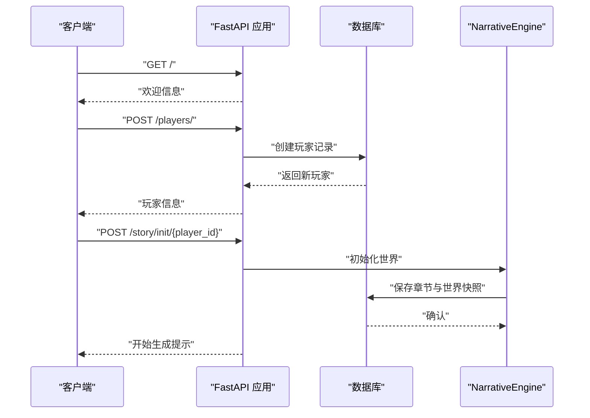
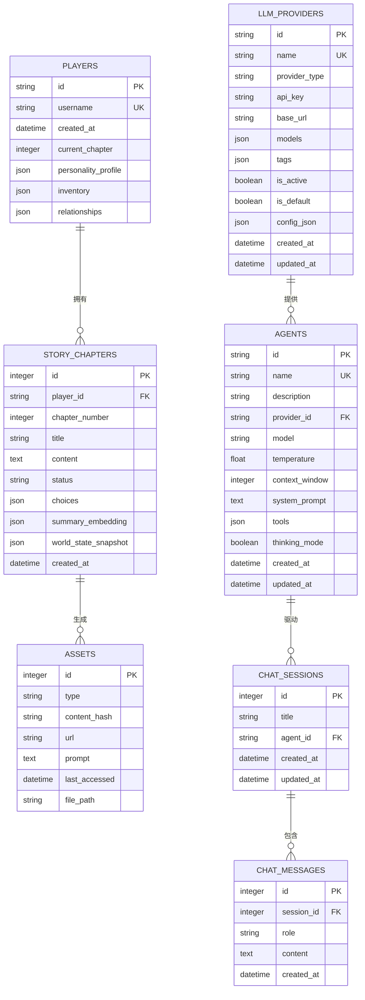
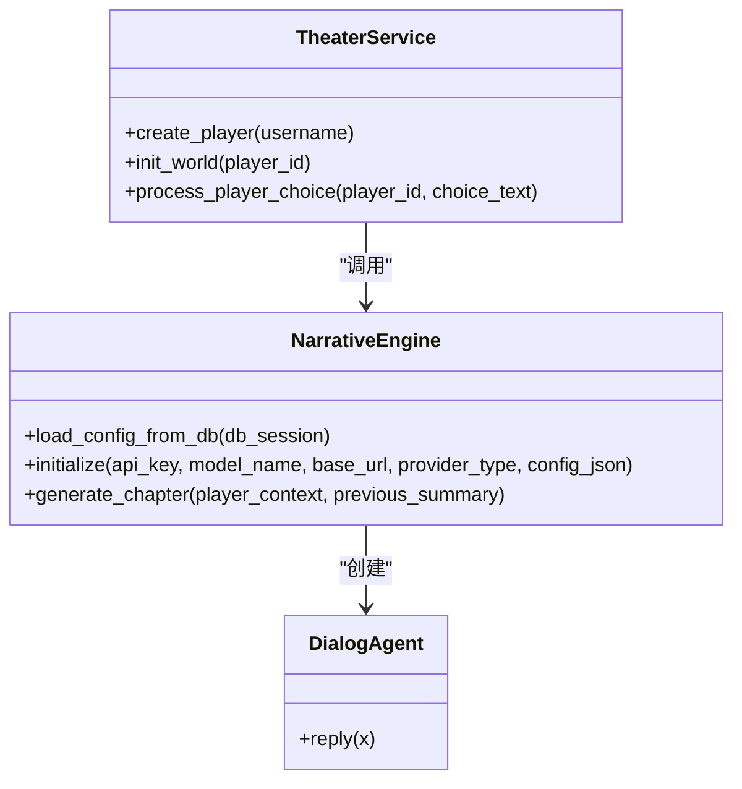
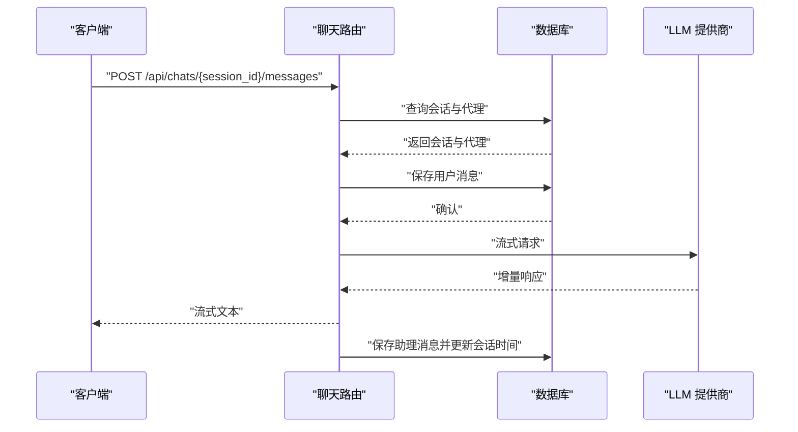
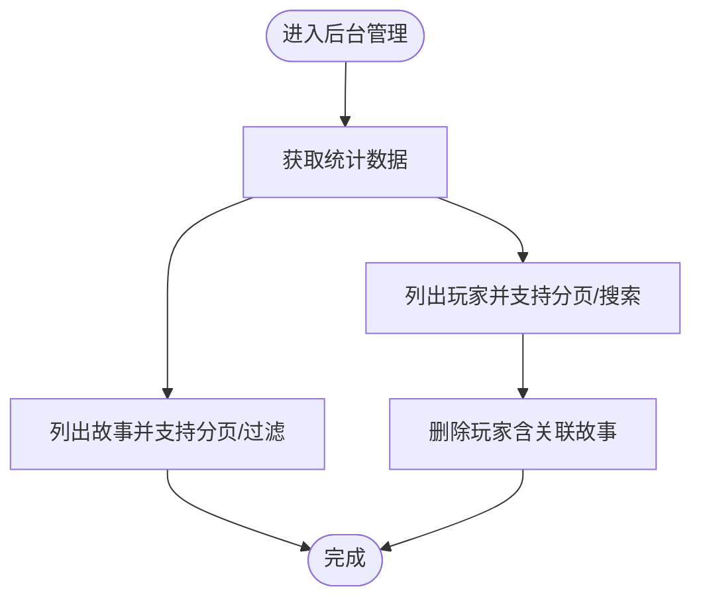
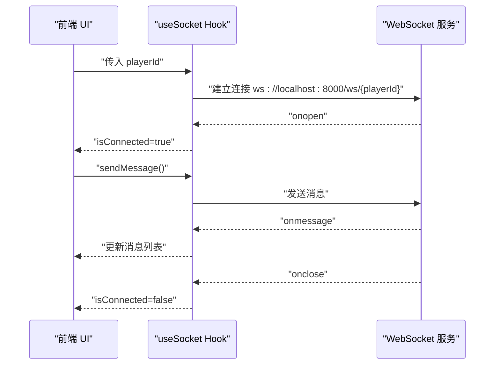
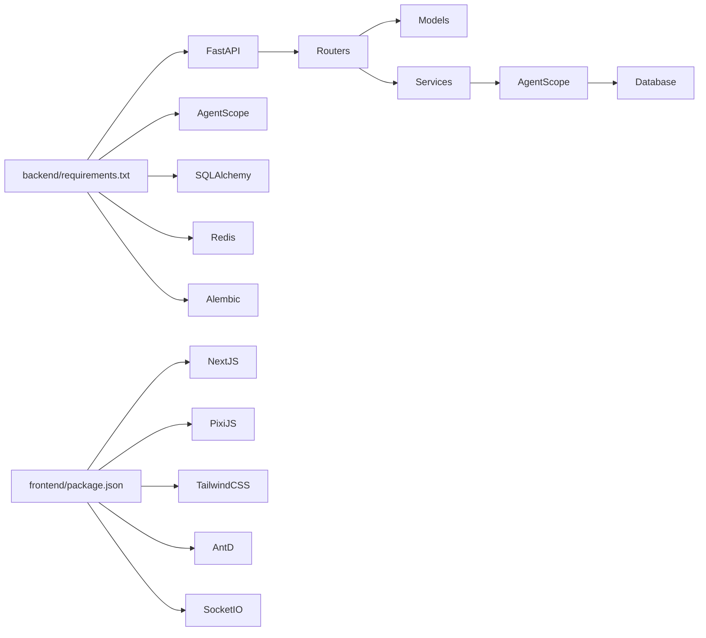

# 技术栈与架构概览

<cite>
**本文档引用的文件**
- [README.md](file://README.md)
- [backend/main.py](file://backend/main.py)
- [backend/requirements.txt](file://backend/requirements.txt)
- [backend/config.py](file://backend/config.py)
- [backend/database.py](file://backend/database.py)
- [backend/models.py](file://backend/models.py)
- [backend/services.py](file://backend/services.py)
- [backend/agents.py](file://backend/agents.py)
- [backend/routers/agents.py](file://backend/routers/agents.py)
- [backend/routers/chats.py](file://backend/routers/chats.py)
- [backend/routers/admin.py](file://backend/routers/admin.py)
- [backend/tasks.py](file://backend/tasks.py)
- [frontend/package.json](file://frontend/package.json)
- [frontend/src/app/layout.tsx](file://frontend/src/app/layout.tsx)
- [frontend/src/components/TheaterCanvas.tsx](file://frontend/src/components/TheaterCanvas.tsx)
- [frontend/src/hooks/useSocket.ts](file://frontend/src/hooks/useSocket.ts)
</cite>

## 目录
1. [引言](#引言)
2. [项目结构](#项目结构)
3. [核心组件](#核心组件)
4. [架构总览](#架构总览)
5. [详细组件分析](#详细组件分析)
6. [依赖关系分析](#依赖关系分析)
7. [性能考虑](#性能考虑)
8. [故障排除指南](#故障排除指南)
9. [结论](#结论)
10. [附录](#附录)

## 引言
本项目是一个基于 AgentScope 多智能体框架、Next.js 16 前端、FastAPI 后端与 PostgreSQL 数据库的无限剧情剧场系统。系统通过 LLM 驱动的叙事引擎与多模态生成能力，为玩家提供沉浸式动态剧情体验；同时提供后台管理系统用于可视化管理玩家、剧情与 LLM 供应商配置。

技术选型考量：
- 后端采用 Python 3.10+ 与 FastAPI，兼顾异步高并发与简洁 API 开发体验；
- 使用 AgentScope 实现多智能体协作（导演、编剧、NPC 管理员），支撑动态剧情生成；
- 数据持久化采用 PostgreSQL（SQLAlchemy 异步 ORM），结合向量嵌入（Embedding）保障长剧情一致性；
- 前端采用 Next.js 16 与 TypeScript，结合 Pixi.js 实现 2D 渲染，Tailwind CSS 提供样式支持；
- Redis 作为缓存与消息队列基础设施，配合 WebSocket 实现实时交互；
- 后台管理独立部署，便于系统监控与配置管理。

## 项目结构
项目采用前后端分离与模块化组织方式：
- backend：后端服务，包含 FastAPI 应用、数据库模型、路由、业务服务、AgentScope 智能体与任务调度；
- frontend：剧场客户端前端，基于 Next.js 16，使用 Pixi.js 进行 2D 渲染；
- backend/admin：后台管理系统前端，同样基于 Next.js 16；
- docs/wiki：项目文档与开发指南。

**图表来源**
- [backend/main.py](file://backend/main.py#L83-L98)
- [backend/config.py](file://backend/config.py#L7-L33)
- [backend/database.py](file://backend/database.py#L8-L23)
- [backend/models.py](file://backend/models.py#L9-L122)
- [backend/services.py](file://backend/services.py#L8-L66)
- [backend/agents.py](file://backend/agents.py#L43-L196)
- [backend/routers/agents.py](file://backend/routers/agents.py#L9-L141)
- [backend/routers/chats.py](file://backend/routers/chats.py#L16-L275)
- [backend/routers/admin.py](file://backend/routers/admin.py#L10-L112)
- [backend/tasks.py](file://backend/tasks.py#L7-L62)
- [frontend/package.json](file://frontend/package.json#L11-L33)
- [frontend/src/app/layout.tsx](file://frontend/src/app/layout.tsx#L1-L35)
- [frontend/src/components/TheaterCanvas.tsx](file://frontend/src/components/TheaterCanvas.tsx#L10-L47)
- [frontend/src/hooks/useSocket.ts](file://frontend/src/hooks/useSocket.ts#L3-L42)

**章节来源**
- [README.md](file://README.md#L34-L51)
- [backend/main.py](file://backend/main.py#L83-L98)

## 核心组件
- 后端应用与生命周期管理：FastAPI 应用在启动时执行数据库迁移与 LLM 配置加载，注册 CORS 与路由，提供根接口与 WebSocket 通道。
- 数据库与模型：基于 SQLAlchemy 异步 ORM，定义玩家、章节、资产、LLM 提供商、聊天会话与消息等模型。
- 业务服务：封装玩家创建、世界初始化、剧情处理等业务逻辑。
- AgentScope 智能体：实现导演、叙述者、NPC 管理员等角色，负责剧情大纲、文本生成与 NPC 关系更新。
- 路由与 API：提供代理管理、聊天对话流式响应、后台统计与玩家管理等接口。
- 前端渲染与交互：Next.js 应用，使用 Pixi.js 进行 2D 渲染，WebSocket Hook 实现与后端的实时通信。
- 后台管理：独立的 Next.js 应用，提供统计、玩家与故事列表、删除操作等管理功能。

**章节来源**
- [backend/main.py](file://backend/main.py#L45-L82)
- [backend/models.py](file://backend/models.py#L9-L122)
- [backend/services.py](file://backend/services.py#L8-L66)
- [backend/agents.py](file://backend/agents.py#L43-L196)
- [backend/routers/agents.py](file://backend/routers/agents.py#L15-L55)
- [backend/routers/chats.py](file://backend/routers/chats.py#L72-L258)
- [backend/routers/admin.py](file://backend/routers/admin.py#L16-L31)
- [frontend/src/components/TheaterCanvas.tsx](file://frontend/src/components/TheaterCanvas.tsx#L10-L47)
- [frontend/src/hooks/useSocket.ts](file://frontend/src/hooks/useSocket.ts#L3-L42)

## 架构总览
系统采用分层架构与微服务风格的模块划分：
- 表现层：前端 Next.js 应用与后台管理 Next.js 应用；
- 控制层：FastAPI 路由与服务层；
- 领域层：AgentScope 智能体与业务逻辑；
- 数据访问层：SQLAlchemy 异步 ORM；
- 数据存储：PostgreSQL（主数据）、SQLite（本地开发备选）、Redis（缓存与消息队列）。

**图表来源**
- [backend/main.py](file://backend/main.py#L83-L98)
- [backend/agents.py](file://backend/agents.py#L43-L196)
- [backend/config.py](file://backend/config.py#L18-L19)
- [backend/database.py](file://backend/database.py#L8-L23)
- [frontend/src/hooks/useSocket.ts](file://frontend/src/hooks/useSocket.ts#L11-L28)

## 详细组件分析

### 后端应用与生命周期
- 应用入口：FastAPI 应用在 lifespan 中执行数据库连接与迁移，尝试从数据库加载 LLM 配置，随后注册路由并启动服务。
- CORS 配置：允许前端与后台管理端跨域访问。
- 根接口与 WebSocket：提供基础健康检查与 WebSocket 通道以实现实时交互。

**图表来源**
- [backend/main.py](file://backend/main.py#L128-L156)
- [backend/services.py](file://backend/services.py#L19-L59)

**章节来源**
- [backend/main.py](file://backend/main.py#L45-L82)
- [backend/main.py](file://backend/main.py#L128-L156)
- [backend/services.py](file://backend/services.py#L19-L59)

### 数据库与模型设计
- 模型关系：玩家与章节一对多、章节与资产关联、代理与 LLM 提供商关联、聊天会话与消息关联。
- 设计要点：UUID 主键、JSON 字段存储动态结构、时间戳字段用于审计与排序、状态字段用于流程控制。

**图表来源**
- [backend/models.py](file://backend/models.py#L9-L122)

**章节来源**
- [backend/models.py](file://backend/models.py#L9-L122)

### 业务服务与智能体协作
- 业务服务：封装玩家创建与世界初始化逻辑，调用智能体生成章节内容并保存至数据库。
- 智能体引擎：根据数据库中的活动 LLM 提供商动态初始化 AgentScope 模型，创建导演、叙述者与 NPC 管理员角色，按流程生成章节大纲与正文，并模拟 NPC 关系更新。

**图表来源**
- [backend/services.py](file://backend/services.py#L8-L66)
- [backend/agents.py](file://backend/agents.py#L43-L196)

**章节来源**
- [backend/services.py](file://backend/services.py#L8-L66)
- [backend/agents.py](file://backend/agents.py#L43-L196)

### 聊天与流式响应
- 会话管理：创建会话、列出会话、获取消息历史、删除会话。
- 流式对话：根据代理配置选择 OpenAI 或 DashScope 等提供商，构造消息历史并进行增量输出，同时记录令牌用量与上下文使用率，最后保存助理回复。

**图表来源**
- [backend/routers/chats.py](file://backend/routers/chats.py#L72-L258)

**章节来源**
- [backend/routers/chats.py](file://backend/routers/chats.py#L72-L258)

### 后台管理与统计
- 统计接口：提供玩家、故事、资产与提供商数量统计。
- 玩家管理：分页列出玩家、删除玩家及其相关故事。
- 故事管理：分页列出故事并按玩家过滤。

**图表来源**
- [backend/routers/admin.py](file://backend/routers/admin.py#L16-L112)

**章节来源**
- [backend/routers/admin.py](file://backend/routers/admin.py#L16-L112)

### 前端渲染与实时交互
- 渲染：使用 Pixi.js 在客户端初始化 Application 并渲染基础图形，支持销毁清理。
- 交互：通过 WebSocket Hook 连接后端 WebSocket，发送与接收消息，维护连接状态与消息列表。

**图表来源**
- [frontend/src/hooks/useSocket.ts](file://frontend/src/hooks/useSocket.ts#L8-L33)
- [backend/main.py](file://backend/main.py#L157-L169)

**章节来源**
- [frontend/src/components/TheaterCanvas.tsx](file://frontend/src/components/TheaterCanvas.tsx#L10-L47)
- [frontend/src/hooks/useSocket.ts](file://frontend/src/hooks/useSocket.ts#L3-L42)
- [backend/main.py](file://backend/main.py#L157-L169)

## 依赖关系分析
- 后端依赖：FastAPI、Uvicorn、SQLAlchemy、Pydantic、AgentScope、OpenAI、Redis、Alembic、PostgreSQL/SQLite 等。
- 前端依赖：Next.js 16、TypeScript、Tailwind CSS、Pixi.js、Ant Design、Socket.IO 客户端、Recharts 等。
- 组件耦合：后端路由依赖数据库模型与业务服务；业务服务依赖智能体引擎；智能体引擎依赖数据库中 LLM 提供商配置；前端通过 API 与 WebSocket 与后端交互。

**图表来源**
- [backend/requirements.txt](file://backend/requirements.txt#L1-L20)
- [frontend/package.json](file://frontend/package.json#L11-L33)

**章节来源**
- [backend/requirements.txt](file://backend/requirements.txt#L1-L20)
- [frontend/package.json](file://frontend/package.json#L11-L33)

## 性能考虑
- 异步数据库连接：使用 SQLAlchemy 异步引擎与连接池，提升并发处理能力。
- 流式响应：聊天接口采用流式返回，降低首字节延迟，改善用户体验。
- 缓存与队列：Redis 可用于热点数据缓存与任务队列，减轻数据库压力。
- 前端渲染：Pixi.js 适合 2D 动画与大量精灵对象的场景，注意内存与帧率优化。
- 日志与监控：精细化日志级别控制，避免生产环境过多 IO 干扰。

## 故障排除指南
- 数据库连接失败：检查 DATABASE_URL 配置与网络可达性；确认 Alembic 迁移已成功执行。
- LLM 配置未加载：确认存在活动的 LLM 提供商；检查 API Key 与提供商类型配置。
- WebSocket 连接异常：确认 CORS 配置允许前端与后台管理端访问；检查后端端口与防火墙设置。
- 聊天流式响应中断：检查提供商 API Key 与网络；关注令牌用量与上下文窗口限制。
- 前端渲染空白：确认客户端仅在浏览器端引入 Pixi.js；检查 Canvas 容器尺寸与初始化参数。

**章节来源**
- [backend/main.py](file://backend/main.py#L47-L74)
- [backend/agents.py](file://backend/agents.py#L49-L75)
- [backend/routers/chats.py](file://backend/routers/chats.py#L145-L209)
- [frontend/src/hooks/useSocket.ts](file://frontend/src/hooks/useSocket.ts#L11-L28)

## 结论
本系统通过 FastAPI 与 AgentScope 实现高性能的异步后端与多智能体协作，结合 PostgreSQL 与 Redis 构建稳定的数据层与缓存层；前端采用 Next.js 与 Pixi.js 提供流畅的 2D 渲染与实时交互体验。后台管理独立部署，便于系统运维与配置管理。整体架构清晰、模块职责明确，具备良好的扩展性与可维护性。

## 附录
- 系统边界：后端 API 边界、前端渲染边界、后台管理边界、数据库与缓存边界。
- 部署拓扑：后端服务、数据库、缓存、前端与后台管理分别部署于独立容器或进程，通过 API 与 WebSocket 协同工作。