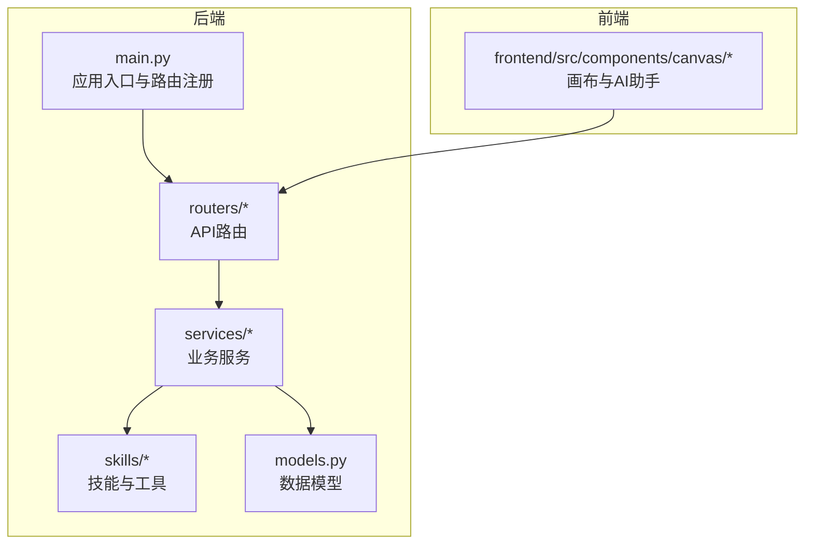
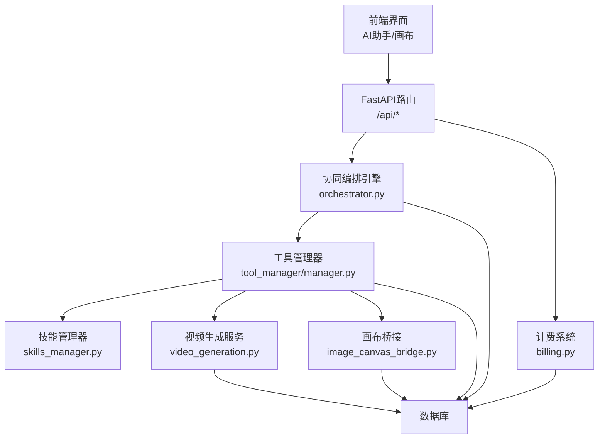
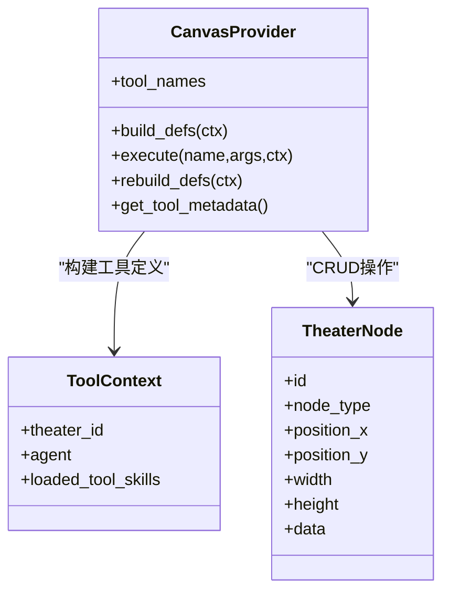
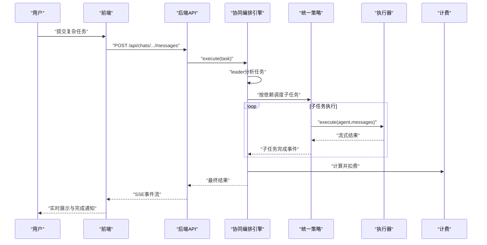
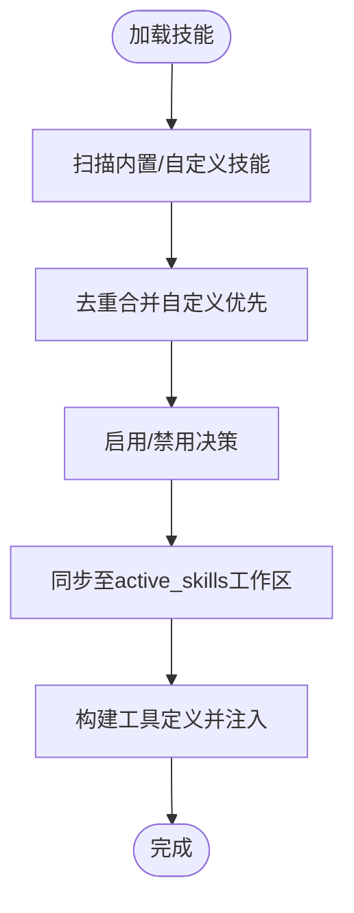
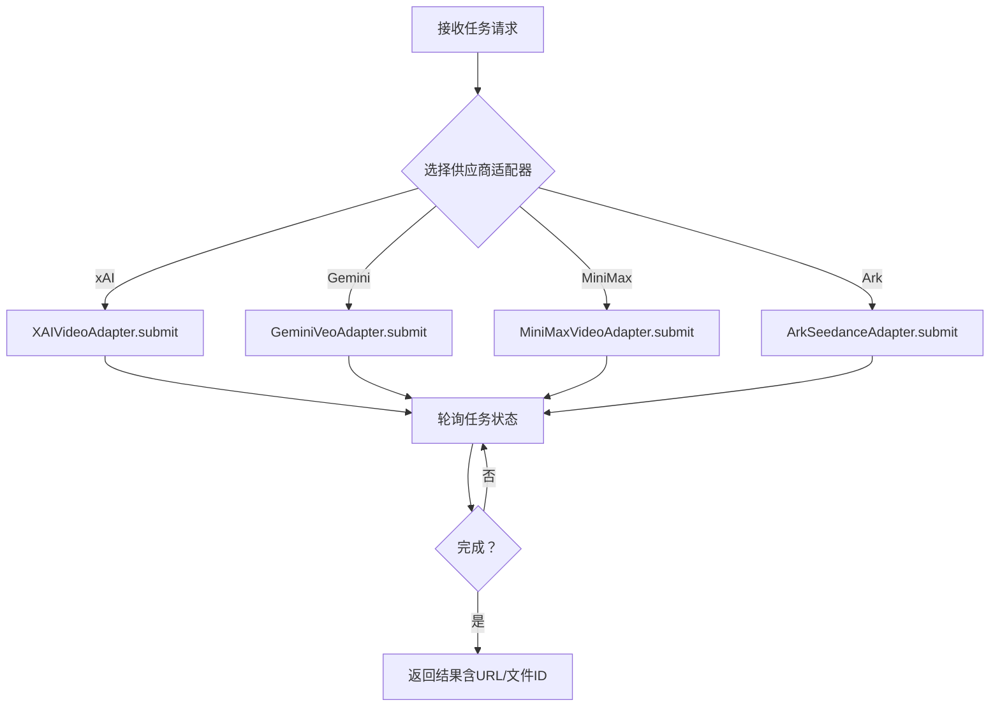
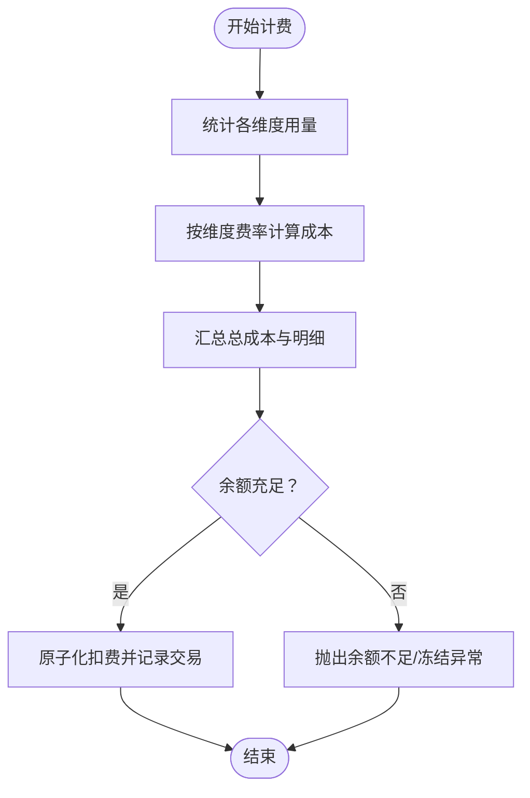
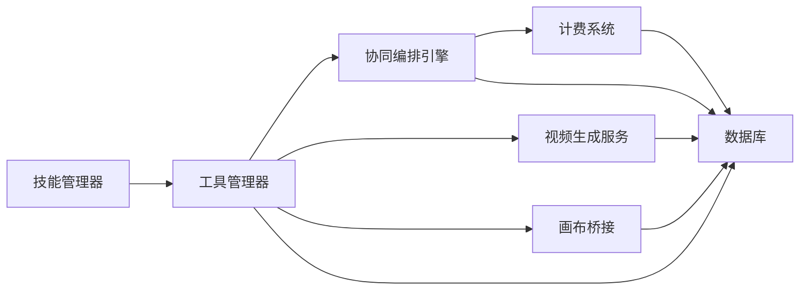

# 核心功能特性

<cite>
**本文档引用的文件**
- [backend/main.py](file://backend/main.py)
- [backend/agents.py](file://backend/agents.py)
- [backend/services/orchestrator.py](file://backend/services/orchestrator.py)
- [backend/services/billing.py](file://backend/services/billing.py)
- [backend/services/tool_manager/manager.py](file://backend/services/tool_manager/manager.py)
- [backend/services/tool_manager/providers/canvas.py](file://backend/services/tool_manager/providers/canvas.py)
- [backend/services/video_generation.py](file://backend/services/video_generation.py)
- [backend/services/image_canvas_bridge.py](file://backend/services/image_canvas_bridge.py)
- [backend/skills_manager.py](file://backend/skills_manager.py)
- [backend/routers/skills_api.py](file://backend/routers/skills_api.py)
- [backend/skills/builtin_skills/canvas_tools/SKILL.md](file://backend/skills/builtin_skills/canvas_tools/SKILL.md)
- [backend/skills/builtin_skills/image_tools/SKILL.md](file://backend/skills/builtin_skills/image_tools/SKILL.md)
- [backend/skills/builtin_skills/video_tools/SKILL.md](file://backend/skills/builtin_skills/video_tools/SKILL.md)
- [frontend/src/components/canvas/CanvasCursor.tsx](file://frontend/src/components/canvas/CanvasCursor.tsx)
- [frontend/src/components/canvas/AIAssistantPanel.tsx](file://frontend/src/components/canvas/AIAssistantPanel.tsx)
</cite>

## 目录
1. [简介](#简介)
2. [项目结构](#项目结构)
3. [核心组件](#核心组件)
4. [架构总览](#架构总览)
5. [详细组件分析](#详细组件分析)
6. [依赖分析](#依赖分析)
7. [性能考虑](#性能考虑)
8. [故障排除指南](#故障排除指南)
9. [结论](#结论)

## 简介
本文件面向KunFlix平台用户与开发者，系统化介绍平台五大核心能力：无限画布、多Agent协作系统、skills插件体系、全链路多模态生成、智能计费系统。文档从技术实现原理、使用场景与实际价值三个维度展开，辅以可视化图示与实践建议，帮助不同背景的读者快速理解并高效使用平台。

## 项目结构
后端采用FastAPI框架，路由集中在routers目录，业务逻辑分布在services与skills目录，数据库模型位于models.py，核心启动入口在main.py。前端基于Next.js，画布与AI助手组件位于frontend/src/components/canvas与frontend/src/components/ai-assistant。

**图表来源**
- [backend/main.py:110-153](file://backend/main.py#L110-L153)
- [backend/routers/skills_api.py:13-17](file://backend/routers/skills_api.py#L13-L17)

**章节来源**
- [backend/main.py:110-175](file://backend/main.py#L110-L175)

## 核心组件
- 无限画布：通过画布节点（文本/图像/视频/分镜）与自动定位、桥接机制，实现从AI生成到画布可视化的无缝衔接。
- 多Agent协作系统：以“领导Agent”进行任务分析与分解，统一策略执行子任务，支持并行与串行混合调度。
- skills插件体系：标准化技能定义与启用/禁用流程，支持内置与自定义技能，动态注入工具定义。
- 全链路多模态生成：统一视频生成入口，适配多供应商（xAI/Gemini/MiniMax/Ark），贯通文本到视频的创作流程。
- 智能计费系统：多维度积分计算（文本/图像/搜索/视频），原子化扣费与退款，保障资源可控与透明。

**章节来源**
- [backend/services/tool_manager/providers/canvas.py:513-563](file://backend/services/tool_manager/providers/canvas.py#L513-L563)
- [backend/services/orchestrator.py:418-534](file://backend/services/orchestrator.py#L418-L534)
- [backend/skills_manager.py:263-301](file://backend/skills_manager.py#L263-L301)
- [backend/services/video_generation.py:90-126](file://backend/services/video_generation.py#L90-L126)
- [backend/services/billing.py:310-387](file://backend/services/billing.py#L310-L387)

## 架构总览
平台采用“前端交互—后端服务—数据库/外部模型”的分层架构。前端通过REST与SSE与后端通信；后端通过统一的工具管理器与技能体系，将多模态生成、画布操作、视频生成等能力串联起来；计费系统贯穿所有生成与工具调用环节，确保资源消耗可度量、可追溯。

**图表来源**
- [backend/services/orchestrator.py:418-534](file://backend/services/orchestrator.py#L418-L534)
- [backend/services/tool_manager/manager.py:23-108](file://backend/services/tool_manager/manager.py#L23-L108)
- [backend/services/video_generation.py:90-126](file://backend/services/video_generation.py#L90-L126)
- [backend/services/image_canvas_bridge.py:29-63](file://backend/services/image_canvas_bridge.py#L29-L63)
- [backend/services/billing.py:178-308](file://backend/services/billing.py#L178-L308)

## 详细组件分析

### 无限画布
- 技术要点
  - 节点类型：文本、图像、视频、分镜，支持字段校验与尺寸估算。
  - 自动定位：新增节点自动沿X轴偏移，避免重叠。
  - 桥接机制：图像生成完成后自动在画布创建/更新图像节点，提升创作闭环效率。
- 使用场景
  - 文本节点用于脚本与文案；图像节点承载角色与场景；视频节点承载分镜与成片；分镜节点支撑镜头设计与多维表格。
- 实际价值
  - 降低“生成—落地”成本，提升创意迭代速度；通过自动定位与桥接减少手工操作。

**图表来源**
- [backend/services/tool_manager/providers/canvas.py:513-563](file://backend/services/tool_manager/providers/canvas.py#L513-L563)
- [backend/services/tool_manager/providers/canvas.py:341-393](file://backend/services/tool_manager/providers/canvas.py#L341-L393)

**章节来源**
- [backend/services/tool_manager/providers/canvas.py:300-475](file://backend/services/tool_manager/providers/canvas.py#L300-L475)
- [backend/services/image_canvas_bridge.py:29-63](file://backend/services/image_canvas_bridge.py#L29-L63)

### 多Agent协作系统
- 技术要点
  - 领导Agent负责任务分类与分解，统一策略按依赖顺序执行子任务，支持并行与串行混合。
  - 事件驱动：通过Server-Sent Events流式反馈子任务进度与结果，便于前端实时展示。
  - 审查机制：可选的领导Agent复审，整合多Agent输出形成最终结果。
- 使用场景
  - 复杂创作任务（如先写大纲再绘场景再做分镜）；跨模态内容生产（文本、图像、视频）。
- 实际价值
  - 将复杂任务自动化分解与执行，显著降低人工协调成本，提高产出一致性与质量。

**图表来源**
- [backend/services/orchestrator.py:437-534](file://backend/services/orchestrator.py#L437-L534)
- [backend/services/orchestrator.py:558-596](file://backend/services/orchestrator.py#L558-L596)
- [backend/services/billing.py:178-308](file://backend/services/billing.py#L178-L308)

**章节来源**
- [backend/services/orchestrator.py:418-800](file://backend/services/orchestrator.py#L418-L800)

### skills插件体系
- 技术要点
  - 标准化技能定义：通过SKILL.md声明工具集合与参数约束，支持版本化与来源标注。
  - 生命周期：内置技能与自定义技能并存，通过SkillService统一管理启用/禁用/创建/删除。
  - 动态注入：工具管理器按上下文与技能加载状态，构建工具定义并派发执行。
- 使用场景
  - 快速扩展新工具集（如图像/视频/画布工具）；按需启用/禁用特定能力；管理员集中治理。
- 实际价值
  - 降低工具接入成本，提升平台扩展性与可运维性；通过版本化与来源标注保证稳定性。

**图表来源**
- [backend/skills_manager.py:180-225](file://backend/skills_manager.py#L180-L225)
- [backend/skills_manager.py:263-301](file://backend/skills_manager.py#L263-L301)
- [backend/routers/skills_api.py:123-207](file://backend/routers/skills_api.py#L123-L207)

**章节来源**
- [backend/skills_manager.py:1-408](file://backend/skills_manager.py#L1-L408)
- [backend/routers/skills_api.py:1-207](file://backend/routers/skills_api.py#L1-L207)
- [backend/skills/builtin_skills/canvas_tools/SKILL.md:1-141](file://backend/skills/builtin_skills/canvas_tools/SKILL.md#L1-L141)
- [backend/skills/builtin_skills/image_tools/SKILL.md:1-81](file://backend/skills/builtin_skills/image_tools/SKILL.md#L1-L81)
- [backend/skills/builtin_skills/video_tools/SKILL.md:1-104](file://backend/skills/builtin_skills/video_tools/SKILL.md#L1-L104)

### 全链路多模态生成
- 技术要点
  - 统一入口：submit_video_task/poll_video_task封装多供应商适配器，屏蔽差异。
  - 供应商适配：xAI/Gemini/MiniMax/Ark分别实现适配器，统一VideoContext/VideoResult接口。
  - 供应商推断：优先使用LLMProvider中的供应商提示，其次依据模型前缀推断。
- 使用场景
  - 文本到视频：从提示词生成短视频；图像到视频：基于参考图生成延展视频。
  - 视频编辑与扩展：对既有视频进行风格化、特效或时长延长。
- 实际价值
  - 一站式多模态生成体验，降低供应商切换与集成成本，提升内容生产的多样性与效率。

**图表来源**
- [backend/services/video_generation.py:90-126](file://backend/services/video_generation.py#L90-L126)
- [backend/services/video_generation.py:163-179](file://backend/services/video_generation.py#L163-L179)

**章节来源**
- [backend/services/video_generation.py:1-180](file://backend/services/video_generation.py#L1-L180)

### 智能计费系统
- 技术要点
  - 多维度计费：文本输入/输出、图像输出、搜索次数、视频输入/输出等维度，支持每百万tokens或单次计费。
  - 原子化扣费：使用UPDATE ... WHERE并发安全扣费，失败时抛出余额不足或冻结异常。
  - 退款与审计：支持原子化退款与交易记录，便于审计与对账。
- 使用场景
  - 生成类任务（文本/图像/视频）按实际用量计费；管理员可对异常消费进行审计与处理。
- 实际价值
  - 透明可控的成本模型，保障资源使用公平与可持续；为精细化运营提供数据基础。

**图表来源**
- [backend/services/billing.py:310-387](file://backend/services/billing.py#L310-L387)
- [backend/services/billing.py:178-308](file://backend/services/billing.py#L178-L308)

**章节来源**
- [backend/services/billing.py:1-388](file://backend/services/billing.py#L1-L388)

## 依赖分析
- 组件耦合
  - 工具管理器与技能管理器松耦合：工具定义由技能体系提供，执行由工具管理器派发。
  - 协同编排引擎与工具管理器：编排引擎通过执行器调用工具，工具定义动态构建。
  - 计费系统与编排/工具：在子任务执行完成后统一计算并扣费，确保成本可追踪。
- 外部依赖
  - 多模态供应商：xAI/Gemini/MiniMax/Ark，通过适配器抽象统一接口。
  - 数据库：ORM模型与事务控制保障数据一致性与并发安全。

**图表来源**
- [backend/services/tool_manager/manager.py:23-108](file://backend/services/tool_manager/manager.py#L23-L108)
- [backend/services/orchestrator.py:418-534](file://backend/services/orchestrator.py#L418-L534)
- [backend/services/billing.py:178-308](file://backend/services/billing.py#L178-L308)

**章节来源**
- [backend/services/tool_manager/manager.py:1-108](file://backend/services/tool_manager/manager.py#L1-L108)
- [backend/services/orchestrator.py:1-914](file://backend/services/orchestrator.py#L1-L914)

## 性能考虑
- 并发与流式
  - 子任务并行执行与串行流式输出相结合，缩短整体等待时间。
  - SSE事件驱动，前端可逐步渲染，提升交互流畅度。
- 资源控制
  - 计费前置校验与原子化扣费，避免超支与竞态。
  - 工具定义按上下文动态构建，减少无关工具带来的开销。
- 可观测性
  - 统一的事件与日志输出，便于定位瓶颈与优化路径。

## 故障排除指南
- 余额相关
  - 余额不足：检查用户积分与冻结状态，必要时引导充值或联系客服。
  - 冻结账户：确认账户状态后，按流程解冻并重试。
- 任务失败
  - 子任务失败：查看失败事件与错误信息，必要时重试或调整参数。
  - 供应商异常：检查供应商适配器状态与轮询逻辑，确认任务ID与密钥正确。
- 技能与工具
  - 技能未生效：确认技能已启用并同步至工作区，检查前端工具定义是否注入成功。
  - 工具执行失败：核对参数枚举与节点类型限制，确保在允许范围内调用。

**章节来源**
- [backend/services/billing.py:45-84](file://backend/services/billing.py#L45-L84)
- [backend/services/orchestrator.py:521-533](file://backend/services/orchestrator.py#L521-L533)
- [backend/skills_manager.py:284-300](file://backend/skills_manager.py#L284-L300)

## 结论
KunFlix平台通过“无限画布+多Agent协作+skills插件+全链路多模态+智能计费”的组合拳，实现了从创意到成品的一体化创作体验。平台以标准化的技能体系与工具管理器降低扩展成本，以统一的视频生成适配器打通多模态生产链路，以事件驱动与原子化计费保障运行效率与资源可控。建议在实际使用中结合业务场景灵活启用技能、合理规划Agent分工，并利用计费与审计能力实现精细化运营。