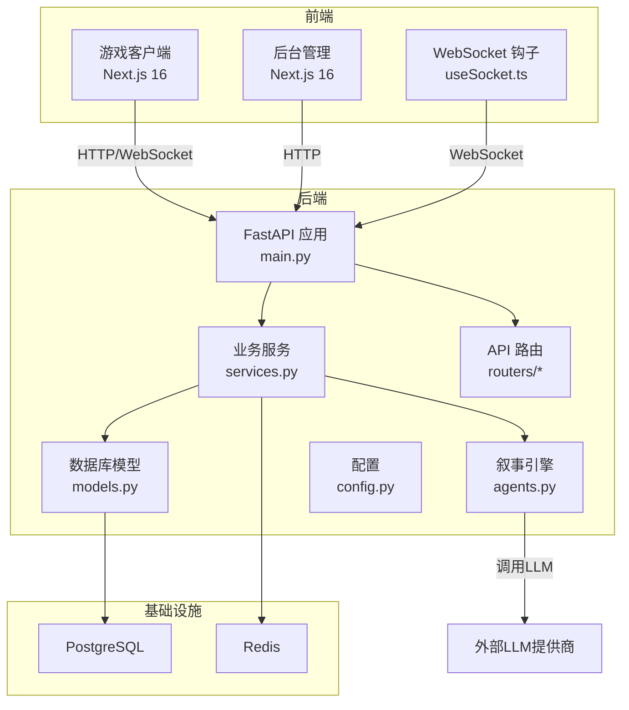
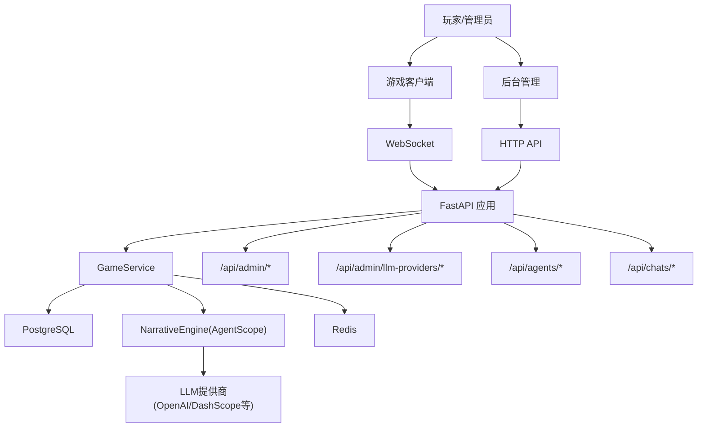
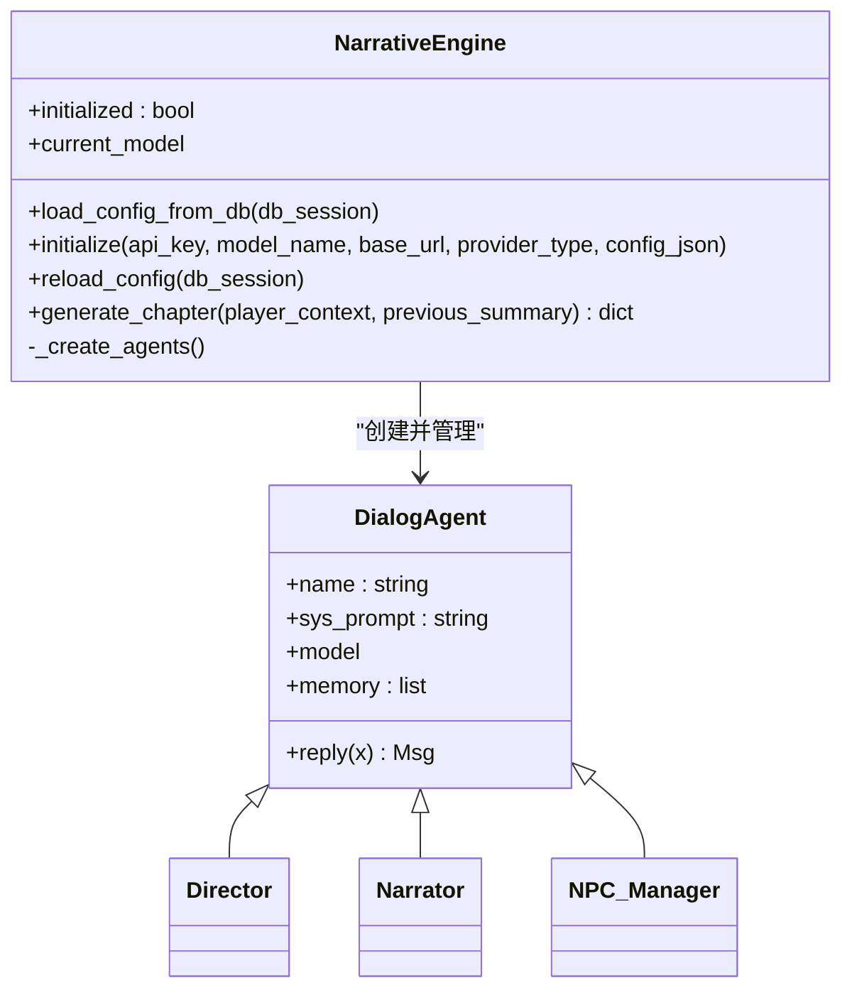
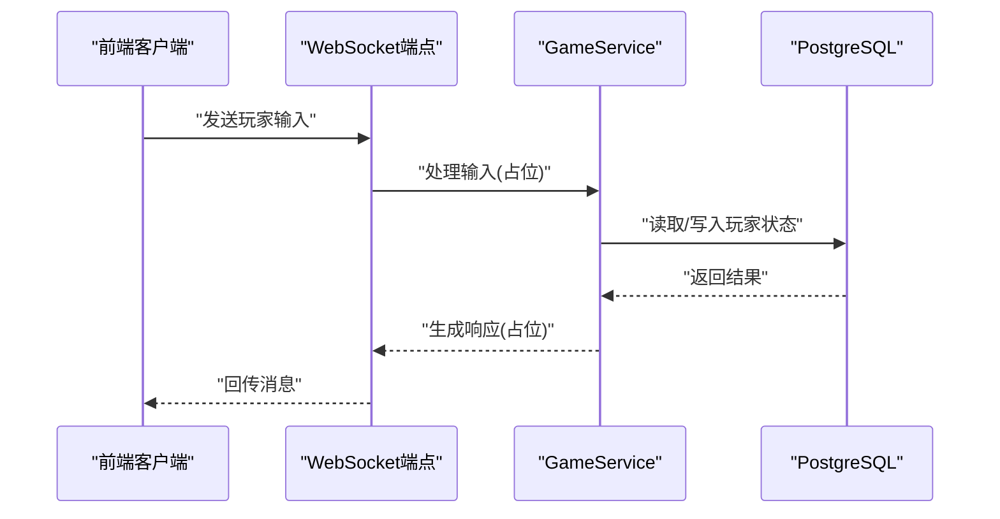
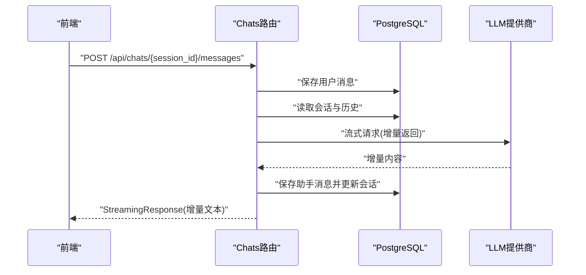
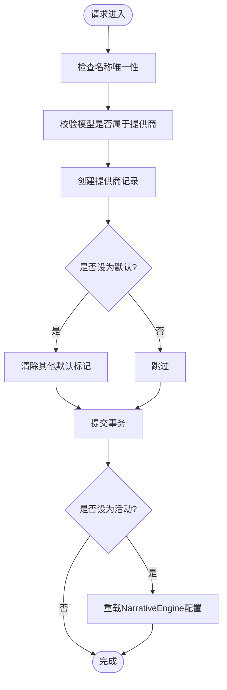
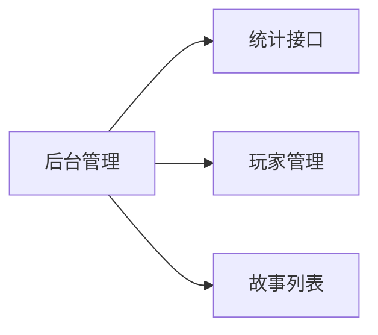
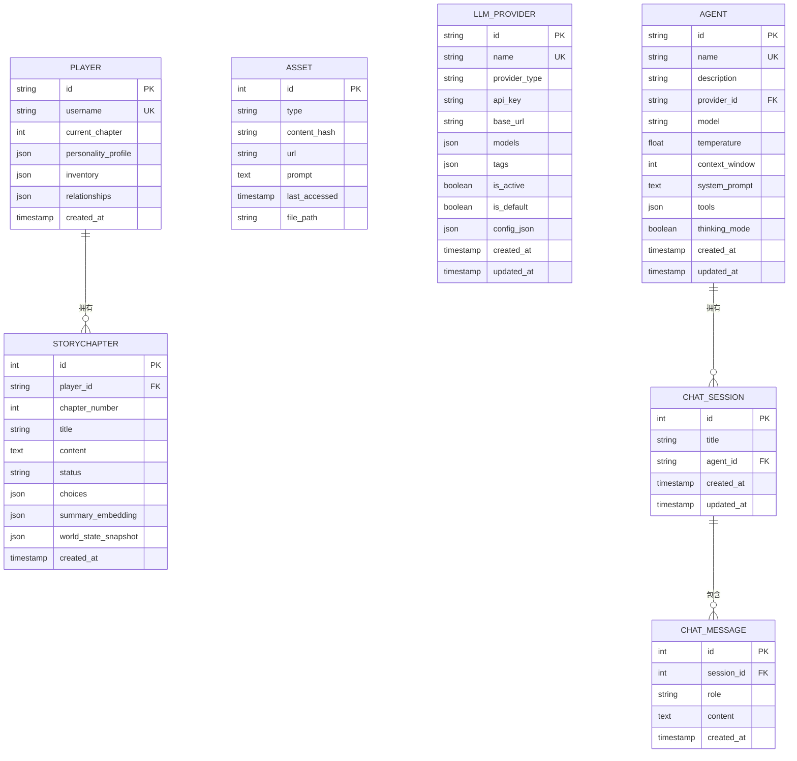
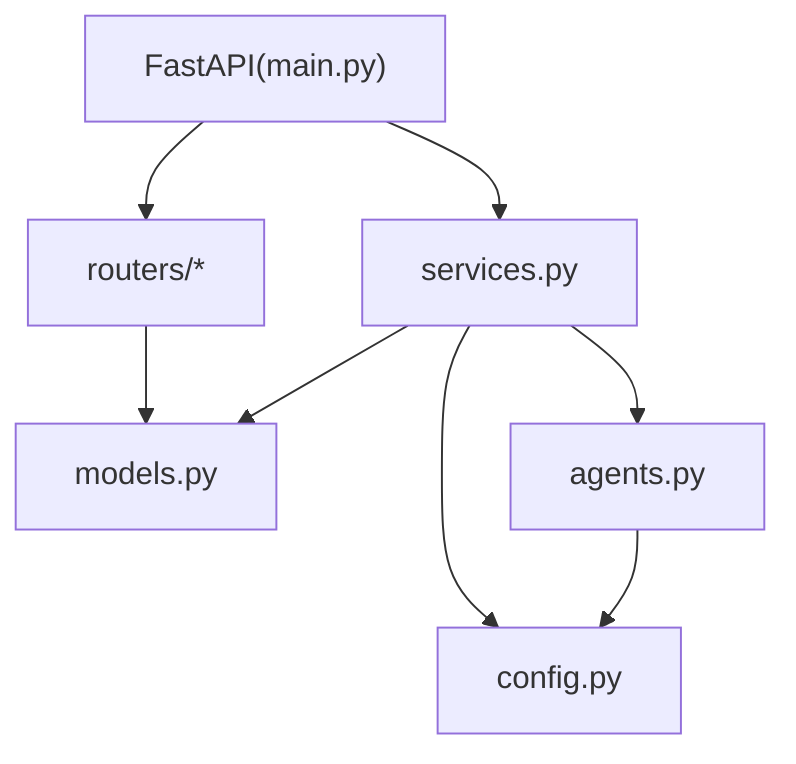

# 系统架构设计

<cite>
**本文引用的文件**
- [backend/main.py](file://backend/main.py)
- [backend/models.py](file://backend/models.py)
- [backend/services.py](file://backend/services.py)
- [backend/database.py](file://backend/database.py)
- [backend/routers/agents.py](file://backend/routers/agents.py)
- [backend/routers/chats.py](file://backend/routers/chats.py)
- [backend/routers/admin.py](file://backend/routers/admin.py)
- [backend/routers/llm_config.py](file://backend/routers/llm_config.py)
- [backend/schemas.py](file://backend/schemas.py)
- [backend/config.py](file://backend/config.py)
- [backend/agents.py](file://backend/agents.py)
- [frontend/src/hooks/useSocket.ts](file://frontend/src/hooks/useSocket.ts)
- [docs/wiki/Architecture.md](file://docs/wiki/Architecture.md)
- [README.md](file://README.md)
</cite>

## 目录
1. [引言](#引言)
2. [项目结构](#项目结构)
3. [核心组件](#核心组件)
4. [架构总览](#架构总览)
5. [详细组件分析](#详细组件分析)
6. [依赖分析](#依赖分析)
7. [性能考虑](#性能考虑)
8. [故障排查指南](#故障排查指南)
9. [结论](#结论)
10. [附录](#附录)

## 引言
本系统是一个基于微服务风格的前后端分离架构的无限剧情游戏平台，采用前后端各自独立的服务进程与路由体系，通过REST API与WebSocket进行交互。后端以FastAPI为核心，结合AgentScope多智能体框架实现“导演-编剧-NPC管理”的叙事引擎；数据库层采用PostgreSQL，缓存与任务队列采用Redis；前端使用Next.js 16，提供游戏客户端与后台管理界面。系统强调动态LLM配置、实时通信、多模态资产生成与数据一致性保障。

## 项目结构
- 后端（Python/TypeScript混合）：FastAPI应用入口、数据库模型与服务层、API路由、配置与环境变量、AgentScope智能体定义。
- 前端（Next.js 16）：游戏客户端与后台管理界面，包含WebSocket钩子与画布组件。
- 文档（Wiki）：系统架构、后端/前端开发指南、部署与迁移指南等。

图表来源
- [backend/main.py](file://backend/main.py#L83-L173)
- [backend/services.py](file://backend/services.py#L8-L66)
- [backend/agents.py](file://backend/agents.py#L43-L196)
- [backend/models.py](file://backend/models.py#L1-L122)
- [backend/config.py](file://backend/config.py#L1-L34)
- [frontend/src/hooks/useSocket.ts](file://frontend/src/hooks/useSocket.ts#L1-L43)

章节来源
- [README.md](file://README.md#L34-L51)
- [docs/wiki/Architecture.md](file://docs/wiki/Architecture.md#L1-L62)

## 核心组件
- FastAPI应用与生命周期管理：负责CORS、路由注册、数据库迁移与叙事引擎初始化。
- 数据库层：基于SQLAlchemy异步ORM，定义玩家、章节、资产、LLM提供商、聊天会话与消息等模型。
- 业务服务层：封装故事初始化、玩家创建、选择处理等业务流程。
- 叙事引擎（AgentScope）：多智能体协作（导演、旁白、NPC管理），负责章节大纲与正文生成、NPC关系更新。
- API路由：提供LLM提供商管理、代理管理、聊天会话与消息、后台统计与玩家管理等接口。
- 前端WebSocket钩子：建立与后端的实时通信通道，接收剧情更新与消息流。
- 配置与环境：统一管理数据库URL、Redis URL、默认模型与API密钥等。

章节来源
- [backend/main.py](file://backend/main.py#L45-L82)
- [backend/models.py](file://backend/models.py#L9-L122)
- [backend/services.py](file://backend/services.py#L8-L66)
- [backend/agents.py](file://backend/agents.py#L43-L196)
- [backend/routers/llm_config.py](file://backend/routers/llm_config.py#L14-L203)
- [backend/routers/agents.py](file://backend/routers/agents.py#L1-L141)
- [backend/routers/chats.py](file://backend/routers/chats.py#L1-L275)
- [backend/routers/admin.py](file://backend/routers/admin.py#L1-L112)
- [frontend/src/hooks/useSocket.ts](file://frontend/src/hooks/useSocket.ts#L1-L43)
- [backend/config.py](file://backend/config.py#L1-L34)

## 架构总览
系统采用前后端分离的微服务风格：
- 前端：游戏客户端与后台管理分别提供独立的Next.js应用，共享WebSocket钩子与UI组件。
- 后端：FastAPI作为统一入口，按功能拆分路由模块；业务逻辑集中在服务层；数据持久化通过PostgreSQL；缓存与任务队列通过Redis。
- 叙事引擎：基于AgentScope的多智能体协作，支持动态LLM提供商配置与运行时切换。
- 实时通信：WebSocket用于低延迟的消息推送与剧情更新；聊天接口支持流式响应。
- 多模态资产：章节生成与NPC关系更新结果可用于触发外部API生成图像、音频等资产，结合Redis缓存去重与LRU淘汰。

图表来源
- [backend/main.py](file://backend/main.py#L83-L173)
- [backend/routers/admin.py](file://backend/routers/admin.py#L1-L112)
- [backend/routers/llm_config.py](file://backend/routers/llm_config.py#L14-L203)
- [backend/routers/agents.py](file://backend/routers/agents.py#L1-L141)
- [backend/routers/chats.py](file://backend/routers/chats.py#L1-L275)
- [backend/services.py](file://backend/services.py#L8-L66)
- [backend/agents.py](file://backend/agents.py#L43-L196)

## 详细组件分析

### 叙事引擎（导演-编剧-NPC管理）
- 角色职责
  - 导演（Director）：制定章节大纲，确保叙事一致性与冲突推进。
  - 旁白（Narrator）：根据大纲生成沉浸式文本，注重细节与情感。
  - NPC管理（NPC_Manager）：跟踪玩家与NPC的关系变化，决定反应与互动。
- 协作机制
  - 初始化：从数据库加载活动的LLM提供商配置，动态创建三个Agent实例。
  - 章节生成：导演先产出大纲，旁白据此扩展为完整章节，NPC管理器评估并返回关系更新建议。
  - 动态配置：支持运行时切换LLM提供商，触发引擎重载。
- 错误处理
  - 若未配置活动提供商，章节生成返回错误提示，避免空转。

图表来源
- [backend/agents.py](file://backend/agents.py#L11-L196)

章节来源
- [backend/agents.py](file://backend/agents.py#L43-L196)

### 实时通信与消息协议
- WebSocket连接
  - 客户端通过useSocket.ts建立到后端的WebSocket连接，发送与接收文本消息。
  - 后端在主应用中定义WebSocket端点，接受消息并回显（当前示例逻辑）。
- 消息协议
  - 当前为纯文本消息；建议扩展为JSON格式，包含事件类型、消息体与时间戳，便于前端解析与状态同步。
- 状态同步
  - 建议在后端维护会话状态与消息历史，前端通过轮询或WebSocket增量推送实现状态一致。

图表来源
- [backend/main.py](file://backend/main.py#L157-L170)
- [frontend/src/hooks/useSocket.ts](file://frontend/src/hooks/useSocket.ts#L1-L43)

章节来源
- [backend/main.py](file://backend/main.py#L157-L170)
- [frontend/src/hooks/useSocket.ts](file://frontend/src/hooks/useSocket.ts#L1-L43)

### 聊天与流式响应
- 会话与消息
  - 支持创建会话、列出会话、查询消息历史、删除会话。
  - 发送消息时保存用户消息，准备历史与系统提示，调用LLM提供商模型生成回复。
- 流式响应
  - 对OpenAI/Azure与DashScope提供流式输出支持，逐块返回增量内容。
  - 记录输入/输出字符数与Token用量，便于成本与上下文窗口监控。
- 保存与更新
  - 将助手回复保存至消息表，并刷新会话更新时间。

图表来源
- [backend/routers/chats.py](file://backend/routers/chats.py#L72-L258)
- [backend/models.py](file://backend/models.py#L80-L99)

章节来源
- [backend/routers/chats.py](file://backend/routers/chats.py#L1-L275)
- [backend/models.py](file://backend/models.py#L80-L99)

### LLM提供商管理与动态配置
- 管理能力
  - 创建、查询、更新、删除LLM提供商；支持设置默认与活动状态。
  - 提供连接测试接口，动态初始化AgentScope模型实例。
- 配置加载
  - 启动时或运行时从数据库加载活动提供商，初始化NarrativeEngine。
  - 更新提供商的活动状态时触发引擎重载，确保新配置生效。
- 安全与合规
  - 建议对敏感字段（如API Key）进行加密存储与访问控制。

图表来源
- [backend/routers/llm_config.py](file://backend/routers/llm_config.py#L112-L188)
- [backend/agents.py](file://backend/agents.py#L49-L100)

章节来源
- [backend/routers/llm_config.py](file://backend/routers/llm_config.py#L14-L203)
- [backend/agents.py](file://backend/agents.py#L49-L100)

### 后台管理与统计
- 统计接口：提供玩家数、故事数、资产数、提供商数的聚合统计。
- 玩家管理：列出玩家、删除玩家（建议级联删除相关故事）。
- 故事列表：按玩家过滤故事，展示章节标题、状态与创建时间。

图表来源
- [backend/routers/admin.py](file://backend/routers/admin.py#L16-L112)

章节来源
- [backend/routers/admin.py](file://backend/routers/admin.py#L1-L112)

### 数据库与缓存架构
- PostgreSQL模型设计
  - 玩家表：用户名、当前章节、个性画像、背包与关系矩阵。
  - 章节表：章节号、标题、内容、状态、选项、摘要向量与世界快照。
  - 资产表：类型、内容哈希、URL、提示词、最后访问时间与文件路径。
  - LLM提供商表：名称、类型、基础URL、模型列表、标签、启用/默认标志与额外配置。
  - 聊天会话与消息表：会话标题、消息角色与内容、时间戳。
- 缓存与一致性
  - Redis用于任务队列、会话状态缓存与多模态资产缓存（LRU与去重）。
  - 建议章节摘要向量用于一致性校验，防止剧情偏离。

图表来源
- [backend/models.py](file://backend/models.py#L9-L122)

章节来源
- [backend/models.py](file://backend/models.py#L1-L122)
- [backend/config.py](file://backend/config.py#L18-L25)

## 依赖分析
- 组件耦合
  - FastAPI应用通过依赖注入获取数据库会话，路由模块解耦具体业务。
  - 业务服务层依赖模型与叙事引擎，保持领域逻辑集中。
  - 前端仅通过HTTP与WebSocket与后端交互，降低耦合。
- 外部依赖
  - AgentScope：多智能体编排与模型调用。
  - LLM提供商SDK：OpenAI、Azure、DashScope等。
  - SQLAlchemy异步ORM：PostgreSQL访问。
  - Redis：任务队列与缓存。
- 循环依赖
  - 当前结构未见循环导入；若后续引入任务调度器，应避免在路由与服务之间形成双向依赖。

图表来源
- [backend/main.py](file://backend/main.py#L30-L42)
- [backend/services.py](file://backend/services.py#L1-L7)
- [backend/agents.py](file://backend/agents.py#L1-L10)
- [backend/config.py](file://backend/config.py#L1-L34)

章节来源
- [backend/main.py](file://backend/main.py#L30-L42)
- [backend/services.py](file://backend/services.py#L1-L7)
- [backend/agents.py](file://backend/agents.py#L1-L10)
- [backend/config.py](file://backend/config.py#L1-L34)

## 性能考虑
- 异步与并发
  - 使用异步数据库引擎与FastAPI，提升I/O密集型场景下的吞吐。
- 上下文与Token管理
  - 在聊天接口中记录输入/输出字符与Token用量，避免超上下文窗口导致的失败。
- 缓存策略
  - Redis缓存会话状态与多模态资产，结合LRU与MD5去重，降低重复生成成本。
- 数据库连接池
  - 合理配置连接池大小与溢出数量，避免高并发下的连接争用。
- 预生成与后台任务
  - 采用N+2章节预生成策略，结合Redis队列异步生成，缩短玩家等待时间。

## 故障排查指南
- WebSocket连接失败
  - 检查后端WebSocket端点是否正确挂载，确认CORS允许的源。
  - 前端确认WebSocket地址与playerId参数。
- LLM提供商不可用
  - 确认提供商处于活动状态，模型列表包含所选模型。
  - 使用连接测试接口验证API Key与基础URL配置。
- 数据库迁移失败
  - 启动时会尝试执行迁移，若失败需检查数据库连接与权限。
- 聊天流式响应异常
  - 检查提供商类型分支与SDK版本兼容性，关注错误日志中的异常堆栈。

章节来源
- [backend/main.py](file://backend/main.py#L85-L91)
- [backend/routers/llm_config.py](file://backend/routers/llm_config.py#L20-L111)
- [backend/routers/chats.py](file://backend/routers/chats.py#L144-L210)

## 结论
该系统通过前后端分离与微服务风格实现了高内聚、低耦合的架构设计。后端以FastAPI与AgentScope为核心，结合PostgreSQL与Redis，支撑动态LLM配置、实时通信与多模态资产生成。建议在后续迭代中完善消息协议、增强一致性校验与缓存策略，并引入任务调度器以承载大规模预生成任务。

## 附录
- 快速开始与部署
  - 后端：安装依赖、配置环境变量、启动服务，自动执行数据库迁移。
  - 前端：分别启动游戏客户端与后台管理界面。
- 文档索引
  - 系统架构、后端/前端开发指南、部署与迁移指南详见Wiki目录。

章节来源
- [README.md](file://README.md#L53-L127)
- [docs/wiki/Architecture.md](file://docs/wiki/Architecture.md#L1-L62)