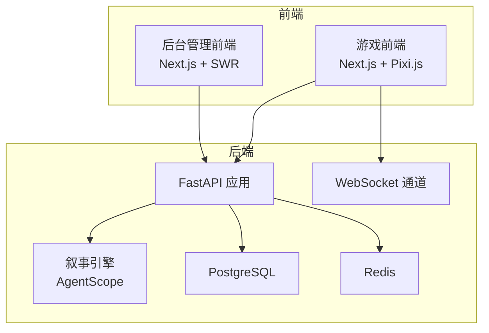
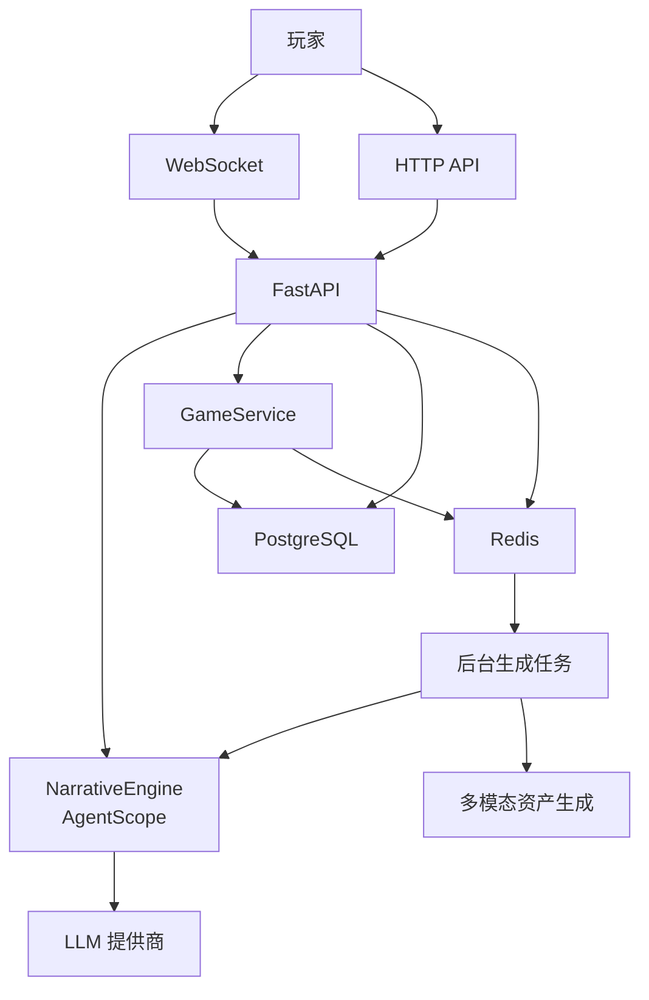
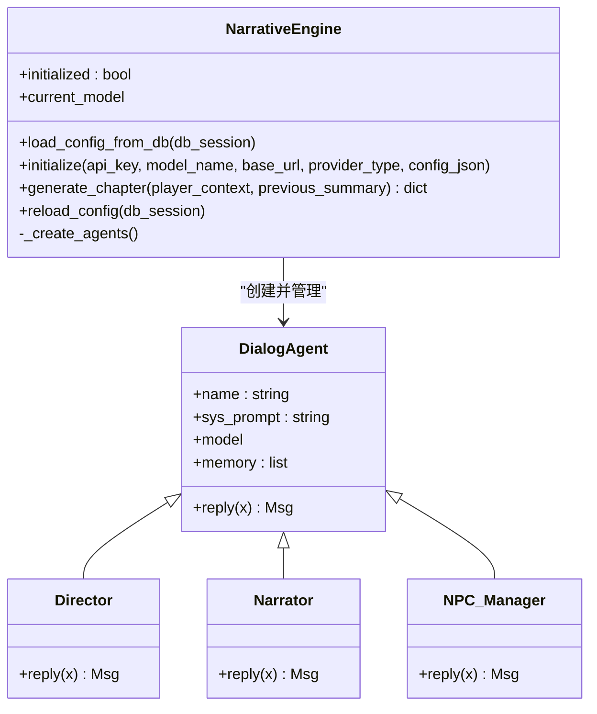
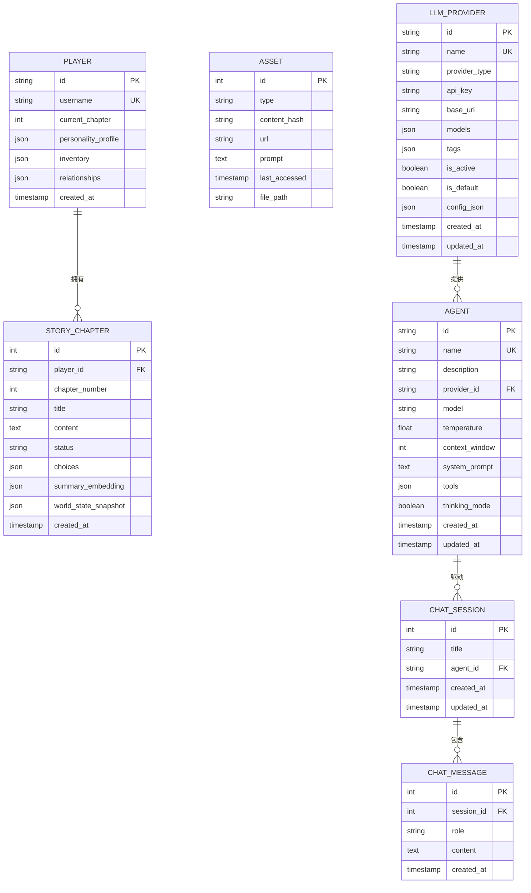
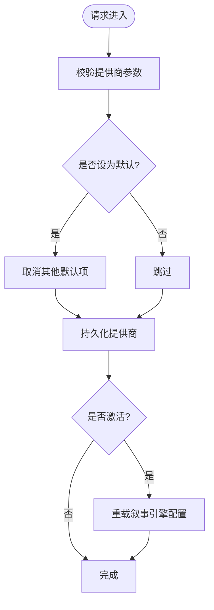
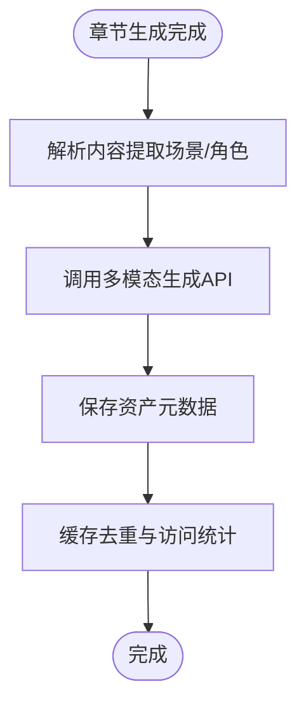
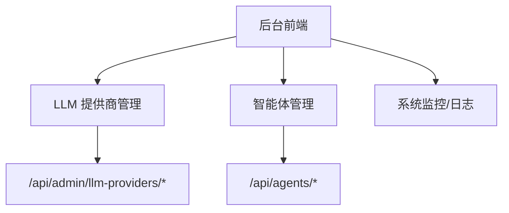
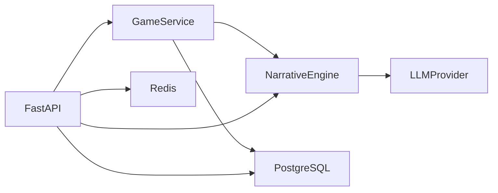

# 系统简介与核心特性

<cite>
**本文引用的文件**
- [README.md](file://README.md)
- [main.py](file://backend/main.py)
- [agents.py](file://backend/agents.py)
- [services.py](file://backend/services.py)
- [models.py](file://backend/models.py)
- [schemas.py](file://backend/schemas.py)
- [llm_config.py](file://backend/routers/llm_config.py)
- [agents.py（管理端）](file://backend/routers/agents.py)
- [tasks.py](file://backend/tasks.py)
- [useSocket.ts](file://frontend/src/hooks/useSocket.ts)
- [Architecture.md](file://docs/wiki/Architecture.md)
- [Requirements-Traceability.md](file://docs/wiki/Requirements-Traceability.md)
- [agent.ts](file://backend/admin/src/constants/agent.ts)
- [useAgents.ts](file://backend/admin/src/hooks/useAgents.ts)
- [useLLMProviders.ts](file://backend/admin/src/hooks/useLLMProviders.ts)
</cite>

## 目录
1. [引言](#引言)
2. [项目结构](#项目结构)
3. [核心组件](#核心组件)
4. [架构总览](#架构总览)
5. [详细组件分析](#详细组件分析)
6. [依赖分析](#依赖分析)
7. [性能考虑](#性能考虑)
8. [故障排查指南](#故障排查指南)
9. [结论](#结论)
10. [附录](#附录)

## 引言
本系统是一个基于 AgentScope 多智能体框架、Next.js 前端、FastAPI 后端与 PostgreSQL 的“无限剧情游戏”平台。其核心愿景是通过 LLM 驱动的动态叙事引擎，为玩家提供“无限延伸、逻辑自洽”的沉浸式故事体验；通过多模态资产生成（图片、语音、音乐）提升沉浸感；通过 WebSocket 实现实时交互；通过动态 LLM 配置与后台管理系统实现灵活运营与持续演进。

系统特性概览：
- 动态世界观与剧情生成：基于导演、编剧、NPC 管理器等多智能体协作，实现剧情的无限延伸与逻辑自洽。
- 多模态资产生成：集成图片生成、语音合成与背景音乐生成，支撑画面与听觉沉浸。
- 实时交互：WebSocket 低延迟推送与玩家互动。
- 动态 LLM 配置：支持在后台动态切换与测试不同 LLM 提供商（OpenAI、DashScope、Anthropic、Gemini 等）。
- 后台管理系统：提供可视化玩家管理、剧情监控、资源管理与系统配置。
- 数据持久化与一致性：PostgreSQL 存储结构化数据，结合向量嵌入确保长篇剧情一致性。

**章节来源**
- file://README.md#L1-L141

## 项目结构
系统采用前后端分离与独立后台管理的三层架构：
- 后端（FastAPI + AgentScope + PostgreSQL + Redis）
- 游戏前端（Next.js + Pixi.js）
- 后台管理（Next.js + SWR）

**图表来源**
- [Architecture.md](file://docs/wiki/Architecture.md#L7-L36)
- [main.py](file://backend/main.py#L83-L98)

**章节来源**
- file://docs/wiki/Architecture.md#L1-L62
- file://backend/main.py#L30-L98

## 核心组件
- 叙事引擎（AgentScope 多智能体）
  - 导演（Director）：负责剧情大纲与一致性把控。
  - 旁白（Narrator）：将大纲转化为沉浸式文本。
  - NPC 管理器（NPC_Manager）：维护角色关系与反应。
- 游戏服务（GameService）
  - 负责玩家初始化、世界构建、章节生成与保存。
- 数据模型（SQLAlchemy）
  - Player、StoryChapter、Asset、LLMProvider、Agent、ChatSession、ChatMessage。
- 动态 LLM 配置（后台管理）
  - 提供 LLM 提供商的增删改查、默认/激活状态切换、连通性测试。
- 多模态资产管线（待接入）
  - 预留章节资产生成任务与资产表结构，支持图片、语音、音乐生成与缓存。
- 实时交互（WebSocket）
  - 前端通过 WebSocket 与后端建立长连接，接收剧情更新与互动反馈。

**章节来源**
- file://backend/agents.py#L43-L196
- file://backend/services.py#L8-L66
- file://backend/models.py#L9-L122
- file://backend/routers/llm_config.py#L14-L203
- file://backend/tasks.py#L1-L62
- file://frontend/src/hooks/useSocket.ts#L1-L43

## 架构总览
系统采用“叙事引擎 + 动态配置 + 多模态管线 + 实时交互”的整体设计。后端通过 FastAPI 提供 REST 与 WebSocket 接口，AgentScope 负责多智能体编排，PostgreSQL 与 Redis 分别承担结构化数据与任务队列，前端通过 Next.js 与 Pixi.js 提供游戏体验，后台管理提供可视化运维能力。

**图表来源**
- [Architecture.md](file://docs/wiki/Architecture.md#L7-L36)
- [main.py](file://backend/main.py#L157-L169)
- [agents.py](file://backend/agents.py#L101-L130)
- [tasks.py](file://backend/tasks.py#L7-L56)

**章节来源**
- file://docs/wiki/Architecture.md#L1-L62
- file://backend/main.py#L128-L173

## 详细组件分析

### 动态叙事引擎（AgentScope 多智能体）
- 组件职责
  - 加载数据库中的活动 LLM 提供商配置，按类型初始化模型（OpenAI、DashScope、Anthropic、Gemini 等）。
  - 创建导演、旁白、NPC 管理器三个核心智能体，协同完成章节大纲、文本生成与角色关系更新。
  - 提供章节生成接口，返回大纲、正文与 NPC 更新摘要。
- 关键流程
  - 启动时尝试从数据库加载配置；若无可用配置则回退到本地设置。
  - 生成流程：导演 → 旁白 → NPC 管理器，形成闭环。
- 数据结构与复杂度
  - 模型初始化与智能体创建为 O(1)，章节生成受 LLM 调用时间主导。
- 错误处理
  - 未初始化时返回错误提示，引导在后台配置提供商。
- 性能影响
  - 通过 N+2 预生成与后台任务降低主线程阻塞，提升交互流畅度。

**图表来源**
- [agents.py](file://backend/agents.py#L11-L42)
- [agents.py](file://backend/agents.py#L131-L153)

**章节来源**
- file://backend/agents.py#L43-L196

### 游戏服务（GameService）
- 组件职责
  - 创建玩家、初始化世界（生成世界观与初始章节）、触发下一章预生成。
- 关键流程
  - 世界构建：导演生成独特世界观。
  - 初始章节：生成第一章与第二章（预生成）。
  - 保存：写入数据库并标记状态。
- 扩展点
  - 玩家选择处理、一致性校验、NPC 关系更新与剧情分支推进。

**图表来源**
- [services.py](file://backend/services.py#L19-L59)
- [agents.py](file://backend/agents.py#L154-L191)

**章节来源**
- file://backend/services.py#L8-L66

### 数据模型（SQLAlchemy）
- 核心实体
  - Player：玩家档案、当前章节、个性画像、物品栏、NPC 关系。
  - StoryChapter：章节标题、内容、状态、选项、摘要向量、世界快照。
  - Asset：资产类型、内容哈希、URL、提示词、访问时间、文件路径。
  - LLMProvider：提供商名称、类型、API Key、基础地址、模型列表、标签、是否激活/默认、额外配置。
  - Agent：智能体名称、描述、提供商关联、模型、温度、上下文窗口、系统提示、工具、思考模式。
  - ChatSession/ChatMessage：聊天会话与消息。
- 设计要点
  - UUID 主键统一风格，JSON 字段承载灵活配置与关系矩阵。
  - 章节状态机（pending/generating/ready/completed）支撑预生成与一致性检查。
  - 资产表支持去重与访问统计，为多模态缓存奠定基础。

**图表来源**
- [models.py](file://backend/models.py#L9-L122)

**章节来源**
- file://backend/models.py#L1-L122

### 动态 LLM 配置（后台管理）
- 组件职责
  - 提供 LLM 提供商的增删改查、默认/激活切换、连通性测试。
  - 在提供商状态变化时触发叙事引擎重新加载配置。
- 关键流程
  - 新增/更新提供商时，若设为默认则取消其他默认项。
  - 连通性测试根据提供商类型实例化对应模型并发送测试消息。
  - 若提供商处于激活状态，立即触发引擎重载以应用新配置。

**图表来源**
- [llm_config.py](file://backend/routers/llm_config.py#L112-L138)
- [llm_config.py](file://backend/routers/llm_config.py#L160-L188)

**章节来源**
- file://backend/routers/llm_config.py#L14-L203
- file://backend/agents.py#L49-L76

### 多模态资产生成（预置与扩展）
- 当前状态
  - 预留章节资产生成任务与资产表结构，支持图片、语音、音乐生成与缓存。
- 实现思路
  - 解析章节内容提取场景与角色关键词，调用外部 API 生成资产。
  - 将资产元数据写入数据库，利用 content_hash 去重与 last_accessed 管理缓存。
- 扩展建议
  - 集成通义万象/即梦AI（图片）、TTS（语音）、MusicGen（音乐）等服务。
  - 结合 Redis 实现 LRU 淘汰策略，保障存储效率。

**图表来源**
- [tasks.py](file://backend/tasks.py#L57-L62)
- [models.py](file://backend/models.py#L45-L57)

**章节来源**
- file://backend/tasks.py#L1-L62
- file://backend/models.py#L45-L57
- file://docs/wiki/Requirements-Traceability.md#L14-L21

### 实时交互系统（WebSocket）
- 设计理念
  - 通过 WebSocket 保持低延迟的剧情推送与玩家互动，避免轮询带来的延迟与开销。
- 前端实现
  - useSocket 钩子负责建立连接、监听消息、发送消息与清理资源。
- 后端实现
  - /ws/{player_id} 端点接受连接，循环读取消息并回显（后续可接入剧情处理逻辑）。

**图表来源**
- [useSocket.ts](file://frontend/src/hooks/useSocket.ts#L8-L33)
- [main.py](file://backend/main.py#L157-L169)

**章节来源**
- file://frontend/src/hooks/useSocket.ts#L1-L43
- file://backend/main.py#L157-L169

### 后台管理系统（Admin）
- 管理能力
  - LLM 提供商管理：新增、编辑、删除、测试连通性、设置默认/激活。
  - 智能体管理：创建、查询、更新、删除智能体，绑定提供商与模型。
  - 数据展示：基于 SWR 的数据拉取与刷新。
- 前端常量与 Hook
  - 可用工具枚举与默认智能体值。
  - useAgents/useAgent/useDeleteAgent/useCreateAgent/useUpdateAgent/useLLMProviders 等 Hook。

**图表来源**
- [agent.ts](file://backend/admin/src/constants/agent.ts#L1-L20)
- [useAgents.ts](file://backend/admin/src/hooks/useAgents.ts#L6-L18)
- [useLLMProviders.ts](file://backend/admin/src/hooks/useLLMProviders.ts#L5-L16)
- [llm_config.py](file://backend/routers/llm_config.py#L14-L203)
- [agents.py（管理端）](file://backend/routers/agents.py#L9-L141)

**章节来源**
- file://backend/admin/src/constants/agent.ts#L1-L20
- file://backend/admin/src/hooks/useAgents.ts#L1-L52
- file://backend/admin/src/hooks/useLLMProviders.ts#L1-L17
- file://backend/routers/llm_config.py#L14-L203
- file://backend/routers/agents.py#L1-L141

## 依赖分析
- 组件耦合
  - GameService 依赖 NarrativeEngine 与数据库；NarrativeEngine 依赖 LLMProvider 配置。
  - 后台路由对模型与 Schema 进行严格校验，保证数据一致性。
- 外部依赖
  - AgentScope：多智能体编排与模型抽象。
  - FastAPI：异步高性能 API 框架。
  - PostgreSQL/Redis：数据持久化与任务队列。
  - Next.js：前后端开发框架。
- 潜在风险
  - LLM 提供商配置缺失会导致叙事引擎无法初始化。
  - WebSocket 未接入实际剧情处理逻辑，存在扩展风险。

**图表来源**
- [services.py](file://backend/services.py#L8-L17)
- [agents.py](file://backend/agents.py#L49-L76)
- [models.py](file://backend/models.py#L58-L79)
- [main.py](file://backend/main.py#L38-L42)

**章节来源**
- file://backend/services.py#L8-L66
- file://backend/agents.py#L49-L76
- file://backend/models.py#L58-L79
- file://backend/main.py#L38-L42

## 性能考虑
- 预生成策略
  - 采用 N+2 章节预生成，结合 Redis 队列异步执行，减少主线程阻塞。
- 连接与日志
  - 启动阶段自动迁移数据库，关闭冗余日志，降低 IO 开销。
- 实时性
  - WebSocket 通道用于低延迟推送；建议后续引入流式输出与增量更新。
- 可扩展性
  - 动态 LLM 配置允许热切换，后台管理提供可视化运维入口。

**章节来源**
- file://docs/wiki/Architecture.md#L40-L44
- file://backend/main.py#L45-L82
- file://backend/tasks.py#L7-L56

## 故障排查指南
- WebSocket 无法连接
  - 检查后端 CORS 配置与端口映射；确认前端连接 URL 与后端端点一致。
- 叙事引擎未初始化
  - 确认数据库中存在激活的 LLM 提供商；若无则在后台添加并设为默认/激活。
- LLM 提供商测试失败
  - 核对提供商类型、API Key、基础地址与模型名称；使用后台“连通性测试”接口快速定位问题。
- 章节未生成或状态异常
  - 检查预生成任务是否执行、数据库状态字段是否正确更新。

**章节来源**
- file://backend/main.py#L85-L91
- file://backend/agents.py#L49-L76
- file://backend/routers/llm_config.py#L20-L111
- file://backend/tasks.py#L7-L56

## 结论
本系统以 AgentScope 为核心，结合 FastAPI、PostgreSQL 与 Redis，构建了“动态叙事 + 多模态资产 + 实时交互 + 可视化后台”的完整闭环。通过 N+2 预生成与动态 LLM 配置，系统在保证剧情一致性的同时实现了高扩展性与低延迟体验。后续可在多模态生成接入、交互 UI 扩展、流式输出与内容安全审核等方面持续演进。

## 附录
- 快速开始与数据库迁移
  - 后端安装依赖、配置环境变量、启动服务；数据库迁移通过 Alembic 自动执行。
- 文档与 Wiki
  - 架构、后端/前端开发指南、部署与需求追踪文档可供深入学习。

**章节来源**
- file://README.md#L53-L127
- file://docs/wiki/Requirements-Traceability.md#L1-L54