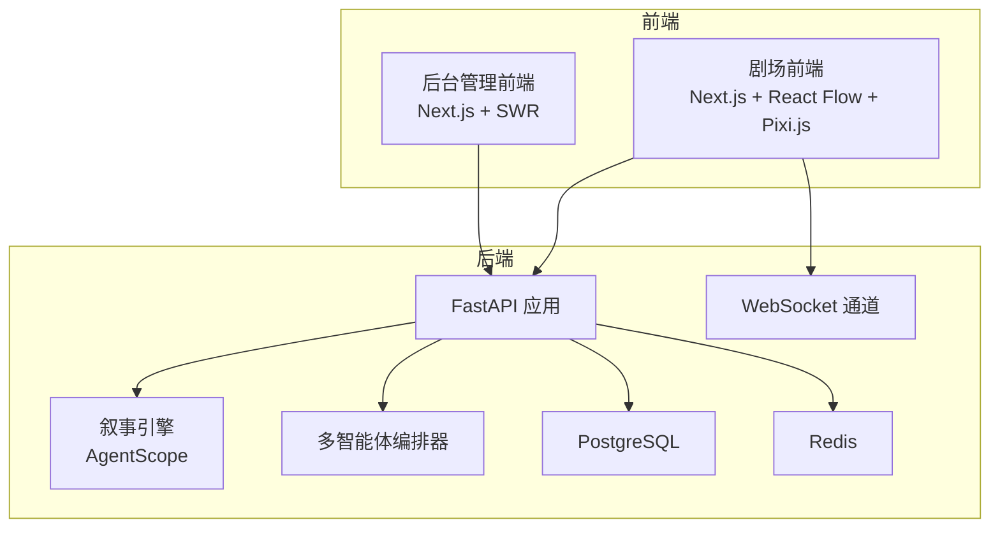
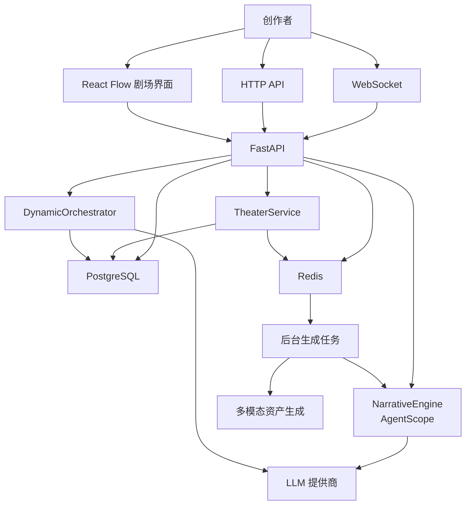
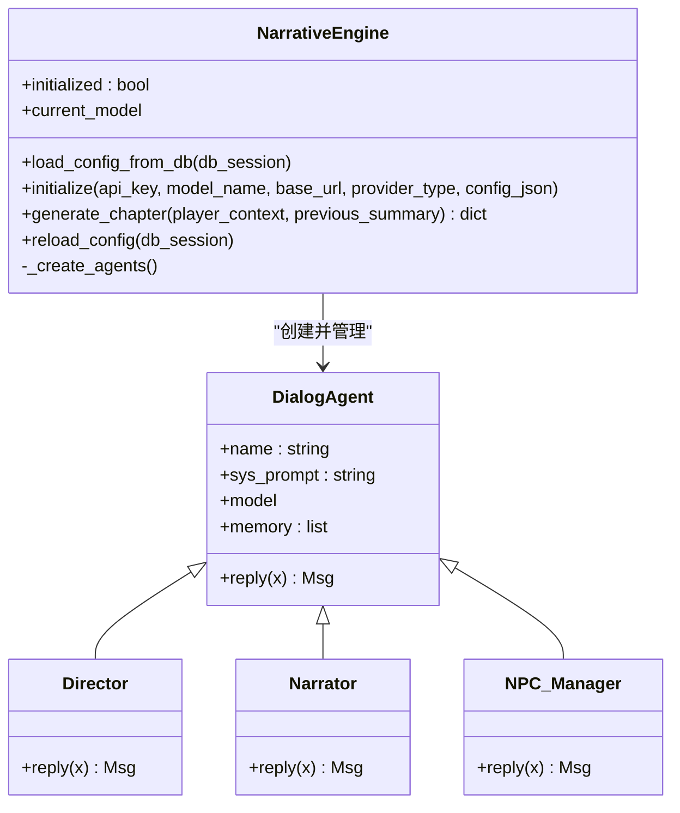
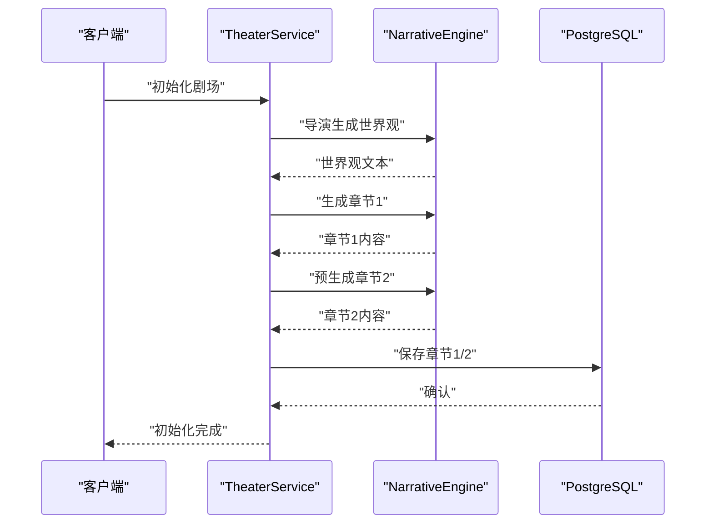
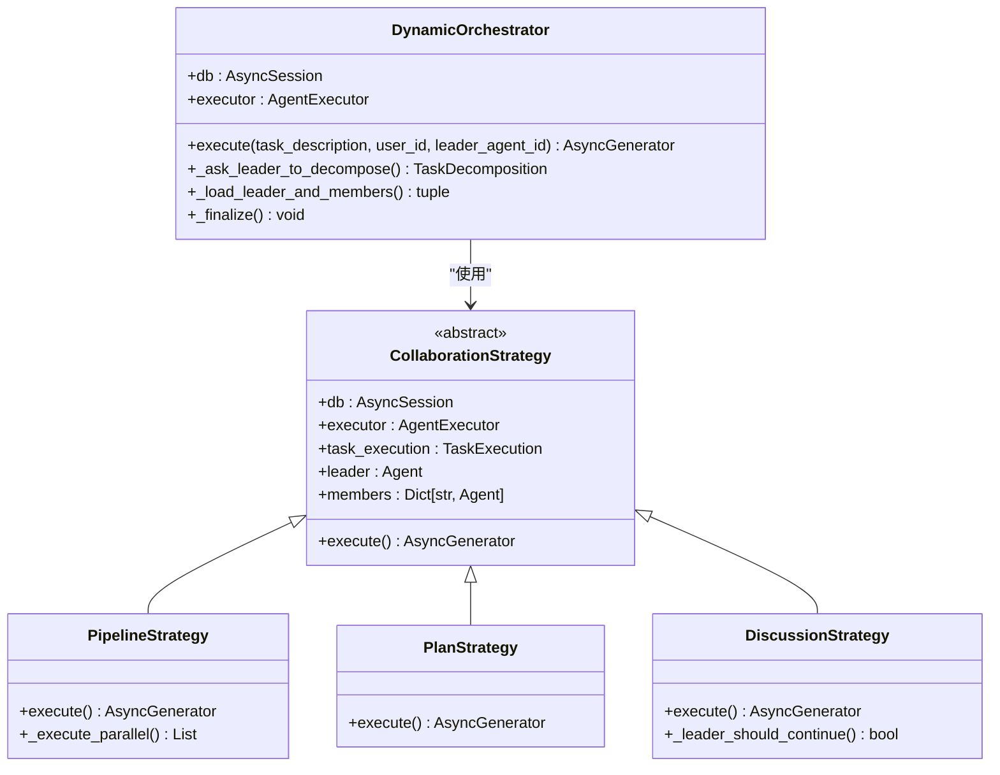
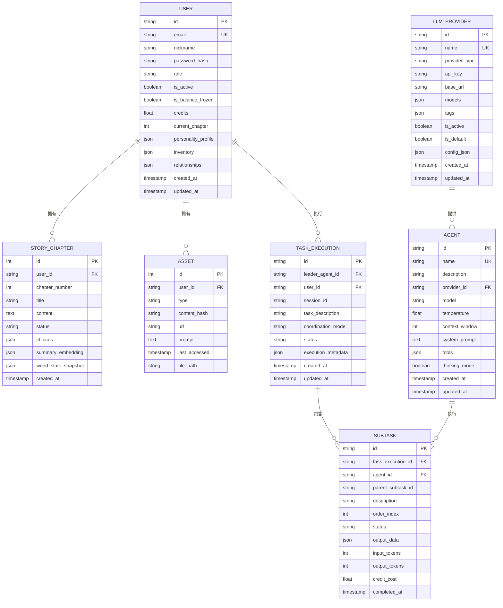
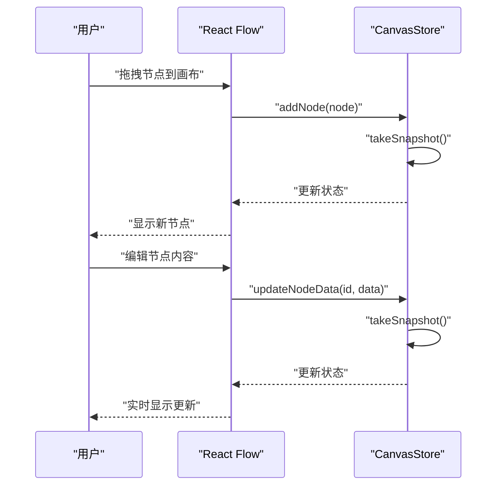
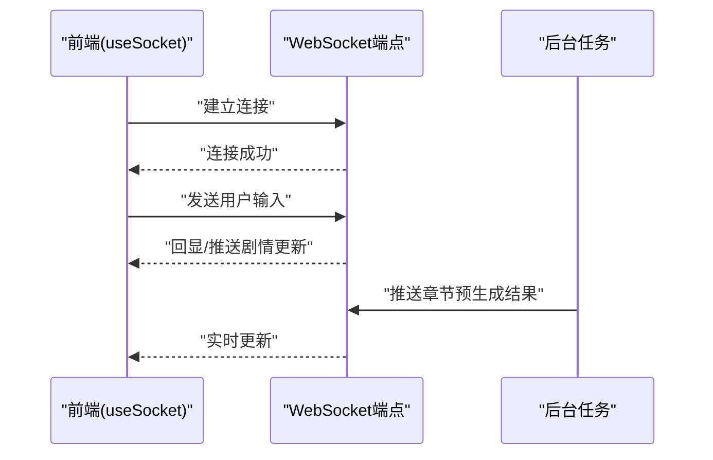
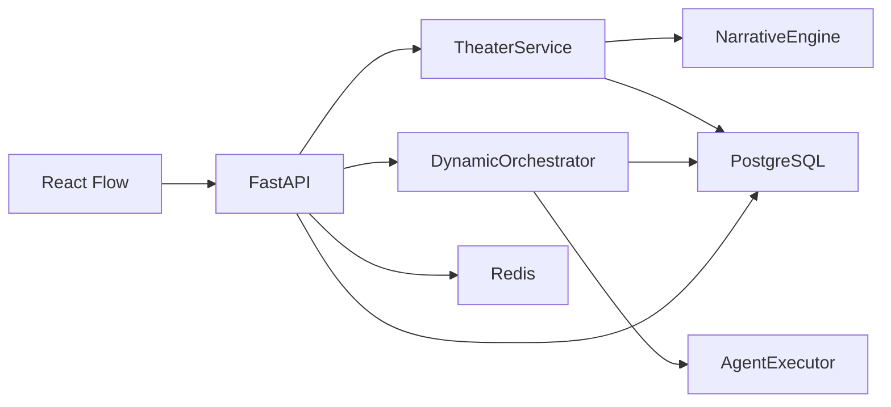

# 系统简介与核心特性

<cite>
**本文引用的文件**
- [README.md](file://README.md)
- [main.py](file://backend/main.py)
- [theater.py](file://backend/services/theater.py)
- [orchestrator.py](file://backend/services/orchestrator.py)
- [orchestrate.py](file://backend/routers/orchestrate.py)
- [models.py](file://backend/models.py)
- [schemas.py](file://backend/schemas.py)
- [useCanvasStore.ts](file://frontend/src/store/useCanvasStore.ts)
- [TheaterCanvas.tsx](file://frontend/src/components/TheaterCanvas.tsx)
- [page.tsx](file://frontend/src/app/theater/new/page.tsx)
- [Sidebar.tsx](file://frontend/src/components/canvas/Sidebar.tsx)
- [CharacterNode.tsx](file://frontend/src/components/canvas/CharacterNode.tsx)
- [StoryboardNode.tsx](file://frontend/src/components/canvas/StoryboardNode.tsx)
</cite>

## 目录
1. [引言](#引言)
2. [项目结构](#项目结构)
3. [核心组件](#核心组件)
4. [架构总览](#架构总览)
5. [详细组件分析](#详细组件分析)
6. [依赖分析](#依赖分析)
7. [性能考虑](#性能考虑)
8. [故障排查指南](#故障排查指南)
9. [结论](#结论)
10. [附录](#附录)

## 引言
本系统是一个基于 AgentScope 多智能体框架、Next.js 前端、FastAPI 后端与 PostgreSQL 的无限剧情剧场平台。系统已从传统的游戏平台转型为面向剧场创作的创作平台，核心愿景是通过 LLM 驱动的动态叙事引擎，为创作者提供"无限延伸、逻辑自洽"的剧场创作体验；通过多模态资产生成（图片、语音、音乐、视频）提升沉浸感；通过 WebSocket 实现实时交互；通过动态 LLM 配置与后台管理系统实现灵活运营与持续演进。

系统特性概览：
- 动态世界观与剧情生成：基于导演、编剧、NPC 管理器等多智能体协作，实现剧情的无限延伸与逻辑自洽。
- 多模态资产生成：集成通义万象/即梦AI-图片生成4.0、TTS、MusicGen、Gemini Veo 视频生成等，支撑画面、听觉与视觉沉浸。
- 实时交互：通过 WebSocket 实现低延迟的剧情推送与创作者互动。
- 动态 LLM 配置：支持通过 Admin 后台动态管理和切换 LLM 提供商（OpenAI、DashScope、Anthropic、Gemini 等）。
- 后台管理系统：提供可视化的用户管理、剧情监控、资源管理和系统配置界面。
- 数据持久化与一致性：使用 PostgreSQL 存储结构化数据，结合向量检索确保长剧情的一致性。
- 剧场创作工具：提供基于 React Flow 的可视化剧本创作界面，支持角色卡、分镜卡等创作元素的拖拽编辑。

**章节来源**
- [README.md:1-139](file://README.md#L1-L139)

## 项目结构
系统采用前后端分离与独立后台管理的三层架构：
- 后端（FastAPI + AgentScope + PostgreSQL + Redis）
- 剧场前端（Next.js + React Flow + Pixi.js）
- 后台管理（Next.js + SWR）

**图表来源**
- [main.py:111-154](file://backend/main.py#L111-L154)
- [theater.py:8-58](file://backend/services/theater.py#L8-L58)
- [orchestrator.py:560-671](file://backend/services/orchestrator.py#L560-L671)

**章节来源**
- [main.py:111-154](file://backend/main.py#L111-L154)
- [theater.py:8-58](file://backend/services/theater.py#L8-L58)
- [orchestrator.py:560-671](file://backend/services/orchestrator.py#L560-L671)

## 核心组件
- 叙事引擎（AgentScope 多智能体）
  - 导演（Director）：负责剧情大纲与一致性把控。
  - 旁白（Narrator）：将大纲转化为沉浸式文本。
  - NPC 管理器（NPC_Manager）：维护角色关系与反应。
- 剧场服务（TheaterService）
  - 负责用户剧场初始化、世界构建、章节生成与保存。
- 多智能体编排器（DynamicOrchestrator）
  - 支持管道、计划、讨论三种协作策略，实现复杂的多智能体任务编排。
- 数据模型（SQLAlchemy）
  - User、StoryChapter、Asset、LLMProvider、Agent、TaskExecution、SubTask。
- 剧场创作界面（React Flow）
  - 提供可视化剧本创作工具，支持角色卡、分镜卡等创作元素的拖拽编辑。
- 实时交互（WebSocket）
  - 前端通过 WebSocket 与后端建立长连接，接收剧情更新与互动反馈。

**章节来源**
- [theater.py:8-58](file://backend/services/theater.py#L8-L58)
- [orchestrator.py:560-671](file://backend/services/orchestrator.py#L560-L671)
- [models.py:35-200](file://backend/models.py#L35-L200)
- [useCanvasStore.ts:20-69](file://frontend/src/store/useCanvasStore.ts#L20-L69)

## 架构总览
系统采用"叙事引擎 + 多智能体编排 + 剧场创作工具 + 多模态管线 + 实时交互"的整体设计。后端通过 FastAPI 提供 REST 与 WebSocket 接口，AgentScope 负责多智能体编排，PostgreSQL 与 Redis 分别承担结构化数据与任务队列，前端通过 Next.js 与 React Flow 提供剧场创作体验，后台管理提供可视化运维能力。

**图表来源**
- [main.py:111-154](file://backend/main.py#L111-L154)
- [theater.py:12-51](file://backend/services/theater.py#L12-L51)
- [orchestrator.py:560-671](file://backend/services/orchestrator.py#L560-L671)
- [orchestrate.py:26-70](file://backend/routers/orchestrate.py#L26-L70)

**章节来源**
- [main.py:111-154](file://backend/main.py#L111-L154)
- [theater.py:12-51](file://backend/services/theater.py#L12-L51)
- [orchestrator.py:560-671](file://backend/services/orchestrator.py#L560-L671)
- [orchestrate.py:26-70](file://backend/routers/orchestrate.py#L26-L70)

## 详细组件分析

### 动态叙事引擎（AgentScope 多智能体）
- 组件职责
  - 加载数据库中的活动 LLM 提供商配置，按类型初始化模型（OpenAI、DashScope、Anthropic、Gemini 等）。
  - 创建导演、旁白、NPC 管理器三个核心智能体，协同完成章节大纲、文本生成与角色关系更新。
  - 提供章节生成接口，返回大纲、正文与 NPC 更新摘要。
- 关键流程
  - 启动时尝试从数据库加载配置；若无可用配置则回退到本地设置。
  - 生成流程：导演 → 旁白 → NPC 管理器，形成闭环。
- 数据结构与复杂度
  - 模型初始化与智能体创建为 O(1)，章节生成受 LLM 调用时间主导。
- 错误处理
  - 未初始化时返回错误提示，引导在后台配置提供商。
- 性能影响
  - 通过 N+2 预生成与后台任务降低主线程阻塞，提升交互流畅度。

**图表来源**
- [theater.py:12-51](file://backend/services/theater.py#L12-L51)

**章节来源**
- [theater.py:12-51](file://backend/services/theater.py#L12-L51)

### 剧场服务（TheaterService）
- 组件职责
  - 创建用户剧场、初始化世界（生成世界观与初始章节）、触发下一章预生成。
- 关键流程
  - 世界构建：导演生成独特世界观。
  - 初始章节：生成第一章与第二章（预生成）。
  - 保存：写入数据库并标记状态。
- 扩展点
  - 用户选择处理、一致性校验、NPC 关系更新与剧情分支推进。

**图表来源**
- [theater.py:12-51](file://backend/services/theater.py#L12-L51)

**章节来源**
- [theater.py:12-51](file://backend/services/theater.py#L12-L51)

### 多智能体编排器（DynamicOrchestrator）
- 组件职责
  - 支持管道（Pipeline）、计划（Plan）、讨论（Discussion）三种协作策略。
  - 动态任务分解与执行，支持并行与串行执行模式。
  - 提供实时进度流式输出，支持任务取消与重试。
- 关键流程
  - 领导者智能体分析任务并分解为子任务。
  - 根据协调模式选择合适的执行策略。
  - 实时流式输出执行进度与结果。
- 数据结构与复杂度
  - 任务分解为 O(n)，其中 n 为子任务数量。
  - 流式输出支持实时反馈，复杂度取决于具体策略。

**图表来源**
- [orchestrator.py:560-671](file://backend/services/orchestrator.py#L560-L671)
- [orchestrator.py:254-320](file://backend/services/orchestrator.py#L254-L320)
- [orchestrator.py:325-407](file://backend/services/orchestrator.py#L325-L407)
- [orchestrator.py:413-530](file://backend/services/orchestrator.py#L413-L530)

**章节来源**
- [orchestrator.py:560-671](file://backend/services/orchestrator.py#L560-L671)
- [orchestrator.py:254-320](file://backend/services/orchestrator.py#L254-L320)
- [orchestrator.py:325-407](file://backend/services/orchestrator.py#L325-L407)
- [orchestrator.py:413-530](file://backend/services/orchestrator.py#L413-L530)

### 数据模型（SQLAlchemy）
- 核心实体
  - User：用户档案、当前章节、个性画像、物品栏、NPC 关系。
  - StoryChapter：章节标题、内容、状态、选项、摘要向量、世界快照。
  - Asset：资产类型、内容哈希、URL、提示词、访问时间、文件路径。
  - LLMProvider：提供商名称、类型、API Key、基础地址、模型列表、标签、是否激活/默认、额外配置。
  - Agent：智能体名称、描述、提供商关联、模型、温度、上下文窗口、系统提示、工具、思考模式。
  - TaskExecution/SubTask：任务执行记录与子任务记录。
- 设计要点
  - UUID 主键统一风格，JSON 字段承载灵活配置与关系矩阵。
  - 章节状态机（pending/generating/ready/completed）支撑预生成与一致性检查。
  - 资产表支持去重与访问统计，为多模态缓存奠定基础。

**图表来源**
- [models.py:35-200](file://backend/models.py#L35-L200)

**章节来源**
- [models.py:35-200](file://backend/models.py#L35-L200)

### 剧场创作界面（React Flow）
- 组件职责
  - 提供可视化剧本创作工具，支持角色卡、分镜卡等创作元素的拖拽编辑。
  - 实现撤销/重做功能，支持键盘快捷键操作。
  - 集成 React Flow 的节点类型系统，支持自定义节点组件。
- 关键流程
  - 初始化时创建脚本根节点。
  - 支持拖拽添加不同类型节点。
  - 实时保存创作状态到本地存储。
- 扩展点
  - 支持更多节点类型，如场景卡、对话卡等。
  - 集成云端同步与版本管理功能。

**图表来源**
- [page.tsx:43-126](file://frontend/src/app/theater/new/page.tsx#L43-L126)
- [useCanvasStore.ts:114-134](file://frontend/src/store/useCanvasStore.ts#L114-L134)

**章节来源**
- [page.tsx:43-126](file://frontend/src/app/theater/new/page.tsx#L43-L126)
- [useCanvasStore.ts:114-134](file://frontend/src/store/useCanvasStore.ts#L114-L134)

### 实时交互系统（WebSocket）
- 设计理念
  - 通过 WebSocket 保持低延迟的剧情推送与创作者互动，避免轮询带来的延迟与开销。
- 前端实现
  - useSocket 钩子负责建立连接、监听消息、发送消息与清理资源。
- 后端实现
  - /ws/{user_id} 端点接受连接，循环读取消息并回显（后续可接入剧情处理逻辑）。

**图表来源**
- [main.py:140-151](file://backend/main.py#L140-L151)

**章节来源**
- [main.py:140-151](file://backend/main.py#L140-L151)

## 依赖分析
- 组件耦合
  - TheaterService 依赖 NarrativeEngine 与数据库；NarrativeEngine 依赖 LLMProvider 配置。
  - DynamicOrchestrator 依赖 AgentExecutor 与数据库；支持多种协作策略。
  - 剧场前端依赖 React Flow 与 Zustand 状态管理。
- 外部依赖
  - AgentScope：多智能体编排与模型抽象。
  - FastAPI：异步高性能 API 框架。
  - PostgreSQL/Redis：数据持久化与任务队列。
  - Next.js/React Flow：前后端开发框架与可视化编辑器。
- 潜在风险
  - LLM 提供商配置缺失会导致叙事引擎无法初始化。
  - WebSocket 未接入实际剧情处理逻辑，存在扩展风险。

**图表来源**
- [theater.py:8-11](file://backend/services/theater.py#L8-L11)
- [orchestrator.py:566-568](file://backend/services/orchestrator.py#L566-L568)
- [main.py:121-132](file://backend/main.py#L121-L132)

**章节来源**
- [theater.py:8-11](file://backend/services/theater.py#L8-L11)
- [orchestrator.py:566-568](file://backend/services/orchestrator.py#L566-L568)
- [main.py:121-132](file://backend/main.py#L121-L132)

## 性能考虑
- 预生成策略
  - 采用 N+2 章节预生成，结合 Redis 队列异步执行，减少主线程阻塞。
- 连接与日志
  - 启动阶段自动迁移数据库，关闭冗余日志，降低 IO 开销。
- 实时性
  - WebSocket 通道用于低延迟推送；建议后续引入流式输出与增量更新。
- 可扩展性
  - 动态 LLM 配置允许热切换，后台管理提供可视化运维入口。
- 多智能体编排
  - 支持并行执行与流式输出，提高复杂任务的执行效率。

**章节来源**
- [theater.py:12-51](file://backend/services/theater.py#L12-L51)
- [orchestrator.py:284-318](file://backend/services/orchestrator.py#L284-L318)
- [main.py:50-98](file://backend/main.py#L50-L98)

## 故障排查指南
- WebSocket 无法连接
  - 检查后端 CORS 配置与端口映射；确认前端连接 URL 与后端端点一致。
- 叙事引擎未初始化
  - 确认数据库中存在激活的 LLM 提供商；若无则在后台添加并设为默认/激活。
- LLM 提供商测试失败
  - 核对提供商类型、API Key、基础地址与模型名称；使用后台"连通性测试"接口快速定位问题。
- 章节未生成或状态异常
  - 检查预生成任务是否执行、数据库状态字段是否正确更新。
- 多智能体编排失败
  - 检查领导者智能体配置、成员智能体绑定关系与任务分解结果。
- 剧场创作界面异常
  - 检查 React Flow 版本兼容性、Zustand 状态持久化配置。

**章节来源**
- [main.py:113-119](file://backend/main.py#L113-L119)
- [theater.py:12-51](file://backend/services/theater.py#L12-L51)
- [orchestrator.py:672-694](file://backend/services/orchestrator.py#L672-L694)
- [useCanvasStore.ts:181-210](file://frontend/src/store/useCanvasStore.ts#L181-L210)

## 结论
本系统以 AgentScope 为核心，结合 FastAPI、PostgreSQL 与 Redis，构建了"动态叙事 + 多智能体编排 + 剧场创作工具 + 多模态资产 + 实时交互 + 可视化后台"的完整闭环。系统已从游戏平台转型为剧场创作平台，通过 N+2 预生成、动态 LLM 配置与多智能体编排，实现了高扩展性与低延迟体验。后续可在多模态生成接入、交互 UI 扩展、流式输出与内容安全审核等方面持续演进。

## 附录
- 快速开始与数据库迁移
  - 后端安装依赖、配置环境变量、启动服务；数据库迁移通过 Alembic 自动执行。
- 文档与 Wiki
  - 架构、后端/前端开发指南、部署与需求追踪文档可供深入学习。

**章节来源**
- [README.md:56-139](file://README.md#L56-L139)