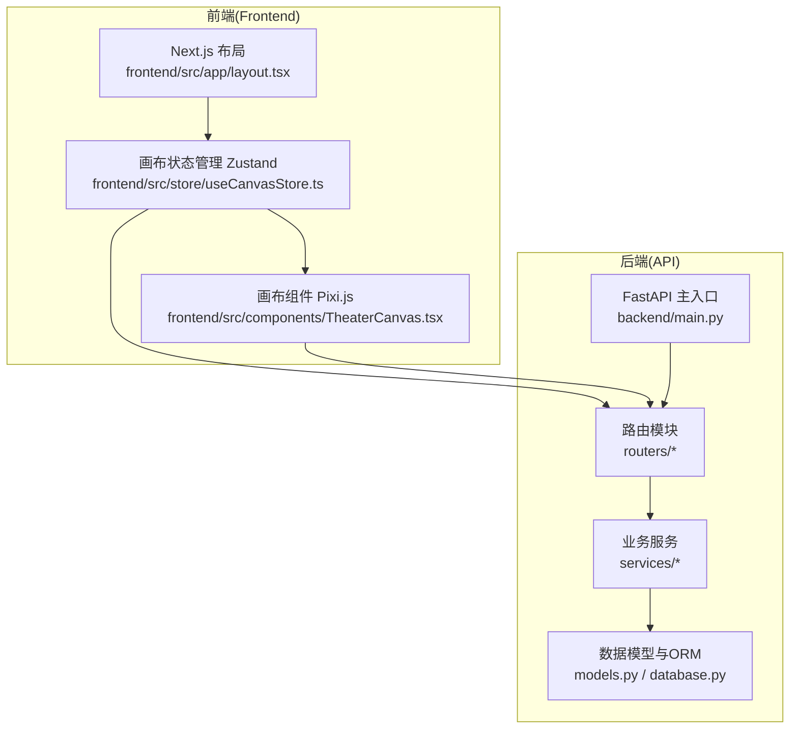
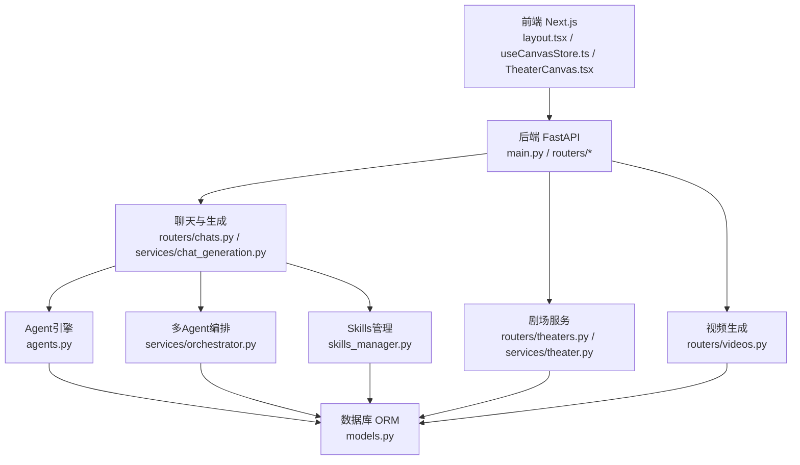
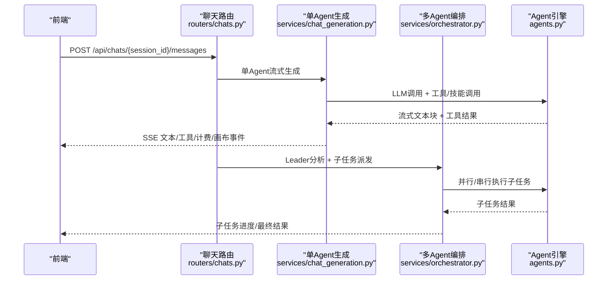
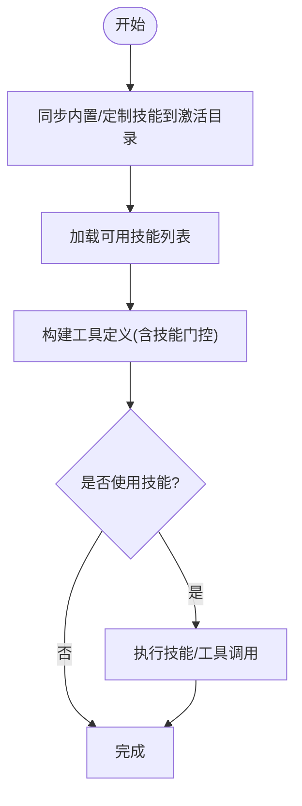
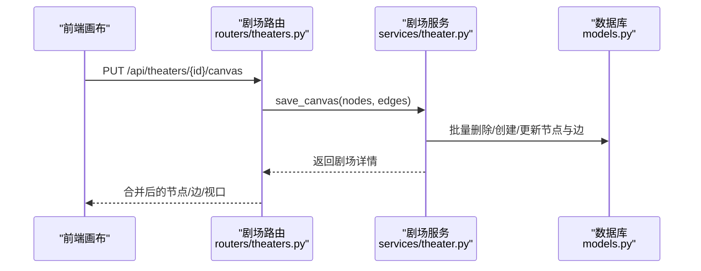
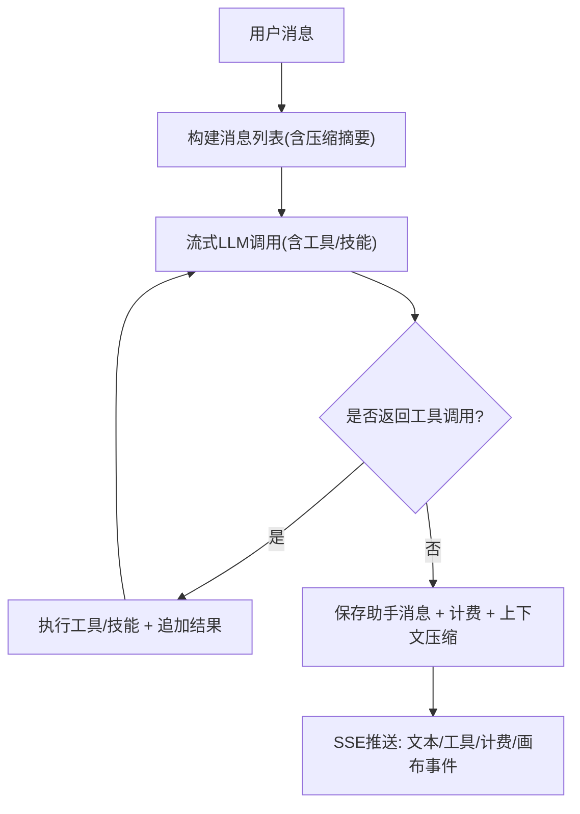
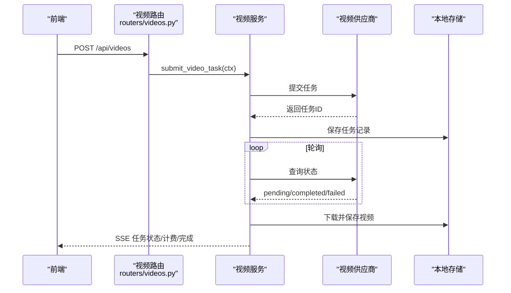
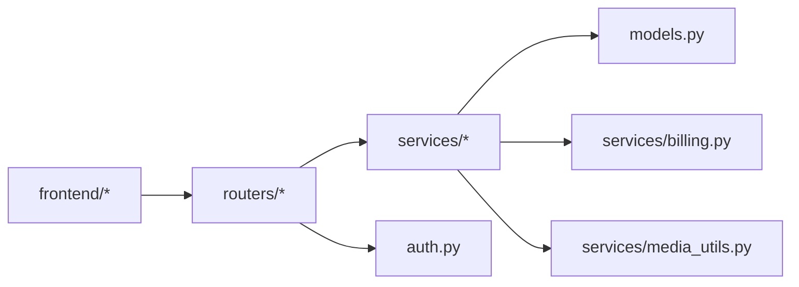

# 项目概述

<cite>
**本文引用的文件**
- [README.md](file://README.md)
- [backend/main.py](file://backend/main.py)
- [backend/config.py](file://backend/config.py)
- [backend/models.py](file://backend/models.py)
- [backend/routers/theaters.py](file://backend/routers/theaters.py)
- [backend/services/theater.py](file://backend/services/theater.py)
- [backend/routers/videos.py](file://backend/routers/videos.py)
- [backend/routers/chats.py](file://backend/routers/chats.py)
- [backend/services/chat_generation.py](file://backend/services/chat_generation.py)
- [backend/services/orchestrator.py](file://backend/services/orchestrator.py)
- [backend/agents.py](file://backend/agents.py)
- [backend/skills_manager.py](file://backend/skills_manager.py)
- [frontend/src/app/layout.tsx](file://frontend/src/app/layout.tsx)
- [frontend/src/components/TheaterCanvas.tsx](file://frontend/src/components/TheaterCanvas.tsx)
- [frontend/src/store/useCanvasStore.ts](file://frontend/src/store/useCanvasStore.ts)
</cite>

## 目录
1. [简介](#简介)
2. [项目结构](#项目结构)
3. [核心组件](#核心组件)
4. [架构总览](#架构总览)
5. [详细组件分析](#详细组件分析)
6. [依赖关系分析](#依赖关系分析)
7. [性能考量](#性能考量)
8. [故障排查指南](#故障排查指南)
9. [结论](#结论)
10. [附录](#附录)

## 简介
KunFlix（鲲影）是一个AI驱动的影视广告创作平台，面向创作者、广告公司与品牌方，提供从剧本、角色、视音频到资产管理的全链路AI生成与协作能力。平台以“无限画布”为核心理念，通过多Agent协作系统、skills插件体系与全链路多模态生成，实现从创意到成片的一站式创作闭环。

- 平台定位与核心特性参见 [README.md:8-27](file://README.md#L8-L27)
- 技术栈与系统组件参见 [README.md:28-46](file://README.md#L28-L46)

## 项目结构
项目采用前后端分离架构，后端基于FastAPI，前端基于Next.js，数据库采用SQLAlchemy异步ORM，支持SQLite（开发）与PostgreSQL（生产）。核心模块包括：
- 后端主入口与路由注册：[backend/main.py](file://backend/main.py)
- 配置管理：[backend/config.py](file://backend/config.py)
- 数据模型与迁移：[backend/models.py](file://backend/models.py)
- 剧场（画布）API与服务：[backend/routers/theaters.py](file://backend/routers/theaters.py)、[backend/services/theater.py](file://backend/services/theater.py)
- 视频生成API与服务：[backend/routers/videos.py](file://backend/routers/videos.py)
- 聊天与多Agent生成：[backend/routers/chats.py](file://backend/routers/chats.py)、[backend/services/chat_generation.py](file://backend/services/chat_generation.py)、[backend/services/orchestrator.py](file://backend/services/orchestrator.py)
- Agent与技能系统：[backend/agents.py](file://backend/agents.py)、[backend/skills_manager.py](file://backend/skills_manager.py)
- 前端布局与画布状态管理：[frontend/src/app/layout.tsx](file://frontend/src/app/layout.tsx)、[frontend/src/store/useCanvasStore.ts](file://frontend/src/store/useCanvasStore.ts)、[frontend/src/components/TheaterCanvas.tsx](file://frontend/src/components/TheaterCanvas.tsx)

图表来源
- [backend/main.py:110-153](file://backend/main.py#L110-L153)
- [frontend/src/app/layout.tsx:23-41](file://frontend/src/app/layout.tsx#L23-L41)
- [frontend/src/store/useCanvasStore.ts:185-510](file://frontend/src/store/useCanvasStore.ts#L185-L510)

章节来源
- [backend/main.py:110-153](file://backend/main.py#L110-L153)
- [backend/config.py:7-42](file://backend/config.py#L7-L42)
- [backend/models.py:10-503](file://backend/models.py#L10-L503)
- [frontend/src/app/layout.tsx:18-41](file://frontend/src/app/layout.tsx#L18-L41)

## 核心组件
- 多Agent协作引擎：基于AgentScope，支持单Agent与Leader-Member多Agent编排，具备上下文压缩、计费与画布桥接能力。参见 [backend/agents.py:176-388](file://backend/agents.py#L176-L388)、[backend/services/orchestrator.py:418-800](file://backend/services/orchestrator.py#L418-L800)
- Skills插件体系：集中管理内置/定制/激活技能，支持动态同步与按需加载。参见 [backend/skills_manager.py:180-257](file://backend/skills_manager.py#L180-L257)
- 剧场（无限画布）：支持节点（剧本/角色/分镜/视频）与边的全量同步、历史回放与撤销重做。参见 [backend/routers/theaters.py:14-110](file://backend/routers/theaters.py#L14-L110)、[backend/services/theater.py:13-285](file://backend/services/theater.py#L13-L285)、[frontend/src/store/useCanvasStore.ts:185-510](file://frontend/src/store/useCanvasStore.ts#L185-L510)
- 全链路多模态生成：文本→角色/场景/视频/音频，结合工具调用与计费。参见 [backend/routers/chats.py:18-232](file://backend/routers/chats.py#L18-L232)、[backend/services/chat_generation.py:29-449](file://backend/services/chat_generation.py#L29-L449)
- 视频生成与资产管理：统一任务追踪、轮询、计费与媒体落盘。参见 [backend/routers/videos.py:24-344](file://backend/routers/videos.py#L24-L344)

章节来源
- [backend/agents.py:176-388](file://backend/agents.py#L176-L388)
- [backend/skills_manager.py:180-257](file://backend/skills_manager.py#L180-L257)
- [backend/routers/theaters.py:14-110](file://backend/routers/theaters.py#L14-L110)
- [backend/services/theater.py:13-285](file://backend/services/theater.py#L13-L285)
- [frontend/src/store/useCanvasStore.ts:185-510](file://frontend/src/store/useCanvasStore.ts#L185-L510)
- [backend/routers/chats.py:18-232](file://backend/routers/chats.py#L18-L232)
- [backend/services/chat_generation.py:29-449](file://backend/services/chat_generation.py#L29-L449)
- [backend/routers/videos.py:24-344](file://backend/routers/videos.py#L24-L344)

## 架构总览
KunFlix采用“前端画布 + 后端API + 多Agent编排 + 技能插件 + 多模态生成”的分层架构。前端负责可视化创作与状态持久化；后端提供统一API与业务编排；Agent系统负责智能创作与工具调度；Skills体系提供可扩展的功能模块；视频生成与计费贯穿全链路。

图表来源
- [backend/main.py:138-153](file://backend/main.py#L138-L153)
- [backend/agents.py:176-388](file://backend/agents.py#L176-L388)
- [backend/services/orchestrator.py:418-800](file://backend/services/orchestrator.py#L418-L800)
- [backend/skills_manager.py:180-257](file://backend/skills_manager.py#L180-L257)
- [backend/routers/chats.py:18-232](file://backend/routers/chats.py#L18-L232)
- [backend/routers/theaters.py:14-110](file://backend/routers/theaters.py#L14-L110)
- [backend/routers/videos.py:24-344](file://backend/routers/videos.py#L24-L344)
- [backend/models.py:10-503](file://backend/models.py#L10-L503)

## 详细组件分析

### 多Agent协作系统
- 单Agent与多Agent模式：根据Agent配置决定走单Agent直通或Leader-Member编排；支持工具调用循环与技能加载。
- 编排策略：统一依赖图执行，支持并行与串行混合；可选Leader复审。
- 计费与上下文压缩：在生成完成后进行原子化扣费与上下文压缩，降低后续成本。

图表来源
- [backend/routers/chats.py:127-183](file://backend/routers/chats.py#L127-L183)
- [backend/services/chat_generation.py:29-449](file://backend/services/chat_generation.py#L29-L449)
- [backend/services/orchestrator.py:418-800](file://backend/services/orchestrator.py#L418-L800)
- [backend/agents.py:176-388](file://backend/agents.py#L176-L388)

章节来源
- [backend/routers/chats.py:127-183](file://backend/routers/chats.py#L127-L183)
- [backend/services/chat_generation.py:29-449](file://backend/services/chat_generation.py#L29-L449)
- [backend/services/orchestrator.py:418-800](file://backend/services/orchestrator.py#L418-L800)
- [backend/agents.py:176-388](file://backend/agents.py#L176-L388)

### Skills插件体系
- 结构：内置/定制/激活三层，支持按名称同步与差异更新。
- 功能：动态加载技能目录，构建工具定义，支持技能门控与工具重建。
- 安全：文件读取校验与路径遍历防护。

图表来源
- [backend/skills_manager.py:180-257](file://backend/skills_manager.py#L180-L257)
- [backend/skills_manager.py:263-408](file://backend/skills_manager.py#L263-L408)

章节来源
- [backend/skills_manager.py:180-257](file://backend/skills_manager.py#L180-L257)
- [backend/skills_manager.py:263-408](file://backend/skills_manager.py#L263-L408)

### 剧场（无限画布）与资产
- 剧场API：创建/查询/更新/删除剧场，保存画布节点与边，复制剧场。
- 服务层：全量同步算法（集合运算）、节点/边增删改查、剧场详情聚合。
- 前端状态：Zustand持久化、历史快照、撤销/重做、与后端双向同步。

图表来源
- [backend/routers/theaters.py:84-98](file://backend/routers/theaters.py#L84-L98)
- [backend/services/theater.py:108-228](file://backend/services/theater.py#L108-L228)
- [frontend/src/store/useCanvasStore.ts:378-510](file://frontend/src/store/useCanvasStore.ts#L378-L510)

章节来源
- [backend/routers/theaters.py:14-110](file://backend/routers/theaters.py#L14-L110)
- [backend/services/theater.py:13-285](file://backend/services/theater.py#L13-L285)
- [frontend/src/store/useCanvasStore.ts:185-510](file://frontend/src/store/useCanvasStore.ts#L185-L510)

### 全链路多模态生成
- 聊天流式生成：支持工具调用循环、技能加载、画布桥接与计费事件。
- 上下文压缩：延迟压缩策略，减少后续token消耗。
- 多模态消息：支持文本与图片混合输入，自动注入媒体路径提示。

图表来源
- [backend/services/chat_generation.py:29-449](file://backend/services/chat_generation.py#L29-L449)

章节来源
- [backend/routers/chats.py:18-232](file://backend/routers/chats.py#L18-L232)
- [backend/services/chat_generation.py:29-449](file://backend/services/chat_generation.py#L29-L449)

### 视频生成与资产管理
- 任务提交：根据供应商类型路由至对应适配器，创建任务记录。
- 轮询与落盘：轮询供应商状态，下载视频并保存至本地，计算时长与计费。
- 会话联动：在聊天会话中插入视频消息，支持删除与清理。

图表来源
- [backend/routers/videos.py:75-233](file://backend/routers/videos.py#L75-L233)

章节来源
- [backend/routers/videos.py:24-344](file://backend/routers/videos.py#L24-L344)

## 依赖关系分析
- 后端依赖：FastAPI、SQLAlchemy异步ORM、AgentScope、CORS中间件、Alembic迁移。
- 前端依赖：Next.js、Zustand、@xyflow/react、Ant Design Registry、Pixi.js。
- 数据模型：用户、剧场、节点、边、资产、会话、消息、Agent、任务、订阅等。
- 关键耦合：聊天路由依赖Agent与工具管理；剧场路由依赖服务层；视频路由依赖供应商适配器与计费。

图表来源
- [backend/main.py:41-44](file://backend/main.py#L41-L44)
- [backend/models.py:10-503](file://backend/models.py#L10-L503)

章节来源
- [backend/main.py:41-44](file://backend/main.py#L41-L44)
- [backend/models.py:10-503](file://backend/models.py#L10-L503)

## 性能考量
- 数据库：生产环境建议使用PostgreSQL并配置连接池；迁移失败自动清理残留临时表后重试。
- 缓存与并发：可引入Redis缓存热点数据；视频生成建议配置GPU服务器。
- 网络与IO：媒体文件建议使用对象存储；WebSocket与SSE保证低延迟交互。
- 上下文压缩：在生成完成后进行压缩，降低后续token消耗；合理设置上下文窗口与温度。

## 故障排查指南
- 数据库连接失败：启动时自动重试，若仍失败尝试清理残留临时表后重试。
- 供应商轮询超时：pending状态下超过阈值判定失败，记录错误并终止。
- 积分不足：付费Agent在余额不足时拒绝请求，需充值后继续。
- 技能加载异常：检查激活目录与文件权限，确认路径安全与frontmatter规范。

章节来源
- [backend/main.py:49-108](file://backend/main.py#L49-L108)
- [backend/routers/videos.py:180-233](file://backend/routers/videos.py#L180-L233)
- [backend/routers/chats.py:161-163](file://backend/routers/chats.py#L161-L163)
- [backend/skills_manager.py:370-408](file://backend/skills_manager.py#L370-L408)

## 结论
KunFlix通过“无限画布 + 多Agent协作 + Skills插件 + 全链路多模态生成”的架构，为影视广告创作提供了高扩展、强协作与智能化的解决方案。前后端清晰分层、数据库模型完备、计费与上下文压缩机制完善，适合创作者与企业用户快速落地创意到成片的全流程生产。

## 附录
- 快速开始与示例API参见 [README.md:81-139](file://README.md#L81-L139)
- 部署与运维建议参见 [README.md:233-271](file://README.md#L233-L271)