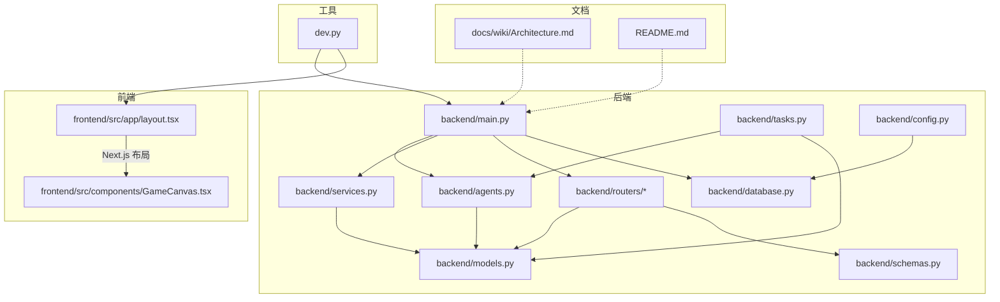
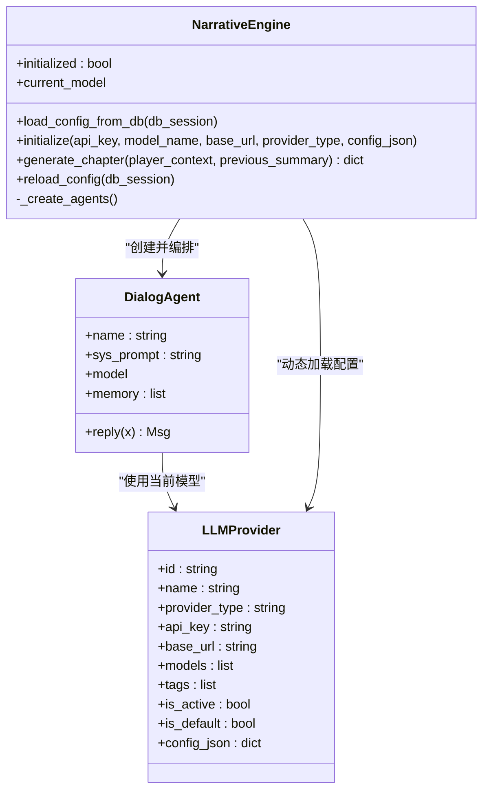
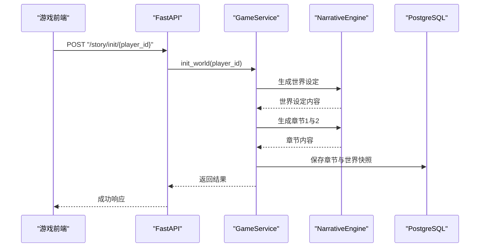
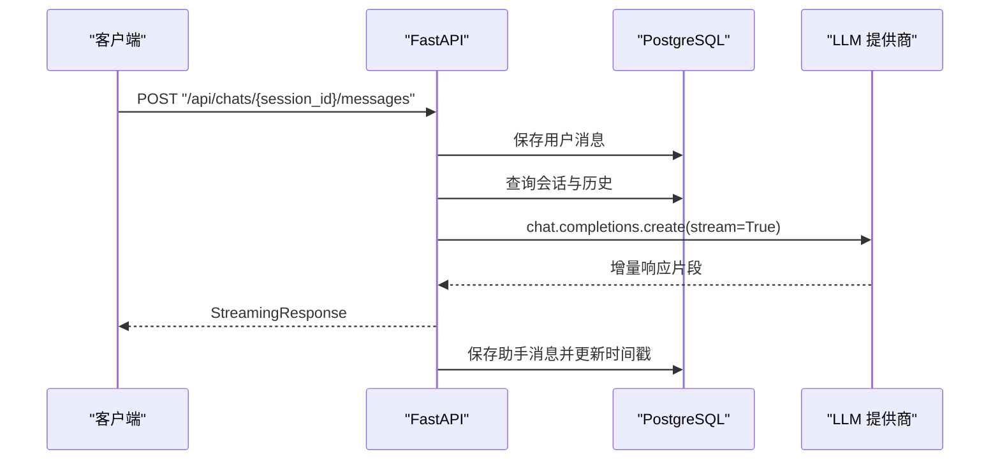
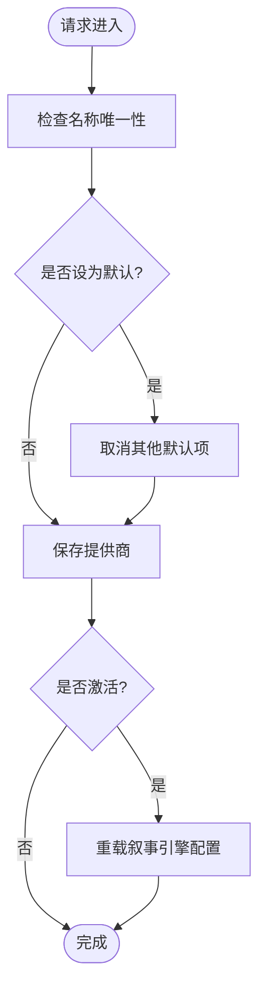
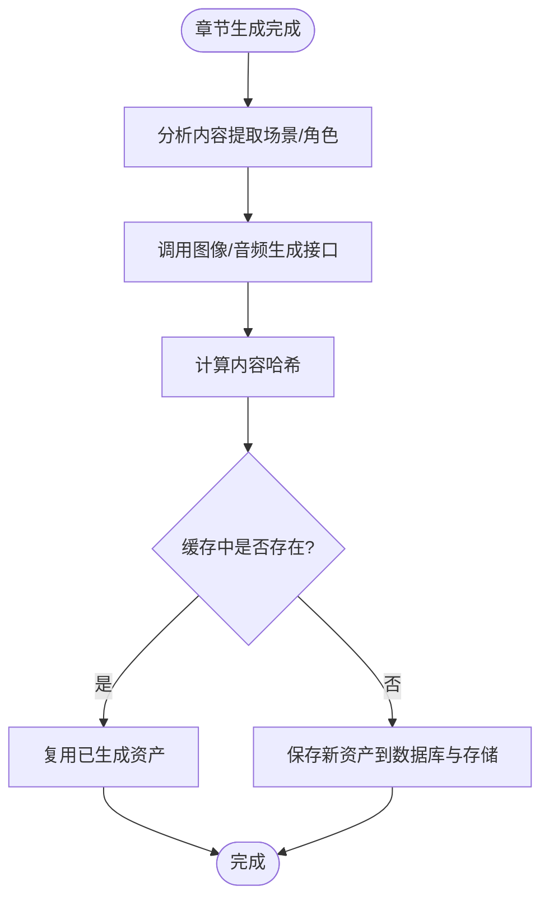
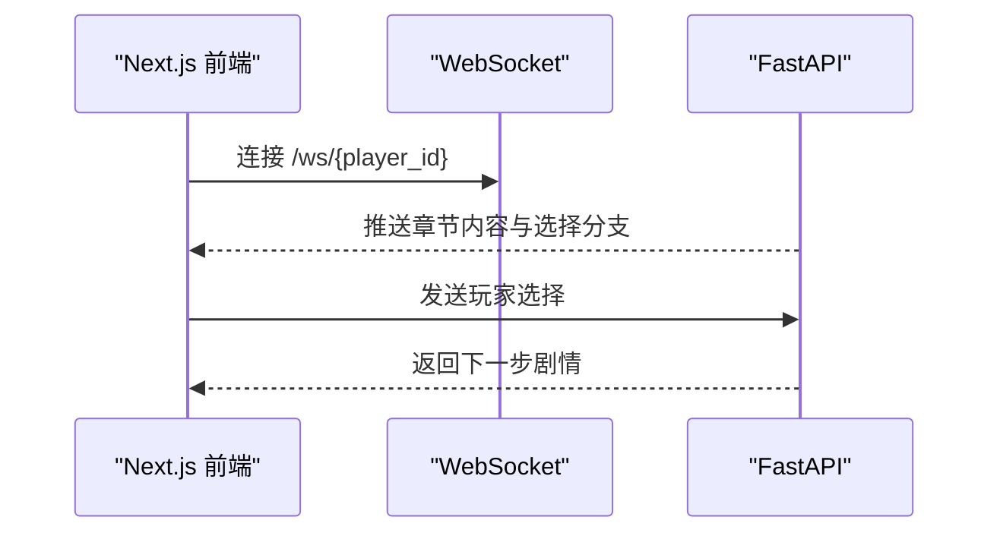
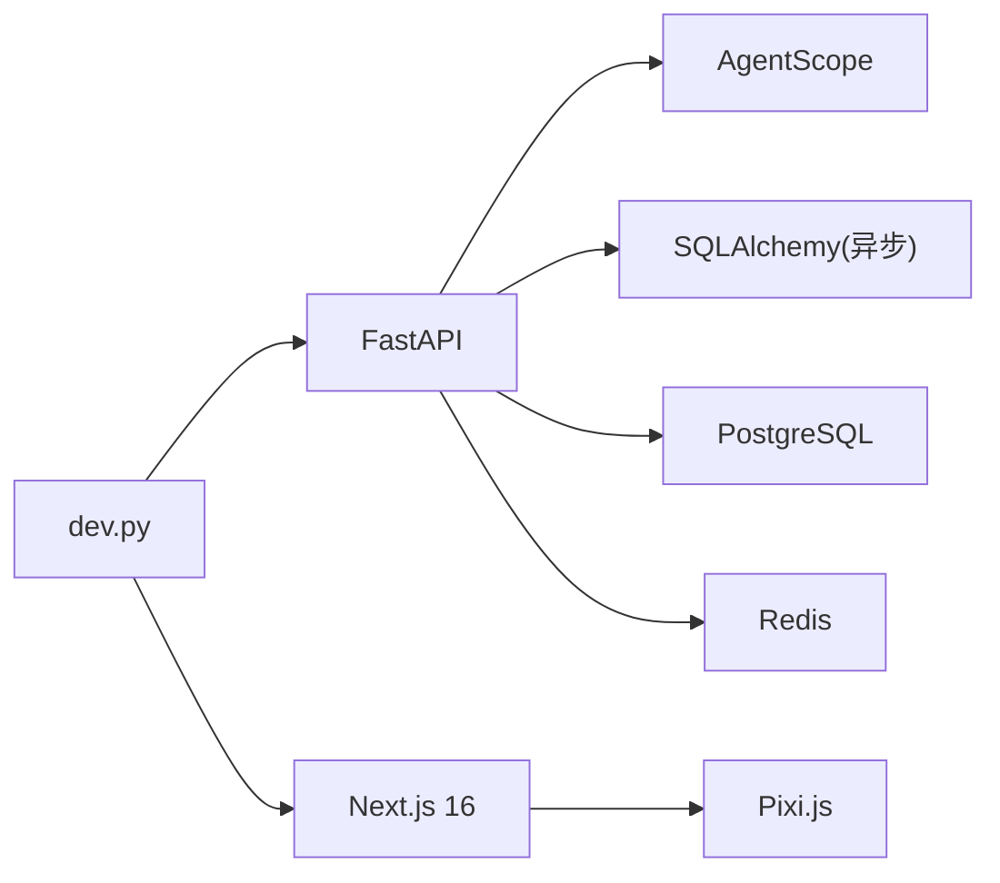

# 项目概述

<cite>
**本文引用的文件**
- [README.md](file://README.md)
- [Architecture.md](file://docs/wiki/Architecture.md)
- [main.py](file://backend/main.py)
- [agents.py](file://backend/agents.py)
- [services.py](file://backend/services.py)
- [models.py](file://backend/models.py)
- [config.py](file://backend/config.py)
- [database.py](file://backend/database.py)
- [schemas.py](file://backend/schemas.py)
- [routers/llm_config.py](file://backend/routers/llm_config.py)
- [routers/admin.py](file://backend/routers/admin.py)
- [routers/agents.py](file://backend/routers/agents.py)
- [routers/chats.py](file://backend/routers/chats.py)
- [tasks.py](file://backend/tasks.py)
- [frontend/src/app/layout.tsx](file://frontend/src/app/layout.tsx)
- [frontend/src/components/GameCanvas.tsx](file://frontend/src/components/GameCanvas.tsx)
- [dev.py](file://dev.py)
</cite>

## 目录
1. [引言](#引言)
2. [项目结构](#项目结构)
3. [核心组件](#核心组件)
4. [架构总览](#架构总览)
5. [详细组件分析](#详细组件分析)
6. [依赖分析](#依赖分析)
7. [性能考虑](#性能考虑)
8. [故障排查指南](#故障排查指南)
9. [结论](#结论)
10. [附录](#附录)

## 引言
本项目是一个基于 AgentScope 多智能体框架的“无限剧情游戏系统”，旨在通过 LLM 驱动的动态叙事引擎与多模态资产生成，为玩家提供无尽延展、逻辑自洽且高度沉浸的互动故事体验。系统采用前后端分离架构：后端以 FastAPI 承载 API 与业务逻辑，前端以 Next.js 构建游戏客户端与后台管理界面，数据库采用 PostgreSQL，缓存与任务队列采用 Redis。系统具备实时 WebSocket 推送、动态 LLM 配置、N+2 预生成策略、一致性校验与多模态资产缓存等关键技术能力。

## 项目结构
项目采用分层与功能域混合的组织方式：
- backend：后端主目录，包含 FastAPI 应用入口、数据库模型与服务层、路由模块、AgentScope 叙事引擎、任务与配置等
- frontend：游戏客户端前端（Next.js App Router）
- backend/admin：后台管理前端（Next.js）
- docs/wiki：系统文档与开发指南
- dev.py：一键开发环境启动脚本

图表来源
- [main.py](file://backend/main.py#L1-L173)
- [agents.py](file://backend/agents.py#L1-L196)
- [services.py](file://backend/services.py#L1-L66)
- [models.py](file://backend/models.py#L1-L122)
- [routers/llm_config.py](file://backend/routers/llm_config.py#L1-L203)
- [routers/admin.py](file://backend/routers/admin.py#L1-L112)
- [routers/agents.py](file://backend/routers/agents.py#L1-L141)
- [routers/chats.py](file://backend/routers/chats.py#L1-L275)
- [tasks.py](file://backend/tasks.py#L1-L62)
- [config.py](file://backend/config.py#L1-L34)
- [database.py](file://backend/database.py#L1-L31)
- [schemas.py](file://backend/schemas.py#L1-L102)
- [frontend/src/app/layout.tsx](file://frontend/src/app/layout.tsx#L1-L35)
- [frontend/src/components/GameCanvas.tsx](file://frontend/src/components/GameCanvas.tsx#L1-L50)
- [Architecture.md](file://docs/wiki/Architecture.md#L1-L62)
- [README.md](file://README.md#L1-L141)
- [dev.py](file://dev.py#L1-L150)

章节来源
- [README.md](file://README.md#L1-L141)
- [Architecture.md](file://docs/wiki/Architecture.md#L1-L62)

## 核心组件
- 动态叙事引擎（AgentScope）
  - 基于导演、旁白、NPC 管理器三个角色的多智能体协作，实现剧情大纲、文本扩展与 NPC 关系更新
  - 支持从数据库动态加载 LLM 提供商配置，实现运行时切换与测试
- 游戏服务层（GameService）
  - 负责玩家初始化、世界构建、章节生成与保存、一致性校验与下一章预生成触发
- 数据模型与持久化
  - 玩家、章节、资产、LLM 提供商、聊天会话与消息等核心实体，采用 PostgreSQL 存储
- 路由与 API
  - LLM 提供商管理、Agent 管理、聊天会话与消息流式响应、后台统计与玩家管理
- 多模态资产管线
  - 内容分析、图片/音频生成与缓存去重，配合 Redis 与后台任务实现异步生成
- 前端与实时交互
  - Next.js 客户端负责故事展示与交互；WebSocket 提供低延迟推送
- 开发与运维
  - 一键启动脚本统一安装与并行启动后端、前端与后台管理

章节来源
- [agents.py](file://backend/agents.py#L43-L196)
- [services.py](file://backend/services.py#L8-L66)
- [models.py](file://backend/models.py#L9-L122)
- [routers/llm_config.py](file://backend/routers/llm_config.py#L1-L203)
- [routers/agents.py](file://backend/routers/agents.py#L1-L141)
- [routers/chats.py](file://backend/routers/chats.py#L1-L275)
- [routers/admin.py](file://backend/routers/admin.py#L1-L112)
- [tasks.py](file://backend/tasks.py#L1-L62)
- [frontend/src/components/GameCanvas.tsx](file://frontend/src/components/GameCanvas.tsx#L1-L50)
- [dev.py](file://dev.py#L1-L150)

## 架构总览
系统采用“全栈微服务”风格，前后端分离，后端以 FastAPI 为核心承载 API 与业务，AgentScope 作为叙事引擎，PostgreSQL 与 Redis 分别承担结构化数据与缓存/队列职责。后台管理前端提供可视化运营能力，游戏前端通过 WebSocket 与 HTTP 与后端交互。

图表来源
- [Architecture.md](file://docs/wiki/Architecture.md#L7-L36)
- [main.py](file://backend/main.py#L83-L173)
- [agents.py](file://backend/agents.py#L101-L130)
- [tasks.py](file://backend/tasks.py#L7-L62)

章节来源
- [Architecture.md](file://docs/wiki/Architecture.md#L1-L62)
- [main.py](file://backend/main.py#L1-L173)

## 详细组件分析

### 叙事引擎与多智能体协作
- 角色分工
  - 导演：制定章节大纲，确保逻辑自洽与主线推进
  - 旁白：将大纲扩展为沉浸式文本，注重细节与情感
  - NPC 管理器：根据玩家行为调整 NPC 关系与反应
- 初始化与动态配置
  - 启动时从数据库加载活动提供商，支持 OpenAI、DashScope、Anthropic、Gemini 等
  - 提供连接测试接口，便于在后台验证不同提供商可用性
- 章节生成流程
  - 生成章节内容与 NPC 更新摘要，保存至数据库并触发资产生成

图表来源
- [agents.py](file://backend/agents.py#L11-L42)
- [agents.py](file://backend/agents.py#L43-L196)
- [models.py](file://backend/models.py#L58-L79)
- [routers/llm_config.py](file://backend/routers/llm_config.py#L20-L111)

章节来源
- [agents.py](file://backend/agents.py#L1-L196)
- [routers/llm_config.py](file://backend/routers/llm_config.py#L1-L203)
- [models.py](file://backend/models.py#L58-L79)

### 游戏服务与世界初始化
- 玩家创建与世界初始化
  - 生成世界观设定与前两章内容，预生成下一章，保证玩家进入时的流畅体验
- 一致性与下一章预生成
  - 通过章节摘要与 NPC 更新摘要，结合后台任务实现 N+2 预生成策略

图表来源
- [services.py](file://backend/services.py#L19-L59)
- [agents.py](file://backend/agents.py#L154-L191)
- [main.py](file://backend/main.py#L147-L156)

章节来源
- [services.py](file://backend/services.py#L1-L66)
- [main.py](file://backend/main.py#L147-L156)

### 聊天与流式响应
- 会话与消息管理
  - 支持创建会话、查询历史、删除会话
- 流式响应
  - 基于 OpenAI/DashScope/Azure/OpenAI 兼容接口实现增量输出
  - 记录输入/输出字符数与令牌使用情况，便于成本与上下文窗口监控

图表来源
- [routers/chats.py](file://backend/routers/chats.py#L72-L258)
- [models.py](file://backend/models.py#L80-L99)

章节来源
- [routers/chats.py](file://backend/routers/chats.py#L1-L275)
- [models.py](file://backend/models.py#L80-L99)

### LLM 提供商管理与动态配置
- 提供商 CRUD 与默认/活动状态管理
- 运行时连接测试，支持多种提供商类型与自定义配置
- 当活动提供商变化时，自动重载叙事引擎配置

图表来源
- [routers/llm_config.py](file://backend/routers/llm_config.py#L112-L138)
- [routers/llm_config.py](file://backend/routers/llm_config.py#L160-L188)
- [agents.py](file://backend/agents.py#L49-L76)

章节来源
- [routers/llm_config.py](file://backend/routers/llm_config.py#L1-L203)
- [agents.py](file://backend/agents.py#L49-L76)

### 多模态资产生成与缓存
- 内容分析与资产提取
  - 基于章节内容提取场景与角色信息，驱动图片/音频生成
- 资产去重与缓存
  - 通过内容哈希去重，结合 Redis 实现 LRU 淘汰策略
- 异步生成与队列
  - 通过后台任务队列（Redis）异步生成，避免主线程阻塞

图表来源
- [tasks.py](file://backend/tasks.py#L57-L62)
- [models.py](file://backend/models.py#L45-L57)

章节来源
- [tasks.py](file://backend/tasks.py#L1-L62)
- [models.py](file://backend/models.py#L45-L57)

### 前端与实时交互
- 游戏前端布局与 2D 渲染
  - Next.js 布局与 Pixi.js 画布渲染，用于展示立绘与动态场景
- WebSocket 交互
  - 低延迟推送剧情更新与实时反馈

图表来源
- [frontend/src/app/layout.tsx](file://frontend/src/app/layout.tsx#L1-L35)
- [frontend/src/components/GameCanvas.tsx](file://frontend/src/components/GameCanvas.tsx#L1-L50)
- [main.py](file://backend/main.py#L157-L169)

章节来源
- [frontend/src/app/layout.tsx](file://frontend/src/app/layout.tsx#L1-L35)
- [frontend/src/components/GameCanvas.tsx](file://frontend/src/components/GameCanvas.tsx#L1-L50)
- [main.py](file://backend/main.py#L157-L169)

## 依赖分析
- 后端依赖
  - FastAPI：异步高性能 Web 框架，适配 LLM 调用
  - AgentScope：多智能体编排与模型封装
  - SQLAlchemy（异步）：ORM 与连接池管理
  - PostgreSQL/Redis：数据持久化与缓存/队列
- 前端依赖
  - Next.js 16：App Router 与现代 React 特性
  - Pixi.js：2D 渲染
  - Tailwind CSS：样式
- 开发与运维
  - Alembic：数据库迁移
  - dev.py：一键安装与并行启动

图表来源
- [Architecture.md](file://docs/wiki/Architecture.md#L55-L62)
- [config.py](file://backend/config.py#L1-L34)
- [database.py](file://backend/database.py#L1-L31)
- [dev.py](file://dev.py#L1-L150)

章节来源
- [Architecture.md](file://docs/wiki/Architecture.md#L1-L62)
- [config.py](file://backend/config.py#L1-L34)
- [database.py](file://backend/database.py#L1-L31)
- [dev.py](file://dev.py#L1-L150)

## 性能考虑
- 异步与连接池
  - 使用异步 SQLAlchemy 与连接池参数优化数据库吞吐
- 流式响应
  - 聊天接口采用流式输出，降低首字节延迟
- 预生成策略
  - N+2 章节预生成与后台任务队列，减少玩家等待
- 缓存与去重
  - 资产哈希去重与 LRU 淘汰，降低重复生成成本
- 上下文窗口与令牌统计
  - 记录输入/输出字符与令牌使用，辅助成本控制与上下文管理

## 故障排查指南
- 数据库连接失败
  - 后端启动时包含连接重试与迁移执行逻辑，若失败会持续重试并输出错误信息
- LLM 提供商不可用
  - 使用“连接测试”接口验证提供商可用性与配置正确性
- WebSocket 错误
  - 检查连接建立与异常捕获逻辑，确认客户端与服务端端口配置
- 聊天流式响应中断
  - 查看日志中令牌统计与错误信息，确认提供商类型与模型参数

章节来源
- [main.py](file://backend/main.py#L45-L81)
- [routers/llm_config.py](file://backend/routers/llm_config.py#L20-L111)
- [main.py](file://backend/main.py#L157-L169)
- [routers/chats.py](file://backend/routers/chats.py#L112-L258)

## 结论
本项目以 AgentScope 为核心，结合 FastAPI、PostgreSQL 与 Redis，构建了高扩展性的“无限剧情游戏系统”。通过动态 LLM 配置、N+2 预生成与多模态资产缓存，系统实现了低延迟、高沉浸感的动态叙事体验。前后端分离与后台管理前端进一步提升了可维护性与运营效率。对于初学者，建议从 README 与 Wiki 的架构文档入手；对于开发者，可从路由、服务与模型层逐步深入，结合 dev.py 快速搭建本地开发环境。

## 附录
- 快速开始
  - 后端：安装依赖、配置环境变量、启动服务
  - 前端：安装依赖、启动开发服务器
  - 后台管理：安装依赖、启动开发服务器
- 数据库迁移
  - 使用 manage_db.py 生成与应用迁移脚本

章节来源
- [README.md](file://README.md#L53-L127)
- [dev.py](file://dev.py#L25-L106)