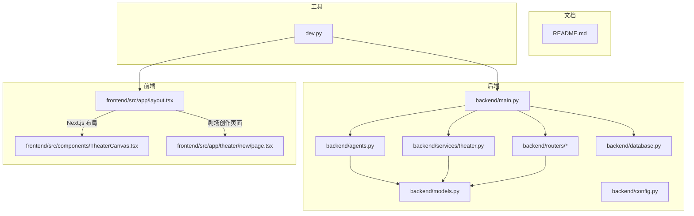
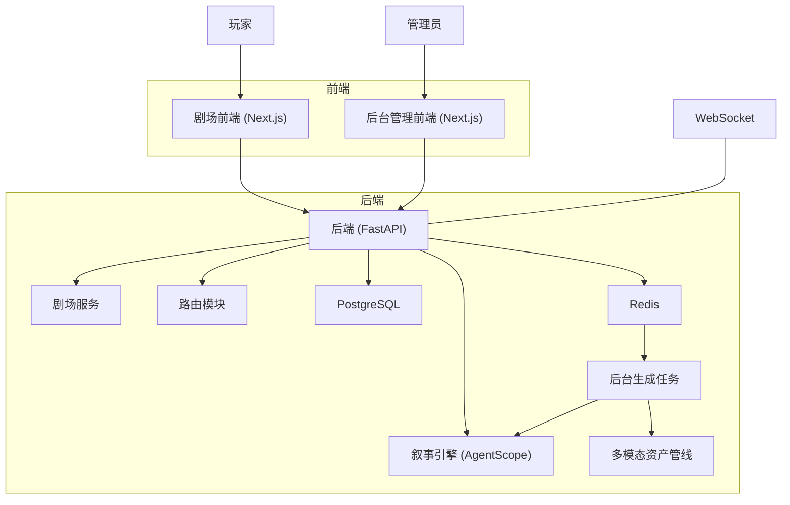
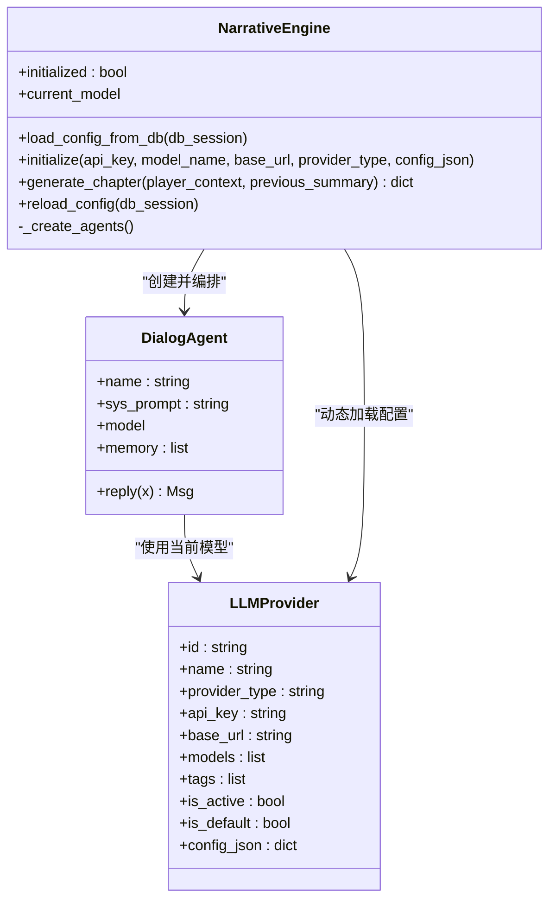
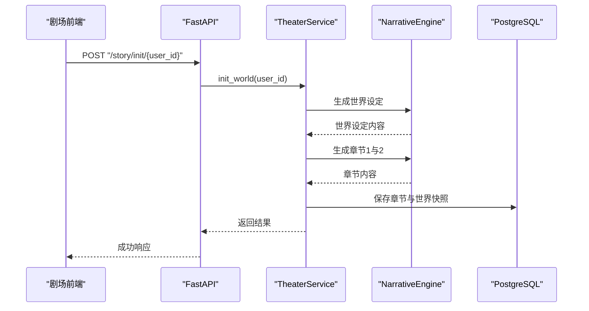
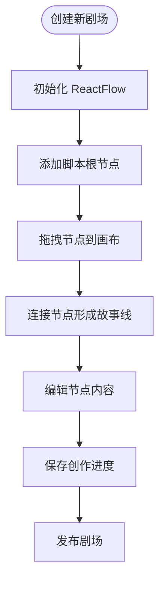
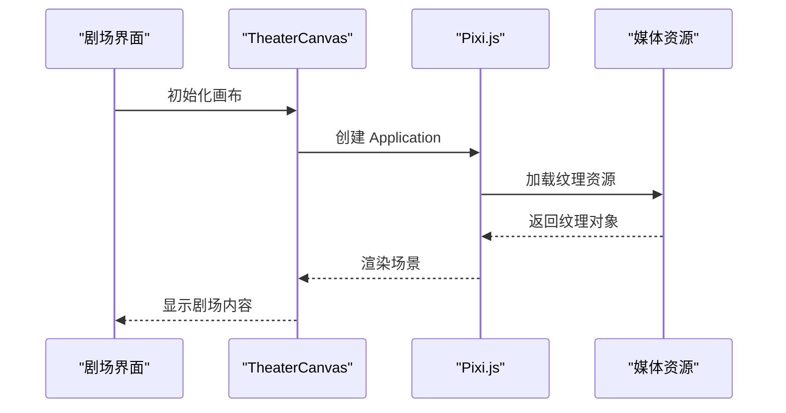
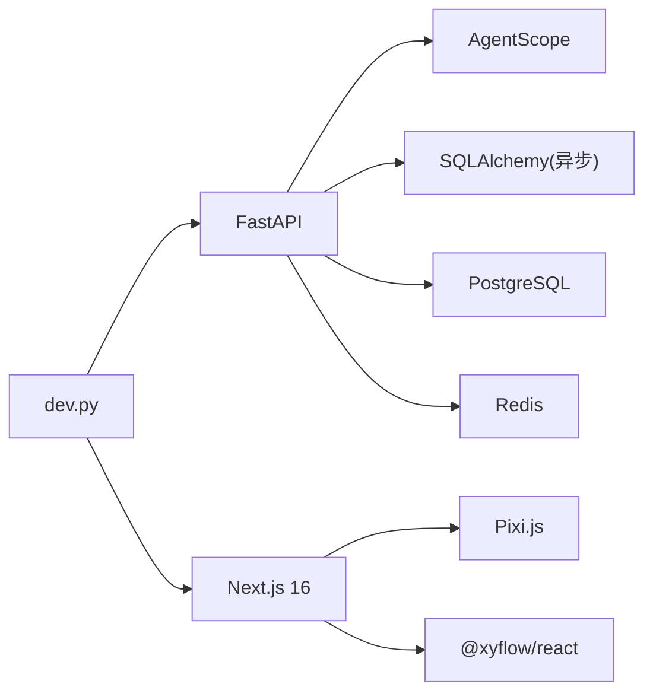

# 项目概述

<cite>
**本文引用的文件**
- [README.md](file://README.md)
- [main.py](file://backend/main.py)
- [agents.py](file://backend/agents.py)
- [services/theater.py](file://backend/services/theater.py)
- [models.py](file://backend/models.py)
- [routers/agents.py](file://backend/routers/agents.py)
- [frontend/src/app/layout.tsx](file://frontend/src/app/layout.tsx)
- [frontend/src/components/TheaterCanvas.tsx](file://frontend/src/components/TheaterCanvas.tsx)
- [frontend/src/app/theater/new/page.tsx](file://frontend/src/app/theater/new/page.tsx)
- [frontend/package.json](file://frontend/package.json)
</cite>

## 目录
1. [引言](#引言)
2. [项目结构](#项目结构)
3. [核心组件](#核心组件)
4. [架构总览](#架构总览)
5. [详细组件分析](#详细组件分析)
6. [依赖分析](#依赖分析)
7. [性能考虑](#性能考虑)
8. [故障排查指南](#故障排查指南)
9. [结论](#结论)
10. [附录](#附录)

## 引言
本项目是一个基于 AgentScope 多智能体框架的"无限剧情剧场系统"，旨在通过 LLM 驱动的动态叙事引擎与多模态资产生成，为玩家提供无尽延展、逻辑自洽且高度沉浸的互动剧场体验。系统采用前后端分离架构：后端以 FastAPI 承载 API 与业务逻辑，前端以 Next.js 构建剧场客户端与后台管理界面，数据库采用 PostgreSQL，缓存与任务队列采用 Redis。系统具备实时 WebSocket 推送、动态 LLM 配置、N+2 预生成策略、一致性校验与多模态资产缓存等关键技术能力。

**更新** 项目已从"无限游戏"品牌重新定位为"无限剧场"，强调动态叙事与多模态体验的剧场化呈现。

## 项目结构
项目采用分层与功能域混合的组织方式：
- backend：后端主目录，包含 FastAPI 应用入口、数据库模型与服务层、路由模块、AgentScope 叙事引擎、任务与配置等
- frontend：剧场客户端前端（Next.js App Router）
- backend/admin：后台管理前端（Next.js）
- docs：系统文档与开发指南
- dev.py：一键开发环境启动脚本

**图表来源**
- [main.py:111-137](file://backend/main.py#L111-L137)
- [agents.py](file://backend/agents.py#L322)
- [services/theater.py:8-58](file://backend/services/theater.py#L8-L58)
- [models.py:1-383](file://backend/models.py#L1-L383)
- [frontend/src/app/layout.tsx:1-42](file://frontend/src/app/layout.tsx#L1-L42)
- [frontend/src/components/TheaterCanvas.tsx:1-50](file://frontend/src/components/TheaterCanvas.tsx#L1-L50)
- [frontend/src/app/theater/new/page.tsx:1-191](file://frontend/src/app/theater/new/page.tsx#L1-L191)

**章节来源**
- [README.md:1-139](file://README.md#L1-L139)
- [main.py:111-137](file://backend/main.py#L111-L137)

## 核心组件
- 动态叙事引擎（AgentScope）
  - 基于导演、旁白、NPC 管理器三个角色的多智能体协作，实现剧情大纲、文本扩展与 NPC 关系更新
  - 支持从数据库动态加载 LLM 提供商配置，实现运行时切换与测试
- 剧场服务层（TheaterService）
  - 负责玩家初始化、世界构建、章节生成与保存、一致性校验与下一章预生成触发
- 数据模型与持久化
  - 玩家、章节、资产、LLM 提供商、聊天会话与消息等核心实体，采用 PostgreSQL 存储
- 路由与 API
  - LLM 提供商管理、Agent 管理、聊天会话与消息流式响应、后台统计与玩家管理
- 多模态资产管线
  - 内容分析、图片/音频生成与缓存去重，配合 Redis 与后台任务实现异步生成
- 前端与实时交互
  - Next.js 客户端负责剧场展示与交互；WebSocket 提供低延迟推送
- 开发与运维
  - 一键启动脚本统一安装与并行启动后端、前端与后台管理

**章节来源**
- [agents.py:110-322](file://backend/agents.py#L110-L322)
- [services/theater.py:8-58](file://backend/services/theater.py#L8-L58)
- [models.py:35-383](file://backend/models.py#L35-L383)
- [routers/agents.py:1-151](file://backend/routers/agents.py#L1-L151)

## 架构总览
系统采用"全栈微服务"风格，前后端分离，后端以 FastAPI 为核心承载 API 与业务，AgentScope 作为叙事引擎，PostgreSQL 与 Redis 分别承担结构化数据与缓存/队列职责。后台管理前端提供可视化运营能力，剧场前端通过 WebSocket 与 HTTP 与后端交互。

**图表来源**
- [main.py:111-137](file://backend/main.py#L111-L137)
- [agents.py](file://backend/agents.py#L322)
- [services/theater.py:8-58](file://backend/services/theater.py#L8-L58)

**章节来源**
- [main.py:111-137](file://backend/main.py#L111-L137)

## 详细组件分析

### 叙事引擎与多智能体协作
- 角色分工
  - 导演：制定章节大纲，确保逻辑自洽与主线推进
  - 旁白：将大纲扩展为沉浸式文本，注重细节与情感
  - NPC 管理器：根据玩家行为调整 NPC 关系与反应
- 初始化与动态配置
  - 启动时从数据库加载活动提供商，支持 OpenAI、DashScope、Anthropic、Gemini 等
  - 提供连接测试接口，便于在后台验证不同提供商可用性
- 章节生成流程
  - 生成章节内容与 NPC 更新摘要，保存至数据库并触发资产生成

**图表来源**
- [agents.py:35-108](file://backend/agents.py#L35-L108)
- [agents.py:110-255](file://backend/agents.py#L110-L255)
- [models.py:118-142](file://backend/models.py#L118-L142)

**章节来源**
- [agents.py:110-322](file://backend/agents.py#L110-L322)
- [models.py:118-142](file://backend/models.py#L118-L142)

### 剧场服务与世界初始化
- 玩家创建与世界初始化
  - 生成世界观设定与前两章内容，预生成下一章，保证玩家进入时的流畅体验
- 一致性与下一章预生成
  - 通过章节摘要与 NPC 更新摘要，结合后台任务实现 N+2 预生成策略

**图表来源**
- [services/theater.py:12-51](file://backend/services/theater.py#L12-L51)
- [agents.py:256-317](file://backend/agents.py#L256-L317)
- [main.py:135-137](file://backend/main.py#L135-L137)

**章节来源**
- [services/theater.py:8-58](file://backend/services/theater.py#L8-L58)

### 剧场创作与可视化编辑
- ReactFlow 可视化编辑器
  - 基于 ReactFlow 构建的节点式编辑器，支持脚本、角色、分镜等节点类型
  - 提供拖拽、连线、撤销重做等编辑功能
- 节点类型与组件
  - ScriptNode：剧本节点，管理故事大纲与章节结构
  - CharacterNode：角色节点，管理角色信息与关系
  - StoryboardNode：分镜节点，管理场景与视觉元素

**图表来源**
- [frontend/src/app/theater/new/page.tsx:43-182](file://frontend/src/app/theater/new/page.tsx#L43-L182)
- [frontend/src/components/canvas/ScriptNode.tsx](file://frontend/src/components/canvas/ScriptNode.tsx)
- [frontend/src/components/canvas/CharacterNode.tsx](file://frontend/src/components/canvas/CharacterNode.tsx)
- [frontend/src/components/canvas/StoryboardNode.tsx](file://frontend/src/components/canvas/StoryboardNode.tsx)

**章节来源**
- [frontend/src/app/theater/new/page.tsx:1-191](file://frontend/src/app/theater/new/page.tsx#L1-L191)

### 剧场渲染与多媒体展示
- Pixi.js 2D 渲染
  - 使用 Pixi.js 进行高性能 2D 图形渲染，支持纹理、动画和特效
  - 提供 Canvas 组件封装，简化渲染流程
- 多媒体资产管理
  - 支持图片、音频、视频等多种媒体格式
  - 集成内容哈希去重与缓存机制

**图表来源**
- [frontend/src/components/TheaterCanvas.tsx:14-44](file://frontend/src/components/TheaterCanvas.tsx#L14-L44)

**章节来源**
- [frontend/src/components/TheaterCanvas.tsx:1-50](file://frontend/src/components/TheaterCanvas.tsx#L1-L50)

## 依赖分析
- 后端依赖
  - FastAPI：异步高性能 Web 框架，适配 LLM 调用
  - AgentScope：多智能体编排与模型封装
  - SQLAlchemy（异步）：ORM 与连接池管理
  - PostgreSQL/Redis：数据持久化与缓存/队列
- 前端依赖
  - Next.js 16：App Router 与现代 React 特性
  - Pixi.js：2D 渲染
  - ReactFlow：可视化编辑器
  - Tailwind CSS：样式
- 开发与运维
  - Alembic：数据库迁移
  - dev.py：一键安装与并行启动

**图表来源**
- [main.py:111-137](file://backend/main.py#L111-L137)
- [frontend/package.json:11-34](file://frontend/package.json#L11-L34)

**章节来源**
- [main.py:111-137](file://backend/main.py#L111-L137)
- [frontend/package.json:11-34](file://frontend/package.json#L11-L34)

## 性能考虑
- 异步与连接池
  - 使用异步 SQLAlchemy 与连接池参数优化数据库吞吐
- 流式响应
  - 聊天接口采用流式输出，降低首字节延迟
- 预生成策略
  - N+2 章节预生成与后台任务队列，减少玩家等待
- 缓存与去重
  - 资产哈希去重与 LRU 淘汰，降低重复生成成本
- 上下文窗口与令牌统计
  - 记录输入/输出字符与令牌使用，辅助成本控制与上下文管理

## 故障排查指南
- 数据库连接失败
  - 后端启动时包含连接重试与迁移执行逻辑，若失败会持续重试并输出错误信息
- LLM 提供商不可用
  - 使用"连接测试"接口验证提供商可用性与配置正确性
- WebSocket 错误
  - 检查连接建立与异常捕获逻辑，确认客户端与服务端端口配置
- 剧场编辑器问题
  - 检查 ReactFlow 依赖与版本兼容性，确认节点类型注册正确
- 媒体渲染问题
  - 验证 Pixi.js 版本与浏览器兼容性，检查资源加载路径

**章节来源**
- [main.py:50-98](file://backend/main.py#L50-L98)
- [agents.py:116-166](file://backend/agents.py#L116-L166)
- [frontend/src/app/theater/new/page.tsx:43-95](file://frontend/src/app/theater/new/page.tsx#L43-L95)

## 结论
本项目以 AgentScope 为核心，结合 FastAPI、PostgreSQL 与 Redis，构建了高扩展性的"无限剧情剧场系统"。通过动态 LLM 配置、N+2 预生成与多模态资产缓存，系统实现了低延迟、高沉浸感的动态叙事体验。前后端分离与后台管理前端进一步提升了可维护性与运营效率。新增的剧场创作编辑器和多媒体渲染能力，为用户提供了更加丰富的创作与展示工具。对于初学者，建议从 README 与项目结构入手；对于开发者，可从路由、服务与模型层逐步深入，结合 dev.py 快速搭建本地开发环境。

## 附录
- 快速开始
  - 后端：安装依赖、配置环境变量、启动服务
  - 剧场前端：安装依赖、启动开发服务器
  - 后台管理：安装依赖、启动开发服务器
- 数据库迁移
  - 使用 manage_db.py 生成与应用迁移脚本
- 剧场创作指南
  - 使用 ReactFlow 编辑器创建故事结构
  - 通过节点类型管理不同的创作元素

**章节来源**
- [README.md:56-130](file://README.md#L56-L130)
- [main.py:152-154](file://backend/main.py#L152-L154)